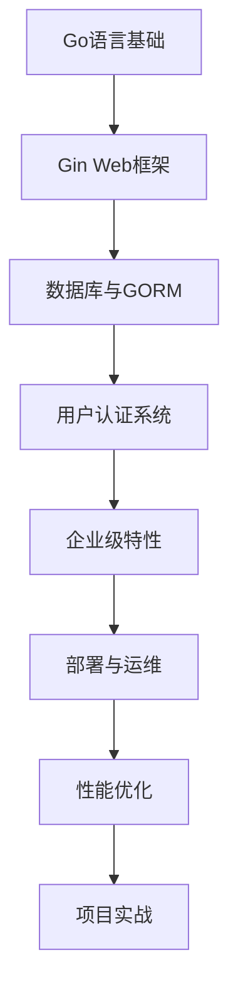

## 为什么选择这本教程？

### 🎯 实战导向
不同于传统教程的理论堆砌，本教程以真实的开源项目**New-API**为基础，让你在实践中学习Go语言企业级开发。

### 📚 体系完整
从环境搭建到项目部署，涵盖Go语言企业级开发的方方面面：
- **基础篇**：Go语言核心特性与语法
- **Web开发篇**：Gin框架与RESTful API设计
- **数据库篇**：GORM实战与数据库设计
- **企业级特性篇**：配置管理、日志监控、缓存优化
- **运维篇**：部署、测试与质量保证
- **进阶篇**：微服务架构与性能调优

### 🔥 技术前沿
紧跟Go语言生态发展，涵盖最新的开发工具和最佳实践：
- Go 1.21+ 新特性应用
- 现代化的开发工具链
- 云原生部署实践
- 微服务架构设计

### 💼 企业实践
基于真实企业项目经验总结，包含：
- 代码规范与项目结构
- 错误处理与日志规范
- 性能优化与监控
- 安全防护与最佳实践

## 学习路径

## 适合人群

- 🎓 **Go语言初学者**：想要系统学习Go语言企业级开发
- 💻 **后端开发者**：希望转向Go语言技术栈
- 🏢 **企业开发者**：需要掌握Go语言企业级开发实践
- 🚀 **技术负责人**：了解Go语言项目架构与最佳实践

## 开始学习

准备好开始你的Go语言企业级开发之旅了吗？

[立即开始 →](/第1章-Go语言环境搭建与项目初始化)

---

> 💡 **提示**：建议按照章节顺序学习，每章都有配套的代码示例和练习。遇到问题可以参考[常见问题解答](/附录C-常见问题与解决方案)。