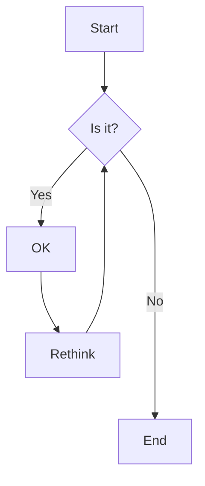
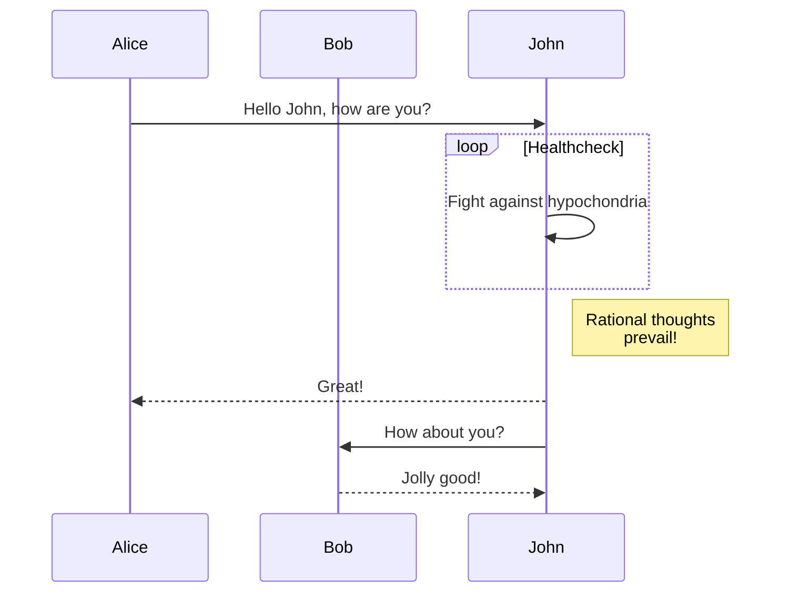
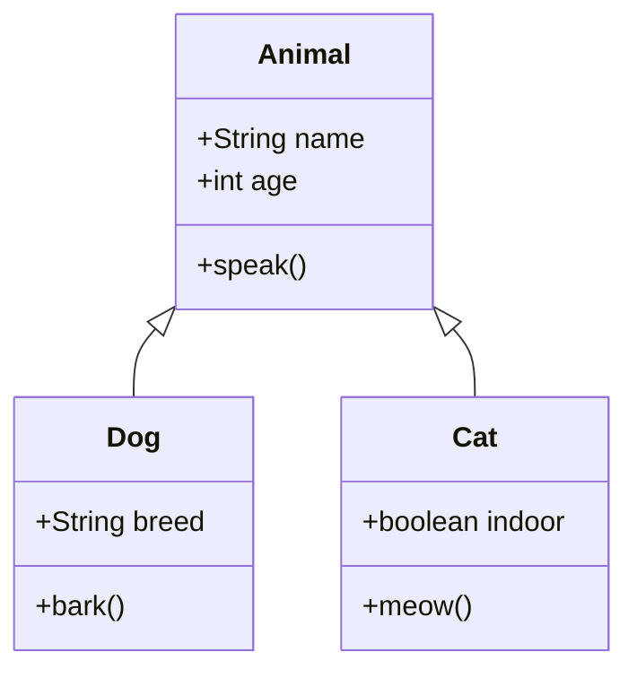
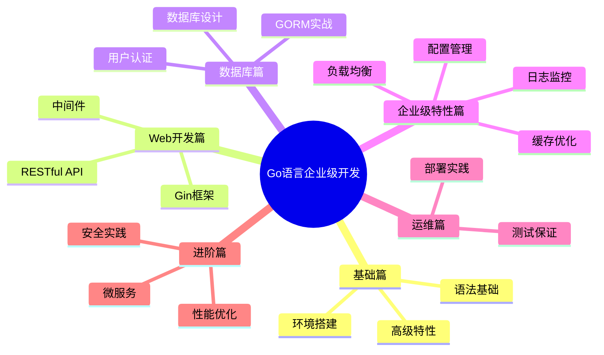

# Mermaid 测试页面

## 流程图测试



## 序列图测试



## 类图测试



## Git 图测试

```mermaid
gitgraph
    commit
    commit
    branch develop
    commit
    commit
    commit
    checkout main
    commit
    commit
    merge develop
    commit
    commit
```

## 思维导图测试

