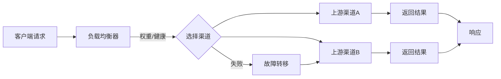
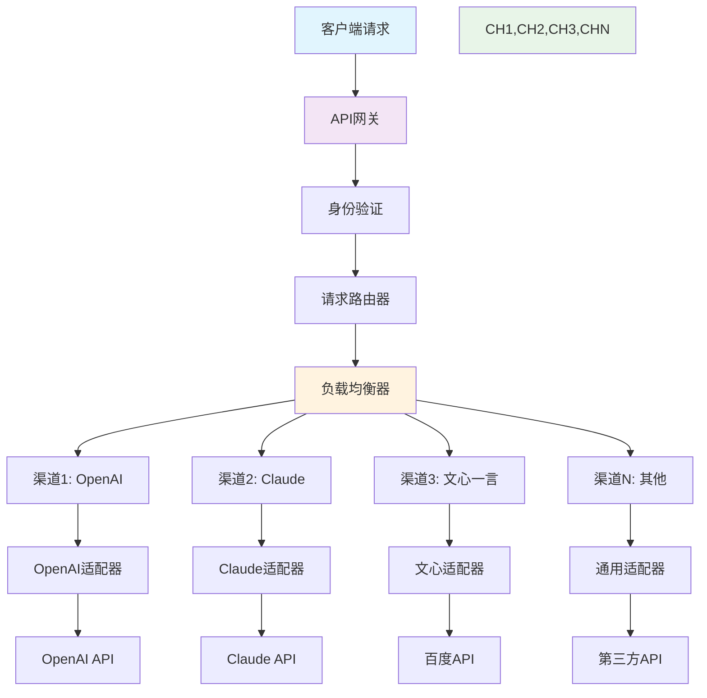
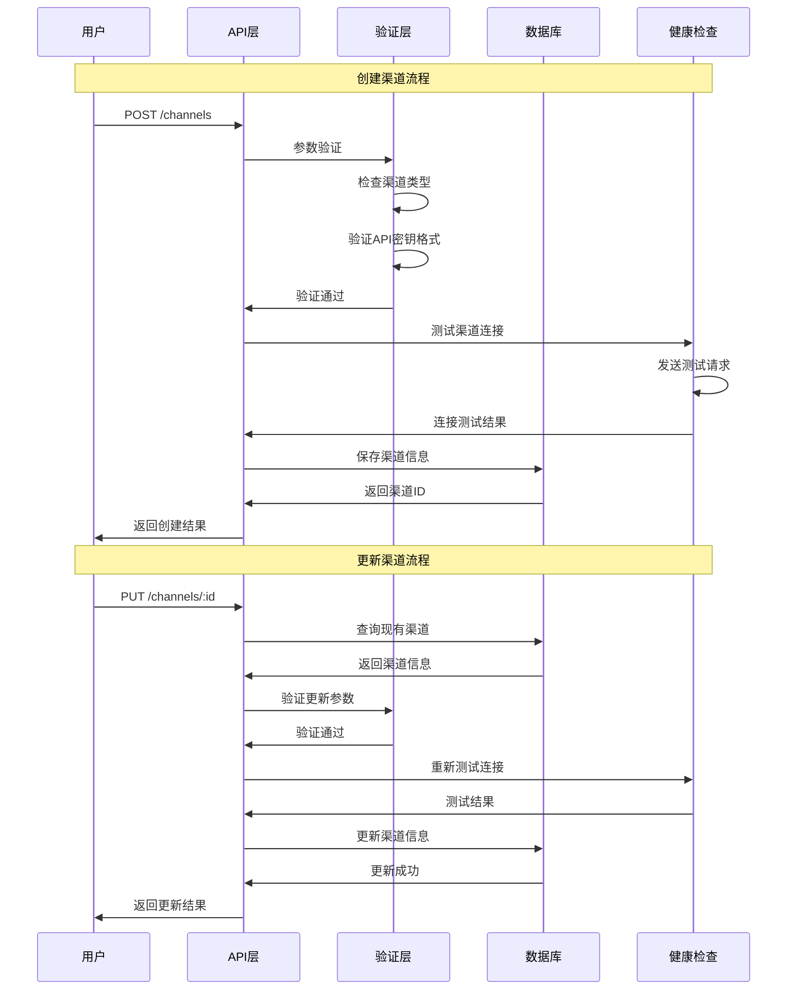
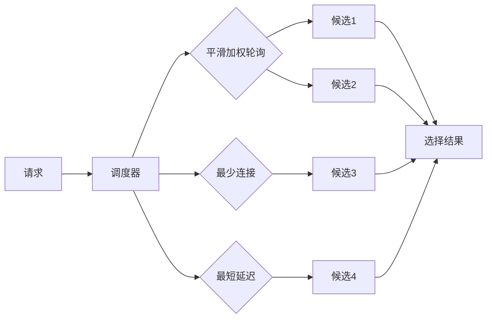
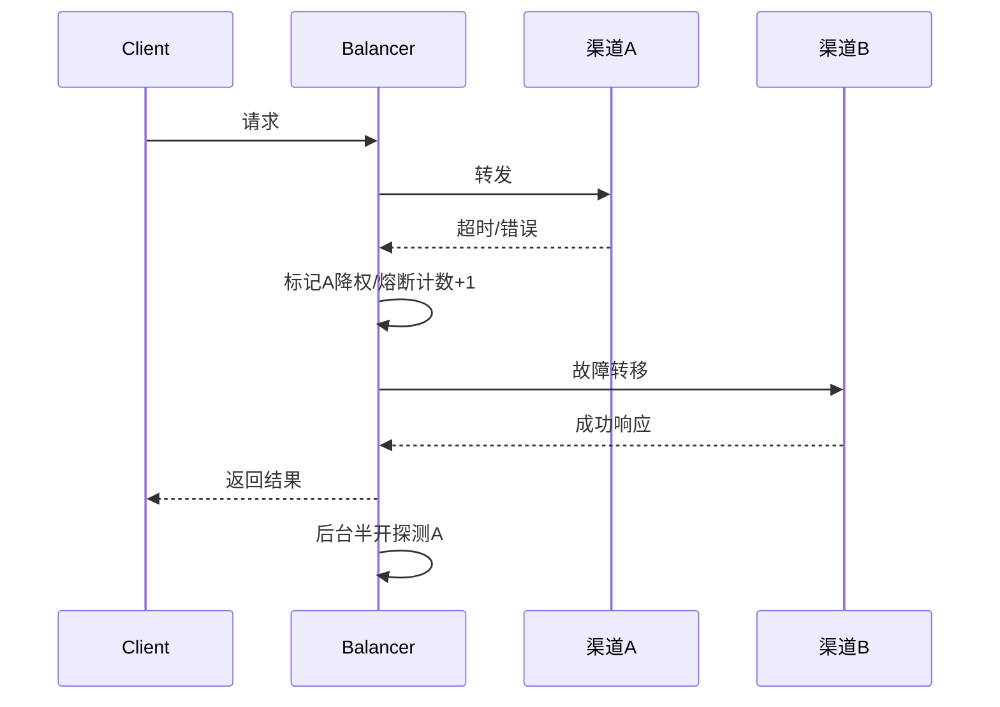
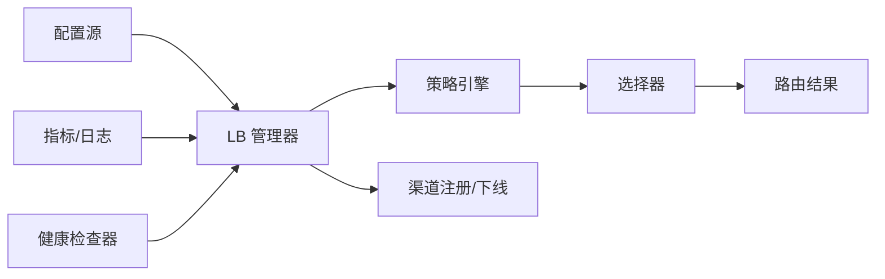
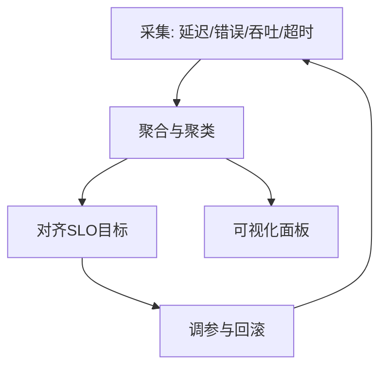

# 第10章 渠道管理与负载均衡



图1：渠道选择与故障转移流程

在企业级AI服务中，渠道管理是确保服务稳定性和成本控制的关键组件。本章将深入探讨New API项目中的渠道管理系统设计，包括多渠道配置、负载均衡策略、故障转移机制、成本优化等核心功能的实现。

## 核心概念详解

### 渠道管理核心概念

**渠道（Channel）**
- 定义：与某一上游AI服务提供商的一组访问参数与策略的封装
- 包含要素：渠道类型、API密钥、支持模型列表、限流配置、健康度指标等
- 作用：统一管理不同服务商的接入配置，实现多源服务的统一调度

**权重（Weight）**
- 定义：用于调节各渠道被选中的相对概率或优先级的数值参数
- 计算方式：权重越高，在负载均衡中被选中的概率越大
- 应用场景：成本控制、性能优化、流量分配

**健康度（Health）**
- 定义：综合超时率、错误率、平均延迟等指标评估出的渠道可用性指标
- 评估维度：响应时间、成功率、连接稳定性、配额余量
- 动态调整：根据实时监控数据动态更新健康度评分

### 容错机制核心概念

**熔断器（Circuit Breaker）**
- 定义：当渠道错误率或延迟超过阈值时，暂时停止向该渠道发送请求的保护机制
- 状态转换：关闭 → 开启 → 半开 → 关闭的循环状态机
- 恢复策略：通过半开状态的探测请求判断渠道是否恢复正常

**服务降级（Degrade）**
- 定义：在部分服务能力不可用时，提供功能简化但可接受的响应策略
- 降级策略：返回缓存结果、使用备用模型、提供默认响应等
- 触发条件：渠道全部不可用、响应时间过长、系统负载过高

**故障转移（Failover）**
- 定义：主要渠道失败后，快速切换到备选渠道继续提供服务的机制
- 转移策略：按优先级顺序、按权重随机、按健康度排序
- 回切机制：主渠道恢复后自动或手动切回主渠道

### 负载均衡核心概念

**负载均衡策略**
- 轮询（Round Robin）：按顺序依次分配请求到各个渠道
- 加权轮询（Weighted Round Robin）：根据权重比例分配请求
- 最少连接（Least Connections）：优先选择当前连接数最少的渠道
- 优先级（Priority）：按设定的优先级顺序选择渠道

**一致性哈希**
- 定义：通过哈希算法将请求映射到固定的渠道，保证相同请求总是路由到同一渠道
- 优势：减少缓存失效、保持会话一致性
- 应用场景：有状态服务、缓存优化、会话保持

## 10.1 渠道系统设计



图2：渠道系统整体架构图

### 核心概念解析

**渠道（Channel）**：代表一个具体的AI服务提供商接入点，包含认证信息、配置参数、状态管理等。每个渠道封装了与特定上游服务商交互所需的全部信息。

**适配器模式（Adapter Pattern）**：用于统一不同服务商的API接口，将各种不同的API格式转换为系统内部的标准格式，实现了良好的解耦和扩展性。

**权重与优先级**：权重用于负载均衡时的流量分配，优先级用于故障转移时的渠道选择顺序。

**健康检查**：通过定期的探活请求监控渠道状态，及时发现异常并进行故障转移。

### 10.1.1 渠道模型设计

渠道系统需要支持多种AI服务提供商，每个渠道都有其特定的配置和限制：

```go
// 渠道状态常量
const (
    ChannelStatusEnabled  = 1 // 启用
    ChannelStatusDisabled = 2 // 禁用
    ChannelStatusTesting  = 3 // 测试中
    ChannelStatusError    = 4 // 错误状态
)

// 渠道类型常量
const (
    ChannelTypeOpenAI    = 1  // OpenAI
    ChannelTypeAzure     = 2  // Azure OpenAI
    ChannelTypeClaude    = 3  // Anthropic Claude
    ChannelTypeGemini    = 4  // Google Gemini
    ChannelTypeBaidu     = 5  // 百度文心一言
    ChannelTypeAlibaba   = 6  // 阿里通义千问
    ChannelTypeTencent   = 7  // 腾讯混元
    ChannelTypeCustom    = 99 // 自定义渠道
)

// 渠道模型
type Channel struct {
    ID          int    `json:"id" gorm:"primaryKey"`
    Type        int    `json:"type" gorm:"index"`
    Key         string `json:"key" gorm:"type:varchar(255)"`
    Name        string `json:"name" gorm:"type:varchar(100)"`
    Status      int    `json:"status" gorm:"default:1;index"`
    Weight      int    `json:"weight" gorm:"default:1"`
    Priority    int    `json:"priority" gorm:"default:0"`
    
    // 连接配置
    BaseURL     string `json:"base_url" gorm:"type:varchar(500)"`
    APIVersion  string `json:"api_version" gorm:"type:varchar(50)"`
    
    // 限制配置
    Models      string `json:"models" gorm:"type:text"`        // 支持的模型列表
    Groups      string `json:"groups" gorm:"type:text"`        // 允许的用户组
    
    // 配额和成本
    UsedQuota   int64   `json:"used_quota" gorm:"default:0"`
    RemainQuota int64   `json:"remain_quota" gorm:"default:0"`
    UnlimitedQuota bool `json:"unlimited_quota" gorm:"default:false"`
    
    // 成本配置
    ModelRatio  string  `json:"model_ratio" gorm:"type:text"`   // 模型价格倍率
    
    // 性能配置
    Config      ChannelConfig `json:"config" gorm:"embedded;embeddedPrefix:config_"`
    
    // 统计信息
    RequestCount    int64   `json:"request_count" gorm:"default:0"`
    ResponseTime    float64 `json:"response_time" gorm:"default:0"`
    ErrorRate       float64 `json:"error_rate" gorm:"default:0"`
    LastTestTime    int64   `json:"last_test_time" gorm:"default:0"`
    
    // 时间戳
    CreatedTime int64 `json:"created_time" gorm:"bigint"`
    UpdatedTime int64 `json:"updated_time" gorm:"bigint"`
    TestTime    int64 `json:"test_time" gorm:"bigint"`
}

// 渠道配置
type ChannelConfig struct {
    // 连接配置
    Timeout         int    `json:"timeout" gorm:"default:30"`           // 超时时间(秒)
    MaxRetries      int    `json:"max_retries" gorm:"default:3"`        // 最大重试次数
    RetryDelay      int    `json:"retry_delay" gorm:"default:1"`        // 重试延迟(秒)
    
    // 限流配置
    RPM             int    `json:"rpm" gorm:"default:0"`                // 每分钟请求数限制
    RPD             int    `json:"rpd" gorm:"default:0"`                // 每日请求数限制
    TPM             int    `json:"tpm" gorm:"default:0"`                // 每分钟Token数限制
    
    // 代理配置
    ProxyURL        string `json:"proxy_url" gorm:"type:varchar(500)"`  // 代理地址
    
    // 自定义头部
    Headers         string `json:"headers" gorm:"type:text"`            // 自定义HTTP头
    
    // 其他配置
    Region          string `json:"region" gorm:"type:varchar(50)"`      // 区域
    Organization    string `json:"organization" gorm:"type:varchar(100)"` // 组织ID
    
    // 健康检查
    HealthCheckURL  string `json:"health_check_url" gorm:"type:varchar(500)"` // 健康检查URL
    HealthCheckInterval int `json:"health_check_interval" gorm:"default:300"` // 健康检查间隔(秒)
}

// 渠道使用记录
type ChannelUsage struct {
    ID          int     `json:"id" gorm:"primaryKey"`
    ChannelID   int     `json:"channel_id" gorm:"index"`
    UserID      int     `json:"user_id" gorm:"index"`
    TokenID     int     `json:"token_id" gorm:"index"`
    RequestID   string  `json:"request_id" gorm:"type:varchar(100);index"`
    Model       string  `json:"model" gorm:"type:varchar(100);index"`
    
    // 请求信息
    PromptTokens     int     `json:"prompt_tokens" gorm:"default:0"`
    CompletionTokens int     `json:"completion_tokens" gorm:"default:0"`
    TotalTokens      int     `json:"total_tokens" gorm:"default:0"`
    
    // 成本信息
    Cost            float64 `json:"cost" gorm:"type:decimal(10,6);default:0"`
    OriginalCost    float64 `json:"original_cost" gorm:"type:decimal(10,6);default:0"`
    
    // 性能信息
    ResponseTime    int     `json:"response_time" gorm:"default:0"` // 响应时间(毫秒)
    Success         bool    `json:"success" gorm:"default:true"`
    ErrorMessage    string  `json:"error_message" gorm:"type:text"`
    
    // 时间戳
    CreatedTime     int64   `json:"created_time" gorm:"bigint;index"`
    
    // 关联信息
    Channel Channel `json:"channel,omitempty" gorm:"foreignKey:ChannelID"`
    User    User    `json:"user,omitempty" gorm:"foreignKey:UserID"`
    Token   Token   `json:"token,omitempty" gorm:"foreignKey:TokenID"`
}

// 渠道统计信息
type ChannelStats struct {
    ChannelID       int     `json:"channel_id"`
    TotalRequests   int64   `json:"total_requests"`
    SuccessRequests int64   `json:"success_requests"`
    FailedRequests  int64   `json:"failed_requests"`
    TotalTokens     int64   `json:"total_tokens"`
    TotalCost       float64 `json:"total_cost"`
    AvgResponseTime float64 `json:"avg_response_time"`
    ErrorRate       float64 `json:"error_rate"`
    LastUsedTime    int64   `json:"last_used_time"`
}
```

### 10.1.2 渠道适配器设计

为了统一不同AI服务提供商的接口，我们需要设计渠道适配器：

```go
// 渠道适配器接口
type ChannelAdapter interface {
    // 基础信息
    GetType() int
    GetName() string
    
    // 请求处理
    DoRequest(ctx context.Context, request *ChatRequest) (*ChatResponse, error)
    DoStreamRequest(ctx context.Context, request *ChatRequest) (<-chan *StreamResponse, error)
    
    // 模型管理
    GetModels() []string
    ValidateModel(model string) bool
    
    // 配额管理
    GetBalance() (float64, error)
    
    // 健康检查
    HealthCheck() error
    
    // 配置验证
    ValidateConfig(config map[string]interface{}) error
}

// 基础适配器
type BaseAdapter struct {
    Channel *Channel
    Client  *http.Client
}

// OpenAI适配器
type OpenAIAdapter struct {
    BaseAdapter
}

func NewOpenAIAdapter(channel *Channel) *OpenAIAdapter {
    client := &http.Client{
        Timeout: time.Duration(channel.Config.Timeout) * time.Second,
    }
    
    // 配置代理
    if channel.Config.ProxyURL != "" {
        proxyURL, err := url.Parse(channel.Config.ProxyURL)
        if err == nil {
            client.Transport = &http.Transport{
                Proxy: http.ProxyURL(proxyURL),
            }
        }
    }
    
    return &OpenAIAdapter{
        BaseAdapter: BaseAdapter{
            Channel: channel,
            Client:  client,
        },
    }
}

func (a *OpenAIAdapter) GetType() int {
    return ChannelTypeOpenAI
}

func (a *OpenAIAdapter) GetName() string {
    return "OpenAI"
}

func (a *OpenAIAdapter) DoRequest(ctx context.Context, request *ChatRequest) (*ChatResponse, error) {
    // 构建OpenAI API请求
    openaiReq := &OpenAIChatRequest{
        Model:       request.Model,
        Messages:    convertMessages(request.Messages),
        Temperature: request.Temperature,
        MaxTokens:   request.MaxTokens,
        Stream:      false,
    }
    
    // 序列化请求
    reqBody, err := json.Marshal(openaiReq)
    if err != nil {
        return nil, fmt.Errorf("序列化请求失败: %v", err)
    }
    
    // 创建HTTP请求
    url := fmt.Sprintf("%s/v1/chat/completions", strings.TrimSuffix(a.Channel.BaseURL, "/"))
    httpReq, err := http.NewRequestWithContext(ctx, "POST", url, bytes.NewBuffer(reqBody))
    if err != nil {
        return nil, fmt.Errorf("创建HTTP请求失败: %v", err)
    }
    
    // 设置请求头
    httpReq.Header.Set("Content-Type", "application/json")
    httpReq.Header.Set("Authorization", "Bearer "+a.Channel.Key)
    
    // 添加自定义头部
    if a.Channel.Config.Headers != "" {
        var headers map[string]string
        if err := json.Unmarshal([]byte(a.Channel.Config.Headers), &headers); err == nil {
            for k, v := range headers {
                httpReq.Header.Set(k, v)
            }
        }
    }
    
    // 发送请求
    startTime := time.Now()
    resp, err := a.Client.Do(httpReq)
    responseTime := time.Since(startTime)
    
    if err != nil {
        return nil, fmt.Errorf("请求失败: %v", err)
    }
    defer resp.Body.Close()
    
    // 读取响应
    respBody, err := io.ReadAll(resp.Body)
    if err != nil {
        return nil, fmt.Errorf("读取响应失败: %v", err)
    }
    
    // 检查HTTP状态码
    if resp.StatusCode != http.StatusOK {
        var errorResp OpenAIErrorResponse
        if err := json.Unmarshal(respBody, &errorResp); err == nil {
            return nil, fmt.Errorf("API错误: %s", errorResp.Error.Message)
        }
        return nil, fmt.Errorf("HTTP错误: %d", resp.StatusCode)
    }
    
    // 解析响应
    var openaiResp OpenAIChatResponse
    if err := json.Unmarshal(respBody, &openaiResp); err != nil {
        return nil, fmt.Errorf("解析响应失败: %v", err)
    }
    
    // 转换为统一格式
    response := &ChatResponse{
        ID:      openaiResp.ID,
        Object:  openaiResp.Object,
        Created: openaiResp.Created,
        Model:   openaiResp.Model,
        Usage: Usage{
            PromptTokens:     openaiResp.Usage.PromptTokens,
            CompletionTokens: openaiResp.Usage.CompletionTokens,
            TotalTokens:      openaiResp.Usage.TotalTokens,
        },
        ResponseTime: int(responseTime.Milliseconds()),
    }
    
    // 转换选择
    for _, choice := range openaiResp.Choices {
        response.Choices = append(response.Choices, Choice{
            Index: choice.Index,
            Message: Message{
                Role:    choice.Message.Role,
                Content: choice.Message.Content,
            },
            FinishReason: choice.FinishReason,
        })
    }
    
    return response, nil
}

func (a *OpenAIAdapter) GetModels() []string {
    if a.Channel.Models == "" {
        return []string{"gpt-3.5-turbo", "gpt-4", "gpt-4-turbo"}
    }
    
    var models []string
    json.Unmarshal([]byte(a.Channel.Models), &models)
    return models
}

func (a *OpenAIAdapter) ValidateModel(model string) bool {
    models := a.GetModels()
    for _, m := range models {
        if m == model {
            return true
        }
    }
    return false
}

func (a *OpenAIAdapter) HealthCheck() error {
    ctx, cancel := context.WithTimeout(context.Background(), 10*time.Second)
    defer cancel()
    
    // 发送简单的测试请求
    testReq := &ChatRequest{
        Model: "gpt-3.5-turbo",
        Messages: []Message{
            {
                Role:    "user",
                Content: "Hello",
            },
        },
        MaxTokens: 1,
    }
    
    _, err := a.DoRequest(ctx, testReq)
    return err
}

// OpenAI API结构体
type OpenAIChatRequest struct {
    Model       string                 `json:"model"`
    Messages    []OpenAIMessage        `json:"messages"`
    Temperature *float64               `json:"temperature,omitempty"`
    MaxTokens   *int                   `json:"max_tokens,omitempty"`
    Stream      bool                   `json:"stream"`
}

type OpenAIMessage struct {
    Role    string `json:"role"`
    Content string `json:"content"`
}

type OpenAIChatResponse struct {
    ID      string              `json:"id"`
    Object  string              `json:"object"`
    Created int64               `json:"created"`
    Model   string              `json:"model"`
    Choices []OpenAIChoice      `json:"choices"`
    Usage   OpenAIUsage         `json:"usage"`
}

type OpenAIChoice struct {
    Index        int           `json:"index"`
    Message      OpenAIMessage `json:"message"`
    FinishReason string        `json:"finish_reason"`
}

type OpenAIUsage struct {
    PromptTokens     int `json:"prompt_tokens"`
    CompletionTokens int `json:"completion_tokens"`
    TotalTokens      int `json:"total_tokens"`
}

type OpenAIErrorResponse struct {
    Error struct {
        Message string `json:"message"`
        Type    string `json:"type"`
        Code    string `json:"code"`
    } `json:"error"`
}

// 消息转换函数
func convertMessages(messages []Message) []OpenAIMessage {
    var openaiMessages []OpenAIMessage
    for _, msg := range messages {
        openaiMessages = append(openaiMessages, OpenAIMessage{
            Role:    msg.Role,
            Content: msg.Content,
        })
    }
    return openaiMessages
}
```

## 10.2 渠道CRUD操作



图3：渠道CRUD操作流程图

### 操作要点说明

**参数验证**：确保渠道类型、API密钥、配置参数的有效性，防止无效配置导致的系统异常。

**连接测试**：在创建或更新渠道时自动进行连接测试，确保渠道配置正确且可用。

**事务处理**：使用数据库事务确保渠道信息的一致性，避免部分更新导致的数据不一致。

**权限控制**：只有管理员用户才能进行渠道的增删改操作，普通用户只能查看。

### 10.2.1 创建渠道

```go
// 创建渠道请求
type CreateChannelRequest struct {
    Type        int     `json:"type" binding:"required,min=1"`
    Key         string  `json:"key" binding:"required"`
    Name        string  `json:"name" binding:"required,max=100"`
    BaseURL     string  `json:"base_url,omitempty"`
    APIVersion  string  `json:"api_version,omitempty"`
    Weight      int     `json:"weight,omitempty"`
    Priority    int     `json:"priority,omitempty"`
    Models      []string `json:"models,omitempty"`
    Groups      []string `json:"groups,omitempty"`
    
    // 配额配置
    RemainQuota    int64 `json:"remain_quota,omitempty"`
    UnlimitedQuota bool  `json:"unlimited_quota,omitempty"`
    
    // 模型价格倍率
    ModelRatio map[string]float64 `json:"model_ratio,omitempty"`
    
    // 配置选项
    Config ChannelConfigRequest `json:"config,omitempty"`
}

type ChannelConfigRequest struct {
    Timeout         int    `json:"timeout,omitempty"`
    MaxRetries      int    `json:"max_retries,omitempty"`
    RetryDelay      int    `json:"retry_delay,omitempty"`
    RPM             int    `json:"rpm,omitempty"`
    RPD             int    `json:"rpd,omitempty"`
    TPM             int    `json:"tpm,omitempty"`
    ProxyURL        string `json:"proxy_url,omitempty"`
    Headers         map[string]string `json:"headers,omitempty"`
    Region          string `json:"region,omitempty"`
    Organization    string `json:"organization,omitempty"`
    HealthCheckURL  string `json:"health_check_url,omitempty"`
    HealthCheckInterval int `json:"health_check_interval,omitempty"`
}

// 创建渠道响应
type CreateChannelResponse struct {
    Success bool     `json:"success"`
    Message string   `json:"message"`
    Data    *Channel `json:"data,omitempty"`
}

// 创建渠道处理器
// 该函数负责处理创建新渠道的HTTP请求，包含完整的参数验证、权限检查和数据持久化流程
func CreateChannel(c *gin.Context) {
    var req CreateChannelRequest
    
    // 步骤1: 解析并验证请求参数
    // 使用Gin的ShouldBindJSON自动将JSON请求体绑定到结构体
    if err := c.ShouldBindJSON(&req); err != nil {
        c.JSON(http.StatusBadRequest, gin.H{
            "success": false,
            "message": "请求参数错误: " + err.Error(),
        })
        return
    }
    
    // 步骤2: 权限验证
    // 只有根用户和管理员用户才能创建渠道，确保系统安全性
    user := c.MustGet("user").(*User)
    if user.Role != common.RoleRootUser && user.Role != common.RoleAdminUser {
        c.JSON(http.StatusForbidden, gin.H{
            "success": false,
            "message": "权限不足",
        })
        return
    }
    
    // 步骤3: 业务逻辑验证
    // 验证渠道类型是否在支持的类型列表中（如OpenAI、Claude、Gemini等）
    if !isValidChannelType(req.Type) {
        c.JSON(http.StatusBadRequest, gin.H{
            "success": false,
            "message": "无效的渠道类型",
        })
        return
    }
    
    // 设置默认值
    if req.Weight <= 0 {
        req.Weight = 1
    }
    
    if req.BaseURL == "" {
        req.BaseURL = getDefaultBaseURL(req.Type)
    }
    
    // 序列化配置
    modelsJSON, _ := json.Marshal(req.Models)
    groupsJSON, _ := json.Marshal(req.Groups)
    modelRatioJSON, _ := json.Marshal(req.ModelRatio)
    headersJSON, _ := json.Marshal(req.Config.Headers)
    
    // 创建渠道配置
    config := ChannelConfig{
        Timeout:         getIntValue(req.Config.Timeout, 30),
        MaxRetries:      getIntValue(req.Config.MaxRetries, 3),
        RetryDelay:      getIntValue(req.Config.RetryDelay, 1),
        RPM:             req.Config.RPM,
        RPD:             req.Config.RPD,
        TPM:             req.Config.TPM,
        ProxyURL:        req.Config.ProxyURL,
        Headers:         string(headersJSON),
        Region:          req.Config.Region,
        Organization:    req.Config.Organization,
        HealthCheckURL:  req.Config.HealthCheckURL,
        HealthCheckInterval: getIntValue(req.Config.HealthCheckInterval, 300),
    }
    
    // 创建渠道
    channel := &Channel{
        Type:           req.Type,
        Key:            req.Key,
        Name:           req.Name,
        Status:         ChannelStatusEnabled,
        Weight:         req.Weight,
        Priority:       req.Priority,
        BaseURL:        req.BaseURL,
        APIVersion:     req.APIVersion,
        Models:         string(modelsJSON),
        Groups:         string(groupsJSON),
        RemainQuota:    req.RemainQuota,
        UnlimitedQuota: req.UnlimitedQuota,
        ModelRatio:     string(modelRatioJSON),
        Config:         config,
        CreatedTime:    time.Now().Unix(),
        UpdatedTime:    time.Now().Unix(),
    }
    
    // 保存到数据库
    if err := common.DB.Create(channel).Error; err != nil {
        c.JSON(http.StatusInternalServerError, gin.H{
            "success": false,
            "message": "创建渠道失败: " + err.Error(),
        })
        return
    }
    
    // 测试渠道连接
    go testChannelConnection(channel.ID)
    
    // 记录操作日志
    RecordLog(user.ID, LogTypeChannelCreate, fmt.Sprintf("创建渠道: %s", channel.Name))
    
    c.JSON(http.StatusCreated, CreateChannelResponse{
        Success: true,
        Message: "渠道创建成功",
        Data:    channel,
    })
}

// 验证渠道类型
func isValidChannelType(channelType int) bool {
    validTypes := []int{
        ChannelTypeOpenAI, ChannelTypeAzure, ChannelTypeClaude,
        ChannelTypeGemini, ChannelTypeBaidu, ChannelTypeAlibaba,
        ChannelTypeTencent, ChannelTypeCustom,
    }
    
    for _, t := range validTypes {
        if t == channelType {
            return true
        }
    }
    return false
}

// 获取默认BaseURL
func getDefaultBaseURL(channelType int) string {
    switch channelType {
    case ChannelTypeOpenAI:
        return "https://api.openai.com"
    case ChannelTypeAzure:
        return "https://your-resource.openai.azure.com"
    case ChannelTypeClaude:
        return "https://api.anthropic.com"
    case ChannelTypeGemini:
        return "https://generativelanguage.googleapis.com"
    default:
        return ""
    }
}

// 获取整数值，如果为0则使用默认值
func getIntValue(value, defaultValue int) int {
    if value <= 0 {
        return defaultValue
    }
    return value
}

// 测试渠道连接
func testChannelConnection(channelID int) {
    var channel Channel
    if err := common.DB.First(&channel, channelID).Error; err != nil {
        return
    }
    
    adapter := CreateChannelAdapter(&channel)
    if adapter == nil {
        return
    }
    
    // 执行健康检查
    err := adapter.HealthCheck()
    
    // 更新测试结果
    updates := map[string]interface{}{
        "last_test_time": time.Now().Unix(),
        "test_time":      time.Now().Unix(),
    }
    
    if err != nil {
        updates["status"] = ChannelStatusError
        common.SysLog.Errorf("渠道 %s 连接测试失败: %v", channel.Name, err)
    } else {
        if channel.Status == ChannelStatusError {
            updates["status"] = ChannelStatusEnabled
        }
        common.SysLog.Infof("渠道 %s 连接测试成功", channel.Name)
    }
    
    common.DB.Model(&channel).Updates(updates)
}
```

### 10.2.2 查询渠道

```go
// 渠道列表请求
type ChannelListRequest struct {
    Page     int    `form:"page,default=1"`
    PageSize int    `form:"page_size,default=20"`
    Type     int    `form:"type,omitempty"`
    Status   int    `form:"status,omitempty"`
    Keyword  string `form:"keyword,omitempty"`
    OrderBy  string `form:"order_by,default=created_time"`
    Order    string `form:"order,default=desc"`
}

// 渠道列表响应
type ChannelListResponse struct {
    Success bool         `json:"success"`
    Message string       `json:"message"`
    Data    *ChannelList `json:"data,omitempty"`
}

type ChannelList struct {
    Channels   []ChannelInfo `json:"channels"`
    Total      int64         `json:"total"`
    Page       int           `json:"page"`
    PageSize   int           `json:"page_size"`
    TotalPages int           `json:"total_pages"`
}

type ChannelInfo struct {
    ID              int           `json:"id"`
    Type            int           `json:"type"`
    TypeName        string        `json:"type_name"`
    Name            string        `json:"name"`
    Status          int           `json:"status"`
    StatusName      string        `json:"status_name"`
    Weight          int           `json:"weight"`
    Priority        int           `json:"priority"`
    BaseURL         string        `json:"base_url"`
    Models          []string      `json:"models"`
    Groups          []string      `json:"groups"`
    RemainQuota     int64         `json:"remain_quota"`
    UsedQuota       int64         `json:"used_quota"`
    UnlimitedQuota  bool          `json:"unlimited_quota"`
    RequestCount    int64         `json:"request_count"`
    ResponseTime    float64       `json:"response_time"`
    ErrorRate       float64       `json:"error_rate"`
    LastTestTime    int64         `json:"last_test_time"`
    CreatedTime     int64         `json:"created_time"`
    UpdatedTime     int64         `json:"updated_time"`
    Config          ChannelConfig `json:"config"`
    Stats           *ChannelStats `json:"stats,omitempty"`
}

// 获取渠道列表
func GetChannelList(c *gin.Context) {
    var req ChannelListRequest
    if err := c.ShouldBindQuery(&req); err != nil {
        c.JSON(http.StatusBadRequest, gin.H{
            "success": false,
            "message": "请求参数错误: " + err.Error(),
        })
        return
    }
    
    // 检查用户权限
    user := c.MustGet("user").(*User)
    if user.Role != common.RoleRootUser && user.Role != common.RoleAdminUser {
        c.JSON(http.StatusForbidden, gin.H{
            "success": false,
            "message": "权限不足",
        })
        return
    }
    
    // 构建查询
    query := common.DB.Model(&Channel{})
    
    // 添加过滤条件
    if req.Type > 0 {
        query = query.Where("type = ?", req.Type)
    }
    
    if req.Status > 0 {
        query = query.Where("status = ?", req.Status)
    }
    
    if req.Keyword != "" {
        query = query.Where("name LIKE ? OR base_url LIKE ?", "%"+req.Keyword+"%", "%"+req.Keyword+"%")
    }
    
    // 获取总数
    var total int64
    query.Count(&total)
    
    // 添加排序
    orderClause := req.OrderBy
    if req.Order == "desc" {
        orderClause += " DESC"
    } else {
        orderClause += " ASC"
    }
    query = query.Order(orderClause)
    
    // 分页
    offset := (req.Page - 1) * req.PageSize
    query = query.Offset(offset).Limit(req.PageSize)
    
    // 执行查询
    var channels []Channel
    if err := query.Find(&channels).Error; err != nil {
        c.JSON(http.StatusInternalServerError, gin.H{
            "success": false,
            "message": "查询渠道失败: " + err.Error(),
        })
        return
    }
    
    // 转换为响应格式
    channelInfos := make([]ChannelInfo, len(channels))
    for i, channel := range channels {
        var models []string
        var groups []string
        
        if channel.Models != "" {
            json.Unmarshal([]byte(channel.Models), &models)
        }
        
        if channel.Groups != "" {
            json.Unmarshal([]byte(channel.Groups), &groups)
        }
        
        channelInfos[i] = ChannelInfo{
            ID:              channel.ID,
            Type:            channel.Type,
            TypeName:        getChannelTypeName(channel.Type),
            Name:            channel.Name,
            Status:          channel.Status,
            StatusName:      getChannelStatusName(channel.Status),
            Weight:          channel.Weight,
            Priority:        channel.Priority,
            BaseURL:         channel.BaseURL,
            Models:          models,
            Groups:          groups,
            RemainQuota:     channel.RemainQuota,
            UsedQuota:       channel.UsedQuota,
            UnlimitedQuota:  channel.UnlimitedQuota,
            RequestCount:    channel.RequestCount,
            ResponseTime:    channel.ResponseTime,
            ErrorRate:       channel.ErrorRate,
            LastTestTime:    channel.LastTestTime,
            CreatedTime:     channel.CreatedTime,
            UpdatedTime:     channel.UpdatedTime,
            Config:          channel.Config,
        }
        
        // 获取统计信息
        if stats := getChannelStats(channel.ID); stats != nil {
            channelInfos[i].Stats = stats
        }
    }
    
    // 计算总页数
    totalPages := int(math.Ceil(float64(total) / float64(req.PageSize)))
    
    c.JSON(http.StatusOK, ChannelListResponse{
        Success: true,
        Message: "获取渠道列表成功",
        Data: &ChannelList{
            Channels:   channelInfos,
            Total:      total,
            Page:       req.Page,
            PageSize:   req.PageSize,
            TotalPages: totalPages,
        },
    })
}

// 获取渠道类型名称
func getChannelTypeName(channelType int) string {
    switch channelType {
    case ChannelTypeOpenAI:
        return "OpenAI"
    case ChannelTypeAzure:
        return "Azure OpenAI"
    case ChannelTypeClaude:
        return "Anthropic Claude"
    case ChannelTypeGemini:
        return "Google Gemini"
    case ChannelTypeBaidu:
        return "百度文心一言"
    case ChannelTypeAlibaba:
        return "阿里通义千问"
    case ChannelTypeTencent:
        return "腾讯混元"
    case ChannelTypeCustom:
        return "自定义"
    default:
        return "未知"
    }
}

// 获取渠道状态名称
func getChannelStatusName(status int) string {
    switch status {
    case ChannelStatusEnabled:
        return "启用"
    case ChannelStatusDisabled:
        return "禁用"
    case ChannelStatusTesting:
        return "测试中"
    case ChannelStatusError:
        return "错误"
    default:
        return "未知"
    }
}

// 获取渠道统计信息
func getChannelStats(channelID int) *ChannelStats {
    var stats ChannelStats
    
    // 获取总统计
    row := common.DB.Model(&ChannelUsage{}).
        Select("COUNT(*) as total_requests, SUM(CASE WHEN success = true THEN 1 ELSE 0 END) as success_requests, SUM(CASE WHEN success = false THEN 1 ELSE 0 END) as failed_requests, SUM(total_tokens) as total_tokens, SUM(cost) as total_cost, AVG(response_time) as avg_response_time, MAX(created_time) as last_used_time").
        Where("channel_id = ?", channelID).
        Row()
    
    row.Scan(&stats.TotalRequests, &stats.SuccessRequests, &stats.FailedRequests, &stats.TotalTokens, &stats.TotalCost, &stats.AvgResponseTime, &stats.LastUsedTime)
    
    // 计算错误率
    if stats.TotalRequests > 0 {
        stats.ErrorRate = float64(stats.FailedRequests) / float64(stats.TotalRequests) * 100
    }
    
    stats.ChannelID = channelID
    return &stats
}

// 获取单个渠道详情
func GetChannelDetail(c *gin.Context) {
    channelID, err := strconv.Atoi(c.Param("id"))
    if err != nil {
        c.JSON(http.StatusBadRequest, gin.H{
            "success": false,
            "message": "无效的渠道ID",
        })
        return
    }
    
    // 检查用户权限
    user := c.MustGet("user").(*User)
    if user.Role != common.RoleRootUser && user.Role != common.RoleAdminUser {
        c.JSON(http.StatusForbidden, gin.H{
            "success": false,
            "message": "权限不足",
        })
        return
    }
    
    var channel Channel
    if err := common.DB.First(&channel, channelID).Error; err != nil {
        if errors.Is(err, gorm.ErrRecordNotFound) {
            c.JSON(http.StatusNotFound, gin.H{
                "success": false,
                "message": "渠道不存在",
            })
        } else {
            c.JSON(http.StatusInternalServerError, gin.H{
                "success": false,
                "message": "查询渠道失败: " + err.Error(),
            })
        }
        return
    }
    
    // 转换为响应格式
    var models []string
    var groups []string
    var modelRatio map[string]float64
    
    if channel.Models != "" {
        json.Unmarshal([]byte(channel.Models), &models)
    }
    
    if channel.Groups != "" {
        json.Unmarshal([]byte(channel.Groups), &groups)
    }
    
    if channel.ModelRatio != "" {
        json.Unmarshal([]byte(channel.ModelRatio), &modelRatio)
    }
    
    channelInfo := ChannelInfo{
        ID:              channel.ID,
        Type:            channel.Type,
        TypeName:        getChannelTypeName(channel.Type),
        Name:            channel.Name,
        Status:          channel.Status,
        StatusName:      getChannelStatusName(channel.Status),
        Weight:          channel.Weight,
        Priority:        channel.Priority,
        BaseURL:         channel.BaseURL,
        Models:          models,
        Groups:          groups,
        RemainQuota:     channel.RemainQuota,
        UsedQuota:       channel.UsedQuota,
        UnlimitedQuota:  channel.UnlimitedQuota,
        RequestCount:    channel.RequestCount,
        ResponseTime:    channel.ResponseTime,
        ErrorRate:       channel.ErrorRate,
        LastTestTime:    channel.LastTestTime,
        CreatedTime:     channel.CreatedTime,
        UpdatedTime:     channel.UpdatedTime,
        Config:          channel.Config,
        Stats:           getChannelStats(channel.ID),
    }
    
    c.JSON(http.StatusOK, gin.H{
        "success": true,
        "message": "获取渠道详情成功",
        "data":    channelInfo,
    })
}
```

### 10.2.3 更新渠道

```go
// 更新渠道请求
type UpdateChannelRequest struct {
    Name        *string  `json:"name,omitempty"`
    Status      *int     `json:"status,omitempty"`
    Weight      *int     `json:"weight,omitempty"`
    Priority    *int     `json:"priority,omitempty"`
    BaseURL     *string  `json:"base_url,omitempty"`
    APIVersion  *string  `json:"api_version,omitempty"`
    Key         *string  `json:"key,omitempty"`
    Models      []string `json:"models,omitempty"`
    Groups      []string `json:"groups,omitempty"`
    
    // 配额配置
    RemainQuota    *int64 `json:"remain_quota,omitempty"`
    UnlimitedQuota *bool  `json:"unlimited_quota,omitempty"`
    
    // 模型价格倍率
    ModelRatio map[string]float64 `json:"model_ratio,omitempty"`
    
    // 配置选项
    Config *ChannelConfigRequest `json:"config,omitempty"`
}

// 更新渠道处理器
func UpdateChannel(c *gin.Context) {
    channelID, err := strconv.Atoi(c.Param("id"))
    if err != nil {
        c.JSON(http.StatusBadRequest, gin.H{
            "success": false,
            "message": "无效的渠道ID",
        })
        return
    }
    
    var req UpdateChannelRequest
    if err := c.ShouldBindJSON(&req); err != nil {
        c.JSON(http.StatusBadRequest, gin.H{
            "success": false,
            "message": "请求参数错误: " + err.Error(),
        })
        return
    }
    
    // 检查用户权限
    user := c.MustGet("user").(*User)
    if user.Role != common.RoleRootUser && user.Role != common.RoleAdminUser {
        c.JSON(http.StatusForbidden, gin.H{
            "success": false,
            "message": "权限不足",
        })
        return
    }
    
    // 查找渠道
    var channel Channel
    if err := common.DB.First(&channel, channelID).Error; err != nil {
        if errors.Is(err, gorm.ErrRecordNotFound) {
            c.JSON(http.StatusNotFound, gin.H{
                "success": false,
                "message": "渠道不存在",
            })
        } else {
            c.JSON(http.StatusInternalServerError, gin.H{
                "success": false,
                "message": "查询渠道失败: " + err.Error(),
            })
        }
        return
    }
    
    // 构建更新数据
    updates := make(map[string]interface{})
    
    if req.Name != nil {
        updates["name"] = *req.Name
    }
    
    if req.Status != nil {
        if *req.Status < ChannelStatusEnabled || *req.Status > ChannelStatusError {
            c.JSON(http.StatusBadRequest, gin.H{
                "success": false,
                "message": "无效的渠道状态",
            })
            return
        }
        updates["status"] = *req.Status
    }
    
    if req.Weight != nil {
        if *req.Weight <= 0 {
            c.JSON(http.StatusBadRequest, gin.H{
                "success": false,
                "message": "权重必须大于0",
            })
            return
        }
        updates["weight"] = *req.Weight
    }
    
    if req.Priority != nil {
        updates["priority"] = *req.Priority
    }
    
    if req.BaseURL != nil {
        updates["base_url"] = *req.BaseURL
    }
    
    if req.APIVersion != nil {
        updates["api_version"] = *req.APIVersion
    }
    
    if req.Key != nil {
        updates["key"] = *req.Key
    }
    
    if req.Models != nil {
        modelsJSON, _ := json.Marshal(req.Models)
        updates["models"] = string(modelsJSON)
    }
    
    if req.Groups != nil {
        groupsJSON, _ := json.Marshal(req.Groups)
        updates["groups"] = string(groupsJSON)
    }
    
    if req.RemainQuota != nil {
        updates["remain_quota"] = *req.RemainQuota
    }
    
    if req.UnlimitedQuota != nil {
        updates["unlimited_quota"] = *req.UnlimitedQuota
    }
    
    if req.ModelRatio != nil {
        modelRatioJSON, _ := json.Marshal(req.ModelRatio)
        updates["model_ratio"] = string(modelRatioJSON)
    }
    
    // 更新配置
    if req.Config != nil {
        if req.Config.Timeout > 0 {
            updates["config_timeout"] = req.Config.Timeout
        }
        if req.Config.MaxRetries > 0 {
            updates["config_max_retries"] = req.Config.MaxRetries
        }
        if req.Config.RetryDelay > 0 {
            updates["config_retry_delay"] = req.Config.RetryDelay
        }
        if req.Config.RPM >= 0 {
            updates["config_rpm"] = req.Config.RPM
        }
        if req.Config.RPD >= 0 {
            updates["config_rpd"] = req.Config.RPD
        }
        if req.Config.TPM >= 0 {
            updates["config_tpm"] = req.Config.TPM
        }
        if req.Config.ProxyURL != "" {
            updates["config_proxy_url"] = req.Config.ProxyURL
        }
        if req.Config.Headers != nil {
            headersJSON, _ := json.Marshal(req.Config.Headers)
            updates["config_headers"] = string(headersJSON)
        }
        if req.Config.Region != "" {
            updates["config_region"] = req.Config.Region
        }
        if req.Config.Organization != "" {
            updates["config_organization"] = req.Config.Organization
        }
        if req.Config.HealthCheckURL != "" {
            updates["config_health_check_url"] = req.Config.HealthCheckURL
        }
        if req.Config.HealthCheckInterval > 0 {
            updates["config_health_check_interval"] = req.Config.HealthCheckInterval
        }
    }
    
    // 添加更新时间
    updates["updated_time"] = time.Now().Unix()
    
    // 执行更新
    if err := common.DB.Model(&channel).Updates(updates).Error; err != nil {
        c.JSON(http.StatusInternalServerError, gin.H{
            "success": false,
            "message": "更新渠道失败: " + err.Error(),
        })
        return
    }
    
    // 如果更新了关键配置，重新测试连接
    if req.Key != nil || req.BaseURL != nil || req.Config != nil {
        go testChannelConnection(channelID)
    }
    
    // 记录操作日志
    RecordLog(user.ID, LogTypeChannelUpdate, fmt.Sprintf("更新渠道: %s", channel.Name))
    
    c.JSON(http.StatusOK, gin.H{
        "success": true,
        "message": "渠道更新成功",
    })
}
```

### 10.2.4 删除渠道

```go
// 删除渠道处理器
func DeleteChannel(c *gin.Context) {
    channelID, err := strconv.Atoi(c.Param("id"))
    if err != nil {
        c.JSON(http.StatusBadRequest, gin.H{
            "success": false,
            "message": "无效的渠道ID",
        })
        return
    }
    
    // 检查用户权限
    user := c.MustGet("user").(*User)
    if user.Role != common.RoleRootUser && user.Role != common.RoleAdminUser {
        c.JSON(http.StatusForbidden, gin.H{
            "success": false,
            "message": "权限不足",
        })
        return
    }
    
    // 查找渠道
    var channel Channel
    if err := common.DB.First(&channel, channelID).Error; err != nil {
        if errors.Is(err, gorm.ErrRecordNotFound) {
            c.JSON(http.StatusNotFound, gin.H{
                "success": false,
                "message": "渠道不存在",
            })
        } else {
            c.JSON(http.StatusInternalServerError, gin.H{
                "success": false,
                "message": "查询渠道失败: " + err.Error(),
            })
        }
        return
    }
    
    // 检查是否有正在使用的请求
    var activeUsage int64
    common.DB.Model(&ChannelUsage{}).Where("channel_id = ? AND created_time > ?", channelID, time.Now().Add(-5*time.Minute).Unix()).Count(&activeUsage)
    
    if activeUsage > 0 {
        c.JSON(http.StatusConflict, gin.H{
            "success": false,
            "message": "渠道正在使用中，无法删除",
        })
        return
    }
    
    // 开始事务
    tx := common.DB.Begin()
    
    // 删除渠道使用记录（可选，根据业务需求决定是否保留历史记录）
    // if err := tx.Where("channel_id = ?", channelID).Delete(&ChannelUsage{}).Error; err != nil {
    //     tx.Rollback()
    //     c.JSON(http.StatusInternalServerError, gin.H{
    //         "success": false,
    //         "message": "删除渠道使用记录失败: " + err.Error(),
    //     })
    //     return
    // }
    
    // 删除渠道
    if err := tx.Delete(&channel).Error; err != nil {
        tx.Rollback()
        c.JSON(http.StatusInternalServerError, gin.H{
            "success": false,
            "message": "删除渠道失败: " + err.Error(),
        })
        return
    }
    
    // 提交事务
    tx.Commit()
    
    // 记录操作日志
    RecordLog(user.ID, LogTypeChannelDelete, fmt.Sprintf("删除渠道: %s", channel.Name))
    
    c.JSON(http.StatusOK, gin.H{
        "success": true,
        "message": "渠道删除成功",
    })
}

// 批量删除渠道
func BatchDeleteChannels(c *gin.Context) {
    var req struct {
        IDs []int `json:"ids" binding:"required,min=1"`
    }
    
    if err := c.ShouldBindJSON(&req); err != nil {
        c.JSON(http.StatusBadRequest, gin.H{
            "success": false,
            "message": "请求参数错误: " + err.Error(),
        })
        return
    }
    
    // 检查用户权限
    user := c.MustGet("user").(*User)
    if user.Role != common.RoleRootUser && user.Role != common.RoleAdminUser {
        c.JSON(http.StatusForbidden, gin.H{
            "success": false,
            "message": "权限不足",
        })
        return
    }
    
    // 检查渠道是否存在
    var channels []Channel
    if err := common.DB.Where("id IN ?", req.IDs).Find(&channels).Error; err != nil {
        c.JSON(http.StatusInternalServerError, gin.H{
            "success": false,
            "message": "查询渠道失败: " + err.Error(),
        })
        return
    }
    
    if len(channels) != len(req.IDs) {
        c.JSON(http.StatusBadRequest, gin.H{
            "success": false,
            "message": "部分渠道不存在",
        })
        return
    }
    
    // 检查是否有正在使用的请求
    var activeUsage int64
    common.DB.Model(&ChannelUsage{}).Where("channel_id IN ? AND created_time > ?", req.IDs, time.Now().Add(-5*time.Minute).Unix()).Count(&activeUsage)
    
    if activeUsage > 0 {
        c.JSON(http.StatusConflict, gin.H{
            "success": false,
            "message": "部分渠道正在使用中，无法删除",
        })
        return
    }
    
    // 开始事务
    tx := common.DB.Begin()
    
    // 删除渠道
    if err := tx.Where("id IN ?", req.IDs).Delete(&Channel{}).Error; err != nil {
        tx.Rollback()
        c.JSON(http.StatusInternalServerError, gin.H{
            "success": false,
            "message": "批量删除渠道失败: " + err.Error(),
        })
        return
    }
    
    // 提交事务
    tx.Commit()
    
    // 记录操作日志
    channelNames := make([]string, len(channels))
    for i, channel := range channels {
        channelNames[i] = channel.Name
    }
    RecordLog(user.ID, LogTypeChannelDelete, fmt.Sprintf("批量删除渠道: %s", strings.Join(channelNames, ", ")))
    
    c.JSON(http.StatusOK, gin.H{
        "success": true,
        "message": fmt.Sprintf("成功删除 %d 个渠道", len(channels)),
    })
}
```

### 10.2.5 渠道测试

```go
// 测试渠道连接
func TestChannel(c *gin.Context) {
    channelID, err := strconv.Atoi(c.Param("id"))
    if err != nil {
        c.JSON(http.StatusBadRequest, gin.H{
            "success": false,
            "message": "无效的渠道ID",
        })
        return
    }
    
    // 检查用户权限
    user := c.MustGet("user").(*User)
    if user.Role != common.RoleRootUser && user.Role != common.RoleAdminUser {
        c.JSON(http.StatusForbidden, gin.H{
            "success": false,
            "message": "权限不足",
        })
        return
    }
    
    // 查找渠道
    var channel Channel
    if err := common.DB.First(&channel, channelID).Error; err != nil {
        if errors.Is(err, gorm.ErrRecordNotFound) {
            c.JSON(http.StatusNotFound, gin.H{
                "success": false,
                "message": "渠道不存在",
            })
        } else {
            c.JSON(http.StatusInternalServerError, gin.H{
                "success": false,
                "message": "查询渠道失败: " + err.Error(),
            })
        }
        return
    }
    
    // 创建适配器
    adapter := CreateChannelAdapter(&channel)
    if adapter == nil {
        c.JSON(http.StatusBadRequest, gin.H{
            "success": false,
            "message": "不支持的渠道类型",
        })
        return
    }
    
    // 更新状态为测试中
    common.DB.Model(&channel).Update("status", ChannelStatusTesting)
    
    // 执行健康检查
    startTime := time.Now()
    err = adapter.HealthCheck()
    responseTime := time.Since(startTime)
    
    // 更新测试结果
    updates := map[string]interface{}{
        "last_test_time": time.Now().Unix(),
        "test_time":      time.Now().Unix(),
        "response_time":  responseTime.Seconds(),
    }
    
    var testResult struct {
        Success      bool    `json:"success"`
        Message      string  `json:"message"`
        ResponseTime float64 `json:"response_time"`
        Error        string  `json:"error,omitempty"`
    }
    
    if err != nil {
        updates["status"] = ChannelStatusError
        testResult.Success = false
        testResult.Message = "连接测试失败"
        testResult.Error = err.Error()
        
        common.SysLog.Errorf("渠道 %s 连接测试失败: %v", channel.Name, err)
    } else {
        updates["status"] = ChannelStatusEnabled
        testResult.Success = true
        testResult.Message = "连接测试成功"
        
        common.SysLog.Infof("渠道 %s 连接测试成功，响应时间: %.2fms", channel.Name, responseTime.Seconds()*1000)
    }
    
    testResult.ResponseTime = responseTime.Seconds()
    
    // 更新数据库
    common.DB.Model(&channel).Updates(updates)
    
    // 记录操作日志
    RecordLog(user.ID, LogTypeChannelTest, fmt.Sprintf("测试渠道: %s, 结果: %s", channel.Name, testResult.Message))
    
    c.JSON(http.StatusOK, gin.H{
        "success": true,
        "message": "渠道测试完成",
        "data":    testResult,
    })
}

// 批量测试渠道
func BatchTestChannels(c *gin.Context) {
    var req struct {
        IDs []int `json:"ids" binding:"required,min=1"`
    }
    
    if err := c.ShouldBindJSON(&req); err != nil {
        c.JSON(http.StatusBadRequest, gin.H{
            "success": false,
            "message": "请求参数错误: " + err.Error(),
        })
        return
    }
    
    // 检查用户权限
    user := c.MustGet("user").(*User)
    if user.Role != common.RoleRootUser && user.Role != common.RoleAdminUser {
        c.JSON(http.StatusForbidden, gin.H{
            "success": false,
            "message": "权限不足",
        })
        return
    }
    
    // 查找渠道
    var channels []Channel
    if err := common.DB.Where("id IN ?", req.IDs).Find(&channels).Error; err != nil {
        c.JSON(http.StatusInternalServerError, gin.H{
            "success": false,
            "message": "查询渠道失败: " + err.Error(),
        })
        return
    }
    
    // 并发测试渠道
    var wg sync.WaitGroup
    results := make([]map[string]interface{}, len(channels))
    
    for i, channel := range channels {
        wg.Add(1)
        go func(index int, ch Channel) {
            defer wg.Done()
            
            // 更新状态为测试中
            common.DB.Model(&ch).Update("status", ChannelStatusTesting)
            
            adapter := CreateChannelAdapter(&ch)
            if adapter == nil {
                results[index] = map[string]interface{}{
                    "channel_id": ch.ID,
                    "success":    false,
                    "message":    "不支持的渠道类型",
                }
                return
            }
            
            // 执行健康检查
            startTime := time.Now()
            err := adapter.HealthCheck()
            responseTime := time.Since(startTime)
            
            // 更新测试结果
            updates := map[string]interface{}{
                "last_test_time": time.Now().Unix(),
                "test_time":      time.Now().Unix(),
                "response_time":  responseTime.Seconds(),
            }
            
            if err != nil {
                updates["status"] = ChannelStatusError
                results[index] = map[string]interface{}{
                    "channel_id":    ch.ID,
                    "success":       false,
                    "message":       "连接测试失败",
                    "error":         err.Error(),
                    "response_time": responseTime.Seconds(),
                }
            } else {
                updates["status"] = ChannelStatusEnabled
                results[index] = map[string]interface{}{
                    "channel_id":    ch.ID,
                    "success":       true,
                    "message":       "连接测试成功",
                    "response_time": responseTime.Seconds(),
                }
            }
            
            // 更新数据库
            common.DB.Model(&ch).Updates(updates)
        }(i, channel)
    }
    
    wg.Wait()
    
    // 统计结果
    successCount := 0
    for _, result := range results {
        if result["success"].(bool) {
            successCount++
        }
    }
    
    // 记录操作日志
    RecordLog(user.ID, LogTypeChannelTest, fmt.Sprintf("批量测试渠道: %d个，成功: %d个", len(channels), successCount))
    
    c.JSON(http.StatusOK, gin.H{
        "success": true,
        "message": fmt.Sprintf("批量测试完成，成功: %d/%d", successCount, len(channels)),
        "data":    results,
    })
}
```

## 10.3 负载均衡策略



图4：多策略调度概览（WRR/Least-Connection/Latency）

术语速览：
- WRR（Weighted Round Robin）：按权重平滑轮询，避免抖动。
- Least-Connection：选择当前活动连接数最少的渠道。
- 最短延迟：优先选择历史响应时间短的渠道。
- 多维打分：将错误率、延迟、成本等归一化后综合调度。

### 10.3.1 负载均衡器设计

```go
// 负载均衡策略类型
const (
    LoadBalanceRoundRobin = "round_robin" // 轮询
    LoadBalanceWeighted   = "weighted"     // 加权轮询
    LoadBalanceRandom     = "random"       // 随机
    LoadBalanceLeastConn  = "least_conn"   // 最少连接
    LoadBalancePriority   = "priority"     // 优先级
    LoadBalanceHash       = "hash"         // 哈希
)

// 负载均衡器接口
type LoadBalancer interface {
    // 选择渠道
    SelectChannel(request *ChatRequest, availableChannels []*Channel) (*Channel, error)
    
    // 更新渠道状态
    UpdateChannelStatus(channelID int, success bool, responseTime time.Duration)
    
    // 获取策略名称
    GetStrategy() string
}

// 基础负载均衡器
type BaseLoadBalancer struct {
    strategy string
    mutex    sync.RWMutex
    
    // 渠道状态统计
    channelStats map[int]*ChannelRuntimeStats
}

type ChannelRuntimeStats struct {
    ActiveConnections int           `json:"active_connections"`
    TotalRequests     int64         `json:"total_requests"`
    SuccessRequests   int64         `json:"success_requests"`
    FailedRequests    int64         `json:"failed_requests"`
    AvgResponseTime   time.Duration `json:"avg_response_time"`
    LastUsedTime      time.Time     `json:"last_used_time"`
    ErrorRate         float64       `json:"error_rate"`
    
    // 滑动窗口统计
    recentRequests []RequestRecord `json:"-"`
    windowSize     time.Duration   `json:"-"`
}

type RequestRecord struct {
    Timestamp    time.Time     `json:"timestamp"`
    Success      bool          `json:"success"`
    ResponseTime time.Duration `json:"response_time"`
}

func NewBaseLoadBalancer(strategy string) *BaseLoadBalancer {
    return &BaseLoadBalancer{
        strategy:     strategy,
        channelStats: make(map[int]*ChannelRuntimeStats),
    }
}

func (lb *BaseLoadBalancer) GetStrategy() string {
    return lb.strategy
}

// UpdateChannelStatus 更新渠道运行时统计信息
// 该方法是负载均衡器的核心组件，负责维护每个渠道的实时性能指标
// 参数:
//   - channelID: 渠道唯一标识符
//   - success: 请求是否成功
//   - responseTime: 请求响应时间
func (lb *BaseLoadBalancer) UpdateChannelStatus(channelID int, success bool, responseTime time.Duration) {
    lb.mutex.Lock()
    defer lb.mutex.Unlock()
    
    // 获取或创建渠道统计信息
    // 如果是新渠道，初始化统计结构体和5分钟滑动窗口
    stats, exists := lb.channelStats[channelID]
    if !exists {
        stats = &ChannelRuntimeStats{
            windowSize:     5 * time.Minute, // 滑动窗口大小：5分钟
            recentRequests: make([]RequestRecord, 0),
        }
        lb.channelStats[channelID] = stats
    }
    
    // 步骤1: 更新基础统计计数器
    stats.TotalRequests++           // 总请求数递增
    stats.LastUsedTime = time.Now() // 更新最后使用时间
    
    // 根据请求结果更新成功/失败计数
    if success {
        stats.SuccessRequests++
    } else {
        stats.FailedRequests++
    }
    
    // 步骤2: 将当前请求记录添加到滑动窗口
    // 滑动窗口用于计算近期的性能指标，避免历史数据影响当前决策
    record := RequestRecord{
        Timestamp:    time.Now(),
        Success:      success,
        ResponseTime: responseTime,
    }
    stats.recentRequests = append(stats.recentRequests, record)
    
    // 步骤3: 清理滑动窗口中的过期记录
    // 只保留窗口时间范围内的记录，确保统计数据的时效性
    cutoff := time.Now().Add(-stats.windowSize)
    validRecords := make([]RequestRecord, 0)
    for _, r := range stats.recentRequests {
        if r.Timestamp.After(cutoff) {
            validRecords = append(validRecords, r)
        }
    }
    stats.recentRequests = validRecords
    
    // 步骤4: 基于滑动窗口数据计算实时性能指标
    // 这些指标将用于负载均衡决策和健康检查
    if len(stats.recentRequests) > 0 {
        var totalTime time.Duration
        var failedCount int64
        
        // 遍历窗口内所有记录，累计响应时间和失败次数
        for _, r := range stats.recentRequests {
            totalTime += r.ResponseTime
            if !r.Success {
                failedCount++
            }
        }
        
        // 计算平均响应时间（毫秒级精度）
        stats.AvgResponseTime = totalTime / time.Duration(len(stats.recentRequests))
        // 计算错误率（百分比）
        stats.ErrorRate = float64(failedCount) / float64(len(stats.recentRequests)) * 100
    }
}

func (lb *BaseLoadBalancer) getChannelStats(channelID int) *ChannelRuntimeStats {
    lb.mutex.RLock()
    defer lb.mutex.RUnlock()
    
    stats, exists := lb.channelStats[channelID]
    if !exists {
        return &ChannelRuntimeStats{
            windowSize: 5 * time.Minute,
        }
    }
    return stats
}
```

### 10.3.2 轮询负载均衡

```go
// 轮询负载均衡器
type RoundRobinLoadBalancer struct {
    *BaseLoadBalancer
    currentIndex int
}

func NewRoundRobinLoadBalancer() *RoundRobinLoadBalancer {
    return &RoundRobinLoadBalancer{
        BaseLoadBalancer: NewBaseLoadBalancer(LoadBalanceRoundRobin),
        currentIndex:     0,
    }
}

// SelectChannel 使用轮询算法选择渠道
// 轮询算法确保请求在所有可用渠道间均匀分布，是最简单的负载均衡策略
// 算法特点：公平性好，实现简单，但不考虑渠道性能差异
func (lb *RoundRobinLoadBalancer) SelectChannel(request *ChatRequest, availableChannels []*Channel) (*Channel, error) {
    if len(availableChannels) == 0 {
        return nil, fmt.Errorf("没有可用的渠道")
    }
    
    lb.mutex.Lock()
    defer lb.mutex.Unlock()
    
    // 步骤1: 过滤出真正可用的渠道
    // 考虑渠道状态、模型支持、配额限制、错误率等因素
    validChannels := lb.filterValidChannels(availableChannels, request)
    if len(validChannels) == 0 {
        return nil, fmt.Errorf("没有支持该模型的可用渠道")
    }
    
    // 步骤2: 轮询选择算法
    // 使用取模运算实现循环选择，确保索引不会越界
    selectedChannel := validChannels[lb.currentIndex%len(validChannels)]
    lb.currentIndex++ // 索引递增，为下次选择做准备
    
    return selectedChannel, nil
}

// filterValidChannels 过滤出可用的渠道
// 该方法实现多维度的渠道健康检查，确保只有真正可用的渠道参与负载均衡
// 过滤条件包括：状态检查、模型兼容性、配额限制、错误率阈值
func (lb *RoundRobinLoadBalancer) filterValidChannels(channels []*Channel, request *ChatRequest) []*Channel {
    var validChannels []*Channel
    
    for _, channel := range channels {
        // 条件1: 检查渠道基础状态
        // 只有启用状态的渠道才能处理请求，跳过禁用、错误、测试中的渠道
        if channel.Status != ChannelStatusEnabled {
            continue
        }
        
        // 条件2: 检查模型兼容性
        // 确保渠道支持请求的AI模型（如GPT-4、Claude-3等）
        if !lb.isModelSupported(channel, request.Model) {
            continue
        }
        
        // 条件3: 检查配额限制
        // 跳过配额已耗尽的渠道，避免请求失败
        if !channel.UnlimitedQuota && channel.RemainQuota <= 0 {
            continue
        }
        
        // 条件4: 检查错误率阈值
        // 基于滑动窗口统计，暂时排除高错误率渠道，实现自动故障转移
        stats := lb.getChannelStats(channel.ID)
        if stats.ErrorRate > 50 { // 错误率超过50%则暂时排除
            continue
        }
        
        // 通过所有检查的渠道加入候选列表
        validChannels = append(validChannels, channel)
    }
    
    return validChannels
}

func (lb *RoundRobinLoadBalancer) isModelSupported(channel *Channel, model string) bool {
    if channel.Models == "" {
        return true // 如果没有限制，则支持所有模型
    }
    
    var supportedModels []string
    if err := json.Unmarshal([]byte(channel.Models), &supportedModels); err != nil {
        return true // 解析失败，默认支持
    }
    
    for _, supportedModel := range supportedModels {
        if supportedModel == model {
            return true
        }
    }
    
    return false
}
```

### 10.3.3 加权轮询负载均衡

```go
// 加权轮询负载均衡器
type WeightedRoundRobinLoadBalancer struct {
    *BaseLoadBalancer
    channelWeights map[int]int // 当前权重
}

func NewWeightedRoundRobinLoadBalancer() *WeightedRoundRobinLoadBalancer {
    return &WeightedRoundRobinLoadBalancer{
        BaseLoadBalancer: NewBaseLoadBalancer(LoadBalanceWeighted),
        channelWeights:   make(map[int]int),
    }
}

func (lb *WeightedRoundRobinLoadBalancer) SelectChannel(request *ChatRequest, availableChannels []*Channel) (*Channel, error) {
    if len(availableChannels) == 0 {
        return nil, fmt.Errorf("没有可用的渠道")
    }
    
    lb.mutex.Lock()
    defer lb.mutex.Unlock()
    
    // 过滤可用渠道
    validChannels := lb.filterValidChannels(availableChannels, request)
    if len(validChannels) == 0 {
        return nil, fmt.Errorf("没有支持该模型的可用渠道")
    }
    
    // 加权轮询算法
    var selectedChannel *Channel
    var maxCurrentWeight int = -1
    var totalWeight int = 0
    
    for _, channel := range validChannels {
        // 初始化权重
        if _, exists := lb.channelWeights[channel.ID]; !exists {
            lb.channelWeights[channel.ID] = 0
        }
        
        // 增加当前权重
        lb.channelWeights[channel.ID] += channel.Weight
        totalWeight += channel.Weight
        
        // 选择当前权重最大的渠道
        if lb.channelWeights[channel.ID] > maxCurrentWeight {
            maxCurrentWeight = lb.channelWeights[channel.ID]
            selectedChannel = channel
        }
    }
    
    if selectedChannel != nil {
        // 减少选中渠道的当前权重
        lb.channelWeights[selectedChannel.ID] -= totalWeight
    }
    
    return selectedChannel, nil
}
```

### 10.3.4 最少连接负载均衡

```go
// 最少连接负载均衡器
type LeastConnectionLoadBalancer struct {
    *BaseLoadBalancer
}

func NewLeastConnectionLoadBalancer() *LeastConnectionLoadBalancer {
    return &LeastConnectionLoadBalancer{
        BaseLoadBalancer: NewBaseLoadBalancer(LoadBalanceLeastConn),
    }
}

func (lb *LeastConnectionLoadBalancer) SelectChannel(request *ChatRequest, availableChannels []*Channel) (*Channel, error) {
    if len(availableChannels) == 0 {
        return nil, fmt.Errorf("没有可用的渠道")
    }
    
    lb.mutex.Lock()
    defer lb.mutex.Unlock()
    
    // 过滤可用渠道
    validChannels := lb.filterValidChannels(availableChannels, request)
    if len(validChannels) == 0 {
        return nil, fmt.Errorf("没有支持该模型的可用渠道")
    }
    
    // 选择连接数最少的渠道
    var selectedChannel *Channel
    minConnections := int(^uint(0) >> 1) // 最大整数
    
    for _, channel := range validChannels {
        stats := lb.getChannelStats(channel.ID)
        
        // 计算综合评分（连接数 + 错误率权重）
        score := stats.ActiveConnections + int(stats.ErrorRate*0.1)
        
        if score < minConnections {
            minConnections = score
            selectedChannel = channel
        }
    }
    
    if selectedChannel != nil {
        // 增加活跃连接数
        stats := lb.getChannelStats(selectedChannel.ID)
        stats.ActiveConnections++
    }
    
    return selectedChannel, nil
}

// 连接完成后调用，减少活跃连接数
func (lb *LeastConnectionLoadBalancer) OnRequestComplete(channelID int) {
    lb.mutex.Lock()
    defer lb.mutex.Unlock()
    
    if stats, exists := lb.channelStats[channelID]; exists {
        if stats.ActiveConnections > 0 {
            stats.ActiveConnections--
        }
    }
}
```

### 10.3.5 优先级负载均衡

```go
// 优先级负载均衡器
type PriorityLoadBalancer struct {
    *BaseLoadBalancer
}

func NewPriorityLoadBalancer() *PriorityLoadBalancer {
    return &PriorityLoadBalancer{
        BaseLoadBalancer: NewBaseLoadBalancer(LoadBalancePriority),
    }
}

func (lb *PriorityLoadBalancer) SelectChannel(request *ChatRequest, availableChannels []*Channel) (*Channel, error) {
    if len(availableChannels) == 0 {
        return nil, fmt.Errorf("没有可用的渠道")
    }
    
    // 过滤可用渠道
    validChannels := lb.filterValidChannels(availableChannels, request)
    if len(validChannels) == 0 {
        return nil, fmt.Errorf("没有支持该模型的可用渠道")
    }
    
    // 按优先级排序
    sort.Slice(validChannels, func(i, j int) bool {
        // 优先级高的排在前面（数值越大优先级越高）
        if validChannels[i].Priority != validChannels[j].Priority {
            return validChannels[i].Priority > validChannels[j].Priority
        }
        
        // 优先级相同时，按权重排序
        if validChannels[i].Weight != validChannels[j].Weight {
            return validChannels[i].Weight > validChannels[j].Weight
        }
        
        // 权重也相同时，按错误率排序
        statsI := lb.getChannelStats(validChannels[i].ID)
        statsJ := lb.getChannelStats(validChannels[j].ID)
        return statsI.ErrorRate < statsJ.ErrorRate
    })
    
    // 选择最高优先级的可用渠道
    highestPriority := validChannels[0].Priority
    var samePriorityChannels []*Channel
    
    for _, channel := range validChannels {
        if channel.Priority == highestPriority {
            samePriorityChannels = append(samePriorityChannels, channel)
        } else {
            break
        }
    }
    
    // 在相同优先级的渠道中使用加权随机选择
    return lb.weightedRandomSelect(samePriorityChannels), nil
}

func (lb *PriorityLoadBalancer) weightedRandomSelect(channels []*Channel) *Channel {
    if len(channels) == 1 {
        return channels[0]
    }
    
    // 计算总权重
    totalWeight := 0
    for _, channel := range channels {
        totalWeight += channel.Weight
    }
    
    // 随机选择
    rand.Seed(time.Now().UnixNano())
    randomWeight := rand.Intn(totalWeight)
    
    currentWeight := 0
    for _, channel := range channels {
        currentWeight += channel.Weight
        if randomWeight < currentWeight {
            return channel
        }
    }
    
    return channels[0] // 兜底
}
```

## 10.4 故障转移机制



图5：故障转移时序与半开探测

### 10.4.1 故障检测

```go
// 故障检测器
type FailureDetector struct {
    mutex           sync.RWMutex
    channelFailures map[int]*FailureInfo
    
    // 配置参数
    maxFailures     int           // 最大失败次数
    failureWindow   time.Duration // 失败窗口时间
    recoveryTimeout time.Duration // 恢复超时时间
}

type FailureInfo struct {
    FailureCount    int       `json:"failure_count"`
    LastFailureTime time.Time `json:"last_failure_time"`
    CircuitOpen     bool      `json:"circuit_open"`
    NextRetryTime   time.Time `json:"next_retry_time"`
    
    // 失败历史
    recentFailures []time.Time `json:"-"`
}

func NewFailureDetector() *FailureDetector {
    return &FailureDetector{
        channelFailures: make(map[int]*FailureInfo),
        maxFailures:     5,
        failureWindow:   5 * time.Minute,
        recoveryTimeout: 30 * time.Second,
    }
}

// RecordFailure 记录渠道失败事件并触发熔断机制
// 该方法实现了基于滑动窗口的故障检测算法，当失败次数超过阈值时自动开启熔断保护
// 熔断机制可以防止故障渠道继续接收请求，避免级联故障
func (fd *FailureDetector) RecordFailure(channelID int) {
    fd.mutex.Lock()
    defer fd.mutex.Unlock()
    
    // 步骤1: 获取或创建渠道故障信息
    info, exists := fd.channelFailures[channelID]
    if !exists {
        info = &FailureInfo{
            recentFailures: make([]time.Time, 0),
        }
        fd.channelFailures[channelID] = info
    }
    
    // 步骤2: 记录当前失败时间点
    now := time.Now()
    info.LastFailureTime = now
    info.recentFailures = append(info.recentFailures, now)
    
    // 步骤3: 维护滑动窗口，清理过期失败记录
    // 只保留窗口时间内的失败记录，确保故障检测的时效性
    cutoff := now.Add(-fd.failureWindow)
    validFailures := make([]time.Time, 0)
    for _, failureTime := range info.recentFailures {
        if failureTime.After(cutoff) {
            validFailures = append(validFailures, failureTime)
        }
    }
    info.recentFailures = validFailures
    info.FailureCount = len(validFailures)
    
    // 步骤4: 熔断决策逻辑
    // 当窗口内失败次数达到阈值且熔断器未开启时，触发熔断保护
    if info.FailureCount >= fd.maxFailures && !info.CircuitOpen {
        info.CircuitOpen = true
        info.NextRetryTime = now.Add(fd.recoveryTimeout) // 设置恢复探测时间
        
        common.SysLog.Warnf("渠道 %d 熔断开启，失败次数: %d", channelID, info.FailureCount)
        
        // 同步更新数据库中的渠道状态，便于监控和管理
        common.DB.Model(&Channel{}).Where("id = ?", channelID).Update("status", ChannelStatusError)
    }
}

// 记录成功
func (fd *FailureDetector) RecordSuccess(channelID int) {
    fd.mutex.Lock()
    defer fd.mutex.Unlock()
    
    info, exists := fd.channelFailures[channelID]
    if !exists {
        return
    }
    
    // 重置失败计数
    info.FailureCount = 0
    info.recentFailures = make([]time.Time, 0)
    
    // 关闭熔断
    if info.CircuitOpen {
        info.CircuitOpen = false
        info.NextRetryTime = time.Time{}
        
        common.SysLog.Infof("渠道 %d 熔断关闭，恢复正常", channelID)
        
        // 更新数据库状态
        common.DB.Model(&Channel{}).Where("id = ?", channelID).Update("status", ChannelStatusEnabled)
    }
}

// 检查渠道是否可用
func (fd *FailureDetector) IsChannelAvailable(channelID int) bool {
    fd.mutex.RLock()
    defer fd.mutex.RUnlock()
    
    info, exists := fd.channelFailures[channelID]
    if !exists {
        return true
    }
    
    // 如果熔断开启，检查是否到了重试时间
    if info.CircuitOpen {
        if time.Now().After(info.NextRetryTime) {
            // 半开状态，允许一次尝试
            return true
        }
        return false
    }
    
    return true
}

// 获取失败信息
func (fd *FailureDetector) GetFailureInfo(channelID int) *FailureInfo {
    fd.mutex.RLock()
    defer fd.mutex.RUnlock()
    
    info, exists := fd.channelFailures[channelID]
    if !exists {
        return &FailureInfo{}
    }
    
    return info
}
```

### 10.4.2 自动故障转移

```go
// 故障转移管理器
type FailoverManager struct {
    loadBalancer    LoadBalancer
    failureDetector *FailureDetector
    
    // 重试配置
    maxRetries      int
    retryDelay      time.Duration
    backoffFactor   float64
}

func NewFailoverManager(lb LoadBalancer) *FailoverManager {
    return &FailoverManager{
        loadBalancer:    lb,
        failureDetector: NewFailureDetector(),
        maxRetries:      3,
        retryDelay:      1 * time.Second,
        backoffFactor:   2.0,
    }
}

// ExecuteRequest 执行请求并处理故障转移
// 该方法是故障转移机制的核心，实现了多重保障：
// 1. 智能渠道过滤：排除已熔断和不可用的渠道
// 2. 负载均衡选择：基于配置的策略选择最优渠道
// 3. 指数退避重试：失败后采用指数退避算法重试
// 4. 实时状态更新：及时更新渠道健康状态和统计信息
func (fm *FailoverManager) ExecuteRequest(request *ChatRequest, availableChannels []*Channel) (*ChatResponse, error) {
    var lastError error
    
    // 多次重试循环，每次尝试不同的渠道或等待后重试
    for attempt := 0; attempt <= fm.maxRetries; attempt++ {
        // 步骤1: 智能渠道过滤
        // 基于熔断状态、健康检查结果过滤出真正可用的渠道
        validChannels := fm.filterAvailableChannels(availableChannels)
        if len(validChannels) == 0 {
            return nil, fmt.Errorf("没有可用的渠道")
        }
        
        // 步骤2: 负载均衡渠道选择
        // 根据配置的负载均衡策略（轮询、加权、最少连接等）选择渠道
        channel, err := fm.loadBalancer.SelectChannel(request, validChannels)
        if err != nil {
            lastError = err
            continue
        }
        
        // 步骤3: 执行请求并记录性能指标
        startTime := time.Now()
        response, err := fm.executeChannelRequest(channel, request)
        responseTime := time.Since(startTime)
        
        if err != nil {
            // 步骤4a: 处理请求失败
            // 更新故障检测器和负载均衡器的状态信息
            fm.failureDetector.RecordFailure(channel.ID)
            fm.loadBalancer.UpdateChannelStatus(channel.ID, false, responseTime)
            
            lastError = err
            
            // 步骤5a: 指数退避重试策略
            // 如果不是最后一次尝试，使用指数退避算法计算等待时间
            if attempt < fm.maxRetries {
                delay := time.Duration(float64(fm.retryDelay) * math.Pow(fm.backoffFactor, float64(attempt)))
                time.Sleep(delay)
                continue
            }
        } else {
            // 步骤4b: 处理请求成功
            // 记录成功状态，用于故障恢复和性能统计
            fm.failureDetector.RecordSuccess(channel.ID)
            fm.loadBalancer.UpdateChannelStatus(channel.ID, true, responseTime)
            
            return response, nil
        }
    }
    
    // 所有重试都失败，返回最后一次的错误信息
    return nil, fmt.Errorf("所有重试都失败了，最后错误: %v", lastError)
}

// 过滤可用渠道
func (fm *FailoverManager) filterAvailableChannels(channels []*Channel) []*Channel {
    var availableChannels []*Channel
    
    for _, channel := range channels {
        if fm.failureDetector.IsChannelAvailable(channel.ID) {
            availableChannels = append(availableChannels, channel)
        }
    }
    
    return availableChannels
}

// 执行渠道请求
func (fm *FailoverManager) executeChannelRequest(channel *Channel, request *ChatRequest) (*ChatResponse, error) {
    // 创建适配器
    adapter := CreateChannelAdapter(channel)
    if adapter == nil {
        return nil, fmt.Errorf("不支持的渠道类型: %d", channel.Type)
    }
    
    // 执行请求
    response, err := adapter.ChatCompletion(request)
    if err != nil {
        return nil, fmt.Errorf("渠道 %s 请求失败: %v", channel.Name, err)
    }
    
    return response, nil
}
```

### 10.4.3 健康检查服务

```go
// 健康检查服务
type HealthCheckService struct {
    channels        map[int]*Channel
    failureDetector *FailureDetector
    
    // 配置
    checkInterval   time.Duration
    checkTimeout    time.Duration
    
    // 控制
    stopChan        chan struct{}
    running         bool
    mutex           sync.RWMutex
}

func NewHealthCheckService() *HealthCheckService {
    return &HealthCheckService{
        channels:        make(map[int]*Channel),
        failureDetector: NewFailureDetector(),
        checkInterval:   30 * time.Second,
        checkTimeout:    10 * time.Second,
        stopChan:        make(chan struct{}),
    }
}

// 启动健康检查
func (hcs *HealthCheckService) Start() {
    hcs.mutex.Lock()
    defer hcs.mutex.Unlock()
    
    if hcs.running {
        return
    }
    
    hcs.running = true
    go hcs.healthCheckLoop()
    
    common.SysLog.Info("健康检查服务已启动")
}

// 停止健康检查
func (hcs *HealthCheckService) Stop() {
    hcs.mutex.Lock()
    defer hcs.mutex.Unlock()
    
    if !hcs.running {
        return
    }
    
    hcs.running = false
    close(hcs.stopChan)
    
    common.SysLog.Info("健康检查服务已停止")
}

// 添加渠道到健康检查
func (hcs *HealthCheckService) AddChannel(channel *Channel) {
    hcs.mutex.Lock()
    defer hcs.mutex.Unlock()
    
    hcs.channels[channel.ID] = channel
}

// 移除渠道
func (hcs *HealthCheckService) RemoveChannel(channelID int) {
    hcs.mutex.Lock()
    defer hcs.mutex.Unlock()
    
    delete(hcs.channels, channelID)
}

// 健康检查循环
func (hcs *HealthCheckService) healthCheckLoop() {
    ticker := time.NewTicker(hcs.checkInterval)
    defer ticker.Stop()
    
    for {
        select {
        case <-ticker.C:
            hcs.performHealthCheck()
        case <-hcs.stopChan:
            return
        }
    }
}

// 执行健康检查
func (hcs *HealthCheckService) performHealthCheck() {
    hcs.mutex.RLock()
    channels := make([]*Channel, 0, len(hcs.channels))
    for _, channel := range hcs.channels {
        channels = append(channels, channel)
    }
    hcs.mutex.RUnlock()
    
    var wg sync.WaitGroup
    
    for _, channel := range channels {
        wg.Add(1)
        go func(ch *Channel) {
            defer wg.Done()
            hcs.checkChannelHealth(ch)
        }(channel)
    }
    
    wg.Wait()
}

// 检查单个渠道健康状态
func (hcs *HealthCheckService) checkChannelHealth(channel *Channel) {
    // 创建适配器
    adapter := CreateChannelAdapter(channel)
    if adapter == nil {
        return
    }
    
    // 设置超时
    ctx, cancel := context.WithTimeout(context.Background(), hcs.checkTimeout)
    defer cancel()
    
    // 执行健康检查
    startTime := time.Now()
    err := adapter.HealthCheckWithContext(ctx)
    responseTime := time.Since(startTime)
    
    // 更新数据库
    updates := map[string]interface{}{
        "last_test_time": time.Now().Unix(),
        "response_time":  responseTime.Seconds(),
    }
    
    if err != nil {
        // 健康检查失败
        hcs.failureDetector.RecordFailure(channel.ID)
        updates["status"] = ChannelStatusError
        
        common.SysLog.Warnf("渠道 %s 健康检查失败: %v", channel.Name, err)
    } else {
        // 健康检查成功
        hcs.failureDetector.RecordSuccess(channel.ID)
        updates["status"] = ChannelStatusEnabled
        
        common.SysLog.Debugf("渠道 %s 健康检查成功，响应时间: %.2fms", channel.Name, responseTime.Seconds()*1000)
    }
    
    // 更新数据库
    common.DB.Model(&Channel{}).Where("id = ?", channel.ID).Updates(updates)
}
```

## 10.5 负载均衡管理器



图6：负载均衡管理器的组件与数据流

术语速览：
- 策略引擎：策略组合与权重计算（支持插件化）。
- 健康检查：主动/被动结合，衰减异常权重。
- 观测反馈：以指标驱动动态调参（自适应）。

### 10.5.1 负载均衡管理器设计

```go
// 负载均衡管理器
type LoadBalanceManager struct {
    loadBalancers   map[string]LoadBalancer
    currentStrategy string
    failoverManager *FailoverManager
    healthService   *HealthCheckService
    
    // 统计信息
    requestCount    int64
    successCount    int64
    failureCount    int64
    
    mutex sync.RWMutex
}

func NewLoadBalanceManager() *LoadBalanceManager {
    manager := &LoadBalanceManager{
        loadBalancers:   make(map[string]LoadBalancer),
        currentStrategy: LoadBalanceRoundRobin,
        healthService:   NewHealthCheckService(),
    }
    
    // 注册负载均衡策略
    manager.RegisterLoadBalancer(LoadBalanceRoundRobin, NewRoundRobinLoadBalancer())
    manager.RegisterLoadBalancer(LoadBalanceWeighted, NewWeightedRoundRobinLoadBalancer())
    manager.RegisterLoadBalancer(LoadBalanceLeastConn, NewLeastConnectionLoadBalancer())
    manager.RegisterLoadBalancer(LoadBalancePriority, NewPriorityLoadBalancer())
    
    // 创建故障转移管理器
    manager.failoverManager = NewFailoverManager(manager.getCurrentLoadBalancer())
    
    // 启动健康检查
    manager.healthService.Start()
    
    return manager
}

// 注册负载均衡器
func (lbm *LoadBalanceManager) RegisterLoadBalancer(strategy string, lb LoadBalancer) {
    lbm.mutex.Lock()
    defer lbm.mutex.Unlock()
    
    lbm.loadBalancers[strategy] = lb
}

// 设置负载均衡策略
func (lbm *LoadBalanceManager) SetStrategy(strategy string) error {
    lbm.mutex.Lock()
    defer lbm.mutex.Unlock()
    
    if _, exists := lbm.loadBalancers[strategy]; !exists {
        return fmt.Errorf("不支持的负载均衡策略: %s", strategy)
    }
    
    lbm.currentStrategy = strategy
    lbm.failoverManager.loadBalancer = lbm.loadBalancers[strategy]
    
    common.SysLog.Infof("负载均衡策略已切换为: %s", strategy)
    return nil
}

// 获取当前负载均衡器
func (lbm *LoadBalanceManager) getCurrentLoadBalancer() LoadBalancer {
    lbm.mutex.RLock()
    defer lbm.mutex.RUnlock()
    
    return lbm.loadBalancers[lbm.currentStrategy]
}

// 处理聊天请求
func (lbm *LoadBalanceManager) HandleChatRequest(request *ChatRequest) (*ChatResponse, error) {
    // 获取可用渠道
    availableChannels, err := lbm.getAvailableChannels(request)
    if err != nil {
        return nil, err
    }
    
    // 增加请求计数
    atomic.AddInt64(&lbm.requestCount, 1)
    
    // 执行请求
    response, err := lbm.failoverManager.ExecuteRequest(request, availableChannels)
    if err != nil {
        atomic.AddInt64(&lbm.failureCount, 1)
        return nil, err
    }
    
    atomic.AddInt64(&lbm.successCount, 1)
    return response, nil
}

// 获取可用渠道
func (lbm *LoadBalanceManager) getAvailableChannels(request *ChatRequest) ([]*Channel, error) {
    var channels []Channel
    
    // 构建查询条件
    query := common.DB.Where("status = ?", ChannelStatusEnabled)
    
    // 如果指定了用户组，过滤渠道
    if request.UserGroup != "" {
        query = query.Where("groups LIKE ? OR groups = '' OR groups IS NULL", "%\""+request.UserGroup+"\"%")
    }
    
    // 查询渠道
    if err := query.Find(&channels).Error; err != nil {
        return nil, fmt.Errorf("查询可用渠道失败: %v", err)
    }
    
    // 过滤支持该模型的渠道
    var validChannels []*Channel
    for i := range channels {
        if lbm.isModelSupported(&channels[i], request.Model) {
            validChannels = append(validChannels, &channels[i])
        }
    }
    
    if len(validChannels) == 0 {
        return nil, fmt.Errorf("没有支持模型 %s 的可用渠道", request.Model)
    }
    
    return validChannels, nil
}

// 检查模型支持
func (lbm *LoadBalanceManager) isModelSupported(channel *Channel, model string) bool {
    if channel.Models == "" {
        return true
    }
    
    var supportedModels []string
    if err := json.Unmarshal([]byte(channel.Models), &supportedModels); err != nil {
        return true
    }
    
    for _, supportedModel := range supportedModels {
        if supportedModel == model {
            return true
        }
    }
    
    return false
}

// 添加渠道到健康检查
func (lbm *LoadBalanceManager) AddChannelToHealthCheck(channel *Channel) {
    lbm.healthService.AddChannel(channel)
}

// 从健康检查中移除渠道
func (lbm *LoadBalanceManager) RemoveChannelFromHealthCheck(channelID int) {
    lbm.healthService.RemoveChannel(channelID)
}

// 获取统计信息
func (lbm *LoadBalanceManager) GetStats() map[string]interface{} {
    return map[string]interface{}{
        "current_strategy": lbm.currentStrategy,
        "request_count":    atomic.LoadInt64(&lbm.requestCount),
        "success_count":    atomic.LoadInt64(&lbm.successCount),
        "failure_count":    atomic.LoadInt64(&lbm.failureCount),
        "success_rate":     float64(atomic.LoadInt64(&lbm.successCount)) / float64(atomic.LoadInt64(&lbm.requestCount)) * 100,
    }
}

// 停止服务
func (lbm *LoadBalanceManager) Stop() {
    lbm.healthService.Stop()
}
```

### 10.5.2 负载均衡配置API

```go
// 获取负载均衡配置
func GetLoadBalanceConfig(c *gin.Context) {
    // 检查用户权限
    user := c.MustGet("user").(*User)
    if user.Role != common.RoleRootUser && user.Role != common.RoleAdminUser {
        c.JSON(http.StatusForbidden, gin.H{
            "success": false,
            "message": "权限不足",
        })
        return
    }
    
    config := map[string]interface{}{
        "strategies": []map[string]string{
            {"value": LoadBalanceRoundRobin, "label": "轮询"},
            {"value": LoadBalanceWeighted, "label": "加权轮询"},
            {"value": LoadBalanceLeastConn, "label": "最少连接"},
            {"value": LoadBalancePriority, "label": "优先级"},
        },
        "current_strategy": loadBalanceManager.currentStrategy,
        "stats":           loadBalanceManager.GetStats(),
    }
    
    c.JSON(http.StatusOK, gin.H{
        "success": true,
        "message": "获取负载均衡配置成功",
        "data":    config,
    })
}

// 更新负载均衡策略
func UpdateLoadBalanceStrategy(c *gin.Context) {
    var req struct {
        Strategy string `json:"strategy" binding:"required"`
    }
    
    if err := c.ShouldBindJSON(&req); err != nil {
        c.JSON(http.StatusBadRequest, gin.H{
            "success": false,
            "message": "请求参数错误: " + err.Error(),
        })
        return
    }
    
    // 检查用户权限
    user := c.MustGet("user").(*User)
    if user.Role != common.RoleRootUser && user.Role != common.RoleAdminUser {
        c.JSON(http.StatusForbidden, gin.H{
            "success": false,
            "message": "权限不足",
        })
        return
    }
    
    // 更新策略
    if err := loadBalanceManager.SetStrategy(req.Strategy); err != nil {
        c.JSON(http.StatusBadRequest, gin.H{
            "success": false,
            "message": err.Error(),
        })
        return
    }
    
    // 记录操作日志
    RecordLog(user.ID, LogTypeSystemConfig, fmt.Sprintf("更新负载均衡策略: %s", req.Strategy))
    
    c.JSON(http.StatusOK, gin.H{
        "success": true,
        "message": "负载均衡策略更新成功",
    })
}

// 获取负载均衡统计
func GetLoadBalanceStats(c *gin.Context) {
    // 检查用户权限
    user := c.MustGet("user").(*User)
    if user.Role != common.RoleRootUser && user.Role != common.RoleAdminUser {
        c.JSON(http.StatusForbidden, gin.H{
            "success": false,
            "message": "权限不足",
        })
        return
    }
    
    stats := loadBalanceManager.GetStats()
    
    c.JSON(http.StatusOK, gin.H{
        "success": true,
        "message": "获取负载均衡统计成功",
        "data":    stats,
    })
}
```

## 10.6 性能监控与优化



图7：监控-优化闭环（以SLO为目标）

优化要点：
- 熔断/限流参数以历史分位数（p95/p99）为依据动态调整。
- 边缘回退：失败时直接返回缓存/降级响应，减少级联失败。
- 冷热点隔离：热门模型/渠道独立权重池，避免被拖垮。

### 10.6.1 性能指标收集

```go
// 性能监控器
type PerformanceMonitor struct {
    metrics map[int]*ChannelMetrics
    mutex   sync.RWMutex
    
    // 配置
    sampleWindow time.Duration
    maxSamples   int
}

type ChannelMetrics struct {
    ChannelID       int                    `json:"channel_id"`
    RequestCount    int64                  `json:"request_count"`
    SuccessCount    int64                  `json:"success_count"`
    FailureCount    int64                  `json:"failure_count"`
    TotalLatency    time.Duration          `json:"total_latency"`
    AvgLatency      time.Duration          `json:"avg_latency"`
    MinLatency      time.Duration          `json:"min_latency"`
    MaxLatency      time.Duration          `json:"max_latency"`
    P95Latency      time.Duration          `json:"p95_latency"`
    P99Latency      time.Duration          `json:"p99_latency"`
    Throughput      float64                `json:"throughput"`
    ErrorRate       float64                `json:"error_rate"`
    
    // 延迟样本
    latencySamples  []time.Duration        `json:"-"`
    
    // 时间窗口统计
    windowStats     []WindowStat           `json:"window_stats"`
    
    LastUpdateTime  time.Time              `json:"last_update_time"`
}

type WindowStat struct {
    Timestamp    time.Time     `json:"timestamp"`
    RequestCount int64         `json:"request_count"`
    SuccessCount int64         `json:"success_count"`
    AvgLatency   time.Duration `json:"avg_latency"`
    Throughput   float64       `json:"throughput"`
}

func NewPerformanceMonitor() *PerformanceMonitor {
    return &PerformanceMonitor{
        metrics:      make(map[int]*ChannelMetrics),
        sampleWindow: 5 * time.Minute,
        maxSamples:   1000,
    }
}

// 记录请求指标
func (pm *PerformanceMonitor) RecordRequest(channelID int, latency time.Duration, success bool) {
    pm.mutex.Lock()
    defer pm.mutex.Unlock()
    
    metrics, exists := pm.metrics[channelID]
    if !exists {
        metrics = &ChannelMetrics{
            ChannelID:      channelID,
            MinLatency:     time.Duration(math.MaxInt64),
            latencySamples: make([]time.Duration, 0),
            windowStats:    make([]WindowStat, 0),
        }
        pm.metrics[channelID] = metrics
    }
    
    // 更新基础统计
    metrics.RequestCount++
    metrics.TotalLatency += latency
    metrics.LastUpdateTime = time.Now()
    
    if success {
        metrics.SuccessCount++
    } else {
        metrics.FailureCount++
    }
    
    // 更新延迟统计
    if latency < metrics.MinLatency {
        metrics.MinLatency = latency
    }
    if latency > metrics.MaxLatency {
        metrics.MaxLatency = latency
    }
    
    // 添加延迟样本
    metrics.latencySamples = append(metrics.latencySamples, latency)
    if len(metrics.latencySamples) > pm.maxSamples {
        metrics.latencySamples = metrics.latencySamples[1:]
    }
    
    // 计算统计指标
    pm.calculateMetrics(metrics)
}

// 计算统计指标
func (pm *PerformanceMonitor) calculateMetrics(metrics *ChannelMetrics) {
    if metrics.RequestCount > 0 {
        // 平均延迟
        metrics.AvgLatency = metrics.TotalLatency / time.Duration(metrics.RequestCount)
        
        // 错误率
        metrics.ErrorRate = float64(metrics.FailureCount) / float64(metrics.RequestCount) * 100
        
        // 吞吐量（每秒请求数）
        if len(metrics.windowStats) > 0 {
            duration := time.Since(metrics.windowStats[0].Timestamp).Seconds()
            if duration > 0 {
                metrics.Throughput = float64(metrics.RequestCount) / duration
            }
        }
    }
    
    // 计算百分位延迟
    if len(metrics.latencySamples) > 0 {
        samples := make([]time.Duration, len(metrics.latencySamples))
        copy(samples, metrics.latencySamples)
        sort.Slice(samples, func(i, j int) bool {
            return samples[i] < samples[j]
        })
        
        p95Index := int(float64(len(samples)) * 0.95)
        p99Index := int(float64(len(samples)) * 0.99)
        
        if p95Index < len(samples) {
            metrics.P95Latency = samples[p95Index]
        }
        if p99Index < len(samples) {
            metrics.P99Latency = samples[p99Index]
        }
    }
}

// 获取渠道指标
func (pm *PerformanceMonitor) GetChannelMetrics(channelID int) *ChannelMetrics {
    pm.mutex.RLock()
    defer pm.mutex.RUnlock()
    
    metrics, exists := pm.metrics[channelID]
    if !exists {
        return &ChannelMetrics{ChannelID: channelID}
    }
    
    return metrics
}

// 获取所有指标
func (pm *PerformanceMonitor) GetAllMetrics() map[int]*ChannelMetrics {
    pm.mutex.RLock()
    defer pm.mutex.RUnlock()
    
    result := make(map[int]*ChannelMetrics)
    for id, metrics := range pm.metrics {
        result[id] = metrics
    }
    
    return result
}

// 重置指标
func (pm *PerformanceMonitor) ResetMetrics(channelID int) {
    pm.mutex.Lock()
    defer pm.mutex.Unlock()
    
    delete(pm.metrics, channelID)
}
```

### 10.6.2 性能优化建议

```go
// 性能优化分析器
type PerformanceAnalyzer struct {
    monitor *PerformanceMonitor
}

func NewPerformanceAnalyzer(monitor *PerformanceMonitor) *PerformanceAnalyzer {
    return &PerformanceAnalyzer{
        monitor: monitor,
    }
}

// 分析性能并给出优化建议
func (pa *PerformanceAnalyzer) AnalyzePerformance() []OptimizationSuggestion {
    var suggestions []OptimizationSuggestion
    
    allMetrics := pa.monitor.GetAllMetrics()
    
    for channelID, metrics := range allMetrics {
        // 分析错误率
        if metrics.ErrorRate > 10 {
            suggestions = append(suggestions, OptimizationSuggestion{
                ChannelID:   channelID,
                Type:        "high_error_rate",
                Severity:    "high",
                Description: fmt.Sprintf("渠道错误率过高: %.2f%%", metrics.ErrorRate),
                Suggestion:  "检查渠道配置和网络连接，考虑暂时禁用该渠道",
            })
        }
        
        // 分析延迟
        if metrics.AvgLatency > 5*time.Second {
            suggestions = append(suggestions, OptimizationSuggestion{
                ChannelID:   channelID,
                Type:        "high_latency",
                Severity:    "medium",
                Description: fmt.Sprintf("渠道平均延迟过高: %v", metrics.AvgLatency),
                Suggestion:  "检查网络连接，考虑调整超时配置或降低权重",
            })
        }
        
        // 分析吞吐量
        if metrics.Throughput < 1 && metrics.RequestCount > 100 {
            suggestions = append(suggestions, OptimizationSuggestion{
                ChannelID:   channelID,
                Type:        "low_throughput",
                Severity:    "medium",
                Description: fmt.Sprintf("渠道吞吐量过低: %.2f req/s", metrics.Throughput),
                Suggestion:  "检查渠道性能限制，考虑增加并发数或优化请求处理",
            })
        }
        
        // 分析P99延迟
        if metrics.P99Latency > 10*time.Second {
            suggestions = append(suggestions, OptimizationSuggestion{
                ChannelID:   channelID,
                Type:        "high_p99_latency",
                Severity:    "low",
                Description: fmt.Sprintf("渠道P99延迟过高: %v", metrics.P99Latency),
                Suggestion:  "存在偶发性延迟问题，建议监控网络状况",
            })
        }
    }
    
    return suggestions
}

type OptimizationSuggestion struct {
    ChannelID   int    `json:"channel_id"`
    Type        string `json:"type"`
    Severity    string `json:"severity"`
    Description string `json:"description"`
    Suggestion  string `json:"suggestion"`
    Timestamp   int64  `json:"timestamp"`
}
```

## 10.7 本章小结

本章详细介绍了New API项目中的渠道管理与负载均衡系统的设计与实现。主要内容包括：

### 10.7.1 核心功能

1. **渠道系统设计**
   - 渠道模型定义和适配器模式
   - 支持多种AI服务提供商
   - 灵活的配置管理

2. **CRUD操作**
   - 完整的渠道增删改查功能
   - 批量操作支持
   - 权限控制和数据验证

3. **负载均衡策略**
   - 轮询、加权轮询、最少连接、优先级等多种策略
   - 可插拔的负载均衡器设计
   - 动态策略切换

4. **故障转移机制**
   - 自动故障检测和熔断
   - 智能重试和退避策略
   - 健康检查服务

5. **性能监控**
   - 实时性能指标收集
   - 多维度统计分析
   - 优化建议生成

### 10.7.2 技术特点

1. **高可用性**：通过故障转移和健康检查确保服务稳定性
2. **高性能**：多种负载均衡策略优化请求分发
3. **可扩展性**：支持动态添加新的渠道和负载均衡策略
4. **可观测性**：完善的监控和日志记录
5. **易维护性**：清晰的代码结构和完善的错误处理

### 10.7.3 最佳实践

1. **渠道配置**：合理设置权重、优先级和限流参数
2. **监控告警**：建立完善的监控体系和告警机制
3. **容量规划**：根据业务需求合理配置渠道资源
4. **安全防护**：做好API密钥管理和访问控制

## 10.8 练习题

### 10.8.1 基础练习

1. **渠道CRUD操作**
   - 实现一个简单的渠道管理界面，支持渠道的增删改查
   - 添加渠道状态切换功能（启用/禁用）
   - 实现渠道配置的导入导出功能

2. **负载均衡策略实现**
   - 实现一个自定义的负载均衡策略（如：响应时间最短优先）
   - 编写单元测试验证各种负载均衡策略的正确性
   - 比较不同策略在不同场景下的性能表现

3. **故障检测机制**
   - 实现一个简单的健康检查功能
   - 添加渠道故障自动恢复机制
   - 设计并实现熔断器模式

### 10.8.2 进阶练习

4. **性能监控系统**
   - 设计并实现一个渠道性能监控面板
   - 添加实时性能指标图表展示
   - 实现性能告警功能

5. **动态配置管理**
   - 实现负载均衡策略的热切换功能
   - 添加渠道权重的动态调整机制
   - 设计配置变更的审计日志

6. **高级故障转移**
   - 实现多级故障转移策略
   - 添加跨区域的渠道备份机制
   - 设计智能的流量切换算法

### 10.8.3 综合项目

7. **企业级渠道管理系统**
   - 设计一个完整的多租户渠道管理系统
   - 实现渠道资源的配额管理
   - 添加成本统计和计费功能
   - 集成第三方监控系统（如Prometheus、Grafana）

8. **智能负载均衡**
   - 基于机器学习实现智能负载均衡
   - 根据历史数据预测渠道性能
   - 实现自适应的权重调整算法

## 10.9 扩展阅读

### 10.9.1 负载均衡理论

**经典算法与理论基础**
- 《负载均衡技术全解析》- 深入理解各种负载均衡算法的原理和适用场景
- 《分布式系统原理与范型》- 了解分布式系统中负载均衡的重要性
- 《高性能网站架构设计》- 学习大型网站的负载均衡实践

**一致性哈希算法**
- 理解一致性哈希在分布式系统中的应用
- 学习虚拟节点技术解决数据倾斜问题
- 研究一致性哈希的变种算法

### 10.9.2 故障转移与容错

**熔断器模式**
- [Netflix Hystrix](https://github.com/Netflix/Hystrix) - 延迟和容错库
- [微服务熔断器模式](https://martinfowler.com/bliki/CircuitBreaker.html) - Martin Fowler的经典文章
- [Go熔断器实现](https://github.com/sony/gobreaker) - Go语言熔断器库

**容错设计模式**
- 超时与重试策略的设计原则
- 舱壁模式（Bulkhead Pattern）的应用
- 限流算法：令牌桶、漏桶、滑动窗口

### 10.9.3 性能监控与可观测性

**监控系统设计**
- [Prometheus](https://prometheus.io/) - 开源监控系统
- [Grafana](https://grafana.com/) - 可视化面板和监控仪表板
- [Google SRE Book](https://sre.google/sre-book/table-of-contents/) - SLI/SLO/SLA实践指南
- [四个黄金信号](https://sre.google/sre-book/monitoring-distributed-systems/) - 监控分布式系统

**分布式追踪**
- [OpenTelemetry](https://opentelemetry.io/) - 可观测性框架标准
- [Jaeger](https://www.jaegertracing.io/) - 分布式追踪系统
- [Zipkin](https://zipkin.io/) - 分布式追踪系统

### 10.9.4 云原生与容器化

**Kubernetes 负载均衡**
- [Kubernetes Service](https://kubernetes.io/docs/concepts/services-networking/service/) - 服务负载均衡
- [Kubernetes Ingress](https://kubernetes.io/docs/concepts/services-networking/ingress/) - 入口负载均衡
- [Istio](https://istio.io/) - 服务网格流量管理
- [NGINX Ingress Controller](https://kubernetes.github.io/ingress-nginx/) - Ingress控制器

**云服务集成**
- [AWS Application Load Balancer](https://docs.aws.amazon.com/elasticloadbalancing/latest/application/) - AWS负载均衡器
- [阿里云SLB](https://help.aliyun.com/product/27537.html) - 阿里云负载均衡
- [腾讯云CLB](https://cloud.tencent.com/document/product/214) - 腾讯云负载均衡

### 10.9.5 开源项目学习

**负载均衡器项目**
- [HAProxy](https://www.haproxy.org/) - 高性能负载均衡器
- [NGINX](https://nginx.org/) - Web服务器和反向代理
- [Envoy](https://www.envoyproxy.io/) - 现代化的边缘和服务代理
- [Traefik](https://traefik.io/) - 现代HTTP反向代理和负载均衡器

**服务发现与注册**
- [Consul](https://www.consul.io/) - 服务发现和配置管理
- [Etcd](https://etcd.io/) - 分布式键值存储
- [Apache Zookeeper](https://zookeeper.apache.org/) - 分布式协调服务
- [Eureka](https://github.com/Netflix/eureka) - Netflix服务发现

### 10.9.6 性能优化实践

**系统调优**
- [Linux性能调优](https://www.brendangregg.com/linuxperf.html) - Brendan Gregg的性能指南
- [Go性能优化](https://golang.org/doc/diagnostics.html) - Go官方性能诊断文档
- [高性能Go](https://dave.cheney.net/high-performance-go-workshop/dotgo-paris.html) - Dave Cheney的性能工作坊
- [数据库连接池实践](https://github.com/brettwooldridge/HikariCP/wiki/About-Pool-Sizing) - 连接池配置指南

**架构优化**
- CDN 加速与边缘计算
- 缓存策略的设计与实现
- 异步处理与消息队列的应用

### 10.9.7 相关标准与规范

**行业标准**
- RFC 7234：HTTP 缓存标准
- RFC 6585：HTTP 状态码扩展
- OpenAPI 3.0：API 设计规范

**最佳实践指南**
- Google SRE 工作手册
- 《微服务设计》- Sam Newman
- 《构建微服务》- 实践指南

### 10.9.8 工具与平台

**开发工具**
- Apache Bench (ab)：HTTP 服务器性能测试
- wrk：现代化的 HTTP 基准测试工具
- JMeter：功能和性能测试工具

**监控平台**
- DataDog：云监控和分析平台
- New Relic：应用性能监控
- Elastic Stack：日志分析和搜索平台

通过以上扩展阅读，读者可以深入了解负载均衡和渠道管理的各个方面，从理论基础到实践应用，从开源工具到商业解决方案，全面提升在分布式系统设计和运维方面的能力。

