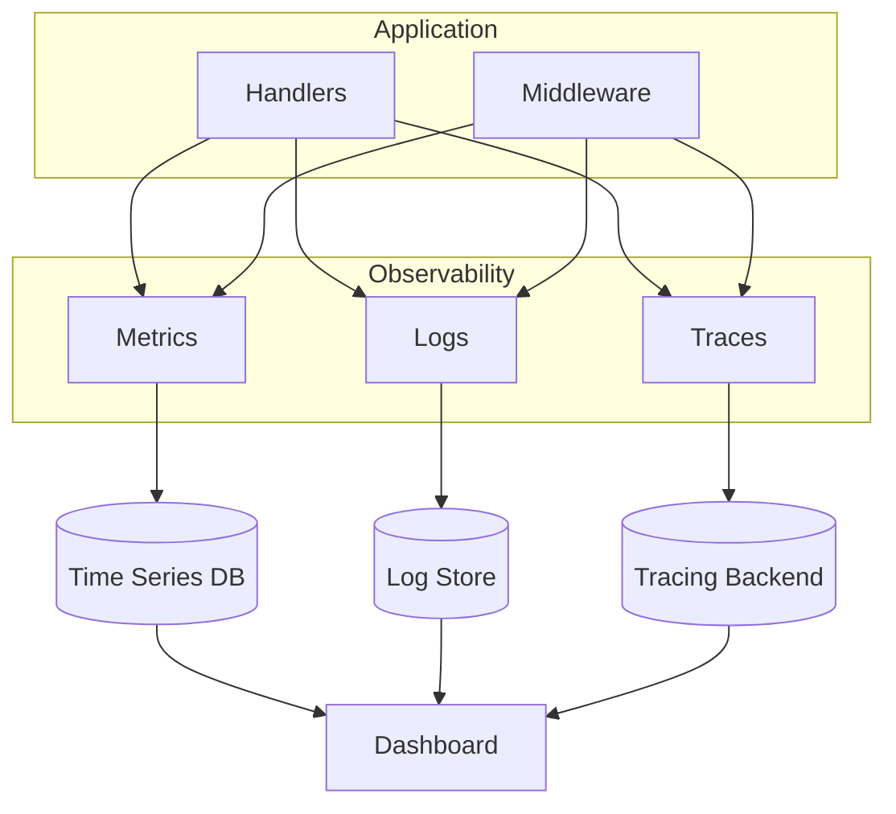
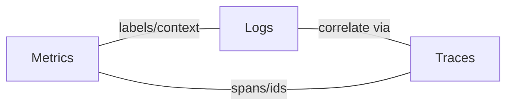
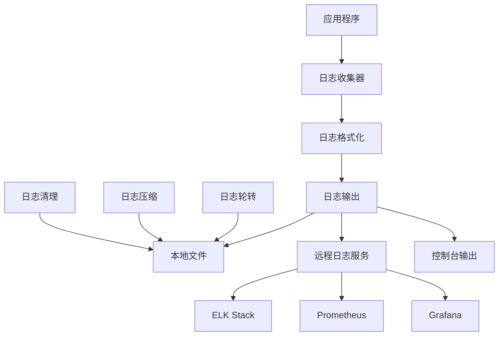
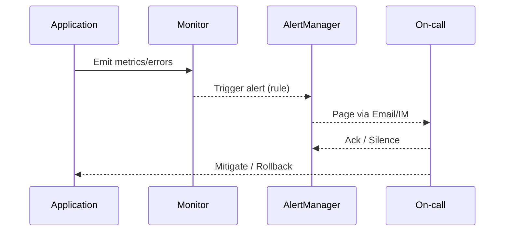
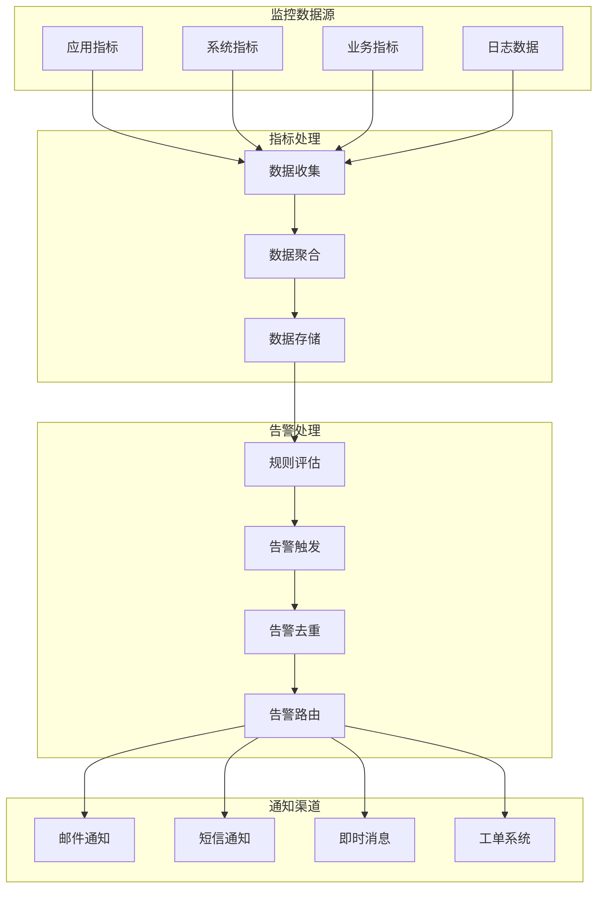
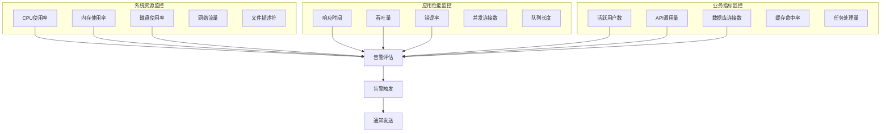
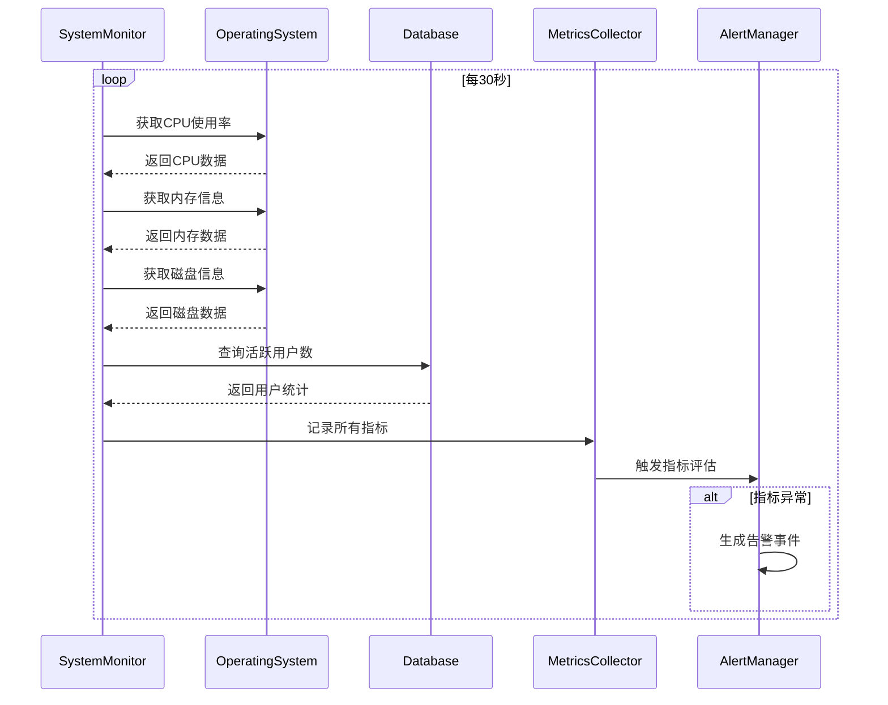
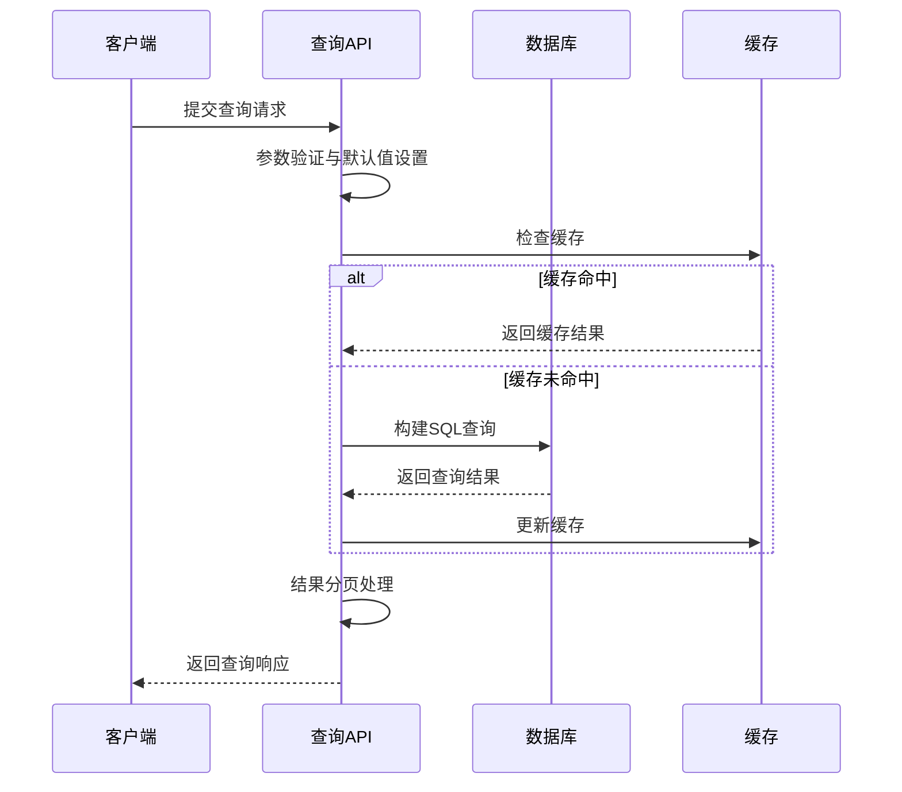
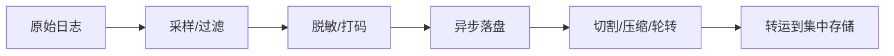
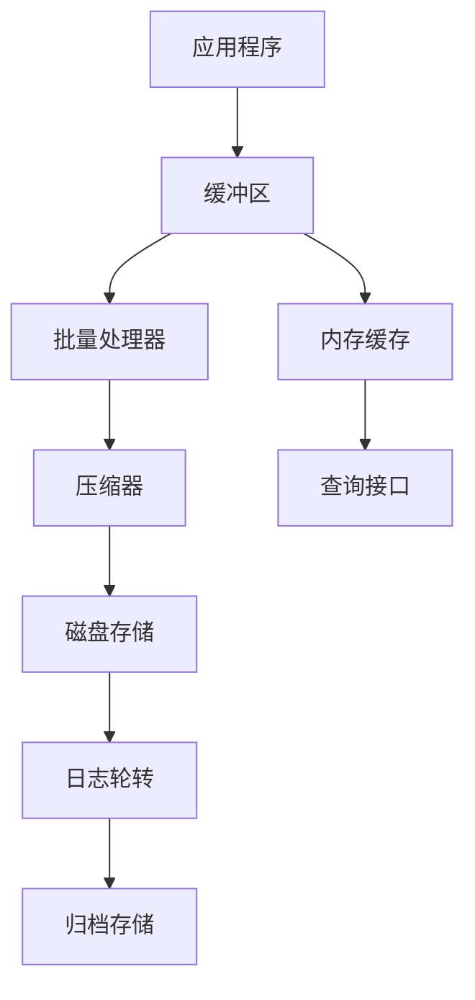

# 第11章 日志系统与监控告警

## 11.0 错误处理与监控

- 恢复策略: `gin.CustomRecovery` 捕获 panic，输出结构化 JSON，记录栈信息；业务错误统一封装响应体。
- 指标与探活: 暴露 `/debug/pprof` 于开发环境；健康检查、请求耗时、错误计数纳入监控面板。
- 日志基线: 结构化日志、级别与轮转配置；关键链路使用 `request_id` 贯穿。

项目片段:

```go
server.Use(gin.CustomRecovery(func(c *gin.Context, err any){
  common.SysLog(fmt.Sprintf("panic: %v", err))
  c.JSON(http.StatusInternalServerError, gin.H{"error": gin.H{"message": "internal error"}})
}))
```

与其他章节的关系:
- 第5章错误响应规范；第13章部署监控实践；第17章性能优化；第18章安全审计与敏感字段脱敏。

概念要点：
- 可观测性（Observability）：以日志、指标、追踪三件套为核心，支撑定位与预防问题。
- 结构化日志：以键值对形式输出，便于检索、聚合与分析。
- 相关性标识：`request_id/trace_id/span_id` 贯穿全链路，实现日志与追踪互查。
- 日志级别：DEBUG/INFO/WARN/ERROR/FATAL，按场景控制粒度与采样率。
- SLI/SLO：以可量化指标（可用性/延迟/错误率）与目标驱动告警和优化。

 

## 11.1 日志系统设计



图1：可观测性总览（应用→日志/指标/追踪→存储/看板）



图2：日志、指标、追踪之间的关联关系

### 11.1.1 日志系统概述

在企业级应用中，完善的日志系统是系统运维、问题排查和性能分析的重要基础。New API项目采用结构化日志设计，支持多级别日志记录、日志轮转、远程日志收集等功能。

#### 日志系统架构



图3：日志系统架构与输出通道

### 11.1.2 日志模型设计

```go
// 日志模型
type Log struct {
    ID          int       `json:"id" gorm:"primaryKey"`
    UserID      int       `json:"user_id" gorm:"index"`
    Type        int       `json:"type" gorm:"index"`
    Content     string    `json:"content"`
    Username    string    `json:"username" gorm:"index:idx_username_type,priority:1"`
    TokenName   string    `json:"token_name"`
    ModelName   string    `json:"model_name" gorm:"index"`
    Quota       int       `json:"quota"`
    PromptTokens int      `json:"prompt_tokens"`
    CompletionTokens int  `json:"completion_tokens"`
    RequestId   string    `json:"request_id" gorm:"index"`
    ChannelId   *int      `json:"channel_id" gorm:"index"`
    CreatedAt   time.Time `json:"created_at" gorm:"index"`
    
    // 扩展字段
    IPAddress   string    `json:"ip_address"`
    UserAgent   string    `json:"user_agent"`
    Duration    int64     `json:"duration"` // 请求耗时（毫秒）
    StatusCode  int       `json:"status_code"`
    ErrorMsg    string    `json:"error_msg"`
    
    // 关联字段
    User        *User     `json:"user,omitempty" gorm:"foreignKey:UserID"`
    Channel     *Channel  `json:"channel,omitempty" gorm:"foreignKey:ChannelId"`
}

// 日志类型常量
const (
    LogTypeUnknown = iota
    LogTypeTopup   // 充值
    LogTypeConsume // 消费
    LogTypeManage  // 管理
    LogTypeSystem  // 系统
    LogTypeAuth    // 认证
    LogTypeAPI     // API调用
    LogTypeError   // 错误
    LogTypeWarning // 警告
    LogTypeInfo    // 信息
    LogTypeDebug   // 调试
)

// 日志级别
type LogLevel int

const (
    LogLevelDebug LogLevel = iota
    LogLevelInfo
    LogLevelWarn
    LogLevelError
    LogLevelFatal
)

// 日志级别字符串映射
var LogLevelNames = map[LogLevel]string{
    LogLevelDebug: "DEBUG",
    LogLevelInfo:  "INFO",
    LogLevelWarn:  "WARN",
    LogLevelError: "ERROR",
    LogLevelFatal: "FATAL",
}

// 结构化日志条目
type LogEntry struct {
    Timestamp   time.Time              `json:"timestamp"`
    Level       LogLevel               `json:"level"`
    Message     string                 `json:"message"`
    Fields      map[string]interface{} `json:"fields,omitempty"`
    Caller      string                 `json:"caller,omitempty"`
    RequestID   string                 `json:"request_id,omitempty"`
    UserID      int                    `json:"user_id,omitempty"`
    TraceID     string                 `json:"trace_id,omitempty"`
    SpanID      string                 `json:"span_id,omitempty"`
}
```

### 11.1.3 日志记录器实现

```go
// 日志记录器接口
type Logger interface {
    Debug(msg string, fields ...Field)
    Info(msg string, fields ...Field)
    Warn(msg string, fields ...Field)
    Error(msg string, fields ...Field)
    Fatal(msg string, fields ...Field)
    
    With(fields ...Field) Logger
    WithContext(ctx context.Context) Logger
}

// 字段类型
type Field struct {
    Key   string
    Value interface{}
}

// 字段构造函数
func String(key, value string) Field {
    return Field{Key: key, Value: value}
}

func Int(key string, value int) Field {
    return Field{Key: key, Value: value}
}

func Int64(key string, value int64) Field {
    return Field{Key: key, Value: value}
}

func Float64(key string, value float64) Field {
    return Field{Key: key, Value: value}
}

func Bool(key string, value bool) Field {
    return Field{Key: key, Value: value}
}

func Error(err error) Field {
    return Field{Key: "error", Value: err.Error()}
}

func Duration(key string, value time.Duration) Field {
    return Field{Key: key, Value: value.String()}
}

// 默认日志记录器实现
type DefaultLogger struct {
    level      LogLevel
    outputs    []LogOutput
    fields     map[string]interface{}
    mutex      sync.RWMutex
    requestID  string
    userID     int
    enableCaller bool
}

// 日志输出接口
type LogOutput interface {
    Write(entry *LogEntry) error
    Close() error
}

// 创建新的日志记录器
func NewLogger(level LogLevel, outputs ...LogOutput) *DefaultLogger {
    return &DefaultLogger{
        level:        level,
        outputs:      outputs,
        fields:       make(map[string]interface{}),
        enableCaller: true,
    }
}

// 设置日志级别
func (l *DefaultLogger) SetLevel(level LogLevel) {
    l.mutex.Lock()
    defer l.mutex.Unlock()
    l.level = level
}

// 添加输出
func (l *DefaultLogger) AddOutput(output LogOutput) {
    l.mutex.Lock()
    defer l.mutex.Unlock()
    l.outputs = append(l.outputs, output)
}

// 实现Logger接口
func (l *DefaultLogger) Debug(msg string, fields ...Field) {
    l.log(LogLevelDebug, msg, fields...)
}

func (l *DefaultLogger) Info(msg string, fields ...Field) {
    l.log(LogLevelInfo, msg, fields...)
}

func (l *DefaultLogger) Warn(msg string, fields ...Field) {
    l.log(LogLevelWarn, msg, fields...)
}

func (l *DefaultLogger) Error(msg string, fields ...Field) {
    l.log(LogLevelError, msg, fields...)
}

func (l *DefaultLogger) Fatal(msg string, fields ...Field) {
    l.log(LogLevelFatal, msg, fields...)
    os.Exit(1)
}

// 添加字段
func (l *DefaultLogger) With(fields ...Field) Logger {
    newLogger := &DefaultLogger{
        level:        l.level,
        outputs:      l.outputs,
        fields:       make(map[string]interface{}),
        requestID:    l.requestID,
        userID:       l.userID,
        enableCaller: l.enableCaller,
    }
    
    // 复制现有字段
    for k, v := range l.fields {
        newLogger.fields[k] = v
    }
    
    // 添加新字段
    for _, field := range fields {
        newLogger.fields[field.Key] = field.Value
    }
    
    return newLogger
}

// 从上下文添加字段
func (l *DefaultLogger) WithContext(ctx context.Context) Logger {
    newLogger := l.With()
    
    // 从上下文中提取请求ID
    if requestID := ctx.Value("request_id"); requestID != nil {
        if rid, ok := requestID.(string); ok {
            newLogger.(*DefaultLogger).requestID = rid
        }
    }
    
    // 从上下文中提取用户ID
    if userID := ctx.Value("user_id"); userID != nil {
        if uid, ok := userID.(int); ok {
            newLogger.(*DefaultLogger).userID = uid
        }
    }
    
    // 从上下文中提取追踪ID
    if traceID := ctx.Value("trace_id"); traceID != nil {
        if tid, ok := traceID.(string); ok {
            newLogger = newLogger.With(String("trace_id", tid))
        }
    }
    
    return newLogger
}

// 核心日志记录方法
func (l *DefaultLogger) log(level LogLevel, msg string, fields ...Field) {
    l.mutex.RLock()
    defer l.mutex.RUnlock()
    
    // 检查日志级别
    if level < l.level {
        return
    }
    
    // 创建日志条目
    entry := &LogEntry{
        Timestamp: time.Now(),
        Level:     level,
        Message:   msg,
        Fields:    make(map[string]interface{}),
        RequestID: l.requestID,
        UserID:    l.userID,
    }
    
    // 添加现有字段
    for k, v := range l.fields {
        entry.Fields[k] = v
    }
    
    // 添加新字段
    for _, field := range fields {
        entry.Fields[field.Key] = field.Value
    }
    
    // 添加调用者信息
    if l.enableCaller {
        if caller := getCaller(3); caller != "" {
            entry.Caller = caller
        }
    }
    
    // 输出到所有输出器
    for _, output := range l.outputs {
        if err := output.Write(entry); err != nil {
            fmt.Fprintf(os.Stderr, "日志输出错误: %v\n", err)
        }
    }
}

// 获取调用者信息
func getCaller(skip int) string {
    _, file, line, ok := runtime.Caller(skip)
    if !ok {
        return ""
    }
    
    // 只保留文件名
    if idx := strings.LastIndex(file, "/"); idx >= 0 {
        file = file[idx+1:]
    }
    
    return fmt.Sprintf("%s:%d", file, line)
}
```

## 11.2 日志输出器实现

### 11.2.1 控制台输出器

```go
// 控制台输出器
type ConsoleOutput struct {
    writer    io.Writer
    formatter LogFormatter
    colorize  bool
}

// 日志格式化器接口
type LogFormatter interface {
    Format(entry *LogEntry) ([]byte, error)
}

// 创建控制台输出器
func NewConsoleOutput(colorize bool) *ConsoleOutput {
    return &ConsoleOutput{
        writer:    os.Stdout,
        formatter: NewTextFormatter(colorize),
        colorize:  colorize,
    }
}

// 实现LogOutput接口
func (co *ConsoleOutput) Write(entry *LogEntry) error {
    data, err := co.formatter.Format(entry)
    if err != nil {
        return err
    }
    
    _, err = co.writer.Write(data)
    return err
}

func (co *ConsoleOutput) Close() error {
    return nil
}

// 文本格式化器
type TextFormatter struct {
    colorize bool
    colors   map[LogLevel]string
}

// 颜色常量
const (
    ColorReset  = "\033[0m"
    ColorRed    = "\033[31m"
    ColorYellow = "\033[33m"
    ColorBlue   = "\033[34m"
    ColorGray   = "\033[37m"
    ColorWhite  = "\033[97m"
)

// 创建文本格式化器
func NewTextFormatter(colorize bool) *TextFormatter {
    return &TextFormatter{
        colorize: colorize,
        colors: map[LogLevel]string{
            LogLevelDebug: ColorGray,
            LogLevelInfo:  ColorBlue,
            LogLevelWarn:  ColorYellow,
            LogLevelError: ColorRed,
            LogLevelFatal: ColorRed,
        },
    }
}

// 格式化日志条目
func (tf *TextFormatter) Format(entry *LogEntry) ([]byte, error) {
    var buf bytes.Buffer
    
    // 时间戳
    timestamp := entry.Timestamp.Format("2006-01-02 15:04:05.000")
    
    // 日志级别
    levelName := LogLevelNames[entry.Level]
    if tf.colorize {
        color := tf.colors[entry.Level]
        levelName = color + levelName + ColorReset
    }
    
    // 基本信息
    fmt.Fprintf(&buf, "[%s] %s %s", timestamp, levelName, entry.Message)
    
    // 添加字段
    if len(entry.Fields) > 0 {
        buf.WriteString(" |")
        for k, v := range entry.Fields {
            fmt.Fprintf(&buf, " %s=%v", k, v)
        }
    }
    
    // 添加请求ID
    if entry.RequestID != "" {
        fmt.Fprintf(&buf, " | request_id=%s", entry.RequestID)
    }
    
    // 添加用户ID
    if entry.UserID > 0 {
        fmt.Fprintf(&buf, " | user_id=%d", entry.UserID)
    }
    
    // 添加调用者信息
    if entry.Caller != "" {
        fmt.Fprintf(&buf, " | caller=%s", entry.Caller)
    }
    
    buf.WriteString("\n")
    return buf.Bytes(), nil
}
```

### 11.2.2 文件输出器

```go
// 文件输出器
type FileOutput struct {
    filename   string
    file       *os.File
    formatter  LogFormatter
    rotator    *LogRotator
    mutex      sync.Mutex
}

// 日志轮转器
type LogRotator struct {
    maxSize    int64         // 最大文件大小（字节）
    maxAge     time.Duration // 最大保存时间
    maxBackups int           // 最大备份文件数
    compress   bool          // 是否压缩
    
    currentSize int64
    mutex       sync.Mutex
}

// 创建文件输出器
func NewFileOutput(filename string, rotator *LogRotator) (*FileOutput, error) {
    file, err := os.OpenFile(filename, os.O_CREATE|os.O_WRONLY|os.O_APPEND, 0644)
    if err != nil {
        return nil, err
    }
    
    // 获取文件大小
    stat, err := file.Stat()
    if err != nil {
        file.Close()
        return nil, err
    }
    
    if rotator != nil {
        rotator.currentSize = stat.Size()
    }
    
    return &FileOutput{
        filename:  filename,
        file:      file,
        formatter: NewJSONFormatter(),
        rotator:   rotator,
    }, nil
}

// 实现LogOutput接口
func (fo *FileOutput) Write(entry *LogEntry) error {
    fo.mutex.Lock()
    defer fo.mutex.Unlock()
    
    data, err := fo.formatter.Format(entry)
    if err != nil {
        return err
    }
    
    // 检查是否需要轮转
    if fo.rotator != nil {
        if err := fo.checkRotation(int64(len(data))); err != nil {
            return err
        }
    }
    
    n, err := fo.file.Write(data)
    if err != nil {
        return err
    }
    
    if fo.rotator != nil {
        fo.rotator.currentSize += int64(n)
    }
    
    return fo.file.Sync()
}

func (fo *FileOutput) Close() error {
    fo.mutex.Lock()
    defer fo.mutex.Unlock()
    
    if fo.file != nil {
        return fo.file.Close()
    }
    return nil
}

// 检查日志轮转
func (fo *FileOutput) checkRotation(dataSize int64) error {
    if fo.rotator == nil {
        return nil
    }
    
    // 检查文件大小
    if fo.rotator.currentSize+dataSize > fo.rotator.maxSize {
        return fo.rotate()
    }
    
    return nil
}

// 执行日志轮转
func (fo *FileOutput) rotate() error {
    fo.rotator.mutex.Lock()
    defer fo.rotator.mutex.Unlock()
    
    // 关闭当前文件
    if err := fo.file.Close(); err != nil {
        return err
    }
    
    // 生成备份文件名
    timestamp := time.Now().Format("20060102-150405")
    backupName := fmt.Sprintf("%s.%s", fo.filename, timestamp)
    
    // 重命名当前文件
    if err := os.Rename(fo.filename, backupName); err != nil {
        return err
    }
    
    // 压缩备份文件
    if fo.rotator.compress {
        go fo.compressFile(backupName)
    }
    
    // 创建新文件
    file, err := os.OpenFile(fo.filename, os.O_CREATE|os.O_WRONLY|os.O_APPEND, 0644)
    if err != nil {
        return err
    }
    
    fo.file = file
    fo.rotator.currentSize = 0
    
    // 清理旧文件
    go fo.cleanupOldFiles()
    
    return nil
}

// 压缩文件
func (fo *FileOutput) compressFile(filename string) {
    gzFilename := filename + ".gz"
    
    input, err := os.Open(filename)
    if err != nil {
        return
    }
    defer input.Close()
    
    output, err := os.Create(gzFilename)
    if err != nil {
        return
    }
    defer output.Close()
    
    gzWriter := gzip.NewWriter(output)
    defer gzWriter.Close()
    
    if _, err := io.Copy(gzWriter, input); err != nil {
        os.Remove(gzFilename)
        return
    }
    
    // 删除原文件
    os.Remove(filename)
}

// 清理旧文件
func (fo *FileOutput) cleanupOldFiles() {
    if fo.rotator.maxBackups <= 0 && fo.rotator.maxAge <= 0 {
        return
    }
    
    dir := filepath.Dir(fo.filename)
    baseName := filepath.Base(fo.filename)
    
    files, err := filepath.Glob(filepath.Join(dir, baseName+".*"))
    if err != nil {
        return
    }
    
    var backupFiles []os.FileInfo
    for _, file := range files {
        if info, err := os.Stat(file); err == nil {
            backupFiles = append(backupFiles, info)
        }
    }
    
    // 按修改时间排序
    sort.Slice(backupFiles, func(i, j int) bool {
        return backupFiles[i].ModTime().After(backupFiles[j].ModTime())
    })
    
    now := time.Now()
    
    for i, info := range backupFiles {
        shouldDelete := false
        
        // 检查数量限制
        if fo.rotator.maxBackups > 0 && i >= fo.rotator.maxBackups {
            shouldDelete = true
        }
        
        // 检查时间限制
        if fo.rotator.maxAge > 0 && now.Sub(info.ModTime()) > fo.rotator.maxAge {
            shouldDelete = true
        }
        
        if shouldDelete {
            os.Remove(filepath.Join(dir, info.Name()))
        }
    }
}
```

### 11.2.3 JSON格式化器

```go
// JSON格式化器
type JSONFormatter struct {
    prettyPrint bool
}

// 创建JSON格式化器
func NewJSONFormatter() *JSONFormatter {
    return &JSONFormatter{
        prettyPrint: false,
    }
}

// 格式化日志条目
func (jf *JSONFormatter) Format(entry *LogEntry) ([]byte, error) {
    // 创建日志数据
    logData := map[string]interface{}{
        "timestamp": entry.Timestamp.Format(time.RFC3339Nano),
        "level":     LogLevelNames[entry.Level],
        "message":   entry.Message,
    }
    
    // 添加字段
    if len(entry.Fields) > 0 {
        for k, v := range entry.Fields {
            logData[k] = v
        }
    }
    
    // 添加可选字段
    if entry.RequestID != "" {
        logData["request_id"] = entry.RequestID
    }
    
    if entry.UserID > 0 {
        logData["user_id"] = entry.UserID
    }
    
    if entry.Caller != "" {
        logData["caller"] = entry.Caller
    }
    
    if entry.TraceID != "" {
        logData["trace_id"] = entry.TraceID
    }
    
    if entry.SpanID != "" {
        logData["span_id"] = entry.SpanID
    }
    
    // 序列化为JSON
    var data []byte
    var err error
    
    if jf.prettyPrint {
        data, err = json.MarshalIndent(logData, "", "  ")
    } else {
        data, err = json.Marshal(logData)
    }
    
    if err != nil {
        return nil, err
    }
    
    // 添加换行符
    data = append(data, '\n')
    return data, nil
}
```

## 11.3 业务日志记录

### 11.3.1 API调用日志

```go
// API调用日志记录中间件
func LoggingMiddleware() gin.HandlerFunc {
    return gin.LoggerWithFormatter(func(param gin.LogFormatterParams) string {
        // 记录API调用日志
        logger := GetLogger().WithContext(param.Keys["context"].(context.Context))
        
        fields := []Field{
            String("method", param.Method),
            String("path", param.Path),
            String("ip", param.ClientIP),
            String("user_agent", param.Request.UserAgent()),
            Int("status_code", param.StatusCode),
            Duration("latency", param.Latency),
            Int64("body_size", int64(param.BodySize)),
        }
        
        // 添加用户信息
        if userID, exists := param.Keys["user_id"]; exists {
            fields = append(fields, Int("user_id", userID.(int)))
        }
        
        // 添加错误信息
        if param.ErrorMessage != "" {
            fields = append(fields, String("error", param.ErrorMessage))
        }
        
        // 根据状态码选择日志级别
        if param.StatusCode >= 500 {
            logger.Error("API请求处理失败", fields...)
        } else if param.StatusCode >= 400 {
            logger.Warn("API请求错误", fields...)
        } else {
            logger.Info("API请求成功", fields...)
        }
        
        return ""
    })
}

// 记录业务操作日志
func RecordLog(userID int, logType int, content string, fields ...Field) {
    // 记录到数据库
    log := &Log{
        UserID:    userID,
        Type:      logType,
        Content:   content,
        CreatedAt: time.Now(),
    }
    
    // 从字段中提取额外信息
    for _, field := range fields {
        switch field.Key {
        case "token_name":
            if tokenName, ok := field.Value.(string); ok {
                log.TokenName = tokenName
            }
        case "model_name":
            if modelName, ok := field.Value.(string); ok {
                log.ModelName = modelName
            }
        case "quota":
            if quota, ok := field.Value.(int); ok {
                log.Quota = quota
            }
        case "prompt_tokens":
            if tokens, ok := field.Value.(int); ok {
                log.PromptTokens = tokens
            }
        case "completion_tokens":
            if tokens, ok := field.Value.(int); ok {
                log.CompletionTokens = tokens
            }
        case "request_id":
            if requestID, ok := field.Value.(string); ok {
                log.RequestId = requestID
            }
        case "channel_id":
            if channelID, ok := field.Value.(int); ok {
                log.ChannelId = &channelID
            }
        case "ip_address":
            if ip, ok := field.Value.(string); ok {
                log.IPAddress = ip
            }
        case "user_agent":
            if ua, ok := field.Value.(string); ok {
                log.UserAgent = ua
            }
        case "duration":
            if duration, ok := field.Value.(int64); ok {
                log.Duration = duration
            }
        case "status_code":
            if code, ok := field.Value.(int); ok {
                log.StatusCode = code
            }
        case "error_msg":
            if errMsg, ok := field.Value.(string); ok {
                log.ErrorMsg = errMsg
            }
        }
    }
    
    // 异步保存到数据库
    go func() {
        if err := common.DB.Create(log).Error; err != nil {
            GetLogger().Error("保存业务日志失败", Error(err))
        }
    }()
    
    // 记录到结构化日志
    logger := GetLogger().With(fields...)
    
    switch logType {
    case LogTypeError:
        logger.Error(content)
    case LogTypeWarning:
        logger.Warn(content)
    case LogTypeSystem, LogTypeManage:
        logger.Info(content)
    default:
        logger.Debug(content)
    }
}

// 记录API调用日志
func RecordAPILog(c *gin.Context, userID int, modelName string, quota int, promptTokens, completionTokens int, channelID *int, duration time.Duration, err error) {
    fields := []Field{
        String("model_name", modelName),
        Int("quota", quota),
        Int("prompt_tokens", promptTokens),
        Int("completion_tokens", completionTokens),
        String("ip_address", c.ClientIP()),
        String("user_agent", c.Request.UserAgent()),
        Int64("duration", duration.Milliseconds()),
        Int("status_code", c.Writer.Status()),
    }
    
    if requestID := c.GetString("request_id"); requestID != "" {
        fields = append(fields, String("request_id", requestID))
    }
    
    if channelID != nil {
        fields = append(fields, Int("channel_id", *channelID))
    }
    
    var content string
    var logType int
    
    if err != nil {
        content = fmt.Sprintf("API调用失败: %v", err)
        logType = LogTypeError
        fields = append(fields, String("error_msg", err.Error()))
    } else {
        content = "API调用成功"
        logType = LogTypeAPI
    }
    
    RecordLog(userID, logType, content, fields...)
}
```

### 11.3.2 用户操作日志

```go
// 用户登录日志
func RecordLoginLog(userID int, username, ip, userAgent string, success bool, reason string) {
    fields := []Field{
        String("username", username),
        String("ip_address", ip),
        String("user_agent", userAgent),
        Bool("success", success),
    }
    
    var content string
    var logType int
    
    if success {
        content = "用户登录成功"
        logType = LogTypeAuth
    } else {
        content = fmt.Sprintf("用户登录失败: %s", reason)
        logType = LogTypeError
        fields = append(fields, String("reason", reason))
    }
    
    RecordLog(userID, logType, content, fields...)
}

// 用户注册日志
func RecordRegisterLog(username, email, ip, userAgent string, success bool, reason string) {
    fields := []Field{
        String("username", username),
        String("email", email),
        String("ip_address", ip),
        String("user_agent", userAgent),
        Bool("success", success),
    }
    
    var content string
    var logType int
    
    if success {
        content = "用户注册成功"
        logType = LogTypeAuth
    } else {
        content = fmt.Sprintf("用户注册失败: %s", reason)
        logType = LogTypeError
        fields = append(fields, String("reason", reason))
    }
    
    RecordLog(0, logType, content, fields...)
}

// 充值日志
func RecordTopupLog(userID int, amount int, method, tradeNo string) {
    fields := []Field{
        Int("amount", amount),
        String("method", method),
        String("trade_no", tradeNo),
    }
    
    content := fmt.Sprintf("用户充值: %d 额度", amount)
    RecordLog(userID, LogTypeTopup, content, fields...)
}

// 消费日志
func RecordConsumeLog(userID int, quota int, modelName, tokenName string, channelID *int) {
    fields := []Field{
        Int("quota", quota),
        String("model_name", modelName),
        String("token_name", tokenName),
    }
    
    if channelID != nil {
        fields = append(fields, Int("channel_id", *channelID))
    }
    
    content := fmt.Sprintf("消费额度: %d", quota)
    RecordLog(userID, LogTypeConsume, content, fields...)
}

// 管理操作日志
func RecordManageLog(userID int, action, target string, details map[string]interface{}) {
    fields := []Field{
        String("action", action),
        String("target", target),
    }
    
    for k, v := range details {
        fields = append(fields, Field{Key: k, Value: v})
    }
    
    content := fmt.Sprintf("管理操作: %s %s", action, target)
    RecordLog(userID, LogTypeManage, content, fields...)
}
```

## 11.4 监控告警系统



图4：监控告警的触发与响应时序

监控告警系统是保障系统稳定运行的重要组成部分，通过实时收集系统指标、分析异常情况并及时通知相关人员，实现问题的快速发现和处理。

### 监控告警系统概述

监控告警系统主要包括以下几个核心组件：
- **指标收集器（Metrics Collector）**：负责收集各类系统和业务指标
- **告警规则引擎（Alert Rule Engine）**：根据预定义规则评估指标状态
- **告警管理器（Alert Manager）**：处理告警事件的生命周期管理
- **通知系统（Notification System）**：将告警信息发送给相关人员

```mermaid
flowchart LR
  SRC[来源: Metrics/Logs/Traces] --> RULE[告警规则]
  RULE --> DEDUP[去重/抑制]
  DEDUP --> ROUTE[路由]
  ROUTE --> PAGE[通知(Email/IM/PagerDuty)]
  ROUTE --> TICKET[工单/事件平台]
  PAGE --> ACK[值班响应]
  ACK --> ACT[处置: 降级/回滚/扩容]
  ACT --> LEARN[复盘与规则优化]
```

图5：告警从触发到处置的处理链路



图6：监控告警系统架构图

### 核心概念解析

**SLI/SLO（服务级别指标/目标）**：
- **SLI（Service Level Indicator）**：衡量服务质量的具体指标，如可用性、延迟、错误率等
- **SLO（Service Level Objective）**：基于SLI设定的服务质量目标，如99.9%可用性、p99延迟<500ms
- **SLA（Service Level Agreement）**：与用户约定的服务质量协议

**告警策略**：
- **Burn Rate**：误差预算消耗速率，用于触发多窗口告警，有效减少告警噪音
- **抑制（Silence）**：在维护期间临时抑制特定告警，避免无效通知
- **路由（Routing）**：按服务、团队、严重级别将告警分派到不同通知通道
- **去重（Deduplication）**：合并相同或相似的告警，避免重复通知

**指标类型**：
- **Counter（计数器）**：只增不减的累积指标，如请求总数、错误总数
- **Gauge（仪表盘）**：可增可减的瞬时指标，如CPU使用率、内存使用量
- **Histogram（直方图）**：统计数据分布的指标，如请求延迟分布
- **Summary（摘要）**：类似直方图，但在客户端计算分位数

### 11.4.1 监控指标定义

```go
// 监控指标类型
type MetricType int

const (
    MetricTypeCounter MetricType = iota // 计数器
    MetricTypeGauge                     // 仪表盘
    MetricTypeHistogram                 // 直方图
    MetricTypeSummary                   // 摘要
)

// 监控指标
type Metric struct {
    Name        string                 `json:"name"`
    Type        MetricType             `json:"type"`
    Value       float64                `json:"value"`
    Labels      map[string]string      `json:"labels"`
    Timestamp   time.Time              `json:"timestamp"`
    Description string                 `json:"description"`
}

// 监控收集器
type MetricsCollector struct {
    metrics map[string]*Metric
    mutex   sync.RWMutex
    
    // Prometheus集成
    registry *prometheus.Registry
    
    // 内置指标
    requestTotal     *prometheus.CounterVec
    requestDuration  *prometheus.HistogramVec
    activeUsers      prometheus.Gauge
    systemLoad       prometheus.Gauge
    memoryUsage      prometheus.Gauge
    diskUsage        prometheus.Gauge
}

// 创建监控收集器
// 初始化Prometheus指标收集器，创建常用的系统和业务指标
func NewMetricsCollector() *MetricsCollector {
    // 创建独立的Prometheus注册表，避免与全局注册表冲突
    registry := prometheus.NewRegistry()
    
    // 创建API请求计数器（Counter类型）
    // 用于统计不同方法、端点和状态码的请求总数
    requestTotal := prometheus.NewCounterVec(
        prometheus.CounterOpts{
            Name: "api_requests_total",
            Help: "Total number of API requests",
        },
        []string{"method", "endpoint", "status"}, // 标签维度
    )
    
    // 创建API请求耗时直方图（Histogram类型）
    // 用于统计请求延迟分布，支持分位数计算
    requestDuration := prometheus.NewHistogramVec(
        prometheus.HistogramOpts{
            Name:    "api_request_duration_seconds",
            Help:    "API request duration in seconds",
            Buckets: prometheus.DefBuckets, // 使用默认的延迟桶
        },
        []string{"method", "endpoint"},
    )
    
    // 创建活跃用户数仪表盘（Gauge类型）
    // 用于实时显示当前活跃用户数量
    activeUsers := prometheus.NewGauge(
        prometheus.GaugeOpts{
            Name: "active_users_total",
            Help: "Number of active users",
        },
    )
    
    // 创建系统负载仪表盘
    // 监控系统的平均负载情况
    systemLoad := prometheus.NewGauge(
        prometheus.GaugeOpts{
            Name: "system_load_average",
            Help: "System load average",
        },
    )
    
    // 创建内存使用量仪表盘
    // 监控系统内存使用情况（字节）
    memoryUsage := prometheus.NewGauge(
        prometheus.GaugeOpts{
            Name: "memory_usage_bytes",
            Help: "Memory usage in bytes",
        },
    )
    
    // 创建磁盘使用量仪表盘
    // 监控磁盘空间使用情况（字节）
    diskUsage := prometheus.NewGauge(
        prometheus.GaugeOpts{
            Name: "disk_usage_bytes",
            Help: "Disk usage in bytes",
        },
    )
    
    // 将所有指标注册到注册表中
    // MustRegister会在注册失败时panic，确保指标正确初始化
    registry.MustRegister(requestTotal)
    registry.MustRegister(requestDuration)
    registry.MustRegister(activeUsers)
    registry.MustRegister(systemLoad)
    registry.MustRegister(memoryUsage)
    registry.MustRegister(diskUsage)
    
    return &MetricsCollector{
        metrics:         make(map[string]*Metric),
        registry:        registry,
        requestTotal:    requestTotal,
        requestDuration: requestDuration,
        activeUsers:     activeUsers,
        systemLoad:      systemLoad,
        memoryUsage:     memoryUsage,
        diskUsage:       diskUsage,
    }
}

// 记录API请求指标
func (mc *MetricsCollector) RecordAPIRequest(method, endpoint, status string, duration time.Duration) {
    mc.requestTotal.WithLabelValues(method, endpoint, status).Inc()
    mc.requestDuration.WithLabelValues(method, endpoint).Observe(duration.Seconds())
}

// 更新活跃用户数
func (mc *MetricsCollector) UpdateActiveUsers(count float64) {
    mc.activeUsers.Set(count)
}

// 更新系统负载
func (mc *MetricsCollector) UpdateSystemLoad(load float64) {
    mc.systemLoad.Set(load)
}

// 更新内存使用量
func (mc *MetricsCollector) UpdateMemoryUsage(bytes float64) {
    mc.memoryUsage.Set(bytes)
}

// 更新磁盘使用量
func (mc *MetricsCollector) UpdateDiskUsage(bytes float64) {
    mc.diskUsage.Set(bytes)
}

// 获取Prometheus处理器
func (mc *MetricsCollector) GetPrometheusHandler() http.Handler {
    return promhttp.HandlerFor(mc.registry, promhttp.HandlerOpts{})
}

// 自定义指标记录
func (mc *MetricsCollector) RecordMetric(name string, metricType MetricType, value float64, labels map[string]string) {
    mc.mutex.Lock()
    defer mc.mutex.Unlock()
    
    metric := &Metric{
        Name:      name,
        Type:      metricType,
        Value:     value,
        Labels:    labels,
        Timestamp: time.Now(),
    }
    
    mc.metrics[name] = metric
}

// 获取指标
func (mc *MetricsCollector) GetMetric(name string) *Metric {
    mc.mutex.RLock()
    defer mc.mutex.RUnlock()
    
    return mc.metrics[name]
}

// 获取所有指标
func (mc *MetricsCollector) GetAllMetrics() map[string]*Metric {
    mc.mutex.RLock()
    defer mc.mutex.RUnlock()
    
    result := make(map[string]*Metric)
    for k, v := range mc.metrics {
        result[k] = v
    }
    
    return result
}
```

### 11.4.2 系统监控

系统监控是监控告警系统的重要组成部分，负责实时收集服务器的各项性能指标，包括CPU使用率、内存使用情况、磁盘空间、网络流量等。通过持续监控这些关键指标，可以及时发现系统性能瓶颈和潜在问题。

#### 系统监控指标分类



图7：系统监控指标分类与告警流程

#### 监控数据收集流程



图8：系统监控数据收集时序图

```go
// 系统监控器
type SystemMonitor struct {
    collector *MetricsCollector
    logger    Logger
    
    // 配置
    interval time.Duration
    
    // 控制
    stopChan chan struct{}
    running  bool
    mutex    sync.RWMutex
}

// 创建系统监控器
func NewSystemMonitor(collector *MetricsCollector, logger Logger) *SystemMonitor {
    return &SystemMonitor{
        collector: collector,
        logger:    logger,
        interval:  30 * time.Second,
        stopChan:  make(chan struct{}),
    }
}

// 启动监控
func (sm *SystemMonitor) Start() {
    sm.mutex.Lock()
    defer sm.mutex.Unlock()
    
    if sm.running {
        return
    }
    
    sm.running = true
    go sm.monitorLoop()
    
    sm.logger.Info("系统监控已启动")
}

// 停止监控
func (sm *SystemMonitor) Stop() {
    sm.mutex.Lock()
    defer sm.mutex.Unlock()
    
    if !sm.running {
        return
    }
    
    sm.running = false
    close(sm.stopChan)
    
    sm.logger.Info("系统监控已停止")
}

// 监控循环
func (sm *SystemMonitor) monitorLoop() {
    ticker := time.NewTicker(sm.interval)
    defer ticker.Stop()
    
    for {
        select {
        case <-ticker.C:
            sm.collectSystemMetrics()
        case <-sm.stopChan:
            return
        }
    }
}

// 收集系统指标
func (sm *SystemMonitor) collectSystemMetrics() {
    // 收集CPU使用率
    if cpuPercent, err := sm.getCPUUsage(); err == nil {
        sm.collector.RecordMetric("cpu_usage_percent", MetricTypeGauge, cpuPercent, nil)
        sm.logger.Debug("CPU使用率", Float64("percent", cpuPercent))
    } else {
        sm.logger.Error("获取CPU使用率失败", Error(err))
    }
    
    // 收集内存使用情况
    if memInfo, err := sm.getMemoryInfo(); err == nil {
        sm.collector.UpdateMemoryUsage(float64(memInfo.Used))
        sm.collector.RecordMetric("memory_usage_percent", MetricTypeGauge, memInfo.UsedPercent, nil)
        sm.logger.Debug("内存使用情况", 
            Int64("used", int64(memInfo.Used)),
            Int64("total", int64(memInfo.Total)),
            Float64("percent", memInfo.UsedPercent))
    } else {
        sm.logger.Error("获取内存信息失败", Error(err))
    }
    
    // 收集磁盘使用情况
    if diskInfo, err := sm.getDiskInfo(); err == nil {
        sm.collector.UpdateDiskUsage(float64(diskInfo.Used))
        sm.collector.RecordMetric("disk_usage_percent", MetricTypeGauge, diskInfo.UsedPercent, nil)
        sm.logger.Debug("磁盘使用情况",
            Int64("used", int64(diskInfo.Used)),
            Int64("total", int64(diskInfo.Total)),
            Float64("percent", diskInfo.UsedPercent))
    } else {
        sm.logger.Error("获取磁盘信息失败", Error(err))
    }
    
    // 收集系统负载
    if loadAvg, err := sm.getLoadAverage(); err == nil {
        sm.collector.UpdateSystemLoad(loadAvg)
        sm.logger.Debug("系统负载", Float64("load_avg", loadAvg))
    } else {
        sm.logger.Error("获取系统负载失败", Error(err))
    }
    
    // 收集活跃用户数
    if activeUsers, err := sm.getActiveUsers(); err == nil {
        sm.collector.UpdateActiveUsers(float64(activeUsers))
        sm.logger.Debug("活跃用户数", Int("count", activeUsers))
    } else {
        sm.logger.Error("获取活跃用户数失败", Error(err))
    }
}

// 获取CPU使用率
func (sm *SystemMonitor) getCPUUsage() (float64, error) {
    // 这里使用第三方库如 github.com/shirou/gopsutil
    // 为了简化，这里返回模拟数据
    return rand.Float64() * 100, nil
}

// 内存信息结构
type MemoryInfo struct {
    Total       uint64
    Used        uint64
    Available   uint64
    UsedPercent float64
}

// 获取内存信息
func (sm *SystemMonitor) getMemoryInfo() (*MemoryInfo, error) {
    // 模拟内存信息
    total := uint64(8 * 1024 * 1024 * 1024) // 8GB
    used := uint64(rand.Float64() * float64(total))
    available := total - used
    usedPercent := float64(used) / float64(total) * 100
    
    return &MemoryInfo{
        Total:       total,
        Used:        used,
        Available:   available,
        UsedPercent: usedPercent,
    }, nil
}

// 磁盘信息结构
type DiskInfo struct {
    Total       uint64
    Used        uint64
    Available   uint64
    UsedPercent float64
}

// 获取磁盘信息
func (sm *SystemMonitor) getDiskInfo() (*DiskInfo, error) {
    // 模拟磁盘信息
    total := uint64(100 * 1024 * 1024 * 1024) // 100GB
    used := uint64(rand.Float64() * float64(total))
    available := total - used
    usedPercent := float64(used) / float64(total) * 100
    
    return &DiskInfo{
        Total:       total,
        Used:        used,
        Available:   available,
        UsedPercent: usedPercent,
    }, nil
}

// 获取系统负载
func (sm *SystemMonitor) getLoadAverage() (float64, error) {
    // 模拟系统负载
    return rand.Float64() * 4, nil
}

// 获取活跃用户数
func (sm *SystemMonitor) getActiveUsers() (int, error) {
    var count int64
    
    // 查询最近5分钟内有活动的用户数
    err := common.DB.Model(&Log{}).
        Where("created_at > ?", time.Now().Add(-5*time.Minute)).
        Distinct("user_id").
        Count(&count).Error
    
    return int(count), err
}
```

### 11.4.3 告警系统

```go
// 告警规则
type AlertRule struct {
    ID          int       `json:"id" gorm:"primaryKey"`
    Name        string    `json:"name" gorm:"uniqueIndex"`
    Description string    `json:"description"`
    MetricName  string    `json:"metric_name" gorm:"index"`
    Operator    string    `json:"operator"` // >, <, >=, <=, ==, !=
    Threshold   float64   `json:"threshold"`
    Duration    int       `json:"duration"` // 持续时间（秒）
    Severity    string    `json:"severity"` // critical, warning, info
    Enabled     bool      `json:"enabled" gorm:"default:true"`
    
    // 通知配置
    NotifyChannels []string `json:"notify_channels" gorm:"type:json"`
    
    // 时间配置
    CreatedAt time.Time `json:"created_at"`
    UpdatedAt time.Time `json:"updated_at"`
}

// 告警事件
type AlertEvent struct {
    ID          int       `json:"id" gorm:"primaryKey"`
    RuleID      int       `json:"rule_id" gorm:"index"`
    RuleName    string    `json:"rule_name"`
    MetricName  string    `json:"metric_name"`
    MetricValue float64   `json:"metric_value"`
    Threshold   float64   `json:"threshold"`
    Severity    string    `json:"severity"`
    Status      string    `json:"status"` // firing, resolved
    Message     string    `json:"message"`
    
    // 时间信息
    StartTime   time.Time  `json:"start_time"`
    EndTime     *time.Time `json:"end_time,omitempty"`
    CreatedAt   time.Time  `json:"created_at"`
    UpdatedAt   time.Time  `json:"updated_at"`
    
    // 关联
    Rule *AlertRule `json:"rule,omitempty" gorm:"foreignKey:RuleID"`
}

// 告警管理器
type AlertManager struct {
    rules       map[int]*AlertRule
    events      map[int]*AlertEvent
    collector   *MetricsCollector
    notifier    *AlertNotifier
    logger      Logger
    
    // 状态跟踪
    ruleStates  map[int]*RuleState
    
    // 控制
    stopChan    chan struct{}
    running     bool
    mutex       sync.RWMutex
    
    // 配置
    checkInterval time.Duration
}

// 规则状态
type RuleState struct {
    LastCheck    time.Time
    LastValue    float64
    AlertStart   *time.Time
    EventID      *int
}

// 创建告警管理器
func NewAlertManager(collector *MetricsCollector, notifier *AlertNotifier, logger Logger) *AlertManager {
    return &AlertManager{
        rules:         make(map[int]*AlertRule),
        events:        make(map[int]*AlertEvent),
        collector:     collector,
        notifier:      notifier,
        logger:        logger,
        ruleStates:    make(map[int]*RuleState),
        stopChan:      make(chan struct{}),
        checkInterval: 30 * time.Second,
    }
}

// 加载告警规则
func (am *AlertManager) LoadRules() error {
    var rules []AlertRule
    if err := common.DB.Where("enabled = ?", true).Find(&rules).Error; err != nil {
        return err
    }
    
    am.mutex.Lock()
    defer am.mutex.Unlock()
    
    for _, rule := range rules {
        am.rules[rule.ID] = &rule
        if _, exists := am.ruleStates[rule.ID]; !exists {
            am.ruleStates[rule.ID] = &RuleState{
                LastCheck: time.Now(),
            }
        }
    }
    
    am.logger.Info("告警规则加载完成", Int("count", len(rules)))
    return nil
}

// 启动告警检查
func (am *AlertManager) Start() {
    am.mutex.Lock()
    defer am.mutex.Unlock()
    
    if am.running {
        return
    }
    
    am.running = true
    go am.checkLoop()
    
    am.logger.Info("告警管理器已启动")
}

// 停止告警检查
func (am *AlertManager) Stop() {
    am.mutex.Lock()
    defer am.mutex.Unlock()
    
    if !am.running {
        return
    }
    
    am.running = false
    close(am.stopChan)
    
    am.logger.Info("告警管理器已停止")
}

// 检查循环
func (am *AlertManager) checkLoop() {
    ticker := time.NewTicker(am.checkInterval)
    defer ticker.Stop()
    
    for {
        select {
        case <-ticker.C:
            am.checkRules()
        case <-am.stopChan:
            return
        }
    }
}

// 检查所有规则
func (am *AlertManager) checkRules() {
    am.mutex.RLock()
    rules := make(map[int]*AlertRule)
    for k, v := range am.rules {
        rules[k] = v
    }
    am.mutex.RUnlock()
    
    for ruleID, rule := range rules {
        am.checkRule(ruleID, rule)
    }
}

// 检查单个规则
func (am *AlertManager) checkRule(ruleID int, rule *AlertRule) {
    // 获取指标值
    metric := am.collector.GetMetric(rule.MetricName)
    if metric == nil {
        am.logger.Warn("指标不存在", String("metric", rule.MetricName))
        return
    }
    
    // 获取规则状态
    am.mutex.Lock()
    state, exists := am.ruleStates[ruleID]
    if !exists {
        state = &RuleState{LastCheck: time.Now()}
        am.ruleStates[ruleID] = state
    }
    am.mutex.Unlock()
    
    // 更新状态
    state.LastCheck = time.Now()
    state.LastValue = metric.Value
    
    // 检查阈值
    triggered := am.evaluateCondition(metric.Value, rule.Operator, rule.Threshold)
    
    if triggered {
        // 触发告警
        if state.AlertStart == nil {
            // 开始新的告警
            now := time.Now()
            state.AlertStart = &now
        } else {
            // 检查持续时间
            duration := time.Since(*state.AlertStart)
            if duration >= time.Duration(rule.Duration)*time.Second {
                // 满足持续时间条件，触发告警
                am.fireAlert(ruleID, rule, metric.Value, state)
            }
        }
    } else {
        // 未触发告警
        if state.AlertStart != nil {
            // 解决告警
            am.resolveAlert(ruleID, rule, state)
            state.AlertStart = nil
        }
    }
}

// 评估条件
func (am *AlertManager) evaluateCondition(value float64, operator string, threshold float64) bool {
    switch operator {
    case ">":
        return value > threshold
    case "<":
        return value < threshold
    case ">=":
        return value >= threshold
    case "<=":
        return value <= threshold
    case "==":
        return value == threshold
    case "!=":
        return value != threshold
    default:
        return false
    }
}

// 触发告警
func (am *AlertManager) fireAlert(ruleID int, rule *AlertRule, value float64, state *RuleState) {
    // 检查是否已经有活跃的告警事件
    if state.EventID != nil {
        return
    }
    
    // 创建告警事件
    event := &AlertEvent{
        RuleID:      ruleID,
        RuleName:    rule.Name,
        MetricName:  rule.MetricName,
        MetricValue: value,
        Threshold:   rule.Threshold,
        Severity:    rule.Severity,
        Status:      "firing",
        Message:     fmt.Sprintf("指标 %s 当前值 %.2f %s 阈值 %.2f", rule.MetricName, value, rule.Operator, rule.Threshold),
        StartTime:   time.Now(),
        CreatedAt:   time.Now(),
        UpdatedAt:   time.Now(),
    }
    
    // 保存到数据库
    if err := common.DB.Create(event).Error; err != nil {
        am.logger.Error("保存告警事件失败", Error(err))
        return
    }
    
    // 更新状态
    state.EventID = &event.ID
    
    // 缓存事件
    am.mutex.Lock()
    am.events[event.ID] = event
    am.mutex.Unlock()
    
    // 发送通知
    am.notifier.SendAlert(event, rule.NotifyChannels)
    
    am.logger.Warn("告警触发",
        String("rule", rule.Name),
        String("metric", rule.MetricName),
        Float64("value", value),
        Float64("threshold", rule.Threshold))
}

// 解决告警
func (am *AlertManager) resolveAlert(ruleID int, rule *AlertRule, state *RuleState) {
    if state.EventID == nil {
        return
    }
    
    // 更新告警事件
    now := time.Now()
    err := common.DB.Model(&AlertEvent{}).
        Where("id = ?", *state.EventID).
        Updates(map[string]interface{}{
            "status":     "resolved",
            "end_time":   &now,
            "updated_at": now,
        }).Error
    
    if err != nil {
        am.logger.Error("更新告警事件失败", Error(err))
        return
    }
    
    // 获取事件详情
    am.mutex.RLock()
    event, exists := am.events[*state.EventID]
    am.mutex.RUnlock()
    
    if exists {
        event.Status = "resolved"
        event.EndTime = &now
        event.UpdatedAt = now
        
        // 发送解决通知
        am.notifier.SendResolved(event, rule.NotifyChannels)
    }
    
    // 清理状态
    state.EventID = nil
    
    am.logger.Info("告警解决",
        String("rule", rule.Name),
        String("metric", rule.MetricName))
}

// 告警通知器
type AlertNotifier struct {
    channels map[string]NotifyChannel
    logger   Logger
}

// 通知渠道接口
type NotifyChannel interface {
    SendAlert(event *AlertEvent) error
    SendResolved(event *AlertEvent) error
}

// 创建告警通知器
func NewAlertNotifier(logger Logger) *AlertNotifier {
    return &AlertNotifier{
        channels: make(map[string]NotifyChannel),
        logger:   logger,
    }
}

// 注册通知渠道
func (an *AlertNotifier) RegisterChannel(name string, channel NotifyChannel) {
    an.channels[name] = channel
}

// 发送告警通知
func (an *AlertNotifier) SendAlert(event *AlertEvent, channelNames []string) {
    for _, name := range channelNames {
        if channel, exists := an.channels[name]; exists {
            go func(ch NotifyChannel, evt *AlertEvent) {
                if err := ch.SendAlert(evt); err != nil {
                    an.logger.Error("发送告警通知失败",
                        String("channel", name),
                        Error(err))
                }
            }(channel, event)
        }
    }
}

// 发送解决通知
func (an *AlertNotifier) SendResolved(event *AlertEvent, channelNames []string) {
    for _, name := range channelNames {
        if channel, exists := an.channels[name]; exists {
            go func(ch NotifyChannel, evt *AlertEvent) {
                if err := ch.SendResolved(evt); err != nil {
                    an.logger.Error("发送解决通知失败",
                        String("channel", name),
                        Error(err))
                }
            }(channel, event)
        }
    }
}

// 邮件通知渠道
type EmailNotifier struct {
    smtpHost     string
    smtpPort     int
    username     string
    password     string
    fromAddress  string
    toAddresses  []string
}

// 创建邮件通知器
func NewEmailNotifier(smtpHost string, smtpPort int, username, password, fromAddress string, toAddresses []string) *EmailNotifier {
    return &EmailNotifier{
        smtpHost:    smtpHost,
        smtpPort:    smtpPort,
        username:    username,
        password:    password,
        fromAddress: fromAddress,
        toAddresses: toAddresses,
    }
}

// 发送告警邮件
func (en *EmailNotifier) SendAlert(event *AlertEvent) error {
    subject := fmt.Sprintf("[%s] 告警: %s", strings.ToUpper(event.Severity), event.RuleName)
    body := fmt.Sprintf(`
告警详情:
规则名称: %s
指标名称: %s
当前值: %.2f
阈值: %.2f
严重程度: %s
开始时间: %s
消息: %s
`,
        event.RuleName,
        event.MetricName,
        event.MetricValue,
        event.Threshold,
        event.Severity,
        event.StartTime.Format("2006-01-02 15:04:05"),
        event.Message)
    
    return en.sendEmail(subject, body)
}

// 发送解决邮件
func (en *EmailNotifier) SendResolved(event *AlertEvent) error {
    subject := fmt.Sprintf("[RESOLVED] 告警解决: %s", event.RuleName)
    
    duration := ""
    if event.EndTime != nil {
        duration = event.EndTime.Sub(event.StartTime).String()
    }
    
    body := fmt.Sprintf(`
告警已解决:
规则名称: %s
指标名称: %s
严重程度: %s
开始时间: %s
结束时间: %s
持续时间: %s
`,
        event.RuleName,
        event.MetricName,
        event.Severity,
        event.StartTime.Format("2006-01-02 15:04:05"),
        event.EndTime.Format("2006-01-02 15:04:05"),
        duration)
    
    return en.sendEmail(subject, body)
}

// 发送邮件
func (en *EmailNotifier) sendEmail(subject, body string) error {
    // 这里实现SMTP邮件发送逻辑
    // 为了简化，这里只是模拟
    fmt.Printf("发送邮件: %s\n%s\n", subject, body)
    return nil
}

// Webhook通知渠道
type WebhookNotifier struct {
    url     string
    timeout time.Duration
    client  *http.Client
}

// 创建Webhook通知器
func NewWebhookNotifier(url string, timeout time.Duration) *WebhookNotifier {
    return &WebhookNotifier{
        url:     url,
        timeout: timeout,
        client: &http.Client{
            Timeout: timeout,
        },
    }
}

// 发送告警Webhook
func (wn *WebhookNotifier) SendAlert(event *AlertEvent) error {
    payload := map[string]interface{}{
        "type":         "alert",
        "rule_name":    event.RuleName,
        "metric_name":  event.MetricName,
        "metric_value": event.MetricValue,
        "threshold":    event.Threshold,
        "severity":     event.Severity,
        "status":       event.Status,
        "message":      event.Message,
        "start_time":   event.StartTime,
    }
    
    return wn.sendWebhook(payload)
}

// 发送解决Webhook
func (wn *WebhookNotifier) SendResolved(event *AlertEvent) error {
    payload := map[string]interface{}{
        "type":         "resolved",
        "rule_name":    event.RuleName,
        "metric_name":  event.MetricName,
        "severity":     event.Severity,
        "status":       event.Status,
        "start_time":   event.StartTime,
        "end_time":     event.EndTime,
    }
    
    return wn.sendWebhook(payload)
}

// 发送Webhook请求
func (wn *WebhookNotifier) sendWebhook(payload interface{}) error {
    data, err := json.Marshal(payload)
    if err != nil {
        return err
    }
    
    req, err := http.NewRequest("POST", wn.url, bytes.NewBuffer(data))
    if err != nil {
        return err
    }
    
    req.Header.Set("Content-Type", "application/json")
    
    resp, err := wn.client.Do(req)
    if err != nil {
        return err
    }
    defer resp.Body.Close()
    
    if resp.StatusCode >= 400 {
        return fmt.Errorf("webhook请求失败: %d", resp.StatusCode)
    }
    
    return nil
}
```

## 11.5 日志分析与查询

日志分析与查询是日志系统的核心功能，通过对海量日志数据的高效检索和统计分析，为业务监控、故障排查和数据洞察提供支撑。本节将介绍如何设计和实现一个功能完整的日志查询系统。

### 核心组件

1. **查询引擎**：支持多维度条件查询和全文检索
2. **统计分析**：提供时间序列统计和聚合分析
3. **数据导出**：支持查询结果的批量导出
4. **性能优化**：通过索引和缓存提升查询效率

```mermaid
flowchart TD
  L[应用日志] --> SHP[清洗/标准化]
  SHP --> ENR[富化(请求ID/用户/渠道)]
  ENR --> IDX[索引/存储]
  IDX --> SRCH[查询/KQL/Lucene]
  SRCH --> AGG[聚合/仪表]
  AGG --> INS[洞察/报表]
```

图9：日志采集到分析的流水线



图10：日志查询处理时序图

### 核心概念解析

**Schema-on-write vs. Schema-on-read**
- Schema-on-write：数据写入时定义结构，查询性能高但灵活性差
- Schema-on-read：查询时解析结构，灵活性高但查询成本大

**字段索引策略**
- 对常用查询字段（user_id、type、created_at）建立索引
- 复合索引优化多条件查询性能
- 全文索引支持内容关键词搜索

**查询优化技术**
- 分页查询：避免大结果集内存溢出
- 预加载关联：减少N+1查询问题
- 结果缓存：热点查询结果缓存提升响应速度

### 11.5.1 日志查询API

```go
// 日志查询请求
type LogQueryRequest struct {
    UserID     *int      `json:"user_id,omitempty"`
    Type       *int      `json:"type,omitempty"`
    Username   string    `json:"username,omitempty"`
    ModelName  string    `json:"model_name,omitempty"`
    TokenName  string    `json:"token_name,omitempty"`
    ChannelID  *int      `json:"channel_id,omitempty"`
    StartTime  time.Time `json:"start_time,omitempty"`
    EndTime    time.Time `json:"end_time,omitempty"`
    Keyword    string    `json:"keyword,omitempty"`
    Page       int       `json:"page" binding:"min=1"`
    PageSize   int       `json:"page_size" binding:"min=1,max=100"`
    OrderBy    string    `json:"order_by"`
    Order      string    `json:"order"`
}

// 日志查询响应
type LogQueryResponse struct {
    Logs       []Log `json:"logs"`
    Total      int64 `json:"total"`
    Page       int   `json:"page"`
    PageSize   int   `json:"page_size"`
    TotalPages int   `json:"total_pages"`
}

// 日志统计请求
type LogStatsRequest struct {
    UserID    *int      `json:"user_id,omitempty"`
    Type      *int      `json:"type,omitempty"`
    StartTime time.Time `json:"start_time"`
    EndTime   time.Time `json:"end_time"`
    GroupBy   string    `json:"group_by"` // hour, day, week, month
}

// 日志统计响应
type LogStatsResponse struct {
    Stats []LogStatItem `json:"stats"`
    Total LogSummary    `json:"total"`
}

// 日志统计项
type LogStatItem struct {
    Time         time.Time `json:"time"`
    Count        int64     `json:"count"`
    TotalQuota   int64     `json:"total_quota"`
    TotalTokens  int64     `json:"total_tokens"`
    UniqueUsers  int64     `json:"unique_users"`
}

// 日志摘要
type LogSummary struct {
    TotalCount   int64 `json:"total_count"`
    TotalQuota   int64 `json:"total_quota"`
    TotalTokens  int64 `json:"total_tokens"`
    UniqueUsers  int64 `json:"unique_users"`
    AvgQuota     float64 `json:"avg_quota"`
    AvgTokens    float64 `json:"avg_tokens"`
}

// QueryLogs 查询日志接口
// 功能：提供多维度条件查询和分页功能，支持用户、类型、时间范围等条件过滤
// 特点：
// 1. 灵活的查询条件组合
// 2. 分页查询避免大结果集
// 3. 预加载关联数据减少查询次数
// 4. 统一的错误处理和响应格式
func QueryLogs(c *gin.Context) {
    var req LogQueryRequest
    // 步骤1：解析和验证请求参数
    if err := c.ShouldBindJSON(&req); err != nil {
        c.JSON(http.StatusBadRequest, gin.H{"error": err.Error()})
        return
    }
    
    // 步骤2：设置查询默认值，确保参数合理性
    if req.Page == 0 {
        req.Page = 1  // 默认第一页
    }
    if req.PageSize == 0 {
        req.PageSize = 20  // 默认每页20条
    }
    if req.OrderBy == "" {
        req.OrderBy = "created_at"  // 默认按创建时间排序
    }
    if req.Order == "" {
        req.Order = "desc"  // 默认降序，最新的在前
    }
    
    // 步骤3：构建基础查询对象
    query := common.DB.Model(&Log{})
    
    // 步骤4：根据请求参数动态添加查询条件
    // 用户ID精确匹配
    if req.UserID != nil {
        query = query.Where("user_id = ?", *req.UserID)
    }
    
    // 日志类型精确匹配
    if req.Type != nil {
        query = query.Where("type = ?", *req.Type)
    }
    
    // 用户名模糊匹配
    if req.Username != "" {
        query = query.Where("username LIKE ?", "%"+req.Username+"%")
    }
    
    // 模型名称精确匹配
    if req.ModelName != "" {
        query = query.Where("model_name = ?", req.ModelName)
    }
    
    // 令牌名称模糊匹配
    if req.TokenName != "" {
        query = query.Where("token_name LIKE ?", "%"+req.TokenName+"%")
    }
    
    // 渠道ID精确匹配
    if req.ChannelID != nil {
        query = query.Where("channel_id = ?", *req.ChannelID)
    }
    
    // 时间范围过滤：开始时间
    if !req.StartTime.IsZero() {
        query = query.Where("created_at >= ?", req.StartTime)
    }
    
    // 时间范围过滤：结束时间
    if !req.EndTime.IsZero() {
        query = query.Where("created_at <= ?", req.EndTime)
    }
    
    // 内容关键词模糊匹配
    if req.Keyword != "" {
        query = query.Where("content LIKE ?", "%"+req.Keyword+"%")
    }
    
    // 获取总数
    var total int64
    if err := query.Count(&total).Error; err != nil {
        c.JSON(http.StatusInternalServerError, gin.H{"error": "查询失败"})
        return
    }
    
    // 分页查询
    var logs []Log
    offset := (req.Page - 1) * req.PageSize
    orderClause := fmt.Sprintf("%s %s", req.OrderBy, req.Order)
    
    err := query.Preload("User").Preload("Channel").
        Order(orderClause).
        Limit(req.PageSize).
        Offset(offset).
        Find(&logs).Error
    
    if err != nil {
        c.JSON(http.StatusInternalServerError, gin.H{"error": "查询失败"})
        return
    }
    
    // 计算总页数
    totalPages := int(math.Ceil(float64(total) / float64(req.PageSize)))
    
    response := LogQueryResponse{
        Logs:       logs,
        Total:      total,
        Page:       req.Page,
        PageSize:   req.PageSize,
        TotalPages: totalPages,
    }
    
    c.JSON(http.StatusOK, response)
}

// 日志统计
func GetLogStats(c *gin.Context) {
    var req LogStatsRequest
    if err := c.ShouldBindJSON(&req); err != nil {
        c.JSON(http.StatusBadRequest, gin.H{"error": err.Error()})
        return
    }
    
    // 设置默认值
    if req.GroupBy == "" {
        req.GroupBy = "day"
    }
    
    // 构建查询
    query := common.DB.Model(&Log{})
    
    // 添加条件
    if req.UserID != nil {
        query = query.Where("user_id = ?", *req.UserID)
    }
    
    if req.Type != nil {
        query = query.Where("type = ?", *req.Type)
    }
    
    query = query.Where("created_at >= ? AND created_at <= ?", req.StartTime, req.EndTime)
    
    // 获取总体统计
    var summary LogSummary
    err := query.Select(
        "COUNT(*) as total_count",
        "COALESCE(SUM(quota), 0) as total_quota",
        "COALESCE(SUM(prompt_tokens + completion_tokens), 0) as total_tokens",
        "COUNT(DISTINCT user_id) as unique_users",
        "COALESCE(AVG(quota), 0) as avg_quota",
        "COALESCE(AVG(prompt_tokens + completion_tokens), 0) as avg_tokens",
    ).Scan(&summary).Error
    
    if err != nil {
        c.JSON(http.StatusInternalServerError, gin.H{"error": "统计查询失败"})
        return
    }
    
    // 获取分组统计
    var timeFormat string
    var timeGroup string
    
    switch req.GroupBy {
    case "hour":
        timeFormat = "%Y-%m-%d %H:00:00"
        timeGroup = "DATE_FORMAT(created_at, '%Y-%m-%d %H:00:00')"
    case "day":
        timeFormat = "%Y-%m-%d"
        timeGroup = "DATE(created_at)"
    case "week":
        timeFormat = "%Y-%u"
        timeGroup = "YEARWEEK(created_at)"
    case "month":
        timeFormat = "%Y-%m"
        timeGroup = "DATE_FORMAT(created_at, '%Y-%m')"
    default:
        timeFormat = "%Y-%m-%d"
        timeGroup = "DATE(created_at)"
    }
    
    var stats []LogStatItem
    err = query.Select(
        fmt.Sprintf("DATE_FORMAT(created_at, '%s') as time", timeFormat),
        "COUNT(*) as count",
        "COALESCE(SUM(quota), 0) as total_quota",
        "COALESCE(SUM(prompt_tokens + completion_tokens), 0) as total_tokens",
        "COUNT(DISTINCT user_id) as unique_users",
    ).Group(timeGroup).Order("time").Scan(&stats).Error
    
    if err != nil {
        c.JSON(http.StatusInternalServerError, gin.H{"error": "分组统计查询失败"})
        return
    }
    
    response := LogStatsResponse{
        Stats: stats,
        Total: summary,
    }
    
    c.JSON(http.StatusOK, response)
}

// 导出日志
func ExportLogs(c *gin.Context) {
    var req LogQueryRequest
    if err := c.ShouldBindJSON(&req); err != nil {
        c.JSON(http.StatusBadRequest, gin.H{"error": err.Error()})
        return
    }
    
    // 构建查询（不分页）
    query := common.DB.Model(&Log{})
    
    // 添加条件（复用查询逻辑）
    if req.UserID != nil {
        query = query.Where("user_id = ?", *req.UserID)
    }
    
    if req.Type != nil {
        query = query.Where("type = ?", *req.Type)
    }
    
    if req.Username != "" {
        query = query.Where("username LIKE ?", "%"+req.Username+"%")
    }
    
    if req.ModelName != "" {
        query = query.Where("model_name = ?", req.ModelName)
    }
    
    if req.TokenName != "" {
        query = query.Where("token_name LIKE ?", "%"+req.TokenName+"%")
    }
    
    if req.ChannelID != nil {
        query = query.Where("channel_id = ?", *req.ChannelID)
    }
    
    if !req.StartTime.IsZero() {
        query = query.Where("created_at >= ?", req.StartTime)
    }
    
    if !req.EndTime.IsZero() {
        query = query.Where("created_at <= ?", req.EndTime)
    }
    
    if req.Keyword != "" {
        query = query.Where("content LIKE ?", "%"+req.Keyword+"%")
    }
    
    // 查询数据
    var logs []Log
    err := query.Preload("User").Preload("Channel").
        Order("created_at desc").
        Limit(10000). // 限制导出数量
        Find(&logs).Error
    
    if err != nil {
        c.JSON(http.StatusInternalServerError, gin.H{"error": "查询失败"})
        return
    }
    
    // 生成CSV
    var buf bytes.Buffer
    writer := csv.NewWriter(&buf)
    
    // 写入表头
    headers := []string{
        "ID", "用户ID", "用户名", "类型", "内容", "令牌名称", "模型名称",
        "配额", "提示令牌", "完成令牌", "请求ID", "渠道ID", "IP地址", "用户代理",
        "耗时(ms)", "状态码", "错误信息", "创建时间",
    }
    writer.Write(headers)
    
    // 写入数据
    for _, log := range logs {
        record := []string{
            fmt.Sprintf("%d", log.ID),
            fmt.Sprintf("%d", log.UserID),
            log.Username,
            getLogTypeName(log.Type),
            log.Content,
            log.TokenName,
            log.ModelName,
            fmt.Sprintf("%d", log.Quota),
            fmt.Sprintf("%d", log.PromptTokens),
            fmt.Sprintf("%d", log.CompletionTokens),
            log.RequestId,
            func() string {
                if log.ChannelId != nil {
                    return fmt.Sprintf("%d", *log.ChannelId)
                }
                return ""
            }(),
            log.IPAddress,
            log.UserAgent,
            fmt.Sprintf("%d", log.Duration),
            fmt.Sprintf("%d", log.StatusCode),
            log.ErrorMsg,
            log.CreatedAt.Format("2006-01-02 15:04:05"),
        }
        writer.Write(record)
    }
    
    writer.Flush()
    
    // 设置响应头
    filename := fmt.Sprintf("logs_%s.csv", time.Now().Format("20060102_150405"))
    c.Header("Content-Type", "text/csv")
    c.Header("Content-Disposition", fmt.Sprintf("attachment; filename=%s", filename))
    
    c.Data(http.StatusOK, "text/csv", buf.Bytes())
}

// 获取日志类型名称
func getLogTypeName(logType int) string {
    switch logType {
    case LogTypeTopup:
        return "充值"
    case LogTypeConsume:
        return "消费"
    case LogTypeManage:
        return "管理"
    case LogTypeSystem:
        return "系统"
    case LogTypeAuth:
        return "认证"
    case LogTypeAPI:
        return "API调用"
    case LogTypeError:
        return "错误"
    case LogTypeWarning:
        return "警告"
    case LogTypeInfo:
        return "信息"
    case LogTypeDebug:
        return "调试"
    default:
        return "未知"
    }
}
```

## 11.6 性能优化与最佳实践

在企业级应用中，日志系统和监控系统的性能直接影响应用的整体表现。本节将介绍如何通过异步处理、缓存优化、资源管理等技术手段，构建高性能的日志监控系统。

### 核心优化策略

1. **异步处理**：避免同步I/O阻塞主业务流程
2. **批量操作**：减少系统调用次数，提升吞吐量
3. **缓存机制**：热点数据缓存，减少重复计算
4. **资源管理**：合理配置缓冲区和连接池
5. **数据压缩**：减少存储空间和网络传输开销



图11：高性能日志落地与传输链路



图12：日志系统性能优化架构

### 核心概念解析

**异步日志处理**
- 主线程将日志写入缓冲区后立即返回
- 后台线程负责批量处理和持久化
- 通过缓冲区大小和刷新间隔平衡性能和数据安全

**日志采样策略**
- 高频DEBUG/INFO日志按比例采样
- ERROR/FATAL级别日志全量保留
- 动态调整采样率应对流量突增

**数据脱敏技术**
- 敏感字段自动识别和掩码处理
- 支持正则表达式和字段名匹配
- 保留数据结构的同时隐藏敏感信息

**性能监控指标**
- 日志写入延迟和吞吐量
- 缓冲区使用率和溢出次数
- 磁盘I/O和网络传输性能

### 11.6.1 日志性能优化

```go
// AsyncLogWriter 异步日志写入器
// 功能：通过缓冲区和后台goroutine实现异步日志写入，避免阻塞主业务流程
// 特点：
// 1. 非阻塞写入：主线程写入缓冲区后立即返回
// 2. 批量处理：后台线程批量处理日志条目，提升I/O效率
// 3. 定时刷新：定期刷新缓冲区，确保日志及时落盘
// 4. 优雅关闭：关闭时处理完所有缓冲区中的日志
type AsyncLogWriter struct {
    output    LogOutput        // 实际的日志输出器
    buffer    chan *LogEntry   // 日志条目缓冲区
    batchSize int              // 批量处理大小
    flushTime time.Duration    // 定时刷新间隔
    
    stopChan chan struct{}     // 停止信号通道
    wg       sync.WaitGroup    // 等待组，确保优雅关闭
}

// NewAsyncLogWriter 创建异步日志写入器
// 参数：
//   output: 底层日志输出器
//   bufferSize: 缓冲区大小，影响内存使用和写入性能
//   batchSize: 批量处理大小，影响I/O效率
//   flushTime: 刷新间隔，影响日志实时性
func NewAsyncLogWriter(output LogOutput, bufferSize, batchSize int, flushTime time.Duration) *AsyncLogWriter {
    writer := &AsyncLogWriter{
        output:    output,
        buffer:    make(chan *LogEntry, bufferSize),  // 创建带缓冲的通道
        batchSize: batchSize,
        flushTime: flushTime,
        stopChan:  make(chan struct{}),
    }
    
    // 启动后台写入goroutine
    writer.wg.Add(1)
    go writer.writeLoop()
    
    return writer
}

// 写入日志条目
func (alw *AsyncLogWriter) Write(entry *LogEntry) error {
    select {
    case alw.buffer <- entry:
        return nil
    default:
        // 缓冲区满，直接写入
        return alw.output.Write(entry)
    }
}

// 关闭写入器
func (alw *AsyncLogWriter) Close() error {
    close(alw.stopChan)
    alw.wg.Wait()
    return alw.output.Close()
}

// 写入循环
func (alw *AsyncLogWriter) writeLoop() {
    defer alw.wg.Done()
    
    batch := make([]*LogEntry, 0, alw.batchSize)
    ticker := time.NewTicker(alw.flushTime)
    defer ticker.Stop()
    
    for {
        select {
        case entry := <-alw.buffer:
            batch = append(batch, entry)
            if len(batch) >= alw.batchSize {
                alw.flushBatch(batch)
                batch = batch[:0]
            }
            
        case <-ticker.C:
            if len(batch) > 0 {
                alw.flushBatch(batch)
                batch = batch[:0]
            }
            
        case <-alw.stopChan:
            // 处理剩余的日志
            for len(alw.buffer) > 0 {
                batch = append(batch, <-alw.buffer)
            }
            if len(batch) > 0 {
                alw.flushBatch(batch)
            }
            return
        }
    }
}

// 批量刷新
func (alw *AsyncLogWriter) flushBatch(batch []*LogEntry) {
    for _, entry := range batch {
        if err := alw.output.Write(entry); err != nil {
            // 错误处理
            fmt.Fprintf(os.Stderr, "异步日志写入错误: %v\n", err)
        }
    }
}

// 日志缓存
type LogCache struct {
    cache    map[string]*LogEntry
    mutex    sync.RWMutex
    maxSize  int
    ttl      time.Duration
    
    // 清理
    stopChan chan struct{}
    wg       sync.WaitGroup
}

// 创建日志缓存
func NewLogCache(maxSize int, ttl time.Duration) *LogCache {
    cache := &LogCache{
        cache:    make(map[string]*LogEntry),
        maxSize:  maxSize,
        ttl:      ttl,
        stopChan: make(chan struct{}),
    }
    
    cache.wg.Add(1)
    go cache.cleanupLoop()
    
    return cache
}

// 获取日志条目
func (lc *LogCache) Get(key string) *LogEntry {
    lc.mutex.RLock()
    defer lc.mutex.RUnlock()
    
    return lc.cache[key]
}

// 设置日志条目
func (lc *LogCache) Set(key string, entry *LogEntry) {
    lc.mutex.Lock()
    defer lc.mutex.Unlock()
    
    // 检查缓存大小
    if len(lc.cache) >= lc.maxSize {
        // 删除最旧的条目
        var oldestKey string
        var oldestTime time.Time
        
        for k, v := range lc.cache {
            if oldestKey == "" || v.Timestamp.Before(oldestTime) {
                oldestKey = k
                oldestTime = v.Timestamp
            }
        }
        
        delete(lc.cache, oldestKey)
    }
    
    lc.cache[key] = entry
}

// 删除日志条目
func (lc *LogCache) Delete(key string) {
    lc.mutex.Lock()
    defer lc.mutex.Unlock()
    
    delete(lc.cache, key)
}

// 清理循环
func (lc *LogCache) cleanupLoop() {
    defer lc.wg.Done()
    
    ticker := time.NewTicker(lc.ttl / 2)
    defer ticker.Stop()
    
    for {
        select {
        case <-ticker.C:
            lc.cleanup()
        case <-lc.stopChan:
            return
        }
    }
}

// 清理过期条目
func (lc *LogCache) cleanup() {
    lc.mutex.Lock()
    defer lc.mutex.Unlock()
    
    now := time.Now()
    for key, entry := range lc.cache {
        if now.Sub(entry.Timestamp) > lc.ttl {
            delete(lc.cache, key)
        }
    }
}

// 关闭缓存
func (lc *LogCache) Close() {
    close(lc.stopChan)
    lc.wg.Wait()
}
```

### 11.6.2 监控最佳实践

```go
// 监控配置
type MonitoringConfig struct {
    // 日志配置
    LogLevel        LogLevel      `json:"log_level"`
    LogOutput       []string      `json:"log_output"`
    LogRotation     bool          `json:"log_rotation"`
    LogMaxSize      int64         `json:"log_max_size"`
    LogMaxAge       time.Duration `json:"log_max_age"`
    LogMaxBackups   int           `json:"log_max_backups"`
    LogCompress     bool          `json:"log_compress"`
    
    // 指标配置
    MetricsEnabled  bool          `json:"metrics_enabled"`
    MetricsInterval time.Duration `json:"metrics_interval"`
    MetricsEndpoint string        `json:"metrics_endpoint"`
    
    // 告警配置
    AlertEnabled    bool          `json:"alert_enabled"`
    AlertInterval   time.Duration `json:"alert_interval"`
    AlertChannels   []string      `json:"alert_channels"`
    
    // 性能配置
    AsyncLogging    bool          `json:"async_logging"`
    BufferSize      int           `json:"buffer_size"`
    BatchSize       int           `json:"batch_size"`
    FlushInterval   time.Duration `json:"flush_interval"`
}

// 默认配置
func DefaultMonitoringConfig() *MonitoringConfig {
    return &MonitoringConfig{
        LogLevel:        LogLevelInfo,
        LogOutput:       []string{"console", "file"},
        LogRotation:     true,
        LogMaxSize:      100 * 1024 * 1024, // 100MB
        LogMaxAge:       7 * 24 * time.Hour, // 7天
        LogMaxBackups:   10,
        LogCompress:     true,
        
        MetricsEnabled:  true,
        MetricsInterval: 30 * time.Second,
        MetricsEndpoint: "/metrics",
        
        AlertEnabled:    true,
        AlertInterval:   30 * time.Second,
        AlertChannels:   []string{"email", "webhook"},
        
        AsyncLogging:    true,
        BufferSize:      1000,
        BatchSize:       100,
        FlushInterval:   5 * time.Second,
    }
}

// 监控系统
type MonitoringSystem struct {
    config          *MonitoringConfig
    logger          Logger
    metricsCollector *MetricsCollector
    alertManager    *AlertManager
    systemMonitor   *SystemMonitor
    
    // 状态
    running bool
    mutex   sync.RWMutex
}

// 创建监控系统
func NewMonitoringSystem(config *MonitoringConfig) (*MonitoringSystem, error) {
    // 创建日志记录器
    var outputs []LogOutput
    
    for _, outputType := range config.LogOutput {
        switch outputType {
        case "console":
            outputs = append(outputs, NewConsoleOutput(true))
        case "file":
            rotator := &LogRotator{
                maxSize:    config.LogMaxSize,
                maxAge:     config.LogMaxAge,
                maxBackups: config.LogMaxBackups,
                compress:   config.LogCompress,
            }
            
            fileOutput, err := NewFileOutput("logs/app.log", rotator)
            if err != nil {
                return nil, err
            }
            
            if config.AsyncLogging {
                asyncOutput := NewAsyncLogWriter(
                    fileOutput,
                    config.BufferSize,
                    config.BatchSize,
                    config.FlushInterval,
                )
                outputs = append(outputs, asyncOutput)
            } else {
                outputs = append(outputs, fileOutput)
            }
        }
    }
    
    logger := NewLogger(config.LogLevel, outputs...)
    
    // 创建指标收集器
    metricsCollector := NewMetricsCollector()
    
    // 创建告警通知器
    alertNotifier := NewAlertNotifier(logger)
    
    // 注册通知渠道
    for _, channel := range config.AlertChannels {
        switch channel {
        case "email":
            emailNotifier := NewEmailNotifier(
                "smtp.example.com", 587,
                "alert@example.com", "password",
                "alert@example.com",
                []string{"admin@example.com"},
            )
            alertNotifier.RegisterChannel("email", emailNotifier)
        case "webhook":
            webhookNotifier := NewWebhookNotifier(
                "http://localhost:8080/webhook/alert",
                10*time.Second,
            )
            alertNotifier.RegisterChannel("webhook", webhookNotifier)
        }
    }
    
    // 创建告警管理器
    alertManager := NewAlertManager(metricsCollector, alertNotifier, logger)
    
    // 创建系统监控器
    systemMonitor := NewSystemMonitor(metricsCollector, logger)
    
    return &MonitoringSystem{
        config:           config,
        logger:           logger,
        metricsCollector: metricsCollector,
        alertManager:     alertManager,
        systemMonitor:    systemMonitor,
    }, nil
}

// 启动监控系统
func (ms *MonitoringSystem) Start() error {
    ms.mutex.Lock()
    defer ms.mutex.Unlock()
    
    if ms.running {
        return nil
    }
    
    // 启动系统监控
    if ms.config.MetricsEnabled {
        ms.systemMonitor.Start()
    }
    
    // 加载并启动告警管理
    if ms.config.AlertEnabled {
        if err := ms.alertManager.LoadRules(); err != nil {
            return err
        }
        ms.alertManager.Start()
    }
    
    ms.running = true
    ms.logger.Info("监控系统已启动")
    
    return nil
}

// 停止监控系统
func (ms *MonitoringSystem) Stop() {
    ms.mutex.Lock()
    defer ms.mutex.Unlock()
    
    if !ms.running {
        return
    }
    
    // 停止各个组件
    ms.systemMonitor.Stop()
    ms.alertManager.Stop()
    
    ms.running = false
    ms.logger.Info("监控系统已停止")
}

// 获取日志记录器
func (ms *MonitoringSystem) GetLogger() Logger {
    return ms.logger
}

// 获取指标收集器
func (ms *MonitoringSystem) GetMetricsCollector() *MetricsCollector {
    return ms.metricsCollector
}

// 获取Prometheus处理器
func (ms *MonitoringSystem) GetPrometheusHandler() http.Handler {
    return ms.metricsCollector.GetPrometheusHandler()
}
```

## 11.7 本章小结

本章详细介绍了New API项目中日志系统与监控告警的设计与实现：

### 11.7.1 主要内容

1. **日志系统设计**
   - 结构化日志模型设计
   - 多级别日志记录
   - 灵活的日志输出器架构
   - 日志轮转和压缩机制

2. **日志输出实现**
   - 控制台输出器
   - 文件输出器
   - JSON格式化器
   - 异步日志写入

3. **业务日志记录**
   - API调用日志
   - 用户操作日志
   - 系统事件日志
   - 错误和异常日志

4. **监控告警系统**
   - 指标收集和存储
   - 告警规则管理
   - 多渠道通知机制
   - 系统性能监控

5. **日志分析查询**
   - 灵活的查询API
   - 统计分析功能
   - 数据导出功能
   - 可视化支持

6. **性能优化**
   - 异步日志处理
   - 批量写入优化
   - 缓存机制
   - 资源管理

### 11.7.2 技术特点

- **高性能**: 异步处理、批量操作、缓存优化
- **高可用**: 故障转移、健康检查、自动恢复
- **可扩展**: 插件化架构、多输出支持、灵活配置
- **易维护**: 结构化设计、清晰接口、完善文档

### 11.7.3 最佳实践

- 合理设置日志级别，避免过度记录
- 使用结构化日志，便于查询和分析
- 实施日志轮转，控制磁盘使用
- 建立完善的告警机制，及时发现问题
- 定期分析日志数据，优化系统性能

## 11.8 练习题

### 11.8.1 基础练习

1. **日志记录器实现**
   - 实现一个支持多输出的日志记录器
   - 添加日志级别过滤功能
   - 实现调用者信息记录

2. **文件轮转实现**
   - 实现基于大小的日志轮转
   - 添加基于时间的轮转策略
   - 实现日志压缩功能

3. **告警规则配置**
   - 设计告警规则的配置格式
   - 实现规则的动态加载
   - 添加规则验证功能

### 11.8.2 进阶练习

1. **分布式日志收集**
   - 设计分布式日志收集架构
   - 实现日志聚合功能
   - 添加日志去重机制

2. **实时监控面板**
   - 实现实时指标展示
   - 添加告警状态显示
   - 设计交互式查询界面

3. **智能告警**
   - 实现基于机器学习的异常检测
   - 添加告警收敛机制
   - 设计自适应阈值调整

### 11.8.3 项目练习

1. **完整监控系统**
   - 构建端到端的监控解决方案
   - 集成Prometheus和Grafana
   - 实现告警管理平台

2. **日志分析平台**
   - 开发日志搜索和分析工具
   - 实现日志可视化功能
   - 添加报表生成功能

## 11.9 扩展阅读

### 11.9.1 相关技术

- **ELK Stack**: Elasticsearch、Logstash、Kibana日志处理栈 - [官方网站](https://www.elastic.co/elastic-stack/)
- **Prometheus**: 开源监控和告警工具 - [官方文档](https://prometheus.io/)
- **Grafana**: 数据可视化和监控面板 - [官方网站](https://grafana.com/)
- **Jaeger**: 分布式追踪系统 - [官方文档](https://www.jaegertracing.io/)
- **OpenTelemetry**: 可观测性框架 - [官方网站](https://opentelemetry.io/)
- **Fluentd**: 统一日志收集层 - [官方网站](https://www.fluentd.org/)
- **Vector**: 高性能可观测性数据管道 - [官方网站](https://vector.dev/)
- **Loki**: Grafana日志聚合系统 - [官方文档](https://grafana.com/oss/loki/)

### 11.9.2 推荐资源

- [《Effective Logging》](https://www.oreilly.com/library/view/effective-logging/9781492034896/)
- [《Monitoring and Observability》](https://www.oreilly.com/library/view/monitoring-and-observability/9781492033431/)
- [《Site Reliability Engineering》](https://sre.google/books/)
- [《The DevOps Handbook》](https://itrevolution.com/book/the-devops-handbook/)
- [Prometheus官方文档](https://prometheus.io/docs/)
- [ELK Stack指南](https://www.elastic.co/guide/)
- [Go日志最佳实践](https://dave.cheney.net/2015/11/05/lets-talk-about-logging)
- [Observability Engineering](https://www.oreilly.com/library/view/observability-engineering/9781492076438/)
- [Log4j最佳实践指南](https://logging.apache.org/log4j/2.x/manual/best-practices.html)
- [Structured Logging](https://www.structlog.org/en/stable/)
- [Google SRE书籍](https://sre.google/books/)
- [CNCF可观测性白皮书](https://github.com/cncf/tag-observability/blob/main/whitepaper.md)

### 11.9.3 开源项目

- [logrus](https://github.com/sirupsen/logrus): 结构化日志库
- [zap](https://github.com/uber-go/zap): 高性能日志库
- [zerolog](https://github.com/rs/zerolog): 零分配JSON日志库
- [lumberjack](https://github.com/natefinch/lumberjack): 日志轮转库
- [alertmanager](https://github.com/prometheus/alertmanager): Prometheus告警管理器
- [fluentd](https://github.com/fluent/fluentd): 统一日志收集器
- [filebeat](https://github.com/elastic/beats): Elastic日志收集器
- [promtail](https://github.com/grafana/loki): Loki日志代理
- [node_exporter](https://github.com/prometheus/node_exporter): 系统指标收集器
- [blackbox_exporter](https://github.com/prometheus/blackbox_exporter): 网络探测工具
- [cadvisor](https://github.com/google/cadvisor): 容器监控工具
- [jaeger](https://github.com/jaegertracing/jaeger): 分布式追踪平台
- [zipkin](https://github.com/openzipkin/zipkin): 分布式追踪系统
- [otel-collector](https://github.com/open-telemetry/opentelemetry-collector): OpenTelemetry收集器

