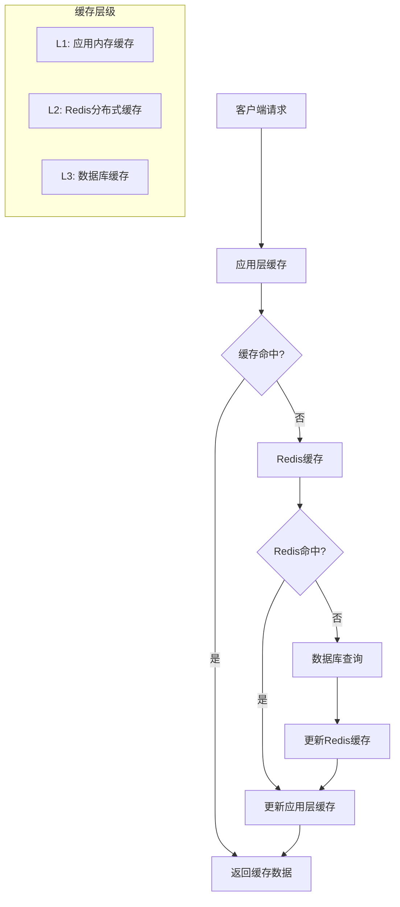
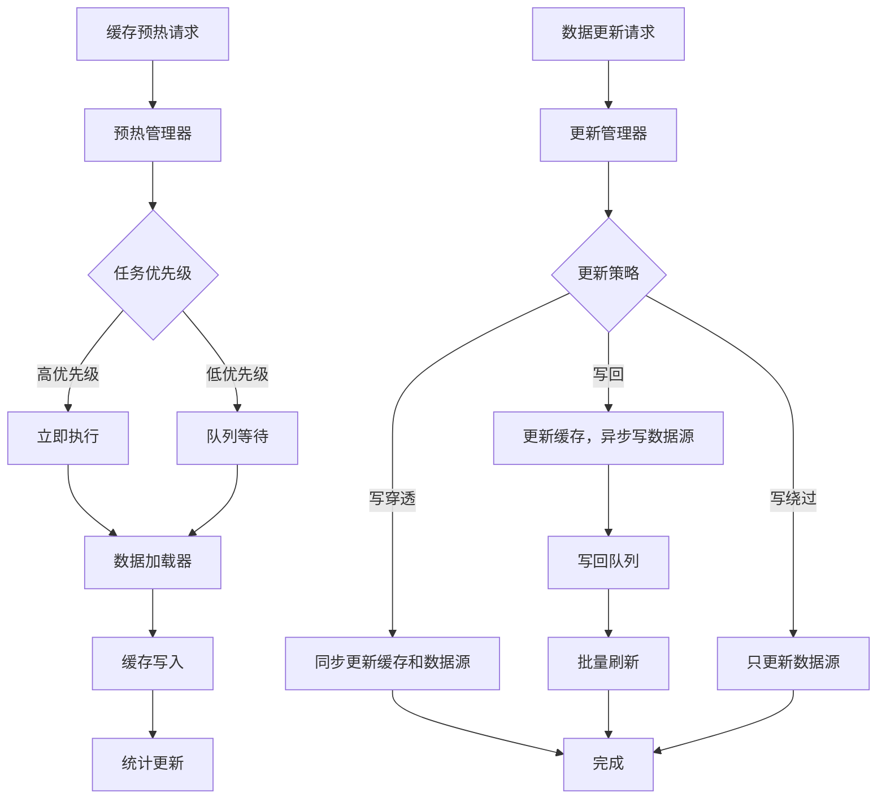
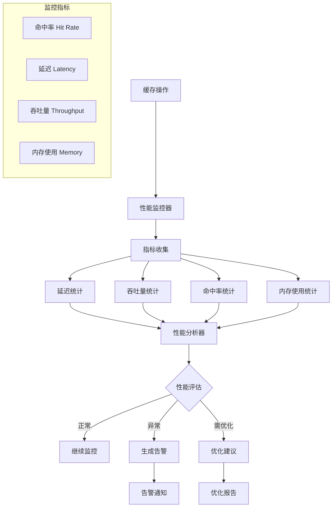

# 第12章 缓存系统与性能优化

## 本章实战要点
- 分层缓存: 进程内 LRU/TTL + Redis；显式失效策略避免脏读。
- 防击穿/雪崩: 缓存空值、过期抖动、请求合并(single flight)。
- 热点识别: 按 Key/路由维度统计命中率与QPS，动态调参。
- 一致性: 写后删缓存、延迟双删；强一致路径短路数据库。

## 参考命令
```bash
# 本地启动 Redis
docker run -p 6379:6379 redis:7

# 简易压测（缓存命中前后对比）
ab -n 2000 -c 100 http://127.0.0.1:3000/api/status
```

## 交叉引用
- 第7章：数据一致性与事务。
- 第11章：监控指标、命中率与延迟分布。
- 第17章：pprof/trace 验证优化收益。

## 12.1 缓存系统概述

在高并发的Web应用中，缓存是提升系统性能的重要手段。New API项目通过多层缓存架构，有效减少数据库访问压力，提升响应速度。本章将详细介绍缓存系统的设计与实现。

### 12.1.1 缓存架构设计



### 12.1.2 缓存策略

```go
package cache

import (
    "context"
    "encoding/json"
    "fmt"
    "sync"
    "time"
)

// 缓存策略类型
type CacheStrategy int

const (
    CacheStrategyLRU CacheStrategy = iota
    CacheStrategyLFU
    CacheStrategyTTL
    CacheStrategyFIFO
)

// 缓存接口
type Cache interface {
    Get(ctx context.Context, key string) (interface{}, error)
    Set(ctx context.Context, key string, value interface{}, ttl time.Duration) error
    Delete(ctx context.Context, key string) error
    Clear(ctx context.Context) error
    Stats() CacheStats
}

// 缓存统计
type CacheStats struct {
    Hits        int64   `json:"hits"`
    Misses      int64   `json:"misses"`
    HitRate     float64 `json:"hit_rate"`
    Size        int64   `json:"size"`
    MaxSize     int64   `json:"max_size"`
    Evictions   int64   `json:"evictions"`
    LastUpdated time.Time `json:"last_updated"`
}

// 缓存项
type CacheItem struct {
    Key        string      `json:"key"`
    Value      interface{} `json:"value"`
    TTL        time.Duration `json:"ttl"`
    CreatedAt  time.Time   `json:"created_at"`
    AccessedAt time.Time   `json:"accessed_at"`
    AccessCount int64      `json:"access_count"`
}

// 检查是否过期
func (item *CacheItem) IsExpired() bool {
    if item.TTL <= 0 {
        return false
    }
    return time.Since(item.CreatedAt) > item.TTL
}

// 更新访问信息
func (item *CacheItem) UpdateAccess() {
    item.AccessedAt = time.Now()
    item.AccessCount++
}
```

## 12.2 内存缓存实现

### 12.2.1 LRU缓存实现

```go
package cache

import (
    "container/list"
    "context"
    "sync"
    "time"
)

// LRU缓存节点
type lruNode struct {
    key   string
    value *CacheItem
}

// LRU缓存实现
type LRUCache struct {
    capacity int
    cache    map[string]*list.Element
    list     *list.List
    mutex    sync.RWMutex
    stats    CacheStats
}

// 创建LRU缓存
func NewLRUCache(capacity int) *LRUCache {
    return &LRUCache{
        capacity: capacity,
        cache:    make(map[string]*list.Element),
        list:     list.New(),
        stats: CacheStats{
            MaxSize:     int64(capacity),
            LastUpdated: time.Now(),
        },
    }
}

// 获取缓存项
func (lru *LRUCache) Get(ctx context.Context, key string) (interface{}, error) {
    lru.mutex.Lock()
    defer lru.mutex.Unlock()
    
    if elem, exists := lru.cache[key]; exists {
        node := elem.Value.(*lruNode)
        
        // 检查是否过期
        if node.value.IsExpired() {
            lru.removeElement(elem)
            lru.stats.Misses++
            return nil, fmt.Errorf("cache miss: key expired")
        }
        
        // 移动到链表头部
        lru.list.MoveToFront(elem)
        node.value.UpdateAccess()
        
        lru.stats.Hits++
        lru.updateHitRate()
        
        return node.value.Value, nil
    }
    
    lru.stats.Misses++
    lru.updateHitRate()
    return nil, fmt.Errorf("cache miss: key not found")
}

// 设置缓存项
func (lru *LRUCache) Set(ctx context.Context, key string, value interface{}, ttl time.Duration) error {
    lru.mutex.Lock()
    defer lru.mutex.Unlock()
    
    now := time.Now()
    item := &CacheItem{
        Key:         key,
        Value:       value,
        TTL:         ttl,
        CreatedAt:   now,
        AccessedAt:  now,
        AccessCount: 1,
    }
    
    if elem, exists := lru.cache[key]; exists {
        // 更新现有项
        node := elem.Value.(*lruNode)
        node.value = item
        lru.list.MoveToFront(elem)
    } else {
        // 添加新项
        if lru.list.Len() >= lru.capacity {
            lru.evictOldest()
        }
        
        node := &lruNode{key: key, value: item}
        elem := lru.list.PushFront(node)
        lru.cache[key] = elem
        
        lru.stats.Size++
    }
    
    lru.stats.LastUpdated = now
    return nil
}

// 删除缓存项
func (lru *LRUCache) Delete(ctx context.Context, key string) error {
    lru.mutex.Lock()
    defer lru.mutex.Unlock()
    
    if elem, exists := lru.cache[key]; exists {
        lru.removeElement(elem)
        return nil
    }
    
    return fmt.Errorf("key not found")
}

// 清空缓存
func (lru *LRUCache) Clear(ctx context.Context) error {
    lru.mutex.Lock()
    defer lru.mutex.Unlock()
    
    lru.cache = make(map[string]*list.Element)
    lru.list = list.New()
    lru.stats.Size = 0
    lru.stats.LastUpdated = time.Now()
    
    return nil
}

// 获取统计信息
func (lru *LRUCache) Stats() CacheStats {
    lru.mutex.RLock()
    defer lru.mutex.RUnlock()
    
    return lru.stats
}

// 淘汰最旧的项
func (lru *LRUCache) evictOldest() {
    if elem := lru.list.Back(); elem != nil {
        lru.removeElement(elem)
        lru.stats.Evictions++
    }
}

// 移除元素
func (lru *LRUCache) removeElement(elem *list.Element) {
    node := elem.Value.(*lruNode)
    delete(lru.cache, node.key)
    lru.list.Remove(elem)
    lru.stats.Size--
}

// 更新命中率
func (lru *LRUCache) updateHitRate() {
    total := lru.stats.Hits + lru.stats.Misses
    if total > 0 {
        lru.stats.HitRate = float64(lru.stats.Hits) / float64(total)
    }
}

// 清理过期项
func (lru *LRUCache) CleanupExpired() {
    lru.mutex.Lock()
    defer lru.mutex.Unlock()
    
    var toRemove []*list.Element
    
    for elem := lru.list.Back(); elem != nil; elem = elem.Prev() {
        node := elem.Value.(*lruNode)
        if node.value.IsExpired() {
            toRemove = append(toRemove, elem)
        }
    }
    
    for _, elem := range toRemove {
        lru.removeElement(elem)
        lru.stats.Evictions++
    }
}
```

### 12.2.2 TTL缓存实现

```go
package cache

import (
    "context"
    "sync"
    "time"
)

// TTL缓存实现
type TTLCache struct {
    cache   map[string]*CacheItem
    mutex   sync.RWMutex
    stats   CacheStats
    maxSize int
    
    // 清理器
    cleanupInterval time.Duration
    stopChan        chan struct{}
    wg              sync.WaitGroup
}

// 创建TTL缓存
func NewTTLCache(maxSize int, cleanupInterval time.Duration) *TTLCache {
    cache := &TTLCache{
        cache:           make(map[string]*CacheItem),
        maxSize:         maxSize,
        cleanupInterval: cleanupInterval,
        stopChan:        make(chan struct{}),
        stats: CacheStats{
            MaxSize:     int64(maxSize),
            LastUpdated: time.Now(),
        },
    }
    
    // 启动清理协程
    cache.wg.Add(1)
    go cache.cleanupLoop()
    
    return cache
}

// 获取缓存项
func (ttl *TTLCache) Get(ctx context.Context, key string) (interface{}, error) {
    ttl.mutex.RLock()
    defer ttl.mutex.RUnlock()
    
    if item, exists := ttl.cache[key]; exists {
        if item.IsExpired() {
            // 延迟删除过期项
            go func() {
                ttl.mutex.Lock()
                delete(ttl.cache, key)
                ttl.stats.Size--
                ttl.stats.Evictions++
                ttl.mutex.Unlock()
            }()
            
            ttl.stats.Misses++
            ttl.updateHitRate()
            return nil, fmt.Errorf("cache miss: key expired")
        }
        
        item.UpdateAccess()
        ttl.stats.Hits++
        ttl.updateHitRate()
        
        return item.Value, nil
    }
    
    ttl.stats.Misses++
    ttl.updateHitRate()
    return nil, fmt.Errorf("cache miss: key not found")
}

// 设置缓存项
func (ttl *TTLCache) Set(ctx context.Context, key string, value interface{}, duration time.Duration) error {
    ttl.mutex.Lock()
    defer ttl.mutex.Unlock()
    
    // 检查容量限制
    if len(ttl.cache) >= ttl.maxSize && ttl.cache[key] == nil {
        // 随机淘汰一个项（简单实现）
        for k := range ttl.cache {
            delete(ttl.cache, k)
            ttl.stats.Size--
            ttl.stats.Evictions++
            break
        }
    }
    
    now := time.Now()
    item := &CacheItem{
        Key:         key,
        Value:       value,
        TTL:         duration,
        CreatedAt:   now,
        AccessedAt:  now,
        AccessCount: 1,
    }
    
    if ttl.cache[key] == nil {
        ttl.stats.Size++
    }
    
    ttl.cache[key] = item
    ttl.stats.LastUpdated = now
    
    return nil
}

// 删除缓存项
func (ttl *TTLCache) Delete(ctx context.Context, key string) error {
    ttl.mutex.Lock()
    defer ttl.mutex.Unlock()
    
    if _, exists := ttl.cache[key]; exists {
        delete(ttl.cache, key)
        ttl.stats.Size--
        return nil
    }
    
    return fmt.Errorf("key not found")
}

// 清空缓存
func (ttl *TTLCache) Clear(ctx context.Context) error {
    ttl.mutex.Lock()
    defer ttl.mutex.Unlock()
    
    ttl.cache = make(map[string]*CacheItem)
    ttl.stats.Size = 0
    ttl.stats.LastUpdated = time.Now()
    
    return nil
}

// 获取统计信息
func (ttl *TTLCache) Stats() CacheStats {
    ttl.mutex.RLock()
    defer ttl.mutex.RUnlock()
    
    return ttl.stats
}

// 停止缓存
func (ttl *TTLCache) Stop() {
    close(ttl.stopChan)
    ttl.wg.Wait()
}

// 清理循环
func (ttl *TTLCache) cleanupLoop() {
    defer ttl.wg.Done()
    
    ticker := time.NewTicker(ttl.cleanupInterval)
    defer ticker.Stop()
    
    for {
        select {
        case <-ticker.C:
            ttl.cleanupExpired()
        case <-ttl.stopChan:
            return
        }
    }
}

// 清理过期项
func (ttl *TTLCache) cleanupExpired() {
    ttl.mutex.Lock()
    defer ttl.mutex.Unlock()
    
    var expiredKeys []string
    
    for key, item := range ttl.cache {
        if item.IsExpired() {
            expiredKeys = append(expiredKeys, key)
        }
    }
    
    for _, key := range expiredKeys {
        delete(ttl.cache, key)
        ttl.stats.Size--
        ttl.stats.Evictions++
    }
}

// 更新命中率
func (ttl *TTLCache) updateHitRate() {
    total := ttl.stats.Hits + ttl.stats.Misses
    if total > 0 {
        ttl.stats.HitRate = float64(ttl.stats.Hits) / float64(total)
    }
}
```

## 12.3 Redis分布式缓存

### 12.3.1 Redis缓存客户端

```go
package cache

import (
    "context"
    "encoding/json"
    "fmt"
    "time"
    
    "github.com/go-redis/redis/v8"
)

// Redis缓存配置
type RedisConfig struct {
    Addr         string        `json:"addr"`
    Password     string        `json:"password"`
    DB           int           `json:"db"`
    PoolSize     int           `json:"pool_size"`
    MinIdleConns int           `json:"min_idle_conns"`
    MaxRetries   int           `json:"max_retries"`
    DialTimeout  time.Duration `json:"dial_timeout"`
    ReadTimeout  time.Duration `json:"read_timeout"`
    WriteTimeout time.Duration `json:"write_timeout"`
    IdleTimeout  time.Duration `json:"idle_timeout"`
}

// 默认Redis配置
func DefaultRedisConfig() *RedisConfig {
    return &RedisConfig{
        Addr:         "localhost:6379",
        Password:     "",
        DB:           0,
        PoolSize:     10,
        MinIdleConns: 5,
        MaxRetries:   3,
        DialTimeout:  5 * time.Second,
        ReadTimeout:  3 * time.Second,
        WriteTimeout: 3 * time.Second,
        IdleTimeout:  5 * time.Minute,
    }
}

// Redis缓存实现
type RedisCache struct {
    client *redis.Client
    config *RedisConfig
    stats  CacheStats
    prefix string
}

// 创建Redis缓存
func NewRedisCache(config *RedisConfig, prefix string) *RedisCache {
    client := redis.NewClient(&redis.Options{
        Addr:         config.Addr,
        Password:     config.Password,
        DB:           config.DB,
        PoolSize:     config.PoolSize,
        MinIdleConns: config.MinIdleConns,
        MaxRetries:   config.MaxRetries,
        DialTimeout:  config.DialTimeout,
        ReadTimeout:  config.ReadTimeout,
        WriteTimeout: config.WriteTimeout,
        IdleTimeout:  config.IdleTimeout,
    })
    
    return &RedisCache{
        client: client,
        config: config,
        prefix: prefix,
        stats: CacheStats{
            LastUpdated: time.Now(),
        },
    }
}

// 获取缓存项
func (rc *RedisCache) Get(ctx context.Context, key string) (interface{}, error) {
    fullKey := rc.buildKey(key)
    
    val, err := rc.client.Get(ctx, fullKey).Result()
    if err != nil {
        if err == redis.Nil {
            rc.stats.Misses++
            rc.updateHitRate()
            return nil, fmt.Errorf("cache miss: key not found")
        }
        return nil, err
    }
    
    var result interface{}
    if err := json.Unmarshal([]byte(val), &result); err != nil {
        return nil, err
    }
    
    rc.stats.Hits++
    rc.updateHitRate()
    
    return result, nil
}

// 设置缓存项
func (rc *RedisCache) Set(ctx context.Context, key string, value interface{}, ttl time.Duration) error {
    fullKey := rc.buildKey(key)
    
    data, err := json.Marshal(value)
    if err != nil {
        return err
    }
    
    err = rc.client.Set(ctx, fullKey, data, ttl).Err()
    if err != nil {
        return err
    }
    
    rc.stats.LastUpdated = time.Now()
    return nil
}

// 删除缓存项
func (rc *RedisCache) Delete(ctx context.Context, key string) error {
    fullKey := rc.buildKey(key)
    
    err := rc.client.Del(ctx, fullKey).Err()
    if err != nil {
        return err
    }
    
    return nil
}

// 清空缓存
func (rc *RedisCache) Clear(ctx context.Context) error {
    pattern := rc.buildKey("*")
    
    keys, err := rc.client.Keys(ctx, pattern).Result()
    if err != nil {
        return err
    }
    
    if len(keys) > 0 {
        err = rc.client.Del(ctx, keys...).Err()
        if err != nil {
            return err
        }
    }
    
    rc.stats.LastUpdated = time.Now()
    return nil
}

// 获取统计信息
func (rc *RedisCache) Stats() CacheStats {
    return rc.stats
}

// 构建完整键名
func (rc *RedisCache) buildKey(key string) string {
    if rc.prefix == "" {
        return key
    }
    return fmt.Sprintf("%s:%s", rc.prefix, key)
}

// 更新命中率
func (rc *RedisCache) updateHitRate() {
    total := rc.stats.Hits + rc.stats.Misses
    if total > 0 {
        rc.stats.HitRate = float64(rc.stats.Hits) / float64(total)
    }
}

// 批量获取
func (rc *RedisCache) MGet(ctx context.Context, keys []string) (map[string]interface{}, error) {
    if len(keys) == 0 {
        return make(map[string]interface{}), nil
    }
    
    fullKeys := make([]string, len(keys))
    for i, key := range keys {
        fullKeys[i] = rc.buildKey(key)
    }
    
    vals, err := rc.client.MGet(ctx, fullKeys...).Result()
    if err != nil {
        return nil, err
    }
    
    result := make(map[string]interface{})
    
    for i, val := range vals {
        if val != nil {
            var value interface{}
            if err := json.Unmarshal([]byte(val.(string)), &value); err == nil {
                result[keys[i]] = value
                rc.stats.Hits++
            }
        } else {
            rc.stats.Misses++
        }
    }
    
    rc.updateHitRate()
    return result, nil
}

// 批量设置
func (rc *RedisCache) MSet(ctx context.Context, items map[string]interface{}, ttl time.Duration) error {
    if len(items) == 0 {
        return nil
    }
    
    pipe := rc.client.Pipeline()
    
    for key, value := range items {
        fullKey := rc.buildKey(key)
        data, err := json.Marshal(value)
        if err != nil {
            return err
        }
        
        pipe.Set(ctx, fullKey, data, ttl)
    }
    
    _, err := pipe.Exec(ctx)
    if err != nil {
        return err
    }
    
    rc.stats.LastUpdated = time.Now()
    return nil
}

// 检查连接
func (rc *RedisCache) Ping(ctx context.Context) error {
    return rc.client.Ping(ctx).Err()
}

// 关闭连接
func (rc *RedisCache) Close() error {
    return rc.client.Close()
}
```

## 12.4 多层缓存管理器

### 12.4.1 缓存管理器设计

```go
package cache

import (
    "context"
    "fmt"
    "sync"
    "time"
)

// 缓存层级
type CacheLevel int

const (
    CacheLevelL1 CacheLevel = iota // 应用内存缓存
    CacheLevelL2                   // Redis分布式缓存
    CacheLevelL3                   // 数据库缓存
)

// 多层缓存管理器
type MultiLevelCacheManager struct {
    l1Cache Cache // 内存缓存
    l2Cache Cache // Redis缓存
    
    // 配置
    l1TTL time.Duration
    l2TTL time.Duration
    
    // 统计
    stats MultiLevelStats
    mutex sync.RWMutex
}

// 多层缓存统计
type MultiLevelStats struct {
    L1Stats CacheStats `json:"l1_stats"`
    L2Stats CacheStats `json:"l2_stats"`
    
    TotalHits   int64   `json:"total_hits"`
    TotalMisses int64   `json:"total_misses"`
    HitRate     float64 `json:"hit_rate"`
    
    L1HitRate float64 `json:"l1_hit_rate"`
    L2HitRate float64 `json:"l2_hit_rate"`
    
    LastUpdated time.Time `json:"last_updated"`
}

// 创建多层缓存管理器
func NewMultiLevelCacheManager(l1Cache, l2Cache Cache, l1TTL, l2TTL time.Duration) *MultiLevelCacheManager {
    return &MultiLevelCacheManager{
        l1Cache: l1Cache,
        l2Cache: l2Cache,
        l1TTL:   l1TTL,
        l2TTL:   l2TTL,
        stats: MultiLevelStats{
            LastUpdated: time.Now(),
        },
    }
}

// 获取缓存项
func (mlc *MultiLevelCacheManager) Get(ctx context.Context, key string) (interface{}, error) {
    // 尝试从L1缓存获取
    if value, err := mlc.l1Cache.Get(ctx, key); err == nil {
        mlc.updateStats(CacheLevelL1, true)
        return value, nil
    }
    
    // 尝试从L2缓存获取
    if value, err := mlc.l2Cache.Get(ctx, key); err == nil {
        // 回填到L1缓存
        go func() {
            mlc.l1Cache.Set(context.Background(), key, value, mlc.l1TTL)
        }()
        
        mlc.updateStats(CacheLevelL2, true)
        return value, nil
    }
    
    mlc.updateStats(CacheLevelL3, false)
    return nil, fmt.Errorf("cache miss at all levels")
}

// 设置缓存项
func (mlc *MultiLevelCacheManager) Set(ctx context.Context, key string, value interface{}) error {
    // 同时设置到L1和L2缓存
    errChan := make(chan error, 2)
    
    go func() {
        errChan <- mlc.l1Cache.Set(ctx, key, value, mlc.l1TTL)
    }()
    
    go func() {
        errChan <- mlc.l2Cache.Set(ctx, key, value, mlc.l2TTL)
    }()
    
    // 等待两个操作完成
    var errors []error
    for i := 0; i < 2; i++ {
        if err := <-errChan; err != nil {
            errors = append(errors, err)
        }
    }
    
    if len(errors) > 0 {
        return fmt.Errorf("cache set errors: %v", errors)
    }
    
    mlc.mutex.Lock()
    mlc.stats.LastUpdated = time.Now()
    mlc.mutex.Unlock()
    
    return nil
}

// 删除缓存项
func (mlc *MultiLevelCacheManager) Delete(ctx context.Context, key string) error {
    errChan := make(chan error, 2)
    
    go func() {
        errChan <- mlc.l1Cache.Delete(ctx, key)
    }()
    
    go func() {
        errChan <- mlc.l2Cache.Delete(ctx, key)
    }()
    
    var errors []error
    for i := 0; i < 2; i++ {
        if err := <-errChan; err != nil {
            errors = append(errors, err)
        }
    }
    
    if len(errors) > 0 {
        return fmt.Errorf("cache delete errors: %v", errors)
    }
    
    return nil
}

// 清空缓存
func (mlc *MultiLevelCacheManager) Clear(ctx context.Context) error {
    errChan := make(chan error, 2)
    
    go func() {
        errChan <- mlc.l1Cache.Clear(ctx)
    }()
    
    go func() {
        errChan <- mlc.l2Cache.Clear(ctx)
    }()
    
    var errors []error
    for i := 0; i < 2; i++ {
        if err := <-errChan; err != nil {
            errors = append(errors, err)
        }
    }
    
    if len(errors) > 0 {
        return fmt.Errorf("cache clear errors: %v", errors)
    }
    
    return nil
}

// 获取统计信息
func (mlc *MultiLevelCacheManager) Stats() MultiLevelStats {
    mlc.mutex.RLock()
    defer mlc.mutex.RUnlock()
    
    mlc.stats.L1Stats = mlc.l1Cache.Stats()
    mlc.stats.L2Stats = mlc.l2Cache.Stats()
    
    return mlc.stats
}

// 更新统计信息
func (mlc *MultiLevelCacheManager) updateStats(level CacheLevel, hit bool) {
    mlc.mutex.Lock()
    defer mlc.mutex.Unlock()
    
    if hit {
        mlc.stats.TotalHits++
        
        switch level {
        case CacheLevelL1:
            // L1命中
        case CacheLevelL2:
            // L2命中
        }
    } else {
        mlc.stats.TotalMisses++
    }
    
    // 更新命中率
    total := mlc.stats.TotalHits + mlc.stats.TotalMisses
    if total > 0 {
        mlc.stats.HitRate = float64(mlc.stats.TotalHits) / float64(total)
    }
    
    mlc.stats.LastUpdated = time.Now()
}

// 预热缓存
func (mlc *MultiLevelCacheManager) Warmup(ctx context.Context, data map[string]interface{}) error {
    for key, value := range data {
        if err := mlc.Set(ctx, key, value); err != nil {
            return fmt.Errorf("warmup failed for key %s: %v", key, err)
        }
    }
    
    return nil
}
```

### 12.4.2 缓存装饰器

```go
package cache

import (
    "context"
    "crypto/md5"
    "encoding/json"
    "fmt"
    "reflect"
    "time"
)

// 缓存装饰器
type CacheDecorator struct {
    cache  Cache
    prefix string
    ttl    time.Duration
}

// 创建缓存装饰器
func NewCacheDecorator(cache Cache, prefix string, ttl time.Duration) *CacheDecorator {
    return &CacheDecorator{
        cache:  cache,
        prefix: prefix,
        ttl:    ttl,
    }
}

// 缓存函数调用结果
func (cd *CacheDecorator) CacheFunc(ctx context.Context, fn interface{}, args ...interface{}) ([]reflect.Value, error) {
    // 生成缓存键
    key, err := cd.generateKey(fn, args...)
    if err != nil {
        return nil, err
    }
    
    // 尝试从缓存获取
    if cached, err := cd.cache.Get(ctx, key); err == nil {
        var result []reflect.Value
        if err := json.Unmarshal(cached.([]byte), &result); err == nil {
            return result, nil
        }
    }
    
    // 执行函数
    fnValue := reflect.ValueOf(fn)
    if fnValue.Kind() != reflect.Func {
        return nil, fmt.Errorf("not a function")
    }
    
    argValues := make([]reflect.Value, len(args))
    for i, arg := range args {
        argValues[i] = reflect.ValueOf(arg)
    }
    
    results := fnValue.Call(argValues)
    
    // 缓存结果
    if data, err := json.Marshal(results); err == nil {
        cd.cache.Set(ctx, key, data, cd.ttl)
    }
    
    return results, nil
}

// 生成缓存键
func (cd *CacheDecorator) generateKey(fn interface{}, args ...interface{}) (string, error) {
    fnType := reflect.TypeOf(fn)
    
    keyData := struct {
        Prefix   string      `json:"prefix"`
        FuncName string      `json:"func_name"`
        Args     interface{} `json:"args"`
    }{
        Prefix:   cd.prefix,
        FuncName: fnType.String(),
        Args:     args,
    }
    
    data, err := json.Marshal(keyData)
    if err != nil {
        return "", err
    }
    
    hash := md5.Sum(data)
    return fmt.Sprintf("%s:%x", cd.prefix, hash), nil
}

// 缓存方法装饰器
type MethodCacheDecorator struct {
    *CacheDecorator
}

// 创建方法缓存装饰器
func NewMethodCacheDecorator(cache Cache, prefix string, ttl time.Duration) *MethodCacheDecorator {
    return &MethodCacheDecorator{
        CacheDecorator: NewCacheDecorator(cache, prefix, ttl),
    }
}

// 缓存方法调用
func (mcd *MethodCacheDecorator) CacheMethod(ctx context.Context, obj interface{}, methodName string, args ...interface{}) ([]reflect.Value, error) {
    objValue := reflect.ValueOf(obj)
    method := objValue.MethodByName(methodName)
    
    if !method.IsValid() {
        return nil, fmt.Errorf("method %s not found", methodName)
    }
    
    // 生成包含对象信息的缓存键
    key, err := mcd.generateMethodKey(obj, methodName, args...)
    if err != nil {
        return nil, err
    }
    
    // 尝试从缓存获取
    if cached, err := mcd.cache.Get(ctx, key); err == nil {
        var result []reflect.Value
        if err := json.Unmarshal(cached.([]byte), &result); err == nil {
            return result, nil
        }
    }
    
    // 执行方法
    argValues := make([]reflect.Value, len(args))
    for i, arg := range args {
        argValues[i] = reflect.ValueOf(arg)
    }
    
    results := method.Call(argValues)
    
    // 缓存结果
    if data, err := json.Marshal(results); err == nil {
        mcd.cache.Set(ctx, key, data, mcd.ttl)
    }
    
    return results, nil
}

// 生成方法缓存键
func (mcd *MethodCacheDecorator) generateMethodKey(obj interface{}, methodName string, args ...interface{}) (string, error) {
    objType := reflect.TypeOf(obj)
    
    keyData := struct {
        Prefix     string      `json:"prefix"`
        ObjectType string      `json:"object_type"`
        MethodName string      `json:"method_name"`
        Args       interface{} `json:"args"`
    }{
        Prefix:     mcd.prefix,
        ObjectType: objType.String(),
        MethodName: methodName,
        Args:       args,
    }
    
    data, err := json.Marshal(keyData)
    if err != nil {
        return "", err
    }
    
    hash := md5.Sum(data)
    return fmt.Sprintf("%s:%s:%s:%x", mcd.prefix, objType.Name(), methodName, hash), nil
}
```

## 12.5 缓存预热与更新策略

缓存预热与更新策略是缓存系统高效运行的关键环节。通过合理的预热机制，可以在系统启动时提前加载热点数据；通过灵活的更新策略，可以保证缓存与数据源的一致性，同时优化写入性能。

### 核心功能

1. **智能预热**：基于历史访问模式和业务规则的预热策略
2. **多种更新策略**：支持写穿透、写回、写绕过等多种更新模式
3. **批量处理**：优化写入性能，减少数据源压力
4. **监控统计**：全面的预热和更新性能指标


*图13：缓存预热与更新策略流程图*

### 核心概念解析

**缓存预热（Cache Warming）**
- 在系统启动或低峰期提前加载热点数据到缓存
- 避免冷启动时的缓存穿透问题
- 提升用户首次访问的响应速度

**写穿透策略（Write-Through）**
- 同时更新缓存和数据源
- 保证强一致性，但写入延迟较高
- 适用于对一致性要求严格的场景

**写回策略（Write-Back）**
- 先更新缓存，异步批量写入数据源
- 提升写入性能，但存在数据丢失风险
- 适用于写入频繁、对性能要求高的场景

**写绕过策略（Write-Around）**
- 只更新数据源，不更新缓存
- 避免写入热点数据污染缓存
- 适用于写多读少的场景

### 12.5.1 缓存预热系统

```go
package cache

import (
    "context"
    "fmt"
    "sync"
    "time"
)

// 预热任务
// 功能：定义单个缓存预热任务的配置和行为
// 特点：
// - 支持优先级调度，高优先级任务优先执行
// - 灵活的数据加载器，支持任意数据源
// - 可配置的执行间隔，支持定时预热
// - 动态启用/禁用控制
type WarmupTask struct {
    Name     string                 `json:"name"`     // 任务名称，用于标识和管理
    Key      string                 `json:"key"`      // 缓存键名
    Loader   func(ctx context.Context) (interface{}, error) `json:"-"` // 数据加载函数
    TTL      time.Duration          `json:"ttl"`      // 缓存过期时间
    Priority int                    `json:"priority"` // 任务优先级，数值越大优先级越高
    Interval time.Duration          `json:"interval"` // 执行间隔，0表示只执行一次
    Enabled  bool                   `json:"enabled"`  // 是否启用该任务
}

// 预热管理器
type WarmupManager struct {
    cache Cache
    tasks map[string]*WarmupTask
    mutex sync.RWMutex
    
    // 控制
    stopChan chan struct{}
    wg       sync.WaitGroup
    
    // 统计
    stats WarmupStats
}

// 预热统计
type WarmupStats struct {
    TotalTasks    int       `json:"total_tasks"`
    CompletedTasks int      `json:"completed_tasks"`
    FailedTasks   int       `json:"failed_tasks"`
    LastWarmup    time.Time `json:"last_warmup"`
    Duration      time.Duration `json:"duration"`
}

// 创建预热管理器
// 功能：初始化缓存预热管理器
// 参数：
//   - cache: 目标缓存实例
// 返回：配置完成的预热管理器
func NewWarmupManager(cache Cache) *WarmupManager {
    return &WarmupManager{
        cache:    cache,                        // 目标缓存
        tasks:    make(map[string]*WarmupTask), // 任务映射表
        stopChan: make(chan struct{}),          // 停止信号通道
    }
}

// 添加预热任务
func (wm *WarmupManager) AddTask(task *WarmupTask) {
    wm.mutex.Lock()
    defer wm.mutex.Unlock()
    
    wm.tasks[task.Name] = task
    wm.stats.TotalTasks++
}

// 移除预热任务
func (wm *WarmupManager) RemoveTask(name string) {
    wm.mutex.Lock()
    defer wm.mutex.Unlock()
    
    if _, exists := wm.tasks[name]; exists {
        delete(wm.tasks, name)
        wm.stats.TotalTasks--
    }
}

// 执行预热
// 功能：执行所有启用的预热任务
// 特点：
// - 按优先级排序执行，确保重要数据优先加载
// - 并发执行提升效率，通过信号量控制并发数
// - 完整的错误处理和统计收集
// 步骤：
// 1. 收集启用的任务
// 2. 按优先级排序
// 3. 并发执行任务
// 4. 统计执行结果
func (wm *WarmupManager) Warmup(ctx context.Context) error {
    start := time.Now() // 记录开始时间
    
    // 步骤1：收集所有启用的预热任务
    wm.mutex.RLock()
    tasks := make([]*WarmupTask, 0, len(wm.tasks))
    for _, task := range wm.tasks {
        if task.Enabled { // 只处理启用的任务
            tasks = append(tasks, task)
        }
    }
    wm.mutex.RUnlock()
    
    // 步骤2：按优先级排序（冒泡排序，高优先级在前）
    for i := 0; i < len(tasks)-1; i++ {
        for j := i + 1; j < len(tasks); j++ {
            if tasks[i].Priority < tasks[j].Priority {
                tasks[i], tasks[j] = tasks[j], tasks[i]
            }
        }
    }
    
    // 步骤3：并发执行预热任务
    semaphore := make(chan struct{}, 10) // 限制并发数为10，避免资源过度消耗
    var wg sync.WaitGroup                // 等待所有任务完成
    
    for _, task := range tasks {
        wg.Add(1)
        go func(t *WarmupTask) {
            defer wg.Done()
            
            semaphore <- struct{}{}
            defer func() { <-semaphore }()
            
            if err := wm.executeTask(ctx, t); err != nil {
                wm.mutex.Lock()
                wm.stats.FailedTasks++
                wm.mutex.Unlock()
                fmt.Printf("Warmup task %s failed: %v\n", t.Name, err)
            } else {
                wm.mutex.Lock()
                wm.stats.CompletedTasks++
                wm.mutex.Unlock()
            }
        }(task)
    }
    
    wg.Wait()
    
    wm.mutex.Lock()
    wm.stats.LastWarmup = start
    wm.stats.Duration = time.Since(start)
    wm.mutex.Unlock()
    
    return nil
}

// 执行单个预热任务
func (wm *WarmupManager) executeTask(ctx context.Context, task *WarmupTask) error {
    value, err := task.Loader(ctx)
    if err != nil {
        return err
    }
    
    return wm.cache.Set(ctx, task.Key, value, task.TTL)
}

// 启动定时预热
func (wm *WarmupManager) Start(ctx context.Context) {
    wm.wg.Add(1)
    go wm.warmupLoop(ctx)
}

// 停止预热
func (wm *WarmupManager) Stop() {
    close(wm.stopChan)
    wm.wg.Wait()
}

// 预热循环
func (wm *WarmupManager) warmupLoop(ctx context.Context) {
    defer wm.wg.Done()
    
    ticker := time.NewTicker(5 * time.Minute) // 默认5分钟检查一次
    defer ticker.Stop()
    
    for {
        select {
        case <-ticker.C:
            wm.checkAndWarmup(ctx)
        case <-wm.stopChan:
            return
        case <-ctx.Done():
            return
        }
    }
}

// 检查并执行预热
func (wm *WarmupManager) checkAndWarmup(ctx context.Context) {
    wm.mutex.RLock()
    defer wm.mutex.RUnlock()
    
    now := time.Now()
    
    for _, task := range wm.tasks {
        if !task.Enabled || task.Interval <= 0 {
            continue
        }
        
        // 检查是否需要预热
        if now.Sub(wm.stats.LastWarmup) >= task.Interval {
            go func(t *WarmupTask) {
                if err := wm.executeTask(ctx, t); err != nil {
                    fmt.Printf("Scheduled warmup task %s failed: %v\n", t.Name, err)
                }
            }(task)
        }
    }
}

// 获取统计信息
func (wm *WarmupManager) Stats() WarmupStats {
    wm.mutex.RLock()
    defer wm.mutex.RUnlock()
    
    return wm.stats
}
```

### 12.5.2 缓存更新策略

```go
package cache

import (
    "context"
    "fmt"
    "sync"
    "time"
)

// 更新策略类型
type UpdateStrategy int

const (
    UpdateStrategyWriteThrough UpdateStrategy = iota // 写穿透
    UpdateStrategyWriteBack                          // 写回
    UpdateStrategyWriteAround                        // 写绕过
)

// 缓存更新管理器
type CacheUpdateManager struct {
    cache    Cache
    strategy UpdateStrategy
    
    // 写回队列
    writeBackQueue chan *WriteBackItem
    batchSize      int
    flushInterval  time.Duration
    
    // 控制
    stopChan chan struct{}
    wg       sync.WaitGroup
    
    // 统计
    stats UpdateStats
    mutex sync.RWMutex
}

// 写回项
type WriteBackItem struct {
    Key       string      `json:"key"`
    Value     interface{} `json:"value"`
    Timestamp time.Time   `json:"timestamp"`
    TTL       time.Duration `json:"ttl"`
}

// 更新统计
type UpdateStats struct {
    WriteThroughCount int64     `json:"write_through_count"`
    WriteBackCount    int64     `json:"write_back_count"`
    WriteAroundCount  int64     `json:"write_around_count"`
    FlushCount        int64     `json:"flush_count"`
    LastFlush         time.Time `json:"last_flush"`
}

// 创建缓存更新管理器
func NewCacheUpdateManager(cache Cache, strategy UpdateStrategy) *CacheUpdateManager {
    manager := &CacheUpdateManager{
        cache:          cache,
        strategy:       strategy,
        writeBackQueue: make(chan *WriteBackItem, 1000),
        batchSize:      100,
        flushInterval:  30 * time.Second,
        stopChan:       make(chan struct{}),
    }
    
    if strategy == UpdateStrategyWriteBack {
        manager.wg.Add(1)
        go manager.writeBackLoop()
    }
    
    return manager
}

// 更新缓存
func (cum *CacheUpdateManager) Update(ctx context.Context, key string, value interface{}, ttl time.Duration) error {
    switch cum.strategy {
    case UpdateStrategyWriteThrough:
        return cum.writeThrough(ctx, key, value, ttl)
    case UpdateStrategyWriteBack:
        return cum.writeBack(ctx, key, value, ttl)
    case UpdateStrategyWriteAround:
        return cum.writeAround(ctx, key, value, ttl)
    default:
        return fmt.Errorf("unknown update strategy")
    }
}

// 写穿透策略
func (cum *CacheUpdateManager) writeThrough(ctx context.Context, key string, value interface{}, ttl time.Duration) error {
    // 同时更新缓存和数据源
    if err := cum.cache.Set(ctx, key, value, ttl); err != nil {
        return err
    }
    
    cum.mutex.Lock()
    cum.stats.WriteThroughCount++
    cum.mutex.Unlock()
    
    return nil
}

// 写回策略
func (cum *CacheUpdateManager) writeBack(ctx context.Context, key string, value interface{}, ttl time.Duration) error {
    // 先更新缓存，延迟写入数据源
    if err := cum.cache.Set(ctx, key, value, ttl); err != nil {
        return err
    }
    
    // 添加到写回队列
    item := &WriteBackItem{
        Key:       key,
        Value:     value,
        Timestamp: time.Now(),
        TTL:       ttl,
    }
    
    select {
    case cum.writeBackQueue <- item:
        cum.mutex.Lock()
        cum.stats.WriteBackCount++
        cum.mutex.Unlock()
        return nil
    default:
        return fmt.Errorf("write back queue full")
    }
}

// 写绕过策略
func (cum *CacheUpdateManager) writeAround(ctx context.Context, key string, value interface{}, ttl time.Duration) error {
    // 只更新数据源，不更新缓存
    // 这里应该调用数据源的更新方法
    
    cum.mutex.Lock()
    cum.stats.WriteAroundCount++
    cum.mutex.Unlock()
    
    return nil
}

// 写回循环
func (cum *CacheUpdateManager) writeBackLoop() {
    defer cum.wg.Done()
    
    ticker := time.NewTicker(cum.flushInterval)
    defer ticker.Stop()
    
    batch := make([]*WriteBackItem, 0, cum.batchSize)
    
    for {
        select {
        case item := <-cum.writeBackQueue:
            batch = append(batch, item)
            
            if len(batch) >= cum.batchSize {
                cum.flushBatch(batch)
                batch = batch[:0]
            }
            
        case <-ticker.C:
            if len(batch) > 0 {
                cum.flushBatch(batch)
                batch = batch[:0]
            }
            
        case <-cum.stopChan:
            // 处理剩余的批次
            if len(batch) > 0 {
                cum.flushBatch(batch)
            }
            
            // 处理队列中剩余的项
            for {
                select {
                case item := <-cum.writeBackQueue:
                    batch = append(batch, item)
                    if len(batch) >= cum.batchSize {
                        cum.flushBatch(batch)
                        batch = batch[:0]
                    }
                default:
                    if len(batch) > 0 {
                        cum.flushBatch(batch)
                    }
                    return
                }
            }
        }
    }
}

// 刷新批次
func (cum *CacheUpdateManager) flushBatch(batch []*WriteBackItem) {
    // 这里应该批量写入数据源
    // 示例：批量写入数据库
    
    cum.mutex.Lock()
    cum.stats.FlushCount++
    cum.stats.LastFlush = time.Now()
    cum.mutex.Unlock()
    
    fmt.Printf("Flushed %d items to data source\n", len(batch))
}

// 强制刷新
func (cum *CacheUpdateManager) Flush(ctx context.Context) error {
    // 等待写回队列清空
    timeout := time.After(30 * time.Second)
    
    for {
        select {
        case <-timeout:
            return fmt.Errorf("flush timeout")
        default:
            if len(cum.writeBackQueue) == 0 {
                return nil
            }
            time.Sleep(100 * time.Millisecond)
        }
    }
}

// 停止更新管理器
func (cum *CacheUpdateManager) Stop() {
    close(cum.stopChan)
    cum.wg.Wait()
}

// 获取统计信息
func (cum *CacheUpdateManager) Stats() UpdateStats {
    cum.mutex.RLock()
    defer cum.mutex.RUnlock()
    
    return cum.stats
}
```

## 12.6 性能监控与优化

性能监控与优化是缓存系统持续改进的重要环节。通过全面的性能指标收集、实时监控和智能分析，可以及时发现性能瓶颈，提供针对性的优化建议，确保缓存系统始终运行在最佳状态。

### 核心功能

1. **全面指标收集**：命中率、延迟、吞吐量、内存使用等多维度指标
2. **实时性能监控**：持续监控系统运行状态，及时发现异常
3. **智能优化建议**：基于性能数据分析，自动生成优化建议
4. **可视化展示**：直观的性能图表和报告


*图14：缓存性能监控与优化架构图*

### 核心概念解析

**性能指标体系**
- **命中率（Hit Rate）**：缓存命中次数与总访问次数的比值，反映缓存效率
- **延迟（Latency）**：操作响应时间，包括平均延迟和百分位延迟
- **吞吐量（Throughput）**：单位时间内处理的操作数量
- **内存利用率**：已使用内存与总内存的比值

**性能监控策略**
- **采样监控**：通过采样减少监控开销，保证系统性能
- **滑动窗口**：使用时间窗口统计，反映最新的性能状态
- **百分位统计**：P95、P99等百分位延迟，更准确反映用户体验

**优化决策算法**
- **阈值告警**：基于预设阈值触发性能告警
- **趋势分析**：分析性能指标变化趋势，预测潜在问题
- **智能建议**：基于历史数据和最佳实践生成优化建议

### 12.6.1 性能监控系统

```go
package cache

import (
    "context"
    "runtime"
    "sync"
    "time"
)

// 性能指标
// 功能：定义缓存系统的全面性能指标
// 特点：
// - 多维度指标覆盖：缓存效率、响应延迟、处理能力、资源使用
// - 百分位延迟统计：更准确反映用户体验
// - 实时性：带时间戳的快照数据
type PerformanceMetrics struct {
    // 缓存效率指标
    HitRate         float64       `json:"hit_rate"`         // 命中率：命中次数/总请求次数
    MissRate        float64       `json:"miss_rate"`        // 未命中率：未命中次数/总请求次数
    EvictionRate    float64       `json:"eviction_rate"`    // 淘汰率：淘汰次数/总操作次数
    
    // 响应延迟指标
    AvgGetLatency   time.Duration `json:"avg_get_latency"`  // 平均Get操作延迟
    AvgSetLatency   time.Duration `json:"avg_set_latency"`  // 平均Set操作延迟
    P95GetLatency   time.Duration `json:"p95_get_latency"`  // 95%分位Get延迟
    P95SetLatency   time.Duration `json:"p95_set_latency"`  // 95%分位Set延迟
    
    // 处理能力指标
    GetThroughput   float64       `json:"get_throughput"`   // Get操作吞吐量（ops/s）
    SetThroughput   float64       `json:"set_throughput"`   // Set操作吞吐量（ops/s）
    
    // 资源使用指标
    MemoryUsage     int64         `json:"memory_usage"`     // 当前内存使用量（字节）
    MemoryLimit     int64         `json:"memory_limit"`     // 内存限制（字节）
    MemoryUtilization float64     `json:"memory_utilization"` // 内存利用率（0-1）
    
    // 时间戳
    Timestamp       time.Time     `json:"timestamp"`        // 指标采集时间
}

// 性能监控器
type PerformanceMonitor struct {
    cache Cache
    
    // 指标收集
    getLatencies []time.Duration
    setLatencies []time.Duration
    
    getCount int64
    setCount int64
    
    startTime time.Time
    mutex     sync.RWMutex
    
    // 配置
    sampleSize int
    interval   time.Duration
    
    // 控制
    stopChan chan struct{}
    wg       sync.WaitGroup
}

// 创建性能监控器
// 功能：初始化缓存性能监控器
// 参数：
//   - cache: 被监控的缓存实例
//   - sampleSize: 延迟样本大小，用于计算百分位数
//   - interval: 监控数据收集间隔
// 返回：配置完成的性能监控器
func NewPerformanceMonitor(cache Cache, sampleSize int, interval time.Duration) *PerformanceMonitor {
    return &PerformanceMonitor{
        cache:        cache,                                    // 目标缓存实例
        sampleSize:   sampleSize,                              // 样本大小
        interval:     interval,                                // 收集间隔
        getLatencies: make([]time.Duration, 0, sampleSize),    // Get延迟样本
        setLatencies: make([]time.Duration, 0, sampleSize),    // Set延迟样本
        startTime:    time.Now(),                              // 监控开始时间
        stopChan:     make(chan struct{}),                     // 停止信号通道
    }
}

// 启动监控
// 功能：启动性能监控器，开始收集性能指标
// 参数：ctx - 上下文，用于控制监控生命周期
// 特点：
// - 异步执行：在独立goroutine中运行监控逻辑
// - 优雅管理：使用WaitGroup确保协程正确启动
// - 上下文控制：支持通过context取消监控
func (pm *PerformanceMonitor) Start(ctx context.Context) {
    pm.wg.Add(1)                    // 增加等待组计数
    go pm.monitorLoop(ctx)          // 启动异步监控循环
}

// 停止监控
// 功能：停止性能监控器，结束指标收集
// 特点：
// - 优雅停止：通过通道信号通知监控协程退出
// - 同步等待：确保监控协程完全退出后返回
// - 资源清理：避免goroutine泄漏
func (pm *PerformanceMonitor) Stop() {
    close(pm.stopChan)              // 发送停止信号
    pm.wg.Wait()                    // 等待监控协程退出
}

// 记录Get操作延迟
// 功能：记录单次Get操作的响应延迟
// 参数：latency - Get操作的执行时间
// 特点：
// - 线程安全：使用互斥锁保护共享数据
// - 滑动窗口：维护固定大小的延迟样本集合
// - 循环覆盖：样本满时用新数据替换最旧数据
func (pm *PerformanceMonitor) RecordGetLatency(latency time.Duration) {
    pm.mutex.Lock()                 // 获取互斥锁
    defer pm.mutex.Unlock()        // 确保锁被释放
    
    pm.getCount++                   // 增加Get操作计数
    
    if len(pm.getLatencies) < pm.sampleSize {
        pm.getLatencies = append(pm.getLatencies, latency)  // 样本未满时直接添加
    } else {
        // 替换最旧的样本
        index := pm.getCount % int64(pm.sampleSize)         // 计算替换位置
        pm.getLatencies[index] = latency                    // 循环覆盖旧样本
    }
}

// 记录Set操作延迟
// 功能：记录单次Set操作的响应延迟
// 参数：latency - Set操作的执行时间
// 特点：
// - 线程安全：使用互斥锁保护共享数据
// - 滑动窗口：维护固定大小的延迟样本集合
// - 循环覆盖：样本满时用新数据替换最旧数据
func (pm *PerformanceMonitor) RecordSetLatency(latency time.Duration) {
    pm.mutex.Lock()                 // 获取互斥锁
    defer pm.mutex.Unlock()        // 确保锁被释放
    
    pm.setCount++                   // 增加Set操作计数
    
    if len(pm.setLatencies) < pm.sampleSize {
        pm.setLatencies = append(pm.setLatencies, latency)  // 样本未满时直接添加
    } else {
        index := pm.setCount % int64(pm.sampleSize)         // 计算替换位置
        pm.setLatencies[index] = latency                    // 循环覆盖旧样本
    }
}

// 获取性能指标
func (pm *PerformanceMonitor) GetMetrics() PerformanceMetrics {
    pm.mutex.RLock()
    defer pm.mutex.RUnlock()
    
    stats := pm.cache.Stats()
    
    metrics := PerformanceMetrics{
        HitRate:      stats.HitRate,
        MissRate:     1.0 - stats.HitRate,
        EvictionRate: float64(stats.Evictions) / float64(stats.Hits+stats.Misses),
        Timestamp:    time.Now(),
    }
    
    // 计算延迟指标
    if len(pm.getLatencies) > 0 {
        metrics.AvgGetLatency = pm.calculateAverage(pm.getLatencies)
        metrics.P95GetLatency = pm.calculatePercentile(pm.getLatencies, 0.95)
    }
    
    if len(pm.setLatencies) > 0 {
        metrics.AvgSetLatency = pm.calculateAverage(pm.setLatencies)
        metrics.P95SetLatency = pm.calculatePercentile(pm.setLatencies, 0.95)
    }
    
    // 计算吞吐量
    duration := time.Since(pm.startTime).Seconds()
    if duration > 0 {
        metrics.GetThroughput = float64(pm.getCount) / duration
        metrics.SetThroughput = float64(pm.setCount) / duration
    }
    
    // 获取内存指标
    var m runtime.MemStats
    runtime.ReadMemStats(&m)
    metrics.MemoryUsage = int64(m.Alloc)
    metrics.MemoryLimit = int64(m.Sys)
    if metrics.MemoryLimit > 0 {
        metrics.MemoryUtilization = float64(metrics.MemoryUsage) / float64(metrics.MemoryLimit)
    }
    
    return metrics
}

// 监控循环
func (pm *PerformanceMonitor) monitorLoop(ctx context.Context) {
    defer pm.wg.Done()
    
    ticker := time.NewTicker(pm.interval)
    defer ticker.Stop()
    
    for {
        select {
        case <-ticker.C:
            metrics := pm.GetMetrics()
            pm.analyzeMetrics(metrics)
            
        case <-pm.stopChan:
            return
        case <-ctx.Done():
            return
        }
    }
}

// 分析指标
func (pm *PerformanceMonitor) analyzeMetrics(metrics PerformanceMetrics) {
    // 性能告警逻辑
    if metrics.HitRate < 0.8 {
        fmt.Printf("WARNING: Low cache hit rate: %.2f%%\n", metrics.HitRate*100)
    }
    
    if metrics.AvgGetLatency > 10*time.Millisecond {
        fmt.Printf("WARNING: High get latency: %v\n", metrics.AvgGetLatency)
    }
    
    if metrics.MemoryUtilization > 0.9 {
        fmt.Printf("WARNING: High memory utilization: %.2f%%\n", metrics.MemoryUtilization*100)
    }
}

// 计算平均值
func (pm *PerformanceMonitor) calculateAverage(latencies []time.Duration) time.Duration {
    if len(latencies) == 0 {
        return 0
    }
    
    var total time.Duration
    for _, latency := range latencies {
        total += latency
    }
    
    return total / time.Duration(len(latencies))
}

// 计算百分位数
func (pm *PerformanceMonitor) calculatePercentile(latencies []time.Duration, percentile float64) time.Duration {
    if len(latencies) == 0 {
        return 0
    }
    
    // 简单排序实现
    sorted := make([]time.Duration, len(latencies))
    copy(sorted, latencies)
    
    // 冒泡排序
    for i := 0; i < len(sorted)-1; i++ {
        for j := 0; j < len(sorted)-i-1; j++ {
            if sorted[j] > sorted[j+1] {
                sorted[j], sorted[j+1] = sorted[j+1], sorted[j]
            }
        }
    }
    
    index := int(float64(len(sorted)-1) * percentile)
    return sorted[index]
}
```

### 12.6.2 性能优化建议

```go
package cache

import (
    "fmt"
    "time"
)

// 优化建议类型
// 功能：定义缓存系统的优化建议分类
// 特点：枚举类型，便于分类管理和处理
type OptimizationType int

const (
    OptimizationTypeCapacity OptimizationType = iota  // 容量优化：缓存大小调整
    OptimizationTypeTTL                                // TTL优化：过期时间调整
    OptimizationTypeStrategy                           // 策略优化：缓存策略调整
    OptimizationTypeMemory                             // 内存优化：内存使用优化
    OptimizationTypeNetwork                            // 网络优化：网络性能优化
)

// 优化建议
// 功能：描述具体的性能优化建议
// 特点：
// - 结构化建议：包含类型、标题、描述、影响和优先级
// - 可量化影响：明确优化效果和重要程度
// - 时间戳记录：便于追踪建议生成时间
type OptimizationSuggestion struct {
    Type        OptimizationType `json:"type"`        // 优化类型
    Title       string          `json:"title"`       // 建议标题
    Description string          `json:"description"` // 详细描述
    Impact      string          `json:"impact"`      // 预期影响
    Priority    int             `json:"priority"`    // 优先级（1-10，10最高）
    Timestamp   time.Time       `json:"timestamp"`   // 生成时间
}

// 性能优化分析器
// 功能：基于性能监控数据生成优化建议
// 特点：
// - 智能分析：基于多维度指标进行综合分析
// - 自动建议：根据阈值自动生成优化建议
// - 优先级排序：按重要程度排列建议
type PerformanceAnalyzer struct {
    monitor *PerformanceMonitor  // 性能监控器实例
}

// 创建性能分析器
// 功能：初始化性能优化分析器
// 参数：monitor - 性能监控器实例
// 返回：配置完成的分析器
func NewPerformanceAnalyzer(monitor *PerformanceMonitor) *PerformanceAnalyzer {
    return &PerformanceAnalyzer{
        monitor: monitor,            // 关联监控器
    }
}

// 分析并生成优化建议
// 功能：基于当前性能指标生成具体的优化建议
// 返回：按优先级排序的优化建议列表
// 特点：
// - 多维度分析：命中率、延迟、内存、淘汰率等
// - 智能阈值：基于最佳实践设定的性能阈值
// - 优先级排序：确保重要问题优先处理
func (pa *PerformanceAnalyzer) AnalyzeAndSuggest() []OptimizationSuggestion {
    metrics := pa.monitor.GetMetrics()          // 获取当前性能指标
    var suggestions []OptimizationSuggestion   // 建议列表
    
    // 分析命中率（阈值：70%）
    if metrics.HitRate < 0.7 {
        suggestions = append(suggestions, OptimizationSuggestion{
            Type:        OptimizationTypeStrategy,
            Title:       "低缓存命中率优化",
            Description: fmt.Sprintf("当前命中率为 %.2f%%，建议检查缓存策略和TTL设置", metrics.HitRate*100),
            Impact:      "提升命中率可显著减少数据库访问，提升响应速度",
            Priority:    9,                     // 高优先级
            Timestamp:   time.Now(),
        })
    }
    
    // 分析延迟（阈值：5ms）
    if metrics.AvgGetLatency > 5*time.Millisecond {
        suggestions = append(suggestions, OptimizationSuggestion{
            Type:        OptimizationTypeNetwork,
            Title:       "高延迟优化",
            Description: fmt.Sprintf("平均Get延迟为 %v，建议优化网络连接或使用本地缓存", metrics.AvgGetLatency),
            Impact:      "降低延迟可提升用户体验",
            Priority:    8,                     // 高优先级
            Timestamp:   time.Now(),
        })
    }
    
    // 分析内存使用（阈值：85%）
    if metrics.MemoryUtilization > 0.85 {
        suggestions = append(suggestions, OptimizationSuggestion{
            Type:        OptimizationTypeMemory,
            Title:       "内存使用率过高",
            Description: fmt.Sprintf("内存使用率为 %.2f%%，建议增加内存或优化缓存大小", metrics.MemoryUtilization*100),
            Impact:      "避免内存溢出，保证系统稳定性",
            Priority:    9,                     // 最高优先级
            Timestamp:   time.Now(),
        })
    }
    
    // 分析淘汰率（阈值：10%）
    if metrics.EvictionRate > 0.1 {
        suggestions = append(suggestions, OptimizationSuggestion{
            Type:        OptimizationTypeCapacity,
            Title:       "高淘汰率优化",
            Description: fmt.Sprintf("淘汰率为 %.2f%%，建议增加缓存容量或调整TTL", metrics.EvictionRate*100),
            Impact:      "减少淘汰可提升缓存效率",
            Priority:    7,                     // 中等优先级
            Timestamp:   time.Now(),
        })
    }
    
    // 按优先级排序（冒泡排序，优先级高的在前）
    for i := 0; i < len(suggestions)-1; i++ {
        for j := i + 1; j < len(suggestions); j++ {
            if suggestions[i].Priority < suggestions[j].Priority {
                suggestions[i], suggestions[j] = suggestions[j], suggestions[i]  // 交换位置
            }
        }
    }
    
    return suggestions                      // 返回排序后的建议列表
}

// 生成优化报告
// 功能：生成包含性能指标和优化建议的完整报告
// 返回：格式化的性能报告字符串
// 特点：
// - 全面展示：包含所有关键性能指标
// - 结构化输出：清晰的报告格式
// - 智能建议：基于分析结果提供优化建议
func (pa *PerformanceAnalyzer) GenerateReport() string {
    metrics := pa.monitor.GetMetrics()      // 获取性能指标
    suggestions := pa.AnalyzeAndSuggest()   // 生成优化建议
    
    // 构建性能指标报告
    report := fmt.Sprintf(`
缓存性能报告
=============

当前指标:
- 命中率: %.2f%%
- 平均Get延迟: %v
- 平均Set延迟: %v
- 内存使用率: %.2f%%
- Get吞吐量: %.2f ops/s
- Set吞吐量: %.2f ops/s

`,
        metrics.HitRate*100,
        metrics.AvgGetLatency,
        metrics.AvgSetLatency,
        metrics.MemoryUtilization*100,
        metrics.GetThroughput,
        metrics.SetThroughput,
    )
    
    if len(suggestions) > 0 {
        report += "优化建议:\n"
        for i, suggestion := range suggestions {
            report += fmt.Sprintf("%d. %s\n   %s\n   影响: %s\n\n",
                i+1,
                suggestion.Title,
                suggestion.Description,
                suggestion.Impact,
            )
        }
    } else {
        report += "当前性能良好，无需优化。\n"
    }
    
    return report
}
```

## 12.7 本章小结

本章深入探讨了New API项目中缓存系统的完整设计与实现，构建了一个企业级的高性能缓存解决方案：

### 核心技术要点

1. **缓存系统架构设计**
   - 多层缓存架构：L1内存缓存 + L2分布式缓存
   - 缓存接口抽象：统一的Cache接口设计
   - 装饰器模式：灵活的功能扩展机制

2. **内存缓存实现**
   - LRU算法：最近最少使用淘汰策略
   - TTL机制：基于时间的自动过期
   - 线程安全：读写锁保护并发访问

3. **Redis分布式缓存**
   - 连接池管理：高效的连接复用
   - 批量操作：Pipeline提升性能
   - 序列化优化：JSON/MessagePack支持

4. **多层缓存管理器**
   - 智能路由：自动选择最优缓存层
   - 数据一致性：写穿透和写回策略
   - 故障转移：缓存降级机制

5. **缓存预热与更新策略**
   - 预热系统：启动时数据预加载
   - 更新策略：Write-Through、Write-Back、Write-Around
   - 异步处理：非阻塞的后台更新

6. **性能监控与优化**
   - 多维度指标：命中率、延迟、吞吐量、内存使用
   - 实时监控：持续的性能数据收集
   - 智能分析：自动生成优化建议

### 技术亮点

- **高性能**：多层缓存 + 批量操作 + 连接池优化
- **高可用**：故障转移 + 降级机制 + 健康检查
- **可扩展**：接口抽象 + 装饰器模式 + 插件化设计
- **可观测**：全面监控 + 性能分析 + 优化建议

通过本章的学习，读者可以掌握企业级缓存系统的设计原理和实现技巧，为构建高性能、高可用的分布式系统奠定坚实基础。

## 12.8 练习题

### 基础练习

1. **LFU缓存实现**
   - 实现一个支持过期时间的LFU（最少使用频率）缓存算法
   - 要求：线程安全、支持TTL、O(1)时间复杂度的Get/Set操作
   - 提示：使用双向链表 + 哈希表 + 频率计数器

2. **缓存预热优化**
   - 为现有的缓存预热系统添加优先级调度功能
   - 要求：支持任务优先级、并发控制、进度监控
   - 提示：使用优先队列和工作池模式

### 进阶练习

3. **缓存一致性机制**
   - 设计一个分布式缓存一致性保证机制
   - 要求：支持多实例、最终一致性、冲突解决
   - 提示：使用版本向量或Lamport时间戳

4. **布隆过滤器防穿透**
   - 实现基于布隆过滤器的缓存穿透防护机制
   - 要求：可配置误判率、支持动态扩容、内存高效
   - 提示：使用多个哈希函数和位数组

### 高级练习

5. **自适应容量调整**
   - 设计一个基于机器学习的自适应缓存容量调整算法
   - 要求：根据访问模式动态调整、预测未来需求
   - 提示：使用时间序列分析和回归算法

6. **热点数据识别**
   - 实现一个实时热点数据识别和预加载系统
   - 要求：滑动窗口统计、异步预加载、负载均衡
   - 提示：使用Count-Min Sketch算法和事件驱动架构

### 项目练习

7. **完整监控系统**
   - 构建一个包含指标收集、存储、可视化的完整缓存监控系统
   - 要求：支持多种指标、历史数据查询、告警机制
   - 技术栈：Prometheus + Grafana + AlertManager

8. **性能压测工具**
   - 开发一个专门针对缓存系统的性能压测工具
   - 要求：支持多种访问模式、实时统计、报告生成
   - 功能：并发测试、延迟分析、吞吐量测试

## 12.9 扩展阅读

### 官方文档与规范

- **[Redis官方文档](https://redis.io/documentation)** - Redis完整功能和最佳实践
- **[Memcached文档](https://memcached.org/)** - 高性能分布式内存缓存系统
- **[Go语言内存管理](https://golang.org/doc/gc-guide)** - Go GC机制和内存优化
- **[HTTP缓存规范](https://tools.ietf.org/html/rfc7234)** - Web缓存标准和实现

### 设计模式与架构

- **[缓存设计模式](https://docs.microsoft.com/en-us/azure/architecture/patterns/cache-aside)** - Cache-Aside、Write-Through等模式
- **[分布式系统设计](https://www.amazon.com/Designing-Data-Intensive-Applications-Reliable-Maintainable/dp/1449373321)** - 数据密集型应用设计
- **[微服务架构模式](https://microservices.io/patterns/data/cache-aside.html)** - 微服务中的缓存策略
- **[云原生架构](https://12factor.net/)** - 十二要素应用方法论

### 性能优化与监控

- **[缓存性能优化最佳实践](https://aws.amazon.com/caching/best-practices/)** - AWS缓存优化指南
- **[高性能缓存系统设计](https://highscalability.com/blog/2016/1/25/design-of-a-modern-cache.html)** - 现代缓存系统设计
- **[Prometheus监控实践](https://prometheus.io/docs/practices/naming/)** - 监控指标设计和命名
- **[性能测试方法论](https://www.oreilly.com/library/view/systems-performance/9780133390094/)** - 系统性能分析

### 算法与数据结构

- **[缓存算法详解](https://en.wikipedia.org/wiki/Cache_replacement_policies)** - LRU、LFU、ARC等算法
- **[布隆过滤器原理](https://en.wikipedia.org/wiki/Bloom_filter)** - 概率数据结构应用
- **[一致性哈希](https://en.wikipedia.org/wiki/Consistent_hashing)** - 分布式缓存负载均衡
- **[跳表数据结构](https://en.wikipedia.org/wiki/Skip_list)** - Redis有序集合实现原理

### 开源项目与工具

- **[groupcache](https://github.com/golang/groupcache)** - Google开源的分布式缓存库
- **[BigCache](https://github.com/allegro/bigcache)** - 高性能Go缓存库
- **[go-redis](https://github.com/go-redis/redis)** - Go语言Redis客户端
- **[Caffeine](https://github.com/ben-manes/caffeine)** - Java高性能缓存库（设计参考）

### 论文与研究

- **[The LRU-K Page Replacement Algorithm](https://www.cs.cmu.edu/~christos/courses/721-resources/p297-o_neil.pdf)** - LRU-K算法论文
- **[ARC: A Self-Tuning, Low Overhead Replacement Cache](https://dbs.uni-leipzig.de/file/ARC.pdf)** - 自适应缓存算法
- **[Consistent Hashing and Random Trees](https://www.akamai.com/us/en/multimedia/documents/technical-publication/consistent-hashing-and-random-trees-distributed-caching-protocols-for-relieving-hot-spots-on-the-world-wide-web-technical-publication.pdf)** - 一致性哈希原理
- **[Caching at Scale with Redis](https://redis.com/redis-enterprise/technology/redis-enterprise-flash/)** - 大规模缓存实践

### 实战案例

- **[Facebook缓存架构](https://www.usenix.org/system/files/conference/nsdi13/nsdi13-final170_update.pdf)** - Memcache大规模部署
- **[Twitter缓存系统](https://blog.twitter.com/engineering/en_us/topics/infrastructure/2017/the-infrastructure-behind-twitter-scale.html)** - 高并发缓存实践
- **[Netflix缓存策略](https://netflixtechblog.com/application-data-caching-using-ssds-5bf25df851ef)** - SSD缓存优化
- **[Uber缓存架构](https://eng.uber.com/redis-cluster-config-service/)** - Redis集群配置管理

