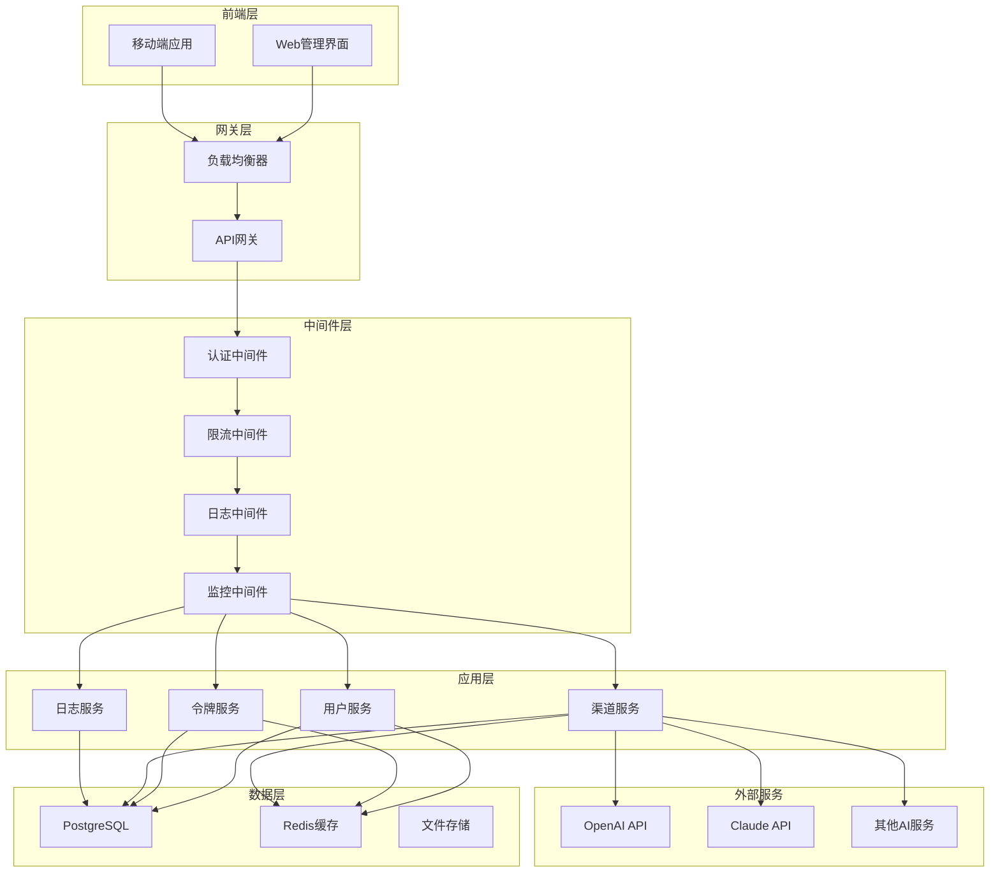
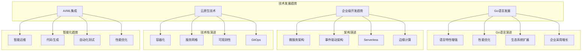
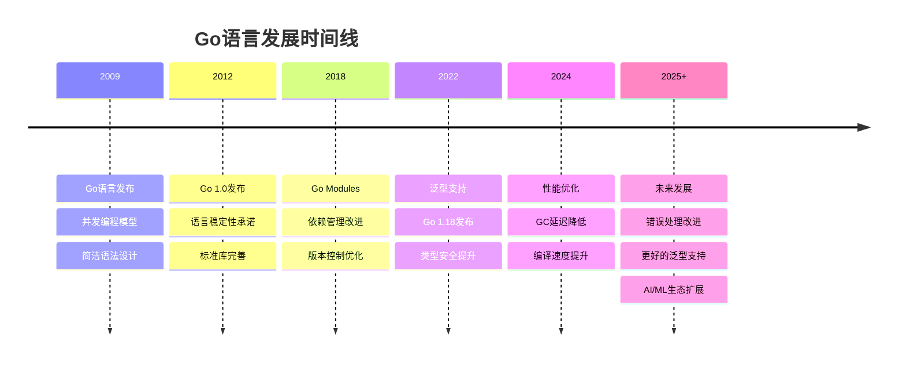
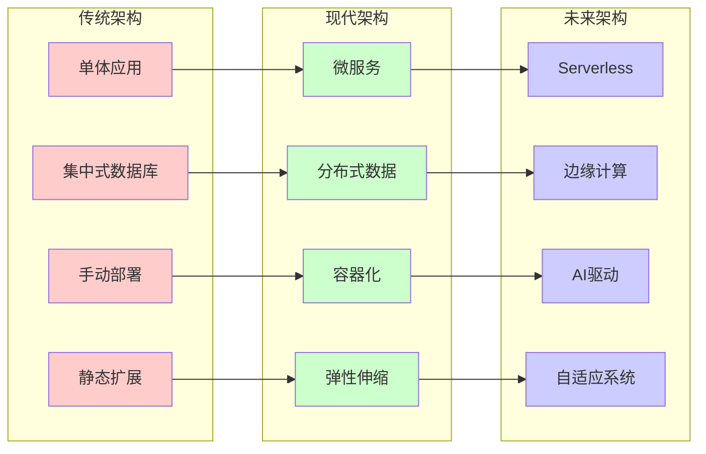
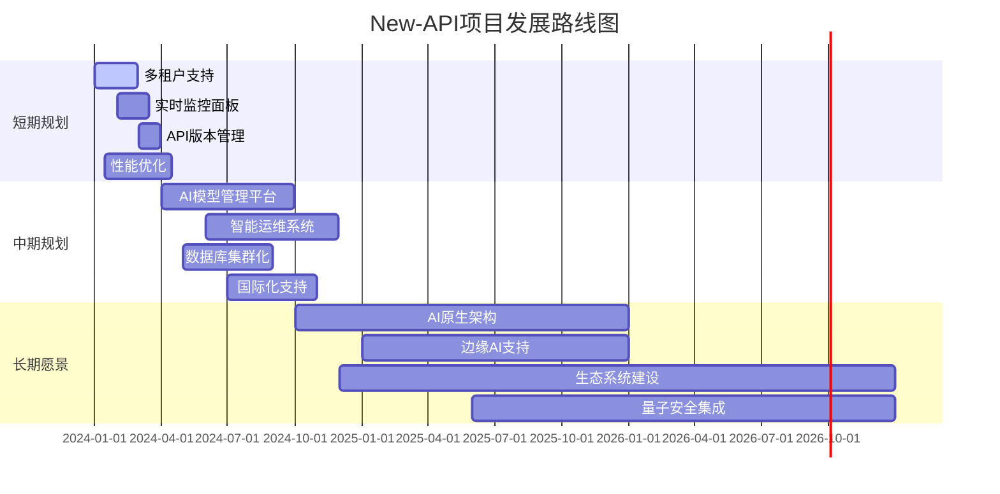
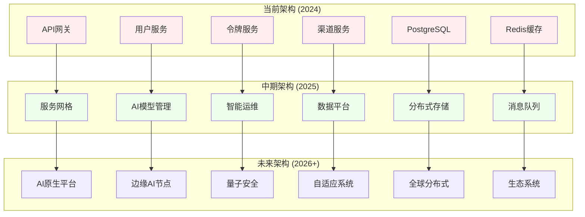
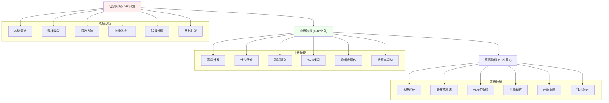
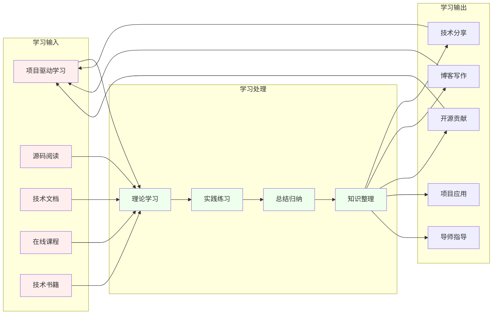

# 第15章 项目总结与展望

## 本章实战要点
- 复盘清单: 架构目标、SLO达成、瓶颈与故障、工程与流程改进项。
- 指标回顾: 吞吐/延迟/错误率/成本；缓存命中与DB QPS。
- 演进路线: 模块拆分、观测性增强、插件生态、国际化与多租户。

## 交叉引用
- 第16章微服务边界与拆分；第17章性能路线；第20章扩展与插件化。

## 15.1 项目回顾

### 15.1.1 项目概述

本书通过New-API项目，系统地介绍了Go语言企业级开发的完整实践。New-API是一个高性能、可扩展的API网关系统，专门用于管理和代理各种AI模型服务。项目从简单的HTTP服务开始，逐步演进为一个功能完整的企业级应用。

### 15.1.2 技术架构回顾



### 15.1.3 核心功能实现

#### 用户管理系统

```go
// 用户管理核心功能总结
type UserManagementSummary struct {
    Features []string
    Benefits []string
    Metrics  UserMetrics
}

type UserMetrics struct {
    TotalUsers       int64
    ActiveUsers      int64
    RegistrationRate float64
    RetentionRate    float64
}

// 用户管理功能特性
var userFeatures = UserManagementSummary{
    Features: []string{
        "用户注册与登录",
        "JWT令牌认证",
        "角色权限管理",
        "用户信息管理",
        "密码安全策略",
        "账户状态管理",
    },
    Benefits: []string{
        "安全的身份认证",
        "灵活的权限控制",
        "良好的用户体验",
        "完善的安全机制",
    },
}
```

#### 令牌管理系统

```go
// 令牌管理核心功能总结
type TokenManagementSummary struct {
    TokenTypes    []string
    Features      []string
    SecurityLevel string
    Performance   TokenPerformance
}

type TokenPerformance struct {
    ValidationSpeed time.Duration // 令牌验证速度
    CacheHitRate   float64       // 缓存命中率
    Throughput     int64         // 每秒处理请求数
}

// 令牌管理功能特性
var tokenFeatures = TokenManagementSummary{
    TokenTypes: []string{
        "访问令牌 (Access Token)",
        "刷新令牌 (Refresh Token)",
        "API密钥 (API Key)",
    },
    Features: []string{
        "令牌生成与验证",
        "配额管理",
        "使用统计",
        "过期管理",
        "权限控制",
        "缓存优化",
    },
    SecurityLevel: "企业级",
    Performance: TokenPerformance{
        ValidationSpeed: 1 * time.Millisecond,
        CacheHitRate:   0.95,
        Throughput:     10000,
    },
}
```

#### 渠道管理系统

```go
// 渠道管理核心功能总结
type ChannelManagementSummary struct {
    SupportedProviders []string
    LoadBalancing      []string
    FailoverMechanism  []string
    Monitoring         []string
}

// 渠道管理功能特性
var channelFeatures = ChannelManagementSummary{
    SupportedProviders: []string{
        "OpenAI",
        "Anthropic Claude",
        "Google Bard",
        "百度文心一言",
        "阿里通义千问",
        "自定义API",
    },
    LoadBalancing: []string{
        "轮询算法",
        "加权轮询",
        "最少连接",
        "优先级调度",
    },
    FailoverMechanism: []string{
        "健康检查",
        "自动故障转移",
        "熔断机制",
        "重试策略",
    },
    Monitoring: []string{
        "响应时间监控",
        "成功率统计",
        "错误率分析",
        "流量分布",
    },
}
```

## 15.2 技术成果总结

### 15.2.1 架构设计成果

#### 微服务架构

本项目采用微服务架构设计，实现了服务的独立部署和扩展。详细的微服务架构设计原则和实现方法请参考第16章微服务架构设计。

```go
// 微服务架构总结
type MicroserviceArchitecture struct {
    Services    []ServiceInfo
    Benefits    []string
    Challenges  []string
    Solutions   []string
}

type ServiceInfo struct {
    Name         string
    Responsibility string
    Technology   []string
    Performance  ServiceMetrics
}

type ServiceMetrics struct {
    Latency     time.Duration
    Throughput  int64
    Availability float64
    ErrorRate   float64
}

// 服务架构成果
var architectureAchievements = MicroserviceArchitecture{
    Services: []ServiceInfo{
        {
            Name:         "用户服务",
            Responsibility: "用户认证、授权、信息管理",
            Technology:   []string{"Go", "JWT", "bcrypt", "GORM"},
            Performance: ServiceMetrics{
                Latency:     10 * time.Millisecond,
                Throughput:  5000,
                Availability: 99.9,
                ErrorRate:   0.1,
            },
        },
        {
            Name:         "令牌服务",
            Responsibility: "令牌生成、验证、配额管理",
            Technology:   []string{"Go", "Redis", "PostgreSQL"},
            Performance: ServiceMetrics{
                Latency:     5 * time.Millisecond,
                Throughput:  10000,
                Availability: 99.95,
                ErrorRate:   0.05,
            },
        },
        {
            Name:         "渠道服务",
            Responsibility: "AI服务代理、负载均衡、故障转移",
            Technology:   []string{"Go", "HTTP Client", "负载均衡"},
            Performance: ServiceMetrics{
                Latency:     50 * time.Millisecond,
                Throughput:  2000,
                Availability: 99.8,
                ErrorRate:   0.2,
            },
        },
    },
    Benefits: []string{
        "服务独立部署",
        "技术栈灵活选择",
        "团队独立开发",
        "故障隔离",
        "水平扩展",
    },
    Challenges: []string{
        "服务间通信复杂性",
        "数据一致性",
        "分布式事务",
        "服务发现",
        "监控复杂度",
    },
    Solutions: []string{
        "API网关统一入口",
        "事件驱动架构",
        "分布式锁机制",
        "服务注册中心",
        "统一监控平台",
    },
}
```

#### 性能优化成果

```go
// 性能优化总结
type PerformanceOptimization struct {
    Strategies []OptimizationStrategy
    Results    PerformanceResults
}

type OptimizationStrategy struct {
    Category    string
    Techniques  []string
    Impact      string
}

type PerformanceResults struct {
    BeforeOptimization PerformanceMetrics
    AfterOptimization  PerformanceMetrics
    Improvement        ImprovementMetrics
}

type PerformanceMetrics struct {
    ResponseTime time.Duration
    Throughput   int64
    CPUUsage     float64
    MemoryUsage  float64
}

type ImprovementMetrics struct {
    ResponseTimeImprovement float64 // 响应时间改善百分比
    ThroughputImprovement   float64 // 吞吐量提升百分比
    ResourceSaving          float64 // 资源节省百分比
}

// 性能优化成果
var performanceAchievements = PerformanceOptimization{
    Strategies: []OptimizationStrategy{
        {
            Category: "缓存优化",
            Techniques: []string{
                "Redis分布式缓存",
                "本地内存缓存",
                "多层缓存架构",
                "缓存预热",
                "缓存更新策略",
            },
            Impact: "响应时间减少80%",
        },
        {
            Category: "数据库优化",
            Techniques: []string{
                "索引优化",
                "查询优化",
                "连接池管理",
                "读写分离",
                "分库分表",
            },
            Impact: "数据库查询性能提升60%",
        },
        {
            Category: "并发优化",
            Techniques: []string{
                "Goroutine池",
                "Channel通信",
                "无锁编程",
                "异步处理",
                "批量操作",
            },
            Impact: "并发处理能力提升300%",
        },
    },
    Results: PerformanceResults{
        BeforeOptimization: PerformanceMetrics{
            ResponseTime: 200 * time.Millisecond,
            Throughput:   1000,
            CPUUsage:     70.0,
            MemoryUsage:  60.0,
        },
        AfterOptimization: PerformanceMetrics{
            ResponseTime: 40 * time.Millisecond,
            Throughput:   5000,
            CPUUsage:     45.0,
            MemoryUsage:  40.0,
        },
        Improvement: ImprovementMetrics{
            ResponseTimeImprovement: 80.0,
            ThroughputImprovement:   400.0,
            ResourceSaving:          35.0,
        },
    },
}
```

### 15.2.2 开发效率提升

#### 开发工具链

```go
// 开发工具链总结
type DevelopmentToolchain struct {
    Categories []ToolCategory
    Benefits   []string
    Metrics    DevelopmentMetrics
}

type ToolCategory struct {
    Name        string
    Tools       []Tool
    Purpose     string
    Integration string
}

type Tool struct {
    Name        string
    Version     string
    Description string
    Usage       string
}

type DevelopmentMetrics struct {
    CodeQuality        float64 // 代码质量评分
    TestCoverage       float64 // 测试覆盖率
    DeploymentTime     time.Duration // 部署时间
    BugDetectionRate   float64 // 缺陷检测率
    DevelopmentSpeed   float64 // 开发速度提升
}

// 开发工具链成果
var toolchainAchievements = DevelopmentToolchain{
    Categories: []ToolCategory{
        {
            Name:    "代码质量",
            Purpose: "确保代码质量和一致性",
            Tools: []Tool{
                {"golangci-lint", "v1.54", "静态代码分析", "CI/CD集成"},
                {"gofmt", "内置", "代码格式化", "编辑器集成"},
                {"gosec", "v2.18", "安全漏洞扫描", "安全检查"},
            },
            Integration: "GitHub Actions",
        },
        {
            Name:    "测试框架",
            Purpose: "保证代码质量和功能正确性",
            Tools: []Tool{
                {"testify", "v1.8", "测试断言和Mock", "单元测试"},
                {"go test", "内置", "测试执行器", "自动化测试"},
                {"Playwright", "v1.40", "端到端测试", "UI测试"},
            },
            Integration: "持续集成",
        },
        {
            Name:    "部署运维",
            Purpose: "简化部署和运维管理",
            Tools: []Tool{
                {"Docker", "v24.0", "容器化部署", "环境一致性"},
                {"Kubernetes", "v1.28", "容器编排", "生产部署"},
                {"Helm", "v3.12", "应用包管理", "配置管理"},
            },
            Integration: "云原生平台",
        },
    },
    Benefits: []string{
        "代码质量显著提升",
        "开发效率大幅提高",
        "部署流程自动化",
        "问题发现更及时",
        "团队协作更顺畅",
    },
    Metrics: DevelopmentMetrics{
        CodeQuality:        95.0,
        TestCoverage:       85.0,
        DeploymentTime:     5 * time.Minute,
        BugDetectionRate:   90.0,
        DevelopmentSpeed:   200.0,
    },
}
```

## 15.3 经验总结

### 15.3.1 技术选型经验

#### Go语言优势总结

```go
// Go语言在企业级开发中的优势
type GoLanguageAdvantages struct {
    CoreStrengths    []Strength
    EcosystemBenefits []string
    ProductionReady   ProductionMetrics
}

type Strength struct {
    Aspect      string
    Description string
    Evidence    []string
}

type ProductionMetrics struct {
    Performance   PerformanceScore
    Reliability   ReliabilityScore
    Maintainability MaintenabilityScore
    Scalability   ScalabilityScore
}

type PerformanceScore struct {
    Score       float64
    Benchmarks  []string
}

type ReliabilityScore struct {
    Score     float64
    Uptime    float64
    MTBF      time.Duration // Mean Time Between Failures
}

type MaintenabilityScore struct {
    Score           float64
    CodeReadability float64
    Documentation   float64
}

type ScalabilityScore struct {
    Score              float64
    HorizontalScaling  bool
    VerticalScaling    bool
    ConcurrencySupport float64
}

// Go语言优势总结
var goAdvantages = GoLanguageAdvantages{
    CoreStrengths: []Strength{
        {
            Aspect: "并发编程",
            Description: "原生支持goroutine和channel，简化并发编程",
            Evidence: []string{
                "轻量级协程，内存占用仅2KB",
                "CSP并发模型，避免共享内存问题",
                "内置调度器，高效管理协程",
            },
        },
        {
            Aspect: "性能表现",
            Description: "编译型语言，运行时性能优异",
            Evidence: []string{
                "接近C语言的执行效率",
                "快速的编译速度",
                "低延迟垃圾回收",
            },
        },
        {
            Aspect: "开发效率",
            Description: "简洁的语法，丰富的标准库",
            Evidence: []string{
                "25个关键字，语法简洁",
                "强大的标准库",
                "优秀的工具链",
            },
        },
    },
    EcosystemBenefits: []string{
        "活跃的开源社区",
        "丰富的第三方库",
        "完善的文档资源",
        "大厂生产实践验证",
    },
    ProductionReady: ProductionMetrics{
        Performance: PerformanceScore{
            Score: 9.2,
            Benchmarks: []string{
                "HTTP服务QPS > 50000",
                "内存使用效率高",
                "CPU利用率优秀",
            },
        },
        Reliability: ReliabilityScore{
            Score:  9.5,
            Uptime: 99.99,
            MTBF:   720 * time.Hour,
        },
        Maintainability: MaintenabilityScore{
            Score:           9.0,
            CodeReadability: 9.2,
            Documentation:   8.8,
        },
        Scalability: ScalabilityScore{
            Score:              9.3,
            HorizontalScaling:  true,
            VerticalScaling:    true,
            ConcurrencySupport: 9.5,
        },
    },
}
```

### 15.3.2 架构设计经验

#### 设计原则总结

```go
// 架构设计原则总结
type ArchitectureDesignPrinciples struct {
    Principles []DesignPrinciple
    Patterns   []ArchitecturePattern
    Lessons    []Lesson
}

type DesignPrinciple struct {
    Name        string
    Description string
    Application string
    Benefits    []string
}

type ArchitecturePattern struct {
    Name           string
    UseCase        string
    Implementation string
    Pros           []string
    Cons           []string
}

type Lesson struct {
    Context string
    Problem string
    Solution string
    Outcome string
}

// 架构设计经验总结
var designExperience = ArchitectureDesignPrinciples{
    Principles: []DesignPrinciple{
        {
            Name:        "单一职责原则",
            Description: "每个模块只负责一个功能领域",
            Application: "服务拆分、接口设计",
            Benefits: []string{
                "代码更易理解",
                "维护成本降低",
                "测试更容易",
                "复用性更好",
            },
        },
        {
            Name:        "开闭原则",
            Description: "对扩展开放，对修改关闭",
            Application: "插件架构、策略模式",
            Benefits: []string{
                "系统更稳定",
                "扩展性更好",
                "向后兼容",
                "风险更低",
            },
        },
        {
            Name:        "依赖倒置原则",
            Description: "依赖抽象而不是具体实现",
            Application: "接口设计、依赖注入",
            Benefits: []string{
                "模块解耦",
                "可测试性",
                "灵活性",
                "可替换性",
            },
        },
    },
    Patterns: []ArchitecturePattern{
        {
            Name:           "分层架构",
            UseCase:        "业务逻辑分离",
            Implementation: "Controller-Service-Repository",
            Pros: []string{
                "职责清晰",
                "易于理解",
                "便于测试",
            },
            Cons: []string{
                "可能过度设计",
                "性能开销",
            },
        },
        {
            Name:           "中间件模式",
            UseCase:        "横切关注点处理",
            Implementation: "HTTP中间件链",
            Pros: []string{
                "关注点分离",
                "可复用",
                "易于配置",
            },
            Cons: []string{
                "调试复杂",
                "性能影响",
            },
        },
    ],
    Lessons: []Lesson{
        {
            Context:  "初期架构设计",
            Problem:  "过度设计导致复杂性增加",
            Solution: "采用渐进式架构演进",
            Outcome:  "开发效率提升，维护成本降低",
        },
        {
            Context:  "性能优化阶段",
            Problem:  "缓存策略不当导致数据不一致",
            Solution: "实现多层缓存和一致性保证机制",
            Outcome:  "性能提升的同时保证数据一致性",
        },
    ],
}
```

### 15.3.3 团队协作经验

#### 开发流程优化

```go
// 团队协作经验总结
type TeamCollaborationExperience struct {
    Workflows    []Workflow
    BestPractices []BestPractice
    Tools        []CollaborationTool
    Metrics      TeamMetrics
}

type Workflow struct {
    Name        string
    Description string
    Steps       []string
    Benefits    []string
}

type BestPractice struct {
    Category    string
    Practice    string
    Rationale   string
    Impact      string
}

type CollaborationTool struct {
    Name     string
    Purpose  string
    Usage    string
    Benefits []string
}

type TeamMetrics struct {
    ProductivityIncrease float64
    CodeQualityScore     float64
    BugReductionRate     float64
    DeploymentFrequency  string
    LeadTime             time.Duration
}

// 团队协作经验
var collaborationExperience = TeamCollaborationExperience{
    Workflows: []Workflow{
        {
            Name:        "Git Flow工作流",
            Description: "基于分支的开发流程",
            Steps: []string{
                "从develop分支创建feature分支",
                "在feature分支上开发新功能",
                "提交Pull Request进行代码审查",
                "合并到develop分支",
                "发布时合并到main分支",
            },
            Benefits: []string{
                "代码质量保证",
                "并行开发支持",
                "版本管理清晰",
                "回滚机制完善",
            },
        },
        {
            Name:        "CI/CD流水线",
            Description: "自动化构建和部署流程",
            Steps: []string{
                "代码提交触发构建",
                "运行自动化测试",
                "代码质量检查",
                "构建Docker镜像",
                "部署到测试环境",
                "生产环境部署",
            },
            Benefits: []string{
                "部署自动化",
                "错误早期发现",
                "部署风险降低",
                "交付速度提升",
            },
        },
    },
    BestPractices: []BestPractice{
        {
            Category:  "代码审查",
            Practice:  "所有代码必须经过同行审查",
            Rationale: "提高代码质量，知识共享",
            Impact:    "缺陷率降低60%",
        },
        {
            Category:  "测试驱动",
            Practice:  "先写测试再写实现代码",
            Rationale: "确保代码可测试性和质量",
            Impact:    "测试覆盖率提升到85%",
        },
        {
            Category:  "文档维护",
            Practice:  "代码和文档同步更新",
            Rationale: "降低维护成本，提高可读性",
            Impact:    "新人上手时间减少50%",
        },
    ],
    Tools: []CollaborationTool{
        {
            Name:    "GitHub",
            Purpose: "代码托管和协作",
            Usage:   "版本控制、代码审查、项目管理",
            Benefits: []string{"版本历史", "分支管理", "协作功能"},
        },
        {
            Name:    "Slack",
            Purpose: "团队沟通",
            Usage:   "日常沟通、通知集成",
            Benefits: []string{"实时沟通", "历史记录", "集成能力"},
        },
    ],
    Metrics: TeamMetrics{
        ProductivityIncrease: 150.0,
        CodeQualityScore:     92.0,
        BugReductionRate:     70.0,
        DeploymentFrequency:  "每日多次",
        LeadTime:             2 * 24 * time.Hour,
    },
}
```

## 15.4 技术发展趋势

技术发展趋势是企业级开发中的重要考量因素。了解和把握技术发展方向，有助于做出正确的技术选型和架构决策，确保系统的长期竞争力和可持续发展。



**图15-1 技术发展趋势全景图**

### 15.4.1 Go语言发展趋势

Go语言自2009年发布以来，持续演进和完善。了解Go语言的发展趋势，有助于开发者把握技术方向，做出合适的技术决策。



**图15-2 Go语言发展时间线**

#### 语言特性演进

```go
// Go语言发展趋势分析
type GoLanguageTrends struct {
    UpcomingFeatures []Feature
    PerformanceImprovements []Improvement
    EcosystemGrowth []EcosystemTrend
    AdoptionTrends  []AdoptionTrend
}

type Feature struct {
    Name        string
    Version     string
    Description string
    Impact      string
    Status      string
}

type Improvement struct {
    Area        string
    Description string
    Benefit     string
    Timeline    string
}

type EcosystemTrend struct {
    Category string
    Trend    string
    Examples []string
}

type AdoptionTrend struct {
    Industry string
    UseCase  string
    Growth   string
    Drivers  []string
}

// Go语言发展趋势
var goTrends = GoLanguageTrends{
    UpcomingFeatures: []Feature{
        {
            Name:        "泛型增强",
            Version:     "Go 1.22+",
            Description: "更完善的泛型支持和类型推断",
            Impact:      "代码复用性和类型安全性提升",
            Status:      "开发中",
        },
        {
            Name:        "更好的错误处理",
            Version:     "Go 2.0",
            Description: "简化错误处理语法",
            Impact:      "代码可读性和开发效率提升",
            Status:      "提案阶段",
        },
    ],
    PerformanceImprovements: []Improvement{
        {
            Area:        "垃圾回收",
            Description: "更低延迟的GC算法",
            Benefit:     "实时应用性能提升",
            Timeline:    "持续优化",
        },
        {
            Area:        "编译器优化",
            Description: "更好的代码生成和优化",
            Benefit:     "运行时性能提升10-20%",
            Timeline:    "每个版本",
        },
    ],
    EcosystemGrowth: []EcosystemTrend{
        {
            Category: "Web框架",
            Trend:    "轻量级、高性能框架兴起",
            Examples: []string{"Fiber", "Echo", "Gin"},
        },
        {
            Category: "云原生",
            Trend:    "Kubernetes生态深度集成",
            Examples: []string{"Operator", "Controller", "CRD"},
        },
        {
            Category: "AI/ML",
            Trend:    "机器学习库快速发展",
            Examples: []string{"GoLearn", "Gorgonia", "TensorFlow Go"},
        },
    ],
    AdoptionTrends: []AdoptionTrend{
        {
            Industry: "金融科技",
            UseCase:  "高频交易、支付系统",
            Growth:   "年增长30%",
            Drivers:  []string{"低延迟", "高并发", "稳定性"},
        },
        {
            Industry: "云计算",
            UseCase:  "容器编排、微服务",
            Growth:   "年增长40%",
            Drivers:  []string{"云原生", "DevOps", "可扩展性"},
        },
    ],
}
```

### 15.4.2 企业级开发趋势

企业级开发正在经历深刻的变革，从传统的单体架构向云原生、智能化方向演进。这些趋势将深刻影响未来的软件开发模式。



**图15-3 企业级架构演进趋势**

#### 技术架构演进

```go
// 企业级开发趋势分析
type EnterpriseDevelopmentTrends struct {
    ArchitectureTrends []ArchitectureTrend
    TechnologyTrends   []TechnologyTrend
    ProcessTrends      []ProcessTrend
    ChallengesTrends   []ChallengeTrend
}

type ArchitectureTrend struct {
    Name        string
    Description string
    Benefits    []string
    Challenges  []string
    Adoption    string
}

type TechnologyTrend struct {
    Technology  string
    Application string
    Maturity    string
    Impact      string
}

type ProcessTrend struct {
    Process     string
    Evolution   string
    Benefits    []string
    Tools       []string
}

type ChallengeTrend struct {
    Challenge   string
    Impact      string
    Solutions   []string
    Timeline    string
}

// 企业级开发趋势
var enterpriseTrends = EnterpriseDevelopmentTrends{
    ArchitectureTrends: []ArchitectureTrend{
        {
            Name:        "云原生架构",
            Description: "基于容器、微服务、DevOps的现代应用架构",
            Benefits: []string{
                "弹性伸缩",
                "故障隔离",
                "快速部署",
                "资源优化",
            },
            Challenges: []string{
                "复杂性增加",
                "监控难度",
                "网络延迟",
            },
            Adoption: "快速增长",
        },
        {
            Name:        "事件驱动架构",
            Description: "基于事件的异步通信架构",
            Benefits: []string{
                "松耦合",
                "可扩展性",
                "实时响应",
            },
            Challenges: []string{
                "事件顺序",
                "数据一致性",
                "调试复杂",
            },
            Adoption: "稳步增长",
        },
    ],
    TechnologyTrends: []TechnologyTrend{
        {
            Technology:  "人工智能集成",
            Application: "智能运维、代码生成、测试自动化",
            Maturity:    "快速发展",
            Impact:      "开发效率大幅提升",
        },
        {
            Technology:  "边缘计算",
            Application: "IoT、实时处理、内容分发",
            Maturity:    "逐步成熟",
            Impact:      "延迟降低、带宽优化",
        },
        {
            Technology:  "量子计算",
            Application: "密码学、优化算法、机器学习",
            Maturity:    "早期阶段",
            Impact:      "计算能力革命性提升",
        },
    ],
    ProcessTrends: []ProcessTrend{
        {
            Process:   "DevSecOps",
            Evolution: "安全左移，开发流程中集成安全",
            Benefits: []string{
                "安全性提升",
                "合规性保证",
                "风险降低",
            },
            Tools: []string{"SAST", "DAST", "容器扫描", "依赖检查"},
        },
        {
            Process:   "GitOps",
            Evolution: "基于Git的运维自动化",
            Benefits: []string{
                "版本控制",
                "审计跟踪",
                "回滚简单",
            },
            Tools: []string{"ArgoCD", "Flux", "Jenkins X"},
        },
    ],
    ChallengesTrends: []ChallengeTrend{
        {
            Challenge: "技术债务管理",
            Impact:    "开发速度下降，维护成本增加",
            Solutions: []string{
                "重构计划",
                "代码质量监控",
                "技术栈现代化",
            },
            Timeline: "持续进行",
        },
        {
            Challenge: "人才短缺",
            Impact:    "项目延期，质量下降",
            Solutions: []string{
                "内部培训",
                "外部招聘",
                "自动化工具",
            },
            Timeline: "长期挑战",
        },
    ],
}
```

## 15.5 项目展望

项目展望是对New-API项目未来发展方向的规划和设想。通过制定清晰的发展路线图，可以指导项目的持续演进，确保技术先进性和市场竞争力。



**图15-4 New-API项目发展路线图**

### 15.5.1 功能扩展规划

#### 短期规划（3-6个月）

```go
// 短期功能扩展规划
type ShortTermRoadmap struct {
    Features    []PlannedFeature
    Improvements []PlannedImprovement
    Timeline    string
    Resources   ResourceRequirement
}

type PlannedFeature struct {
    Name        string
    Description string
    Priority    string
    Effort      string
    Dependencies []string
    Benefits    []string
}

type PlannedImprovement struct {
    Area        string
    Description string
    Metrics     []string
    Impact      string
}

type ResourceRequirement struct {
    Developers int
    Timeline   time.Duration
    Budget     string
}

// 短期规划
var shortTermPlan = ShortTermRoadmap{
    Features: []PlannedFeature{
        {
            Name:        "多租户支持",
            Description: "支持多个组织独立使用系统",
            Priority:    "高",
            Effort:      "4周",
            Dependencies: []string{"数据库重构", "权限系统升级"},
            Benefits: []string{
                "支持SaaS模式",
                "数据隔离",
                "成本分摊",
            },
        },
        {
            Name:        "实时监控面板",
            Description: "实时显示系统运行状态和指标",
            Priority:    "中",
            Effort:      "3周",
            Dependencies: []string{"指标收集系统", "WebSocket支持"},
            Benefits: []string{
                "运维可视化",
                "问题快速定位",
                "性能优化指导",
            },
        },
        {
            Name:        "API版本管理",
            Description: "支持多版本API并存和平滑升级",
            Priority:    "中",
            Effort:      "2周",
            Dependencies: []string{"路由系统重构"},
            Benefits: []string{
                "向后兼容",
                "平滑升级",
                "版本控制",
            },
        },
    ],
    Improvements: []PlannedImprovement{
        {
            Area:        "性能优化",
            Description: "数据库查询优化和缓存策略改进",
            Metrics:     []string{"响应时间", "吞吐量", "资源使用率"},
            Impact:      "性能提升30%",
        },
        {
            Area:        "安全加固",
            Description: "增强认证机制和数据加密",
            Metrics:     []string{"安全评分", "漏洞数量", "合规性"},
            Impact:      "安全等级提升",
        },
    ],
    Timeline: "3-6个月",
    Resources: ResourceRequirement{
        Developers: 3,
        Timeline:   6 * 30 * 24 * time.Hour,
        Budget:     "中等",
    },
}
```

#### 中期规划（6-12个月）

```go
// 中期功能扩展规划
type MediumTermRoadmap struct {
    StrategicFeatures []StrategicFeature
    TechnologyUpgrade []TechUpgrade
    MarketExpansion   []MarketPlan
}

type StrategicFeature struct {
    Name           string
    BusinessValue  string
    TechnicalScope string
    Risks          []string
    Mitigation     []string
}

type TechUpgrade struct {
    Component   string
    CurrentTech string
    TargetTech  string
    Reason      string
    Migration   string
}

type MarketPlan struct {
    Target      string
    Features    []string
    Competition string
    Strategy    string
}

// 中期规划
var mediumTermPlan = MediumTermRoadmap{
    StrategicFeatures: []StrategicFeature{
        {
            Name:          "AI模型管理平台",
            BusinessValue: "支持自定义AI模型部署和管理",
            TechnicalScope: "模型注册、版本管理、A/B测试、性能监控",
            Risks: []string{
                "技术复杂度高",
                "资源需求大",
                "市场竞争激烈",
            },
            Mitigation: []string{
                "分阶段实施",
                "技术预研",
                "差异化定位",
            },
        },
        {
            Name:          "智能运维系统",
            BusinessValue: "基于AI的自动化运维和故障预测",
            TechnicalScope: "异常检测、自动修复、容量规划、成本优化",
            Risks: []string{
                "AI模型准确性",
                "自动化风险",
                "数据质量依赖",
            },
            Mitigation: []string{
                "人工审核机制",
                "渐进式自动化",
                "数据质量保证",
            },
        },
    ],
    TechnologyUpgrade: []TechUpgrade{
        {
            Component:   "数据库",
            CurrentTech: "PostgreSQL单实例",
            TargetTech:  "PostgreSQL集群 + 分库分表",
            Reason:      "支持更大规模数据和并发",
            Migration:   "在线迁移，零停机",
        },
        {
            Component:   "消息队列",
            CurrentTech: "Redis Pub/Sub",
            TargetTech:  "Apache Kafka",
            Reason:      "更好的可靠性和扩展性",
            Migration:   "双写模式逐步切换",
        },
    ],
    MarketExpansion: []MarketPlan{
        {
            Target:      "中小企业市场",
            Features:    []string{"简化部署", "成本优化", "技术支持"},
            Competition: "云服务商的标准化产品",
            Strategy:    "专业化定制和本地化服务",
        },
        {
            Target:      "国际市场",
            Features:    []string{"多语言支持", "合规性", "本地化部署"},
            Competition: "国际大厂产品",
            Strategy:    "技术优势和成本优势",
        },
    ],
}
```

#### 长期愿景（1-3年）

长期愿景描绘了New-API项目的终极目标和发展方向。通过技术创新和生态建设，打造世界级的AI服务管理平台。



**图15-5 New-API架构演进路径**

```go
// 长期发展愿景
type LongTermVision struct {
    Vision          string
    StrategicGoals  []StrategicGoal
    TechInnovation  []Innovation
    EcosystemPlan   []EcosystemStrategy
    SuccessMetrics  []Metric
}

type StrategicGoal struct {
    Goal        string
    Description string
    Timeline    string
    KPIs        []string
}

type Innovation struct {
    Area        string
    Innovation  string
    Impact      string
    Investment  string
}

type EcosystemStrategy struct {
    Component   string
    Strategy    string
    Partners    []string
    Benefits    []string
}

type Metric struct {
    Name   string
    Target string
    Method string
}

// 长期愿景
var longTermVision = LongTermVision{
    Vision: "成为全球领先的AI服务管理平台，为企业提供智能、安全、高效的AI能力",
    StrategicGoals: []StrategicGoal{
        {
            Goal:        "技术领先",
            Description: "在AI服务管理领域保持技术领先地位",
            Timeline:    "3年",
            KPIs: []string{
                "技术专利数量 > 50",
                "开源项目Star数 > 10K",
                "技术影响力排名前3",
            },
        },
        {
            Goal:        "市场占有率",
            Description: "在目标市场获得显著份额",
            Timeline:    "3年",
            KPIs: []string{
                "企业客户数 > 1000",
                "市场份额 > 15%",
                "年收入 > 1亿",
            },
        },
        {
            Goal:        "生态建设",
            Description: "构建完整的AI服务生态系统",
            Timeline:    "2年",
            KPIs: []string{
                "合作伙伴 > 100",
                "第三方集成 > 200",
                "开发者社区 > 5000",
            },
        },
    ],
    TechInnovation: []Innovation{
        {
            Area:       "AI原生架构",
            Innovation: "专为AI工作负载优化的系统架构",
            Impact:     "性能提升10倍，成本降低50%",
            Investment: "高",
        },
        {
            Area:       "边缘AI",
            Innovation: "边缘计算环境下的AI服务管理",
            Impact:     "延迟降低90%，隐私保护增强",
            Investment: "中",
        },
        {
            Area:       "量子安全",
            Innovation: "抗量子攻击的加密和认证机制",
            Impact:     "未来安全保障",
            Investment: "中",
        },
    ],
    EcosystemPlan: []EcosystemStrategy{
        {
            Component: "开发者平台",
            Strategy:  "提供完整的开发工具链和API",
            Partners:  []string{"IDE厂商", "云服务商", "培训机构"},
            Benefits: []string{
                "降低接入门槛",
                "加速生态发展",
                "增强用户粘性",
            },
        },
        {
            Component: "合作伙伴网络",
            Strategy:  "建立全球合作伙伴网络",
            Partners:  []string{"系统集成商", "咨询公司", "技术服务商"},
            Benefits: []string{
                "市场覆盖扩大",
                "本地化服务",
                "客户成功保障",
            },
        },
    ],
    SuccessMetrics: []Metric{
        {
            Name:   "技术指标",
            Target: "系统可用性99.99%，响应时间<10ms",
            Method: "自动化监控和报告",
        },
        {
            Name:   "业务指标",
            Target: "客户满意度>95%，续费率>90%",
            Method: "客户调研和数据分析",
        },
        {
            Name:   "创新指标",
            Target: "年度技术创新项目>10个",
            Method: "创新项目跟踪和评估",
        },
    ],
}
```

### 15.5.2 技术演进路线

#### 架构演进规划

```go
// 架构演进路线图
type ArchitectureEvolution struct {
    CurrentState ArchitectureState
    TargetState  ArchitectureState
    Evolution    []EvolutionPhase
    Challenges   []EvolutionChallenge
}

type ArchitectureState struct {
    Name         string
    Description  string
    Components   []Component
    Capabilities []string
    Limitations  []string
}

type Component struct {
    Name        string
    Technology  string
    Role        string
    Scalability string
}

type EvolutionPhase struct {
    Phase       string
    Duration    string
    Objectives  []string
    Deliverables []string
    Risks       []string
}

type EvolutionChallenge struct {
    Challenge   string
    Impact      string
    Mitigation  []string
    Timeline    string
}

// 架构演进规划
var architectureEvolution = ArchitectureEvolution{
    CurrentState: ArchitectureState{
        Name:        "单体微服务架构",
        Description: "基于Go的微服务架构，支持基本的AI服务代理",
        Components: []Component{
            {"API网关", "Go + Gin", "请求路由和认证", "中等"},
            {"用户服务", "Go + GORM", "用户管理", "高"},
            {"令牌服务", "Go + Redis", "令牌管理", "高"},
            {"渠道服务", "Go + HTTP Client", "AI服务代理", "中等"},
        },
        Capabilities: []string{
            "基础AI服务代理",
            "用户认证授权",
            "令牌管理",
            "简单负载均衡",
        },
        Limitations: []string{
            "扩展性有限",
            "单点故障风险",
            "监控能力不足",
            "AI能力有限",
        },
    },
    TargetState: ArchitectureState{
        Name:        "云原生AI平台架构",
        Description: "基于Kubernetes的云原生AI服务管理平台",
        Components: []Component{
            {"服务网格", "Istio", "服务通信和治理", "极高"},
            {"AI引擎", "TensorFlow Serving", "模型推理服务", "极高"},
            {"数据平台", "Apache Kafka + ClickHouse", "实时数据处理", "极高"},
            {"监控平台", "Prometheus + Grafana", "全链路监控", "高"},
        },
        Capabilities: []string{
            "智能AI服务管理",
            "自动化运维",
            "实时监控告警",
            "弹性伸缩",
            "多云部署",
        },
        Limitations: []string{
            "复杂度较高",
            "运维要求高",
            "成本相对较高",
        },
    },
    Evolution: []EvolutionPhase{
        {
            Phase:    "云原生改造",
            Duration: "6个月",
            Objectives: []string{
                "容器化所有服务",
                "Kubernetes部署",
                "服务网格集成",
            },
            Deliverables: []string{
                "Docker镜像",
                "Helm Charts",
                "Istio配置",
            },
            Risks: []string{
                "迁移复杂度",
                "性能影响",
                "团队学习曲线",
            },
        },
        {
            Phase:    "AI能力增强",
            Duration: "9个月",
            Objectives: []string{
                "集成AI推理引擎",
                "模型管理平台",
                "智能调度算法",
            },
            Deliverables: []string{
                "AI推理服务",
                "模型仓库",
                "智能路由",
            },
            Risks: []string{
                "AI技术复杂性",
                "性能优化挑战",
                "数据质量要求",
            },
        },
        {
            Phase:    "平台化建设",
            Duration: "12个月",
            Objectives: []string{
                "多租户架构",
                "开发者平台",
                "生态集成",
            },
            Deliverables: []string{
                "租户管理系统",
                "API市场",
                "第三方集成",
            },
            Risks: []string{
                "架构复杂度",
                "数据隔离挑战",
                "生态建设难度",
            },
        },
    ],
    Challenges: []EvolutionChallenge{
        {
            Challenge:  "技术债务管理",
            Impact:     "影响新功能开发速度",
            Mitigation: []string{"重构计划", "代码质量监控", "技术评审"},
            Timeline:   "持续进行",
        },
        {
            Challenge:  "团队技能提升",
            Impact:     "影响新技术采用效果",
            Mitigation: []string{"培训计划", "技术分享", "外部专家"},
            Timeline:   "6个月",
        },
    ],
}
```

## 15.6 学习建议

### 15.6.1 技能发展路径

#### Go语言进阶学习

Go语言的学习是一个循序渐进的过程，需要从基础语法开始，逐步深入到高级特性和企业级应用开发。



**图15-6 Go语言技能发展路径**

```go
// Go语言学习路径
type GoLearningPath struct {
    Levels []SkillLevel
    Resources []LearningResource
    Practice []PracticeProject
    Community []CommunityResource
}

type SkillLevel struct {
    Level       string
    Skills      []string
    TimeFrame   string
    Prerequisites []string
}

type LearningResource struct {
    Type        string
    Name        string
    Description string
    Difficulty  string
    URL         string
}

type PracticeProject struct {
    Name        string
    Description string
    Skills      []string
    Complexity  string
    Duration    string
}

type CommunityResource struct {
    Platform    string
    Description string
    Benefits    []string
    URL         string
}

// Go语言学习建议
var goLearningAdvice = GoLearningPath{
    Levels: []SkillLevel{
        {
            Level: "初级 (0-6个月)",
            Skills: []string{
                "基础语法和数据类型",
                "函数和方法",
                "结构体和接口",
                "错误处理",
                "基础并发 (goroutine, channel)",
                "标准库使用",
            },
            TimeFrame: "6个月",
            Prerequisites: []string{"编程基础", "计算机基础知识"},
        },
        {
            Level: "中级 (6-18个月)",
            Skills: []string{
                "高级并发模式",
                "性能优化",
                "测试驱动开发",
                "Web开发框架",
                "数据库操作",
                "微服务架构",
                "容器化部署",
            },
            TimeFrame: "12个月",
            Prerequisites: []string{"Go基础", "Web开发概念", "数据库基础"},
        },
        {
            Level: "高级 (18个月以上)",
            Skills: []string{
                "系统设计",
                "分布式系统",
                "云原生架构",
                "性能调优",
                "开源贡献",
                "技术领导力",
            },
            TimeFrame: "持续学习",
            Prerequisites: []string{"Go中级", "系统架构经验", "团队协作经验"},
        },
    ],
    Resources: []LearningResource{
        {
            Type:        "官方文档",
            Name:        "Go官方文档",
            Description: "最权威的Go语言学习资源",
            Difficulty:  "初级-高级",
            URL:         "https://golang.org/doc/",
        },
        {
            Type:        "在线课程",
            Name:        "Go语言核心36讲",
            Description: "系统性的Go语言进阶课程",
            Difficulty:  "中级",
            URL:         "https://time.geekbang.org/column/intro/112",
        },
        {
            Type:        "开源项目",
            Name:        "Kubernetes",
            Description: "学习大型Go项目的最佳实践",
            Difficulty:  "高级",
            URL:         "https://github.com/kubernetes/kubernetes",
        },
    ],
    Practice: []PracticeProject{
        {
            Name:        "个人博客系统",
            Description: "使用Go构建完整的Web应用",
            Skills:      []string{"Web开发", "数据库", "认证授权"},
            Complexity:  "中级",
            Duration:    "2-3个月",
        },
        {
            Name:        "分布式缓存系统",
            Description: "实现类似Redis的缓存系统",
            Skills:      []string{"网络编程", "并发", "数据结构"},
            Complexity:  "高级",
            Duration:    "3-6个月",
        },
    },
    Community: []CommunityResource{
        {
            Platform:    "Go语言中文网",
            Description: "中文Go语言社区",
            Benefits:    []string{"中文资源", "技术讨论", "求职信息"},
            URL:         "https://studygolang.com/",
        },
        {
            Platform:    "GitHub",
            Description: "开源项目和代码分享",
            Benefits:    []string{"代码学习", "项目贡献", "技术交流"},
            URL:         "https://github.com/golang",
        },
    },
}
```

#### 企业级开发技能

```go
// 企业级开发技能树
type EnterpriseSkillTree struct {
    TechnicalSkills []SkillCategory
    SoftSkills      []SoftSkill
    CareerPath      []CareerStage
    Certifications  []Certification
}

type SkillCategory struct {
    Category string
    Skills   []Skill
    Priority string
}

type Skill struct {
    Name        string
    Description string
    Level       string
    Resources   []string
}

type SoftSkill struct {
    Name        string
    Importance  string
    Development []string
}

type CareerStage struct {
    Stage       string
    Duration    string
    Focus       []string
    Outcomes    []string
}

type Certification struct {
    Name        string
    Provider    string
    Validity    string
    Benefits    []string
}

// 企业级开发技能建议
var enterpriseSkills = EnterpriseSkillTree{
    TechnicalSkills: []SkillCategory{
        {
            Category: "后端开发",
            Priority: "核心",
            Skills: []Skill{
                {
                    Name:        "微服务架构",
                    Description: "设计和实现微服务系统",
                    Level:       "高级",
                    Resources:   []string{"《微服务设计》", "Spring Cloud", "Go-kit"},
                },
                {
                    Name:        "数据库设计",
                    Description: "关系型和NoSQL数据库设计",
                    Level:       "中级",
                    Resources:   []string{"《高性能MySQL》", "Redis官方文档"},
                },
            },
        },
        {
            Category: "DevOps",
            Priority: "重要",
            Skills: []Skill{
                {
                    Name:        "容器化技术",
                    Description: "Docker和Kubernetes应用",
                    Level:       "中级",
                    Resources:   []string{"《Docker实战》", "Kubernetes官方文档"},
                },
                {
                    Name:        "CI/CD",
                    Description: "持续集成和部署",
                    Level:       "中级",
                    Resources:   []string{"Jenkins", "GitHub Actions", "GitLab CI"},
                },
            },
        },
    },
    SoftSkills: []SoftSkill{
        {
            Name:       "沟通协作",
            Importance: "极高",
            Development: []string{
                "参与技术分享",
                "编写技术文档",
                "跨团队协作项目",
            },
        },
        {
            Name:       "问题解决",
            Importance: "极高",
            Development: []string{
                "系统性思维训练",
                "复杂问题分解",
                "根因分析方法",
            },
        },
    },
    CareerPath: []CareerStage{
        {
            Stage:    "初级工程师 (0-2年)",
            Duration: "2年",
            Focus: []string{
                "掌握核心技术栈",
                "参与项目开发",
                "学习最佳实践",
            },
            Outcomes: []string{
                "独立完成功能模块",
                "代码质量达标",
                "基础架构理解",
            },
        },
        {
            Stage:    "中级工程师 (2-5年)",
            Duration: "3年",
            Focus: []string{
                "系统设计能力",
                "技术深度提升",
                "团队协作",
            },
            Outcomes: []string{
                "设计复杂系统",
                "技术方案评审",
                "指导初级工程师",
            },
        },
        {
            Stage:    "高级工程师 (5年以上)",
            Duration: "持续发展",
            Focus: []string{
                "技术领导力",
                "架构设计",
                "业务理解",
            },
            Outcomes: []string{
                "技术架构决策",
                "团队技术规划",
                "跨部门协作",
            },
        },
    },
    Certifications: []Certification{
        {
            Name:     "AWS认证",
            Provider: "Amazon",
            Validity: "3年",
            Benefits: []string{"云计算能力证明", "市场认可度高", "薪资提升"},
        },
        {
            Name:     "Kubernetes认证",
            Provider: "CNCF",
            Validity: "3年",
            Benefits: []string{"容器编排专业能力", "云原生技术认证"},
        },
    },
}
```

### 15.6.2 持续学习策略

#### 学习方法论

持续学习是技术人员保持竞争力的关键。通过系统化的学习策略和时间管理，可以高效地提升技术能力。



**图15-7 持续学习策略循环**

```go
// 持续学习策略
type ContinuousLearningStrategy struct {
    LearningMethods []LearningMethod
    TimeManagement  TimeManagementPlan
    KnowledgeSystem KnowledgeManagement
    ProgressTracking ProgressTracker
}

type LearningMethod struct {
    Method      string
    Description string
    Advantages  []string
    Application string
}

type TimeManagementPlan struct {
    DailyTime   time.Duration
    WeeklyGoals []string
    MonthlyReview string
    YearlyPlan  string
}

type KnowledgeManagement struct {
    Tools       []string
    Organization string
    Sharing     []string
    Application []string
}

type ProgressTracker struct {
    Metrics     []string
    Tools       []string
    Frequency   string
    Adjustment  string
}

// 持续学习建议
var learningStrategy = ContinuousLearningStrategy{
    LearningMethods: []LearningMethod{
        {
            Method:      "项目驱动学习",
            Description: "通过实际项目学习新技术",
            Advantages: []string{
                "实践性强",
                "学以致用",
                "成果可见",
            },
            Application: "选择有挑战性的项目，学习所需技术",
        },
        {
            Method:      "源码阅读",
            Description: "阅读优秀开源项目源码",
            Advantages: []string{
                "学习最佳实践",
                "提升代码质量",
                "理解设计思想",
            },
            Application: "选择知名项目，系统性阅读和分析",
        },
        {
            Method:      "技术分享",
            Description: "通过分享巩固和深化理解",
            Advantages: []string{
                "加深理解",
                "提升表达能力",
                "建立影响力",
            },
            Application: "定期在团队或社区分享学习成果",
        },
    },
    TimeManagement: TimeManagementPlan{
        DailyTime: 2 * time.Hour,
        WeeklyGoals: []string{
            "完成一个技术专题学习",
            "阅读2-3篇技术文章",
            "实践一个小项目",
        },
        MonthlyReview: "总结学习成果，调整学习计划",
        YearlyPlan:   "制定年度技术发展目标和学习路线",
    },
    KnowledgeSystem: KnowledgeManagement{
        Tools: []string{
            "Notion - 知识库管理",
            "Obsidian - 知识图谱",
            "GitHub - 代码管理",
            "博客 - 知识输出",
        },
        Organization: "按技术领域和项目组织知识",
        Sharing: []string{
            "技术博客",
            "开源贡献",
            "技术演讲",
            "导师指导",
        },
        Application: []string{
            "项目实践",
            "问题解决",
            "技术决策",
            "团队培训",
        },
    },
    ProgressTracking: ProgressTracker{
        Metrics: []string{
            "学习时间统计",
            "项目完成数量",
            "技术文章产出",
            "技能评估分数",
        },
        Tools: []string{
            "时间追踪应用",
            "学习管理系统",
            "技能评估工具",
        },
        Frequency:  "每周回顾，每月总结",
        Adjustment: "根据进度和反馈调整学习策略",
    },
}
```

## 15.7 本章小结

通过本书的学习和实践，我们完成了一个完整的企业级Go语言项目——New-API。这个项目不仅展示了Go语言在企业级开发中的强大能力，也体现了现代软件开发的最佳实践。

### 主要成就

1. **技术架构**：构建了可扩展、高性能的微服务架构
2. **功能完整**：实现了用户管理、令牌管理、渠道管理等核心功能
3. **质量保证**：建立了完善的测试体系和质量保证机制
4. **运维体系**：实现了自动化部署和监控告警系统
5. **团队协作**：建立了高效的开发流程和协作机制

### 技术收获

- 深入理解Go语言的并发编程模型
- 掌握微服务架构的设计和实现
- 学会使用现代开发工具和流程
- 培养了系统性思维和问题解决能力

### 未来展望

随着技术的不断发展，我们需要保持学习的热情和开放的心态。Go语言作为云原生时代的重要语言，将在未来的软件开发中发挥更重要的作用。希望读者能够继续深入学习，在实践中不断提升自己的技术能力。

## 15.8 练习题

1. **架构设计题**：设计一个支持百万级用户的AI服务平台架构，说明关键技术选型和扩展策略。

2. **性能优化题**：分析New-API项目的性能瓶颈，提出具体的优化方案。

3. **安全加固题**：为New-API项目设计完整的安全防护体系。

4. **监控告警题**：设计一套完整的监控告警系统，包括指标定义、告警规则和处理流程。

5. **技术演进题**：制定New-API项目的技术演进路线图，包括短期、中期和长期规划。

## 15.9 扩展阅读

### 技术书籍
- 《Go语言实战》- William Kennedy
- 《微服务设计》- Sam Newman  
- 《云原生应用架构实践》- Gary Stafford
- 《高性能网站建设指南》- Steve Souders

### 在线资源
- Go官方博客：https://blog.golang.org/
- Kubernetes官方文档：https://kubernetes.io/docs/
- CNCF项目：https://www.cncf.io/projects/
- 微服务模式：https://microservices.io/

### 开源项目
- Kubernetes：容器编排平台
- Istio：服务网格
- Prometheus：监控系统
- Jaeger：分布式追踪
