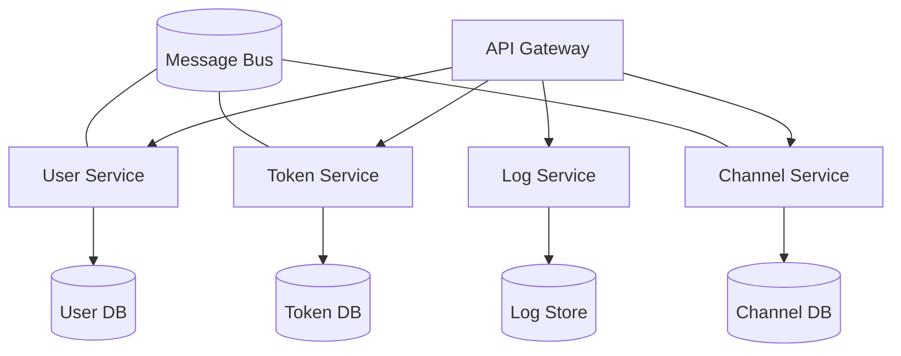
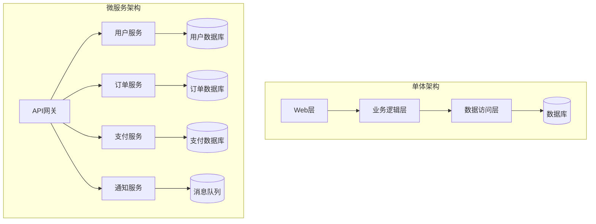
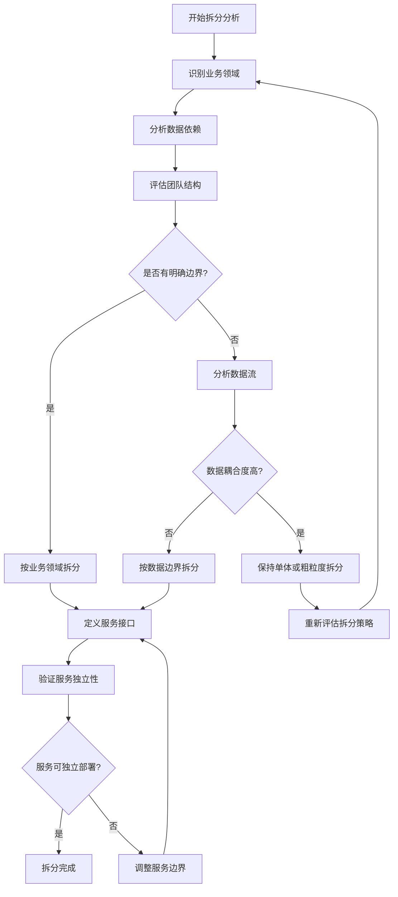
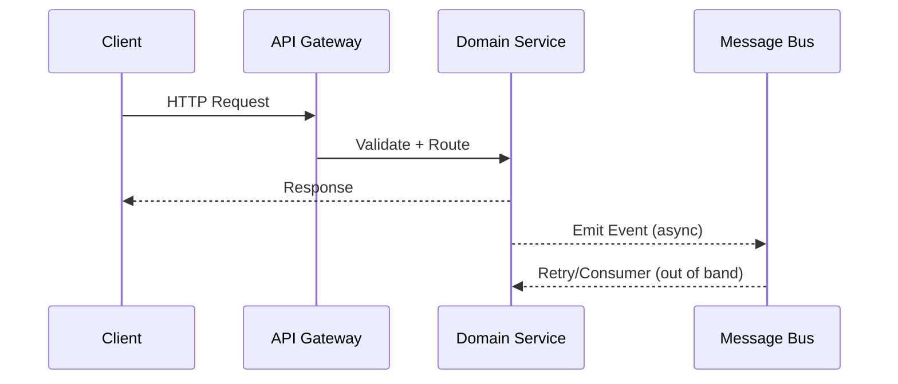
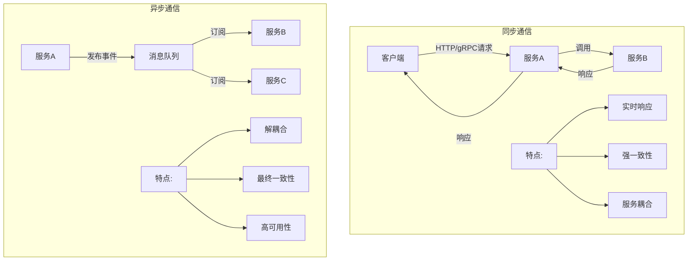
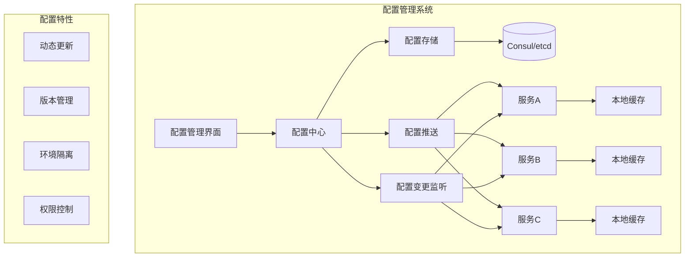
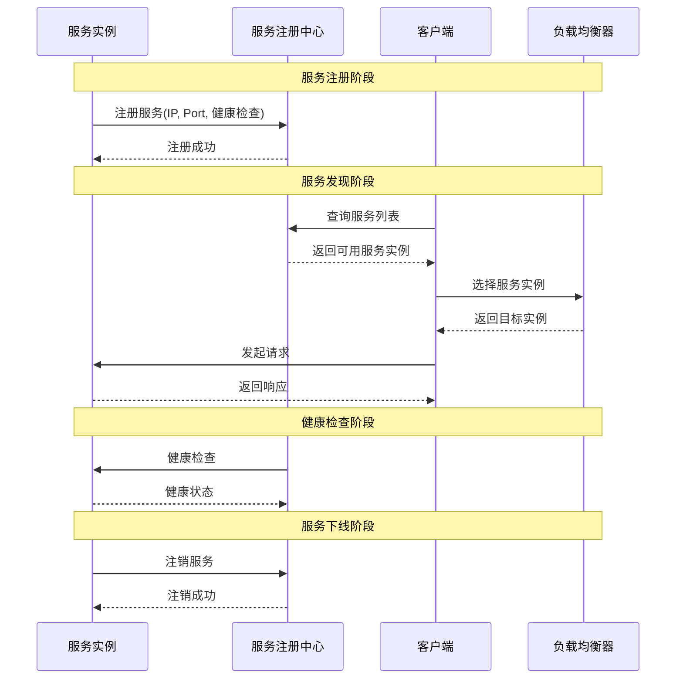
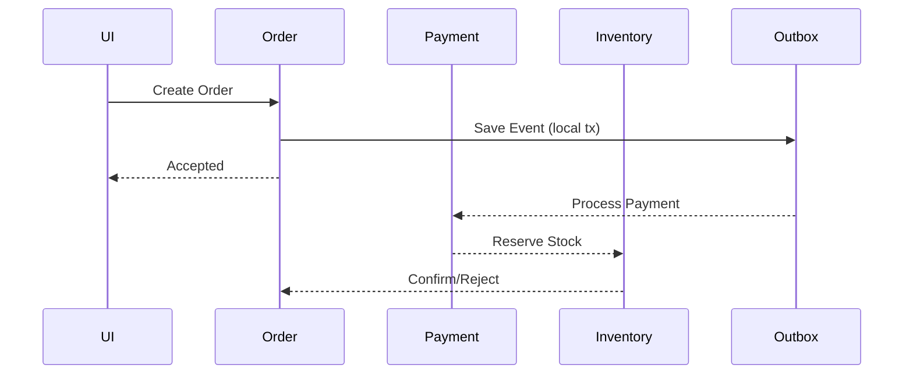
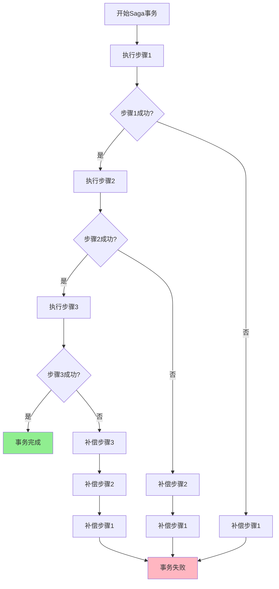
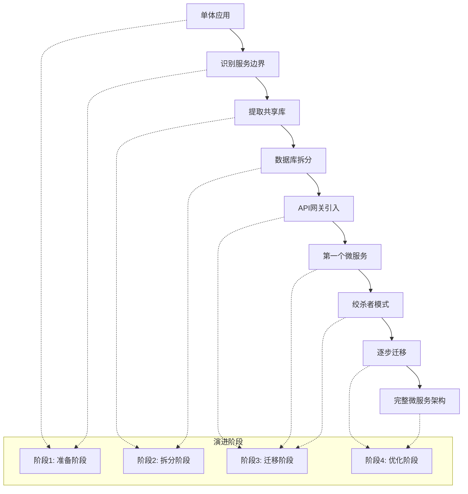

# 第16章 微服务架构设计

## 本章实战要点
- 边界优先: 以业务能力与数据主权划分服务，避免共享数据库。
- 通信策略: 请求-响应 + 事件驱动并存；幂等与重试退避。
- 配置与发现: 配置中心、服务发现、金丝雀发布与熔断限流。
- 数据一致性: Saga/Outbox；读模型去一致化，写模型保事务。

## 参考命令
```bash
# 本地事件总线（示例）
docker run -p 6379:6379 redis:7
```

## 交叉引用
- 第7章数据建模与事务；第10章负载策略；第11章链路追踪；第18章服务间鉴权。

## 本章概述

微服务架构是现代企业级应用的主流架构模式，它将单体应用拆分为多个独立的服务，每个服务负责特定的业务功能。本章将深入探讨微服务架构的设计原则、实现方法以及在New API项目中的应用实践。

### 学习目标
- 理解微服务架构的核心概念和优势
- 掌握服务拆分的策略和方法
- 学习服务间通信的最佳实践
- 了解配置中心和服务发现机制
- 掌握分布式事务的处理方法
- 学习从单体到微服务的演进策略

## 16.1 微服务架构原则

### 16.1.1 微服务架构概述

微服务架构是一种将应用程序构建为一组小型、独立服务的架构风格。每个服务运行在自己的进程中，通过轻量级机制（通常是HTTP API）进行通信。



图1 微服务架构总览



图2 单体架构与微服务架构对比

### 16.1.2 微服务核心概念解析

#### 服务边界（Service Boundary）
服务边界是微服务架构中最重要的概念之一，它定义了每个服务的职责范围和数据所有权。

**服务边界的特征：**
- **业务内聚性**：相关的业务功能应该在同一个服务内
- **数据主权**：每个服务拥有自己的数据存储
- **接口明确**：通过明确定义的API与其他服务交互
- **独立部署**：可以独立于其他服务进行部署和扩展

#### 数据一致性（Data Consistency）
在微服务架构中，数据一致性分为强一致性和最终一致性两种模式。

**强一致性**：适用于关键业务操作，如金融交易
**最终一致性**：适用于大多数业务场景，通过事件驱动实现

#### 服务发现（Service Discovery）
服务发现是微服务架构中服务间相互定位和通信的机制。

**主要功能：**
- 服务注册：服务启动时向注册中心注册自己
- 服务发现：客户端从注册中心获取服务列表
- 健康检查：定期检查服务健康状态
- 负载均衡：在多个服务实例间分配请求

### 16.1.3 微服务设计原则

#### 单一职责原则
每个微服务应该只负责一个业务领域，具有明确的边界和职责。

```go
// 用户服务 - 只负责用户相关操作
type UserService struct {
    repo UserRepository
    auth AuthService
}

func (s *UserService) CreateUser(ctx context.Context, req *CreateUserRequest) (*User, error) {
    // 用户创建逻辑
    user := &User{
        Username: req.Username,
        Email:    req.Email,
        Status:   UserStatusActive,
    }
    
    // 密码加密
    hashedPassword, err := s.auth.HashPassword(req.Password)
    if err != nil {
        return nil, fmt.Errorf("password hashing failed: %w", err)
    }
    user.Password = hashedPassword
    
    return s.repo.Create(ctx, user)
}

func (s *UserService) GetUser(ctx context.Context, userID string) (*User, error) {
    return s.repo.GetByID(ctx, userID)
}

func (s *UserService) UpdateUser(ctx context.Context, userID string, req *UpdateUserRequest) (*User, error) {
    user, err := s.repo.GetByID(ctx, userID)
    if err != nil {
        return nil, err
    }
    
    // 更新用户信息
    if req.Email != "" {
        user.Email = req.Email
    }
    if req.Status != "" {
        user.Status = req.Status
    }
    
    return s.repo.Update(ctx, user)
}
```

#### 自治性原则
每个服务应该能够独立开发、部署和扩展。

```go
// 服务配置管理
type ServiceConfig struct {
    ServiceName string `json:"service_name"`
    Port        int    `json:"port"`
    Database    struct {
        Host     string `json:"host"`
        Port     int    `json:"port"`
        Database string `json:"database"`
        Username string `json:"username"`
        Password string `json:"password"`
    } `json:"database"`
    Redis struct {
        Host     string `json:"host"`
        Port     int    `json:"port"`
        Password string `json:"password"`
        DB       int    `json:"db"`
    } `json:"redis"`
    ExternalServices map[string]string `json:"external_services"`
}

// 服务启动器
type ServiceBootstrap struct {
    config *ServiceConfig
    server *gin.Engine
    db     *gorm.DB
    redis  *redis.Client
}

func NewServiceBootstrap(configPath string) (*ServiceBootstrap, error) {
    config, err := loadConfig(configPath)
    if err != nil {
        return nil, fmt.Errorf("failed to load config: %w", err)
    }
    
    bootstrap := &ServiceBootstrap{
        config: config,
    }
    
    // 初始化数据库连接
    if err := bootstrap.initDatabase(); err != nil {
        return nil, fmt.Errorf("failed to init database: %w", err)
    }
    
    // 初始化Redis连接
    if err := bootstrap.initRedis(); err != nil {
        return nil, fmt.Errorf("failed to init redis: %w", err)
    }
    
    // 初始化HTTP服务器
    bootstrap.initServer()
    
    return bootstrap, nil
}

func (b *ServiceBootstrap) Start() error {
    addr := fmt.Sprintf(":%d", b.config.Port)
    log.Printf("Starting %s service on %s", b.config.ServiceName, addr)
    return b.server.Run(addr)
}
```

#### 去中心化治理
避免集中式的数据管理和业务逻辑，每个服务管理自己的数据。

```go
// 事件驱动架构
type Event struct {
    ID        string                 `json:"id"`
    Type      string                 `json:"type"`
    Source    string                 `json:"source"`
    Timestamp time.Time              `json:"timestamp"`
    Data      map[string]interface{} `json:"data"`
}

type EventBus interface {
    Publish(ctx context.Context, event *Event) error
    Subscribe(eventType string, handler EventHandler) error
}

type EventHandler func(ctx context.Context, event *Event) error

// Redis事件总线实现
type RedisEventBus struct {
    client   *redis.Client
    handlers map[string][]EventHandler
    mu       sync.RWMutex
}

func NewRedisEventBus(client *redis.Client) *RedisEventBus {
    return &RedisEventBus{
        client:   client,
        handlers: make(map[string][]EventHandler),
    }
}

func (bus *RedisEventBus) Publish(ctx context.Context, event *Event) error {
    data, err := json.Marshal(event)
    if err != nil {
        return fmt.Errorf("failed to marshal event: %w", err)
    }
    
    channel := fmt.Sprintf("events:%s", event.Type)
    return bus.client.Publish(ctx, channel, data).Err()
}

func (bus *RedisEventBus) Subscribe(eventType string, handler EventHandler) error {
    bus.mu.Lock()
    defer bus.mu.Unlock()
    
    bus.handlers[eventType] = append(bus.handlers[eventType], handler)
    
    // 启动订阅goroutine
    go bus.subscribeToChannel(eventType)
    
    return nil
}

func (bus *RedisEventBus) subscribeToChannel(eventType string) {
    channel := fmt.Sprintf("events:%s", eventType)
    pubsub := bus.client.Subscribe(context.Background(), channel)
    defer pubsub.Close()
    
    for msg := range pubsub.Channel() {
        var event Event
        if err := json.Unmarshal([]byte(msg.Payload), &event); err != nil {
            log.Printf("Failed to unmarshal event: %v", err)
            continue
        }
        
        bus.mu.RLock()
        handlers := bus.handlers[eventType]
        bus.mu.RUnlock()
        
        for _, handler := range handlers {
            go func(h EventHandler) {
                if err := h(context.Background(), &event); err != nil {
                    log.Printf("Event handler error: %v", err)
                }
            }(handler)
        }
    }
}
```

## 16.2 服务拆分策略

### 16.2.1 服务拆分决策流程



图3 服务拆分决策流程

### 16.2.2 按业务领域拆分

基于领域驱动设计（DDD）的原则，按照业务边界拆分服务。

```go
// 用户领域
package user

type User struct {
    ID       string    `json:"id" gorm:"primaryKey"`
    Username string    `json:"username" gorm:"uniqueIndex"`
    Email    string    `json:"email" gorm:"uniqueIndex"`
    Status   string    `json:"status"`
    Profile  Profile   `json:"profile" gorm:"embedded"`
    CreateAt time.Time `json:"create_at"`
    UpdateAt time.Time `json:"update_at"`
}

type Profile struct {
    FirstName string `json:"first_name"`
    LastName  string `json:"last_name"`
    Avatar    string `json:"avatar"`
    Bio       string `json:"bio"`
}

// 订单领域
package order

type Order struct {
    ID         string      `json:"id" gorm:"primaryKey"`
    UserID     string      `json:"user_id" gorm:"index"`
    Status     OrderStatus `json:"status"`
    TotalPrice float64     `json:"total_price"`
    Items      []OrderItem `json:"items" gorm:"foreignKey:OrderID"`
    CreateAt   time.Time   `json:"create_at"`
    UpdateAt   time.Time   `json:"update_at"`
}

type OrderItem struct {
    ID        string  `json:"id" gorm:"primaryKey"`
    OrderID   string  `json:"order_id"`
    ProductID string  `json:"product_id"`
    Quantity  int     `json:"quantity"`
    Price     float64 `json:"price"`
}

type OrderStatus string

const (
    OrderStatusPending   OrderStatus = "pending"
    OrderStatusPaid      OrderStatus = "paid"
    OrderStatusShipped   OrderStatus = "shipped"
    OrderStatusDelivered OrderStatus = "delivered"
    OrderStatusCancelled OrderStatus = "cancelled"
)
```

### 16.2.3 按数据拆分

每个服务拥有独立的数据存储，避免数据耦合。

```go
// 服务数据访问层抽象
type Repository interface {
    Create(ctx context.Context, entity interface{}) error
    GetByID(ctx context.Context, id string, entity interface{}) error
    Update(ctx context.Context, entity interface{}) error
    Delete(ctx context.Context, id string) error
    List(ctx context.Context, filter interface{}, entities interface{}) error
}

// 用户服务数据访问层
type UserRepository struct {
    db *gorm.DB
}

func NewUserRepository(db *gorm.DB) *UserRepository {
    return &UserRepository{db: db}
}

func (r *UserRepository) Create(ctx context.Context, user *User) error {
    return r.db.WithContext(ctx).Create(user).Error
}

func (r *UserRepository) GetByID(ctx context.Context, id string) (*User, error) {
    var user User
    err := r.db.WithContext(ctx).First(&user, "id = ?", id).Error
    if err != nil {
        return nil, err
    }
    return &user, nil
}

func (r *UserRepository) GetByUsername(ctx context.Context, username string) (*User, error) {
    var user User
    err := r.db.WithContext(ctx).First(&user, "username = ?", username).Error
    if err != nil {
        return nil, err
    }
    return &user, nil
}

// 订单服务数据访问层
type OrderRepository struct {
    db *gorm.DB
}

func NewOrderRepository(db *gorm.DB) *OrderRepository {
    return &OrderRepository{db: db}
}

func (r *OrderRepository) Create(ctx context.Context, order *Order) error {
    return r.db.WithContext(ctx).Transaction(func(tx *gorm.DB) error {
        if err := tx.Create(order).Error; err != nil {
            return err
        }
        
        for i := range order.Items {
            order.Items[i].OrderID = order.ID
            if err := tx.Create(&order.Items[i]).Error; err != nil {
                return err
            }
        }
        
        return nil
    })
}

func (r *OrderRepository) GetByUserID(ctx context.Context, userID string) ([]*Order, error) {
    var orders []*Order
    err := r.db.WithContext(ctx).Preload("Items").Find(&orders, "user_id = ?", userID).Error
    return orders, err
}
```

### 16.2.4 服务边界定义

明确定义服务之间的接口和契约。

```go
// 服务接口定义
type UserServiceInterface interface {
    CreateUser(ctx context.Context, req *CreateUserRequest) (*CreateUserResponse, error)
    GetUser(ctx context.Context, req *GetUserRequest) (*GetUserResponse, error)
    UpdateUser(ctx context.Context, req *UpdateUserRequest) (*UpdateUserResponse, error)
    DeleteUser(ctx context.Context, req *DeleteUserRequest) (*DeleteUserResponse, error)
    ListUsers(ctx context.Context, req *ListUsersRequest) (*ListUsersResponse, error)
}

// 请求响应结构
type CreateUserRequest struct {
    Username string `json:"username" validate:"required,min=3,max=50"`
    Email    string `json:"email" validate:"required,email"`
    Password string `json:"password" validate:"required,min=8"`
    Profile  struct {
        FirstName string `json:"first_name"`
        LastName  string `json:"last_name"`
    } `json:"profile"`
}

type CreateUserResponse struct {
    User    *User  `json:"user"`
    Message string `json:"message"`
}

type GetUserRequest struct {
    UserID string `json:"user_id" validate:"required"`
}

type GetUserResponse struct {
    User *User `json:"user"`
}

// API版本管理
type APIVersion string

const (
    APIVersionV1 APIVersion = "v1"
    APIVersionV2 APIVersion = "v2"
)

type VersionedUserService struct {
    v1Service UserServiceInterface
    v2Service UserServiceInterface
}

func (s *VersionedUserService) HandleRequest(version APIVersion, method string, req interface{}) (interface{}, error) {
    switch version {
    case APIVersionV1:
        return s.handleV1Request(method, req)
    case APIVersionV2:
        return s.handleV2Request(method, req)
    default:
        return nil, fmt.Errorf("unsupported API version: %s", version)
    }
}
```

## 16.3 服务间通信



图4 服务间通信时序

### 16.3.1 通信模式对比



图5 同步通信与异步通信对比

### 16.3.2 同步通信 - HTTP/gRPC

#### HTTP REST API通信

```go
// HTTP客户端封装
type HTTPClient struct {
    client  *http.Client
    baseURL string
    timeout time.Duration
}

func NewHTTPClient(baseURL string, timeout time.Duration) *HTTPClient {
    return &HTTPClient{
        client: &http.Client{
            Timeout: timeout,
            Transport: &http.Transport{
                MaxIdleConns:        100,
                MaxIdleConnsPerHost: 10,
                IdleConnTimeout:     90 * time.Second,
            },
        },
        baseURL: baseURL,
        timeout: timeout,
    }
}

func (c *HTTPClient) Get(ctx context.Context, path string, result interface{}) error {
    url := c.baseURL + path
    
    req, err := http.NewRequestWithContext(ctx, "GET", url, nil)
    if err != nil {
        return fmt.Errorf("failed to create request: %w", err)
    }
    
    req.Header.Set("Content-Type", "application/json")
    
    resp, err := c.client.Do(req)
    if err != nil {
        return fmt.Errorf("request failed: %w", err)
    }
    defer resp.Body.Close()
    
    if resp.StatusCode != http.StatusOK {
        return fmt.Errorf("request failed with status: %d", resp.StatusCode)
    }
    
    return json.NewDecoder(resp.Body).Decode(result)
}

func (c *HTTPClient) Post(ctx context.Context, path string, data interface{}, result interface{}) error {
    url := c.baseURL + path
    
    jsonData, err := json.Marshal(data)
    if err != nil {
        return fmt.Errorf("failed to marshal data: %w", err)
    }
    
    req, err := http.NewRequestWithContext(ctx, "POST", url, bytes.NewBuffer(jsonData))
    if err != nil {
        return fmt.Errorf("failed to create request: %w", err)
    }
    
    req.Header.Set("Content-Type", "application/json")
    
    resp, err := c.client.Do(req)
    if err != nil {
        return fmt.Errorf("request failed: %w", err)
    }
    defer resp.Body.Close()
    
    if resp.StatusCode != http.StatusOK && resp.StatusCode != http.StatusCreated {
        return fmt.Errorf("request failed with status: %d", resp.StatusCode)
    }
    
    if result != nil {
        return json.NewDecoder(resp.Body).Decode(result)
    }
    
    return nil
}

// 服务客户端
type UserServiceClient struct {
    httpClient *HTTPClient
}

func NewUserServiceClient(baseURL string) *UserServiceClient {
    return &UserServiceClient{
        httpClient: NewHTTPClient(baseURL, 30*time.Second),
    }
}

func (c *UserServiceClient) GetUser(ctx context.Context, userID string) (*User, error) {
    var response GetUserResponse
    path := fmt.Sprintf("/api/v1/users/%s", userID)
    
    if err := c.httpClient.Get(ctx, path, &response); err != nil {
        return nil, fmt.Errorf("failed to get user: %w", err)
    }
    
    return response.User, nil
}

func (c *UserServiceClient) CreateUser(ctx context.Context, req *CreateUserRequest) (*User, error) {
    var response CreateUserResponse
    path := "/api/v1/users"
    
    if err := c.httpClient.Post(ctx, path, req, &response); err != nil {
        return nil, fmt.Errorf("failed to create user: %w", err)
    }
    
    return response.User, nil
}
```

#### gRPC通信

```protobuf
// user.proto
syntax = "proto3";

package user;

option go_package = "./proto/user";

service UserService {
    rpc CreateUser(CreateUserRequest) returns (CreateUserResponse);
    rpc GetUser(GetUserRequest) returns (GetUserResponse);
    rpc UpdateUser(UpdateUserRequest) returns (UpdateUserResponse);
    rpc DeleteUser(DeleteUserRequest) returns (DeleteUserResponse);
    rpc ListUsers(ListUsersRequest) returns (ListUsersResponse);
}

message User {
    string id = 1;
    string username = 2;
    string email = 3;
    string status = 4;
    Profile profile = 5;
    int64 create_at = 6;
    int64 update_at = 7;
}

message Profile {
    string first_name = 1;
    string last_name = 2;
    string avatar = 3;
    string bio = 4;
}

message CreateUserRequest {
    string username = 1;
    string email = 2;
    string password = 3;
    Profile profile = 4;
}

message CreateUserResponse {
    User user = 1;
    string message = 2;
}

message GetUserRequest {
    string user_id = 1;
}

message GetUserResponse {
    User user = 1;
}
```

```go
// gRPC服务实现
type UserGRPCService struct {
    userService UserServiceInterface
    pb.UnimplementedUserServiceServer
}

func NewUserGRPCService(userService UserServiceInterface) *UserGRPCService {
    return &UserGRPCService{
        userService: userService,
    }
}

func (s *UserGRPCService) CreateUser(ctx context.Context, req *pb.CreateUserRequest) (*pb.CreateUserResponse, error) {
    // 转换请求
    createReq := &CreateUserRequest{
        Username: req.Username,
        Email:    req.Email,
        Password: req.Password,
    }
    
    if req.Profile != nil {
        createReq.Profile.FirstName = req.Profile.FirstName
        createReq.Profile.LastName = req.Profile.LastName
    }
    
    // 调用业务逻辑
    resp, err := s.userService.CreateUser(ctx, createReq)
    if err != nil {
        return nil, status.Errorf(codes.Internal, "failed to create user: %v", err)
    }
    
    // 转换响应
    return &pb.CreateUserResponse{
        User:    s.convertUserToPB(resp.User),
        Message: resp.Message,
    }, nil
}

func (s *UserGRPCService) GetUser(ctx context.Context, req *pb.GetUserRequest) (*pb.GetUserResponse, error) {
    getReq := &GetUserRequest{
        UserID: req.UserId,
    }
    
    resp, err := s.userService.GetUser(ctx, getReq)
    if err != nil {
        return nil, status.Errorf(codes.NotFound, "user not found: %v", err)
    }
    
    return &pb.GetUserResponse{
        User: s.convertUserToPB(resp.User),
    }, nil
}

func (s *UserGRPCService) convertUserToPB(user *User) *pb.User {
    return &pb.User{
        Id:       user.ID,
        Username: user.Username,
        Email:    user.Email,
        Status:   user.Status,
        Profile: &pb.Profile{
            FirstName: user.Profile.FirstName,
            LastName:  user.Profile.LastName,
            Avatar:    user.Profile.Avatar,
            Bio:       user.Profile.Bio,
        },
        CreateAt: user.CreateAt.Unix(),
        UpdateAt: user.UpdateAt.Unix(),
    }
}

// gRPC客户端
type UserGRPCClient struct {
    conn   *grpc.ClientConn
    client pb.UserServiceClient
}

func NewUserGRPCClient(address string) (*UserGRPCClient, error) {
    conn, err := grpc.Dial(address, grpc.WithInsecure())
    if err != nil {
        return nil, fmt.Errorf("failed to connect to gRPC server: %w", err)
    }
    
    return &UserGRPCClient{
        conn:   conn,
        client: pb.NewUserServiceClient(conn),
    }, nil
}

func (c *UserGRPCClient) Close() error {
    return c.conn.Close()
}

func (c *UserGRPCClient) CreateUser(ctx context.Context, req *CreateUserRequest) (*User, error) {
    pbReq := &pb.CreateUserRequest{
        Username: req.Username,
        Email:    req.Email,
        Password: req.Password,
        Profile: &pb.Profile{
            FirstName: req.Profile.FirstName,
            LastName:  req.Profile.LastName,
        },
    }
    
    resp, err := c.client.CreateUser(ctx, pbReq)
    if err != nil {
        return nil, fmt.Errorf("gRPC call failed: %w", err)
    }
    
    return c.convertPBToUser(resp.User), nil
}

func (c *UserGRPCClient) convertPBToUser(pbUser *pb.User) *User {
    return &User{
        ID:       pbUser.Id,
        Username: pbUser.Username,
        Email:    pbUser.Email,
        Status:   pbUser.Status,
        Profile: Profile{
            FirstName: pbUser.Profile.FirstName,
            LastName:  pbUser.Profile.LastName,
            Avatar:    pbUser.Profile.Avatar,
            Bio:       pbUser.Profile.Bio,
        },
        CreateAt: time.Unix(pbUser.CreateAt, 0),
        UpdateAt: time.Unix(pbUser.UpdateAt, 0),
    }
}
```

### 16.3.3 异步通信 - 消息队列

```go
// 消息队列接口
type MessageQueue interface {
    Publish(ctx context.Context, topic string, message *Message) error
    Subscribe(topic string, handler MessageHandler) error
    Close() error
}

type Message struct {
    ID        string                 `json:"id"`
    Topic     string                 `json:"topic"`
    Data      map[string]interface{} `json:"data"`
    Timestamp time.Time              `json:"timestamp"`
    Retry     int                    `json:"retry"`
}

type MessageHandler func(ctx context.Context, message *Message) error

// Redis消息队列实现
type RedisMessageQueue struct {
    client    *redis.Client
    handlers  map[string][]MessageHandler
    mu        sync.RWMutex
    ctx       context.Context
    cancel    context.CancelFunc
    wg        sync.WaitGroup
}

func NewRedisMessageQueue(client *redis.Client) *RedisMessageQueue {
    ctx, cancel := context.WithCancel(context.Background())
    return &RedisMessageQueue{
        client:   client,
        handlers: make(map[string][]MessageHandler),
        ctx:      ctx,
        cancel:   cancel,
    }
}

func (mq *RedisMessageQueue) Publish(ctx context.Context, topic string, message *Message) error {
    message.Topic = topic
    message.Timestamp = time.Now()
    
    data, err := json.Marshal(message)
    if err != nil {
        return fmt.Errorf("failed to marshal message: %w", err)
    }
    
    return mq.client.LPush(ctx, topic, data).Err()
}

func (mq *RedisMessageQueue) Subscribe(topic string, handler MessageHandler) error {
    mq.mu.Lock()
    defer mq.mu.Unlock()
    
    mq.handlers[topic] = append(mq.handlers[topic], handler)
    
    // 启动消费者goroutine
    mq.wg.Add(1)
    go mq.consumeMessages(topic)
    
    return nil
}

func (mq *RedisMessageQueue) consumeMessages(topic string) {
    defer mq.wg.Done()
    
    for {
        select {
        case <-mq.ctx.Done():
            return
        default:
            result, err := mq.client.BRPop(mq.ctx, 1*time.Second, topic).Result()
            if err != nil {
                if err == redis.Nil {
                    continue // 超时，继续等待
                }
                log.Printf("Failed to consume message: %v", err)
                continue
            }
            
            if len(result) < 2 {
                continue
            }
            
            var message Message
            if err := json.Unmarshal([]byte(result[1]), &message); err != nil {
                log.Printf("Failed to unmarshal message: %v", err)
                continue
            }
            
            mq.processMessage(topic, &message)
        }
    }
}

func (mq *RedisMessageQueue) processMessage(topic string, message *Message) {
    mq.mu.RLock()
    handlers := mq.handlers[topic]
    mq.mu.RUnlock()
    
    for _, handler := range handlers {
        go func(h MessageHandler) {
            ctx, cancel := context.WithTimeout(context.Background(), 30*time.Second)
            defer cancel()
            
            if err := h(ctx, message); err != nil {
                log.Printf("Message handler error: %v", err)
                
                // 重试机制
                if message.Retry < 3 {
                    message.Retry++
                    mq.Publish(ctx, topic, message)
                }
            }
        }(handler)
    }
}

func (mq *RedisMessageQueue) Close() error {
    mq.cancel()
    mq.wg.Wait()
    return nil
}
```

## 16.4 配置中心

### 16.4.1 配置管理架构



图6 配置中心架构图

### 16.4.2 配置管理系统

```go
// 配置中心接口
type ConfigCenter interface {
    Get(key string) (string, error)
    Set(key, value string) error
    Watch(key string, callback ConfigChangeCallback) error
    GetAll(prefix string) (map[string]string, error)
}

type ConfigChangeCallback func(key, oldValue, newValue string)

// Consul配置中心实现
type ConsulConfigCenter struct {
    client   *consulapi.Client
    watchers map[string][]ConfigChangeCallback
    mu       sync.RWMutex
}

func NewConsulConfigCenter(address string) (*ConsulConfigCenter, error) {
    config := consulapi.DefaultConfig()
    config.Address = address
    
    client, err := consulapi.NewClient(config)
    if err != nil {
        return nil, fmt.Errorf("failed to create consul client: %w", err)
    }
    
    return &ConsulConfigCenter{
        client:   client,
        watchers: make(map[string][]ConfigChangeCallback),
    }, nil
}

func (c *ConsulConfigCenter) Get(key string) (string, error) {
    kv := c.client.KV()
    pair, _, err := kv.Get(key, nil)
    if err != nil {
        return "", fmt.Errorf("failed to get config: %w", err)
    }
    
    if pair == nil {
        return "", fmt.Errorf("config key not found: %s", key)
    }
    
    return string(pair.Value), nil
}

func (c *ConsulConfigCenter) Set(key, value string) error {
    kv := c.client.KV()
    pair := &consulapi.KVPair{
        Key:   key,
        Value: []byte(value),
    }
    
    _, err := kv.Put(pair, nil)
    if err != nil {
        return fmt.Errorf("failed to set config: %w", err)
    }
    
    return nil
}

func (c *ConsulConfigCenter) Watch(key string, callback ConfigChangeCallback) error {
    c.mu.Lock()
    c.watchers[key] = append(c.watchers[key], callback)
    c.mu.Unlock()
    
    go c.watchKey(key)
    
    return nil
}

func (c *ConsulConfigCenter) watchKey(key string) {
    kv := c.client.KV()
    var lastIndex uint64
    
    for {
        opts := &consulapi.QueryOptions{
            WaitIndex: lastIndex,
            WaitTime:  30 * time.Second,
        }
        
        pair, meta, err := kv.Get(key, opts)
        if err != nil {
            log.Printf("Failed to watch config key %s: %v", key, err)
            time.Sleep(5 * time.Second)
            continue
        }
        
        if meta.LastIndex <= lastIndex {
            continue
        }
        
        lastIndex = meta.LastIndex
        
        var newValue string
        if pair != nil {
            newValue = string(pair.Value)
        }
        
        c.mu.RLock()
        callbacks := c.watchers[key]
        c.mu.RUnlock()
        
        for _, callback := range callbacks {
            go callback(key, "", newValue)
        }
    }
}

// 配置管理器
type ConfigManager struct {
    center ConfigCenter
    cache  map[string]string
    mu     sync.RWMutex
}

func NewConfigManager(center ConfigCenter) *ConfigManager {
    return &ConfigManager{
        center: center,
        cache:  make(map[string]string),
    }
}

func (m *ConfigManager) GetString(key string, defaultValue string) string {
    m.mu.RLock()
    if value, exists := m.cache[key]; exists {
        m.mu.RUnlock()
        return value
    }
    m.mu.RUnlock()
    
    value, err := m.center.Get(key)
    if err != nil {
        log.Printf("Failed to get config %s: %v", key, err)
        return defaultValue
    }
    
    m.mu.Lock()
    m.cache[key] = value
    m.mu.Unlock()
    
    return value
}

func (m *ConfigManager) GetInt(key string, defaultValue int) int {
    value := m.GetString(key, "")
    if value == "" {
        return defaultValue
    }
    
    intValue, err := strconv.Atoi(value)
    if err != nil {
        log.Printf("Failed to parse config %s as int: %v", key, err)
        return defaultValue
    }
    
    return intValue
}

func (m *ConfigManager) GetBool(key string, defaultValue bool) bool {
    value := m.GetString(key, "")
    if value == "" {
        return defaultValue
    }
    
    boolValue, err := strconv.ParseBool(value)
    if err != nil {
        log.Printf("Failed to parse config %s as bool: %v", key, err)
        return defaultValue
    }
    
    return boolValue
}

func (m *ConfigManager) WatchConfig(key string, callback func(string)) {
    m.center.Watch(key, func(k, oldValue, newValue string) {
        m.mu.Lock()
        m.cache[k] = newValue
        m.mu.Unlock()
        
        callback(newValue)
    })
}
```

## 16.5 服务发现

### 16.5.1 服务发现流程



图7 服务发现流程图

### 16.5.2 服务注册与发现

```go
// 服务发现接口
type ServiceDiscovery interface {
    Register(service *ServiceInfo) error
    Deregister(serviceID string) error
    Discover(serviceName string) ([]*ServiceInfo, error)
    Watch(serviceName string, callback ServiceChangeCallback) error
}

type ServiceInfo struct {
    ID       string            `json:"id"`
    Name     string            `json:"name"`
    Address  string            `json:"address"`
    Port     int               `json:"port"`
    Tags     []string          `json:"tags"`
    Metadata map[string]string `json:"metadata"`
    Health   HealthCheck       `json:"health"`
}

type HealthCheck struct {
    HTTP     string        `json:"http"`
    Interval time.Duration `json:"interval"`
    Timeout  time.Duration `json:"timeout"`
}

type ServiceChangeCallback func(services []*ServiceInfo)

// Consul服务发现实现
type ConsulServiceDiscovery struct {
    client   *consulapi.Client
    watchers map[string][]ServiceChangeCallback
    mu       sync.RWMutex
}

func NewConsulServiceDiscovery(address string) (*ConsulServiceDiscovery, error) {
    config := consulapi.DefaultConfig()
    config.Address = address
    
    client, err := consulapi.NewClient(config)
    if err != nil {
        return nil, fmt.Errorf("failed to create consul client: %w", err)
    }
    
    return &ConsulServiceDiscovery{
        client:   client,
        watchers: make(map[string][]ServiceChangeCallback),
    }, nil
}

func (d *ConsulServiceDiscovery) Register(service *ServiceInfo) error {
    agent := d.client.Agent()
    
    registration := &consulapi.AgentServiceRegistration{
        ID:      service.ID,
        Name:    service.Name,
        Address: service.Address,
        Port:    service.Port,
        Tags:    service.Tags,
        Meta:    service.Metadata,
    }
    
    if service.Health.HTTP != "" {
        registration.Check = &consulapi.AgentServiceCheck{
            HTTP:     service.Health.HTTP,
            Interval: service.Health.Interval.String(),
            Timeout:  service.Health.Timeout.String(),
        }
    }
    
    return agent.ServiceRegister(registration)
}

func (d *ConsulServiceDiscovery) Deregister(serviceID string) error {
    agent := d.client.Agent()
    return agent.ServiceDeregister(serviceID)
}

func (d *ConsulServiceDiscovery) Discover(serviceName string) ([]*ServiceInfo, error) {
    health := d.client.Health()
    services, _, err := health.Service(serviceName, "", true, nil)
    if err != nil {
        return nil, fmt.Errorf("failed to discover services: %w", err)
    }
    
    var result []*ServiceInfo
    for _, service := range services {
        info := &ServiceInfo{
            ID:       service.Service.ID,
            Name:     service.Service.Service,
            Address:  service.Service.Address,
            Port:     service.Service.Port,
            Tags:     service.Service.Tags,
            Metadata: service.Service.Meta,
        }
        result = append(result, info)
    }
    
    return result, nil
}

func (d *ConsulServiceDiscovery) Watch(serviceName string, callback ServiceChangeCallback) error {
    d.mu.Lock()
    d.watchers[serviceName] = append(d.watchers[serviceName], callback)
    d.mu.Unlock()
    
    go d.watchService(serviceName)
    
    return nil
}

func (d *ConsulServiceDiscovery) watchService(serviceName string) {
    health := d.client.Health()
    var lastIndex uint64
    
    for {
        opts := &consulapi.QueryOptions{
            WaitIndex: lastIndex,
            WaitTime:  30 * time.Second,
        }
        
        services, meta, err := health.Service(serviceName, "", true, opts)
        if err != nil {
            log.Printf("Failed to watch service %s: %v", serviceName, err)
            time.Sleep(5 * time.Second)
            continue
        }
        
        if meta.LastIndex <= lastIndex {
            continue
        }
        
        lastIndex = meta.LastIndex
        
        var serviceInfos []*ServiceInfo
        for _, service := range services {
            info := &ServiceInfo{
                ID:       service.Service.ID,
                Name:     service.Service.Service,
                Address:  service.Service.Address,
                Port:     service.Service.Port,
                Tags:     service.Service.Tags,
                Metadata: service.Service.Meta,
            }
            serviceInfos = append(serviceInfos, info)
        }
        
        d.mu.RLock()
        callbacks := d.watchers[serviceName]
        d.mu.RUnlock()
        
        for _, callback := range callbacks {
            go callback(serviceInfos)
        }
    }
}

// 负载均衡器
type LoadBalancer interface {
    Select(services []*ServiceInfo) *ServiceInfo
}

// 轮询负载均衡
type RoundRobinLoadBalancer struct {
    counter uint64
}

func NewRoundRobinLoadBalancer() *RoundRobinLoadBalancer {
    return &RoundRobinLoadBalancer{}
}

func (lb *RoundRobinLoadBalancer) Select(services []*ServiceInfo) *ServiceInfo {
    if len(services) == 0 {
        return nil
    }
    
    index := atomic.AddUint64(&lb.counter, 1) % uint64(len(services))
    return services[index]
}

// 服务客户端管理器
type ServiceClientManager struct {
    discovery    ServiceDiscovery
    loadBalancer LoadBalancer
    clients      map[string]*ServiceClient
    mu           sync.RWMutex
}

type ServiceClient struct {
    serviceName string
    services    []*ServiceInfo
    httpClient  *HTTPClient
    mu          sync.RWMutex
}

func NewServiceClientManager(discovery ServiceDiscovery, loadBalancer LoadBalancer) *ServiceClientManager {
    return &ServiceClientManager{
        discovery:    discovery,
        loadBalancer: loadBalancer,
        clients:      make(map[string]*ServiceClient),
    }
}

func (m *ServiceClientManager) GetClient(serviceName string) (*ServiceClient, error) {
    m.mu.RLock()
    if client, exists := m.clients[serviceName]; exists {
        m.mu.RUnlock()
        return client, nil
    }
    m.mu.RUnlock()
    
    // 发现服务
    services, err := m.discovery.Discover(serviceName)
    if err != nil {
        return nil, fmt.Errorf("failed to discover service %s: %w", serviceName, err)
    }
    
    client := &ServiceClient{
        serviceName: serviceName,
        services:    services,
        httpClient:  NewHTTPClient("", 30*time.Second),
    }
    
    // 监听服务变化
    m.discovery.Watch(serviceName, func(updatedServices []*ServiceInfo) {
        client.mu.Lock()
        client.services = updatedServices
        client.mu.Unlock()
    })
    
    m.mu.Lock()
    m.clients[serviceName] = client
    m.mu.Unlock()
    
    return client, nil
}

func (c *ServiceClient) Call(ctx context.Context, method, path string, data interface{}, result interface{}) error {
    c.mu.RLock()
    services := c.services
    c.mu.RUnlock()
    
    if len(services) == 0 {
        return fmt.Errorf("no available services for %s", c.serviceName)
    }
    
    // 选择服务实例
    service := c.selectService(services)
    if service == nil {
        return fmt.Errorf("failed to select service instance")
    }
    
    // 构建请求URL
    baseURL := fmt.Sprintf("http://%s:%d", service.Address, service.Port)
    c.httpClient.baseURL = baseURL
    
    // 发起请求
    switch method {
    case "GET":
        return c.httpClient.Get(ctx, path, result)
    case "POST":
        return c.httpClient.Post(ctx, path, data, result)
    default:
        return fmt.Errorf("unsupported HTTP method: %s", method)
    }
}

func (c *ServiceClient) selectService(services []*ServiceInfo) *ServiceInfo {
    // 这里可以集成负载均衡器
    if len(services) == 0 {
        return nil
    }
    return services[0] // 简单选择第一个
}
```

## 16.6 分布式事务



图8 分布式事务处理时序

### 16.6.1 Saga模式流程



图9 Saga模式执行流程

### 16.6.2 Saga模式实现

```go
// Saga事务管理
type SagaTransaction struct {
    ID          string                `json:"id"`
    Steps       []*SagaStep          `json:"steps"`
    Status      SagaStatus           `json:"status"`
    CurrentStep int                  `json:"current_step"`
    Context     map[string]interface{} `json:"context"`
    CreateAt    time.Time            `json:"create_at"`
    UpdateAt    time.Time            `json:"update_at"`
}

type SagaStep struct {
    Name         string                 `json:"name"`
    Action       SagaAction            `json:"-"`
    Compensation SagaAction            `json:"-"`
    Status       SagaStepStatus        `json:"status"`
    Data         map[string]interface{} `json:"data"`
    Error        string                `json:"error,omitempty"`
}

type SagaAction func(ctx context.Context, data map[string]interface{}) error

type SagaStatus string
type SagaStepStatus string

const (
    SagaStatusPending    SagaStatus = "pending"
    SagaStatusRunning    SagaStatus = "running"
    SagaStatusCompleted  SagaStatus = "completed"
    SagaStatusFailed     SagaStatus = "failed"
    SagaStatusCompensating SagaStatus = "compensating"
    SagaStatusCompensated  SagaStatus = "compensated"
)

const (
    SagaStepStatusPending    SagaStepStatus = "pending"
    SagaStepStatusRunning    SagaStepStatus = "running"
    SagaStepStatusCompleted  SagaStepStatus = "completed"
    SagaStepStatusFailed     SagaStepStatus = "failed"
    SagaStepStatusCompensated SagaStepStatus = "compensated"
)

// Saga管理器
type SagaManager struct {
    storage SagaStorage
    executor SagaExecutor
}

type SagaStorage interface {
    Save(ctx context.Context, saga *SagaTransaction) error
    Load(ctx context.Context, sagaID string) (*SagaTransaction, error)
    Update(ctx context.Context, saga *SagaTransaction) error
}

type SagaExecutor interface {
    Execute(ctx context.Context, saga *SagaTransaction) error
}

func NewSagaManager(storage SagaStorage, executor SagaExecutor) *SagaManager {
    return &SagaManager{
        storage:  storage,
        executor: executor,
    }
}

func (m *SagaManager) StartSaga(ctx context.Context, steps []*SagaStep) (*SagaTransaction, error) {
    saga := &SagaTransaction{
        ID:          generateSagaID(),
        Steps:       steps,
        Status:      SagaStatusPending,
        CurrentStep: 0,
        Context:     make(map[string]interface{}),
        CreateAt:    time.Now(),
        UpdateAt:    time.Now(),
    }
    
    // 保存Saga事务
    if err := m.storage.Save(ctx, saga); err != nil {
        return nil, fmt.Errorf("failed to save saga: %w", err)
    }
    
    // 异步执行
    go func() {
        if err := m.executor.Execute(context.Background(), saga); err != nil {
            log.Printf("Saga execution failed: %v", err)
        }
    }()
    
    return saga, nil
}

// Saga执行器实现
type DefaultSagaExecutor struct {
    storage SagaStorage
}

func NewDefaultSagaExecutor(storage SagaStorage) *DefaultSagaExecutor {
    return &DefaultSagaExecutor{
        storage: storage,
    }
}

func (e *DefaultSagaExecutor) Execute(ctx context.Context, saga *SagaTransaction) error {
    saga.Status = SagaStatusRunning
    saga.UpdateAt = time.Now()
    
    if err := e.storage.Update(ctx, saga); err != nil {
        return fmt.Errorf("failed to update saga status: %w", err)
    }
    
    // 执行所有步骤
    for i, step := range saga.Steps {
        saga.CurrentStep = i
        step.Status = SagaStepStatusRunning
        
        if err := e.storage.Update(ctx, saga); err != nil {
            log.Printf("Failed to update saga: %v", err)
        }
        
        // 执行步骤
        if err := step.Action(ctx, step.Data); err != nil {
            step.Status = SagaStepStatusFailed
            step.Error = err.Error()
            saga.Status = SagaStatusFailed
            
            if err := e.storage.Update(ctx, saga); err != nil {
                log.Printf("Failed to update saga: %v", err)
            }
            
            // 执行补偿
            return e.compensate(ctx, saga, i)
        }
        
        step.Status = SagaStepStatusCompleted
        if err := e.storage.Update(ctx, saga); err != nil {
            log.Printf("Failed to update saga: %v", err)
        }
    }
    
    // 所有步骤完成
    saga.Status = SagaStatusCompleted
    saga.UpdateAt = time.Now()
    
    return e.storage.Update(ctx, saga)
}

func (e *DefaultSagaExecutor) compensate(ctx context.Context, saga *SagaTransaction, failedStep int) error {
    saga.Status = SagaStatusCompensating
    saga.UpdateAt = time.Now()
    
    if err := e.storage.Update(ctx, saga); err != nil {
        log.Printf("Failed to update saga: %v", err)
    }
    
    // 从失败步骤开始向前补偿
    for i := failedStep - 1; i >= 0; i-- {
        step := saga.Steps[i]
        if step.Status != SagaStepStatusCompleted {
            continue
        }
        
        if step.Compensation != nil {
            if err := step.Compensation(ctx, step.Data); err != nil {
                log.Printf("Compensation failed for step %s: %v", step.Name, err)
                // 补偿失败，记录错误但继续
            } else {
                step.Status = SagaStepStatusCompensated
            }
        }
    }
    
    saga.Status = SagaStatusCompensated
    saga.UpdateAt = time.Now()
    
    return e.storage.Update(ctx, saga)
}

// 订单处理Saga示例
func CreateOrderSaga(userID, productID string, quantity int, price float64) []*SagaStep {
    return []*SagaStep{
        {
            Name: "reserve_inventory",
            Action: func(ctx context.Context, data map[string]interface{}) error {
                // 预留库存
                inventoryClient, _ := getInventoryClient()
                return inventoryClient.ReserveInventory(ctx, productID, quantity)
            },
            Compensation: func(ctx context.Context, data map[string]interface{}) error {
                // 释放库存
                inventoryClient, _ := getInventoryClient()
                return inventoryClient.ReleaseInventory(ctx, productID, quantity)
            },
            Data: map[string]interface{}{
                "product_id": productID,
                "quantity":   quantity,
            },
        },
        {
            Name: "process_payment",
            Action: func(ctx context.Context, data map[string]interface{}) error {
                // 处理支付
                paymentClient, _ := getPaymentClient()
                return paymentClient.ProcessPayment(ctx, userID, price)
            },
            Compensation: func(ctx context.Context, data map[string]interface{}) error {
                // 退款
                paymentClient, _ := getPaymentClient()
                return paymentClient.RefundPayment(ctx, userID, price)
            },
            Data: map[string]interface{}{
                "user_id": userID,
                "amount":  price,
            },
        },
        {
            Name: "create_order",
            Action: func(ctx context.Context, data map[string]interface{}) error {
                // 创建订单
                orderClient, _ := getOrderClient()
                order := &Order{
                    UserID:     userID,
                    TotalPrice: price,
                    Items: []OrderItem{
                        {
                            ProductID: productID,
                            Quantity:  quantity,
                            Price:     price,
                        },
                    },
                }
                return orderClient.CreateOrder(ctx, order)
            },
            Compensation: func(ctx context.Context, data map[string]interface{}) error {
                // 取消订单
                orderClient, _ := getOrderClient()
                orderID := data["order_id"].(string)
                return orderClient.CancelOrder(ctx, orderID)
            },
            Data: map[string]interface{}{
                "user_id":    userID,
                "product_id": productID,
                "quantity":   quantity,
                "price":      price,
            },
        },
    }
}

// 辅助函数
func generateSagaID() string {
    return fmt.Sprintf("saga_%d_%s", time.Now().Unix(), generateRandomString(8))
}

func generateRandomString(length int) string {
    const charset = "abcdefghijklmnopqrstuvwxyzABCDEFGHIJKLMNOPQRSTUVWXYZ0123456789"
    b := make([]byte, length)
    for i := range b {
        b[i] = charset[rand.Intn(len(charset))]
    }
    return string(b)
}

func getInventoryClient() (*InventoryServiceClient, error) {
    // 返回库存服务客户端
    return nil, nil
}

func getPaymentClient() (*PaymentServiceClient, error) {
    // 返回支付服务客户端
    return nil, nil
}

func getOrderClient() (*OrderServiceClient, error) {
    // 返回订单服务客户端
    return nil, nil
}
```

## 16.7 从单体到微服务的演进

### 16.7.1 演进路径图



图10 单体到微服务演进路径

### 16.7.2 演进策略

#### 绞杀者模式（Strangler Fig Pattern）

绞杀者模式是一种逐步替换遗留系统的策略，通过在现有系统周围构建新的微服务来逐步替换旧功能。

```go
// API网关路由配置
type RouteConfig struct {
    Path        string `json:"path"`
    Method      string `json:"method"`
    Target      string `json:"target"`      // "legacy" 或 "microservice"
    ServiceURL  string `json:"service_url"`
    Percentage  int    `json:"percentage"`  // 流量分配百分比
}

// 渐进式迁移管理器
type MigrationManager struct {
    routes       []*RouteConfig
    legacyClient *http.Client
    serviceClients map[string]*ServiceClient
    mu           sync.RWMutex
}

func NewMigrationManager() *MigrationManager {
    return &MigrationManager{
        routes:         make([]*RouteConfig, 0),
        legacyClient:   &http.Client{Timeout: 30 * time.Second},
        serviceClients: make(map[string]*ServiceClient),
    }
}

func (m *MigrationManager) AddRoute(route *RouteConfig) {
    m.mu.Lock()
    defer m.mu.Unlock()
    m.routes = append(m.routes, route)
}

func (m *MigrationManager) HandleRequest(c *gin.Context) {
    path := c.Request.URL.Path
    method := c.Request.Method
    
    // 查找匹配的路由
    route := m.findRoute(path, method)
    if route == nil {
        c.JSON(404, gin.H{"error": "route not found"})
        return
    }
    
    // 根据配置决定路由到哪里
    if m.shouldRouteToMicroservice(route) {
        m.routeToMicroservice(c, route)
    } else {
        m.routeToLegacy(c, route)
    }
}

func (m *MigrationManager) findRoute(path, method string) *RouteConfig {
    m.mu.RLock()
    defer m.mu.RUnlock()
    
    for _, route := range m.routes {
        if route.Path == path && route.Method == method {
            return route
        }
    }
    return nil
}

func (m *MigrationManager) shouldRouteToMicroservice(route *RouteConfig) bool {
    if route.Target == "microservice" {
        return true
    }
    
    // 基于百分比的流量分配
    if route.Percentage > 0 {
        return rand.Intn(100) < route.Percentage
    }
    
    return false
}

func (m *MigrationManager) routeToMicroservice(c *gin.Context, route *RouteConfig) {
    // 转发到微服务
    client := m.serviceClients[route.ServiceURL]
    if client == nil {
        c.JSON(500, gin.H{"error": "service client not found"})
        return
    }
    
    // 构建请求
    var body []byte
    if c.Request.Body != nil {
        body, _ = io.ReadAll(c.Request.Body)
    }
    
    req, err := http.NewRequest(c.Request.Method, route.ServiceURL+c.Request.URL.Path, bytes.NewBuffer(body))
    if err != nil {
        c.JSON(500, gin.H{"error": "failed to create request"})
        return
    }
    
    // 复制请求头
    for key, values := range c.Request.Header {
        for _, value := range values {
            req.Header.Add(key, value)
        }
    }
    
    // 发送请求
    resp, err := m.legacyClient.Do(req)
    if err != nil {
        c.JSON(500, gin.H{"error": "request failed"})
        return
    }
    defer resp.Body.Close()
    
    // 复制响应
    for key, values := range resp.Header {
        for _, value := range values {
            c.Header(key, value)
        }
    }
    
    c.Status(resp.StatusCode)
    io.Copy(c.Writer, resp.Body)
}

func (m *MigrationManager) routeToLegacy(c *gin.Context, route *RouteConfig) {
    // 转发到遗留系统
    // 实现类似的逻辑
}
```

#### 数据库拆分策略

```go
// 数据同步管理器
type DataSyncManager struct {
    legacyDB    *gorm.DB
    microserviceDB *gorm.DB
    eventBus    EventBus
}

func NewDataSyncManager(legacyDB, microserviceDB *gorm.DB, eventBus EventBus) *DataSyncManager {
    return &DataSyncManager{
        legacyDB:       legacyDB,
        microserviceDB: microserviceDB,
        eventBus:       eventBus,
    }
}

// 双写模式
func (m *DataSyncManager) CreateUser(ctx context.Context, user *User) error {
    // 写入遗留数据库
    if err := m.legacyDB.WithContext(ctx).Create(user).Error; err != nil {
        return fmt.Errorf("failed to create user in legacy DB: %w", err)
    }
    
    // 异步写入微服务数据库
    go func() {
        if err := m.microserviceDB.Create(user).Error; err != nil {
            log.Printf("Failed to sync user to microservice DB: %v", err)
            
            // 发送同步失败事件
            event := &Event{
                ID:        generateEventID(),
                Type:      "user.sync.failed",
                Source:    "data-sync-manager",
                Timestamp: time.Now(),
                Data: map[string]interface{}{
                    "user_id": user.ID,
                    "error":   err.Error(),
                },
            }
            m.eventBus.Publish(context.Background(), event)
        }
    }()
    
    return nil
}

// 数据一致性检查
func (m *DataSyncManager) CheckDataConsistency(ctx context.Context) error {
    // 检查用户数据一致性
    var legacyUsers []User
    if err := m.legacyDB.WithContext(ctx).Find(&legacyUsers).Error; err != nil {
        return fmt.Errorf("failed to fetch legacy users: %w", err)
    }
    
    var microserviceUsers []User
    if err := m.microserviceDB.WithContext(ctx).Find(&microserviceUsers).Error; err != nil {
        return fmt.Errorf("failed to fetch microservice users: %w", err)
    }
    
    // 比较数据
    legacyMap := make(map[string]*User)
    for i := range legacyUsers {
        legacyMap[legacyUsers[i].ID] = &legacyUsers[i]
    }
    
    microserviceMap := make(map[string]*User)
    for i := range microserviceUsers {
        microserviceMap[microserviceUsers[i].ID] = &microserviceUsers[i]
    }
    
    // 检查不一致的数据
    for id, legacyUser := range legacyMap {
        microserviceUser, exists := microserviceMap[id]
        if !exists {
            log.Printf("User %s exists in legacy but not in microservice", id)
            continue
        }
        
        if !m.compareUsers(legacyUser, microserviceUser) {
            log.Printf("User %s data inconsistent between legacy and microservice", id)
        }
    }
    
    return nil
}

func (m *DataSyncManager) compareUsers(legacy, microservice *User) bool {
    return legacy.Username == microservice.Username &&
           legacy.Email == microservice.Email &&
           legacy.Status == microservice.Status
}
```

### 16.7.3 迁移最佳实践

#### 功能开关（Feature Toggle）

```go
// 功能开关管理器
type FeatureToggleManager struct {
    toggles map[string]*FeatureToggle
    mu      sync.RWMutex
}

type FeatureToggle struct {
    Name        string            `json:"name"`
    Enabled     bool              `json:"enabled"`
    Percentage  int               `json:"percentage"`
    UserGroups  []string          `json:"user_groups"`
    Conditions  map[string]string `json:"conditions"`
    Description string            `json:"description"`
}

func NewFeatureToggleManager() *FeatureToggleManager {
    return &FeatureToggleManager{
        toggles: make(map[string]*FeatureToggle),
    }
}

func (m *FeatureToggleManager) AddToggle(toggle *FeatureToggle) {
    m.mu.Lock()
    defer m.mu.Unlock()
    m.toggles[toggle.Name] = toggle
}

func (m *FeatureToggleManager) IsEnabled(featureName string, userID string, context map[string]string) bool {
    m.mu.RLock()
    toggle, exists := m.toggles[featureName]
    m.mu.RUnlock()
    
    if !exists {
        return false
    }
    
    if !toggle.Enabled {
        return false
    }
    
    // 基于百分比的启用
    if toggle.Percentage > 0 && toggle.Percentage < 100 {
        hash := m.hashUserID(userID)
        if hash%100 >= toggle.Percentage {
            return false
        }
    }
    
    // 检查用户组
    if len(toggle.UserGroups) > 0 {
        userGroup := context["user_group"]
        found := false
        for _, group := range toggle.UserGroups {
            if group == userGroup {
                found = true
                break
            }
        }
        if !found {
            return false
        }
    }
    
    // 检查其他条件
    for key, expectedValue := range toggle.Conditions {
        if actualValue, exists := context[key]; !exists || actualValue != expectedValue {
            return false
        }
    }
    
    return true
}

func (m *FeatureToggleManager) hashUserID(userID string) int {
    hash := 0
    for _, char := range userID {
        hash = hash*31 + int(char)
    }
    if hash < 0 {
        hash = -hash
    }
    return hash
}

// 在业务代码中使用功能开关
func (s *UserService) CreateUser(ctx context.Context, req *CreateUserRequest) (*CreateUserResponse, error) {
    userID := req.Username // 或从context获取
    context := map[string]string{
        "user_group": "beta_users",
        "region":     "us-west",
    }
    
    // 检查是否启用新的用户创建流程
    if s.featureToggle.IsEnabled("new_user_creation_flow", userID, context) {
        return s.createUserWithNewFlow(ctx, req)
    } else {
        return s.createUserWithLegacyFlow(ctx, req)
    }
}

func (s *UserService) createUserWithNewFlow(ctx context.Context, req *CreateUserRequest) (*CreateUserResponse, error) {
    // 新的微服务流程
    log.Printf("Using new user creation flow for user: %s", req.Username)
    
    // 调用新的微服务
    userClient, err := s.serviceManager.GetClient("user-service")
    if err != nil {
        return nil, fmt.Errorf("failed to get user service client: %w", err)
    }
    
    var result User
    err = userClient.Call(ctx, "POST", "/api/v2/users", req, &result)
    if err != nil {
        return nil, fmt.Errorf("failed to create user via microservice: %w", err)
    }
    
    return &CreateUserResponse{
        User:    &result,
        Message: "User created successfully with new flow",
    }, nil
}

func (s *UserService) createUserWithLegacyFlow(ctx context.Context, req *CreateUserRequest) (*CreateUserResponse, error) {
    // 遗留系统流程
    log.Printf("Using legacy user creation flow for user: %s", req.Username)
    
    user := &User{
        ID:       generateUserID(),
        Username: req.Username,
        Email:    req.Email,
        Status:   "active",
        CreateAt: time.Now(),
        UpdateAt: time.Now(),
    }
    
    if err := s.repo.Create(ctx, user); err != nil {
        return nil, fmt.Errorf("failed to create user: %w", err)
    }
    
    return &CreateUserResponse{
        User:    user,
        Message: "User created successfully with legacy flow",
    }, nil
}
```

## 本章小结

本章深入探讨了微服务架构的设计原则和实现方法：

1. **微服务架构原则**：单一职责、自治性、去中心化治理
2. **服务拆分策略**：按业务领域拆分、按数据拆分、明确服务边界
3. **服务间通信**：同步通信（HTTP/gRPC）和异步通信（消息队列）
4. **配置中心**：集中化配置管理和动态配置更新
5. **服务发现**：服务注册、发现和负载均衡
6. **分布式事务**：Saga模式实现最终一致性
7. **演进策略**：绞杀者模式、数据同步、功能开关

微服务架构虽然带来了复杂性，但通过合理的设计和实现，可以显著提高系统的可扩展性、可维护性和团队开发效率。

## 练习题

1. 设计一个电商系统的微服务架构，包括用户、商品、订单、支付等服务
2. 实现一个基于Redis的服务发现机制
3. 使用Saga模式实现一个完整的订单处理流程
4. 设计一个功能开关系统，支持基于用户、地区等条件的灰度发布

## 扩展阅读

### 权威书籍

1. **《微服务架构设计模式》** - Chris Richardson
   - 微服务模式的权威指南
   - 涵盖服务拆分、通信、数据管理等核心主题

2. **《Building Microservices》** - Sam Newman
   - 微服务构建的经典教程
   - 从单体到微服务的演进实践

3. **《Microservices Patterns》** - Chris Richardson
   - 微服务设计模式详解
   - 分布式数据管理和事务处理

4. **《微服务架构与实践》** - 王磊
   - 中文微服务实践指南
   - 结合国内技术栈的微服务落地

### 官方文档与规范

1. **Spring Cloud官方文档**
   - [Spring Cloud文档](https://spring.io/projects/spring-cloud)
   - [Spring Cloud Netflix](https://spring.io/projects/spring-cloud-netflix)

2. **服务网格技术**
   - [Istio官方文档](https://istio.io/latest/docs/)
   - [Linkerd官方文档](https://linkerd.io/2.14/overview/)
   - [Envoy Proxy文档](https://www.envoyproxy.io/docs)

3. **容器编排平台**
   - [Kubernetes微服务指南](https://kubernetes.io/docs/concepts/services-networking/)
   - [Docker Compose多服务](https://docs.docker.com/compose/)

### Go语言微服务框架

1. **Go-kit框架**
   - [Go-kit官方文档](https://gokit.io/)
   - [Go-kit示例项目](https://github.com/go-kit/kit/tree/master/examples)

2. **Go-micro框架**
   - [Go-micro官方文档](https://go-micro.dev/)
   - [Go-micro教程](https://github.com/micro/go-micro)

3. **gRPC-Go**
   - [gRPC-Go官方文档](https://grpc.io/docs/languages/go/)
   - [gRPC-Go示例](https://github.com/grpc/grpc-go/tree/master/examples)

4. **Kratos微服务框架**
   - [Kratos官方文档](https://go-kratos.dev/)
   - [Kratos GitHub](https://github.com/go-kratos/kratos)

### 服务发现与配置管理

1. **Consul**
   - [Consul官方文档](https://www.consul.io/docs)
   - [Consul服务发现](https://learn.hashicorp.com/tutorials/consul/service-discovery)

2. **etcd**
   - [etcd官方文档](https://etcd.io/docs/)
   - [etcd Go客户端](https://github.com/etcd-io/etcd/tree/main/client/v3)

3. **Nacos**
   - [Nacos官方文档](https://nacos.io/zh-cn/docs/what-is-nacos.html)
   - [Nacos Go SDK](https://github.com/nacos-group/nacos-sdk-go)

### 消息队列与事件驱动

1. **Apache Kafka**
   - [Kafka官方文档](https://kafka.apache.org/documentation/)
   - [Sarama Kafka Go客户端](https://github.com/Shopify/sarama)

2. **RabbitMQ**
   - [RabbitMQ官方文档](https://www.rabbitmq.com/documentation.html)
   - [AMQP Go库](https://github.com/streadway/amqp)

3. **NATS**
   - [NATS官方文档](https://docs.nats.io/)
   - [NATS Go客户端](https://github.com/nats-io/nats.go)

4. **Redis Streams**
   - [Redis Streams文档](https://redis.io/docs/data-types/streams/)
   - [Redis Go客户端](https://github.com/go-redis/redis)

### 分布式事务与数据一致性

1. **Saga模式**
   - [Saga模式论文](https://www.cs.cornell.edu/andru/cs711/2002fa/reading/sagas.pdf)
   - [分布式Saga模式实现](https://microservices.io/patterns/data/saga.html)

2. **事件溯源**
   - [Event Sourcing模式](https://martinfowler.com/eaaDev/EventSourcing.html)
   - [EventStore文档](https://developers.eventstore.com/)

3. **CQRS模式**
   - [CQRS介绍](https://martinfowler.com/bliki/CQRS.html)
   - [CQRS实践指南](https://docs.microsoft.com/en-us/azure/architecture/patterns/cqrs)

### 监控与可观测性

1. **链路追踪**
   - [OpenTelemetry官方文档](https://opentelemetry.io/docs/)
   - [Jaeger文档](https://www.jaegertracing.io/docs/)
   - [Zipkin文档](https://zipkin.io/)

2. **指标监控**
   - [Prometheus微服务监控](https://prometheus.io/docs/guides/multi-target-exporter/)
   - [Grafana仪表板](https://grafana.com/docs/grafana/latest/)

3. **日志聚合**
   - [ELK Stack文档](https://www.elastic.co/elastic-stack/)
   - [Fluentd日志收集](https://docs.fluentd.org/)

### API网关

1. **Kong API Gateway**
   - [Kong官方文档](https://docs.konghq.com/)
   - [Kong Go插件开发](https://docs.konghq.com/gateway/latest/plugin-development/go/)

2. **Envoy Proxy**
   - [Envoy配置指南](https://www.envoyproxy.io/docs/envoy/latest/configuration/configuration)
   - [Envoy Go扩展](https://github.com/envoyproxy/envoy/tree/main/contrib/golang)

3. **Traefik**
   - [Traefik官方文档](https://doc.traefik.io/traefik/)
   - [Traefik微服务负载均衡](https://doc.traefik.io/traefik/providers/overview/)

### 最佳实践与案例研究

1. **Netflix微服务架构**
   - [Netflix技术博客](https://netflixtechblog.com/)
   - [Netflix OSS项目](https://netflix.github.io/)

2. **Google云原生架构**
   - [Google Cloud架构中心](https://cloud.google.com/architecture)
   - [Kubernetes模式](https://kubernetes.io/docs/concepts/architecture/)

3. **阿里云微服务**
   - [阿里云微服务引擎](https://help.aliyun.com/product/1742.html)
   - [Spring Cloud Alibaba](https://github.com/alibaba/spring-cloud-alibaba)

### 开源项目参考

1. **微服务示例项目**
   - [microservices-demo](https://github.com/GoogleCloudPlatform/microservices-demo)
   - [eShopOnContainers](https://github.com/dotnet-architecture/eShopOnContainers)
   - [go-micro examples](https://github.com/micro/examples)

2. **工具链项目**
   - [Istio服务网格](https://github.com/istio/istio)
   - [Consul服务发现](https://github.com/hashicorp/consul)
   - [NATS消息系统](https://github.com/nats-io/nats-server)

通过本章的学习，你应该能够理解微服务架构的核心概念，掌握服务拆分和设计的最佳实践，并能够在实际项目中应用微服务架构模式。
