# 第17章：性能优化与调优

## 本章实战要点
- 基线优先: 写下吞吐/延迟/P95/P99 基线后再动手。
- 工具链: pprof/trace/bench，火焰图定位热点；`-race` 发现竞态。
- 优先级: 算法/IO/锁竞争/GC 四类，先抓 80/20 热点。

## 参考命令
```bash
go test -bench=. -benchmem ./...
go tool pprof -http=:0 http://localhost:6060/debug/pprof/profile
go test -race ./...
```

## 交叉引用
- 第12章缓存策略；第7章数据库与索引；第11章监控指标与追踪。

## 本章概述

性能优化是企业级应用开发中的关键环节。本章将深入探讨Go语言应用的性能优化策略，包括性能分析工具的使用、内存优化、并发优化、数据库优化等方面，并结合New-API项目的实际场景，提供具体的优化方案和最佳实践。

## 学习目标

- 掌握Go语言性能分析工具的使用
- 理解内存管理和垃圾回收优化
- 学会并发编程的性能优化技巧
- 掌握数据库查询和连接池优化
- 了解缓存策略和HTTP性能优化
- 学会系统级性能调优方法

## 17.1 性能分析基础

性能分析是优化Go应用的第一步，需要遵循系统化的流程来识别和解决性能瓶颈。

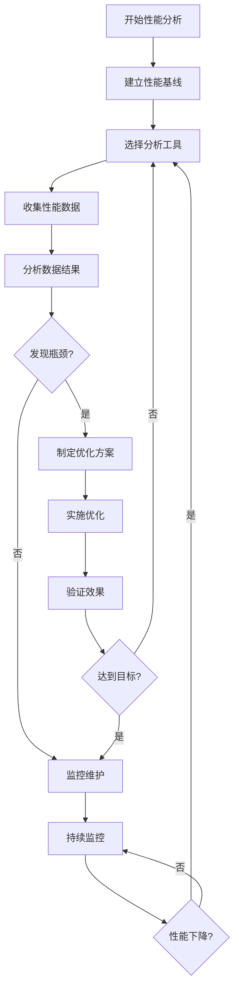

图17-1 性能分析流程图

### 17.1.1 性能分析工具概览

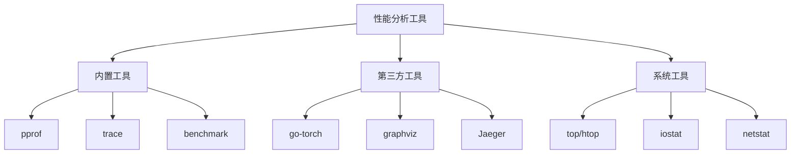

图17-2 性能分析工具概览

### 17.1.2 pprof性能分析

#### CPU性能分析

```go
package main

import (
    "context"
    "fmt"
    "log"
    "net/http"
    _ "net/http/pprof"
    "os"
    "runtime"
    "runtime/pprof"
    "time"
)

// 性能分析管理器
type ProfileManager struct {
    cpuProfile *os.File
    memProfile *os.File
    enabled    bool
}

func NewProfileManager() *ProfileManager {
    return &ProfileManager{}
}

// 启动CPU性能分析
func (pm *ProfileManager) StartCPUProfile(filename string) error {
    if pm.enabled {
        return fmt.Errorf("profiling already enabled")
    }
    
    file, err := os.Create(filename)
    if err != nil {
        return fmt.Errorf("failed to create CPU profile file: %w", err)
    }
    
    if err := pprof.StartCPUProfile(file); err != nil {
        file.Close()
        return fmt.Errorf("failed to start CPU profile: %w", err)
    }
    
    pm.cpuProfile = file
    pm.enabled = true
    log.Printf("CPU profiling started: %s", filename)
    
    return nil
}

// 停止CPU性能分析
func (pm *ProfileManager) StopCPUProfile() error {
    if !pm.enabled || pm.cpuProfile == nil {
        return fmt.Errorf("CPU profiling not started")
    }
    
    pprof.StopCPUProfile()
    pm.cpuProfile.Close()
    pm.cpuProfile = nil
    pm.enabled = false
    
    log.Println("CPU profiling stopped")
    return nil
}

// 生成内存性能分析
func (pm *ProfileManager) WriteMemProfile(filename string) error {
    file, err := os.Create(filename)
    if err != nil {
        return fmt.Errorf("failed to create memory profile file: %w", err)
    }
    defer file.Close()
    
    runtime.GC() // 强制垃圾回收
    
    if err := pprof.WriteHeapProfile(file); err != nil {
        return fmt.Errorf("failed to write memory profile: %w", err)
    }
    
    log.Printf("Memory profile written: %s", filename)
    return nil
}

// 性能分析中间件
func ProfileMiddleware() gin.HandlerFunc {
    return func(c *gin.Context) {
        start := time.Now()
        
        // 记录请求开始时的内存使用情况
        var startMem runtime.MemStats
        runtime.ReadMemStats(&startMem)
        
        c.Next()
        
        // 记录请求结束时的内存使用情况
        var endMem runtime.MemStats
        runtime.ReadMemStats(&endMem)
        
        duration := time.Since(start)
        memUsed := endMem.Alloc - startMem.Alloc
        
        // 记录性能指标
        log.Printf("Request: %s %s, Duration: %v, Memory: %d bytes",
            c.Request.Method, c.Request.URL.Path, duration, memUsed)
        
        // 如果请求时间过长，记录详细信息
        if duration > 100*time.Millisecond {
            log.Printf("Slow request detected: %s %s took %v",
                c.Request.Method, c.Request.URL.Path, duration)
        }
    }
}

// 示例：CPU密集型任务
func cpuIntensiveTask(n int) int {
    result := 0
    for i := 0; i < n; i++ {
        for j := 0; j < 1000; j++ {
            result += i * j
        }
    }
    return result
}

// 示例：内存密集型任务
func memoryIntensiveTask(size int) [][]int {
    matrix := make([][]int, size)
    for i := range matrix {
        matrix[i] = make([]int, size)
        for j := range matrix[i] {
            matrix[i][j] = i * j
        }
    }
    return matrix
}

func main() {
    // 启动pprof HTTP服务器
    go func() {
        log.Println("Starting pprof server on :6060")
        log.Println(http.ListenAndServe("localhost:6060", nil))
    }()
    
    pm := NewProfileManager()
    
    // 启动CPU性能分析
    if err := pm.StartCPUProfile("cpu.prof"); err != nil {
        log.Fatal(err)
    }
    defer pm.StopCPUProfile()
    
    // 执行一些任务
    log.Println("Starting CPU intensive task...")
    result := cpuIntensiveTask(10000)
    log.Printf("CPU task result: %d", result)
    
    log.Println("Starting memory intensive task...")
    matrix := memoryIntensiveTask(1000)
    log.Printf("Matrix size: %dx%d", len(matrix), len(matrix[0]))
    
    // 生成内存性能分析
    if err := pm.WriteMemProfile("mem.prof"); err != nil {
        log.Fatal(err)
    }
    
    time.Sleep(10 * time.Second)
}
```

#### 内存性能分析

```go
// 内存泄漏检测器
type MemoryLeakDetector struct {
    baseline    runtime.MemStats
    threshold   uint64 // 内存增长阈值（字节）
    checkInterval time.Duration
    alertFunc   func(string)
    stopChan    chan struct{}
}

func NewMemoryLeakDetector(threshold uint64, interval time.Duration, alertFunc func(string)) *MemoryLeakDetector {
    detector := &MemoryLeakDetector{
        threshold:     threshold,
        checkInterval: interval,
        alertFunc:     alertFunc,
        stopChan:      make(chan struct{}),
    }
    
    // 设置基线
    runtime.ReadMemStats(&detector.baseline)
    
    return detector
}

func (mld *MemoryLeakDetector) Start() {
    ticker := time.NewTicker(mld.checkInterval)
    defer ticker.Stop()
    
    for {
        select {
        case <-ticker.C:
            mld.checkMemoryUsage()
        case <-mld.stopChan:
            return
        }
    }
}

func (mld *MemoryLeakDetector) Stop() {
    close(mld.stopChan)
}

func (mld *MemoryLeakDetector) checkMemoryUsage() {
    var current runtime.MemStats
    runtime.ReadMemStats(&current)
    
    // 检查堆内存增长
    heapGrowth := current.HeapAlloc - mld.baseline.HeapAlloc
    if heapGrowth > mld.threshold {
        message := fmt.Sprintf("Memory leak detected: heap grew by %d bytes (threshold: %d)",
            heapGrowth, mld.threshold)
        mld.alertFunc(message)
    }
    
    // 检查goroutine数量
    numGoroutines := runtime.NumGoroutine()
    if numGoroutines > 1000 { // 假设阈值为1000
        message := fmt.Sprintf("High goroutine count detected: %d goroutines", numGoroutines)
        mld.alertFunc(message)
    }
    
    // 记录详细内存统计
    log.Printf("Memory Stats - Heap: %d, Stack: %d, Goroutines: %d",
        current.HeapAlloc, current.StackInuse, numGoroutines)
}

// 内存池优化示例
type BytePool struct {
    pool sync.Pool
}

func NewBytePool(size int) *BytePool {
    return &BytePool{
        pool: sync.Pool{
            New: func() interface{} {
                return make([]byte, size)
            },
        },
    }
}

func (bp *BytePool) Get() []byte {
    return bp.pool.Get().([]byte)
}

func (bp *BytePool) Put(b []byte) {
    // 重置切片长度但保留容量
    b = b[:0]
    bp.pool.Put(b)
}

// 使用内存池的HTTP处理器
func OptimizedHandler(pool *BytePool) gin.HandlerFunc {
    return func(c *gin.Context) {
        // 从池中获取缓冲区
        buffer := pool.Get()
        defer pool.Put(buffer)
        
        // 使用缓冲区处理请求
        data, err := io.ReadAll(c.Request.Body)
        if err != nil {
            c.JSON(500, gin.H{"error": "failed to read request body"})
            return
        }
        
        // 将数据复制到池中的缓冲区
        if len(data) <= cap(buffer) {
            buffer = buffer[:len(data)]
            copy(buffer, data)
            
            // 处理数据...
            processData(buffer)
        }
        
        c.JSON(200, gin.H{"status": "processed"})
    }
}

func processData(data []byte) {
    // 模拟数据处理
    _ = len(data)
}
```

### 17.1.3 基准测试

```go
package optimization

import (
    "bytes"
    "encoding/json"
    "fmt"
    "strings"
    "testing"
)

// 字符串拼接性能比较
func BenchmarkStringConcat(b *testing.B) {
    strs := []string{"hello", "world", "go", "programming"}
    
    b.Run("Plus", func(b *testing.B) {
        for i := 0; i < b.N; i++ {
            result := ""
            for _, s := range strs {
                result += s
            }
            _ = result
        }
    })
    
    b.Run("Builder", func(b *testing.B) {
        for i := 0; i < b.N; i++ {
            var builder strings.Builder
            for _, s := range strs {
                builder.WriteString(s)
            }
            _ = builder.String()
        }
    })
    
    b.Run("Buffer", func(b *testing.B) {
        for i := 0; i < b.N; i++ {
            var buffer bytes.Buffer
            for _, s := range strs {
                buffer.WriteString(s)
            }
            _ = buffer.String()
        }
    })
    
    b.Run("Join", func(b *testing.B) {
        for i := 0; i < b.N; i++ {
            result := strings.Join(strs, "")
            _ = result
        }
    })
}

// JSON序列化性能比较
type User struct {
    ID       int    `json:"id"`
    Username string `json:"username"`
    Email    string `json:"email"`
    Age      int    `json:"age"`
}

func BenchmarkJSONSerialization(b *testing.B) {
    user := User{
        ID:       1,
        Username: "testuser",
        Email:    "test@example.com",
        Age:      25,
    }
    
    b.Run("Marshal", func(b *testing.B) {
        for i := 0; i < b.N; i++ {
            _, err := json.Marshal(user)
            if err != nil {
                b.Fatal(err)
            }
        }
    })
    
    b.Run("Encoder", func(b *testing.B) {
        for i := 0; i < b.N; i++ {
            var buf bytes.Buffer
            encoder := json.NewEncoder(&buf)
            err := encoder.Encode(user)
            if err != nil {
                b.Fatal(err)
            }
        }
    })
}

// 切片操作性能比较
func BenchmarkSliceOperations(b *testing.B) {
    size := 1000
    
    b.Run("Append", func(b *testing.B) {
        for i := 0; i < b.N; i++ {
            var slice []int
            for j := 0; j < size; j++ {
                slice = append(slice, j)
            }
        }
    })
    
    b.Run("PreAllocated", func(b *testing.B) {
        for i := 0; i < b.N; i++ {
            slice := make([]int, 0, size)
            for j := 0; j < size; j++ {
                slice = append(slice, j)
            }
        }
    })
    
    b.Run("IndexAssignment", func(b *testing.B) {
        for i := 0; i < b.N; i++ {
            slice := make([]int, size)
            for j := 0; j < size; j++ {
                slice[j] = j
            }
        }
    })
}

// 映射操作性能比较
func BenchmarkMapOperations(b *testing.B) {
    size := 1000
    keys := make([]string, size)
    for i := 0; i < size; i++ {
        keys[i] = fmt.Sprintf("key%d", i)
    }
    
    b.Run("WithoutPreAllocation", func(b *testing.B) {
        for i := 0; i < b.N; i++ {
            m := make(map[string]int)
            for j, key := range keys {
                m[key] = j
            }
        }
    })
    
    b.Run("WithPreAllocation", func(b *testing.B) {
        for i := 0; i < b.N; i++ {
            m := make(map[string]int, size)
            for j, key := range keys {
                m[key] = j
            }
        }
    })
}

// 运行基准测试的辅助函数
func RunBenchmarks() {
    // 这个函数可以在main中调用来运行基准测试
    fmt.Println("Run benchmarks with: go test -bench=. -benchmem")
}
```

## 17.2 内存优化

内存优化是Go应用性能调优的核心环节，主要包括垃圾回收优化、内存分配优化和内存泄漏预防。

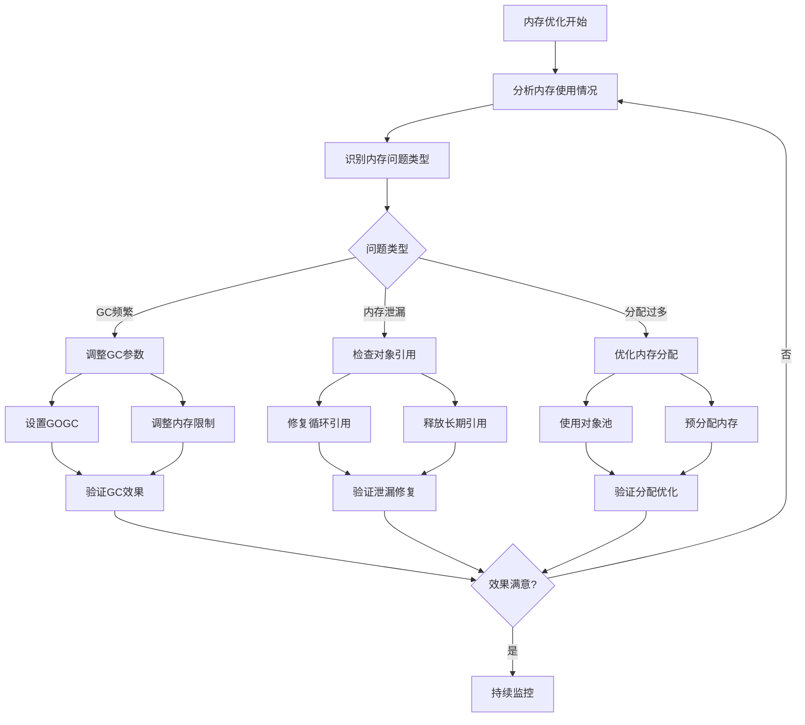

图17-3 GC优化流程图

### 17.2.1 垃圾回收优化

```go
package memory

import (
    "context"
    "fmt"
    "log"
    "runtime"
    "runtime/debug"
    "sync"
    "time
)

// GC调优管理器
type GCTuner struct {
    targetGCPercent int
    maxMemory       uint64
    checkInterval   time.Duration
    mu              sync.RWMutex
    stats           []GCStats
}

type GCStats struct {
    Timestamp    time.Time
    NumGC        uint32
    PauseTotal   time.Duration
    HeapAlloc    uint64
    HeapSys      uint64
    NextGC       uint64
}

func NewGCTuner(targetPercent int, maxMem uint64, interval time.Duration) *GCTuner {
    return &GCTuner{
        targetGCPercent: targetPercent,
        maxMemory:       maxMem,
        checkInterval:   interval,
        stats:           make([]GCStats, 0, 100),
    }
}

func (gt *GCTuner) Start(ctx context.Context) {
    // 设置初始GC百分比
    debug.SetGCPercent(gt.targetGCPercent)
    
    ticker := time.NewTicker(gt.checkInterval)
    defer ticker.Stop()
    
    for {
        select {
        case <-ctx.Done():
            return
        case <-ticker.C:
            gt.adjustGC()
        }
    }
}

func (gt *GCTuner) adjustGC() {
    var m runtime.MemStats
    runtime.ReadMemStats(&m)
    
    // 记录统计信息
    stats := GCStats{
        Timestamp:  time.Now(),
        NumGC:      m.NumGC,
        PauseTotal: time.Duration(m.PauseTotalNs),
        HeapAlloc:  m.HeapAlloc,
        HeapSys:    m.HeapSys,
        NextGC:     m.NextGC,
    }
    
    gt.mu.Lock()
    gt.stats = append(gt.stats, stats)
    if len(gt.stats) > 100 {
        gt.stats = gt.stats[1:]
    }
    gt.mu.Unlock()
    
    // 根据内存使用情况调整GC
    if m.HeapAlloc > gt.maxMemory {
        // 内存使用过高，降低GC百分比以更频繁地回收
        newPercent := gt.targetGCPercent / 2
        if newPercent < 10 {
            newPercent = 10
        }
        debug.SetGCPercent(newPercent)
        log.Printf("High memory usage detected, adjusted GC percent to %d", newPercent)
        
        // 强制执行GC
        runtime.GC()
    } else if m.HeapAlloc < gt.maxMemory/2 {
        // 内存使用较低，可以提高GC百分比以减少GC频率
        newPercent := gt.targetGCPercent * 2
        if newPercent > 200 {
            newPercent = 200
        }
        debug.SetGCPercent(newPercent)
    }
}

func (gt *GCTuner) GetStats() []GCStats {
    gt.mu.RLock()
    defer gt.mu.RUnlock()
    
    result := make([]GCStats, len(gt.stats))
    copy(result, gt.stats)
    return result
}

// 内存监控中间件
func MemoryMonitorMiddleware(threshold uint64) gin.HandlerFunc {
    return func(c *gin.Context) {
        var before runtime.MemStats
        runtime.ReadMemStats(&before)
        
        c.Next()
        
        var after runtime.MemStats
        runtime.ReadMemStats(&after)
        
        allocated := after.Alloc - before.Alloc
        if allocated > threshold {
            log.Printf("High memory allocation in request %s %s: %d bytes",
                c.Request.Method, c.Request.URL.Path, allocated)
        }
        
        // 添加内存使用信息到响应头（仅在开发环境）
        if gin.Mode() == gin.DebugMode {
            c.Header("X-Memory-Alloc", fmt.Sprintf("%d", allocated))
            c.Header("X-Memory-Total", fmt.Sprintf("%d", after.Alloc))
        }
    }
}
```

### 17.2.2 对象池优化

对象池通过重用对象来减少内存分配和垃圾回收的压力，下图展示了使用对象池前后的内存分配时序对比：

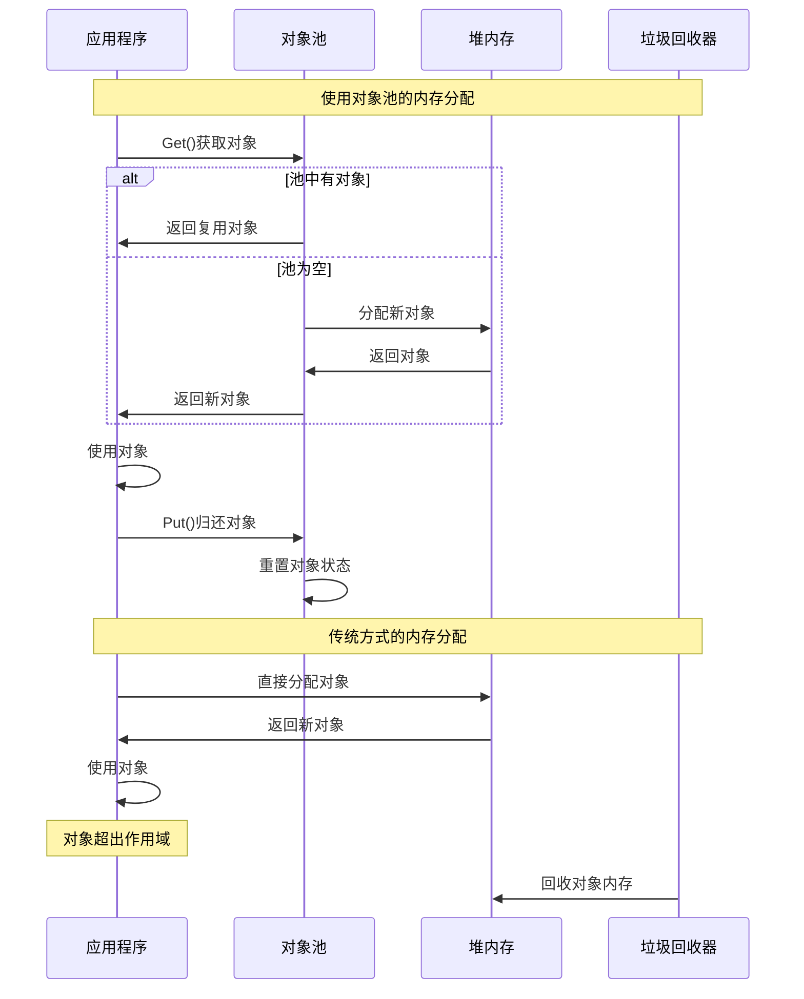

图17-4 内存分配时序对比图

```go
// 通用对象池
type ObjectPool struct {
    pool sync.Pool
    new  func() interface{}
    reset func(interface{})
}

func NewObjectPool(newFunc func() interface{}, resetFunc func(interface{})) *ObjectPool {
    return &ObjectPool{
        pool: sync.Pool{
            New: newFunc,
        },
        new:   newFunc,
        reset: resetFunc,
    }
}

func (op *ObjectPool) Get() interface{} {
    return op.pool.Get()
}

func (op *ObjectPool) Put(obj interface{}) {
    if op.reset != nil {
        op.reset(obj)
    }
    op.pool.Put(obj)
}

// HTTP请求对象池
type HTTPRequest struct {
    Method  string
    URL     string
    Headers map[string]string
    Body    []byte
}

func (r *HTTPRequest) Reset() {
    r.Method = ""
    r.URL = ""
    for k := range r.Headers {
        delete(r.Headers, k)
    }
    r.Body = r.Body[:0]
}

var httpRequestPool = NewObjectPool(
    func() interface{} {
        return &HTTPRequest{
            Headers: make(map[string]string),
            Body:    make([]byte, 0, 1024),
        }
    },
    func(obj interface{}) {
        obj.(*HTTPRequest).Reset()
    },
)

// 使用对象池的HTTP客户端
type OptimizedHTTPClient struct {
    client *http.Client
}

func NewOptimizedHTTPClient() *OptimizedHTTPClient {
    return &OptimizedHTTPClient{
        client: &http.Client{
            Timeout: 30 * time.Second,
            Transport: &http.Transport{
                MaxIdleConns:        100,
                MaxIdleConnsPerHost: 10,
                IdleConnTimeout:     90 * time.Second,
            },
        },
    }
}

func (c *OptimizedHTTPClient) DoRequest(method, url string, body []byte) (*http.Response, error) {
    // 从池中获取请求对象
    reqObj := httpRequestPool.Get().(*HTTPRequest)
    defer httpRequestPool.Put(reqObj)
    
    // 设置请求参数
    reqObj.Method = method
    reqObj.URL = url
    if len(body) > 0 {
        if cap(reqObj.Body) < len(body) {
            reqObj.Body = make([]byte, len(body))
        } else {
            reqObj.Body = reqObj.Body[:len(body)]
        }
        copy(reqObj.Body, body)
    }
    
    // 创建HTTP请求
    var bodyReader io.Reader
    if len(reqObj.Body) > 0 {
        bodyReader = bytes.NewReader(reqObj.Body)
    }
    
    req, err := http.NewRequest(reqObj.Method, reqObj.URL, bodyReader)
    if err != nil {
        return nil, err
    }
    
    // 设置请求头
    for k, v := range reqObj.Headers {
        req.Header.Set(k, v)
    }
    
    return c.client.Do(req)
}

// 响应缓冲池
var responseBufferPool = sync.Pool{
    New: func() interface{} {
        return make([]byte, 0, 4096)
    },
}

// 优化的响应处理
func OptimizedResponseHandler(c *gin.Context) {
    // 从池中获取缓冲区
    buffer := responseBufferPool.Get().([]byte)
    defer func() {
        // 重置缓冲区并放回池中
        buffer = buffer[:0]
        responseBufferPool.Put(buffer)
    }()
    
    // 读取请求体
    body, err := io.ReadAll(c.Request.Body)
    if err != nil {
        c.JSON(500, gin.H{"error": "failed to read request body"})
        return
    }
    
    // 使用缓冲区处理数据
    if len(body) <= cap(buffer) {
        buffer = buffer[:len(body)]
        copy(buffer, body)
        
        // 处理数据
        result := processRequestData(buffer)
        c.JSON(200, gin.H{"result": result})
    } else {
        // 数据太大，直接处理
        result := processRequestData(body)
        c.JSON(200, gin.H{"result": result})
    }
}

func processRequestData(data []byte) string {
    // 模拟数据处理
    return fmt.Sprintf("Processed %d bytes", len(data))
}
```

## 17.3 并发优化

并发优化是提升Go应用性能的重要手段，通过合理的并发设计可以充分利用多核CPU资源。

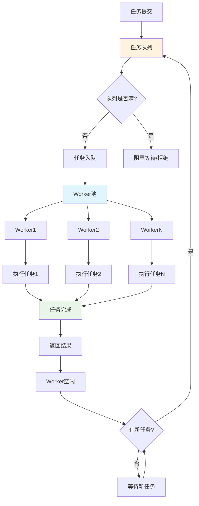

图17-5 Goroutine池工作流程图

### 17.3.1 Goroutine池

```go
package concurrency

import (
    "context"
    "fmt"
    "runtime"
    "sync"
    "sync/atomic"
    "time"
)

// 工作任务接口
type Task interface {
    Execute(ctx context.Context) error
}

// 简单任务实现
type SimpleTask struct {
    ID   int
    Work func() error
}

func (t *SimpleTask) Execute(ctx context.Context) error {
    select {
    case <-ctx.Done():
        return ctx.Err()
    default:
        return t.Work()
    }
}

// Goroutine池
type WorkerPool struct {
    workerCount int
    taskQueue   chan Task
    wg          sync.WaitGroup
    ctx         context.Context
    cancel      context.CancelFunc
    
    // 统计信息
    tasksProcessed int64
    tasksQueued    int64
    activeWorkers  int64
}

func NewWorkerPool(workerCount, queueSize int) *WorkerPool {
    ctx, cancel := context.WithCancel(context.Background())
    
    return &WorkerPool{
        workerCount: workerCount,
        taskQueue:   make(chan Task, queueSize),
        ctx:         ctx,
        cancel:      cancel,
    }
}

func (wp *WorkerPool) Start() {
    for i := 0; i < wp.workerCount; i++ {
        wp.wg.Add(1)
        go wp.worker(i)
    }
}

func (wp *WorkerPool) worker(id int) {
    defer wp.wg.Done()
    
    for {
        select {
        case <-wp.ctx.Done():
            return
        case task, ok := <-wp.taskQueue:
            if !ok {
                return
            }
            
            atomic.AddInt64(&wp.activeWorkers, 1)
            
            if err := task.Execute(wp.ctx); err != nil {
                fmt.Printf("Worker %d: task execution failed: %v\n", id, err)
            }
            
            atomic.AddInt64(&wp.tasksProcessed, 1)
            atomic.AddInt64(&wp.activeWorkers, -1)
        }
    }
}

func (wp *WorkerPool) Submit(task Task) error {
    select {
    case <-wp.ctx.Done():
        return wp.ctx.Err()
    case wp.taskQueue <- task:
        atomic.AddInt64(&wp.tasksQueued, 1)
        return nil
    default:
        return fmt.Errorf("task queue is full")
    }
}

func (wp *WorkerPool) Stop() {
    wp.cancel()
    close(wp.taskQueue)
    wp.wg.Wait()
}

func (wp *WorkerPool) Stats() (queued, processed, active int64) {
    return atomic.LoadInt64(&wp.tasksQueued),
           atomic.LoadInt64(&wp.tasksProcessed),
           atomic.LoadInt64(&wp.activeWorkers)
}

// 自适应工作池
type AdaptiveWorkerPool struct {
    *WorkerPool
    minWorkers    int
    maxWorkers    int
    scaleInterval time.Duration
    scaleMutex    sync.Mutex
}

func NewAdaptiveWorkerPool(minWorkers, maxWorkers, queueSize int, scaleInterval time.Duration) *AdaptiveWorkerPool {
    pool := NewWorkerPool(minWorkers, queueSize)
    
    return &AdaptiveWorkerPool{
        WorkerPool:    pool,
        minWorkers:    minWorkers,
        maxWorkers:    maxWorkers,
        scaleInterval: scaleInterval,
    }
}

func (awp *AdaptiveWorkerPool) Start() {
    awp.WorkerPool.Start()
    
    // 启动自动缩放
    go awp.autoScale()
}

func (awp *AdaptiveWorkerPool) autoScale() {
    ticker := time.NewTicker(awp.scaleInterval)
    defer ticker.Stop()
    
    for {
        select {
        case <-awp.ctx.Done():
            return
        case <-ticker.C:
            awp.scale()
        }
    }
}

func (awp *AdaptiveWorkerPool) scale() {
    awp.scaleMutex.Lock()
    defer awp.scaleMutex.Unlock()
    
    queueLen := len(awp.taskQueue)
    currentWorkers := awp.workerCount
    
    // 根据队列长度和当前工作者数量决定是否需要扩缩容
    if queueLen > currentWorkers*2 && currentWorkers < awp.maxWorkers {
        // 扩容：队列积压较多且未达到最大工作者数
        newWorkers := currentWorkers + 1
        if newWorkers > awp.maxWorkers {
            newWorkers = awp.maxWorkers
        }
        
        for i := currentWorkers; i < newWorkers; i++ {
            awp.wg.Add(1)
            go awp.worker(i)
        }
        
        awp.workerCount = newWorkers
        fmt.Printf("Scaled up to %d workers\n", newWorkers)
        
    } else if queueLen == 0 && currentWorkers > awp.minWorkers {
        // 缩容：队列为空且超过最小工作者数
        // 注意：实际缩容需要更复杂的逻辑来安全地停止worker
        fmt.Printf("Could scale down from %d workers\n", currentWorkers)
    }
}
```

### 17.3.2 并发控制优化

```go
// 信号量实现
type Semaphore struct {
    ch chan struct{}
}

func NewSemaphore(capacity int) *Semaphore {
    return &Semaphore{
        ch: make(chan struct{}, capacity),
    }
}

func (s *Semaphore) Acquire(ctx context.Context) error {
    select {
    case s.ch <- struct{}{}:
        return nil
    case <-ctx.Done():
        return ctx.Err()
    }
}

func (s *Semaphore) Release() {
    select {
    case <-s.ch:
    default:
        panic("semaphore: release without acquire")
    }
}

// 并发限制器
type ConcurrencyLimiter struct {
    semaphore *Semaphore
    timeout   time.Duration
}

func NewConcurrencyLimiter(maxConcurrency int, timeout time.Duration) *ConcurrencyLimiter {
    return &ConcurrencyLimiter{
        semaphore: NewSemaphore(maxConcurrency),
        timeout:   timeout,
    }
}

func (cl *ConcurrencyLimiter) Execute(ctx context.Context, fn func() error) error {
    // 设置超时上下文
    timeoutCtx, cancel := context.WithTimeout(ctx, cl.timeout)
    defer cancel()
    
    // 获取信号量
    if err := cl.semaphore.Acquire(timeoutCtx); err != nil {
        return fmt.Errorf("failed to acquire semaphore: %w", err)
    }
    defer cl.semaphore.Release()
    
    // 执行函数
    return fn()
}

// 并发安全的计数器
type SafeCounter struct {
    mu    sync.RWMutex
    value int64
}

func NewSafeCounter() *SafeCounter {
    return &SafeCounter{}
}

func (sc *SafeCounter) Increment() int64 {
    sc.mu.Lock()
    defer sc.mu.Unlock()
    sc.value++
    return sc.value
}

func (sc *SafeCounter) Decrement() int64 {
    sc.mu.Lock()
    defer sc.mu.Unlock()
    sc.value--
    return sc.value
}

func (sc *SafeCounter) Value() int64 {
    sc.mu.RLock()
    defer sc.mu.RUnlock()
    return sc.value
}

// 原子计数器（更高性能）
type AtomicCounter struct {
    value int64
}

func NewAtomicCounter() *AtomicCounter {
    return &AtomicCounter{}
}

func (ac *AtomicCounter) Increment() int64 {
    return atomic.AddInt64(&ac.value, 1)
}

func (ac *AtomicCounter) Decrement() int64 {
    return atomic.AddInt64(&ac.value, -1)
}

func (ac *AtomicCounter) Value() int64 {
    return atomic.LoadInt64(&ac.value)
}

// 并发安全的映射
type SafeMap struct {
    mu   sync.RWMutex
    data map[string]interface{}
}

func NewSafeMap() *SafeMap {
    return &SafeMap{
        data: make(map[string]interface{}),
    }
}

func (sm *SafeMap) Set(key string, value interface{}) {
    sm.mu.Lock()
    defer sm.mu.Unlock()
    sm.data[key] = value
}

func (sm *SafeMap) Get(key string) (interface{}, bool) {
    sm.mu.RLock()
    defer sm.mu.RUnlock()
    value, exists := sm.data[key]
    return value, exists
}

func (sm *SafeMap) Delete(key string) {
    sm.mu.Lock()
    defer sm.mu.Unlock()
    delete(sm.data, key)
}

func (sm *SafeMap) Keys() []string {
    sm.mu.RLock()
    defer sm.mu.RUnlock()
    
    keys := make([]string, 0, len(sm.data))
    for k := range sm.data {
        keys = append(keys, k)
    }
    return keys
}

// 使用sync.Map的高性能版本
type ConcurrentMap struct {
    data sync.Map
}

func NewConcurrentMap() *ConcurrentMap {
    return &ConcurrentMap{}
}

func (cm *ConcurrentMap) Set(key string, value interface{}) {
    cm.data.Store(key, value)
}

func (cm *ConcurrentMap) Get(key string) (interface{}, bool) {
    return cm.data.Load(key)
}

func (cm *ConcurrentMap) Delete(key string) {
    cm.data.Delete(key)
}

func (cm *ConcurrentMap) Range(fn func(key, value interface{}) bool) {
    cm.data.Range(fn)
}
```

## 17.4 数据库优化

数据库优化是企业级应用性能调优的关键环节，合理的连接池配置和查询优化能显著提升应用性能。

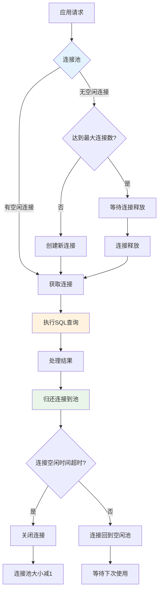

图17-6 数据库连接池管理流程图

### 17.4.1 连接池优化

```go
package database

import (
    "context"
    "database/sql"
    "fmt"
    "log"
    "sync"
    "time"
    
    "gorm.io/driver/mysql"
    "gorm.io/gorm"
    "gorm.io/gorm/logger"
)

// 数据库配置
type DBConfig struct {
    Host            string        `json:"host"`
    Port            int           `json:"port"`
    Username        string        `json:"username"`
    Password        string        `json:"password"`
    Database        string        `json:"database"`
    MaxOpenConns    int           `json:"max_open_conns"`
    MaxIdleConns    int           `json:"max_idle_conns"`
    ConnMaxLifetime time.Duration `json:"conn_max_lifetime"`
    ConnMaxIdleTime time.Duration `json:"conn_max_idle_time"`
}

// 优化的数据库管理器
type OptimizedDBManager struct {
    db     *gorm.DB
    config *DBConfig
    stats  *DBStats
    mu     sync.RWMutex
}

type DBStats struct {
    OpenConnections int
    InUse          int
    Idle           int
    WaitCount      int64
    WaitDuration   time.Duration
    MaxIdleClosed  int64
    MaxLifetimeClosed int64
}

func NewOptimizedDBManager(config *DBConfig) (*OptimizedDBManager, error) {
    dsn := fmt.Sprintf("%s:%s@tcp(%s:%d)/%s?charset=utf8mb4&parseTime=True&loc=Local",
        config.Username, config.Password, config.Host, config.Port, config.Database)
    
    // 配置GORM日志
    gormConfig := &gorm.Config{
        Logger: logger.New(
            log.New(os.Stdout, "\r\n", log.LstdFlags),
            logger.Config{
                SlowThreshold:             200 * time.Millisecond,
                LogLevel:                  logger.Warn,
                IgnoreRecordNotFoundError: true,
                Colorful:                  true,
            },
        ),
        PrepareStmt: true, // 启用预编译语句
    }
    
    db, err := gorm.Open(mysql.Open(dsn), gormConfig)
    if err != nil {
        return nil, fmt.Errorf("failed to connect to database: %w", err)
    }
    
    sqlDB, err := db.DB()
    if err != nil {
        return nil, fmt.Errorf("failed to get sql.DB: %w", err)
    }
    
    // 配置连接池
    sqlDB.SetMaxOpenConns(config.MaxOpenConns)
    sqlDB.SetMaxIdleConns(config.MaxIdleConns)
    sqlDB.SetConnMaxLifetime(config.ConnMaxLifetime)
    sqlDB.SetConnMaxIdleTime(config.ConnMaxIdleTime)
    
    manager := &OptimizedDBManager{
        db:     db,
        config: config,
        stats:  &DBStats{},
    }
    
    // 启动统计信息收集
    go manager.collectStats()
    
    return manager, nil
}

func (dm *OptimizedDBManager) collectStats() {
    ticker := time.NewTicker(30 * time.Second)
    defer ticker.Stop()
    
    for range ticker.C {
        sqlDB, err := dm.db.DB()
        if err != nil {
            continue
        }
        
        stats := sqlDB.Stats()
        
        dm.mu.Lock()
        dm.stats.OpenConnections = stats.OpenConnections
        dm.stats.InUse = stats.InUse
        dm.stats.Idle = stats.Idle
        dm.stats.WaitCount = stats.WaitCount
        dm.stats.WaitDuration = stats.WaitDuration
        dm.stats.MaxIdleClosed = stats.MaxIdleClosed
        dm.stats.MaxLifetimeClosed = stats.MaxLifetimeClosed
        dm.mu.Unlock()
        
        // 记录连接池状态
        log.Printf("DB Pool Stats - Open: %d, InUse: %d, Idle: %d, Wait: %d",
            stats.OpenConnections, stats.InUse, stats.Idle, stats.WaitCount)
        
        // 检查连接池健康状态
        if stats.WaitCount > 100 {
            log.Printf("Warning: High database connection wait count: %d", stats.WaitCount)
        }
        
        if float64(stats.InUse)/float64(dm.config.MaxOpenConns) > 0.8 {
            log.Printf("Warning: Database connection pool usage is high: %d/%d",
                stats.InUse, dm.config.MaxOpenConns)
        }
    }
}

func (dm *OptimizedDBManager) GetDB() *gorm.DB {
    return dm.db
}

func (dm *OptimizedDBManager) GetStats() DBStats {
    dm.mu.RLock()
    defer dm.mu.RUnlock()
    return *dm.stats
}

// 事务管理器
type TransactionManager struct {
    db *gorm.DB
}

func NewTransactionManager(db *gorm.DB) *TransactionManager {
    return &TransactionManager{db: db}
}

func (tm *TransactionManager) WithTransaction(ctx context.Context, fn func(*gorm.DB) error) error {
    return tm.db.WithContext(ctx).Transaction(func(tx *gorm.DB) error {
        return fn(tx)
    })
}

// 批量操作优化
type BatchProcessor struct {
    db        *gorm.DB
    batchSize int
}

func NewBatchProcessor(db *gorm.DB, batchSize int) *BatchProcessor {
    return &BatchProcessor{
        db:        db,
        batchSize: batchSize,
    }
}

func (bp *BatchProcessor) BatchInsert(ctx context.Context, records interface{}) error {
    return bp.db.WithContext(ctx).CreateInBatches(records, bp.batchSize).Error
}

func (bp *BatchProcessor) BatchUpdate(ctx context.Context, model interface{}, updates map[string]interface{}) error {
    return bp.db.WithContext(ctx).Model(model).Updates(updates).Error
}

// 查询优化器
type QueryOptimizer struct {
    db *gorm.DB
}

func NewQueryOptimizer(db *gorm.DB) *QueryOptimizer {
    return &QueryOptimizer{db: db}
}

// 预加载优化
func (qo *QueryOptimizer) OptimizedPreload(query *gorm.DB, associations ...string) *gorm.DB {
    for _, assoc := range associations {
        query = query.Preload(assoc)
    }
    return query
}

// 分页查询优化
func (qo *QueryOptimizer) PaginatedQuery(ctx context.Context, query *gorm.DB, page, pageSize int, result interface{}) (int64, error) {
    var total int64
    
    // 先获取总数
    if err := query.WithContext(ctx).Count(&total).Error; err != nil {
        return 0, err
    }
    
    // 计算偏移量
    offset := (page - 1) * pageSize
    
    // 执行分页查询
    err := query.WithContext(ctx).Offset(offset).Limit(pageSize).Find(result).Error
    return total, err
}

// 索引提示
func (qo *QueryOptimizer) WithIndex(query *gorm.DB, indexName string) *gorm.DB {
    return query.Set("gorm:query_hint", fmt.Sprintf("USE INDEX (%s)", indexName))
}
```

### 17.4.2 查询优化

```go
// 查询缓存
type QueryCache struct {
    cache map[string]CacheEntry
    mu    sync.RWMutex
    ttl   time.Duration
}

type CacheEntry struct {
    Data      interface{}
    ExpiresAt time.Time
}

func NewQueryCache(ttl time.Duration) *QueryCache {
    cache := &QueryCache{
        cache: make(map[string]CacheEntry),
        ttl:   ttl,
    }
    
    // 启动清理goroutine
    go cache.cleanup()
    
    return cache
}

func (qc *QueryCache) Get(key string) (interface{}, bool) {
    qc.mu.RLock()
    defer qc.mu.RUnlock()
    
    entry, exists := qc.cache[key]
    if !exists || time.Now().After(entry.ExpiresAt) {
        return nil, false
    }
    
    return entry.Data, true
}

func (qc *QueryCache) Set(key string, data interface{}) {
    qc.mu.Lock()
    defer qc.mu.Unlock()
    
    qc.cache[key] = CacheEntry{
        Data:      data,
        ExpiresAt: time.Now().Add(qc.ttl),
    }
}

func (qc *QueryCache) cleanup() {
    ticker := time.NewTicker(qc.ttl)
    defer ticker.Stop()
    
    for range ticker.C {
        qc.mu.Lock()
        now := time.Now()
        for key, entry := range qc.cache {
            if now.After(entry.ExpiresAt) {
                delete(qc.cache, key)
            }
        }
        qc.mu.Unlock()
    }
}

// 带缓存的仓库
type CachedRepository struct {
    db    *gorm.DB
    cache *QueryCache
}

func NewCachedRepository(db *gorm.DB, cacheTTL time.Duration) *CachedRepository {
    return &CachedRepository{
        db:    db,
        cache: NewQueryCache(cacheTTL),
    }
}

func (cr *CachedRepository) GetUserByID(ctx context.Context, id string) (*User, error) {
    cacheKey := fmt.Sprintf("user:%s", id)
    
    // 尝试从缓存获取
    if cached, found := cr.cache.Get(cacheKey); found {
        return cached.(*User), nil
    }
    
    // 从数据库查询
    var user User
    err := cr.db.WithContext(ctx).Where("id = ?", id).First(&user).Error
    if err != nil {
        return nil, err
    }
    
    // 存入缓存
    cr.cache.Set(cacheKey, &user)
    
    return &user, nil
}

func (cr *CachedRepository) GetUsersByStatus(ctx context.Context, status string) ([]*User, error) {
    cacheKey := fmt.Sprintf("users:status:%s", status)
    
    // 尝试从缓存获取
    if cached, found := cr.cache.Get(cacheKey); found {
        return cached.([]*User), nil
    }
    
    // 从数据库查询
    var users []*User
    err := cr.db.WithContext(ctx).Where("status = ?", status).Find(&users).Error
    if err != nil {
        return nil, err
    }
    
    // 存入缓存
    cr.cache.Set(cacheKey, users)
    
    return users, nil
}

// SQL查询构建器
type QueryBuilder struct {
    db     *gorm.DB
    query  *gorm.DB
    errors []error
}

func NewQueryBuilder(db *gorm.DB) *QueryBuilder {
    return &QueryBuilder{
        db:    db,
        query: db,
    }
}

func (qb *QueryBuilder) Where(condition string, args ...interface{}) *QueryBuilder {
    qb.query = qb.query.Where(condition, args...)
    return qb
}

func (qb *QueryBuilder) Join(table string, condition string) *QueryBuilder {
    qb.query = qb.query.Joins(fmt.Sprintf("JOIN %s ON %s", table, condition))
    return qb
}

func (qb *QueryBuilder) LeftJoin(table string, condition string) *QueryBuilder {
    qb.query = qb.query.Joins(fmt.Sprintf("LEFT JOIN %s ON %s", table, condition))
    return qb
}

func (qb *QueryBuilder) OrderBy(column string, direction string) *QueryBuilder {
    qb.query = qb.query.Order(fmt.Sprintf("%s %s", column, direction))
    return qb
}

func (qb *QueryBuilder) Limit(limit int) *QueryBuilder {
    qb.query = qb.query.Limit(limit)
    return qb
}

func (qb *QueryBuilder) Offset(offset int) *QueryBuilder {
    qb.query = qb.query.Offset(offset)
    return qb
}

func (qb *QueryBuilder) Find(ctx context.Context, result interface{}) error {
    return qb.query.WithContext(ctx).Find(result).Error
}

func (qb *QueryBuilder) First(ctx context.Context, result interface{}) error {
    return qb.query.WithContext(ctx).First(result).Error
}

func (qb *QueryBuilder) Count(ctx context.Context) (int64, error) {
    var count int64
    err := qb.query.WithContext(ctx).Count(&count).Error
    return count, err
}

// 使用示例
func ExampleOptimizedQueries(db *gorm.DB) {
    ctx := context.Background()
    
    // 使用查询构建器
    qb := NewQueryBuilder(db)
    var users []User
    
    err := qb.Where("status = ?", "active").
        Where("created_at > ?", time.Now().AddDate(0, -1, 0)).
        OrderBy("created_at", "DESC").
        Limit(10).
        Find(ctx, &users)
    
    if err != nil {
        log.Printf("Query failed: %v", err)
    }
    
    // 使用缓存仓库
    repo := NewCachedRepository(db, 5*time.Minute)
    user, err := repo.GetUserByID(ctx, "user123")
    if err != nil {
        log.Printf("Failed to get user: %v", err)
    } else {
        log.Printf("Got user: %+v", user)
    }
}
```

## 17.5 缓存优化

缓存优化是提升应用性能的重要手段，通过多级缓存架构可以有效减少数据库访问压力，提高响应速度。

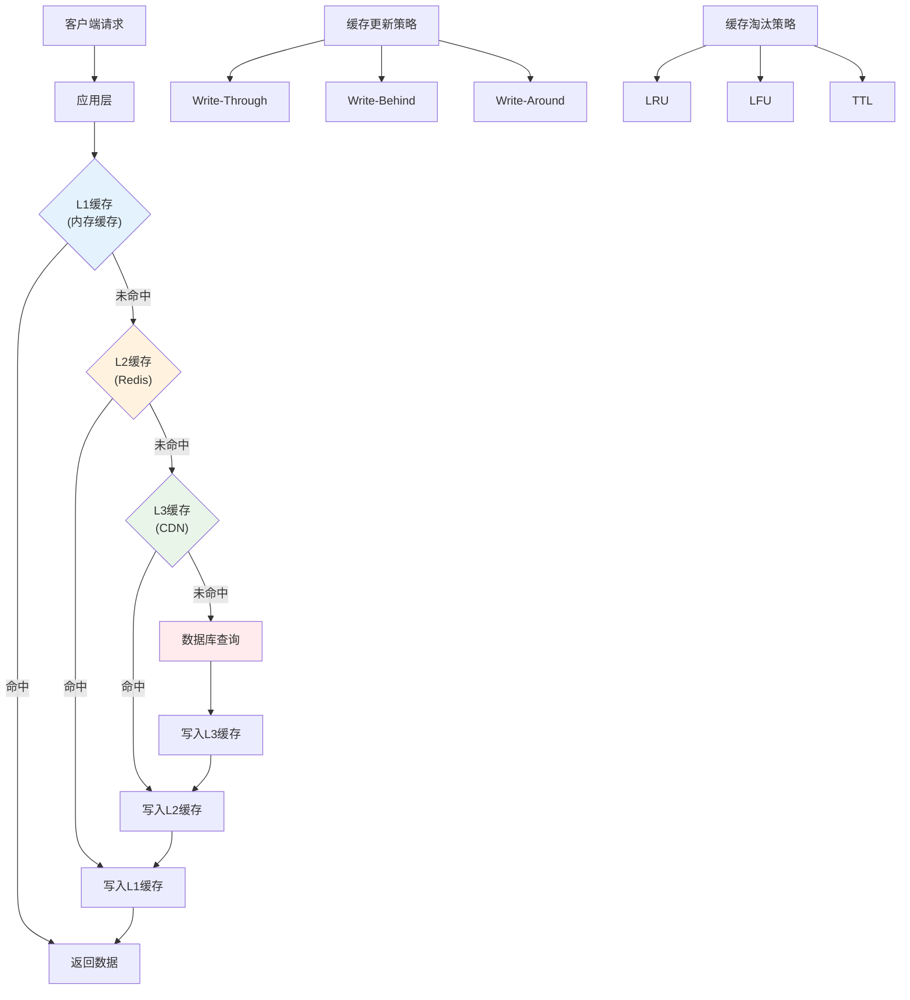

图17-7 多级缓存架构图

### 17.5.1 多级缓存

```go
package cache

import (
    "context"
    "encoding/json"
    "fmt"
    "log"
    "sync"
    "time"
    
    "github.com/go-redis/redis/v8"
)

// 缓存接口
type Cache interface {
    Get(ctx context.Context, key string) ([]byte, error)
    Set(ctx context.Context, key string, value []byte, ttl time.Duration) error
    Delete(ctx context.Context, key string) error
    Exists(ctx context.Context, key string) (bool, error)
}

// 内存缓存实现
type MemoryCache struct {
    data map[string]memoryCacheEntry
    mu   sync.RWMutex
}

type memoryCacheEntry struct {
    Value     []byte
    ExpiresAt time.Time
}

func NewMemoryCache() *MemoryCache {
    cache := &MemoryCache{
        data: make(map[string]memoryCacheEntry),
    }
    
    // 启动清理goroutine
    go cache.cleanup()
    
    return cache
}

func (mc *MemoryCache) Get(ctx context.Context, key string) ([]byte, error) {
    mc.mu.RLock()
    defer mc.mu.RUnlock()
    
    entry, exists := mc.data[key]
    if !exists {
        return nil, fmt.Errorf("key not found")
    }
    
    if time.Now().After(entry.ExpiresAt) {
        return nil, fmt.Errorf("key expired")
    }
    
    return entry.Value, nil
}

func (mc *MemoryCache) Set(ctx context.Context, key string, value []byte, ttl time.Duration) error {
    mc.mu.Lock()
    defer mc.mu.Unlock()
    
    mc.data[key] = memoryCacheEntry{
        Value:     value,
        ExpiresAt: time.Now().Add(ttl),
    }
    
    return nil
}

func (mc *MemoryCache) Delete(ctx context.Context, key string) error {
    mc.mu.Lock()
    defer mc.mu.Unlock()
    
    delete(mc.data, key)
    return nil
}

func (mc *MemoryCache) Exists(ctx context.Context, key string) (bool, error) {
    mc.mu.RLock()
    defer mc.mu.RUnlock()
    
    entry, exists := mc.data[key]
    if !exists {
        return false, nil
    }
    
    return !time.Now().After(entry.ExpiresAt), nil
}

func (mc *MemoryCache) cleanup() {
    ticker := time.NewTicker(1 * time.Minute)
    defer ticker.Stop()
    
    for range ticker.C {
        mc.mu.Lock()
        now := time.Now()
        for key, entry := range mc.data {
            if now.After(entry.ExpiresAt) {
                delete(mc.data, key)
            }
        }
        mc.mu.Unlock()
    }
}

// Redis缓存实现
type RedisCache struct {
    client *redis.Client
}

func NewRedisCache(addr, password string, db int) *RedisCache {
    client := redis.NewClient(&redis.Options{
        Addr:     addr,
        Password: password,
        DB:       db,
    })
    
    return &RedisCache{
        client: client,
    }
}

func (rc *RedisCache) Get(ctx context.Context, key string) ([]byte, error) {
    result, err := rc.client.Get(ctx, key).Result()
    if err != nil {
        return nil, err
    }
    return []byte(result), nil
}

func (rc *RedisCache) Set(ctx context.Context, key string, value []byte, ttl time.Duration) error {
    return rc.client.Set(ctx, key, value, ttl).Err()
}

func (rc *RedisCache) Delete(ctx context.Context, key string) error {
    return rc.client.Del(ctx, key).Err()
}

func (rc *RedisCache) Exists(ctx context.Context, key string) (bool, error) {
    count, err := rc.client.Exists(ctx, key).Result()
    return count > 0, err
}

// 多级缓存管理器
type MultiLevelCache struct {
    l1Cache Cache // 内存缓存（L1）
    l2Cache Cache // Redis缓存（L2）
    l1TTL   time.Duration
    l2TTL   time.Duration
}

func NewMultiLevelCache(l1Cache, l2Cache Cache, l1TTL, l2TTL time.Duration) *MultiLevelCache {
    return &MultiLevelCache{
        l1Cache: l1Cache,
        l2Cache: l2Cache,
        l1TTL:   l1TTL,
        l2TTL:   l2TTL,
    }
}

func (mlc *MultiLevelCache) Get(ctx context.Context, key string) ([]byte, error) {
    // 先尝试L1缓存
    if data, err := mlc.l1Cache.Get(ctx, key); err == nil {
        return data, nil
    }
    
    // L1缓存未命中，尝试L2缓存
    data, err := mlc.l2Cache.Get(ctx, key)
    if err != nil {
        return nil, err
    }
    
    // 将数据写入L1缓存
    mlc.l1Cache.Set(ctx, key, data, mlc.l1TTL)
    
    return data, nil
}

func (mlc *MultiLevelCache) Set(ctx context.Context, key string, value []byte) error {
    // 同时写入L1和L2缓存
    if err := mlc.l1Cache.Set(ctx, key, value, mlc.l1TTL); err != nil {
        log.Printf("Failed to set L1 cache: %v", err)
    }
    
    return mlc.l2Cache.Set(ctx, key, value, mlc.l2TTL)
}

func (mlc *MultiLevelCache) Delete(ctx context.Context, key string) error {
    // 同时删除L1和L2缓存
    mlc.l1Cache.Delete(ctx, key)
    return mlc.l2Cache.Delete(ctx, key)
}

// 缓存管理器
type CacheManager struct {
    cache Cache
    stats *CacheStats
    mu    sync.RWMutex
}

type CacheStats struct {
    Hits   int64
    Misses int64
    Sets   int64
    Deletes int64
}

func NewCacheManager(cache Cache) *CacheManager {
    return &CacheManager{
        cache: cache,
        stats: &CacheStats{},
    }
}

func (cm *CacheManager) Get(ctx context.Context, key string) ([]byte, error) {
    data, err := cm.cache.Get(ctx, key)
    
    cm.mu.Lock()
    if err != nil {
        cm.stats.Misses++
    } else {
        cm.stats.Hits++
    }
    cm.mu.Unlock()
    
    return data, err
}

func (cm *CacheManager) Set(ctx context.Context, key string, value []byte, ttl time.Duration) error {
    err := cm.cache.Set(ctx, key, value, ttl)
    
    cm.mu.Lock()
    cm.stats.Sets++
    cm.mu.Unlock()
    
    return err
}

func (cm *CacheManager) Delete(ctx context.Context, key string) error {
    err := cm.cache.Delete(ctx, key)
    
    cm.mu.Lock()
    cm.stats.Deletes++
    cm.mu.Unlock()
    
    return err
}

func (cm *CacheManager) GetStats() CacheStats {
    cm.mu.RLock()
    defer cm.mu.RUnlock()
    return *cm.stats
}

func (cm *CacheManager) HitRate() float64 {
    cm.mu.RLock()
    defer cm.mu.RUnlock()
    
    total := cm.stats.Hits + cm.stats.Misses
    if total == 0 {
        return 0
    }
    
    return float64(cm.stats.Hits) / float64(total)
}

// 泛型缓存包装器
type TypedCache[T any] struct {
    cache Cache
}

func NewTypedCache[T any](cache Cache) *TypedCache[T] {
    return &TypedCache[T]{cache: cache}
}

func (tc *TypedCache[T]) Get(ctx context.Context, key string) (*T, error) {
    data, err := tc.cache.Get(ctx, key)
    if err != nil {
        return nil, err
    }
    
    var result T
    if err := json.Unmarshal(data, &result); err != nil {
        return nil, fmt.Errorf("failed to unmarshal cached data: %w", err)
    }
    
    return &result, nil
}

func (tc *TypedCache[T]) Set(ctx context.Context, key string, value *T, ttl time.Duration) error {
    data, err := json.Marshal(value)
    if err != nil {
        return fmt.Errorf("failed to marshal value: %w", err)
    }
    
    return tc.cache.Set(ctx, key, data, ttl)
}

func (tc *TypedCache[T]) Delete(ctx context.Context, key string) error {
    return tc.cache.Delete(ctx, key)
}
```

### 17.5.2 缓存策略

```go
// 缓存策略接口
type CacheStrategy interface {
    ShouldCache(key string, value interface{}) bool
    GetTTL(key string, value interface{}) time.Duration
    GetKey(params ...interface{}) string
}

// 基于大小的缓存策略
type SizeBasedStrategy struct {
    maxSize int
    baseTTL time.Duration
}

func NewSizeBasedStrategy(maxSize int, baseTTL time.Duration) *SizeBasedStrategy {
    return &SizeBasedStrategy{
        maxSize: maxSize,
        baseTTL: baseTTL,
    }
}

func (s *SizeBasedStrategy) ShouldCache(key string, value interface{}) bool {
    data, err := json.Marshal(value)
    if err != nil {
        return false
    }
    return len(data) <= s.maxSize
}

func (s *SizeBasedStrategy) GetTTL(key string, value interface{}) time.Duration {
    data, err := json.Marshal(value)
    if err != nil {
        return s.baseTTL
    }
    
    // 根据数据大小调整TTL
    size := len(data)
    if size < 1024 { // 小于1KB
        return s.baseTTL * 2
    } else if size < 10240 { // 小于10KB
        return s.baseTTL
    } else {
        return s.baseTTL / 2
    }
}

func (s *SizeBasedStrategy) GetKey(params ...interface{}) string {
    var keyParts []string
    for _, param := range params {
        keyParts = append(keyParts, fmt.Sprintf("%v", param))
    }
    return strings.Join(keyParts, ":")
}

// 智能缓存装饰器
type SmartCache struct {
    cache    Cache
    strategy CacheStrategy
}

func NewSmartCache(cache Cache, strategy CacheStrategy) *SmartCache {
    return &SmartCache{
        cache:    cache,
        strategy: strategy,
    }
}

func (sc *SmartCache) GetOrSet(ctx context.Context, keyParams []interface{}, fetchFunc func() (interface{}, error)) (interface{}, error) {
    key := sc.strategy.GetKey(keyParams...)
    
    // 尝试从缓存获取
    if data, err := sc.cache.Get(ctx, key); err == nil {
        var result interface{}
        if err := json.Unmarshal(data, &result); err == nil {
            return result, nil
        }
    }
    
    // 缓存未命中，执行获取函数
    value, err := fetchFunc()
    if err != nil {
        return nil, err
    }
    
    // 根据策略决定是否缓存
    if sc.strategy.ShouldCache(key, value) {
        if data, err := json.Marshal(value); err == nil {
            ttl := sc.strategy.GetTTL(key, value)
            sc.cache.Set(ctx, key, data, ttl)
        }
    }
    
    return value, nil
}
```

## 17.6 HTTP性能优化

HTTP性能优化涉及连接管理、数据压缩、缓存策略等多个方面，合理的优化策略能显著提升Web应用的响应速度和吞吐量。

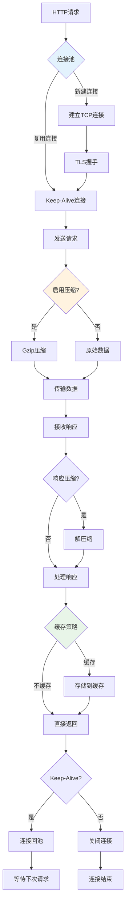

图17-8 HTTP请求优化流程图

### 17.6.1 连接池和Keep-Alive

```go
package http_optimization

import (
    "compress/gzip"
    "context"
    "fmt"
    "io"
    "net/http"
    "strings"
    "sync"
    "time"
    
    "github.com/gin-gonic/gin"
)

// 优化的HTTP客户端
type OptimizedHTTPClient struct {
    client *http.Client
    stats  *HTTPStats
    mu     sync.RWMutex
}

type HTTPStats struct {
    TotalRequests   int64
    SuccessRequests int64
    FailedRequests  int64
    AverageLatency  time.Duration
    totalLatency    time.Duration
}

func NewOptimizedHTTPClient() *OptimizedHTTPClient {
    transport := &http.Transport{
        MaxIdleConns:        100,              // 最大空闲连接数
        MaxIdleConnsPerHost: 10,               // 每个主机的最大空闲连接数
        IdleConnTimeout:     90 * time.Second, // 空闲连接超时
        TLSHandshakeTimeout: 10 * time.Second, // TLS握手超时
        DisableCompression:  false,            // 启用压缩
        DisableKeepAlives:   false,            // 启用Keep-Alive
    }
    
    client := &http.Client{
        Transport: transport,
        Timeout:   30 * time.Second,
    }
    
    return &OptimizedHTTPClient{
        client: client,
        stats:  &HTTPStats{},
    }
}

func (c *OptimizedHTTPClient) Do(req *http.Request) (*http.Response, error) {
    start := time.Now()
    
    resp, err := c.client.Do(req)
    
    latency := time.Since(start)
    
    c.mu.Lock()
    c.stats.TotalRequests++
    c.stats.totalLatency += latency
    c.stats.AverageLatency = c.stats.totalLatency / time.Duration(c.stats.TotalRequests)
    
    if err != nil {
        c.stats.FailedRequests++
    } else {
        c.stats.SuccessRequests++
    }
    c.mu.Unlock()
    
    return resp, err
}

func (c *OptimizedHTTPClient) GetStats() HTTPStats {
    c.mu.RLock()
    defer c.mu.RUnlock()
    return *c.stats
}

// GZIP压缩中间件
func GzipMiddleware() gin.HandlerFunc {
    return func(c *gin.Context) {
        // 检查客户端是否支持gzip
        if !strings.Contains(c.GetHeader("Accept-Encoding"), "gzip") {
            c.Next()
            return
        }
        
        // 设置响应头
        c.Header("Content-Encoding", "gzip")
        c.Header("Vary", "Accept-Encoding")
        
        // 创建gzip writer
        gz := gzip.NewWriter(c.Writer)
        defer gz.Close()
        
        // 包装ResponseWriter
        c.Writer = &gzipResponseWriter{
            ResponseWriter: c.Writer,
            Writer:         gz,
        }
        
        c.Next()
    }
}

type gzipResponseWriter struct {
    gin.ResponseWriter
    Writer io.Writer
}

func (g *gzipResponseWriter) Write(data []byte) (int, error) {
    return g.Writer.Write(data)
}

// 响应缓存中间件
func ResponseCacheMiddleware(cache Cache, ttl time.Duration) gin.HandlerFunc {
    return func(c *gin.Context) {
        // 只缓存GET请求
        if c.Request.Method != "GET" {
            c.Next()
            return
        }
        
        // 生成缓存键
        cacheKey := fmt.Sprintf("response:%s:%s", c.Request.Method, c.Request.URL.Path)
        if c.Request.URL.RawQuery != "" {
            cacheKey += ":" + c.Request.URL.RawQuery
        }
        
        // 尝试从缓存获取响应
        if cached, err := cache.Get(c.Request.Context(), cacheKey); err == nil {
            c.Data(200, "application/json", cached)
            c.Abort()
            return
        }
        
        // 包装ResponseWriter以捕获响应
        writer := &responseWriter{
            ResponseWriter: c.Writer,
            body:          make([]byte, 0),
        }
        c.Writer = writer
        
        c.Next()
        
        // 如果响应成功，缓存响应
        if c.Writer.Status() == 200 && len(writer.body) > 0 {
            cache.Set(c.Request.Context(), cacheKey, writer.body, ttl)
        }
    }
}

type responseWriter struct {
    gin.ResponseWriter
    body []byte
}

func (w *responseWriter) Write(data []byte) (int, error) {
    w.body = append(w.body, data...)
    return w.ResponseWriter.Write(data)
}

// 请求限流中间件
type RateLimiter struct {
    requests map[string][]time.Time
    mu       sync.RWMutex
    limit    int
    window   time.Duration
}

func NewRateLimiter(limit int, window time.Duration) *RateLimiter {
    limiter := &RateLimiter{
        requests: make(map[string][]time.Time),
        limit:    limit,
        window:   window,
    }
    
    // 启动清理goroutine
    go limiter.cleanup()
    
    return limiter
}

func (rl *RateLimiter) Allow(clientID string) bool {
    rl.mu.Lock()
    defer rl.mu.Unlock()
    
    now := time.Now()
    windowStart := now.Add(-rl.window)
    
    // 获取客户端的请求历史
    requests, exists := rl.requests[clientID]
    if !exists {
        requests = make([]time.Time, 0)
    }
    
    // 过滤掉窗口外的请求
    validRequests := make([]time.Time, 0)
    for _, reqTime := range requests {
        if reqTime.After(windowStart) {
            validRequests = append(validRequests, reqTime)
        }
    }
    
    // 检查是否超过限制
    if len(validRequests) >= rl.limit {
        rl.requests[clientID] = validRequests
        return false
    }
    
    // 添加当前请求
    validRequests = append(validRequests, now)
    rl.requests[clientID] = validRequests
    
    return true
}

func (rl *RateLimiter) cleanup() {
    ticker := time.NewTicker(rl.window)
    defer ticker.Stop()
    
    for range ticker.C {
        rl.mu.Lock()
        now := time.Now()
        windowStart := now.Add(-rl.window)
        
        for clientID, requests := range rl.requests {
            validRequests := make([]time.Time, 0)
            for _, reqTime := range requests {
                if reqTime.After(windowStart) {
                    validRequests = append(validRequests, reqTime)
                }
            }
            
            if len(validRequests) == 0 {
                delete(rl.requests, clientID)
            } else {
                rl.requests[clientID] = validRequests
            }
        }
        rl.mu.Unlock()
    }
}

func RateLimitMiddleware(limiter *RateLimiter) gin.HandlerFunc {
    return func(c *gin.Context) {
        clientID := c.ClientIP()
        
        if !limiter.Allow(clientID) {
            c.JSON(429, gin.H{
                "error": "Too many requests",
                "retry_after": "60s",
            })
            c.Abort()
            return
        }
        
        c.Next()
    }
}
```

### 17.6.2 HTTP/2 优化

```go
// HTTP/2 服务器配置
func NewHTTP2Server(addr string, handler http.Handler) *http.Server {
    return &http.Server{
        Addr:         addr,
        Handler:      handler,
        ReadTimeout:  30 * time.Second,
        WriteTimeout: 30 * time.Second,
        IdleTimeout:  120 * time.Second,
        
        // HTTP/2 配置
        TLSConfig: &tls.Config{
            NextProtos: []string{"h2", "http/1.1"},
            MinVersion: tls.VersionTLS12,
        },
    }
}

// 服务器推送示例
func ServerPushHandler(w http.ResponseWriter, r *http.Request) {
    pusher, ok := w.(http.Pusher)
    if ok {
        // 推送CSS文件
        if err := pusher.Push("/static/style.css", nil); err != nil {
            log.Printf("Failed to push: %v", err)
        }
        
        // 推送JavaScript文件
        if err := pusher.Push("/static/app.js", nil); err != nil {
            log.Printf("Failed to push: %v", err)
        }
    }
    
    // 返回HTML页面
    w.Header().Set("Content-Type", "text/html")
    fmt.Fprintf(w, `
    <!DOCTYPE html>
    <html>
    <head>
        <link rel="stylesheet" href="/static/style.css">
    </head>
    <body>
        <h1>HTTP/2 Server Push Example</h1>
        <script src="/static/app.js"></script>
    </body>
    </html>
    `)
}
```

## 17.7 系统级优化

系统级优化涉及操作系统参数调优、资源限制配置、容器优化等多个层面，是实现应用最佳性能的基础保障。

```mermaid
flowchart TD
    A[系统级优化] --> B[操作系统层]
    A --> C[容器层]
    A --> D[应用层]
    
    B --> E[内核参数调优]
    B --> F[文件系统优化]
    B --> G[网络参数调优]
    
    E --> E1[vm.swappiness]
    E --> E2[net.core.somaxconn]
    E --> E3[fs.file-max]
    
    F --> F1[文件描述符限制]
    F --> F2[磁盘I/O调度]
    F --> F3[文件系统选择]
    
    G --> G1[TCP参数优化]
    G --> G2[连接队列大小]
    G --> G3[超时时间设置]
    
    C --> H[资源限制]
    C --> I[容器配置]
    C --> J[编排优化]
    
    H --> H1[CPU限制]
    H --> H2[内存限制]
    H --> H3[I/O限制]
    
    I --> I1[镜像优化]
    I --> I2[启动参数]
    I --> I3[健康检查]
    
    J --> J1[副本数量]
    J --> J2[负载均衡]
    J --> J3[滚动更新]
    
    D --> K[运行时优化]
    D --> L[监控告警]
    
    K --> K1[GOMAXPROCS]
    K --> K2[GC参数]
    K --> K3[内存分配]
    
    L --> L1[性能指标]
    L --> L2[资源使用]
    L --> L3[异常检测]
    
    style A fill:#e3f2fd
    style B fill:#fff3e0
    style C fill:#e8f5e8
    style D fill:#ffebee
```

图17-9 系统调优架构图

### 17.7.1 操作系统参数调优

```bash
# 网络参数优化
echo 'net.core.somaxconn = 65535' >> /etc/sysctl.conf
echo 'net.core.netdev_max_backlog = 5000' >> /etc/sysctl.conf
echo 'net.ipv4.tcp_max_syn_backlog = 65535' >> /etc/sysctl.conf
echo 'net.ipv4.tcp_fin_timeout = 30' >> /etc/sysctl.conf
echo 'net.ipv4.tcp_keepalive_time = 1200' >> /etc/sysctl.conf
echo 'net.ipv4.tcp_max_tw_buckets = 5000' >> /etc/sysctl.conf

# 文件描述符限制
echo '* soft nofile 65535' >> /etc/security/limits.conf
echo '* hard nofile 65535' >> /etc/security/limits.conf

# 应用sysctl配置
sysctl -p
```

### 17.7.2 容器资源限制

```yaml
# docker-compose.yml
version: '3.8'
services:
  new-api:
    image: new-api:latest
    deploy:
      resources:
        limits:
          cpus: '2.0'
          memory: 2G
        reservations:
          cpus: '1.0'
          memory: 1G
    environment:
      - GOMAXPROCS=2
      - GOGC=100
    ulimits:
      nofile:
        soft: 65535
        hard: 65535
```

### 17.7.3 Go运行时优化

```go
package runtime_optimization

import (
    "runtime"
    "runtime/debug"
    "time"
)

// 运行时优化配置
type RuntimeConfig struct {
    MaxProcs    int
    GCPercent   int
    MemoryLimit int64
}

func OptimizeRuntime(config RuntimeConfig) {
    // 设置最大处理器数量
    if config.MaxProcs > 0 {
        runtime.GOMAXPROCS(config.MaxProcs)
    }
    
    // 设置GC目标百分比
    if config.GCPercent > 0 {
        debug.SetGCPercent(config.GCPercent)
    }
    
    // 设置内存限制（Go 1.19+）
    if config.MemoryLimit > 0 {
        debug.SetMemoryLimit(config.MemoryLimit)
    }
    
    // 启用内存ballast（适用于大内存应用）
    if config.MemoryLimit > 1<<30 { // 1GB
        ballast := make([]byte, config.MemoryLimit/4)
        runtime.KeepAlive(ballast)
    }
}

// 性能监控
type PerformanceMonitor struct {
    startTime time.Time
    stats     runtime.MemStats
}

func NewPerformanceMonitor() *PerformanceMonitor {
    return &PerformanceMonitor{
        startTime: time.Now(),
    }
}

func (pm *PerformanceMonitor) GetStats() map[string]interface{} {
    runtime.ReadMemStats(&pm.stats)
    
    return map[string]interface{}{
        "uptime":           time.Since(pm.startTime).String(),
        "goroutines":       runtime.NumGoroutine(),
        "heap_alloc":       pm.stats.HeapAlloc,
        "heap_sys":         pm.stats.HeapSys,
        "heap_idle":        pm.stats.HeapIdle,
        "heap_inuse":       pm.stats.HeapInuse,
        "heap_released":    pm.stats.HeapReleased,
        "heap_objects":     pm.stats.HeapObjects,
        "stack_inuse":      pm.stats.StackInuse,
        "stack_sys":        pm.stats.StackSys,
        "gc_runs":          pm.stats.NumGC,
        "gc_pause_total":   pm.stats.PauseTotalNs,
        "gc_pause_last":    pm.stats.PauseNs[(pm.stats.NumGC+255)%256],
        "next_gc":          pm.stats.NextGC,
        "last_gc":          time.Unix(0, int64(pm.stats.LastGC)).Format(time.RFC3339),
    }
}

// 自动GC调优
type GCTuner struct {
    targetLatency time.Duration
    monitor       *PerformanceMonitor
    gcPercent     int
}

func NewGCTuner(targetLatency time.Duration) *GCTuner {
    return &GCTuner{
        targetLatency: targetLatency,
        monitor:       NewPerformanceMonitor(),
        gcPercent:     100,
    }
}

func (gt *GCTuner) Start() {
    ticker := time.NewTicker(30 * time.Second)
    defer ticker.Stop()
    
    for range ticker.C {
        gt.tune()
    }
}

func (gt *GCTuner) tune() {
    stats := gt.monitor.GetStats()
    
    if lastPause, ok := stats["gc_pause_last"].(uint64); ok {
        pauseDuration := time.Duration(lastPause)
        
        if pauseDuration > gt.targetLatency {
            // GC暂停时间过长，降低GC频率
            if gt.gcPercent < 200 {
                gt.gcPercent += 10
                debug.SetGCPercent(gt.gcPercent)
            }
        } else if pauseDuration < gt.targetLatency/2 {
            // GC暂停时间过短，可以增加GC频率
            if gt.gcPercent > 50 {
                gt.gcPercent -= 10
                debug.SetGCPercent(gt.gcPercent)
            }
        }
    }
}
```

## 17.8 性能监控与分析

性能监控与分析是保障应用稳定运行的重要手段，通过实时监控和深度分析，能够及时发现性能瓶颈并进行优化。

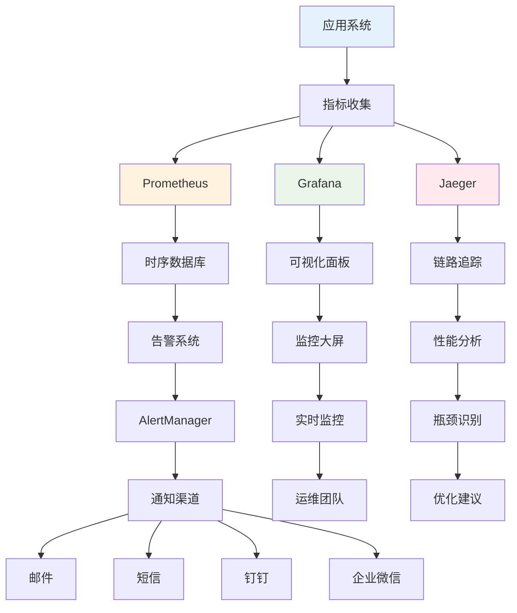

图17-10 性能监控架构图

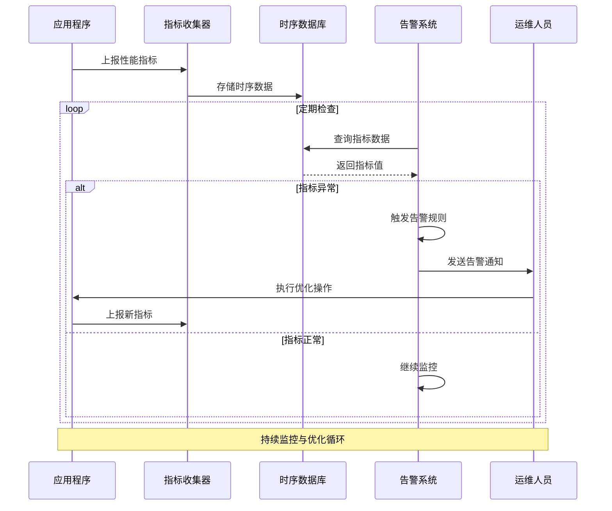

图17-11 性能分析流程图

### 17.8.1 性能指标收集

```go
package monitoring

import (
    "context"
    "sync"
    "time"
    
    "github.com/prometheus/client_golang/prometheus"
    "github.com/prometheus/client_golang/prometheus/promauto"
)

// Prometheus指标
var (
    requestDuration = promauto.NewHistogramVec(
        prometheus.HistogramOpts{
            Name: "http_request_duration_seconds",
            Help: "HTTP request duration in seconds",
            Buckets: prometheus.DefBuckets,
        },
        []string{"method", "endpoint", "status"},
    )
    
    requestCount = promauto.NewCounterVec(
        prometheus.CounterOpts{
            Name: "http_requests_total",
            Help: "Total number of HTTP requests",
        },
        []string{"method", "endpoint", "status"},
    )
    
    activeConnections = promauto.NewGauge(
        prometheus.GaugeOpts{
            Name: "active_connections",
            Help: "Number of active connections",
        },
    )
    
    memoryUsage = promauto.NewGaugeVec(
        prometheus.GaugeOpts{
            Name: "memory_usage_bytes",
            Help: "Memory usage in bytes",
        },
        []string{"type"},
    )
)

// 性能监控中间件
func PrometheusMiddleware() gin.HandlerFunc {
    return func(c *gin.Context) {
        start := time.Now()
        
        c.Next()
        
        duration := time.Since(start).Seconds()
        status := fmt.Sprintf("%d", c.Writer.Status())
        
        requestDuration.WithLabelValues(
            c.Request.Method,
            c.FullPath(),
            status,
        ).Observe(duration)
        
        requestCount.WithLabelValues(
            c.Request.Method,
            c.FullPath(),
            status,
        ).Inc()
    }
}

// 自定义性能监控器
type PerformanceCollector struct {
    metrics map[string]*Metric
    mu      sync.RWMutex
}

type Metric struct {
    Name      string
    Value     float64
    Timestamp time.Time
    Labels    map[string]string
}

func NewPerformanceCollector() *PerformanceCollector {
    collector := &PerformanceCollector{
        metrics: make(map[string]*Metric),
    }
    
    // 启动系统指标收集
    go collector.collectSystemMetrics()
    
    return collector
}

func (pc *PerformanceCollector) RecordMetric(name string, value float64, labels map[string]string) {
    pc.mu.Lock()
    defer pc.mu.Unlock()
    
    pc.metrics[name] = &Metric{
        Name:      name,
        Value:     value,
        Timestamp: time.Now(),
        Labels:    labels,
    }
}

func (pc *PerformanceCollector) GetMetrics() map[string]*Metric {
    pc.mu.RLock()
    defer pc.mu.RUnlock()
    
    result := make(map[string]*Metric)
    for k, v := range pc.metrics {
        result[k] = v
    }
    
    return result
}

func (pc *PerformanceCollector) collectSystemMetrics() {
    ticker := time.NewTicker(10 * time.Second)
    defer ticker.Stop()
    
    for range ticker.C {
        var m runtime.MemStats
        runtime.ReadMemStats(&m)
        
        pc.RecordMetric("heap_alloc", float64(m.HeapAlloc), nil)
        pc.RecordMetric("heap_sys", float64(m.HeapSys), nil)
        pc.RecordMetric("goroutines", float64(runtime.NumGoroutine()), nil)
        pc.RecordMetric("gc_runs", float64(m.NumGC), nil)
        
        // 更新Prometheus指标
        memoryUsage.WithLabelValues("heap_alloc").Set(float64(m.HeapAlloc))
        memoryUsage.WithLabelValues("heap_sys").Set(float64(m.HeapSys))
    }
}
```

### 17.8.2 性能分析工具集成

```go
package profiling

import (
    "context"
    "fmt"
    "net/http"
    _ "net/http/pprof"
    "os"
    "runtime"
    "runtime/pprof"
    "time"
)

// 性能分析管理器
type ProfileManager struct {
    enabled bool
    port    string
}

func NewProfileManager(enabled bool, port string) *ProfileManager {
    return &ProfileManager{
        enabled: enabled,
        port:    port,
    }
}

func (pm *ProfileManager) Start() error {
    if !pm.enabled {
        return nil
    }
    
    // 启动pprof HTTP服务器
    go func() {
        log.Printf("Starting pprof server on :%s", pm.port)
        if err := http.ListenAndServe(":"+pm.port, nil); err != nil {
            log.Printf("pprof server error: %v", err)
        }
    }()
    
    return nil
}

// CPU性能分析
func (pm *ProfileManager) StartCPUProfile(filename string, duration time.Duration) error {
    f, err := os.Create(filename)
    if err != nil {
        return err
    }
    
    if err := pprof.StartCPUProfile(f); err != nil {
        f.Close()
        return err
    }
    
    // 定时停止
    time.AfterFunc(duration, func() {
        pprof.StopCPUProfile()
        f.Close()
        fmt.Printf("CPU profile saved to %s\n", filename)
    })
    
    return nil
}

// 内存性能分析
func (pm *ProfileManager) WriteMemProfile(filename string) error {
    f, err := os.Create(filename)
    if err != nil {
        return err
    }
    defer f.Close()
    
    runtime.GC() // 强制GC
    
    if err := pprof.WriteHeapProfile(f); err != nil {
        return err
    }
    
    fmt.Printf("Memory profile saved to %s\n", filename)
    return nil
}

// Goroutine分析
func (pm *ProfileManager) WriteGoroutineProfile(filename string) error {
    f, err := os.Create(filename)
    if err != nil {
        return err
    }
    defer f.Close()
    
    if err := pprof.Lookup("goroutine").WriteTo(f, 0); err != nil {
        return err
    }
    
    fmt.Printf("Goroutine profile saved to %s\n", filename)
    return nil
}

// 自动性能分析
type AutoProfiler struct {
    manager   *ProfileManager
    interval  time.Duration
    threshold struct {
        memoryMB    int64
        goroutines  int
        cpuPercent  float64
    }
}

func NewAutoProfiler(manager *ProfileManager, interval time.Duration) *AutoProfiler {
    ap := &AutoProfiler{
        manager:  manager,
        interval: interval,
    }
    
    // 设置默认阈值
    ap.threshold.memoryMB = 500    // 500MB
    ap.threshold.goroutines = 1000 // 1000个goroutine
    ap.threshold.cpuPercent = 80.0 // 80% CPU使用率
    
    return ap
}

func (ap *AutoProfiler) Start(ctx context.Context) {
    ticker := time.NewTicker(ap.interval)
    defer ticker.Stop()
    
    for {
        select {
        case <-ctx.Done():
            return
        case <-ticker.C:
            ap.checkAndProfile()
        }
    }
}

func (ap *AutoProfiler) checkAndProfile() {
    var m runtime.MemStats
    runtime.ReadMemStats(&m)
    
    memoryMB := int64(m.HeapAlloc / 1024 / 1024)
    goroutines := runtime.NumGoroutine()
    
    timestamp := time.Now().Format("20060102_150405")
    
    // 检查内存使用
    if memoryMB > ap.threshold.memoryMB {
        filename := fmt.Sprintf("mem_profile_%s.prof", timestamp)
        if err := ap.manager.WriteMemProfile(filename); err != nil {
            log.Printf("Failed to write memory profile: %v", err)
        }
    }
    
    // 检查goroutine数量
    if goroutines > ap.threshold.goroutines {
        filename := fmt.Sprintf("goroutine_profile_%s.prof", timestamp)
        if err := ap.manager.WriteGoroutineProfile(filename); err != nil {
            log.Printf("Failed to write goroutine profile: %v", err)
        }
    }
}
```

## 本章小结

本章深入探讨了Go语言企业级应用的性能优化与调优技术，涵盖了从基础性能分析到高级优化策略的完整体系。

### 主要内容回顾

1. **性能分析基础**
   - pprof工具的使用方法
   - 基准测试的编写和分析
   - 性能瓶颈的识别技巧

2. **内存优化**
   - 垃圾回收机制的理解和调优
   - 对象池模式的应用
   - 内存泄漏的预防和检测

3. **并发优化**
   - Goroutine池的设计和实现
   - 并发控制的最佳实践
   - 锁竞争的优化策略

4. **数据库优化**
   - 连接池的配置和管理
   - SQL查询的优化技巧
   - 数据库事务的性能考虑

5. **缓存优化**
   - 多级缓存架构设计
   - 缓存策略的选择和实现
   - 缓存一致性的保证

6. **HTTP性能优化**
   - 连接池和Keep-Alive配置
   - GZIP压缩和HTTP/2优化
   - 请求限流和响应缓存

7. **系统级优化**
   - 操作系统参数调优
   - 容器资源限制配置
   - Go运行时参数优化

8. **性能监控**
   - Prometheus指标收集
   - 自定义性能监控器
   - 自动性能分析工具

### 关键技术要点

- **全面的性能分析**：使用多种工具和方法进行性能分析
- **系统性优化**：从应用层到系统层的全方位优化
- **持续监控**：建立完善的性能监控和告警机制
- **自动化调优**：实现智能的性能参数自动调整

### 最佳实践建议

1. **性能优化原则**
   - 先测量，后优化
   - 关注关键路径
   - 平衡性能和可维护性

2. **监控策略**
   - 建立基线指标
   - 设置合理的告警阈值
   - 定期进行性能回归测试

3. **优化流程**
   - 识别瓶颈 → 制定方案 → 实施优化 → 验证效果
   - 建立性能优化的标准流程
   - 记录优化历史和效果

通过本章的学习，读者应该能够：
- 熟练使用各种性能分析工具
- 设计和实现高性能的Go应用
- 建立完善的性能监控体系
- 制定有效的性能优化策略

## 练习题

### 基础练习

1. **性能分析实践**
   - 为一个简单的HTTP服务编写基准测试
   - 使用pprof分析内存和CPU使用情况
   - 识别并优化性能瓶颈

2. **内存优化**
   - 实现一个通用的对象池
   - 对比使用对象池前后的内存分配情况
   - 分析GC的影响

3. **并发优化**
   - 实现一个可配置的Goroutine池
   - 测试不同并发度下的性能表现
   - 优化锁的使用

### 进阶练习

4. **缓存系统设计**
   - 设计一个多级缓存系统
   - 实现LRU、LFU等缓存淘汰策略
   - 测试缓存命中率和性能提升

5. **HTTP性能优化**
   - 实现GZIP压缩中间件
   - 配置HTTP/2服务器
   - 实现请求限流和熔断机制

6. **监控系统集成**
   - 集成Prometheus监控
   - 实现自定义指标收集
   - 配置Grafana仪表板

### 综合项目

7. **性能优化项目**
   - 选择一个现有的Go项目
   - 进行全面的性能分析
   - 制定和实施优化方案
   - 建立性能监控体系
   - 编写优化报告

## 扩展阅读

### 官方文档
- [Go Performance](https://golang.org/doc/diagnostics.html)
- [pprof Documentation](https://golang.org/pkg/runtime/pprof/)
- [Go Memory Model](https://golang.org/ref/mem)

### 推荐书籍
- 《Go语言高级编程》- 柴树杉、曹春晖著，人民邮电出版社，ISBN: 978-7-115-49491-9
- 《Go语言实战》- William Kennedy等著，人民邮电出版社，ISBN: 978-7-115-42247-7
- 《Systems Performance》- Brendan Gregg著，Addison-Wesley Professional，ISBN: 978-0133390094

### 在线资源
- [Go Blog - Profiling Go Programs](https://blog.golang.org/pprof)
- [Effective Go](https://golang.org/doc/effective_go.html)
- [Go Performance Tips](https://github.com/golang/go/wiki/Performance)

### 工具和库
- [Prometheus](https://prometheus.io/)
- [Grafana](https://grafana.com/)
- [Jaeger](https://www.jaegertracing.io/)
- [go-torch](https://github.com/uber/go-torch)
