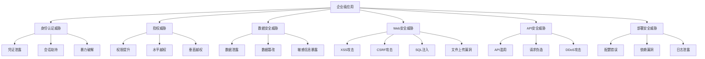
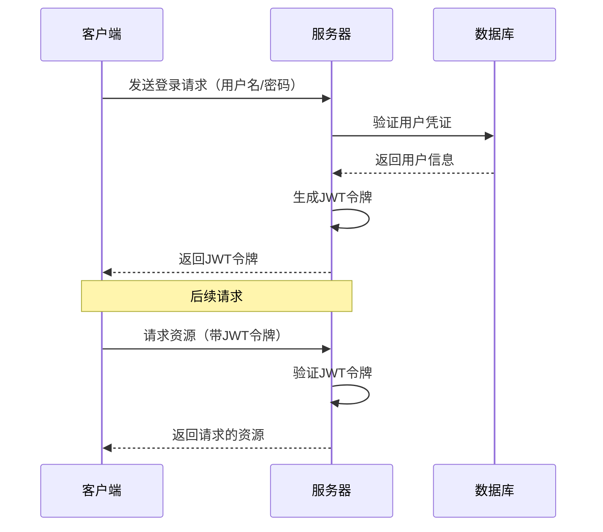
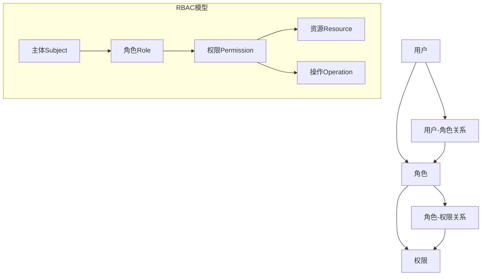
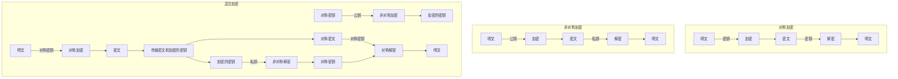
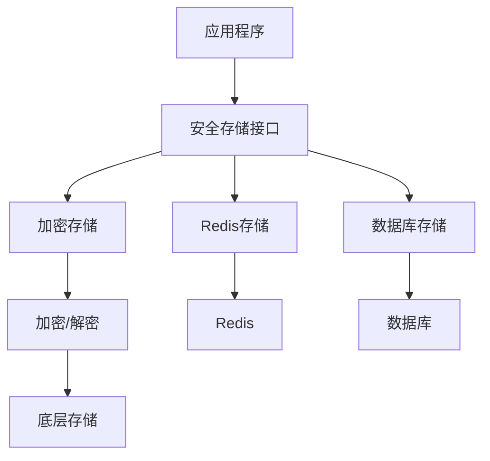
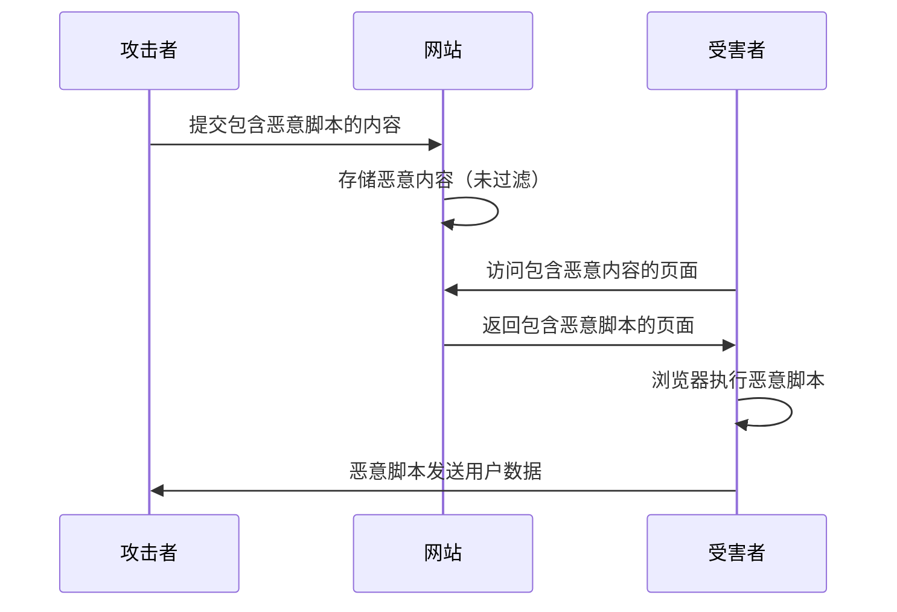
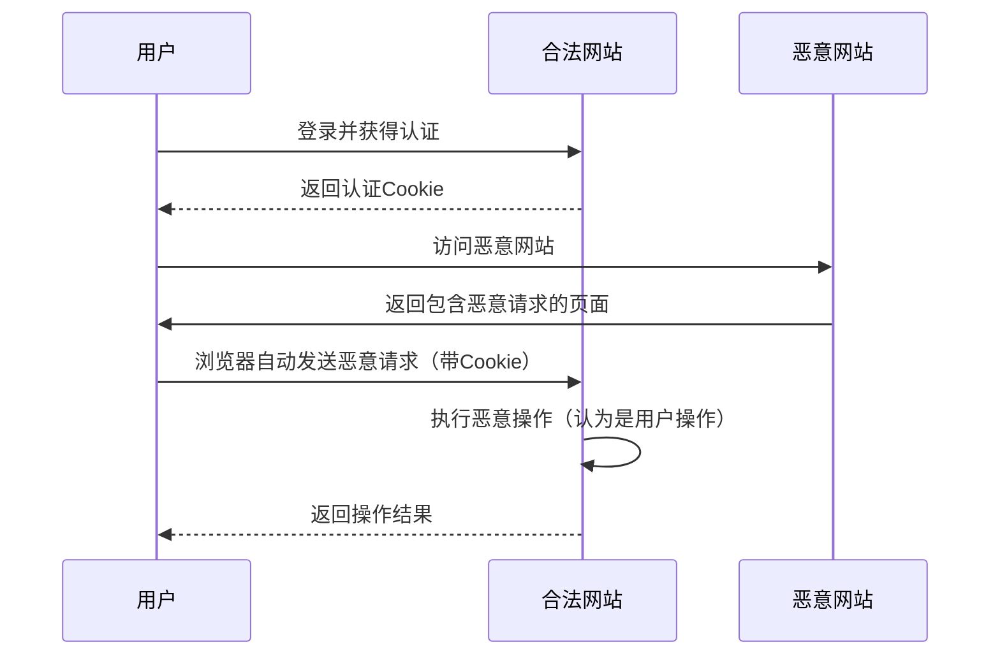
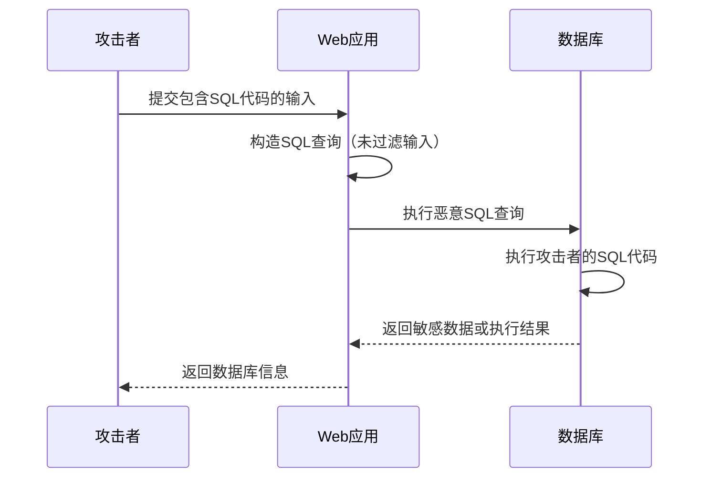
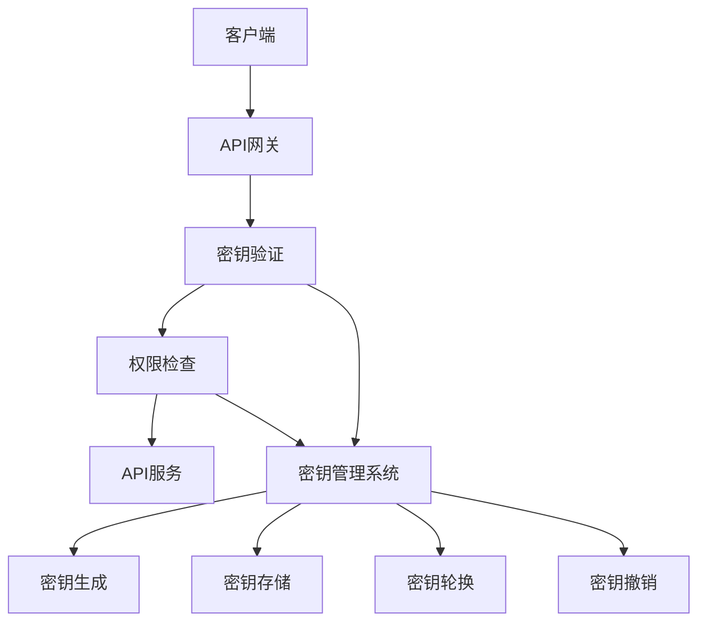

# 第18章 安全最佳实践

## 实战要点

- 掌握JWT认证机制的实现原理和最佳实践
- 理解RBAC权限控制系统的设计与实现
- 掌握数据加密与安全存储的关键技术
- 学习Web安全防护的核心策略和实现方法
- 掌握API安全设计的关键技术和最佳实践
- 了解安全配置与部署的最佳实践

## 安全检查清单

- [ ] 实现了基于JWT的身份认证系统
- [ ] 设计并实现了RBAC权限控制系统
- [ ] 实现了数据加密与安全存储机制
- [ ] 部署了XSS、CSRF和SQL注入防护措施
- [ ] 实现了API密钥管理和请求签名验证
- [ ] 配置了API限流机制
- [ ] 实施了安全配置管理和安全中间件

## 交叉引用

- 第8章：用户认证与授权系统
- 第10章：渠道管理与负载均衡
- 第12章：缓存系统与性能优化
- 第15章：项目总结与展望

## 18.1 本章概述

在企业级应用开发中，安全性是一个不可忽视的关键因素。随着网络攻击手段的不断演进，应用程序面临的安全威胁也日益复杂。本章将深入探讨Go语言企业级应用的安全最佳实践，从身份认证与授权、数据加密与安全存储、Web安全防护、API安全到安全配置与部署，全方位提升应用程序的安全性。

### 18.1.1 本章目标

- 掌握企业级应用的安全架构设计原则
- 学习身份认证与授权的最佳实践
- 掌握数据加密与安全存储的关键技术
- 了解Web安全防护的核心策略
- 学习API安全设计的关键技术
- 掌握安全配置与部署的最佳实践

### 18.1.2 安全威胁模型

在开始实现安全措施之前，我们需要了解应用程序可能面临的主要安全威胁。下图展示了企业级应用常见的安全威胁模型：



图18-1 企业级应用安全威胁模型

针对这些安全威胁，我们需要采取相应的安全措施进行防护。本章将详细介绍这些安全措施的设计与实现。

## 18.2 身份认证与授权

身份认证（Authentication）和授权（Authorization）是应用安全的第一道防线。身份认证确保用户是其声称的身份，而授权则控制用户可以执行的操作。

### 18.2.1 JWT认证实现

**JSON Web Token (JWT)** 是一种开放标准（RFC 7519），它定义了一种紧凑且自包含的方式，用于在各方之间安全地传输信息作为JSON对象。由于此信息是经过数字签名的，因此可以被验证和信任。

以下是JWT认证的工作流程：



图18-2 JWT认证流程

下面是JWT配置和实现的代码：

```go
package auth

import (
    "errors"
    "fmt"
    "time"
    
    "github.com/golang-jwt/jwt/v4"
)

// JWT配置
type JWTConfig struct {
    SecretKey     string
    TokenExpiry   time.Duration
    RefreshExpiry time.Duration
    Issuer        string
}

// JWT声明
type JWTClaims struct {
    UserID   uint   `json:"user_id"`
    Username string `json:"username"`
    Role     string `json:"role"`
    jwt.RegisteredClaims
}

// JWT管理器
type JWTManager struct {
    config JWTConfig
}

// 创建JWT管理器
func NewJWTManager(config JWTConfig) *JWTManager {
    return &JWTManager{config: config}
}

// 生成令牌
func (jm *JWTManager) GenerateToken(userID uint, username, role string) (string, error) {
    claims := JWTClaims{
        UserID:   userID,
        Username: username,
        Role:     role,
        RegisteredClaims: jwt.RegisteredClaims{
            ExpiresAt: jwt.NewNumericDate(time.Now().Add(jm.config.TokenExpiry)),
            IssuedAt:  jwt.NewNumericDate(time.Now()),
            NotBefore: jwt.NewNumericDate(time.Now()),
            Issuer:    jm.config.Issuer,
        },
    }
    
    token := jwt.NewWithClaims(jwt.SigningMethodHS256, claims)
    return token.SignedString([]byte(jm.config.SecretKey))
}

// 生成刷新令牌
func (jm *JWTManager) GenerateRefreshToken(userID uint) (string, error) {
    claims := jwt.RegisteredClaims{
        ExpiresAt: jwt.NewNumericDate(time.Now().Add(jm.config.RefreshExpiry)),
        IssuedAt:  jwt.NewNumericDate(time.Now()),
        NotBefore: jwt.NewNumericDate(time.Now()),
        Issuer:    jm.config.Issuer,
        Subject:   fmt.Sprintf("%d", userID),
    }
    
    token := jwt.NewWithClaims(jwt.SigningMethodHS256, claims)
    return token.SignedString([]byte(jm.config.SecretKey))
}

// 验证令牌
func (jm *JWTManager) ValidateToken(tokenString string) (*JWTClaims, error) {
    token, err := jwt.ParseWithClaims(tokenString, &JWTClaims{}, func(token *jwt.Token) (interface{}, error) {
        if _, ok := token.Method.(*jwt.SigningMethodHMAC); !ok {
            return nil, errors.New("unexpected signing method")
        }
        return []byte(jm.config.SecretKey), nil
    })
    
    if err != nil {
        return nil, err
    }
    
    if claims, ok := token.Claims.(*JWTClaims); ok && token.Valid {
        return claims, nil
    }
    
    return nil, errors.New("invalid token")
}
```

### 18.2.2 RBAC权限控制

**基于角色的访问控制（Role-Based Access Control，RBAC）** 是一种广泛使用的访问控制模型，它通过角色来管理用户权限。RBAC模型包含用户（User）、角色（Role）、权限（Permission）三个核心概念。



图18-3 RBAC权限控制模型

以下是RBAC权限控制的实现：

```go
package rbac

import (
    "errors"
    "strings"
)

// 权限接口
type Permission interface {
    GetResource() string
    GetAction() string
    String() string
}

// 角色接口
type Role interface {
    GetName() string
    GetPermissions() []Permission
    HasPermission(permission Permission) bool
}

// 主体接口
type Subject interface {
    GetID() string
    GetRoles() []Role
    HasRole(roleName string) bool
    HasPermission(permission Permission) bool
}

// 基础权限实现
type BasicPermission struct {
    Resource string
    Action   string
}

func (p *BasicPermission) GetResource() string {
    return p.Resource
}

func (p *BasicPermission) GetAction() string {
    return p.Action
}

func (p *BasicPermission) String() string {
    return p.Resource + ":" + p.Action
}

// 基础角色实现
type BasicRole struct {
    Name        string
    Permissions []Permission
}

func (r *BasicRole) GetName() string {
    return r.Name
}

func (r *BasicRole) GetPermissions() []Permission {
    return r.Permissions
}

func (r *BasicRole) HasPermission(permission Permission) bool {
    for _, p := range r.Permissions {
        if p.GetResource() == permission.GetResource() && p.GetAction() == permission.GetAction() {
            return true
        }
    }
    return false
}

// 基础主体实现
type BasicSubject struct {
    ID    string
    Roles []Role
}

func (s *BasicSubject) GetID() string {
    return s.ID
}

func (s *BasicSubject) GetRoles() []Role {
    return s.Roles
}

func (s *BasicSubject) HasRole(roleName string) bool {
    for _, role := range s.Roles {
        if role.GetName() == roleName {
            return true
        }
    }
    return false
}

func (s *BasicSubject) HasPermission(permission Permission) bool {
    for _, role := range s.Roles {
        if role.HasPermission(permission) {
            return true
        }
    }
    return false
}

// RBAC管理器
type RBACManager struct {
    subjects map[string]Subject
    roles    map[string]Role
}

func NewRBACManager() *RBACManager {
    return &RBACManager{
        subjects: make(map[string]Subject),
        roles:    make(map[string]Role),
    }
}

func (rm *RBACManager) AddSubject(subject Subject) {
    rm.subjects[subject.GetID()] = subject
}

func (rm *RBACManager) AddRole(role Role) {
    rm.roles[role.GetName()] = role
}

func (rm *RBACManager) GetSubject(id string) (Subject, error) {
    subject, exists := rm.subjects[id]
    if !exists {
        return nil, errors.New("subject not found")
    }
    return subject, nil
}

func (rm *RBACManager) CheckPermission(subjectID string, permission Permission) (bool, error) {
    subject, err := rm.GetSubject(subjectID)
    if err != nil {
        return false, err
    }
    return subject.HasPermission(permission), nil
}
```

权限中间件实现：

```go
package middleware

import (
    "net/http"
    "strings"
    
    "github.com/gin-gonic/gin"
    "your-project/rbac"
)

// 权限中间件
type PermissionMiddleware struct {
    rbacManager *rbac.RBACManager
}

func NewPermissionMiddleware(rbacManager *rbac.RBACManager) *PermissionMiddleware {
    return &PermissionMiddleware{
        rbacManager: rbacManager,
    }
}

// 要求特定权限
func (pm *PermissionMiddleware) RequirePermission(resource, action string) gin.HandlerFunc {
    return func(c *gin.Context) {
        userID := c.GetString("user_id")
        if userID == "" {
            c.JSON(http.StatusUnauthorized, gin.H{"error": "未认证"})
            c.Abort()
            return
        }
        
        permission := &rbac.BasicPermission{
            Resource: resource,
            Action:   action,
        }
        
        hasPermission, err := pm.rbacManager.CheckPermission(userID, permission)
        if err != nil {
            c.JSON(http.StatusInternalServerError, gin.H{"error": "权限检查失败"})
            c.Abort()
            return
        }
        
        if !hasPermission {
            c.JSON(http.StatusForbidden, gin.H{"error": "权限不足"})
            c.Abort()
            return
        }
        
        c.Next()
    }
}

// 要求特定角色
func (pm *PermissionMiddleware) RequireRole(roleName string) gin.HandlerFunc {
    return func(c *gin.Context) {
        userID := c.GetString("user_id")
        if userID == "" {
            c.JSON(http.StatusUnauthorized, gin.H{"error": "未认证"})
            c.Abort()
            return
        }
        
        subject, err := pm.rbacManager.GetSubject(userID)
        if err != nil {
            c.JSON(http.StatusInternalServerError, gin.H{"error": "用户信息获取失败"})
            c.Abort()
            return
        }
        
        if !subject.HasRole(roleName) {
            c.JSON(http.StatusForbidden, gin.H{"error": "角色权限不足"})
            c.Abort()
            return
        }
        
        c.Next()
    }
}

// 要求资源权限
func (pm *PermissionMiddleware) RequireResourcePermission(action string) gin.HandlerFunc {
    return func(c *gin.Context) {
        userID := c.GetString("user_id")
        if userID == "" {
            c.JSON(http.StatusUnauthorized, gin.H{"error": "未认证"})
            c.Abort()
            return
        }
        
        // 从路径中提取资源名称
        resource := extractResourceFromPath(c.Request.URL.Path)
        
        permission := &rbac.BasicPermission{
            Resource: resource,
            Action:   action,
        }
        
        hasPermission, err := pm.rbacManager.CheckPermission(userID, permission)
        if err != nil {
            c.JSON(http.StatusInternalServerError, gin.H{"error": "权限检查失败"})
            c.Abort()
            return
        }
        
        if !hasPermission {
            c.JSON(http.StatusForbidden, gin.H{"error": "资源访问权限不足"})
            c.Abort()
            return
        }
        
        c.Next()
    }
}

func extractResourceFromPath(path string) string {
    parts := strings.Split(strings.Trim(path, "/"), "/")
    if len(parts) > 0 {
        return parts[0]
    }
    return "default"
}
```

## 18.3 数据加密与安全存储

数据加密是保护敏感信息的重要手段。根据加密方式的不同，可以分为对称加密和非对称加密。在实际应用中，通常采用混合加密的方式来平衡安全性和性能。

### 18.3.1 加密算法实现

下图展示了不同加密方式的工作流程：



图18-4 加密方式比较

以下是AES对称加密的实现：

```go
package encryption

import (
    "crypto/aes"
    "crypto/cipher"
    "crypto/rand"
    "encoding/base64"
    "errors"
    "io"
)

// AES加密器
type AESEncryptor struct {
    key []byte
}

// 创建AES加密器
func NewAESEncryptor(key []byte) (*AESEncryptor, error) {
    if len(key) != 16 && len(key) != 24 && len(key) != 32 {
        return nil, errors.New("key size must be 16, 24, or 32 bytes")
    }
    return &AESEncryptor{key: key}, nil
}

// 加密
func (e *AESEncryptor) Encrypt(plaintext []byte) ([]byte, error) {
    block, err := aes.NewCipher(e.key)
    if err != nil {
        return nil, err
    }
    
    // GCM模式提供认证加密
    gcm, err := cipher.NewGCM(block)
    if err != nil {
        return nil, err
    }
    
    // 生成随机nonce
    nonce := make([]byte, gcm.NonceSize())
    if _, err := io.ReadFull(rand.Reader, nonce); err != nil {
        return nil, err
    }
    
    // 加密并添加认证标签
    ciphertext := gcm.Seal(nonce, nonce, plaintext, nil)
    return ciphertext, nil
}

// 解密
func (e *AESEncryptor) Decrypt(ciphertext []byte) ([]byte, error) {
    block, err := aes.NewCipher(e.key)
    if err != nil {
        return nil, err
    }
    
    gcm, err := cipher.NewGCM(block)
    if err != nil {
        return nil, err
    }
    
    if len(ciphertext) < gcm.NonceSize() {
        return nil, errors.New("ciphertext too short")
    }
    
    nonce, ciphertext := ciphertext[:gcm.NonceSize()], ciphertext[gcm.NonceSize():]
    return gcm.Open(nil, nonce, ciphertext, nil)
}

// 加密字符串
func (e *AESEncryptor) EncryptString(plaintext string) (string, error) {
    ciphertext, err := e.Encrypt([]byte(plaintext))
    if err != nil {
        return "", err
    }
    return base64.StdEncoding.EncodeToString(ciphertext), nil
}

// 解密字符串
func (e *AESEncryptor) DecryptString(ciphertext string) (string, error) {
    data, err := base64.StdEncoding.DecodeString(ciphertext)
    if err != nil {
        return "", err
    }
    
    plaintext, err := e.Decrypt(data)
    if err != nil {
        return "", err
    }
    
    return string(plaintext), nil
}
```

### 18.3.2 安全存储实现

安全存储是保护敏感数据的关键组件，它确保数据在存储过程中的安全性。下图展示了安全存储的架构：



图18-5 安全存储系统架构

以下是安全存储的实现：

```go
package storage

import (
    "context"
    "database/sql"
    "encoding/json"
    "errors"
    "time"
    
    "github.com/go-redis/redis/v8"
    "your-project/encryption"
)

// 安全存储接口
type SecureStorage interface {
    Store(ctx context.Context, key string, value interface{}, expiry time.Duration) error
    Retrieve(ctx context.Context, key string, dest interface{}) error
    Delete(ctx context.Context, key string) error
    Exists(ctx context.Context, key string) (bool, error)
}

// 加密存储实现
type EncryptedStorage struct {
    storage   SecureStorage
    encryptor *encryption.AESEncryptor
}

func NewEncryptedStorage(storage SecureStorage, encryptor *encryption.AESEncryptor) *EncryptedStorage {
    return &EncryptedStorage{
        storage:   storage,
        encryptor: encryptor,
    }
}

func (es *EncryptedStorage) Store(ctx context.Context, key string, value interface{}, expiry time.Duration) error {
    // 序列化数据
    data, err := json.Marshal(value)
    if err != nil {
        return err
    }
    
    // 加密数据
    encryptedData, err := es.encryptor.EncryptString(string(data))
    if err != nil {
        return err
    }
    
    return es.storage.Store(ctx, key, encryptedData, expiry)
}

func (es *EncryptedStorage) Retrieve(ctx context.Context, key string, dest interface{}) error {
    var encryptedData string
    if err := es.storage.Retrieve(ctx, key, &encryptedData); err != nil {
        return err
    }
    
    // 解密数据
    decryptedData, err := es.encryptor.DecryptString(encryptedData)
    if err != nil {
        return err
    }
    
    return json.Unmarshal([]byte(decryptedData), dest)
}

func (es *EncryptedStorage) Delete(ctx context.Context, key string) error {
    return es.storage.Delete(ctx, key)
}

func (es *EncryptedStorage) Exists(ctx context.Context, key string) (bool, error) {
    return es.storage.Exists(ctx, key)
}

// Redis存储实现
type RedisStorage struct {
    client *redis.Client
}

func NewRedisStorage(client *redis.Client) *RedisStorage {
    return &RedisStorage{client: client}
}

func (rs *RedisStorage) Store(ctx context.Context, key string, value interface{}, expiry time.Duration) error {
    return rs.client.Set(ctx, key, value, expiry).Err()
}

func (rs *RedisStorage) Retrieve(ctx context.Context, key string, dest interface{}) error {
    val, err := rs.client.Get(ctx, key).Result()
    if err != nil {
        return err
    }
    
    switch v := dest.(type) {
    case *string:
        *v = val
    case *[]byte:
        *v = []byte(val)
    default:
        return json.Unmarshal([]byte(val), dest)
    }
    
    return nil
}

func (rs *RedisStorage) Delete(ctx context.Context, key string) error {
    return rs.client.Del(ctx, key).Err()
}

func (rs *RedisStorage) Exists(ctx context.Context, key string) (bool, error) {
    count, err := rs.client.Exists(ctx, key).Result()
    return count > 0, err
}

// 数据库存储实现
type DatabaseStorage struct {
    db *sql.DB
}

func NewDatabaseStorage(db *sql.DB) *DatabaseStorage {
    return &DatabaseStorage{db: db}
}

func (ds *DatabaseStorage) Store(ctx context.Context, key string, value interface{}, expiry time.Duration) error {
    data, err := json.Marshal(value)
    if err != nil {
        return err
    }
    
    expiryTime := time.Now().Add(expiry)
    query := `INSERT INTO secure_storage (key, value, expires_at) VALUES (?, ?, ?) 
              ON DUPLICATE KEY UPDATE value = VALUES(value), expires_at = VALUES(expires_at)`
    
    _, err = ds.db.ExecContext(ctx, query, key, string(data), expiryTime)
    return err
}

func (ds *DatabaseStorage) Retrieve(ctx context.Context, key string, dest interface{}) error {
    var value string
    var expiresAt time.Time
    
    query := `SELECT value, expires_at FROM secure_storage WHERE key = ? AND expires_at > NOW()`
    err := ds.db.QueryRowContext(ctx, query, key).Scan(&value, &expiresAt)
    if err != nil {
        return err
    }
    
    switch v := dest.(type) {
    case *string:
        *v = value
    case *[]byte:
        *v = []byte(value)
    default:
        return json.Unmarshal([]byte(value), dest)
    }
    
    return nil
}

func (ds *DatabaseStorage) Delete(ctx context.Context, key string) error {
    query := `DELETE FROM secure_storage WHERE key = ?`
    _, err := ds.db.ExecContext(ctx, query, key)
    return err
}

func (ds *DatabaseStorage) Exists(ctx context.Context, key string) (bool, error) {
    var count int
    query := `SELECT COUNT(*) FROM secure_storage WHERE key = ? AND expires_at > NOW()`
    err := ds.db.QueryRowContext(ctx, query, key).Scan(&count)
    return count > 0, err
}

// 清理过期数据
func (ds *DatabaseStorage) CleanupExpiredData(ctx context.Context) error {
    query := `DELETE FROM secure_storage WHERE expires_at <= NOW()`
    _, err := ds.db.ExecContext(ctx, query)
    return err
}

// 敏感数据管理器
type SensitiveDataManager struct {
    storage SecureStorage
}

func NewSensitiveDataManager(storage SecureStorage) *SensitiveDataManager {
    return &SensitiveDataManager{storage: storage}
}

func (sdm *SensitiveDataManager) StoreSensitiveData(ctx context.Context, userID string, dataType string, data interface{}, expiry time.Duration) error {
    key := fmt.Sprintf("sensitive:%s:%s", userID, dataType)
    return sdm.storage.Store(ctx, key, data, expiry)
}

func (sdm *SensitiveDataManager) GetSensitiveData(ctx context.Context, userID string, dataType string, dest interface{}) error {
    key := fmt.Sprintf("sensitive:%s:%s", userID, dataType)
    return sdm.storage.Retrieve(ctx, key, dest)
}

func (sdm *SensitiveDataManager) DeleteSensitiveData(ctx context.Context, userID string, dataType string) error {
    key := fmt.Sprintf("sensitive:%s:%s", userID, dataType)
    return sdm.storage.Delete(ctx, key)
}
```

## 18.4 Web安全防护

Web应用面临多种安全威胁，包括XSS（跨站脚本攻击）、CSRF（跨站请求伪造）、SQL注入等。本节将详细介绍这些威胁的防护措施。

### 18.4.1 XSS防护

**跨站脚本攻击（Cross-Site Scripting，XSS）** 是一种代码注入攻击，攻击者通过在网页中注入恶意脚本，使其在用户浏览器中执行，从而窃取用户信息或执行恶意操作。



图6 XSS攻击流程

以下是XSS防护的实现：

```go
package security

import (
    "html/template"
    "net/http"
    "regexp"
    "strings"
    
    "github.com/gin-gonic/gin"
    "github.com/microcosm-cc/bluemonday"
)

// XSS防护器
type XSSProtector struct {
    policy *bluemonday.Policy
}

// 创建XSS防护器
func NewXSSProtector() *XSSProtector {
    // 创建严格的HTML清理策略
    policy := bluemonday.StrictPolicy()
    
    return &XSSProtector{
        policy: policy,
    }
}

// 创建宽松的XSS防护器（允许部分HTML标签）
func NewLenientXSSProtector() *XSSProtector {
    policy := bluemonday.UGCPolicy()
    
    // 允许常用的HTML标签
    policy.AllowElements("p", "br", "strong", "em", "u", "ol", "ul", "li")
    policy.AllowAttrs("href").OnElements("a")
    policy.AllowAttrs("src", "alt").OnElements("img")
    
    return &XSSProtector{
        policy: policy,
    }
}

// 清理HTML内容
func (xp *XSSProtector) SanitizeHTML(input string) string {
    return xp.policy.Sanitize(input)
}

// 转义HTML特殊字符
func (xp *XSSProtector) EscapeHTML(input string) string {
    return template.HTMLEscapeString(input)
}

// 清理JavaScript内容
func (xp *XSSProtector) SanitizeJS(input string) string {
    // 移除潜在的JavaScript代码
    jsPattern := regexp.MustCompile(`(?i)<script[^>]*>.*?</script>`)
    input = jsPattern.ReplaceAllString(input, "")
    
    // 移除事件处理器
    eventPattern := regexp.MustCompile(`(?i)\s*on\w+\s*=\s*["'][^"']*["']`)
    input = eventPattern.ReplaceAllString(input, "")
    
    // 移除javascript:协议
    jsProtocolPattern := regexp.MustCompile(`(?i)javascript:`)
    input = jsProtocolPattern.ReplaceAllString(input, "")
    
    return input
}

// 验证URL安全性
func (xp *XSSProtector) ValidateURL(url string) bool {
    // 检查是否为安全的URL协议
    safeProtocols := []string{"http://", "https://", "//", "/"}
    
    url = strings.ToLower(strings.TrimSpace(url))
    
    for _, protocol := range safeProtocols {
        if strings.HasPrefix(url, protocol) {
            return true
        }
    }
    
    // 检查是否为相对路径
    if !strings.Contains(url, ":") {
        return true
    }
    
    return false
}

// XSS防护中间件
func (xp *XSSProtector) XSSProtectionMiddleware() gin.HandlerFunc {
    return func(c *gin.Context) {
        // 设置XSS防护头
        c.Header("X-XSS-Protection", "1; mode=block")
        c.Header("X-Content-Type-Options", "nosniff")
        c.Header("X-Frame-Options", "DENY")
        
        // 设置CSP头
        csp := "default-src 'self'; script-src 'self' 'unsafe-inline'; style-src 'self' 'unsafe-inline'; img-src 'self' data: https:;"
        c.Header("Content-Security-Policy", csp)
        
        c.Next()
    }
}

// 输入清理中间件
func (xp *XSSProtector) InputSanitizationMiddleware() gin.HandlerFunc {
    return func(c *gin.Context) {
        // 清理查询参数
        for key, values := range c.Request.URL.Query() {
            for i, value := range values {
                values[i] = xp.SanitizeHTML(value)
            }
            c.Request.URL.Query()[key] = values
        }
        
        // 清理表单数据
        if c.Request.Method == "POST" || c.Request.Method == "PUT" {
            c.Request.ParseForm()
            for key, values := range c.Request.PostForm {
                for i, value := range values {
                    values[i] = xp.SanitizeHTML(value)
                }
                c.Request.PostForm[key] = values
            }
        }
        
        c.Next()
    }
}

// 安全模板函数
func (xp *XSSProtector) SafeTemplateFuncs() template.FuncMap {
    return template.FuncMap{
        "safeHTML": func(s string) template.HTML {
            return template.HTML(xp.SanitizeHTML(s))
        },
        "escapeHTML": func(s string) string {
            return xp.EscapeHTML(s)
        },
        "safeURL": func(s string) template.URL {
            if xp.ValidateURL(s) {
                return template.URL(s)
            }
            return template.URL("#")
        },
        "safeJS": func(s string) template.JS {
            return template.JS(xp.SanitizeJS(s))
        },
    }
}
```

### 18.4.2 CSRF防护

**跨站请求伪造（Cross-Site Request Forgery，CSRF）** 是一种攻击方式，攻击者诱导用户在已认证的网站上执行非预期的操作。



图7 CSRF攻击流程

以下是CSRF防护的实现：

```go
package security

import (
    "crypto/rand"
    "crypto/subtle"
    "encoding/base64"
    "errors"
    "net/http"
    "time"
    
    "github.com/gin-gonic/gin"
)

// CSRF防护器
type CSRFProtector struct {
    tokenLength int
    cookieName  string
    headerName  string
    fieldName   string
    maxAge      time.Duration
    secure      bool
    httpOnly    bool
    sameSite    http.SameSite
}

// 创建CSRF防护器
func NewCSRFProtector() *CSRFProtector {
    return &CSRFProtector{
        tokenLength: 32,
        cookieName:  "_csrf_token",
        headerName:  "X-CSRF-Token",
        fieldName:   "_csrf_token",
        maxAge:      24 * time.Hour,
        secure:      true,
        httpOnly:    false, // 需要JavaScript访问
        sameSite:    http.SameSiteStrictMode,
    }
}

// 生成CSRF令牌
func (cp *CSRFProtector) GenerateToken() (string, error) {
    bytes := make([]byte, cp.tokenLength)
    if _, err := rand.Read(bytes); err != nil {
        return "", err
    }
    return base64.URLEncoding.EncodeToString(bytes), nil
}

// 验证CSRF令牌
func (cp *CSRFProtector) ValidateToken(token1, token2 string) bool {
    if token1 == "" || token2 == "" {
        return false
    }
    
    // 使用constant time比较防止时序攻击
    return subtle.ConstantTimeCompare([]byte(token1), []byte(token2)) == 1
}

// 从请求中获取CSRF令牌
func (cp *CSRFProtector) getTokenFromRequest(c *gin.Context) string {
    // 首先尝试从头部获取
    if token := c.GetHeader(cp.headerName); token != "" {
        return token
    }
    
    // 然后尝试从表单字段获取
    if token := c.PostForm(cp.fieldName); token != "" {
        return token
    }
    
    // 最后尝试从查询参数获取
    return c.Query(cp.fieldName)
}

// CSRF防护中间件
func (cp *CSRFProtector) CSRFProtectionMiddleware() gin.HandlerFunc {
    return func(c *gin.Context) {
        // 对于安全的HTTP方法，只需要设置令牌
        if c.Request.Method == "GET" || c.Request.Method == "HEAD" || c.Request.Method == "OPTIONS" {
            cp.setCSRFToken(c)
            c.Next()
            return
        }
        
        // 对于不安全的HTTP方法，需要验证令牌
        cookieToken, err := c.Cookie(cp.cookieName)
        if err != nil {
            c.JSON(http.StatusForbidden, gin.H{"error": "CSRF令牌缺失"})
            c.Abort()
            return
        }
        
        requestToken := cp.getTokenFromRequest(c)
        if !cp.ValidateToken(cookieToken, requestToken) {
            c.JSON(http.StatusForbidden, gin.H{"error": "CSRF令牌无效"})
            c.Abort()
            return
        }
        
        c.Next()
    }
}

// 设置CSRF令牌
func (cp *CSRFProtector) setCSRFToken(c *gin.Context) {
    // 检查是否已经有令牌
    if _, err := c.Cookie(cp.cookieName); err == nil {
        return
    }
    
    // 生成新令牌
    token, err := cp.GenerateToken()
    if err != nil {
        return
    }
    
    // 设置Cookie
    c.SetSameSite(cp.sameSite)
    c.SetCookie(
        cp.cookieName,
        token,
        int(cp.maxAge.Seconds()),
        "/",
        "",
        cp.secure,
        cp.httpOnly,
    )
    
    // 将令牌添加到上下文中，供模板使用
    c.Set("csrf_token", token)
}

// 获取CSRF令牌（用于模板）
func (cp *CSRFProtector) GetToken(c *gin.Context) string {
    if token, exists := c.Get("csrf_token"); exists {
        return token.(string)
    }
    
    if token, err := c.Cookie(cp.cookieName); err == nil {
        return token
    }
    
    return ""
}
```

### 18.4.3 SQL注入防护

**SQL注入** 是一种代码注入技术，攻击者通过在应用程序的输入字段中插入恶意SQL代码，来操作数据库。



图8 SQL注入攻击流程

以下是SQL注入防护的实现：

```go
package security

import (
    "database/sql"
    "fmt"
    "regexp"
    "strings"
)

// SQL注入检测器
type SQLInjectionDetector struct {
    patterns []*regexp.Regexp
}

// 创建SQL注入检测器
func NewSQLInjectionDetector() *SQLInjectionDetector {
    patterns := []*regexp.Regexp{
        regexp.MustCompile(`(?i)(union|select|insert|update|delete|drop|create|alter|exec|execute)`),
        regexp.MustCompile(`(?i)(script|javascript|vbscript|onload|onerror|onclick)`),
        regexp.MustCompile(`(?i)(\||\&|\;|\$|\%|\@|\#|\^|\*|\(|\)|\{|\}|\[|\])`),
        regexp.MustCompile(`(?i)('|(\-\-)|(;)|(\|)|(\*)|(\%))`),
        regexp.MustCompile(`(?i)(0x[0-9a-f]+)`),
    }
    
    return &SQLInjectionDetector{
        patterns: patterns,
    }
}

// 检测SQL注入
func (sid *SQLInjectionDetector) DetectSQLInjection(input string) bool {
    for _, pattern := range sid.patterns {
        if pattern.MatchString(input) {
            return true
        }
    }
    return false
}

// 清理输入
func (sid *SQLInjectionDetector) SanitizeInput(input string) string {
    // 移除危险字符
    input = strings.ReplaceAll(input, "'", "''")
    input = strings.ReplaceAll(input, "\\", "\\\\")
    input = strings.ReplaceAll(input, "\0", "\\0")
    input = strings.ReplaceAll(input, "\n", "\\n")
    input = strings.ReplaceAll(input, "\r", "\\r")
    input = strings.ReplaceAll(input, "\x1a", "\\Z")
    
    return input
}

// 安全的数据库操作包装器
type SafeDB struct {
    db       *sql.DB
    detector *SQLInjectionDetector
}

func NewSafeDB(db *sql.DB) *SafeDB {
    return &SafeDB{
        db:       db,
        detector: NewSQLInjectionDetector(),
    }
}

// 安全查询
func (sdb *SafeDB) SafeQuery(query string, args ...interface{}) (*sql.Rows, error) {
    // 检查查询语句
    if sdb.detector.DetectSQLInjection(query) {
        return nil, fmt.Errorf("potential SQL injection detected in query")
    }
    
    // 检查参数
    for _, arg := range args {
        if str, ok := arg.(string); ok {
            if sdb.detector.DetectSQLInjection(str) {
                return nil, fmt.Errorf("potential SQL injection detected in parameter")
            }
        }
    }
    
    return sdb.db.Query(query, args...)
}

// 安全的WHERE子句构建
func (sdb *SafeDB) SafeWhere(conditions map[string]interface{}) (string, []interface{}) {
    var whereParts []string
    var args []interface{}
    
    for column, value := range conditions {
        // 验证列名（只允许字母、数字、下划线）
        if !regexp.MustCompile(`^[a-zA-Z_][a-zA-Z0-9_]*$`).MatchString(column) {
            continue
        }
        
        whereParts = append(whereParts, fmt.Sprintf("%s = ?", column))
        args = append(args, value)
    }
    
    whereClause := ""
    if len(whereParts) > 0 {
        whereClause = "WHERE " + strings.Join(whereParts, " AND ")
    }
    
    return whereClause, args
}

// 参数化查询构建器
type QueryBuilder struct {
    selectFields []string
    fromTable    string
    whereClause  string
    orderBy      string
    limit        int
    args         []interface{}
}

func NewQueryBuilder() *QueryBuilder {
    return &QueryBuilder{}
}

func (qb *QueryBuilder) Select(fields ...string) *QueryBuilder {
    qb.selectFields = fields
    return qb
}

func (qb *QueryBuilder) From(table string) *QueryBuilder {
    // 验证表名
    if regexp.MustCompile(`^[a-zA-Z_][a-zA-Z0-9_]*$`).MatchString(table) {
        qb.fromTable = table
    }
    return qb
}

func (qb *QueryBuilder) Where(column string, operator string, value interface{}) *QueryBuilder {
    // 验证列名和操作符
    if !regexp.MustCompile(`^[a-zA-Z_][a-zA-Z0-9_]*$`).MatchString(column) {
        return qb
    }
    
    allowedOperators := []string{"=", "!=", ">", "<", ">=", "<=", "LIKE", "IN"}
    operatorValid := false
    for _, op := range allowedOperators {
        if strings.ToUpper(operator) == op {
            operatorValid = true
            break
        }
    }
    
    if !operatorValid {
        return qb
    }
    
    if qb.whereClause != "" {
        qb.whereClause += " AND "
    }
    qb.whereClause += fmt.Sprintf("%s %s ?", column, operator)
    qb.args = append(qb.args, value)
    
    return qb
}

func (qb *QueryBuilder) OrderBy(column string, direction string) *QueryBuilder {
    if regexp.MustCompile(`^[a-zA-Z_][a-zA-Z0-9_]*$`).MatchString(column) {
        direction = strings.ToUpper(direction)
        if direction == "ASC" || direction == "DESC" {
            qb.orderBy = fmt.Sprintf("%s %s", column, direction)
        }
    }
    return qb
}

func (qb *QueryBuilder) Limit(limit int) *QueryBuilder {
    if limit > 0 {
        qb.limit = limit
    }
    return qb
}

func (qb *QueryBuilder) Build() (string, []interface{}) {
    query := "SELECT "
    if len(qb.selectFields) > 0 {
        query += strings.Join(qb.selectFields, ", ")
    } else {
        query += "*"
    }
    
    query += " FROM " + qb.fromTable
    
    if qb.whereClause != "" {
        query += " WHERE " + qb.whereClause
    }
    
    if qb.orderBy != "" {
        query += " ORDER BY " + qb.orderBy
    }
    
    if qb.limit > 0 {
        query += fmt.Sprintf(" LIMIT %d", qb.limit)
    }
    
    return query, qb.args
}

// 使用示例
func ExampleUsage() {
    // 使用查询构建器
    qb := NewQueryBuilder()
    query, args := qb.Select("id", "name", "email").
        From("users").
        Where("status", "=", "active").
        Where("age", ">", 18).
        OrderBy("created_at", "DESC").
        Limit(10).
        Build()
    
    fmt.Printf("Query: %s\n", query)
    fmt.Printf("Args: %v\n", args)
}
```

## 18.5 API安全

API安全是现代应用程序安全的重要组成部分。本节将介绍API密钥管理、请求签名验证和API限流等关键技术。

### 18.5.1 API密钥管理

API密钥是用于识别和认证API调用者的凭证。下图展示了API密钥管理的架构：



图9 API密钥管理架构

以下是API密钥管理的实现：

```go
package api

import (
    "crypto/rand"
    "crypto/sha256"
    "encoding/hex"
    "errors"
    "fmt"
    "net/http"
    "strings"
    "time"
    
    "github.com/gin-gonic/gin"
)

// API密钥模型
type APIKey struct {
    ID          string    `json:"id"`
    Key         string    `json:"key"`
    Secret      string    `json:"secret"`
    Name        string    `json:"name"`
    UserID      string    `json:"user_id"`
    Permissions []string  `json:"permissions"`
    IsActive    bool      `json:"is_active"`
    ExpiresAt   time.Time `json:"expires_at"`
    CreatedAt   time.Time `json:"created_at"`
    LastUsedAt  time.Time `json:"last_used_at"`
 }
 
 // API密钥管理器
 type APIKeyManager struct {
     keys map[string]*APIKey
 }
 
 func NewAPIKeyManager() *APIKeyManager {
     return &APIKeyManager{
         keys: make(map[string]*APIKey),
     }
 }
 
 // 生成API密钥
 func (akm *APIKeyManager) GenerateAPIKey(userID, name string, permissions []string, expiry time.Duration) (*APIKey, error) {
     // 生成密钥ID
     keyID, err := generateRandomString(16)
     if err != nil {
         return nil, err
     }
     
     // 生成API密钥
     key, err := generateRandomString(32)
     if err != nil {
         return nil, err
     }
     
     // 生成密钥密码
     secret, err := generateRandomString(64)
     if err != nil {
         return nil, err
     }
     
     apiKey := &APIKey{
         ID:          keyID,
         Key:         key,
         Secret:      secret,
         Name:        name,
         UserID:      userID,
         Permissions: permissions,
         IsActive:    true,
         ExpiresAt:   time.Now().Add(expiry),
         CreatedAt:   time.Now(),
         LastUsedAt:  time.Time{},
     }
     
     akm.keys[key] = apiKey
     return apiKey, nil
 }
 
 // 验证API密钥
 func (akm *APIKeyManager) ValidateAPIKey(key string) (*APIKey, error) {
     apiKey, exists := akm.keys[key]
     if !exists {
         return nil, errors.New("invalid API key")
     }
     
     if !apiKey.IsActive {
         return nil, errors.New("API key is inactive")
     }
     
     if time.Now().After(apiKey.ExpiresAt) {
         return nil, errors.New("API key has expired")
     }
     
     // 更新最后使用时间
     apiKey.LastUsedAt = time.Now()
     
     return apiKey, nil
 }
 
 // 撤销API密钥
 func (akm *APIKeyManager) RevokeAPIKey(key string) error {
     apiKey, exists := akm.keys[key]
     if !exists {
         return errors.New("API key not found")
     }
     
     apiKey.IsActive = false
     return nil
 }
 
 // 检查权限
 func (akm *APIKeyManager) CheckPermission(key, permission string) (bool, error) {
     apiKey, err := akm.ValidateAPIKey(key)
     if err != nil {
         return false, err
     }
     
     for _, p := range apiKey.Permissions {
         if p == permission || p == "*" {
             return true, nil
         }
     }
     
     return false, nil
 }
 
 // 生成随机字符串
 func generateRandomString(length int) (string, error) {
     bytes := make([]byte, length)
     if _, err := rand.Read(bytes); err != nil {
         return "", err
     }
     return hex.EncodeToString(bytes)[:length], nil
 }
 
 // API密钥认证中间件
 func (akm *APIKeyManager) APIKeyAuthMiddleware() gin.HandlerFunc {
     return func(c *gin.Context) {
         // 从头部获取API密钥
         apiKey := c.GetHeader("X-API-Key")
         if apiKey == "" {
             // 尝试从查询参数获取
             apiKey = c.Query("api_key")
         }
         
         if apiKey == "" {
             c.JSON(http.StatusUnauthorized, gin.H{"error": "API密钥缺失"})
             c.Abort()
             return
         }
         
         // 验证API密钥
         keyInfo, err := akm.ValidateAPIKey(apiKey)
         if err != nil {
             c.JSON(http.StatusUnauthorized, gin.H{"error": "无效的API密钥"})
             c.Abort()
             return
         }
         
         // 将密钥信息添加到上下文
         c.Set("api_key", keyInfo)
         c.Set("user_id", keyInfo.UserID)
         
         c.Next()
     }
 }
 
 // 权限检查中间件
 func (akm *APIKeyManager) RequirePermission(permission string) gin.HandlerFunc {
     return func(c *gin.Context) {
         keyInfo, exists := c.Get("api_key")
         if !exists {
             c.JSON(http.StatusUnauthorized, gin.H{"error": "未认证"})
             c.Abort()
             return
         }
         
         apiKey := keyInfo.(*APIKey)
         hasPermission, err := akm.CheckPermission(apiKey.Key, permission)
         if err != nil {
             c.JSON(http.StatusInternalServerError, gin.H{"error": "权限检查失败"})
             c.Abort()
             return
         }
         
         if !hasPermission {
             c.JSON(http.StatusForbidden, gin.H{"error": "权限不足"})
             c.Abort()
             return
         }
         
         c.Next()
     }
 }
 ```
 ### 18.5.2 请求签名验证
 
 请求签名验证是确保API请求完整性和真实性的重要机制。下图展示了请求签名的工作流程：
 
 ```mermaid
 sequenceDiagram
     participant 客户端
     participant API服务器
     
     客户端->>客户端: 构造请求参数
     客户端->>客户端: 生成时间戳和随机数
     客户端->>客户端: 计算请求签名
     客户端->>API服务器: 发送带签名的请求
     API服务器->>API服务器: 验证时间戳
     API服务器->>API服务器: 重新计算签名
     API服务器->>API服务器: 比较签名
     API服务器-->>客户端: 返回响应
 ```
 
 图10 请求签名验证流程
 
 以下是请求签名验证的实现：
 
 ```go
 package api
 
 import (
     "crypto/hmac"
     "crypto/sha256"
     "encoding/hex"
     "fmt"
     "net/http"
     "net/url"
     "sort"
     "strconv"
     "strings"
     "time"
     
     "github.com/gin-gonic/gin"
 )
 
 // 签名验证器
 type SignatureValidator struct {
     keyManager *APIKeyManager
     tolerance  time.Duration
 }
 
 func NewSignatureValidator(keyManager *APIKeyManager) *SignatureValidator {
     return &SignatureValidator{
         keyManager: keyManager,
         tolerance:  5 * time.Minute, // 允许5分钟的时间偏差
     }
 }
 
 // 生成签名
 func (sv *SignatureValidator) GenerateSignature(method, path string, params map[string]string, secret string, timestamp int64) string {
     // 构造签名字符串
     signString := sv.buildSignString(method, path, params, timestamp)
     
     // 使用HMAC-SHA256计算签名
     h := hmac.New(sha256.New, []byte(secret))
     h.Write([]byte(signString))
     return hex.EncodeToString(h.Sum(nil))
 }
 
 // 构造签名字符串
 func (sv *SignatureValidator) buildSignString(method, path string, params map[string]string, timestamp int64) string {
     var parts []string
     
     // 添加HTTP方法
     parts = append(parts, strings.ToUpper(method))
     
     // 添加路径
     parts = append(parts, path)
     
     // 添加时间戳
     parts = append(parts, strconv.FormatInt(timestamp, 10))
     
     // 对参数进行排序
     var keys []string
     for k := range params {
         keys = append(keys, k)
     }
     sort.Strings(keys)
     
     // 构造参数字符串
     var paramParts []string
     for _, k := range keys {
         paramParts = append(paramParts, fmt.Sprintf("%s=%s", k, url.QueryEscape(params[k])))
     }
     
     if len(paramParts) > 0 {
         parts = append(parts, strings.Join(paramParts, "&"))
     }
     
     return strings.Join(parts, "\n")
 }
 
 // 验证签名
 func (sv *SignatureValidator) ValidateSignature(c *gin.Context) error {
     // 获取签名相关头部
     apiKey := c.GetHeader("X-API-Key")
     signature := c.GetHeader("X-Signature")
     timestampStr := c.GetHeader("X-Timestamp")
     nonce := c.GetHeader("X-Nonce")
     
     if apiKey == "" || signature == "" || timestampStr == "" || nonce == "" {
         return errors.New("missing required signature headers")
     }
     
     // 解析时间戳
     timestamp, err := strconv.ParseInt(timestampStr, 10, 64)
     if err != nil {
         return errors.New("invalid timestamp")
     }
     
     // 验证时间戳
     now := time.Now().Unix()
     if abs(now-timestamp) > int64(sv.tolerance.Seconds()) {
         return errors.New("request timestamp is too old or too new")
     }
     
     // 获取API密钥信息
     keyInfo, err := sv.keyManager.ValidateAPIKey(apiKey)
     if err != nil {
         return err
     }
     
     // 构造参数映射
     params := make(map[string]string)
     
     // 添加查询参数
     for k, v := range c.Request.URL.Query() {
         if len(v) > 0 {
             params[k] = v[0]
         }
     }
     
     // 添加表单参数（如果是POST请求）
     if c.Request.Method == "POST" {
         c.Request.ParseForm()
         for k, v := range c.Request.PostForm {
             if len(v) > 0 {
                 params[k] = v[0]
             }
         }
     }
     
     // 添加nonce
     params["nonce"] = nonce
     
     // 生成期望的签名
     expectedSignature := sv.GenerateSignature(
         c.Request.Method,
         c.Request.URL.Path,
         params,
         keyInfo.Secret,
         timestamp,
     )
     
     // 比较签名
     if !hmac.Equal([]byte(signature), []byte(expectedSignature)) {
         return errors.New("invalid signature")
     }
     
     return nil
 }
 
 // 签名验证中间件
 func (sv *SignatureValidator) SignatureValidationMiddleware() gin.HandlerFunc {
     return func(c *gin.Context) {
         if err := sv.ValidateSignature(c); err != nil {
             c.JSON(http.StatusUnauthorized, gin.H{"error": "签名验证失败: " + err.Error()})
             c.Abort()
             return
         }
         
         c.Next()
     }
 }
 
 func abs(x int64) int64 {
     if x < 0 {
         return -x
     }
     return x
 }
 ```
 
 ### 18.5.3 API限流
 
 API限流是防止API滥用和保护系统资源的重要机制。下图展示了限流系统的架构：
 
 ```mermaid
 graph TD
     A[API请求] --> B[限流中间件]
     B --> C{检查限流规则}
     C -->|未超限| D[处理请求]
     C -->|超限| E[返回限流错误]
     
     F[限流存储] --> G[Redis]
     F --> H[内存]
     
     B --> F
     
     I[限流算法] --> J[令牌桶]
     I --> K[滑动窗口]
     I --> L[固定窗口]
     
     C --> I
 ```
 
 图11 API限流系统架构
 
 以下是API限流的实现：
 
 ```go
 package ratelimit
 
 import (
     "context"
     "fmt"
     "net/http"
     "strconv"
     "sync"
     "time"
     
     "github.com/gin-gonic/gin"
     "github.com/go-redis/redis/v8"
 )
 
 // 限流器接口
 type RateLimiter interface {
     Allow(ctx context.Context, key string) (bool, error)
     Reset(ctx context.Context, key string) error
 }
 
 // 令牌桶限流器
 type TokenBucketLimiter struct {
     redis    *redis.Client
     capacity int64         // 桶容量
     refill   int64         // 每秒补充的令牌数
     window   time.Duration // 时间窗口
 }
 
 func NewTokenBucketLimiter(redis *redis.Client, capacity, refill int64, window time.Duration) *TokenBucketLimiter {
     return &TokenBucketLimiter{
         redis:    redis,
         capacity: capacity,
         refill:   refill,
         window:   window,
     }
 }
 
 func (tbl *TokenBucketLimiter) Allow(ctx context.Context, key string) (bool, error) {
     script := `
         local key = KEYS[1]
         local capacity = tonumber(ARGV[1])
         local refill = tonumber(ARGV[2])
         local window = tonumber(ARGV[3])
         local now = tonumber(ARGV[4])
         
         local bucket = redis.call('HMGET', key, 'tokens', 'last_refill')
         local tokens = tonumber(bucket[1]) or capacity
         local last_refill = tonumber(bucket[2]) or now
         
         -- 计算需要补充的令牌数
         local elapsed = math.max(0, now - last_refill)
         local new_tokens = math.min(capacity, tokens + (elapsed * refill / window))
         
         if new_tokens >= 1 then
             new_tokens = new_tokens - 1
             redis.call('HMSET', key, 'tokens', new_tokens, 'last_refill', now)
             redis.call('EXPIRE', key, window)
             return 1
         else
             redis.call('HMSET', key, 'tokens', new_tokens, 'last_refill', now)
             redis.call('EXPIRE', key, window)
             return 0
         end
     `
     
     result, err := tbl.redis.Eval(ctx, script, []string{key}, tbl.capacity, tbl.refill, int64(tbl.window.Seconds()), time.Now().Unix()).Result()
     if err != nil {
         return false, err
     }
     
     return result.(int64) == 1, nil
 }
 
 func (tbl *TokenBucketLimiter) Reset(ctx context.Context, key string) error {
     return tbl.redis.Del(ctx, key).Err()
 }
 
 // 滑动窗口限流器
 type SlidingWindowLimiter struct {
     redis  *redis.Client
     limit  int64
     window time.Duration
 }
 
 func NewSlidingWindowLimiter(redis *redis.Client, limit int64, window time.Duration) *SlidingWindowLimiter {
     return &SlidingWindowLimiter{
         redis:  redis,
         limit:  limit,
         window: window,
     }
 }
 
 func (swl *SlidingWindowLimiter) Allow(ctx context.Context, key string) (bool, error) {
     script := `
         local key = KEYS[1]
         local window = tonumber(ARGV[1])
         local limit = tonumber(ARGV[2])
         local now = tonumber(ARGV[3])
         
         -- 移除过期的记录
         redis.call('ZREMRANGEBYSCORE', key, 0, now - window)
         
         -- 获取当前窗口内的请求数
         local current = redis.call('ZCARD', key)
         
         if current < limit then
             -- 添加当前请求
             redis.call('ZADD', key, now, now)
             redis.call('EXPIRE', key, window)
             return 1
         else
             return 0
         end
     `
     
     result, err := swl.redis.Eval(ctx, script, []string{key}, int64(swl.window.Seconds()), swl.limit, time.Now().Unix()).Result()
     if err != nil {
         return false, err
     }
     
     return result.(int64) == 1, nil
 }
 
 func (swl *SlidingWindowLimiter) Reset(ctx context.Context, key string) error {
     return swl.redis.Del(ctx, key).Err()
 }
 
 // 内存限流器（用于单机部署）
 type MemoryLimiter struct {
     mu      sync.RWMutex
     buckets map[string]*bucket
     limit   int64
     window  time.Duration
 }
 
 type bucket struct {
     count     int64
     resetTime time.Time
 }
 
 func NewMemoryLimiter(limit int64, window time.Duration) *MemoryLimiter {
     ml := &MemoryLimiter{
         buckets: make(map[string]*bucket),
         limit:   limit,
         window:  window,
     }
     
     // 启动清理协程
     go ml.cleanup()
     
     return ml
 }
 
 func (ml *MemoryLimiter) Allow(ctx context.Context, key string) (bool, error) {
     ml.mu.Lock()
     defer ml.mu.Unlock()
     
     now := time.Now()
     b, exists := ml.buckets[key]
     
     if !exists || now.After(b.resetTime) {
         ml.buckets[key] = &bucket{
             count:     1,
             resetTime: now.Add(ml.window),
         }
         return true, nil
     }
     
     if b.count >= ml.limit {
         return false, nil
     }
     
     b.count++
     return true, nil
 }
 
 func (ml *MemoryLimiter) Reset(ctx context.Context, key string) error {
     ml.mu.Lock()
     defer ml.mu.Unlock()
     
     delete(ml.buckets, key)
     return nil
 }
 
 func (ml *MemoryLimiter) cleanup() {
     ticker := time.NewTicker(time.Minute)
     defer ticker.Stop()
     
     for range ticker.C {
         ml.mu.Lock()
         now := time.Now()
         for key, b := range ml.buckets {
             if now.After(b.resetTime) {
                 delete(ml.buckets, key)
             }
         }
         ml.mu.Unlock()
     }
 }
 
 // 限流中间件
 type RateLimitMiddleware struct {
     limiter RateLimiter
 }
 
 func NewRateLimitMiddleware(limiter RateLimiter) *RateLimitMiddleware {
     return &RateLimitMiddleware{limiter: limiter}
 }
 
 // 基于IP的限流
 func (rlm *RateLimitMiddleware) IPRateLimit() gin.HandlerFunc {
     return func(c *gin.Context) {
         key := fmt.Sprintf("rate_limit:ip:%s", c.ClientIP())
         
         allowed, err := rlm.limiter.Allow(c.Request.Context(), key)
         if err != nil {
             c.JSON(http.StatusInternalServerError, gin.H{"error": "限流检查失败"})
             c.Abort()
             return
         }
         
         if !allowed {
             c.Header("X-RateLimit-Limit", "100")
             c.Header("X-RateLimit-Remaining", "0")
             c.Header("X-RateLimit-Reset", strconv.FormatInt(time.Now().Add(time.Hour).Unix(), 10))
             c.JSON(http.StatusTooManyRequests, gin.H{"error": "请求过于频繁，请稍后再试"})
             c.Abort()
             return
         }
         
         c.Next()
     }
 }
 
 // 基于用户的限流
 func (rlm *RateLimitMiddleware) UserRateLimit() gin.HandlerFunc {
     return func(c *gin.Context) {
         userID := c.GetString("user_id")
         if userID == "" {
             c.Next()
             return
         }
         
         key := fmt.Sprintf("rate_limit:user:%s", userID)
         
         allowed, err := rlm.limiter.Allow(c.Request.Context(), key)
         if err != nil {
             c.JSON(http.StatusInternalServerError, gin.H{"error": "限流检查失败"})
             c.Abort()
             return
         }
         
         if !allowed {
             c.JSON(http.StatusTooManyRequests, gin.H{"error": "用户请求过于频繁"})
             c.Abort()
             return
         }
         
         c.Next()
     }
 }
 
 // 基于API密钥的限流
 func (rlm *RateLimitMiddleware) APIKeyRateLimit() gin.HandlerFunc {
     return func(c *gin.Context) {
         apiKeyInfo, exists := c.Get("api_key")
         if !exists {
             c.Next()
             return
         }
         
         apiKey := apiKeyInfo.(*APIKey)
         key := fmt.Sprintf("rate_limit:api_key:%s", apiKey.Key)
         
         allowed, err := rlm.limiter.Allow(c.Request.Context(), key)
         if err != nil {
             c.JSON(http.StatusInternalServerError, gin.H{"error": "限流检查失败"})
             c.Abort()
             return
         }
         
         if !allowed {
             c.JSON(http.StatusTooManyRequests, gin.H{"error": "API密钥请求过于频繁"})
             c.Abort()
             return
         }
         
         c.Next()
     }
 }
 ```
 
 ## 18.6 安全配置与部署
 
 安全配置与部署是确保应用程序在生产环境中安全运行的关键环节。本节将介绍安全配置管理、HTTPS配置、安全中间件和安全监控等内容。
 
 ### 18.6.1 安全配置管理
 
 安全配置管理涉及敏感信息的存储、环境变量的管理和配置文件的安全。下图展示了安全配置管理的架构：
 
 ```mermaid
 graph TD
     A[应用程序] --> B[配置管理器]
     B --> C[环境变量]
     B --> D[配置文件]
     B --> E[密钥管理服务]
     
     F[加密存储] --> G[数据库密码]
     F --> H[API密钥]
     F --> I[JWT密钥]
     
     E --> F
     
     J[配置验证] --> K[格式验证]
     J --> L[安全检查]
     J --> M[依赖检查]
     
     B --> J
 ```
 
 图12 安全配置管理架构
 
 以下是安全配置管理的实现：
 
 ```go
 package config
 
 import (
     "crypto/rand"
     "encoding/base64"
     "errors"
     "fmt"
     "os"
     "strconv"
     "strings"
     "time"
     
     "github.com/joho/godotenv"
     "your-project/encryption"
 )
 
 // 安全配置
 type SecurityConfig struct {
     // JWT配置
     JWTSecret        string        `json:"-"` // 不序列化敏感信息
     JWTExpiry        time.Duration `json:"jwt_expiry"`
     JWTRefreshExpiry time.Duration `json:"jwt_refresh_expiry"`
     
     // 数据库配置
     DBPassword string `json:"-"`
     DBHost     string `json:"db_host"`
     DBPort     int    `json:"db_port"`
     DBName     string `json:"db_name"`
     DBUser     string `json:"db_user"`
     
     // Redis配置
     RedisPassword string `json:"-"`
     RedisHost     string `json:"redis_host"`
     RedisPort     int    `json:"redis_port"`
     RedisDB       int    `json:"redis_db"`
     
     // HTTPS配置
     TLSCertFile string `json:"tls_cert_file"`
     TLSKeyFile  string `json:"tls_key_file"`
     TLSEnabled  bool   `json:"tls_enabled"`
     
     // 安全头配置
     CSPPolicy        string `json:"csp_policy"`
     HSTSMaxAge       int    `json:"hsts_max_age"`
     HSTSEnabled      bool   `json:"hsts_enabled"`
     
     // 限流配置
     RateLimitEnabled bool  `json:"rate_limit_enabled"`
     RateLimitPerHour int64 `json:"rate_limit_per_hour"`
     
     // 加密配置
     EncryptionKey string `json:"-"`
 }
 
 // 配置管理器
 type ConfigManager struct {
     config    *SecurityConfig
     encryptor *encryption.AESEncryptor
 }
 
 // 创建配置管理器
 func NewConfigManager() (*ConfigManager, error) {
     // 加载环境变量
     if err := godotenv.Load(); err != nil {
         // 忽略错误，可能在生产环境中不使用.env文件
     }
     
     config := &SecurityConfig{}
     
     // 加载配置
     if err := loadConfig(config); err != nil {
         return nil, err
     }
     
     // 验证配置
     if err := validateConfig(config); err != nil {
         return nil, err
     }
     
     // 创建加密器
     encryptor, err := encryption.NewAESEncryptor([]byte(config.EncryptionKey))
     if err != nil {
         return nil, err
     }
     
     return &ConfigManager{
         config:    config,
         encryptor: encryptor,
     }, nil
 }
 
 // 加载配置
 func loadConfig(config *SecurityConfig) error {
     // JWT配置
     config.JWTSecret = getEnvOrDefault("JWT_SECRET", generateRandomKey(32))
     config.JWTExpiry = parseDurationOrDefault("JWT_EXPIRY", "24h")
     config.JWTRefreshExpiry = parseDurationOrDefault("JWT_REFRESH_EXPIRY", "168h")
     
     // 数据库配置
     config.DBPassword = getEnvOrDefault("DB_PASSWORD", "")
     config.DBHost = getEnvOrDefault("DB_HOST", "localhost")
     config.DBPort = parseIntOrDefault("DB_PORT", 3306)
     config.DBName = getEnvOrDefault("DB_NAME", "app")
     config.DBUser = getEnvOrDefault("DB_USER", "root")
     
     // Redis配置
     config.RedisPassword = getEnvOrDefault("REDIS_PASSWORD", "")
     config.RedisHost = getEnvOrDefault("REDIS_HOST", "localhost")
     config.RedisPort = parseIntOrDefault("REDIS_PORT", 6379)
     config.RedisDB = parseIntOrDefault("REDIS_DB", 0)
     
     // HTTPS配置
     config.TLSCertFile = getEnvOrDefault("TLS_CERT_FILE", "")
     config.TLSKeyFile = getEnvOrDefault("TLS_KEY_FILE", "")
     config.TLSEnabled = parseBoolOrDefault("TLS_ENABLED", false)
     
     // 安全头配置
     config.CSPPolicy = getEnvOrDefault("CSP_POLICY", "default-src 'self'")
     config.HSTSMaxAge = parseIntOrDefault("HSTS_MAX_AGE", 31536000)
     config.HSTSEnabled = parseBoolOrDefault("HSTS_ENABLED", true)
     
     // 限流配置
     config.RateLimitEnabled = parseBoolOrDefault("RATE_LIMIT_ENABLED", true)
     config.RateLimitPerHour = parseInt64OrDefault("RATE_LIMIT_PER_HOUR", 1000)
     
     // 加密配置
     config.EncryptionKey = getEnvOrDefault("ENCRYPTION_KEY", generateRandomKey(32))
     
     return nil
 }
 
 // 验证配置
 func validateConfig(config *SecurityConfig) error {
     // 验证JWT密钥
     if len(config.JWTSecret) < 32 {
         return errors.New("JWT secret must be at least 32 characters")
     }
     
     // 验证加密密钥
     if len(config.EncryptionKey) != 32 {
         return errors.New("encryption key must be exactly 32 characters")
     }
     
     // 验证HTTPS配置
     if config.TLSEnabled {
         if config.TLSCertFile == "" || config.TLSKeyFile == "" {
             return errors.New("TLS cert and key files must be specified when TLS is enabled")
         }
     }
     
     // 验证数据库配置
     if config.DBPassword == "" {
         return errors.New("database password is required")
     }
     
     return nil
 }
 
 // 获取配置
 func (cm *ConfigManager) GetConfig() *SecurityConfig {
     return cm.config
 }
 
 // 加密敏感配置
 func (cm *ConfigManager) EncryptSensitiveData(data string) (string, error) {
     return cm.encryptor.EncryptString(data)
 }
 
 // 解密敏感配置
 func (cm *ConfigManager) DecryptSensitiveData(encryptedData string) (string, error) {
     return cm.encryptor.DecryptString(encryptedData)
 }
 
 // 辅助函数
 func getEnvOrDefault(key, defaultValue string) string {
     if value := os.Getenv(key); value != "" {
         return value
     }
     return defaultValue
 }
 
 func parseIntOrDefault(key string, defaultValue int) int {
     if value := os.Getenv(key); value != "" {
         if parsed, err := strconv.Atoi(value); err == nil {
             return parsed
         }
     }
     return defaultValue
 }
 
 func parseInt64OrDefault(key string, defaultValue int64) int64 {
     if value := os.Getenv(key); value != "" {
         if parsed, err := strconv.ParseInt(value, 10, 64); err == nil {
             return parsed
         }
     }
     return defaultValue
 }
 
 func parseBoolOrDefault(key string, defaultValue bool) bool {
     if value := os.Getenv(key); value != "" {
         if parsed, err := strconv.ParseBool(value); err == nil {
             return parsed
         }
     }
     return defaultValue
 }
 
 func parseDurationOrDefault(key, defaultValue string) time.Duration {
     if value := os.Getenv(key); value != "" {
         if parsed, err := time.ParseDuration(value); err == nil {
             return parsed
         }
     }
     if parsed, err := time.ParseDuration(defaultValue); err == nil {
         return parsed
     }
     return time.Hour
 }
 
 func generateRandomKey(length int) string {
     bytes := make([]byte, length)
     rand.Read(bytes)
     return base64.URLEncoding.EncodeToString(bytes)[:length]
 }
 ```
 
 ### 18.6.2 安全中间件
 
 安全中间件是保护Web应用程序的重要组件，它们在请求处理过程中提供各种安全保护。以下是安全中间件的实现：
 
 ```go
 package middleware
 
 import (
     "net/http"
     "strconv"
     "strings"
     "time"
     
     "github.com/gin-gonic/gin"
 )
 
 // 安全头中间件
 func SecurityHeaders(config *SecurityConfig) gin.HandlerFunc {
     return func(c *gin.Context) {
         // 设置安全头
         c.Header("X-Content-Type-Options", "nosniff")
         c.Header("X-Frame-Options", "DENY")
         c.Header("X-XSS-Protection", "1; mode=block")
         c.Header("Referrer-Policy", "strict-origin-when-cross-origin")
         c.Header("Permissions-Policy", "geolocation=(), microphone=(), camera=()")
         
         // 设置CSP头
         if config.CSPPolicy != "" {
             c.Header("Content-Security-Policy", config.CSPPolicy)
         }
         
         // 设置HSTS头
         if config.HSTSEnabled && config.TLSEnabled {
             hstsValue := fmt.Sprintf("max-age=%d; includeSubDomains; preload", config.HSTSMaxAge)
             c.Header("Strict-Transport-Security", hstsValue)
         }
         
         c.Next()
     }
 }
 
 // CORS中间件
 func CORS() gin.HandlerFunc {
     return func(c *gin.Context) {
         origin := c.Request.Header.Get("Origin")
         
         // 允许的域名列表（生产环境中应该配置具体的域名）
         allowedOrigins := []string{
             "http://localhost:3000",
             "https://yourdomain.com",
         }
         
         allowed := false
         for _, allowedOrigin := range allowedOrigins {
             if origin == allowedOrigin {
                 allowed = true
                 break
             }
         }
         
         if allowed {
             c.Header("Access-Control-Allow-Origin", origin)
         }
         
         c.Header("Access-Control-Allow-Methods", "GET, POST, PUT, DELETE, OPTIONS")
         c.Header("Access-Control-Allow-Headers", "Origin, Content-Type, Content-Length, Accept-Encoding, X-CSRF-Token, Authorization, X-API-Key, X-Signature, X-Timestamp, X-Nonce")
         c.Header("Access-Control-Expose-Headers", "Content-Length, X-RateLimit-Limit, X-RateLimit-Remaining, X-RateLimit-Reset")
         c.Header("Access-Control-Allow-Credentials", "true")
         c.Header("Access-Control-Max-Age", "86400")
         
         if c.Request.Method == "OPTIONS" {
             c.AbortWithStatus(http.StatusNoContent)
             return
         }
         
         c.Next()
     }
 }
 
 // 请求日志中间件
 func RequestLogger() gin.HandlerFunc {
     return gin.LoggerWithFormatter(func(param gin.LogFormatterParams) string {
         return fmt.Sprintf("%s - [%s] \"%s %s %s %d %s \"%s\" %s\"\
",
             param.ClientIP,
             param.TimeStamp.Format(time.RFC1123),
             param.Method,
             param.Path,
             param.Request.Proto,
             param.StatusCode,
             param.Latency,
             param.Request.UserAgent(),
             param.ErrorMessage,
         )
     })
 }
 
 // 请求大小限制中间件
 func RequestSizeLimit(maxSize int64) gin.HandlerFunc {
     return func(c *gin.Context) {
         if c.Request.ContentLength > maxSize {
             c.JSON(http.StatusRequestEntityTooLarge, gin.H{
                 "error": "请求体过大",
             })
             c.Abort()
             return
         }
         
         c.Request.Body = http.MaxBytesReader(c.Writer, c.Request.Body, maxSize)
         c.Next()
     }
 }
 
 // 超时中间件
 func Timeout(timeout time.Duration) gin.HandlerFunc {
     return func(c *gin.Context) {
         ctx, cancel := context.WithTimeout(c.Request.Context(), timeout)
         defer cancel()
         
         c.Request = c.Request.WithContext(ctx)
         
         finished := make(chan struct{})
         go func() {
             c.Next()
             finished <- struct{}{}
         }()
         
         select {
         case <-finished:
             return
         case <-ctx.Done():
             c.JSON(http.StatusRequestTimeout, gin.H{
                 "error": "请求超时",
             })
             c.Abort()
         }
     }
 }
 
 // IP白名单中间件
 func IPWhitelist(allowedIPs []string) gin.HandlerFunc {
     return func(c *gin.Context) {
         clientIP := c.ClientIP()
         
         allowed := false
         for _, ip := range allowedIPs {
             if clientIP == ip || ip == "*" {
                 allowed = true
                 break
             }
         }
         
         if !allowed {
             c.JSON(http.StatusForbidden, gin.H{
                 "error": "IP地址不在白名单中",
             })
             c.Abort()
             return
         }
         
         c.Next()
     }
 }
 
 // 恶意请求检测中间件
 func MaliciousRequestDetection() gin.HandlerFunc {
     return func(c *gin.Context) {
         // 检查User-Agent
         userAgent := c.Request.UserAgent()
         if userAgent == "" || strings.Contains(strings.ToLower(userAgent), "bot") {
             c.JSON(http.StatusForbidden, gin.H{
                 "error": "可疑的User-Agent",
             })
             c.Abort()
             return
         }
         
         // 检查请求路径
         path := c.Request.URL.Path
         suspiciousPaths := []string{
             "/.env",
             "/admin",
             "/wp-admin",
             "/.git",
             "/config",
         }
         
         for _, suspiciousPath := range suspiciousPaths {
             if strings.Contains(path, suspiciousPath) {
                 c.JSON(http.StatusNotFound, gin.H{
                     "error": "页面不存在",
                 })
                 c.Abort()
                 return
             }
         }
         
         c.Next()
     }
 }
 ```
 
 ## 本章小结
 
 本章详细介绍了Go语言企业级应用的安全最佳实践，涵盖了以下关键内容：
 
 ### 核心安全技术
 
 1. **身份认证与授权**
    - 实现了基于JWT的身份认证系统，支持访问令牌和刷新令牌机制
    - 设计了RBAC权限控制系统，通过角色和权限的分离实现灵活的访问控制
    - 提供了完整的权限检查中间件，支持细粒度的权限控制
 
 2. **数据加密与安全存储**
    - 实现了AES对称加密算法，提供高性能的数据加密服务
    - 设计了安全存储系统，支持Redis、数据库等多种存储后端
    - 提供了敏感数据管理器，确保敏感信息的安全存储和访问
 
 3. **Web安全防护**
    - 实现了XSS防护机制，包括输入清理、输出转义和CSP策略
    - 提供了CSRF防护功能，通过令牌验证确保请求的合法性
    - 实现了SQL注入防护，通过参数化查询和输入验证防止注入攻击
 
 4. **API安全**
    - 设计了API密钥管理系统，支持密钥生成、验证、轮换和撤销
    - 实现了请求签名验证机制，确保API请求的完整性和真实性
    - 提供了多种限流算法，包括令牌桶、滑动窗口等，防止API滥用
 
 5. **安全配置与部署**
    - 实现了安全配置管理系统，支持敏感信息的加密存储
    - 提供了完整的安全中间件套件，包括安全头、CORS、请求日志等
    - 设计了恶意请求检测机制，提高系统的安全防护能力
 
 ### 安全架构设计原则
 
 1. **纵深防御**：采用多层安全防护策略，确保单点失效不会导致整体安全失效
 2. **最小权限原则**：用户和系统组件只获得完成任务所需的最小权限
 3. **安全默认**：系统默认配置应该是安全的，需要显式配置才能降低安全级别
 4. **失效安全**：当安全机制失效时，系统应该拒绝访问而不是允许访问
 
 ### 实践建议
 
 1. **定期安全审计**：定期检查和更新安全配置，及时发现和修复安全漏洞
 2. **安全培训**：对开发团队进行安全培训，提高安全意识和技能
 3. **监控和日志**：建立完善的安全监控和日志系统，及时发现异常行为
 4. **应急响应**：制定安全事件应急响应计划，确保能够快速响应安全事件
 
 通过本章的学习，读者应该能够：
 - 理解企业级应用安全的核心概念和威胁模型
 - 掌握身份认证、授权、加密等关键安全技术的实现
 - 能够设计和实现完整的Web安全防护体系
 - 具备API安全设计和实现的能力
 - 了解安全配置和部署的最佳实践
 
 ## 练习题
 
 ### 基础练习
 
 1. **JWT实现练习**
    - 实现一个支持自定义声明的JWT管理器
    - 添加令牌黑名单功能，支持令牌撤销
    - 实现令牌自动刷新机制
 
 2. **RBAC系统练习**
    - 扩展RBAC系统，支持资源层级权限控制
    - 实现权限继承机制
    - 添加权限审计日志功能
 
 3. **加密算法练习**
    - 实现RSA非对称加密算法
    - 设计混合加密系统，结合对称和非对称加密
    - 实现数字签名和验证功能
 
 ### 进阶练习
 
 4. **安全中间件练习**
    - 实现基于机器学习的异常检测中间件
    - 设计分布式限流系统
    - 实现请求重放攻击防护
 
 5. **API安全练习**
    - 实现OAuth 2.0授权服务器
    - 设计API网关安全策略
    - 实现API调用链路追踪和审计
 
 6. **安全监控练习**
    - 实现实时安全事件监控系统
    - 设计安全指标收集和分析系统
    - 实现自动化安全响应机制
 
 ### 综合项目
 
 7. **企业级安全平台**
    - 设计并实现一个完整的企业级安全管理平台
    - 集成身份认证、权限管理、安全监控等功能
    - 支持多租户和多应用场景
    - 提供安全策略配置和管理界面
 
 ## 扩展阅读
 
 ### 安全标准和规范
  
  1. **OWASP Top 10** - https://owasp.org/www-project-top-ten/
     - Web应用安全风险排行榜
     - 提供了最常见的Web安全漏洞和防护措施
     - 定期更新，反映最新的安全威胁趋势
  
  2. **ISO 27001** - https://www.iso.org/isoiec-27001-information-security.html
     - 信息安全管理体系国际标准
     - 提供了系统性的信息安全管理框架
     - 包含风险评估、安全控制等关键要素
  
  3. **NIST Cybersecurity Framework** - https://www.nist.gov/cyberframework
     - 美国国家标准与技术研究院网络安全框架
     - 提供了识别、保护、检测、响应、恢复五个核心功能
     - 适用于各种规模和类型的组织
 
 ### 技术文档和资源
  
  4. **RFC文档**
     - RFC 7519: JSON Web Token (JWT) - https://tools.ietf.org/html/rfc7519
     - RFC 6749: OAuth 2.0 Authorization Framework - https://tools.ietf.org/html/rfc6749
     - RFC 7617: HTTP Basic Authentication - https://tools.ietf.org/html/rfc7617
     - RFC 8446: Transport Layer Security (TLS) 1.3 - https://tools.ietf.org/html/rfc8446
  
  5. **安全工具和库**
     - **Gin Security** - https://github.com/gin-contrib/secure: Gin框架安全中间件集合
     - **Go Crypto** - https://pkg.go.dev/crypto: Go语言加密算法库
     - **Casbin** - https://github.com/casbin/casbin: Go语言访问控制库
     - **Vault** - https://www.vaultproject.io/: HashiCorp密钥管理工具
     - **golang-jwt** - https://github.com/golang-jwt/jwt: Go语言JWT实现库
     - **bcrypt** - https://pkg.go.dev/golang.org/x/crypto/bcrypt: Go语言密码哈希库
     - **securecookie** - https://github.com/gorilla/securecookie: 安全Cookie编码库
  
  6. **安全测试工具**
     - **OWASP ZAP** - https://www.zaproxy.org/: Web应用安全扫描工具
     - **Burp Suite** - https://portswigger.net/burp: Web应用安全测试平台
     - **Nmap** - https://nmap.org/: 网络发现和安全审计工具
     - **Wireshark** - https://www.wireshark.org/: 网络协议分析工具
 
 ### 学习资源
  
  7. **在线课程和认证**
     - **CISSP** - https://www.isc2.org/Certifications/CISSP: 注册信息系统安全专家认证
     - **CEH** - https://www.eccouncil.org/programs/certified-ethical-hacker-ceh/: 注册道德黑客认证
     - **OSCP** - https://www.offensive-security.com/pwk-oscp/: 攻击性安全认证专家
     - **AWS Security** - https://aws.amazon.com/certification/certified-security-specialty/: 云安全专业认证
  
  8. **安全社区和会议**
     - **Black Hat** - https://www.blackhat.com/: 国际信息安全会议
     - **DEF CON** - https://defcon.org/: 黑客大会
     - **RSA Conference** - https://www.rsaconference.com/: 信息安全会议
     - **OWASP Local Chapters** - https://owasp.org/chapters/: OWASP本地分会
  
  9. **技术博客和网站**
     - **Krebs on Security** - https://krebsonsecurity.com/: 安全新闻和分析
     - **Schneier on Security** - https://www.schneier.com/: Bruce Schneier的安全博客
     - **Google Security Blog** - https://security.googleblog.com/: Google安全团队博客
     - **Microsoft Security Response Center** - https://msrc.microsoft.com/: 微软安全响应中心
     - **Go Security** - https://go.dev/security/: Go语言官方安全指南
     - **OWASP Go Security** - https://cheatsheetseries.owasp.org/cheatsheets/Go_SCP_Cheat_Sheet.html: Go安全编程备忘单
 
 ### 实践平台
  
  10. **安全实验环境**
      - **DVWA** - https://github.com/digininja/DVWA: 故意存在漏洞的Web应用
      - **WebGoat** - https://owasp.org/www-project-webgoat/: OWASP Web应用安全教学平台
      - **Metasploitable** - https://github.com/rapid7/metasploitable3: 故意存在漏洞的Linux系统
      - **VulnHub** - https://www.vulnhub.com/: 漏洞实验虚拟机集合
      - **gosec** - https://github.com/securecodewarrior/gosec: Go语言安全代码扫描工具
      - **nancy** - https://github.com/sonatypecommunity/nancy: Go依赖漏洞扫描工具
 
 通过这些扩展阅读资源，读者可以进一步深入学习信息安全的各个方面，跟上安全技术的发展趋势，并在实践中不断提升安全技能。安全是一个持续演进的领域，需要不断学习和实践才能保持竞争力。
