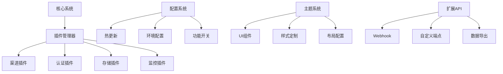
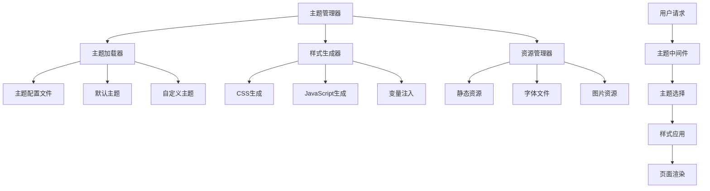
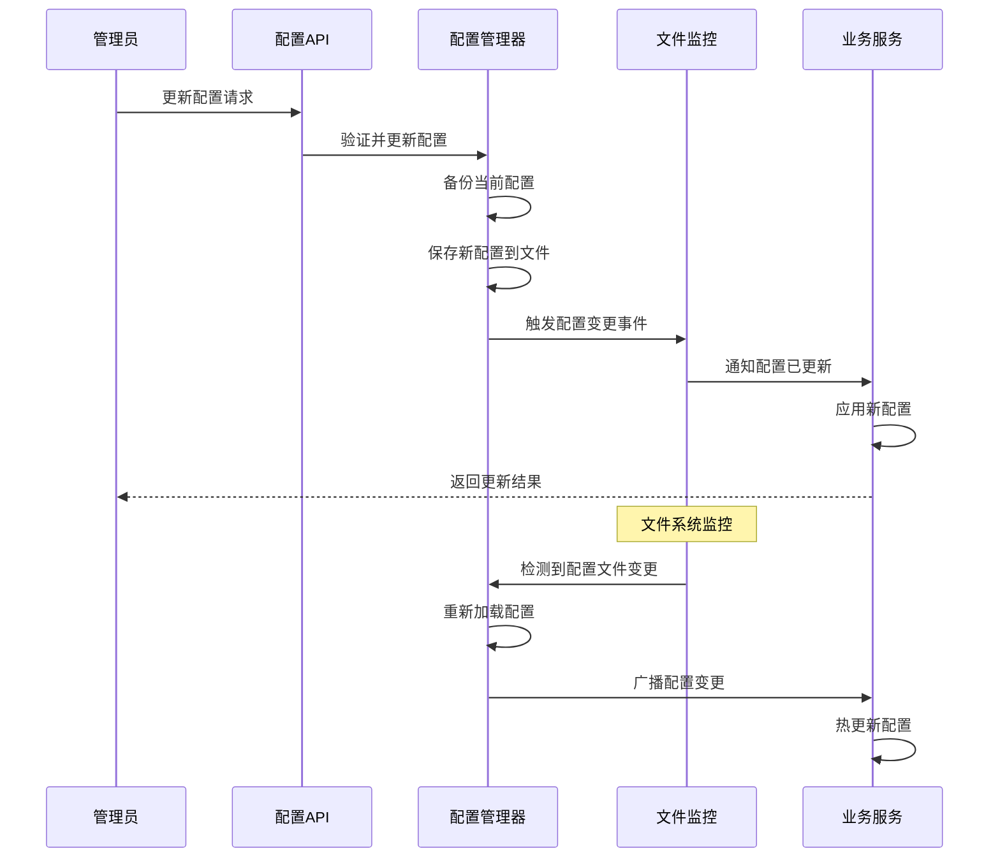
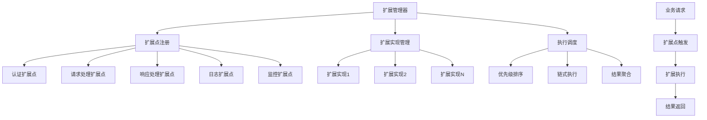
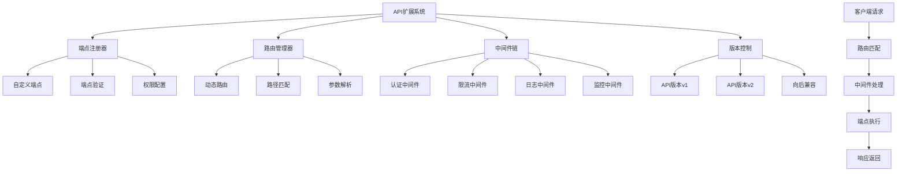

# 第20章 项目扩展与定制

## 本章实战要点
- 扩展点清单: 渠道/认证/存储/监控插件；Web 扩展端点与 Webhook。
- 版本与兼容: 语义化版本、实验性功能标注、迁移脚本与回滚路径。
- 配置热更新: 不重启变更能力开关，降级与熔断预案。

## 交叉引用
- 第5/6/8/10/11章的接口与中间件作为扩展契约；第13章的部署策略保障扩展上线安全。

## 20.1 本章概述

本章将深入探讨如何对New-API项目进行扩展和定制，包括插件系统设计、自定义渠道开发、主题定制、功能扩展等内容。通过学习本章，读者将掌握如何根据实际需求对项目进行个性化改造。

### 20.1.1 扩展目标

- 设计灵活的插件系统
- 实现自定义渠道支持
- 提供主题定制功能
- 支持功能模块扩展
- 实现配置热更新

### 20.1.2 扩展架构



## 20.2 插件系统设计

### 20.2.1 插件接口定义

```go
package plugin

import (
    "context"
    "encoding/json"
)

// 插件接口
type Plugin interface {
    // 插件名称
    Name() string
    
    // 插件版本
    Version() string
    
    // 插件描述
    Description() string
    
    // 初始化插件
    Initialize(config map[string]interface{}) error
    
    // 启动插件
    Start(ctx context.Context) error
    
    // 停止插件
    Stop() error
    
    // 插件状态
    Status() PluginStatus
}

// 插件状态
type PluginStatus int

const (
    PluginStatusStopped PluginStatus = iota
    PluginStatusStarting
    PluginStatusRunning
    PluginStatusStopping
    PluginStatusError
)

func (ps PluginStatus) String() string {
    switch ps {
    case PluginStatusStopped:
        return "stopped"
    case PluginStatusStarting:
        return "starting"
    case PluginStatusRunning:
        return "running"
    case PluginStatusStopping:
        return "stopping"
    case PluginStatusError:
        return "error"
    default:
        return "unknown"
    }
}

// 渠道插件接口
type ChannelPlugin interface {
    Plugin
    
    // 支持的模型列表
    SupportedModels() []string
    
    // 发送聊天请求
    ChatCompletion(ctx context.Context, request *ChatRequest) (*ChatResponse, error)
    
    // 计算配额
    CalculateQuota(request *ChatRequest, response *ChatResponse) int64
    
    // 健康检查
    HealthCheck(ctx context.Context) error
}

// 聊天请求
type ChatRequest struct {
    Model       string    `json:"model"`
    Messages    []Message `json:"messages"`
    Temperature float64   `json:"temperature,omitempty"`
    MaxTokens   int       `json:"max_tokens,omitempty"`
    Stream      bool      `json:"stream,omitempty"`
}

// 聊天响应
type ChatResponse struct {
    ID      string   `json:"id"`
    Object  string   `json:"object"`
    Created int64    `json:"created"`
    Model   string   `json:"model"`
    Choices []Choice `json:"choices"`
    Usage   Usage    `json:"usage"`
}

// 消息
type Message struct {
    Role    string `json:"role"`
    Content string `json:"content"`
}

// 选择
type Choice struct {
    Index        int     `json:"index"`
    Message      Message `json:"message"`
    FinishReason string  `json:"finish_reason"`
}

// 使用情况
type Usage struct {
    PromptTokens     int `json:"prompt_tokens"`
    CompletionTokens int `json:"completion_tokens"`
    TotalTokens      int `json:"total_tokens"`
}

// 认证插件接口
type AuthPlugin interface {
    Plugin
    
    // 验证用户
    Authenticate(ctx context.Context, token string) (*User, error)
    
    // 获取用户权限
    GetPermissions(ctx context.Context, userID int) ([]string, error)
    
    // 刷新令牌
    RefreshToken(ctx context.Context, refreshToken string) (*TokenPair, error)
}

// 用户信息
type User struct {
    ID       int    `json:"id"`
    Username string `json:"username"`
    Email    string `json:"email"`
    Role     string `json:"role"`
    Status   int    `json:"status"`
}

// 令牌对
type TokenPair struct {
    AccessToken  string `json:"access_token"`
    RefreshToken string `json:"refresh_token"`
    ExpiresIn    int64  `json:"expires_in"`
}

// 存储插件接口
type StoragePlugin interface {
    Plugin
    
    // 存储数据
    Store(ctx context.Context, key string, value interface{}) error
    
    // 获取数据
    Get(ctx context.Context, key string, dest interface{}) error
    
    // 删除数据
    Delete(ctx context.Context, key string) error
    
    // 检查键是否存在
    Exists(ctx context.Context, key string) (bool, error)
    
    // 设置过期时间
    SetExpiration(ctx context.Context, key string, expiration int64) error
}
```

### 20.2.2 插件管理器

```go
package plugin

import (
    "context"
    "fmt"
    "log"
    "sync"
    "time"
)

// 插件管理器
type Manager struct {
    plugins map[string]Plugin
    mutex   sync.RWMutex
    ctx     context.Context
    cancel  context.CancelFunc
}

// 创建插件管理器
func NewManager() *Manager {
    ctx, cancel := context.WithCancel(context.Background())
    return &Manager{
        plugins: make(map[string]Plugin),
        ctx:     ctx,
        cancel:  cancel,
    }
}

// 注册插件
func (pm *Manager) Register(plugin Plugin) error {
    pm.mutex.Lock()
    defer pm.mutex.Unlock()
    
    name := plugin.Name()
    if _, exists := pm.plugins[name]; exists {
        return fmt.Errorf("plugin %s already registered", name)
    }
    
    pm.plugins[name] = plugin
    log.Printf("Plugin %s v%s registered", name, plugin.Version())
    return nil
}

// 卸载插件
func (pm *Manager) Unregister(name string) error {
    pm.mutex.Lock()
    defer pm.mutex.Unlock()
    
    plugin, exists := pm.plugins[name]
    if !exists {
        return fmt.Errorf("plugin %s not found", name)
    }
    
    // 停止插件
    if plugin.Status() == PluginStatusRunning {
        if err := plugin.Stop(); err != nil {
            return fmt.Errorf("failed to stop plugin %s: %v", name, err)
        }
    }
    
    delete(pm.plugins, name)
    log.Printf("Plugin %s unregistered", name)
    return nil
}

// 启动插件
func (pm *Manager) Start(name string, config map[string]interface{}) error {
    pm.mutex.RLock()
    plugin, exists := pm.plugins[name]
    pm.mutex.RUnlock()
    
    if !exists {
        return fmt.Errorf("plugin %s not found", name)
    }
    
    if plugin.Status() == PluginStatusRunning {
        return fmt.Errorf("plugin %s is already running", name)
    }
    
    // 初始化插件
    if err := plugin.Initialize(config); err != nil {
        return fmt.Errorf("failed to initialize plugin %s: %v", name, err)
    }
    
    // 启动插件
    if err := plugin.Start(pm.ctx); err != nil {
        return fmt.Errorf("failed to start plugin %s: %v", name, err)
    }
    
    log.Printf("Plugin %s started", name)
    return nil
}

// 停止插件
func (pm *Manager) Stop(name string) error {
    pm.mutex.RLock()
    plugin, exists := pm.plugins[name]
    pm.mutex.RUnlock()
    
    if !exists {
        return fmt.Errorf("plugin %s not found", name)
    }
    
    if plugin.Status() != PluginStatusRunning {
        return fmt.Errorf("plugin %s is not running", name)
    }
    
    if err := plugin.Stop(); err != nil {
        return fmt.Errorf("failed to stop plugin %s: %v", name, err)
    }
    
    log.Printf("Plugin %s stopped", name)
    return nil
}

// 获取插件
func (pm *Manager) Get(name string) (Plugin, error) {
    pm.mutex.RLock()
    defer pm.mutex.RUnlock()
    
    plugin, exists := pm.plugins[name]
    if !exists {
        return nil, fmt.Errorf("plugin %s not found", name)
    }
    
    return plugin, nil
}

// 获取所有插件
func (pm *Manager) List() map[string]Plugin {
    pm.mutex.RLock()
    defer pm.mutex.RUnlock()
    
    result := make(map[string]Plugin)
    for name, plugin := range pm.plugins {
        result[name] = plugin
    }
    
    return result
}

// 获取渠道插件
func (pm *Manager) GetChannelPlugin(name string) (ChannelPlugin, error) {
    plugin, err := pm.Get(name)
    if err != nil {
        return nil, err
    }
    
    channelPlugin, ok := plugin.(ChannelPlugin)
    if !ok {
        return nil, fmt.Errorf("plugin %s is not a channel plugin", name)
    }
    
    return channelPlugin, nil
}

// 获取认证插件
func (pm *Manager) GetAuthPlugin(name string) (AuthPlugin, error) {
    plugin, err := pm.Get(name)
    if err != nil {
        return nil, err
    }
    
    authPlugin, ok := plugin.(AuthPlugin)
    if !ok {
        return nil, fmt.Errorf("plugin %s is not an auth plugin", name)
    }
    
    return authPlugin, nil
}

// 获取存储插件
func (pm *Manager) GetStoragePlugin(name string) (StoragePlugin, error) {
    plugin, err := pm.Get(name)
    if err != nil {
        return nil, err
    }
    
    storagePlugin, ok := plugin.(StoragePlugin)
    if !ok {
        return nil, fmt.Errorf("plugin %s is not a storage plugin", name)
    }
    
    return storagePlugin, nil
}

// 启动所有插件
func (pm *Manager) StartAll(configs map[string]map[string]interface{}) error {
    pm.mutex.RLock()
    plugins := make([]Plugin, 0, len(pm.plugins))
    for _, plugin := range pm.plugins {
        plugins = append(plugins, plugin)
    }
    pm.mutex.RUnlock()
    
    for _, plugin := range plugins {
        name := plugin.Name()
        config := configs[name]
        if config == nil {
            config = make(map[string]interface{})
        }
        
        if err := pm.Start(name, config); err != nil {
            log.Printf("Failed to start plugin %s: %v", name, err)
        }
    }
    
    return nil
}

// 停止所有插件
func (pm *Manager) StopAll() error {
    pm.mutex.RLock()
    plugins := make([]Plugin, 0, len(pm.plugins))
    for _, plugin := range pm.plugins {
        plugins = append(plugins, plugin)
    }
    pm.mutex.RUnlock()
    
    for _, plugin := range plugins {
        name := plugin.Name()
        if err := pm.Stop(name); err != nil {
            log.Printf("Failed to stop plugin %s: %v", name, err)
        }
    }
    
    pm.cancel()
    return nil
}

// 健康检查
func (pm *Manager) HealthCheck() map[string]error {
    pm.mutex.RLock()
    defer pm.mutex.RUnlock()
    
    results := make(map[string]error)
    
    for name, plugin := range pm.plugins {
        if plugin.Status() != PluginStatusRunning {
            results[name] = fmt.Errorf("plugin is not running")
            continue
        }
        
        // 如果是渠道插件，执行健康检查
        if channelPlugin, ok := plugin.(ChannelPlugin); ok {
            ctx, cancel := context.WithTimeout(context.Background(), 10*time.Second)
            err := channelPlugin.HealthCheck(ctx)
            cancel()
            results[name] = err
        } else {
            results[name] = nil
        }
    }
    
    return results
}
```

## 20.3 自定义渠道开发

### 20.3.1 百度文心一言渠道插件

```go
package channels

import (
    "bytes"
    "context"
    "encoding/json"
    "fmt"
    "io"
    "net/http"
    "time"
    
    "your-project/plugin"
)

// 百度文心一言渠道插件
type BaiduErniePlugin struct {
    name        string
    version     string
    description string
    status      plugin.PluginStatus
    
    apiKey    string
    secretKey string
    baseURL   string
    client    *http.Client
    
    accessToken string
    tokenExpiry time.Time
}

// 创建百度文心一言插件
func NewBaiduErniePlugin() *BaiduErniePlugin {
    return &BaiduErniePlugin{
        name:        "baidu-ernie",
        version:     "1.0.0",
        description: "Baidu ERNIE channel plugin",
        status:      plugin.PluginStatusStopped,
        baseURL:     "https://aip.baidubce.com",
        client: &http.Client{
            Timeout: 30 * time.Second,
        },
    }
}

// 插件名称
func (bp *BaiduErniePlugin) Name() string {
    return bp.name
}

// 插件版本
func (bp *BaiduErniePlugin) Version() string {
    return bp.version
}

// 插件描述
func (bp *BaiduErniePlugin) Description() string {
    return bp.description
}

// 初始化插件
func (bp *BaiduErniePlugin) Initialize(config map[string]interface{}) error {
    apiKey, ok := config["api_key"].(string)
    if !ok || apiKey == "" {
        return fmt.Errorf("api_key is required")
    }
    
    secretKey, ok := config["secret_key"].(string)
    if !ok || secretKey == "" {
        return fmt.Errorf("secret_key is required")
    }
    
    bp.apiKey = apiKey
    bp.secretKey = secretKey
    
    if baseURL, ok := config["base_url"].(string); ok && baseURL != "" {
        bp.baseURL = baseURL
    }
    
    return nil
}

// 启动插件
func (bp *BaiduErniePlugin) Start(ctx context.Context) error {
    bp.status = plugin.PluginStatusStarting
    
    // 获取访问令牌
    if err := bp.refreshAccessToken(); err != nil {
        bp.status = plugin.PluginStatusError
        return fmt.Errorf("failed to get access token: %v", err)
    }
    
    bp.status = plugin.PluginStatusRunning
    
    // 启动令牌刷新协程
    go bp.tokenRefreshLoop(ctx)
    
    return nil
}

// 停止插件
func (bp *BaiduErniePlugin) Stop() error {
    bp.status = plugin.PluginStatusStopped
    return nil
}

// 插件状态
func (bp *BaiduErniePlugin) Status() plugin.PluginStatus {
    return bp.status
}

// 支持的模型列表
func (bp *BaiduErniePlugin) SupportedModels() []string {
    return []string{
        "ernie-bot",
        "ernie-bot-turbo",
        "ernie-bot-4",
        "ernie-3.5-8k",
        "ernie-3.5-8k-0205",
        "ernie-3.5-4k-0205",
    }
}

// 发送聊天请求
func (bp *BaiduErniePlugin) ChatCompletion(ctx context.Context, request *plugin.ChatRequest) (*plugin.ChatResponse, error) {
    if bp.status != plugin.PluginStatusRunning {
        return nil, fmt.Errorf("plugin is not running")
    }
    
    // 检查访问令牌是否过期
    if time.Now().After(bp.tokenExpiry) {
        if err := bp.refreshAccessToken(); err != nil {
            return nil, fmt.Errorf("failed to refresh access token: %v", err)
        }
    }
    
    // 构建请求
    baiduRequest := bp.buildBaiduRequest(request)
    
    // 发送请求
    url := fmt.Sprintf("%s/rpc/2.0/ai_custom/v1/wenxinworkshop/chat/%s?access_token=%s",
        bp.baseURL, bp.getModelEndpoint(request.Model), bp.accessToken)
    
    reqBody, err := json.Marshal(baiduRequest)
    if err != nil {
        return nil, fmt.Errorf("failed to marshal request: %v", err)
    }
    
    httpReq, err := http.NewRequestWithContext(ctx, "POST", url, bytes.NewBuffer(reqBody))
    if err != nil {
        return nil, fmt.Errorf("failed to create request: %v", err)
    }
    
    httpReq.Header.Set("Content-Type", "application/json")
    
    resp, err := bp.client.Do(httpReq)
    if err != nil {
        return nil, fmt.Errorf("failed to send request: %v", err)
    }
    defer resp.Body.Close()
    
    respBody, err := io.ReadAll(resp.Body)
    if err != nil {
        return nil, fmt.Errorf("failed to read response: %v", err)
    }
    
    if resp.StatusCode != http.StatusOK {
        return nil, fmt.Errorf("API returned status %d: %s", resp.StatusCode, string(respBody))
    }
    
    // 解析响应
    var baiduResponse BaiduChatResponse
    if err := json.Unmarshal(respBody, &baiduResponse); err != nil {
        return nil, fmt.Errorf("failed to unmarshal response: %v", err)
    }
    
    // 转换为标准响应格式
    return bp.convertResponse(&baiduResponse, request), nil
}

// 计算配额
func (bp *BaiduErniePlugin) CalculateQuota(request *plugin.ChatRequest, response *plugin.ChatResponse) int64 {
    // 百度文心一言按token计费
    return int64(response.Usage.TotalTokens)
}

// 健康检查
func (bp *BaiduErniePlugin) HealthCheck(ctx context.Context) error {
    if bp.status != plugin.PluginStatusRunning {
        return fmt.Errorf("plugin is not running")
    }
    
    // 发送简单的测试请求
    testRequest := &plugin.ChatRequest{
        Model: "ernie-bot",
        Messages: []plugin.Message{
            {
                Role:    "user",
                Content: "Hello",
            },
        },
        MaxTokens: 10,
    }
    
    _, err := bp.ChatCompletion(ctx, testRequest)
    return err
}

// 百度请求结构
type BaiduChatRequest struct {
    Messages    []BaiduMessage `json:"messages"`
    Temperature float64        `json:"temperature,omitempty"`
    TopP        float64        `json:"top_p,omitempty"`
    MaxTokens   int            `json:"max_output_tokens,omitempty"`
    Stream      bool           `json:"stream,omitempty"`
}

type BaiduMessage struct {
    Role    string `json:"role"`
    Content string `json:"content"`
}

// 百度响应结构
type BaiduChatResponse struct {
    ID               string      `json:"id"`
    Object           string      `json:"object"`
    Created          int64       `json:"created"`
    Result           string      `json:"result"`
    IsTruncated      bool        `json:"is_truncated"`
    NeedClearHistory bool        `json:"need_clear_history"`
    Usage            BaiduUsage  `json:"usage"`
    ErrorCode        int         `json:"error_code,omitempty"`
    ErrorMsg         string      `json:"error_msg,omitempty"`
}

type BaiduUsage struct {
    PromptTokens     int `json:"prompt_tokens"`
    CompletionTokens int `json:"completion_tokens"`
    TotalTokens      int `json:"total_tokens"`
}

// 访问令牌响应
type AccessTokenResponse struct {
    AccessToken string `json:"access_token"`
    ExpiresIn   int64  `json:"expires_in"`
    Error       string `json:"error,omitempty"`
    ErrorDesc   string `json:"error_description,omitempty"`
}

// 刷新访问令牌
func (bp *BaiduErniePlugin) refreshAccessToken() error {
    url := fmt.Sprintf("%s/oauth/2.0/token?grant_type=client_credentials&client_id=%s&client_secret=%s",
        bp.baseURL, bp.apiKey, bp.secretKey)
    
    resp, err := bp.client.Post(url, "application/json", nil)
    if err != nil {
        return err
    }
    defer resp.Body.Close()
    
    body, err := io.ReadAll(resp.Body)
    if err != nil {
        return err
    }
    
    var tokenResp AccessTokenResponse
    if err := json.Unmarshal(body, &tokenResp); err != nil {
        return err
    }
    
    if tokenResp.Error != "" {
        return fmt.Errorf("failed to get access token: %s - %s", tokenResp.Error, tokenResp.ErrorDesc)
    }
    
    bp.accessToken = tokenResp.AccessToken
    bp.tokenExpiry = time.Now().Add(time.Duration(tokenResp.ExpiresIn-300) * time.Second) // 提前5分钟刷新
    
    return nil
}

// 令牌刷新循环
func (bp *BaiduErniePlugin) tokenRefreshLoop(ctx context.Context) {
    ticker := time.NewTicker(1 * time.Hour)
    defer ticker.Stop()
    
    for {
        select {
        case <-ctx.Done():
            return
        case <-ticker.C:
            if time.Now().Add(10*time.Minute).After(bp.tokenExpiry) {
                if err := bp.refreshAccessToken(); err != nil {
                    fmt.Printf("Failed to refresh access token: %v\n", err)
                }
            }
        }
    }
}

// 构建百度请求
func (bp *BaiduErniePlugin) buildBaiduRequest(request *plugin.ChatRequest) *BaiduChatRequest {
    messages := make([]BaiduMessage, len(request.Messages))
    for i, msg := range request.Messages {
        messages[i] = BaiduMessage{
            Role:    msg.Role,
            Content: msg.Content,
        }
    }
    
    return &BaiduChatRequest{
        Messages:    messages,
        Temperature: request.Temperature,
        MaxTokens:   request.MaxTokens,
        Stream:      request.Stream,
    }
}

// 转换响应
func (bp *BaiduErniePlugin) convertResponse(baiduResp *BaiduChatResponse, request *plugin.ChatRequest) *plugin.ChatResponse {
    return &plugin.ChatResponse{
        ID:      baiduResp.ID,
        Object:  "chat.completion",
        Created: baiduResp.Created,
        Model:   request.Model,
        Choices: []plugin.Choice{
            {
                Index: 0,
                Message: plugin.Message{
                    Role:    "assistant",
                    Content: baiduResp.Result,
                },
                FinishReason: bp.getFinishReason(baiduResp.IsTruncated),
            },
        },
        Usage: plugin.Usage{
            PromptTokens:     baiduResp.Usage.PromptTokens,
            CompletionTokens: baiduResp.Usage.CompletionTokens,
            TotalTokens:      baiduResp.Usage.TotalTokens,
        },
    }
}

// 获取模型端点
func (bp *BaiduErniePlugin) getModelEndpoint(model string) string {
    endpoints := map[string]string{
        "ernie-bot":         "completions",
        "ernie-bot-turbo":   "eb-instant",
        "ernie-bot-4":       "completions_pro",
        "ernie-3.5-8k":      "completions",
        "ernie-3.5-8k-0205": "ernie_bot_8k",
        "ernie-3.5-4k-0205": "completions",
    }
    
    if endpoint, ok := endpoints[model]; ok {
        return endpoint
    }
    
    return "completions"
}

// 获取结束原因
func (bp *BaiduErniePlugin) getFinishReason(isTruncated bool) string {
    if isTruncated {
        return "length"
    }
    return "stop"
}
```

### 20.3.2 自定义存储插件

```go
package storage

import (
    "context"
    "encoding/json"
    "fmt"
    "time"
    
    "github.com/go-redis/redis/v8"
    "your-project/plugin"
)

// Redis存储插件
type RedisStoragePlugin struct {
    name        string
    version     string
    description string
    status      plugin.PluginStatus
    
    client *redis.Client
    config RedisConfig
}

// Redis配置
type RedisConfig struct {
    Addr     string `json:"addr"`
    Password string `json:"password"`
    DB       int    `json:"db"`
    PoolSize int    `json:"pool_size"`
}

// 创建Redis存储插件
func NewRedisStoragePlugin() *RedisStoragePlugin {
    return &RedisStoragePlugin{
        name:        "redis-storage",
        version:     "1.0.0",
        description: "Redis storage plugin",
        status:      plugin.PluginStatusStopped,
    }
}

// 插件名称
func (rsp *RedisStoragePlugin) Name() string {
    return rsp.name
}

// 插件版本
func (rsp *RedisStoragePlugin) Version() string {
    return rsp.version
}

// 插件描述
func (rsp *RedisStoragePlugin) Description() string {
    return rsp.description
}

// 初始化插件
func (rsp *RedisStoragePlugin) Initialize(config map[string]interface{}) error {
    configBytes, err := json.Marshal(config)
    if err != nil {
        return fmt.Errorf("failed to marshal config: %v", err)
    }
    
    if err := json.Unmarshal(configBytes, &rsp.config); err != nil {
        return fmt.Errorf("failed to unmarshal config: %v", err)
    }
    
    // 设置默认值
    if rsp.config.Addr == "" {
        rsp.config.Addr = "localhost:6379"
    }
    if rsp.config.PoolSize == 0 {
        rsp.config.PoolSize = 10
    }
    
    return nil
}

// 启动插件
func (rsp *RedisStoragePlugin) Start(ctx context.Context) error {
    rsp.status = plugin.PluginStatusStarting
    
    // 创建Redis客户端
    rsp.client = redis.NewClient(&redis.Options{
        Addr:     rsp.config.Addr,
        Password: rsp.config.Password,
        DB:       rsp.config.DB,
        PoolSize: rsp.config.PoolSize,
    })
    
    // 测试连接
    if err := rsp.client.Ping(ctx).Err(); err != nil {
        rsp.status = plugin.PluginStatusError
        return fmt.Errorf("failed to connect to Redis: %v", err)
    }
    
    rsp.status = plugin.PluginStatusRunning
    return nil
}

// 停止插件
func (rsp *RedisStoragePlugin) Stop() error {
    if rsp.client != nil {
        rsp.client.Close()
    }
    rsp.status = plugin.PluginStatusStopped
    return nil
}

// 插件状态
func (rsp *RedisStoragePlugin) Status() plugin.PluginStatus {
    return rsp.status
}

// 存储数据
func (rsp *RedisStoragePlugin) Store(ctx context.Context, key string, value interface{}) error {
    if rsp.status != plugin.PluginStatusRunning {
        return fmt.Errorf("plugin is not running")
    }
    
    data, err := json.Marshal(value)
    if err != nil {
        return fmt.Errorf("failed to marshal value: %v", err)
    }
    
    return rsp.client.Set(ctx, key, data, 0).Err()
}

// 获取数据
func (rsp *RedisStoragePlugin) Get(ctx context.Context, key string, dest interface{}) error {
    if rsp.status != plugin.PluginStatusRunning {
        return fmt.Errorf("plugin is not running")
    }
    
    data, err := rsp.client.Get(ctx, key).Result()
    if err != nil {
        if err == redis.Nil {
            return fmt.Errorf("key not found")
        }
        return err
    }
    
    return json.Unmarshal([]byte(data), dest)
}

// 删除数据
func (rsp *RedisStoragePlugin) Delete(ctx context.Context, key string) error {
    if rsp.status != plugin.PluginStatusRunning {
        return fmt.Errorf("plugin is not running")
    }
    
    return rsp.client.Del(ctx, key).Err()
}

// 检查键是否存在
func (rsp *RedisStoragePlugin) Exists(ctx context.Context, key string) (bool, error) {
    if rsp.status != plugin.PluginStatusRunning {
        return false, fmt.Errorf("plugin is not running")
    }
    
    count, err := rsp.client.Exists(ctx, key).Result()
    return count > 0, err
}

// 设置过期时间
func (rsp *RedisStoragePlugin) SetExpiration(ctx context.Context, key string, expiration int64) error {
    if rsp.status != plugin.PluginStatusRunning {
        return fmt.Errorf("plugin is not running")
    }
    
    duration := time.Duration(expiration) * time.Second
    return rsp.client.Expire(ctx, key, duration).Err()
}
```

## 20.4 主题定制系统

主题定制系统允许用户根据品牌需求和个人喜好自定义界面外观，包括颜色方案、字体排版、布局配置等。



**图1 主题定制系统架构图**

### 核心概念解析

#### 主题配置结构
- **颜色方案（ColorScheme）**：定义主色调、辅助色、状态色等颜色变量
- **字体排版（Typography）**：配置字体族、字号、行高、字重等排版属性
- **布局配置（Layout）**：设置侧边栏、头部、内容区域、页脚的布局参数
- **组件样式（Component）**：定义各UI组件的样式和变体
- **资源配置（Assets）**：管理Logo、图标、字体等静态资源

#### 主题切换机制
- **运行时切换**：通过中间件动态应用主题，无需重启服务
- **用户偏好**：支持用户级别的主题设置和记忆
- **响应式适配**：自动适配不同设备和屏幕尺寸

### 20.4.1 主题配置结构

```go
package theme

import (
    "encoding/json"
    "fmt"
    "io/fs"
    "os"
    "path/filepath"
)

// 主题配置
type Theme struct {
    Name        string            `json:"name"`
    Version     string            `json:"version"`
    Description string            `json:"description"`
    Author      string            `json:"author"`
    Colors      ColorScheme       `json:"colors"`
    Typography  Typography        `json:"typography"`
    Layout      Layout            `json:"layout"`
    Components  map[string]Component `json:"components"`
    Assets      Assets            `json:"assets"`
}

// 颜色方案
type ColorScheme struct {
    Primary     string `json:"primary"`
    Secondary   string `json:"secondary"`
    Success     string `json:"success"`
    Warning     string `json:"warning"`
    Error       string `json:"error"`
    Info        string `json:"info"`
    Background  string `json:"background"`
    Surface     string `json:"surface"`
    Text        string `json:"text"`
    TextSecondary string `json:"text_secondary"`
    Border      string `json:"border"`
    Shadow      string `json:"shadow"`
}

// 字体排版
type Typography struct {
    FontFamily   string  `json:"font_family"`
    FontSize     string  `json:"font_size"`
    LineHeight   float64 `json:"line_height"`
    FontWeight   string  `json:"font_weight"`
    LetterSpacing string `json:"letter_spacing"`
    
    H1 TypographyLevel `json:"h1"`
    H2 TypographyLevel `json:"h2"`
    H3 TypographyLevel `json:"h3"`
    H4 TypographyLevel `json:"h4"`
    H5 TypographyLevel `json:"h5"`
    H6 TypographyLevel `json:"h6"`
    
    Body1 TypographyLevel `json:"body1"`
    Body2 TypographyLevel `json:"body2"`
    Caption TypographyLevel `json:"caption"`
}

// 字体级别
type TypographyLevel struct {
    FontSize   string  `json:"font_size"`
    FontWeight string  `json:"font_weight"`
    LineHeight float64 `json:"line_height"`
}

// 布局配置
type Layout struct {
    Sidebar SidebarLayout `json:"sidebar"`
    Header  HeaderLayout  `json:"header"`
    Content ContentLayout `json:"content"`
    Footer  FooterLayout  `json:"footer"`
}

// 侧边栏布局
type SidebarLayout struct {
    Width     string `json:"width"`
    Collapsed bool   `json:"collapsed"`
    Position  string `json:"position"` // left, right
    Style     string `json:"style"`    // fixed, static
}

// 头部布局
type HeaderLayout struct {
    Height   string `json:"height"`
    Position string `json:"position"` // fixed, static
    Style    string `json:"style"`
}

// 内容布局
type ContentLayout struct {
    MaxWidth string `json:"max_width"`
    Padding  string `json:"padding"`
    Margin   string `json:"margin"`
}

// 页脚布局
type FooterLayout struct {
    Height   string `json:"height"`
    Position string `json:"position"` // fixed, static
    Style    string `json:"style"`
}

// 组件样式
type Component struct {
    Styles     map[string]string `json:"styles"`
    Variants   map[string]ComponentVariant `json:"variants"`
    Animation  Animation         `json:"animation"`
}

// 组件变体
type ComponentVariant struct {
    Styles map[string]string `json:"styles"`
}

// 动画配置
type Animation struct {
    Duration string `json:"duration"`
    Easing   string `json:"easing"`
    Delay    string `json:"delay"`
}

// 资源配置
type Assets struct {
    Logo      string            `json:"logo"`
    Favicon   string            `json:"favicon"`
    Images    map[string]string `json:"images"`
    Fonts     []FontAsset       `json:"fonts"`
    CustomCSS string            `json:"custom_css"`
    CustomJS  string            `json:"custom_js"`
}

// 字体资源
type FontAsset struct {
    Name   string `json:"name"`
    URL    string `json:"url"`
    Weight string `json:"weight"`
    Style  string `json:"style"`
}

// 主题管理器
type Manager struct {
    themes      map[string]*Theme
    activeTheme string
    themesDir   string
}

// 创建主题管理器
func NewManager(themesDir string) *Manager {
    return &Manager{
        themes:    make(map[string]*Theme),
        themesDir: themesDir,
    }
}

// 加载主题
func (tm *Manager) LoadTheme(name string) error {
    themePath := filepath.Join(tm.themesDir, name, "theme.json")
    
    data, err := os.ReadFile(themePath)
    if err != nil {
        return fmt.Errorf("failed to read theme file: %v", err)
    }
    
    var theme Theme
    if err := json.Unmarshal(data, &theme); err != nil {
        return fmt.Errorf("failed to parse theme: %v", err)
    }
    
    tm.themes[name] = &theme
    return nil
}

// 加载所有主题
func (tm *Manager) LoadAllThemes() error {
    return filepath.WalkDir(tm.themesDir, func(path string, d fs.DirEntry, err error) error {
        if err != nil {
            return err
        }
        
        if d.IsDir() && d.Name() != filepath.Base(tm.themesDir) {
            themeName := d.Name()
            if err := tm.LoadTheme(themeName); err != nil {
                fmt.Printf("Failed to load theme %s: %v\n", themeName, err)
            }
        }
        
        return nil
    })
}

// 获取主题
func (tm *Manager) GetTheme(name string) (*Theme, error) {
    theme, exists := tm.themes[name]
    if !exists {
        return nil, fmt.Errorf("theme %s not found", name)
    }
    return theme, nil
}

// 获取活动主题
func (tm *Manager) GetActiveTheme() (*Theme, error) {
    if tm.activeTheme == "" {
        return nil, fmt.Errorf("no active theme set")
    }
    return tm.GetTheme(tm.activeTheme)
}

// 设置活动主题
func (tm *Manager) SetActiveTheme(name string) error {
    if _, exists := tm.themes[name]; !exists {
        return fmt.Errorf("theme %s not found", name)
    }
    tm.activeTheme = name
    return nil
}

// 获取所有主题
func (tm *Manager) GetAllThemes() map[string]*Theme {
    return tm.themes
}

// 生成CSS
func (tm *Manager) GenerateCSS(themeName string) (string, error) {
    theme, err := tm.GetTheme(themeName)
    if err != nil {
        return "", err
    }
    
    css := fmt.Sprintf(`
:root {
    /* Colors */
    --color-primary: %s;
    --color-secondary: %s;
    --color-success: %s;
    --color-warning: %s;
    --color-error: %s;
    --color-info: %s;
    --color-background: %s;
    --color-surface: %s;
    --color-text: %s;
    --color-text-secondary: %s;
    --color-border: %s;
    --color-shadow: %s;
    
    /* Typography */
    --font-family: %s;
    --font-size: %s;
    --line-height: %f;
    --font-weight: %s;
    --letter-spacing: %s;
    
    /* Layout */
    --sidebar-width: %s;
    --header-height: %s;
    --content-max-width: %s;
    --content-padding: %s;
    --footer-height: %s;
}
`,
        theme.Colors.Primary, theme.Colors.Secondary, theme.Colors.Success,
        theme.Colors.Warning, theme.Colors.Error, theme.Colors.Info,
        theme.Colors.Background, theme.Colors.Surface, theme.Colors.Text,
        theme.Colors.TextSecondary, theme.Colors.Border, theme.Colors.Shadow,
        theme.Typography.FontFamily, theme.Typography.FontSize,
        theme.Typography.LineHeight, theme.Typography.FontWeight,
        theme.Typography.LetterSpacing,
        theme.Layout.Sidebar.Width, theme.Layout.Header.Height,
        theme.Layout.Content.MaxWidth, theme.Layout.Content.Padding,
        theme.Layout.Footer.Height,
    )
    
    // 添加组件样式
    for componentName, component := range theme.Components {
        css += fmt.Sprintf("\n/* %s Component */\n", componentName)
        for selector, styles := range component.Styles {
            css += fmt.Sprintf(".%s-%s { %s }\n", componentName, selector, styles)
        }
        
        // 添加变体样式
        for variantName, variant := range component.Variants {
            for selector, styles := range variant.Styles {
                css += fmt.Sprintf(".%s-%s.%s { %s }\n", componentName, selector, variantName, styles)
            }
        }
    }
    
    // 添加自定义CSS
    if theme.Assets.CustomCSS != "" {
        css += "\n/* Custom CSS */\n" + theme.Assets.CustomCSS
    }
    
    return css, nil
}

// 生成JavaScript
func (tm *Manager) GenerateJS(themeName string) (string, error) {
    theme, err := tm.GetTheme(themeName)
    if err != nil {
        return "", err
    }
    
    js := fmt.Sprintf(`
// Theme: %s
window.THEME_CONFIG = %s;
`,
        theme.Name, tm.themeToJSON(theme))
    
    // 添加自定义JavaScript
    if theme.Assets.CustomJS != "" {
        js += "\n// Custom JavaScript\n" + theme.Assets.CustomJS
    }
    
    return js, nil
}

// 主题转JSON
func (tm *Manager) themeToJSON(theme *Theme) string {
    data, _ := json.Marshal(theme)
    return string(data)
}
```

### 20.4.2 主题切换中间件

```go
package middleware

import (
    "net/http"
    "strings"
    
    "github.com/gin-gonic/gin"
    "your-project/theme"
)

// 主题中间件
func ThemeMiddleware(themeManager *theme.Manager) gin.HandlerFunc {
    return func(c *gin.Context) {
        // 从请求头或查询参数获取主题名称
        themeName := c.GetHeader("X-Theme")
        if themeName == "" {
            themeName = c.Query("theme")
        }
        if themeName == "" {
            themeName = "default"
        }
        
        // 验证主题是否存在
        if _, err := themeManager.GetTheme(themeName); err != nil {
            themeName = "default"
        }
        
        // 设置主题到上下文
        c.Set("theme", themeName)
        c.Next()
    }
}

// 主题资源处理器
func ThemeAssetsHandler(themeManager *theme.Manager) gin.HandlerFunc {
    return func(c *gin.Context) {
        themeName := c.Param("theme")
        assetType := c.Param("type")
        
        switch assetType {
        case "css":
            css, err := themeManager.GenerateCSS(themeName)
            if err != nil {
                c.JSON(http.StatusNotFound, gin.H{"error": "Theme not found"})
                return
            }
            
            c.Header("Content-Type", "text/css")
            c.String(http.StatusOK, css)
            
        case "js":
            js, err := themeManager.GenerateJS(themeName)
            if err != nil {
                c.JSON(http.StatusNotFound, gin.H{"error": "Theme not found"})
                return
            }
            
            c.Header("Content-Type", "application/javascript")
            c.String(http.StatusOK, js)
            
        default:
            c.JSON(http.StatusBadRequest, gin.H{"error": "Invalid asset type"})
        }
    }
}

// 主题API处理器
func ThemeAPIHandler(themeManager *theme.Manager) gin.HandlerFunc {
    return func(c *gin.Context) {
        switch c.Request.Method {
        case "GET":
            // 获取所有主题或特定主题
            themeName := c.Param("name")
            if themeName != "" {
                theme, err := themeManager.GetTheme(themeName)
                if err != nil {
                    c.JSON(http.StatusNotFound, gin.H{"error": "Theme not found"})
                    return
                }
                c.JSON(http.StatusOK, theme)
            } else {
                themes := themeManager.GetAllThemes()
                c.JSON(http.StatusOK, themes)
            }
            
        case "POST":
            // 设置活动主题
            var request struct {
                Theme string `json:"theme"`
            }
            
            if err := c.ShouldBindJSON(&request); err != nil {
                c.JSON(http.StatusBadRequest, gin.H{"error": err.Error()})
                return
            }
            
            if err := themeManager.SetActiveTheme(request.Theme); err != nil {
                c.JSON(http.StatusBadRequest, gin.H{"error": err.Error()})
                return
            }
            
            c.JSON(http.StatusOK, gin.H{"message": "Theme set successfully"})
        }
    }
}
```

## 20.5 配置热更新系统

配置热更新系统允许在不重启服务的情况下动态更新应用配置，提高系统的可维护性和运行时灵活性。



**图2 配置热更新时序图**

### 核心概念解析

#### 配置管理器（Config Manager）
- **配置加载**：从文件系统或远程配置中心加载配置
- **配置验证**：确保配置格式正确和参数有效性
- **配置缓存**：在内存中缓存配置，提供快速访问
- **配置备份**：更新前自动备份，支持回滚操作

#### 热更新机制
- **文件监控**：使用fsnotify监控配置文件变更
- **观察者模式**：通过ConfigWatcher接口通知配置变更
- **原子更新**：确保配置更新的原子性，避免中间状态
- **回滚机制**：更新失败时自动回滚到上一个有效配置

#### 配置分类
- **服务器配置**：端口、超时、连接数等服务器参数
- **数据库配置**：连接字符串、连接池、事务设置
- **缓存配置**：Redis连接、过期策略、集群设置
- **业务配置**：功能开关、限流参数、安全策略

### 20.5.1 配置管理器

```go
package config

import (
    "context"
    "encoding/json"
    "fmt"
    "log"
    "os"
    "path/filepath"
    "sync"
    "time"
    
    "github.com/fsnotify/fsnotify"
)

// 配置管理器
type Manager struct {
    configPath string
    config     *Config
    mutex      sync.RWMutex
    watchers   []ConfigWatcher
    watcher    *fsnotify.Watcher
    ctx        context.Context
    cancel     context.CancelFunc
}

// 配置结构
type Config struct {
    Server    ServerConfig    `json:"server"`
    Database  DatabaseConfig  `json:"database"`
    Redis     RedisConfig     `json:"redis"`
    Channels  []ChannelConfig `json:"channels"`
    Features  FeatureConfig   `json:"features"`
    Security  SecurityConfig  `json:"security"`
    Monitoring MonitoringConfig `json:"monitoring"`
    UpdatedAt time.Time       `json:"updated_at"`
}

// 服务器配置
type ServerConfig struct {
    Port         int    `json:"port"`
    Host         string `json:"host"`
    ReadTimeout  int    `json:"read_timeout"`
    WriteTimeout int    `json:"write_timeout"`
    IdleTimeout  int    `json:"idle_timeout"`
    MaxBodySize  int64  `json:"max_body_size"`
}

// 数据库配置
type DatabaseConfig struct {
    Driver          string `json:"driver"`
    DSN             string `json:"dsn"`
    MaxOpenConns    int    `json:"max_open_conns"`
    MaxIdleConns    int    `json:"max_idle_conns"`
    ConnMaxLifetime int    `json:"conn_max_lifetime"`
}

// Redis配置
type RedisConfig struct {
    Addr     string `json:"addr"`
    Password string `json:"password"`
    DB       int    `json:"db"`
    PoolSize int    `json:"pool_size"`
}

// 渠道配置
type ChannelConfig struct {
    ID       int                    `json:"id"`
    Name     string                 `json:"name"`
    Type     string                 `json:"type"`
    Enabled  bool                   `json:"enabled"`
    Priority int                    `json:"priority"`
    Config   map[string]interface{} `json:"config"`
}

// 功能配置
type FeatureConfig struct {
    EnableRegistration bool `json:"enable_registration"`
    EnableInvitation   bool `json:"enable_invitation"`
    EnableTopup        bool `json:"enable_topup"`
    EnableDrawing      bool `json:"enable_drawing"`
    EnableTaskSystem   bool `json:"enable_task_system"`
    EnableAffiliation  bool `json:"enable_affiliation"`
}

// 安全配置
type SecurityConfig struct {
    JWTSecret           string `json:"jwt_secret"`
    SessionSecret       string `json:"session_secret"`
    PasswordMinLength   int    `json:"password_min_length"`
    MaxLoginAttempts    int    `json:"max_login_attempts"`
    LoginAttemptWindow  int    `json:"login_attempt_window"`
    EnableRateLimit     bool   `json:"enable_rate_limit"`
    RateLimitRequests   int    `json:"rate_limit_requests"`
    RateLimitWindow     int    `json:"rate_limit_window"`
}

// 监控配置
type MonitoringConfig struct {
    EnableMetrics    bool   `json:"enable_metrics"`
    EnableTracing    bool   `json:"enable_tracing"`
    MetricsPath      string `json:"metrics_path"`
    HealthCheckPath  string `json:"health_check_path"`
    LogLevel         string `json:"log_level"`
    LogFormat        string `json:"log_format"`
}

// 配置观察者接口
type ConfigWatcher interface {
    OnConfigChanged(oldConfig, newConfig *Config) error
}

// 创建配置管理器
func NewManager(configPath string) *Manager {
    ctx, cancel := context.WithCancel(context.Background())
    return &Manager{
        configPath: configPath,
        watchers:   make([]ConfigWatcher, 0),
        ctx:        ctx,
        cancel:     cancel,
    }
}

// 加载配置
func (cm *Manager) LoadConfig() error {
    data, err := os.ReadFile(cm.configPath)
    if err != nil {
        return fmt.Errorf("failed to read config file: %v", err)
    }
    
    var config Config
    if err := json.Unmarshal(data, &config); err != nil {
        return fmt.Errorf("failed to parse config: %v", err)
    }
    
    config.UpdatedAt = time.Now()
    
    cm.mutex.Lock()
    cm.config = &config
    cm.mutex.Unlock()
    
    return nil
}

// 获取配置
func (cm *Manager) GetConfig() *Config {
    cm.mutex.RLock()
    defer cm.mutex.RUnlock()
    
    if cm.config == nil {
        return nil
    }
    
    // 返回配置的副本
    configCopy := *cm.config
    return &configCopy
}

// 更新配置
func (cm *Manager) UpdateConfig(newConfig *Config) error {
    cm.mutex.Lock()
    oldConfig := cm.config
    newConfig.UpdatedAt = time.Now()
    cm.config = newConfig
    cm.mutex.Unlock()
    
    // 保存到文件
    if err := cm.saveConfig(newConfig); err != nil {
        // 回滚配置
        cm.mutex.Lock()
        cm.config = oldConfig
        cm.mutex.Unlock()
        return fmt.Errorf("failed to save config: %v", err)
    }
    
    // 通知观察者
    for _, watcher := range cm.watchers {
        if err := watcher.OnConfigChanged(oldConfig, newConfig); err != nil {
            log.Printf("Config watcher error: %v", err)
        }
    }
    
    return nil
}

// 保存配置
func (cm *Manager) saveConfig(config *Config) error {
    data, err := json.MarshalIndent(config, "", "  ")
    if err != nil {
        return err
    }
    
    // 创建备份
    backupPath := cm.configPath + ".backup"
    if _, err := os.Stat(cm.configPath); err == nil {
        if err := os.Rename(cm.configPath, backupPath); err != nil {
            return fmt.Errorf("failed to create backup: %v", err)
        }
    }
    
    // 写入新配置
    if err := os.WriteFile(cm.configPath, data, 0644); err != nil {
        // 恢复备份
        if _, err := os.Stat(backupPath); err == nil {
            os.Rename(backupPath, cm.configPath)
        }
        return err
    }
    
    // 删除备份
    os.Remove(backupPath)
    return nil
}

// 添加配置观察者
func (cm *Manager) AddWatcher(watcher ConfigWatcher) {
    cm.watchers = append(cm.watchers, watcher)
}

// 启动文件监控
func (cm *Manager) StartWatching() error {
    watcher, err := fsnotify.NewWatcher()
    if err != nil {
        return err
    }
    
    cm.watcher = watcher
    
    // 监控配置文件目录
    configDir := filepath.Dir(cm.configPath)
    if err := watcher.Add(configDir); err != nil {
        return err
    }
    
    go cm.watchLoop()
    return nil
}

// 停止文件监控
func (cm *Manager) StopWatching() {
    if cm.watcher != nil {
        cm.watcher.Close()
    }
    cm.cancel()
}

// 监控循环
func (cm *Manager) watchLoop() {
    for {
        select {
        case <-cm.ctx.Done():
            return
            
        case event, ok := <-cm.watcher.Events:
            if !ok {
                return
            }
            
            // 检查是否是配置文件变更
            if event.Name == cm.configPath && (event.Op&fsnotify.Write == fsnotify.Write) {
                log.Println("Config file changed, reloading...")
                
                // 延迟一下，确保文件写入完成
                time.Sleep(100 * time.Millisecond)
                
                oldConfig := cm.GetConfig()
                if err := cm.LoadConfig(); err != nil {
                    log.Printf("Failed to reload config: %v", err)
                    continue
                }
                
                newConfig := cm.GetConfig()
                
                // 通知观察者
                for _, watcher := range cm.watchers {
                    if err := watcher.OnConfigChanged(oldConfig, newConfig); err != nil {
                        log.Printf("Config watcher error: %v", err)
                    }
                }
                
                log.Println("Config reloaded successfully")
            }
            
        case err, ok := <-cm.watcher.Errors:
            if !ok {
                return
            }
            log.Printf("Config watcher error: %v", err)
        }
    }
}

// 获取特定配置项
func (cm *Manager) GetServerConfig() ServerConfig {
    config := cm.GetConfig()
    if config == nil {
        return ServerConfig{}
    }
    return config.Server
}

func (cm *Manager) GetDatabaseConfig() DatabaseConfig {
    config := cm.GetConfig()
    if config == nil {
        return DatabaseConfig{}
    }
    return config.Database
}

func (cm *Manager) GetRedisConfig() RedisConfig {
    config := cm.GetConfig()
    if config == nil {
        return RedisConfig{}
    }
    return config.Redis
}

func (cm *Manager) GetChannelConfigs() []ChannelConfig {
    config := cm.GetConfig()
    if config == nil {
        return nil
    }
    return config.Channels
}

func (cm *Manager) GetFeatureConfig() FeatureConfig {
    config := cm.GetConfig()
    if config == nil {
        return FeatureConfig{}
    }
    return config.Features
}

func (cm *Manager) GetSecurityConfig() SecurityConfig {
    config := cm.GetConfig()
    if config == nil {
        return SecurityConfig{}
    }
    return config.Security
}

func (cm *Manager) GetMonitoringConfig() MonitoringConfig {
    config := cm.GetConfig()
    if config == nil {
        return MonitoringConfig{}
    }
    return config.Monitoring
}
```

### 20.5.2 配置热更新示例

```go
package service

import (
    "log"
    "your-project/config"
)

// 服务配置观察者
type ServiceConfigWatcher struct {
    channelService *ChannelService
    rateLimiter    *RateLimiter
}

func NewServiceConfigWatcher(channelService *ChannelService, rateLimiter *RateLimiter) *ServiceConfigWatcher {
    return &ServiceConfigWatcher{
        channelService: channelService,
        rateLimiter:    rateLimiter,
    }
}

// 配置变更处理
func (scw *ServiceConfigWatcher) OnConfigChanged(oldConfig, newConfig *config.Config) error {
    log.Println("Processing config changes...")
    
    // 处理渠道配置变更
    if err := scw.handleChannelConfigChanges(oldConfig.Channels, newConfig.Channels); err != nil {
        log.Printf("Failed to handle channel config changes: %v", err)
    }
    
    // 处理限流配置变更
    if err := scw.handleRateLimitConfigChanges(oldConfig.Security, newConfig.Security); err != nil {
        log.Printf("Failed to handle rate limit config changes: %v", err)
    }
    
    // 处理功能开关变更
    if err := scw.handleFeatureConfigChanges(oldConfig.Features, newConfig.Features); err != nil {
        log.Printf("Failed to handle feature config changes: %v", err)
    }
    
    return nil
}

// 处理渠道配置变更
func (scw *ServiceConfigWatcher) handleChannelConfigChanges(oldChannels, newChannels []config.ChannelConfig) error {
    // 创建映射以便比较
    oldChannelMap := make(map[int]config.ChannelConfig)
    for _, ch := range oldChannels {
        oldChannelMap[ch.ID] = ch
    }
    
    newChannelMap := make(map[int]config.ChannelConfig)
    for _, ch := range newChannels {
        newChannelMap[ch.ID] = ch
    }
    
    // 检查新增的渠道
    for id, newChannel := range newChannelMap {
        if _, exists := oldChannelMap[id]; !exists {
            log.Printf("Adding new channel: %s (ID: %d)", newChannel.Name, newChannel.ID)
            if err := scw.channelService.AddChannel(&newChannel); err != nil {
                log.Printf("Failed to add channel %d: %v", id, err)
            }
        }
    }
    
    // 检查更新的渠道
    for id, newChannel := range newChannelMap {
        if oldChannel, exists := oldChannelMap[id]; exists {
            if scw.channelConfigChanged(oldChannel, newChannel) {
                log.Printf("Updating channel: %s (ID: %d)", newChannel.Name, newChannel.ID)
                if err := scw.channelService.UpdateChannel(&newChannel); err != nil {
                    log.Printf("Failed to update channel %d: %v", id, err)
                }
            }
        }
    }
    
    // 检查删除的渠道
    for id, oldChannel := range oldChannelMap {
        if _, exists := newChannelMap[id]; !exists {
            log.Printf("Removing channel: %s (ID: %d)", oldChannel.Name, oldChannel.ID)
            if err := scw.channelService.RemoveChannel(id); err != nil {
                log.Printf("Failed to remove channel %d: %v", id, err)
            }
        }
    }
    
    return nil
}

// 检查渠道配置是否变更
func (scw *ServiceConfigWatcher) channelConfigChanged(old, new config.ChannelConfig) bool {
    return old.Name != new.Name ||
           old.Type != new.Type ||
           old.Enabled != new.Enabled ||
           old.Priority != new.Priority
}

// 处理限流配置变更
func (scw *ServiceConfigWatcher) handleRateLimitConfigChanges(oldSecurity, newSecurity config.SecurityConfig) error {
    if oldSecurity.EnableRateLimit != newSecurity.EnableRateLimit ||
       oldSecurity.RateLimitRequests != newSecurity.RateLimitRequests ||
       oldSecurity.RateLimitWindow != newSecurity.RateLimitWindow {
        
        log.Println("Updating rate limit configuration")
        return scw.rateLimiter.UpdateConfig(RateLimitConfig{
            Enabled:  newSecurity.EnableRateLimit,
            Requests: newSecurity.RateLimitRequests,
            Window:   newSecurity.RateLimitWindow,
        })
    }
    
    return nil
}

// 处理功能开关变更
func (scw *ServiceConfigWatcher) handleFeatureConfigChanges(oldFeatures, newFeatures config.FeatureConfig) error {
    changes := make(map[string]bool)
    
    if oldFeatures.EnableRegistration != newFeatures.EnableRegistration {
        changes["registration"] = newFeatures.EnableRegistration
    }
    if oldFeatures.EnableInvitation != newFeatures.EnableInvitation {
        changes["invitation"] = newFeatures.EnableInvitation
    }
    if oldFeatures.EnableTopup != newFeatures.EnableTopup {
        changes["topup"] = newFeatures.EnableTopup
    }
    if oldFeatures.EnableDrawing != newFeatures.EnableDrawing {
        changes["drawing"] = newFeatures.EnableDrawing
    }
    if oldFeatures.EnableTaskSystem != newFeatures.EnableTaskSystem {
        changes["task_system"] = newFeatures.EnableTaskSystem
    }
    if oldFeatures.EnableAffiliation != newFeatures.EnableAffiliation {
        changes["affiliation"] = newFeatures.EnableAffiliation
    }
    
    for feature, enabled := range changes {
        log.Printf("Feature %s is now %s", feature, map[bool]string{true: "enabled", false: "disabled"}[enabled])
    }
    
    return nil
}
```

## 20.6 功能扩展框架

功能扩展框架提供了一套灵活的插件机制，允许开发者在不修改核心代码的情况下扩展系统功能。



**图3 功能扩展框架架构图**

### 核心概念解析

#### 扩展点（Extension Point）
- **定义**：系统中预定义的可扩展位置，如认证、请求处理、响应处理等
- **接口规范**：定义扩展实现必须遵循的接口契约
- **生命周期**：管理扩展点的注册、激活、停用等状态
- **参数传递**：支持灵活的参数传递和结果返回机制

#### 扩展实现（Extension Implementation）
- **插件化**：每个扩展实现都是独立的插件模块
- **优先级**：支持设置执行优先级，控制执行顺序
- **条件执行**：可根据上下文条件决定是否执行
- **错误处理**：提供统一的错误处理和恢复机制

#### 执行模式
- **链式执行**：按优先级顺序依次执行所有扩展
- **并行执行**：支持并行执行多个独立扩展
- **条件执行**：根据条件选择性执行扩展
- **短路执行**：支持提前终止执行链

### 20.6.1 扩展点定义

```go
package extension

import (
    "context"
    "fmt"
    "reflect"
    "sync"
)

// 扩展点接口
type ExtensionPoint interface {
    Name() string
    Execute(ctx context.Context, args ...interface{}) (interface{}, error)
}

// 扩展实现接口
type Extension interface {
    Name() string
    Priority() int
    Execute(ctx context.Context, args ...interface{}) (interface{}, error)
}

// 扩展管理器
type Manager struct {
    extensions map[string][]Extension
    mutex      sync.RWMutex
}

// 创建扩展管理器
func NewManager() *Manager {
    return &Manager{
        extensions: make(map[string][]Extension),
    }
}

// 注册扩展
func (em *Manager) RegisterExtension(pointName string, extension Extension) {
    em.mutex.Lock()
    defer em.mutex.Unlock()
    
    extensions := em.extensions[pointName]
    extensions = append(extensions, extension)
    
    // 按优先级排序
    for i := len(extensions) - 1; i > 0; i-- {
        if extensions[i].Priority() > extensions[i-1].Priority() {
            extensions[i], extensions[i-1] = extensions[i-1], extensions[i]
        } else {
            break
        }
    }
    
    em.extensions[pointName] = extensions
}

// 执行扩展点
func (em *Manager) ExecuteExtensions(ctx context.Context, pointName string, args ...interface{}) ([]interface{}, error) {
    em.mutex.RLock()
    extensions := em.extensions[pointName]
    em.mutex.RUnlock()
    
    if len(extensions) == 0 {
        return nil, nil
    }
    
    results := make([]interface{}, 0, len(extensions))
    
    for _, ext := range extensions {
        result, err := ext.Execute(ctx, args...)
        if err != nil {
            return nil, fmt.Errorf("extension %s failed: %v", ext.Name(), err)
        }
        
        if result != nil {
            results = append(results, result)
        }
    }
    
    return results, nil
}

// 执行第一个扩展
func (em *Manager) ExecuteFirstExtension(ctx context.Context, pointName string, args ...interface{}) (interface{}, error) {
    em.mutex.RLock()
    extensions := em.extensions[pointName]
    em.mutex.RUnlock()
    
    if len(extensions) == 0 {
        return nil, fmt.Errorf("no extensions found for point %s", pointName)
    }
    
    return extensions[0].Execute(ctx, args...)
}

// 获取扩展列表
func (em *Manager) GetExtensions(pointName string) []Extension {
    em.mutex.RLock()
    defer em.mutex.RUnlock()
    
    extensions := em.extensions[pointName]
    result := make([]Extension, len(extensions))
    copy(result, extensions)
    
    return result
}

// 移除扩展
func (em *Manager) RemoveExtension(pointName, extensionName string) bool {
    em.mutex.Lock()
    defer em.mutex.Unlock()
    
    extensions := em.extensions[pointName]
    for i, ext := range extensions {
        if ext.Name() == extensionName {
            em.extensions[pointName] = append(extensions[:i], extensions[i+1:]...)
            return true
        }
    }
    
    return false
}
```

### 20.6.2 预定义扩展点

```go
package extension

import (
    "context"
    "net/http"
)

// 用户认证扩展点
type UserAuthExtension struct {
    name     string
    priority int
    handler  func(ctx context.Context, token string) (*User, error)
}

func NewUserAuthExtension(name string, priority int, handler func(ctx context.Context, token string) (*User, error)) *UserAuthExtension {
    return &UserAuthExtension{
        name:     name,
        priority: priority,
        handler:  handler,
    }
}

func (uae *UserAuthExtension) Name() string {
    return uae.name
}

func (uae *UserAuthExtension) Priority() int {
    return uae.priority
}

func (uae *UserAuthExtension) Execute(ctx context.Context, args ...interface{}) (interface{}, error) {
    if len(args) != 1 {
        return nil, fmt.Errorf("expected 1 argument, got %d", len(args))
    }
    
    token, ok := args[0].(string)
    if !ok {
        return nil, fmt.Errorf("expected string token, got %T", args[0])
    }
    
    return uae.handler(ctx, token)
}

// 请求预处理扩展点
type RequestPreprocessExtension struct {
    name     string
    priority int
    handler  func(ctx context.Context, req *http.Request) error
}

func NewRequestPreprocessExtension(name string, priority int, handler func(ctx context.Context, req *http.Request) error) *RequestPreprocessExtension {
    return &RequestPreprocessExtension{
        name:     name,
        priority: priority,
        handler:  handler,
    }
}

func (rpe *RequestPreprocessExtension) Name() string {
    return rpe.name
}

func (rpe *RequestPreprocessExtension) Priority() int {
    return rpe.priority
}

func (rpe *RequestPreprocessExtension) Execute(ctx context.Context, args ...interface{}) (interface{}, error) {
    if len(args) != 1 {
        return nil, fmt.Errorf("expected 1 argument, got %d", len(args))
    }
    
    req, ok := args[0].(*http.Request)
    if !ok {
        return nil, fmt.Errorf("expected *http.Request, got %T", args[0])
    }
    
    return nil, rpe.handler(ctx, req)
}

// 响应后处理扩展点
type ResponsePostprocessExtension struct {
    name     string
    priority int
    handler  func(ctx context.Context, response interface{}) (interface{}, error)
}

func NewResponsePostprocessExtension(name string, priority int, handler func(ctx context.Context, response interface{}) (interface{}, error)) *ResponsePostprocessExtension {
    return &ResponsePostprocessExtension{
        name:     name,
        priority: priority,
        handler:  handler,
    }
}

func (rpe *ResponsePostprocessExtension) Name() string {
    return rpe.name
}

func (rpe *ResponsePostprocessExtension) Priority() int {
    return rpe.priority
}

func (rpe *ResponsePostprocessExtension) Execute(ctx context.Context, args ...interface{}) (interface{}, error) {
    if len(args) != 1 {
        return nil, fmt.Errorf("expected 1 argument, got %d", len(args))
    }
    
    return rpe.handler(ctx, args[0])
}

// 配额计算扩展点
type QuotaCalculationExtension struct {
    name     string
    priority int
    handler  func(ctx context.Context, request, response interface{}) (int64, error)
}

func NewQuotaCalculationExtension(name string, priority int, handler func(ctx context.Context, request, response interface{}) (int64, error)) *QuotaCalculationExtension {
    return &QuotaCalculationExtension{
        name:     name,
        priority: priority,
        handler:  handler,
    }
}

func (qce *QuotaCalculationExtension) Name() string {
    return qce.name
}

func (qce *QuotaCalculationExtension) Priority() int {
    return qce.priority
}

func (qce *QuotaCalculationExtension) Execute(ctx context.Context, args ...interface{}) (interface{}, error) {
    if len(args) != 2 {
        return nil, fmt.Errorf("expected 2 arguments, got %d", len(args))
    }
    
    return qce.handler(ctx, args[0], args[1])
}

// 用户信息
type User struct {
    ID       int    `json:"id"`
    Username string `json:"username"`
    Email    string `json:"email"`
    Role     string `json:"role"`
    Status   int    `json:"status"`
}
```

## 20.7 API扩展系统

API扩展系统允许开发者动态注册自定义API端点，扩展系统的对外接口能力。



**图4 API扩展系统流程图**

### 核心概念解析

#### API端点注册
- **动态注册**：运行时动态添加新的API端点
- **路径规则**：支持RESTful风格的路径定义和参数绑定
- **HTTP方法**：支持GET、POST、PUT、DELETE等HTTP方法
- **参数验证**：自动验证请求参数的格式和有效性

#### 中间件系统
- **认证中间件**：验证用户身份和权限
- **限流中间件**：控制API调用频率和并发数
- **日志中间件**：记录API调用日志和性能指标
- **CORS中间件**：处理跨域请求

#### 版本管理
- **API版本控制**：支持多版本API并存
- **向后兼容**：保证旧版本API的兼容性
- **版本路由**：根据版本号路由到对应的处理器
- **废弃管理**：优雅地废弃和迁移旧版本API

### 20.7.1 自定义端点注册

```go
package api

import (
    "net/http"
    "sync"
    
    "github.com/gin-gonic/gin"
)

// 端点处理器
type EndpointHandler func(c *gin.Context)

// 端点定义
type Endpoint struct {
    Method      string
    Path        string
    Handler     EndpointHandler
    Middlewares []gin.HandlerFunc
    Description string
    Tags        []string
}

// API扩展管理器
type ExtensionManager struct {
    endpoints map[string]*Endpoint
    router    *gin.Engine
    mutex     sync.RWMutex
}

// 创建API扩展管理器
func NewExtensionManager(router *gin.Engine) *ExtensionManager {
    return &ExtensionManager{
        endpoints: make(map[string]*Endpoint),
        router:    router,
    }
}

// 注册端点
func (aem *ExtensionManager) RegisterEndpoint(endpoint *Endpoint) error {
    aem.mutex.Lock()
    defer aem.mutex.Unlock()
    
    key := endpoint.Method + ":" + endpoint.Path
    if _, exists := aem.endpoints[key]; exists {
        return fmt.Errorf("endpoint %s %s already exists", endpoint.Method, endpoint.Path)
    }
    
    // 注册到路由器
    handlers := make([]gin.HandlerFunc, 0, len(endpoint.Middlewares)+1)
    handlers = append(handlers, endpoint.Middlewares...)
    handlers = append(handlers, endpoint.Handler)
    
    switch endpoint.Method {
    case http.MethodGet:
        aem.router.GET(endpoint.Path, handlers...)
    case http.MethodPost:
        aem.router.POST(endpoint.Path, handlers...)
    case http.MethodPut:
        aem.router.PUT(endpoint.Path, handlers...)
    case http.MethodDelete:
        aem.router.DELETE(endpoint.Path, handlers...)
    case http.MethodPatch:
        aem.router.PATCH(endpoint.Path, handlers...)
    case http.MethodOptions:
        aem.router.OPTIONS(endpoint.Path, handlers...)
    case http.MethodHead:
        aem.router.HEAD(endpoint.Path, handlers...)
    default:
        return fmt.Errorf("unsupported HTTP method: %s", endpoint.Method)
    }
    
    aem.endpoints[key] = endpoint
    return nil
}

// 移除端点
func (aem *ExtensionManager) RemoveEndpoint(method, path string) error {
    aem.mutex.Lock()
    defer aem.mutex.Unlock()
    
    key := method + ":" + path
    if _, exists := aem.endpoints[key]; !exists {
        return fmt.Errorf("endpoint %s %s not found", method, path)
    }
    
    delete(aem.endpoints, key)
    // 注意：Gin不支持动态移除路由，需要重新创建路由器
    return nil
}

// 获取所有端点
func (aem *ExtensionManager) GetEndpoints() map[string]*Endpoint {
    aem.mutex.RLock()
    defer aem.mutex.RUnlock()
    
    result := make(map[string]*Endpoint)
    for key, endpoint := range aem.endpoints {
        result[key] = endpoint
    }
    
    return result
}

// 获取端点信息
func (aem *ExtensionManager) GetEndpointInfo() gin.HandlerFunc {
    return func(c *gin.Context) {
        endpoints := aem.GetEndpoints()
        
        info := make([]map[string]interface{}, 0, len(endpoints))
        for _, endpoint := range endpoints {
            info = append(info, map[string]interface{}{
                "method":      endpoint.Method,
                "path":        endpoint.Path,
                "description": endpoint.Description,
                "tags":        endpoint.Tags,
            })
        }
        
        c.JSON(http.StatusOK, gin.H{
            "endpoints": info,
            "count":     len(info),
        })
    }
}
```

### 20.7.2 Webhook系统

```go
package webhook

import (
    "bytes"
    "context"
    "crypto/hmac"
    "crypto/sha256"
    "encoding/hex"
    "encoding/json"
    "fmt"
    "net/http"
    "sync"
    "time"
)

// Webhook事件
type Event struct {
    ID        string                 `json:"id"`
    Type      string                 `json:"type"`
    Timestamp time.Time              `json:"timestamp"`
    Data      map[string]interface{} `json:"data"`
    Source    string                 `json:"source"`
}

// Webhook配置
type Config struct {
    URL       string            `json:"url"`
    Secret    string            `json:"secret"`
    Events    []string          `json:"events"`
    Headers   map[string]string `json:"headers"`
    Timeout   time.Duration     `json:"timeout"`
    Retries   int               `json:"retries"`
    Enabled   bool              `json:"enabled"`
}

// Webhook管理器
type Manager struct {
    webhooks map[string]*Config
    client   *http.Client
    mutex    sync.RWMutex
    queue    chan *Event
    workers  int
    ctx      context.Context
    cancel   context.CancelFunc
}

// 创建Webhook管理器
func NewManager(workers int) *Manager {
    ctx, cancel := context.WithCancel(context.Background())
    
    return &Manager{
        webhooks: make(map[string]*Config),
        client: &http.Client{
            Timeout: 30 * time.Second,
        },
        queue:   make(chan *Event, 1000),
        workers: workers,
        ctx:     ctx,
        cancel:  cancel,
    }
}

// 添加Webhook
func (wm *Manager) AddWebhook(name string, config *Config) {
    wm.mutex.Lock()
    defer wm.mutex.Unlock()
    
    if config.Timeout == 0 {
        config.Timeout = 30 * time.Second
    }
    if config.Retries == 0 {
        config.Retries = 3
    }
    
    wm.webhooks[name] = config
}

// 移除Webhook
func (wm *Manager) RemoveWebhook(name string) {
    wm.mutex.Lock()
    defer wm.mutex.Unlock()
    
    delete(wm.webhooks, name)
}

// 发送事件
func (wm *Manager) SendEvent(event *Event) {
    select {
    case wm.queue <- event:
    default:
        // 队列满了，丢弃事件
        fmt.Printf("Webhook queue is full, dropping event %s\n", event.ID)
    }
}

// 启动工作器
func (wm *Manager) Start() {
    for i := 0; i < wm.workers; i++ {
        go wm.worker()
    }
}

// 停止管理器
func (wm *Manager) Stop() {
    wm.cancel()
    close(wm.queue)
}

// 工作器
func (wm *Manager) worker() {
    for {
        select {
        case <-wm.ctx.Done():
            return
        case event, ok := <-wm.queue:
            if !ok {
                return
            }
            wm.processEvent(event)
        }
    }
}

// 处理事件
func (wm *Manager) processEvent(event *Event) {
    wm.mutex.RLock()
    webhooks := make(map[string]*Config)
    for name, config := range wm.webhooks {
        webhooks[name] = config
    }
    wm.mutex.RUnlock()
    
    for name, config := range webhooks {
        if !config.Enabled {
            continue
        }
        
        // 检查事件类型是否匹配
        if !wm.eventMatches(event.Type, config.Events) {
            continue
        }
        
        // 发送Webhook
        if err := wm.sendWebhook(name, config, event); err != nil {
            fmt.Printf("Failed to send webhook %s: %v\n", name, err)
        }
    }
}

// 检查事件是否匹配
func (wm *Manager) eventMatches(eventType string, allowedEvents []string) bool {
    if len(allowedEvents) == 0 {
        return true // 允许所有事件
    }
    
    for _, allowed := range allowedEvents {
        if allowed == "*" || allowed == eventType {
            return true
        }
    }
    
    return false
}

// 发送Webhook
func (wm *Manager) sendWebhook(name string, config *Config, event *Event) error {
    payload, err := json.Marshal(event)
    if err != nil {
        return fmt.Errorf("failed to marshal event: %v", err)
    }
    
    var lastErr error
    for attempt := 0; attempt <= config.Retries; attempt++ {
        if attempt > 0 {
            // 指数退避
            delay := time.Duration(attempt*attempt) * time.Second
            time.Sleep(delay)
        }
        
        ctx, cancel := context.WithTimeout(wm.ctx, config.Timeout)
        req, err := http.NewRequestWithContext(ctx, "POST", config.URL, bytes.NewBuffer(payload))
        if err != nil {
            cancel()
            lastErr = err
            continue
        }
        
        // 设置头部
        req.Header.Set("Content-Type", "application/json")
        req.Header.Set("User-Agent", "New-API-Webhook/1.0")
        req.Header.Set("X-Event-Type", event.Type)
        req.Header.Set("X-Event-ID", event.ID)
        req.Header.Set("X-Timestamp", fmt.Sprintf("%d", event.Timestamp.Unix()))
        
        // 设置自定义头部
        for key, value := range config.Headers {
            req.Header.Set(key, value)
        }
        
        // 设置签名
        if config.Secret != "" {
            signature := wm.generateSignature(payload, config.Secret)
            req.Header.Set("X-Signature", signature)
        }
        
        resp, err := wm.client.Do(req)
        cancel()
        
        if err != nil {
            lastErr = err
            continue
        }
        
        resp.Body.Close()
        
        if resp.StatusCode >= 200 && resp.StatusCode < 300 {
            return nil // 成功
        }
        
        lastErr = fmt.Errorf("webhook returned status %d", resp.StatusCode)
    }
    
    return fmt.Errorf("webhook failed after %d attempts: %v", config.Retries+1, lastErr)
}

// 生成签名
func (wm *Manager) generateSignature(payload []byte, secret string) string {
    h := hmac.New(sha256.New, []byte(secret))
    h.Write(payload)
    return "sha256=" + hex.EncodeToString(h.Sum(nil))
}

// 验证签名
func (wm *Manager) VerifySignature(payload []byte, signature, secret string) bool {
    expectedSignature := wm.generateSignature(payload, secret)
    return hmac.Equal([]byte(signature), []byte(expectedSignature))
}

// 获取Webhook配置
func (wm *Manager) GetWebhooks() map[string]*Config {
    wm.mutex.RLock()
    defer wm.mutex.RUnlock()
    
    result := make(map[string]*Config)
    for name, config := range wm.webhooks {
        configCopy := *config
        result[name] = &configCopy
    }
    
    return result
}
```

## 20.8 本章小结

本章详细介绍了New-API项目的扩展与定制方案：

1. **插件系统**：设计了灵活的插件架构，支持渠道、认证、存储等多种插件类型
2. **自定义渠道**：展示了如何开发百度文心一言等自定义渠道插件
3. **主题定制**：实现了完整的主题系统，支持颜色、字体、布局等全方位定制
4. **配置热更新**：提供了配置文件监控和热更新机制，无需重启即可应用配置变更
5. **功能扩展**：建立了扩展点框架，支持在关键节点插入自定义逻辑
6. **API扩展**：支持动态注册自定义API端点和Webhook系统

通过这些扩展机制，开发者可以根据具体需求对New-API项目进行深度定制，满足不同场景的使用需求。

## 20.9 练习题

1. 实现一个自定义的日志插件，支持将日志发送到外部系统
2. 开发一个新的主题，包含深色模式和浅色模式切换
3. 创建一个配置验证扩展，在配置更新时进行合法性检查
4. 实现一个自定义的用户认证插件，支持LDAP认证
5. 开发一个数据导出API扩展，支持多种格式的数据导出

## 20.10 扩展阅读

### 插件系统与架构设计
1. **Go语言插件开发指南** - https://golang.org/pkg/plugin/
   - Go官方插件包文档，介绍插件系统的基本概念和使用方法
   
2. **微服务扩展性设计模式** - https://microservices.io/patterns/
   - 微服务架构模式集合，包含扩展性设计的最佳实践

### 配置管理与热更新
3. **配置管理最佳实践** - https://12factor.net/config
   - 十二要素应用方法论中的配置管理原则
   
4. **Consul配置中心** - https://www.consul.io/docs/dynamic-app-config
   - 分布式配置管理和服务发现解决方案

### 主题定制与UI扩展
5. **主题系统设计原则** - https://material.io/design/color/the-color-system.html
   - Material Design颜色系统设计指南
   
6. **CSS-in-JS最佳实践** - https://styled-components.com/docs
   - 现代前端主题系统实现方案

### API扩展与Webhook
7. **Webhook设计规范** - https://webhooks.fyi/
   - Webhook系统设计的标准和最佳实践
   
8. **OpenAPI规范** - https://swagger.io/specification/
   - API文档和扩展的标准规范

### 云原生扩展
9. **Kubernetes Operator模式** - https://kubernetes.io/docs/concepts/extend-kubernetes/operator/
   - Kubernetes平台扩展机制和自定义资源
   
10. **Go语言设计模式** - https://github.com/tmrts/go-patterns
    - Go语言常用设计模式，包含扩展性设计模式

这些资源为项目扩展与定制提供了全面的理论基础和实践指导，涵盖了插件系统、配置管理、主题定制、API扩展等各个方面。
