# 第2章 Go语言基础语法与类型系统

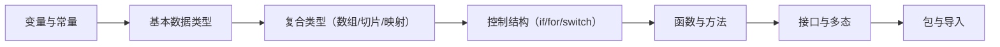

图1：Go基础语法学习路径概览

## 本章概述

本章将深入学习Go语言的基础语法和类型系统，通过分析New-API项目中的实际代码，掌握Go语言的核心语法特性。我们将学习变量声明、数据类型、控制结构、函数定义、结构体、接口等重要概念，并了解Go语言独特的设计哲学。

## 2.1 变量声明与初始化

### 2.1.1 变量声明的多种方式

Go语言提供了多种变量声明方式，让我们通过New-API项目中的实际代码来学习：

#### 使用var关键字声明

```go
// common/constants.go - 全局变量声明
package common

import "time"

// 单个变量声明
var StartTime = time.Now().Unix()
var Version = "v0.0.0"

// 批量变量声明
var (
    DebugEnabled      bool
    MemoryCacheEnabled bool
    LogConsumeEnabled  = true
    
    SMTPServer      = ""
    SMTPPort        = 587
    SMTPSSLEnabled  = false
)

// 带类型的变量声明
var (
    GlobalApiRateLimitEnable   bool
    GlobalApiRateLimitNum      int
    GlobalApiRateLimitDuration int64
)
```

#### 短变量声明（:=）

**短变量声明**是Go语言的一个便利特性，使用`:=`操作符可以同时声明变量并初始化，编译器会根据右侧的值自动推导变量类型。

**特点：**
- 只能在函数内部使用（不能用于包级别变量）
- 自动进行类型推导
- 左侧必须至少有一个新变量
- 可以同时声明多个变量

**类型推导规则：**
- 整数字面量默认推导为`int`类型
- 浮点数字面量默认推导为`float64`类型
- 字符串字面量推导为`string`类型
- 布尔字面量推导为`bool`类型
- 复数字面量推导为`complex128`类型

```go
// main.go中的示例
func main() {
    // 短变量声明，类型自动推导
    port := os.Getenv("PORT")  // string类型
    if port == "" {
        port = strconv.Itoa(*common.Port)
    }
    
    // 多变量同时声明
    frequency, err := strconv.Atoi(os.Getenv("CHANNEL_UPDATE_FREQUENCY"))
    // frequency推导为int类型，err推导为error类型
    if err != nil {
        common.FatalLog("failed to parse CHANNEL_UPDATE_FREQUENCY: " + err.Error())
    }
    
    // 类型推导示例
    name := "Alice"           // string
    age := 25                 // int
    height := 1.75            // float64
    isStudent := true         // bool
    
    // 重新赋值时必须至少有一个新变量
    name, email := "Bob", "bob@example.com"  // name重新赋值，email是新变量
}

// 类型推导的边界情况
func typeInferenceExamples() {
    // 显式类型转换
    var smallInt int8 = 100
    var bigInt int64 = int64(smallInt)  // 必须显式转换
    
    // 常量的类型推导
    const pi = 3.14159  // 无类型常量
    var radius float32 = 2.0
    area := pi * radius * radius  // pi被推导为float32
}
```

#### 零值初始化

**零值（Zero Value）**是Go语言的一个重要概念，指的是变量在声明但未显式初始化时的默认值。Go语言保证所有变量都有一个明确的零值，这避免了未初始化变量的问题。

**各类型的零值：**
- 数值类型：`0`
- 布尔类型：`false`
- 字符串类型：`""` (空字符串)
- 指针、切片、映射、通道、函数、接口：`nil`
- 数组和结构体：所有元素/字段都是对应类型的零值

```go
// model/user.go - 结构体零值示例
type User struct {
    Id          int    // 零值：0
    Username    string // 零值：""
    Role        int    // 零值：0
    Status      int    // 零值：0
    AccessToken string // 零值：""
    Quota       int64  // 零值：0
}

func CreateDefaultUser() *User {
    var user User // 所有字段都是零值
    // user.Id = 0, user.Username = "", etc.
    return &user
}

// 零值的实际应用
func demonstrateZeroValues() {
    var i int        // 0
    var f float64    // 0.0
    var b bool       // false
    var s string     // ""
    var p *int       // nil
    var slice []int  // nil (但len(slice) == 0)
    var m map[string]int // nil
    
    fmt.Printf("int零值: %d\n", i)           // 0
    fmt.Printf("float64零值: %f\n", f)       // 0.000000
    fmt.Printf("bool零值: %t\n", b)          // false
    fmt.Printf("string零值: '%s'\n", s)      // ''
    fmt.Printf("指针零值: %v\n", p)          // <nil>
    fmt.Printf("切片零值: %v\n", slice)      // []
    fmt.Printf("映射零值: %v\n", m)          // map[]
}
```

### 2.1.2 常量声明

#### 普通常量

```go
// common/constants.go - 常量定义
const (
    RequestIdKey = "X-Oneapi-Request-Id"
)

// 角色常量
const (
    RoleGuestUser  = 0
    RoleCommonUser = 1
    RoleAdminUser  = 10
    RoleRootUser   = 100
)
```

#### 枚举常量（iota）

**iota**是Go语言中用于创建枚举常量的预声明标识符。在每个`const`声明块中，iota从0开始，每行递增1。

**iota的特性：**
- 在每个`const`关键字出现时重置为0
- 在同一个`const`声明块中，每一行iota值递增1
- 可以参与表达式运算
- 支持跳过某些值
- 常用于定义枚举类型

```go
// 基本用法：状态枚举
const (
    UserStatusEnabled  = 1 + iota // 1 (0+1)
    UserStatusDisabled            // 2 (1+1)
)

const (
    TokenStatusEnabled = 1 + iota // 1 (0+1，新的const块，iota重置为0)
    TokenStatusDisabled           // 2 (1+1)
    TokenStatusExpired            // 3 (2+1)
    TokenStatusExhausted          // 4 (3+1)
)

// 从0开始的枚举
const (
    ChannelStatusUnknown = iota   // 0
    ChannelStatusEnabled          // 1
    ChannelStatusManuallyDisabled // 2
    ChannelStatusAutoDisabled     // 3
)

// iota的高级用法
const (
    _  = iota             // 0，使用_跳过
    KB = 1 << (10 * iota) // 1 << (10 * 1) = 1024
    MB                    // 1 << (10 * 2) = 1048576
    GB                    // 1 << (10 * 3) = 1073741824
    TB                    // 1 << (10 * 4) = 1099511627776
)

// 权限位掩码
const (
    ReadPermission   = 1 << iota // 1 (二进制: 001)
    WritePermission              // 2 (二进制: 010)
    ExecutePermission            // 4 (二进制: 100)
)

// 工作日枚举
const (
    Sunday = iota    // 0
    Monday           // 1
    Tuesday          // 2
    Wednesday        // 3
    Thursday         // 4
    Friday           // 5
    Saturday         // 6
)

// 使用示例
func demonstrateIota() {
    fmt.Printf("KB = %d bytes\n", KB)  // KB = 1024 bytes
    fmt.Printf("MB = %d bytes\n", MB)  // MB = 1048576 bytes
    
    // 权限组合
    fullPermission := ReadPermission | WritePermission | ExecutePermission
    fmt.Printf("Full permission: %d\n", fullPermission) // 7 (111 in binary)
}
```

### 2.1.3 作用域规则

Go语言的作用域规则清晰明确：

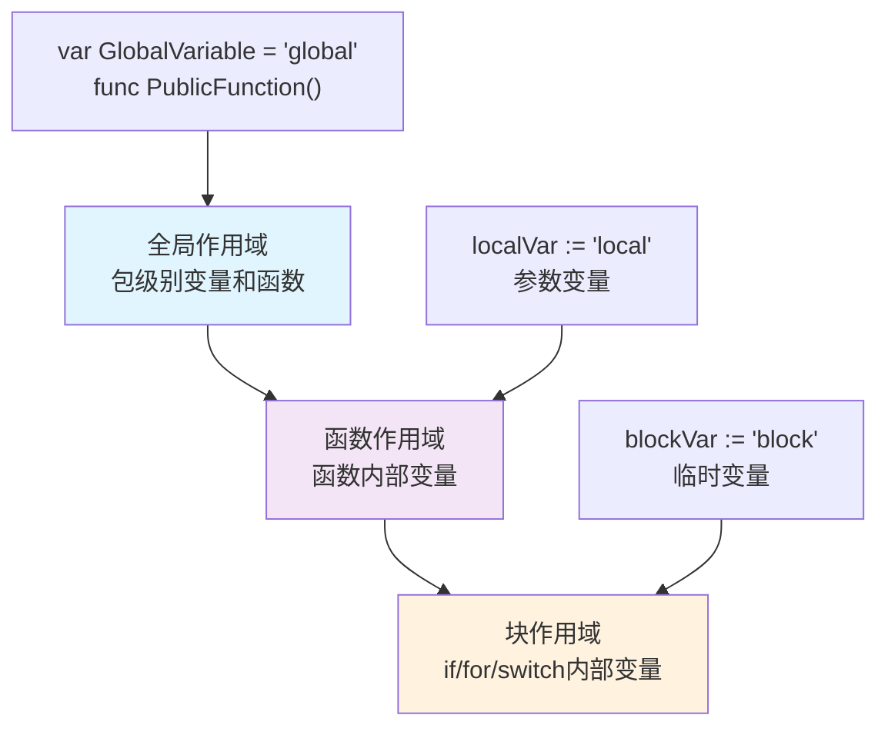

图2：Go语言变量作用域层次结构

```go
// 包级别作用域
package common

var GlobalVariable = "全局可见"
var internalVariable = "包内可见" // 小写开头

func PublicFunction() {    // 大写开头，公开函数
    // 函数级别作用域
    localVar := "局部变量"
    
    if true {
        // 块级别作用域
        blockVar := "块级变量"
        fmt.Println(blockVar)
    }
    // blockVar在此处不可见
    
    fmt.Println(localVar)
}

func internalFunction() {  // 小写开头，包内函数
    // 只在包内可见
}
```

## 2.2 基本数据类型

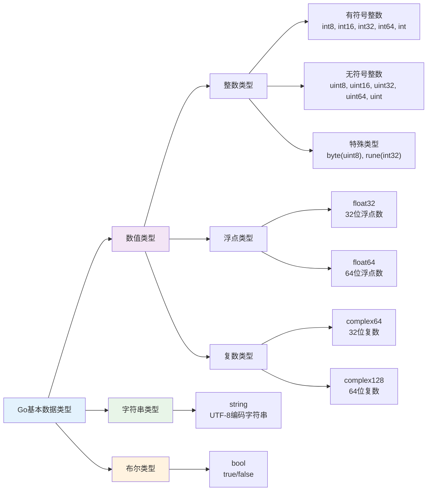

图3：Go语言基本数据类型体系

### 2.2.1 数值类型

#### 整数类型

```go
// common/constants.go中的整数使用示例
var (
    QuotaPerUnit        = 500 * 1000.0  // float64
    ItemsPerPage        = 10            // int
    MaxRecentItems      = 100           // int
    SyncFrequency       int             // int类型声明
    BatchUpdateInterval int             // int类型声明
)

// 不同大小的整数类型
var (
    smallNumber  int8  = 127        // -128 到 127
    mediumNumber int16 = 32767      // -32768 到 32767
    largeNumber  int32 = 2147483647 // -2^31 到 2^31-1
    hugeNumber   int64 = 9223372036854775807 // -2^63 到 2^63-1
)

// 无符号整数
var (
    positiveSmall  uint8  = 255
    positiveMedium uint16 = 65535
    positiveLarge  uint32 = 4294967295
    positiveHuge   uint64 = 18446744073709551615
)
```

#### 浮点类型

```go
// 浮点数使用示例
var (
    QuotaForNewUser             = 0      // int
    ChannelDisableThreshold     = 5.0    // float64
    QuotaRemindThreshold        = 1000   // int
    PreConsumedQuota           = 500     // int
)

// 显式浮点类型声明
var (
    price32 float32 = 19.99
    price64 float64 = 199.99
)
```

### 2.2.2 字符串类型

#### 字符串声明和操作

```go
// common/constants.go中的字符串示例
var (
    SystemName = "New API"
    Footer     = ""
    Logo       = ""
    TopUpLink  = ""
)

// 字符串常用操作
func stringOperations() {
    // 字符串拼接
    message := "Hello, " + "World!"
    
    // 使用fmt.Sprintf格式化
    formatted := fmt.Sprintf("User %d has %d tokens", 1, 100)
    
    // 字符串比较
    if message == "Hello, World!" {
        fmt.Println("字符串匹配")
    }
    
    // 字符串包含检查
    if strings.Contains(message, "Hello") {
        fmt.Println("包含Hello")
    }
}
```

#### 多行字符串和原始字符串

```go
// 原始字符串字面量（反引号）
const SQLQuery = `
SELECT id, username, display_name 
FROM users 
WHERE status = ? 
ORDER BY created_time DESC
`

// 多行字符串拼接
func buildErrorMessage(err error) string {
    return fmt.Sprintf(
        "操作失败：%s\n" +
        "请检查输入参数\n" +
        "如果问题持续，请联系管理员",
        err.Error(),
    )
}
```

### 2.2.3 布尔类型

```go
// common/constants.go中的布尔类型使用
var (
    PasswordLoginEnabled         = true
    PasswordRegisterEnabled      = true
    EmailVerificationEnabled     = false
    GitHubOAuthEnabled          = false
    RegisterEnabled             = true
    EmailDomainRestrictionEnabled = false
    EmailAliasRestrictionEnabled  = false
)

// 布尔逻辑运算
func validateUser(user *User) bool {
    return user != nil && 
           user.Username != "" && 
           user.Status == UserStatusEnabled &&
           (user.Role == RoleCommonUser || user.Role == RoleAdminUser)
}
```

## 2.3 复合数据类型

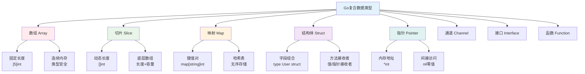

图4：Go语言复合数据类型概览

### 2.3.1 数组和切片

#### 数组定义和使用

```go
// 固定长度数组
func arrayExample() {
    // 声明并初始化数组
    var numbers [5]int = [5]int{1, 2, 3, 4, 5}
    
    // 简化写法
    colors := [3]string{"red", "green", "blue"}
    
    // 让编译器推断长度
    days := [...]string{"Mon", "Tue", "Wed", "Thu", "Fri"}
    
    fmt.Printf("数组长度: %d\n", len(numbers))
}
```

#### 切片定义和操作

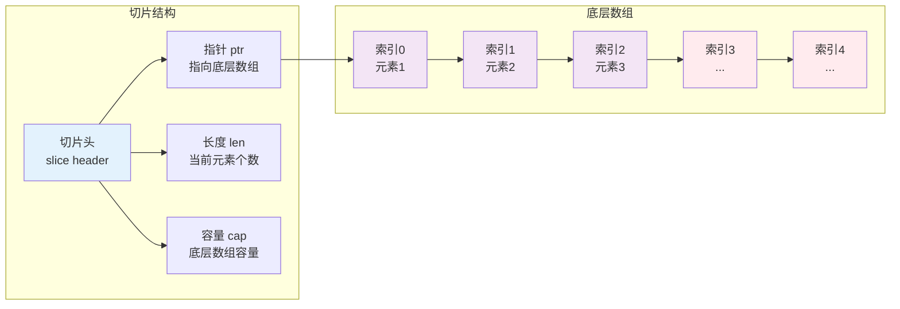

图5：Go切片内存布局结构

```go
// common/constants.go中的切片示例
var EmailDomainWhitelist = []string{
    "gmail.com",
    "163.com",
    "126.com",
    "qq.com",
    "outlook.com",
    "hotmail.com",
    "icloud.com",
    "yahoo.com",
    "foxmail.com",
}

var EmailLoginAuthServerList = []string{
    "smtp.sendcloud.net",
    "smtp.azurecomm.net",
}

// 切片操作示例
func sliceOperations() {
    // 创建切片
    numbers := []int{1, 2, 3, 4, 5}
    
    // 追加元素
    numbers = append(numbers, 6, 7, 8)
    
    // 切片操作
    subset := numbers[1:4] // [2, 3, 4]
    
    // 切片复制
    backup := make([]int, len(numbers))
    copy(backup, numbers)
    
    // 遍历切片
    for index, value := range numbers {
        fmt.Printf("Index: %d, Value: %d\n", index, value)
    }
}
```

#### New-API项目中的实际切片应用

```go
// model/user.go - 用户列表查询
func GetUsersList(startIdx int, num int, order string, role int) ([]*User, error) {
    var users []*User  // 切片声明
    var err error
    
    query := DB.Select("id", "username", "display_name", "role", "status", "access_token", "quota", "created_time")
    
    if role != -1 {
        query = query.Where("role = ?", role)
    }
    
    err = query.Order(order).Limit(num).Offset(startIdx).Find(&users).Error
    return users, err
}
```

### 2.3.2 映射（Map）

#### Map的声明和初始化

```go
// common/constants.go中的Map使用
var OptionMap map[string]string
var OptionMapRWMutex sync.RWMutex

// 初始化Map
func initializeMap() {
    // 使用make创建Map
    OptionMap = make(map[string]string)
    
    // 直接初始化
    configMap := map[string]string{
        "debug":    "true",
        "port":     "3000",
        "database": "sqlite",
    }
    
    // 添加键值对
    configMap["redis"] = "enabled"
}
```

#### Map操作示例

```go
// model/option.go中的Map操作
func UpdateOption(key string, value string) error {
    option := Option{
        Key:   key,
        Value: value,
    }
    
    // 更新数据库
    err := DB.Save(&option).Error
    if err != nil {
        return err
    }
    
    // 更新缓存Map
    OptionMapRWMutex.Lock()
    OptionMap[key] = value  // Map赋值
    OptionMapRWMutex.Unlock()
    
    return nil
}

func GetOption(key string, defaultValue string) string {
    OptionMapRWMutex.RLock()
    defer OptionMapRWMutex.RUnlock()
    
    // Map查找，返回值和存在标志
    if value, exists := OptionMap[key]; exists {
        return value
    }
    return defaultValue
}
```

### 2.3.3 结构体（Struct）

#### 结构体定义

```go
// model/user.go - 用户结构体
type User struct {
    Id          int    `json:"id" gorm:"primaryKey"`
    Username    string `json:"username" gorm:"unique;index"`
    Password    string `json:"password" gorm:"not null"`
    DisplayName string `json:"display_name"`
    Role        int    `json:"role" gorm:"default:1"`
    Status      int    `json:"status" gorm:"default:1"`
    AccessToken string `json:"access_token"`
    Quota       int64  `json:"quota" gorm:"default:0"`
    CreatedTime int64  `json:"created_time" gorm:"autoCreateTime"`
}

// model/channel.go - 渠道结构体
type Channel struct {
    Id                 int     `json:"id" gorm:"primaryKey"`
    Type               int     `json:"type" gorm:"default:0;index"`
    Key                string  `json:"key" gorm:"type:text"`
    Status             int     `json:"status" gorm:"default:1"`
    Name               string  `json:"name" gorm:"index"`
    Weight             *uint   `json:"weight" gorm:"default:0"`
    CreatedTime        int64   `json:"created_time" gorm:"autoCreateTime"`
    TestTime           int64   `json:"test_time"`
    ResponseTime       int     `json:"response_time"`
    BaseURL            *string `json:"base_url" gorm:"column:base_url;default:null"`
    Other              string  `json:"other"`
    Balance            float64 `json:"balance"`
    BalanceUpdatedTime int64   `json:"balance_updated_time"`
    Models             string  `json:"models"`
    Group              string  `json:"group" gorm:"type:varchar(32);default:'default'"`
    UsedQuota          int64   `json:"used_quota" gorm:"bigint;default:0"`
    ModelMapping       *string `json:"model_mapping" gorm:"type:varchar(1024);default:null"`
}
```

#### 结构体方法

```go
// model/user.go - 用户结构体方法
func (user *User) Insert() error {
    return DB.Create(user).Error
}

func (user *User) Update(updatePassword bool) error {
    if updatePassword {
        return DB.Model(user).Select("password", "display_name", "role", "status", "access_token", "quota").Updates(user).Error
    } else {
        return DB.Model(user).Select("display_name", "role", "status", "access_token", "quota").Updates(user).Error
    }
}

func (user *User) Delete() error {
    return DB.Delete(user).Error
}

// 验证密码方法
func (user *User) ValidatePassword(password string) bool {
    return bcrypt.CompareHashAndPassword([]byte(user.Password), []byte(password)) == nil
}
```

#### 结构体嵌套和组合

```go
// 基础结构体
type BaseModel struct {
    ID        uint      `json:"id" gorm:"primaryKey"`
    CreatedAt time.Time `json:"created_at"`
    UpdatedAt time.Time `json:"updated_at"`
}

// 嵌套结构体
type UserProfile struct {
    BaseModel             // 嵌入BaseModel
    UserID    int    `json:"user_id"`
    Avatar    string `json:"avatar"`
    Bio       string `json:"bio"`
    Settings  UserSettings `json:"settings"` // 嵌套另一个结构体
}

type UserSettings struct {
    Theme        string `json:"theme"`
    Language     string `json:"language"`
    Notification bool   `json:"notification"`
}
```

#### 结构体标签（Tags）

```go
// 结构体标签的使用
type APIResponse struct {
    Success bool        `json:"success"`
    Message string      `json:"message"`
    Data    interface{} `json:"data,omitempty"`    // omitempty：空值时省略
    Code    int         `json:"code" example:"200"` // 用于API文档生成
}

// GORM标签示例
type Model struct {
    ID          uint   `gorm:"primaryKey;autoIncrement"`
    Name        string `gorm:"size:255;not null;index"`
    Description string `gorm:"type:text"`
    Price       float64 `gorm:"precision:10;scale:2"`
}
```

### 2.3.4 指针

#### 指针基础

```go
// 指针声明和使用
func pointerBasics() {
    // 声明变量
    var number int = 42
    
    // 声明指针
    var ptr *int = &number  // 获取number的地址
    
    fmt.Printf("变量值: %d\n", number)     // 42
    fmt.Printf("变量地址: %p\n", &number)   // 0x...
    fmt.Printf("指针值: %p\n", ptr)       // 0x...
    fmt.Printf("指针指向的值: %d\n", *ptr)  // 42
    
    // 通过指针修改值
    *ptr = 100
    fmt.Printf("修改后的值: %d\n", number) // 100
}
```

#### 结构体指针

```go
// model/channel.go中的指针使用
type Channel struct {
    Weight       *uint   `json:"weight" gorm:"default:0"`        // 指针类型，可以为nil
    BaseURL      *string `json:"base_url" gorm:"default:null"`   // 指针类型，可以为nil
    ModelMapping *string `json:"model_mapping" gorm:"default:null"`
}

// 处理结构体指针
func handleChannel(channel *Channel) {
    if channel == nil {
        return
    }
    
    // 检查指针字段是否为nil
    if channel.BaseURL != nil {
        fmt.Printf("Base URL: %s\n", *channel.BaseURL)
    }
    
    if channel.Weight != nil {
        fmt.Printf("Weight: %d\n", *channel.Weight)
    }
}

// 创建指针的辅助函数
func StringPtr(s string) *string {
    return &s
}

func UintPtr(u uint) *uint {
    return &u
}
```

#### 指针在函数参数中的使用

```go
// 值传递 vs 指针传递
func modifyByValue(user User) {
    user.Username = "modified"  // 不会影响原始值
}

func modifyByPointer(user *User) {
    user.Username = "modified"  // 会修改原始值
}

func example() {
    user := User{Username: "original"}
    
    modifyByValue(user)
    fmt.Println(user.Username)  // "original"
    
    modifyByPointer(&user)
    fmt.Println(user.Username)  // "modified"
}
```

## 2.4 控制结构

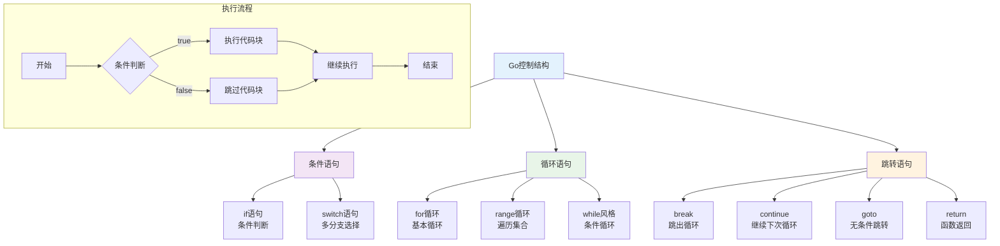

图6：Go语言控制结构概览

### 2.4.1 条件语句

#### if语句的多种形式

```go
// main.go中的if语句示例
func main() {
    // 基本if语句
    if os.Getenv("GIN_MODE") != "debug" {
        gin.SetMode(gin.ReleaseMode)
    }
    
    // if语句带初始化
    if port := os.Getenv("PORT"); port == "" {
        port = strconv.Itoa(*common.Port)
    }
    
    // if-else语句
    if common.DebugEnabled {
        common.SysLog("running in debug mode")
    } else {
        common.SysLog("running in release mode")
    }
    
    // if-else if-else语句
    if common.RedisEnabled {
        common.MemoryCacheEnabled = true
        common.SysLog("Redis enabled, memory cache enabled")
    } else if common.MemoryCacheEnabled {
        common.SysLog("memory cache enabled")
    } else {
        common.SysLog("no cache enabled")
    }
}
```

#### 错误处理中的if语句

```go
// 典型的Go错误处理模式
func processUser(id int) error {
    user, err := GetUserById(id, true)
    if err != nil {
        return fmt.Errorf("获取用户失败: %w", err)
    }
    
    if user == nil {
        return errors.New("用户不存在")
    }
    
    if user.Status != UserStatusEnabled {
        return errors.New("用户已被禁用")
    }
    
    // 处理用户逻辑...
    return nil
}
```

### 2.4.2 循环语句

#### for循环的多种形式

```go
// 基本for循环
func basicFor() {
    for i := 0; i < 10; i++ {
        fmt.Printf("数字: %d\n", i)
    }
}

// while风格的for循环
func whileStyleFor() {
    i := 0
    for i < 10 {
        fmt.Printf("数字: %d\n", i)
        i++
    }
}

// 无限循环
func infiniteLoop() {
    for {
        // 检查停止条件
        if shouldStop() {
            break
        }
        // 执行逻辑...
        time.Sleep(time.Second)
    }
}
```

#### range循环

```go
// 遍历切片
func rangeSlice() {
    users := []string{"alice", "bob", "charlie"}
    
    // 获取索引和值
    for index, name := range users {
        fmt.Printf("索引: %d, 用户: %s\n", index, name)
    }
    
    // 只获取值
    for _, name := range users {
        fmt.Printf("用户: %s\n", name)
    }
    
    // 只获取索引
    for index := range users {
        fmt.Printf("索引: %d\n", index)
    }
}

// 遍历Map
func rangeMap() {
    config := map[string]string{
        "host": "localhost",
        "port": "3000",
        "db":   "sqlite",
    }
    
    for key, value := range config {
        fmt.Printf("%s: %s\n", key, value)
    }
}

// 遍历字符串
func rangeString() {
    text := "Hello, 世界"
    for index, char := range text {
        fmt.Printf("位置: %d, 字符: %c\n", index, char)
    }
}
```

#### 实际项目中的循环应用

```go
// model/main.go中的并发数据库迁移
func migrateDBFast() error {
    var wg sync.WaitGroup
    
    migrations := []struct {
        model interface{}
        name  string
    }{
        {&Channel{}, "Channel"},
        {&Token{}, "Token"},
        {&User{}, "User"},
        // ... 更多迁移项
    }
    
    errChan := make(chan error, len(migrations))
    
    // 使用range遍历迁移项
    for _, m := range migrations {
        wg.Add(1)
        go func(model interface{}, name string) {
            defer wg.Done()
            if err := DB.AutoMigrate(model); err != nil {
                errChan <- fmt.Errorf("failed to migrate %s: %v", name, err)
            }
        }(m.model, m.name)
    }
    
    wg.Wait()
    close(errChan)
    
    // 检查错误
    for err := range errChan {
        if err != nil {
            return err
        }
    }
    return nil
}
```

### 2.4.3 switch语句

#### 基本switch语句

```go
// 基于值的switch
func handleUserRole(role int) string {
    switch role {
    case RoleGuestUser:
        return "访客用户"
    case RoleCommonUser:
        return "普通用户"
    case RoleAdminUser:
        return "管理员"
    case RoleRootUser:
        return "超级管理员"
    default:
        return "未知角色"
    }
}

// 多值case
func isWeekend(day string) bool {
    switch day {
    case "Saturday", "Sunday":
        return true
    default:
        return false
    }
}
```

#### 表达式switch

```go
// 不带表达式的switch，类似于if-else链
func getUserStatus(user *User) string {
    switch {
    case user == nil:
        return "用户不存在"
    case user.Status == UserStatusDisabled:
        return "用户已禁用"
    case user.Quota <= 0:
        return "配额已用完"
    case user.Role == RoleAdminUser:
        return "管理员用户"
    default:
        return "普通用户"
    }
}
```

#### 类型switch

```go
// 处理interface{}类型
func processValue(value interface{}) {
    switch v := value.(type) {
    case string:
        fmt.Printf("字符串: %s\n", v)
    case int:
        fmt.Printf("整数: %d\n", v)
    case float64:
        fmt.Printf("浮点数: %.2f\n", v)
    case []string:
        fmt.Printf("字符串切片，长度: %d\n", len(v))
    case nil:
        fmt.Println("空值")
    default:
        fmt.Printf("未知类型: %T\n", v)
    }
}
```

## 2.5 函数定义与调用

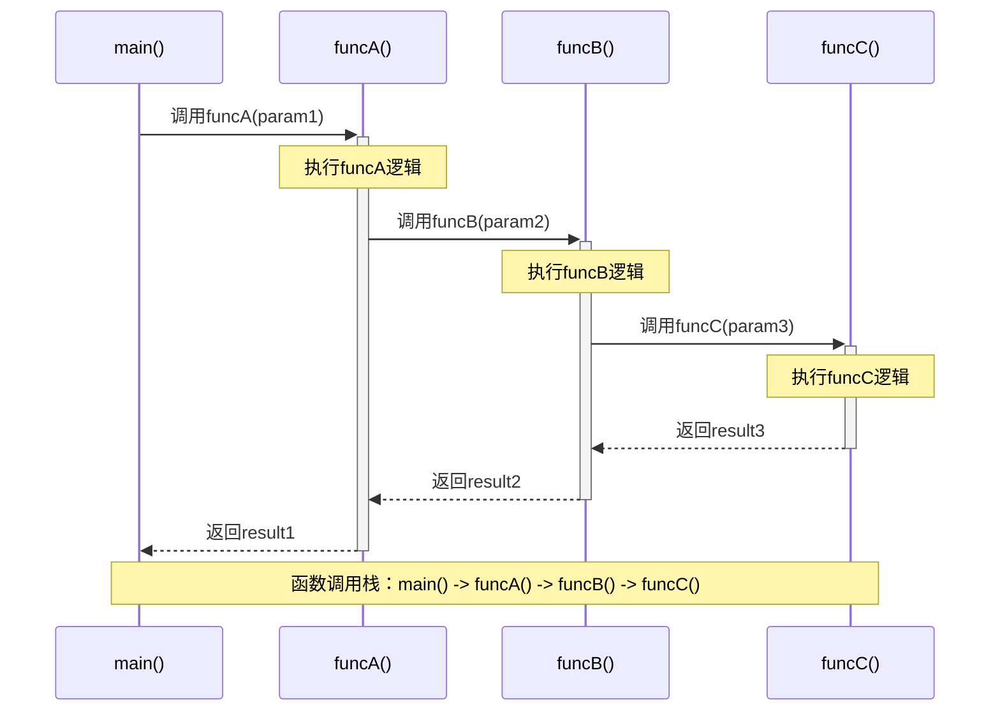

图7：Go函数调用栈时序图

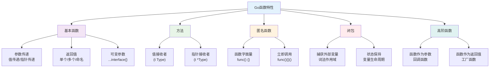

图8：Go函数系统特性概览

### 2.5.1 函数基础

#### 基本函数定义

```go
// common/utils.go中的工具函数
package common

import (
    "crypto/md5"
    "fmt"
    "strconv"
)

// 无参数，无返回值
func SysLog(message string) {
    logger.SysLog(message)
}

// 有参数，有返回值
func Password2Hash(password string) (string, error) {
    hashedPassword, err := bcrypt.GenerateFromPassword([]byte(password), bcrypt.DefaultCost)
    if err != nil {
        return "", err
    }
    return string(hashedPassword), nil
}

// 多个参数，多个返回值
func GetEnvOrDefault(key string, defaultValue int) int {
    if valueStr := os.Getenv(key); valueStr != "" {
        if value, err := strconv.Atoi(valueStr); err == nil {
            return value
        }
    }
    return defaultValue
}
```

#### 命名返回值

```go
// 命名返回值示例
func divide(dividend, divisor int) (quotient int, remainder int, err error) {
    if divisor == 0 {
        err = errors.New("除数不能为零")
        return // 相当于return 0, 0, err
    }
    
    quotient = dividend / divisor
    remainder = dividend % divisor
    return // 相当于return quotient, remainder, nil
}
```

#### 可变参数函数

```go
// 可变参数函数
func SysLog(args ...interface{}) {
    message := fmt.Sprint(args...)
    logger.SysLog(message)
}

func sum(numbers ...int) int {
    total := 0
    for _, num := range numbers {
        total += num
    }
    return total
}

// 使用示例
func example() {
    SysLog("用户", 123, "登录成功")
    
    result := sum(1, 2, 3, 4, 5)
    fmt.Println(result) // 15
    
    // 展开切片作为参数
    nums := []int{10, 20, 30}
    result = sum(nums...)
    fmt.Println(result) // 60
}
```

### 2.5.2 函数作为值

#### 函数变量

```go
// 函数类型声明
type HandlerFunc func(c *gin.Context)
type ValidationFunc func(interface{}) error

// 函数作为变量
func setupHandlers() {
    var loginHandler HandlerFunc = func(c *gin.Context) {
        // 登录处理逻辑
    }
    
    var registerHandler HandlerFunc = func(c *gin.Context) {
        // 注册处理逻辑
    }
    
    // 使用函数变量
    router.POST("/login", loginHandler)
    router.POST("/register", registerHandler)
}
```

#### 高阶函数

```go
// 接受函数作为参数
func withAuth(handler gin.HandlerFunc) gin.HandlerFunc {
    return func(c *gin.Context) {
        // 认证逻辑
        token := c.GetHeader("Authorization")
        if token == "" {
            c.JSON(http.StatusUnauthorized, gin.H{"error": "未授权"})
            return
        }
        
        // 验证token...
        handler(c) // 调用原处理函数
    }
}

// 返回函数的函数
func createValidator(minLength int) ValidationFunc {
    return func(data interface{}) error {
        if str, ok := data.(string); ok {
            if len(str) < minLength {
                return fmt.Errorf("长度不能少于%d个字符", minLength)
            }
        }
        return nil
    }
}

// 使用示例
func example() {
    // 创建验证函数
    usernameValidator := createValidator(3)
    passwordValidator := createValidator(8)
    
    // 使用验证函数
    if err := usernameValidator("ab"); err != nil {
        fmt.Println(err) // 长度不能少于3个字符
    }
}
```

### 2.5.3 匿名函数和闭包

#### 匿名函数

```go
// main.go中的匿名函数使用
func main() {
    // 立即调用的匿名函数
    func() {
        defer func() {
            if r := recover(); r != nil {
                common.SysLog(fmt.Sprintf("InitChannelCache panic: %v", r))
            }
        }()
        model.InitChannelCache()
    }()
    
    // 匿名函数作为goroutine
    go func() {
        for {
            time.Sleep(5 * time.Minute)
            // 定时任务逻辑
        }
    }()
}
```

#### 闭包

```go
// 闭包示例
func createCounter() func() int {
    count := 0
    return func() int {
        count++
        return count
    }
}

func closureExample() {
    // 创建计数器
    counter1 := createCounter()
    counter2 := createCounter()
    
    fmt.Println(counter1()) // 1
    fmt.Println(counter1()) // 2
    fmt.Println(counter2()) // 1 (独立的计数器)
}

// 实际应用：缓存函数
func memoize(fn func(int) int) func(int) int {
    cache := make(map[int]int)
    return func(arg int) int {
        if result, exists := cache[arg]; exists {
            return result
        }
        result := fn(arg)
        cache[arg] = result
        return result
    }
}
```

### 2.5.4 方法（Methods）

#### 方法定义

**方法（Method）**是Go语言中与特定类型关联的函数。方法通过接收者（receiver）与类型绑定，接收者定义了方法属于哪个类型。

**接收者类型：**
1. **值接收者（Value Receiver）**：`(u User)`
   - 方法操作的是接收者的副本
   - 无法修改原始值
   - 适用于不需要修改状态的方法
   - 内存开销较大（需要复制整个结构体）

2. **指针接收者（Pointer Receiver）**：`(u *User)`
   - 方法操作的是接收者的指针
   - 可以修改原始值
   - 适用于需要修改状态的方法
   - 内存开销较小（只传递指针）

**选择接收者类型的原则：**
- 需要修改接收者：使用指针接收者
- 接收者是大型结构体：使用指针接收者（避免复制开销）
- 接收者包含同步字段（如sync.Mutex）：必须使用指针接收者
- 为了保持一致性：如果某些方法使用指针接收者，其他方法也应该使用指针接收者

```go
// model/user.go - 结构体方法
type User struct {
    Id       int    `json:"id"`
    Username string `json:"username"`
    Password string `json:"password"`
    Role     int    `json:"role"`
}

// 指针接收者方法（可以修改结构体）
func (u *User) SetPassword(password string) error {
    hashedPassword, err := common.Password2Hash(password)
    if err != nil {
        return err
    }
    u.Password = hashedPassword  // 修改原始结构体
    return nil
}

// 值接收者方法（不能修改结构体）
func (u User) GetDisplayName() string {
    if u.Username != "" {
        return u.Username
    }
    return fmt.Sprintf("User%d", u.Id)
    // 注意：即使在这里修改u.Username，也不会影响原始结构体
}

// 指针接收者方法（验证密码）
func (u *User) ValidatePassword(password string) bool {
    return bcrypt.CompareHashAndPassword([]byte(u.Password), []byte(password)) == nil
}

// 值接收者方法（权限检查，不需要修改状态）
func (u User) HasPermission(requiredRole int) bool {
    return u.Role >= requiredRole
}
```

#### 方法调用

```go
func userMethodExample() {
    user := &User{
        Id:       1,
        Username: "alice",
        Role:     RoleCommonUser,
    }
    
    // 调用方法
    err := user.SetPassword("newpassword123")
    if err != nil {
        fmt.Printf("设置密码失败: %v\n", err)
        return
    }
    
    // 验证密码
    if user.ValidatePassword("newpassword123") {
        fmt.Println("密码验证成功")
    }
    
    // 检查权限
    if user.HasPermission(RoleAdminUser) {
        fmt.Println("用户是管理员")
    } else {
        fmt.Println("用户不是管理员")
    }
    
    // 获取显示名称
    displayName := user.GetDisplayName()
    fmt.Printf("用户显示名称: %s\n", displayName)
}
```

## 2.6 接口（Interface）

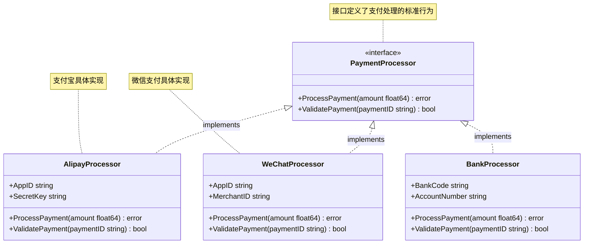

图9：Go接口实现关系图

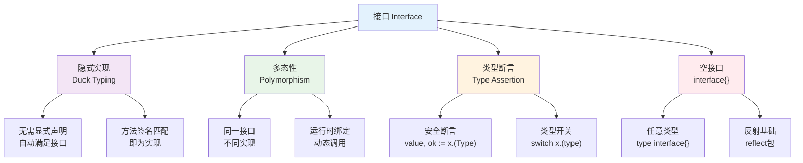

图10：Go接口特性概览

### 2.6.1 接口基础

**接口（Interface）**是Go语言的核心特性之一，它定义了一组方法的签名，描述了对象应该具有的行为。Go语言的接口采用**隐式实现**（Duck Typing）的方式，这是其独特之处。

**Go接口的特点：**
1. **隐式实现**：类型无需显式声明实现某个接口，只要实现了接口的所有方法即可
2. **Duck Typing**："如果它走起来像鸭子，叫起来像鸭子，那它就是鸭子"
3. **接口组合**：可以通过嵌入其他接口来组合新接口
4. **空接口**：`interface{}`可以表示任意类型
5. **多态性**：同一接口可以有不同的实现

#### 接口定义

```go
// 定义基础接口
type Writer interface {
    Write([]byte) (int, error)  // 方法签名：方法名、参数类型、返回值类型
}

type Reader interface {
    Read([]byte) (int, error)
}

// 接口组合（嵌入其他接口）
type ReadWriter interface {
    Reader  // 嵌入Reader接口
    Writer  // 嵌入Writer接口
    // ReadWriter接口包含Read和Write两个方法
}

// 空接口（可以表示任意类型）
type Any interface{} // 等价于 interface{}

// 更复杂的接口定义
type Closer interface {
    Close() error
}

// 组合多个接口
type ReadWriteCloser interface {
    Reader
    Writer
    Closer
}

// 接口中可以定义多个方法
type Database interface {
    Connect() error
    Query(sql string, args ...interface{}) ([]map[string]interface{}, error)
    Execute(sql string, args ...interface{}) (int64, error)
    Close() error
}
```

#### 接口实现

**隐式实现**是Go语言接口的核心特性。与Java、C#等语言不同，Go语言中的类型无需显式声明实现某个接口，只要类型实现了接口定义的所有方法，就自动满足该接口。

**隐式实现的优势：**
- **解耦**：接口定义和实现完全分离
- **灵活性**：可以为已存在的类型实现新接口
- **可测试性**：便于创建mock对象
- **组合性**：支持接口的灵活组合

```go
// 定义一个简单的接口
type Shape interface {
    Area() float64
    Perimeter() float64
}

// 矩形结构体
type Rectangle struct {
    Width, Height float64
}

// 实现Shape接口的方法（隐式实现）
func (r Rectangle) Area() float64 {
    return r.Width * r.Height
}

func (r Rectangle) Perimeter() float64 {
    return 2 * (r.Width + r.Height)
}

// 圆形结构体
type Circle struct {
    Radius float64
}

// 实现Shape接口的方法（隐式实现）
func (c Circle) Area() float64 {
    return 3.14159 * c.Radius * c.Radius
}

func (c Circle) Perimeter() float64 {
    return 2 * 3.14159 * c.Radius
}

// relay/channel/adapter.go中的接口定义
type Adapter interface {
    Init(info *RelayInfo, request *http.Request)
    GetRequestURL(info *RelayInfo) (string, error)
    SetupRequestHeader(c *gin.Context, req *http.Request, info *RelayInfo) error
    ConvertRequest(c *gin.Context, relayMode int, request *GeneralOpenAIRequest) (interface{}, error)
    DoRequest(c *gin.Context, info *RelayInfo, requestBody io.Reader) (*http.Response, error)
    ExtractResponse(resp *http.Response, info *RelayInfo) (*GeneralOpenAIResponse, *APIErrorWithStatusCode)
}

// OpenAI适配器实现（隐式实现Adapter接口）
type OpenAIAdapter struct {
    APIVersion string
    Model      string
}

func (oa *OpenAIAdapter) Init(info *RelayInfo, request *http.Request) {
    // 初始化逻辑
    oa.APIVersion = "v1"
}

func (oa *OpenAIAdapter) GetRequestURL(info *RelayInfo) (string, error) {
    return fmt.Sprintf("%s/v1/chat/completions", info.BaseURL), nil
}

// ... 实现其他接口方法

// 使用接口的多态性
func calculateShapeInfo(s Shape) {
    fmt.Printf("面积: %.2f\n", s.Area())
    fmt.Printf("周长: %.2f\n", s.Perimeter())
}

func demonstrateInterface() {
    // 创建不同的形状
    rect := Rectangle{Width: 10, Height: 5}
    circle := Circle{Radius: 3}
    
    // 多态性：同一接口，不同实现
    calculateShapeInfo(rect)   // Rectangle实现了Shape接口
    calculateShapeInfo(circle) // Circle实现了Shape接口
    
    // 接口切片
    shapes := []Shape{rect, circle}
    for _, shape := range shapes {
        calculateShapeInfo(shape)
    }
}
```

### 2.6.2 接口的多态性

#### 接口多态示例

```go
// 定义接口
type PaymentProcessor interface {
    ProcessPayment(amount float64) error
    ValidatePayment(paymentID string) bool
}

// 支付宝实现
type AlipayProcessor struct {
    AppID     string
    SecretKey string
}

func (a *AlipayProcessor) ProcessPayment(amount float64) error {
    // 支付宝支付逻辑
    fmt.Printf("支付宝处理支付: %.2f元\n", amount)
    return nil
}

func (a *AlipayProcessor) ValidatePayment(paymentID string) bool {
    // 验证支付宝支付
    return true
}

// 微信支付实现
type WeChatProcessor struct {
    AppID     string
    MerchantID string
}

func (w *WeChatProcessor) ProcessPayment(amount float64) error {
    // 微信支付逻辑
    fmt.Printf("微信支付处理支付: %.2f元\n", amount)
    return nil
}

func (w *WeChatProcessor) ValidatePayment(paymentID string) bool {
    // 验证微信支付
    return true
}

// 使用接口
func processOrder(processor PaymentProcessor, amount float64) error {
    return processor.ProcessPayment(amount)
}

func example() {
    alipay := &AlipayProcessor{AppID: "alipay123"}
    wechat := &WeChatProcessor{AppID: "wx123"}
    
    // 多态调用
    processOrder(alipay, 100.0) // 支付宝处理支付: 100.00元
    processOrder(wechat, 200.0) // 微信支付处理支付: 200.00元
}
```

### 2.6.3 类型断言和类型开关

#### 类型断言

```go
// 类型断言示例
func processInterface(value interface{}) {
    // 安全类型断言
    if str, ok := value.(string); ok {
        fmt.Printf("字符串值: %s\n", str)
    } else {
        fmt.Println("不是字符串类型")
    }
    
    // 不安全类型断言（可能panic）
    str := value.(string) // 如果value不是string会panic
    fmt.Println(str)
}

// 实际应用示例
func handleGinContext(c *gin.Context) {
    // 从上下文获取用户信息
    if userInterface, exists := c.Get("user"); exists {
        if user, ok := userInterface.(*User); ok {
            fmt.Printf("当前用户: %s\n", user.Username)
        }
    }
}
```

#### 类型开关

```go
// 类型开关示例
func describeValue(value interface{}) {
    switch v := value.(type) {
    case nil:
        fmt.Println("空值")
    case bool:
        fmt.Printf("布尔值: %t\n", v)
    case int:
        fmt.Printf("整数: %d\n", v)
    case string:
        fmt.Printf("字符串: %s\n", v)
    case []int:
        fmt.Printf("整数切片: %v\n", v)
    case map[string]int:
        fmt.Printf("字符串到整数的映射: %v\n", v)
    case *User:
        fmt.Printf("用户指针: %s\n", v.Username)
    default:
        fmt.Printf("未知类型: %T, 值: %v\n", v, v)
    }
}
```

### 2.6.4 标准库中的重要接口

#### error接口

```go
// error接口定义
type error interface {
    Error() string
}

// 自定义错误类型
type ValidationError struct {
    Field   string
    Message string
}

func (e *ValidationError) Error() string {
    return fmt.Sprintf("验证失败[%s]: %s", e.Field, e.Message)
}

// 使用自定义错误
func validateUser(user *User) error {
    if user.Username == "" {
        return &ValidationError{
            Field:   "username",
            Message: "用户名不能为空",
        }
    }
    
    if len(user.Password) < 8 {
        return &ValidationError{
            Field:   "password",
            Message: "密码长度不能少于8位",
        }
    }
    
    return nil
}
```

#### fmt.Stringer接口

```go
// fmt.Stringer接口
type Stringer interface {
    String() string
}

// 为User类型实现String方法
func (u User) String() string {
    return fmt.Sprintf("User{ID: %d, Username: %s, Role: %d}", u.Id, u.Username, u.Role)
}

func example() {
    user := User{Id: 1, Username: "alice", Role: RoleCommonUser}
    fmt.Println(user) // 自动调用String()方法
    // 输出: User{ID: 1, Username: alice, Role: 1}
}
```

## 2.7 包和导入

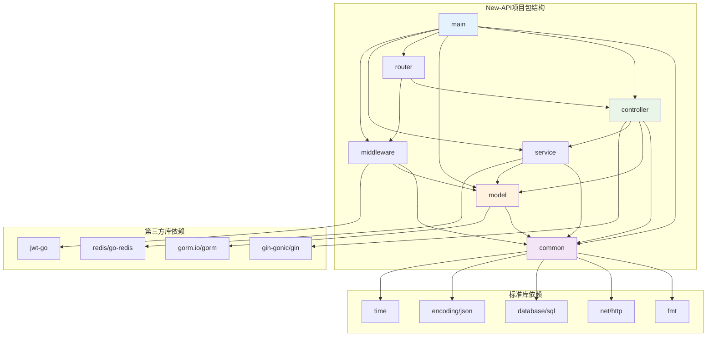

图11：New-API项目包依赖关系图

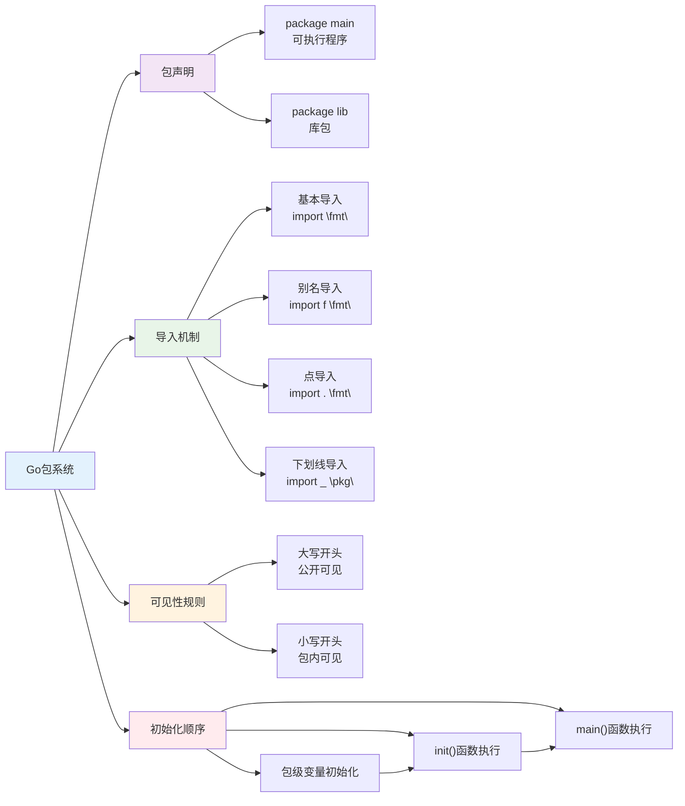

图12：Go包系统特性概览

### 2.7.1 包的概念

#### 包声明

```go
// 每个Go文件都必须以package声明开始
package main     // 可执行程序的包
package common   // 库包
package model    // 数据模型包
```

#### 包的可见性

```go
package user

// 公开的（大写开头）
type User struct {
    ID   int    // 公开字段
    Name string // 公开字段
    age  int    // 私有字段（小写开头）
}

// 公开函数
func CreateUser(name string) *User {
    return &User{Name: name}
}

// 私有函数
func validateAge(age int) bool {
    return age >= 0 && age <= 150
}

// 公开方法
func (u *User) GetName() string {
    return u.Name
}

// 私有方法
func (u *User) setAge(age int) {
    if validateAge(age) {
        u.age = age
    }
}
```

### 2.7.2 导入语句

#### 基本导入

```go
// main.go中的导入示例
import (
    // 标准库
    "embed"
    "fmt"
    "log"
    "net/http"
    "os"
    "strconv"
    
    // 本地包
    "one-api/common"
    "one-api/controller"
    "one-api/middleware"
    "one-api/model"
    "one-api/router"
    "one-api/service"
    
    // 第三方包
    "github.com/bytedance/gopkg/util/gopool"
    "github.com/gin-contrib/sessions"
    "github.com/gin-contrib/sessions/cookie"
    "github.com/gin-gonic/gin"
    "github.com/joho/godotenv"
    
    // 仅初始化导入
    _ "net/http/pprof"
)
```

#### 导入别名

```go
import (
    // 包别名
    jsoniter "github.com/json-iterator/go"
    
    // 点导入（将包内容导入当前命名空间，不推荐）
    . "fmt"
    
    // 下划线导入（仅执行包的init函数）
    _ "github.com/go-sql-driver/mysql"
)

func example() {
    // 使用别名
    json := jsoniter.ConfigCompatibleWithStandardLibrary
    data, _ := json.Marshal(map[string]string{"key": "value"})
    
    // 点导入的使用（不推荐）
    Println("Hello") // 相当于fmt.Println("Hello")
}
```

#### New-API项目中的重要第三方库

**Web框架类：**
- **Gin** (`github.com/gin-gonic/gin`)：高性能的HTTP Web框架
  - 特点：轻量级、高性能、中间件支持、JSON验证
  - 用途：构建RESTful API、处理HTTP请求

- **Gin Sessions** (`github.com/gin-contrib/sessions`)：Gin的会话管理中间件
  - 特点：支持多种存储后端（内存、Redis、数据库）
  - 用途：用户会话管理、状态保持

**数据库相关：**
- **GORM** (`gorm.io/gorm`)：Go语言的ORM库
  - 特点：全功能ORM、自动迁移、关联、钩子、事务
  - 用途：数据库操作、模型定义、查询构建

- **MySQL Driver** (`github.com/go-sql-driver/mysql`)：MySQL数据库驱动
  - 特点：纯Go实现、高性能、连接池支持
  - 用途：连接MySQL数据库（通过下划线导入注册驱动）

**缓存和存储：**
- **Redis Client** (`github.com/go-redis/redis/v8`)：Redis客户端
  - 特点：支持集群、管道、发布订阅、Lua脚本
  - 用途：缓存、会话存储、分布式锁

**工具库：**
- **JSON Iterator** (`github.com/json-iterator/go`)：高性能JSON库
  - 特点：比标准库快2-3倍、完全兼容标准库API
  - 用途：JSON序列化和反序列化

- **GoDotEnv** (`github.com/joho/godotenv`)：环境变量加载
  - 特点：从.env文件加载环境变量
  - 用途：配置管理、环境变量处理

- **GoPool** (`github.com/bytedance/gopkg/util/gopool`)：协程池
  - 特点：高性能协程池、内存复用
  - 用途：控制协程数量、提高性能

**安全相关：**
- **JWT** (`github.com/golang-jwt/jwt/v5`)：JSON Web Token实现
  - 特点：支持多种签名算法、安全可靠
  - 用途：用户认证、API鉴权

- **bcrypt** (`golang.org/x/crypto/bcrypt`)：密码哈希
  - 特点：自适应哈希函数、抗彩虹表攻击
  - 用途：密码加密存储

**使用示例：**

```go
package main

import (
    "github.com/gin-gonic/gin"
    "github.com/go-redis/redis/v8"
    "gorm.io/gorm"
    "gorm.io/driver/mysql"
    jsoniter "github.com/json-iterator/go"
)

// 初始化各种组件
func initComponents() {
    // 初始化Gin引擎
    r := gin.Default()
    
    // 初始化Redis客户端
    rdb := redis.NewClient(&redis.Options{
        Addr: "localhost:6379",
    })
    
    // 初始化GORM数据库连接
    db, err := gorm.Open(mysql.Open("dsn"), &gorm.Config{})
    if err != nil {
        panic("failed to connect database")
    }
    
    // 使用高性能JSON库
    json := jsoniter.ConfigCompatibleWithStandardLibrary
    data, _ := json.Marshal(map[string]interface{}{
        "message": "Hello World",
        "status":  200,
    })
    
    // 设置路由
    r.GET("/api/health", func(c *gin.Context) {
        c.JSON(200, gin.H{"status": "ok"})
    })
    
    // 启动服务器
    r.Run(":8080")
}
```

### 2.7.3 init函数

```go
// common/init.go - 包初始化函数
package common

import (
    "log"
    "os"
)

// init函数在包被导入时自动调用
func init() {
    // 设置日志格式
    log.SetFlags(log.LstdFlags | log.Lshortfile)
    
    // 创建必要的目录
    if _, err := os.Stat("logs"); os.IsNotExist(err) {
        os.MkdirAll("logs", 0755)
    }
    
    if _, err := os.Stat("data"); os.IsNotExist(err) {
        os.MkdirAll("data", 0755)
    }
}

// 可以有多个init函数，按声明顺序执行
func init() {
    SysLog("Common package initialized")
}
```

### 2.7.4 New-API项目核心业务概念

在New-API项目中，有几个核心的业务概念需要深入理解。这些概念不仅体现了Go语言的类型系统设计，也展现了企业级应用的业务逻辑建模。

#### 用户角色系统（Role-Based Access Control）

**用户角色**是New-API项目中权限管理的核心概念，采用基于角色的访问控制（RBAC）模式：

```go
// 用户角色常量定义
const (
    RoleGuestUser  = 0   // 访客用户：只能查看公开信息
    RoleCommonUser = 1   // 普通用户：可以使用API服务，管理自己的令牌
    RoleAdminUser  = 10  // 管理员：可以管理用户、渠道、系统配置
    RoleRootUser   = 100 // 超级管理员：拥有所有权限
)

// 用户结构体中的角色字段
type User struct {
    Id          int    `json:"id" gorm:"primaryKey"`
    Username    string `json:"username" gorm:"unique;index"`
    Role        int    `json:"role" gorm:"default:1"` // 默认为普通用户
    Status      int    `json:"status" gorm:"default:1"`
    AccessToken string `json:"access_token"`
    Quota       int64  `json:"quota" gorm:"default:0"`
    // ... 其他字段
}

// 权限检查方法
func (u User) HasPermission(requiredRole int) bool {
    return u.Role >= requiredRole // 数值越大权限越高
}

// 使用示例
if user.HasPermission(RoleAdminUser) {
    // 执行管理员操作
    fmt.Println("允许访问管理功能")
}
```

**角色权限说明：**
- **访客用户(0)**：未登录或受限用户，只能访问公开接口
- **普通用户(1)**：已注册用户，可以使用API服务、管理个人令牌和配额
- **管理员(10)**：可以管理其他用户、查看系统统计、配置渠道参数
- **超级管理员(100)**：拥有所有权限，包括系统配置、用户角色分配等

#### 渠道系统（Channel Management）

**渠道（Channel）**是New-API项目中连接不同AI服务提供商的核心概念，每个渠道代表一个具体的AI服务接入点：

```go
// 渠道状态枚举
const (
    ChannelStatusUnknown = iota   // 0: 未知状态
    ChannelStatusEnabled          // 1: 启用状态
    ChannelStatusManuallyDisabled // 2: 手动禁用
    ChannelStatusAutoDisabled     // 3: 自动禁用（如余额不足、错误率过高）
)

// 渠道结构体定义
type Channel struct {
    Id                 int     `json:"id" gorm:"primaryKey"`
    Type               int     `json:"type" gorm:"default:0;index"` // 渠道类型（OpenAI、Claude等）
    Key                string  `json:"key" gorm:"type:text"`        // API密钥
    Status             int     `json:"status" gorm:"default:1"`     // 渠道状态
    Name               string  `json:"name" gorm:"index"`           // 渠道名称
    Weight             *uint   `json:"weight" gorm:"default:0"`     // 负载均衡权重
    BaseURL            *string `json:"base_url"`                    // 自定义API地址
    Balance            float64 `json:"balance"`                     // 余额
    Models             string  `json:"models"`                      // 支持的模型列表
    Group              string  `json:"group"`                       // 渠道分组
    UsedQuota          int64   `json:"used_quota"`                  // 已使用配额
    // ... 其他字段
}

// 渠道健康检查方法
func (c *Channel) HealthCheck() error {
    if c.Status != ChannelStatusEnabled {
        return fmt.Errorf("渠道 %s 未启用", c.Name)
    }
    if c.Balance <= 0 {
        return fmt.Errorf("渠道 %s 余额不足", c.Name)
    }
    return nil
}
```

**渠道管理特性：**
- **多提供商支持**：支持OpenAI、Claude、文心一言等多种AI服务
- **负载均衡**：通过权重分配请求到不同渠道
- **自动故障转移**：当渠道出现问题时自动切换到备用渠道
- **余额监控**：实时监控各渠道的余额和使用情况

#### 令牌系统（Token Management）

**令牌（Token）**是New-API项目中用户访问API服务的凭证，支持配额管理和访问控制：

```go
// 令牌状态枚举
const (
    TokenStatusEnabled = 1 + iota // 1: 启用状态
    TokenStatusDisabled           // 2: 禁用状态
    TokenStatusExpired            // 3: 已过期
    TokenStatusExhausted          // 4: 配额耗尽
)

// 令牌结构体（简化版）
type Token struct {
    ID           int    `json:"id" gorm:"primaryKey"`
    UserID       int    `json:"user_id" gorm:"index"`       // 所属用户
    Key          string `json:"key" gorm:"type:text;index"` // 令牌密钥
    Status       int    `json:"status" gorm:"default:1"`    // 令牌状态
    Name         string `json:"name"`                       // 令牌名称
    CreatedTime  int64  `json:"created_time"`               // 创建时间
    AccessedTime int64  `json:"accessed_time"`              // 最后访问时间
    ExpiredTime  int64  `json:"expired_time"`               // 过期时间（-1表示永不过期）
    
    // 配额管理
    RemainQuota  int64 `json:"remain_quota"`  // 剩余配额
    UsedQuota    int64 `json:"used_quota"`    // 已使用配额
    UnlimitedQuota bool `json:"unlimited_quota"` // 是否无限配额
    
    // 访问控制
    Subnet       string `json:"subnet"`        // IP白名单
    Models       string `json:"models"`        // 模型白名单
}

// 令牌验证方法
func (t *Token) IsValid() error {
    if t.Status != TokenStatusEnabled {
        return fmt.Errorf("令牌已禁用")
    }
    
    if t.ExpiredTime != -1 && t.ExpiredTime < time.Now().Unix() {
        return fmt.Errorf("令牌已过期")
    }
    
    if !t.UnlimitedQuota && t.RemainQuota <= 0 {
        return fmt.Errorf("令牌配额已耗尽")
    }
    
    return nil
}

// 配额消费方法
func (t *Token) ConsumeQuota(amount int64) error {
    if t.UnlimitedQuota {
        return nil // 无限配额，直接返回
    }
    
    if t.RemainQuota < amount {
        return fmt.Errorf("配额不足，需要 %d，剩余 %d", amount, t.RemainQuota)
    }
    
    t.RemainQuota -= amount
    t.UsedQuota += amount
    return nil
}
```

**令牌管理特性：**
- **细粒度权限控制**：支持IP白名单、模型白名单等访问限制
- **配额管理**：精确控制每个令牌的使用量
- **生命周期管理**：支持令牌过期、禁用、删除等状态管理
- **使用统计**：记录令牌的访问时间、使用量等统计信息

#### 业务概念之间的关系

```go
// 展示三个核心概念之间的关系
func ProcessAPIRequest(tokenKey string, request *APIRequest) error {
    // 1. 验证令牌
    token, err := ValidateToken(tokenKey)
    if err != nil {
        return fmt.Errorf("令牌验证失败: %v", err)
    }
    
    // 2. 检查用户权限
    user, err := GetUserByID(token.UserID)
    if err != nil {
        return fmt.Errorf("用户不存在: %v", err)
    }
    
    if !user.HasPermission(RoleCommonUser) {
        return fmt.Errorf("用户权限不足")
    }
    
    // 3. 选择可用渠道
    channel, err := SelectAvailableChannel(request.Model)
    if err != nil {
        return fmt.Errorf("无可用渠道: %v", err)
    }
    
    // 4. 消费配额
    quota := CalculateQuota(request)
    if err := token.ConsumeQuota(quota); err != nil {
        return fmt.Errorf("配额不足: %v", err)
    }
    
    // 5. 转发请求到渠道
    response, err := channel.ForwardRequest(request)
    if err != nil {
        // 回滚配额
        token.RemainQuota += quota
        token.UsedQuota -= quota
        return fmt.Errorf("请求处理失败: %v", err)
    }
    
    return nil
}
```

这些业务概念的设计体现了Go语言在企业级应用开发中的优势：
- **类型安全**：通过结构体和常量确保数据的一致性
- **方法封装**：将业务逻辑封装在类型方法中
- **组合优于继承**：通过组合不同的概念构建复杂的业务逻辑
- **接口抽象**：通过接口定义统一的行为规范

### 2.7.5 Go语言高级特性预览

虽然本章主要介绍基础语法，但了解Go语言的一些高级特性有助于理解New-API项目中的复杂实现。这里简要介绍几个重要概念，为后续章节学习做准备。

#### 反射（Reflection）基础

**反射**是Go语言的高级特性，允许程序在运行时检查和操作类型信息。在New-API项目中，反射主要用于缓存系统和配置管理：

```go
// 反射在缓存装饰器中的应用示例
package cache

import (
    "reflect"
    "fmt"
)

// 使用反射动态调用函数并缓存结果
func (cd *CacheDecorator) CacheFunc(ctx context.Context, fn interface{}, args ...interface{}) ([]reflect.Value, error) {
    // 检查fn是否为函数类型
    fnValue := reflect.ValueOf(fn)
    if fnValue.Kind() != reflect.Func {
        return nil, fmt.Errorf("参数必须是函数类型")
    }
    
    // 构建参数列表
    argValues := make([]reflect.Value, len(args))
    for i, arg := range args {
        argValues[i] = reflect.ValueOf(arg)
    }
    
    // 生成缓存键
    cacheKey := generateCacheKey(fn, args...)
    
    // 检查缓存
    if cached := cd.cache.Get(cacheKey); cached != nil {
        return cached.([]reflect.Value), nil
    }
    
    // 动态调用函数
    results := fnValue.Call(argValues)
    
    // 缓存结果
    cd.cache.Set(cacheKey, results)
    
    return results, nil
}

// 反射在结构体字段操作中的应用
func SetStructField(obj interface{}, fieldName string, value interface{}) error {
    objValue := reflect.ValueOf(obj)
    if objValue.Kind() != reflect.Ptr || objValue.Elem().Kind() != reflect.Struct {
        return fmt.Errorf("obj必须是结构体指针")
    }
    
    structValue := objValue.Elem()
    fieldValue := structValue.FieldByName(fieldName)
    
    if !fieldValue.IsValid() {
        return fmt.Errorf("字段 %s 不存在", fieldName)
    }
    
    if !fieldValue.CanSet() {
        return fmt.Errorf("字段 %s 不可设置", fieldName)
    }
    
    fieldValue.Set(reflect.ValueOf(value))
    return nil
}
```

**反射的应用场景：**
- **动态配置**：根据配置文件动态设置结构体字段
- **缓存装饰器**：动态包装任意函数实现缓存功能
- **序列化/反序列化**：JSON、XML等格式的自动转换
- **ORM映射**：数据库记录与结构体之间的自动映射

#### 并发编程基础

**并发**是Go语言的核心特性，通过goroutine和channel实现轻量级并发。在New-API项目中广泛应用：

```go
// goroutine在渠道健康检查中的应用
func (cm *ChannelManager) StartHealthCheck() {
    // 为每个渠道启动独立的健康检查goroutine
    for _, channel := range cm.channels {
        go func(ch *Channel) {
            ticker := time.NewTicker(30 * time.Second)
            defer ticker.Stop()
            
            for {
                select {
                case <-ticker.C:
                    // 执行健康检查
                    if err := ch.HealthCheck(); err != nil {
                        cm.logger.Errorf("渠道 %s 健康检查失败: %v", ch.Name, err)
                        ch.Status = ChannelStatusError
                    } else {
                        ch.Status = ChannelStatusEnabled
                    }
                case <-cm.stopCh:
                    return
                }
            }
        }(channel)
    }
}

// channel在事件总线中的应用
type EventBus struct {
    subscribers map[string][]chan Event
    mutex       sync.RWMutex
}

func (eb *EventBus) Subscribe(eventType string) <-chan Event {
    eb.mutex.Lock()
    defer eb.mutex.Unlock()
    
    ch := make(chan Event, 100) // 带缓冲的channel
    eb.subscribers[eventType] = append(eb.subscribers[eventType], ch)
    return ch
}

func (eb *EventBus) Publish(event Event) {
    eb.mutex.RLock()
    defer eb.mutex.RUnlock()
    
    if subscribers, exists := eb.subscribers[event.Type]; exists {
        for _, ch := range subscribers {
            select {
            case ch <- event:
                // 成功发送
            default:
                // channel已满，跳过
                fmt.Printf("警告：事件 %s 的订阅者channel已满\n", event.Type)
            }
        }
    }
}
```

**并发编程要点：**
- **goroutine**：轻量级线程，用于并发执行任务
- **channel**：goroutine之间的通信机制
- **select语句**：多路复用，处理多个channel操作
- **sync包**：提供互斥锁、读写锁等同步原语

#### 内存管理与垃圾回收

**内存管理**是Go语言自动处理的，但理解其机制有助于编写高性能代码：

```go
// 内存池的使用示例
package pool

import (
    "sync"
    "bytes"
)

// 使用sync.Pool减少内存分配
var bufferPool = sync.Pool{
    New: func() interface{} {
        return &bytes.Buffer{}
    },
}

// 获取缓冲区
func GetBuffer() *bytes.Buffer {
    return bufferPool.Get().(*bytes.Buffer)
}

// 归还缓冲区
func PutBuffer(buf *bytes.Buffer) {
    buf.Reset() // 重置缓冲区
    bufferPool.Put(buf)
}

// 在HTTP处理中使用内存池
func HandleRequest(w http.ResponseWriter, r *http.Request) {
    buf := GetBuffer()
    defer PutBuffer(buf) // 确保归还缓冲区
    
    // 使用buf处理请求...
    buf.WriteString("Hello, World!")
    w.Write(buf.Bytes())
}

// 内存使用监控
func MonitorMemoryUsage() {
    var m runtime.MemStats
    runtime.ReadMemStats(&m)
    
    fmt.Printf("内存使用情况:\n")
    fmt.Printf("  已分配内存: %d KB\n", m.Alloc/1024)
    fmt.Printf("  系统内存: %d KB\n", m.Sys/1024)
    fmt.Printf("  GC次数: %d\n", m.NumGC)
    fmt.Printf("  上次GC时间: %v\n", time.Unix(0, int64(m.LastGC)))
}
```

**内存管理要点：**
- **自动垃圾回收**：Go运行时自动管理内存分配和释放
- **内存池**：重用对象减少GC压力
- **逃逸分析**：编译器决定变量分配在栈还是堆上
- **性能监控**：通过runtime包监控内存使用情况

#### 错误处理模式

**错误处理**是Go语言的重要特色，采用显式错误返回而非异常机制：

```go
// 错误包装和链式处理
func ProcessAPIRequest(tokenKey string) error {
    // 验证令牌
    token, err := ValidateToken(tokenKey)
    if err != nil {
        return fmt.Errorf("令牌验证失败: %w", err) // 错误包装
    }
    
    // 检查用户权限
    user, err := GetUser(token.UserID)
    if err != nil {
        return fmt.Errorf("获取用户信息失败: %w", err)
    }
    
    // 选择渠道
    channel, err := SelectChannel()
    if err != nil {
        return fmt.Errorf("选择渠道失败: %w", err)
    }
    
    return nil
}

// 自定义错误类型
type APIError struct {
    Code    string `json:"code"`
    Message string `json:"message"`
    Details string `json:"details,omitempty"`
}

func (e *APIError) Error() string {
    return fmt.Sprintf("%s: %s", e.Code, e.Message)
}

// 错误处理中间件
func ErrorHandlerMiddleware() gin.HandlerFunc {
    return func(c *gin.Context) {
        c.Next()
        
        if len(c.Errors) > 0 {
            err := c.Errors.Last().Err
            
            var apiErr *APIError
            if errors.As(err, &apiErr) {
                c.JSON(400, apiErr)
            } else {
                c.JSON(500, gin.H{
                    "code":    "INTERNAL_ERROR",
                    "message": "内部服务器错误",
                })
            }
        }
    }
}
```

这些高级特性在后续章节中会详细讲解，理解这些概念有助于更好地理解New-API项目的架构设计和实现细节。

## 本章小结

本章我们深入学习了Go语言的基础语法和类型系统，以及New-API项目中的核心业务概念。主要内容包括：

1. **变量声明与初始化**：掌握了var关键字、短变量声明、常量定义等多种方式
2. **基本数据类型**：学习了整数、浮点数、字符串、布尔类型的使用
3. **复合数据类型**：深入理解了数组、切片、映射、结构体和指针的概念和应用
4. **控制结构**：掌握了if、for、switch语句的各种用法
5. **函数定义与调用**：学习了函数基础、高阶函数、匿名函数、闭包和方法
6. **接口系统**：理解了接口定义、实现、多态性和类型断言
7. **包和导入**：学习了包的概念、可见性规则、导入语句和init函数

通过分析New-API项目中的实际代码，我们不仅学习了语法知识，还了解了这些特性在企业级项目中的实际应用。

## 练习题

1. 创建一个用户管理系统的基本结构体，包含用户信息和相关方法
2. 实现一个简单的配置管理器，使用map存储配置项
3. 设计一个支付处理接口，并实现多种支付方式
4. 编写一个函数，使用类型断言处理不同类型的输入
5. 创建一个简单的HTTP中间件，演示函数作为值的使用

下一章我们将学习包管理与模块系统，进一步深入Go语言的高级特性。

## 扩展阅读

### 深入理解Go语言特性

1. **《The Go Programming Language》** - Alan Donovan & Brian Kernighan
   - 权威的Go语言教程，深入讲解语言特性和最佳实践
   - 重点关注第2-4章关于基础语法和类型系统的内容

2. **《Go语言实战》** - William Kennedy, Brian Ketelsen, Erik St. Martin
   - 实战导向的Go语言学习资源
   - 第1-3章详细介绍了语法基础和数据结构

3. **Go官方文档和规范**
   - [Go Language Specification](https://golang.org/ref/spec) - Go语言官方规范
   - [Effective Go](https://golang.org/doc/effective_go.html) - Go语言最佳实践指南
   - [Go Tour](https://tour.golang.org/) - 交互式Go语言教程

### 进阶学习资源

4. **内存管理和性能优化**
   - [Go Memory Model](https://golang.org/ref/mem) - Go内存模型官方文档
   - 《Go语言高级编程》- 柴树杉、曹春晖著，深入讲解内存管理

5. **接口和反射机制**
   - [Laws of Reflection](https://blog.golang.org/laws-of-reflection) - Go反射机制详解
   - 《Go语言核心编程》- 李文塔著，接口设计模式详解

6. **并发编程基础**
   - [Go Concurrency Patterns](https://talks.golang.org/2012/concurrency.slide) - Go并发模式
   - 虽然本章主要讲基础语法，但理解goroutine和channel的基础概念有助于后续学习

### 实践项目推荐

7. **开源项目学习**
   - [Gin Web Framework](https://github.com/gin-gonic/gin) - 学习结构体、接口、方法的实际应用
   - [GORM](https://github.com/go-gorm/gorm) - 学习复杂的结构体标签和反射应用
   - [Redis Go Client](https://github.com/go-redis/redis) - 学习接口设计和类型系统应用

8. **练习平台**
   - [Go by Example](https://gobyexample.com/) - 通过示例学习Go语法
   - [Exercism Go Track](https://exercism.io/tracks/go) - Go语言练习题集
   - [LeetCode Go Solutions](https://leetcode.com/) - 算法题练习，巩固语法基础

### 社区资源

9. **技术博客和文章**
   - [Go官方博客](https://blog.golang.org/) - 官方技术文章和最新动态
   - [Dave Cheney的博客](https://dave.cheney.net/) - Go语言深度技术文章
   - [Go语言中文网](https://studygolang.com/) - 中文Go语言学习社区

10. **视频教程**
    - [JustForFunc YouTube频道](https://www.youtube.com/c/JustForFunc) - Francesc Campoy的Go语言教程
    - [Gopher Academy](https://www.gopheracademy.com/) - Go语言技术文章和视频

通过这些扩展阅读资源，你可以更深入地理解Go语言的设计哲学和最佳实践，为后续的高级特性学习打下坚实基础。建议结合New-API项目的实际代码，对照这些资源进行学习，效果会更好。
