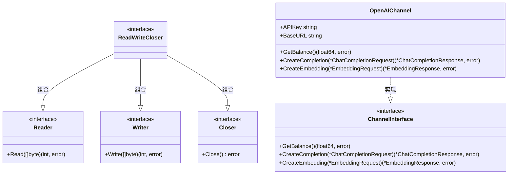
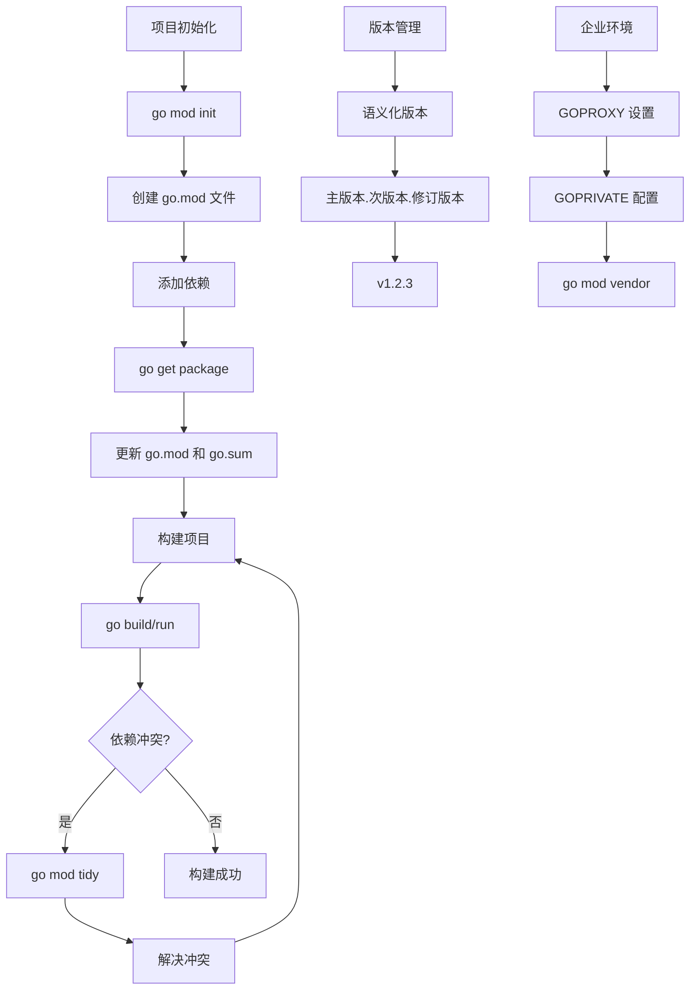
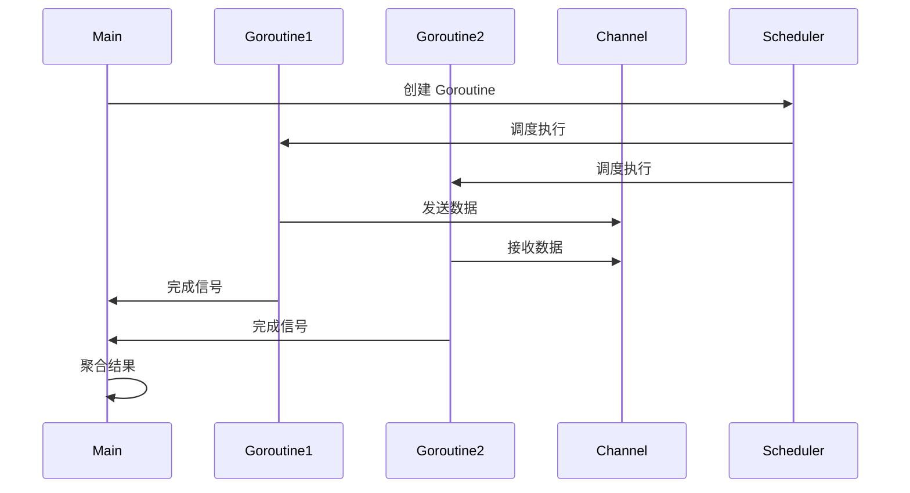
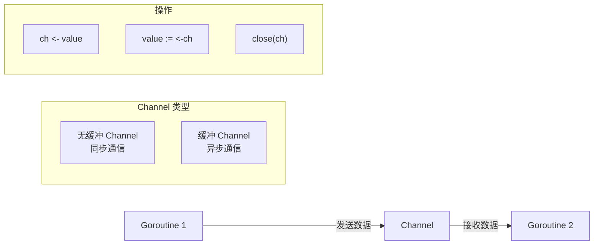
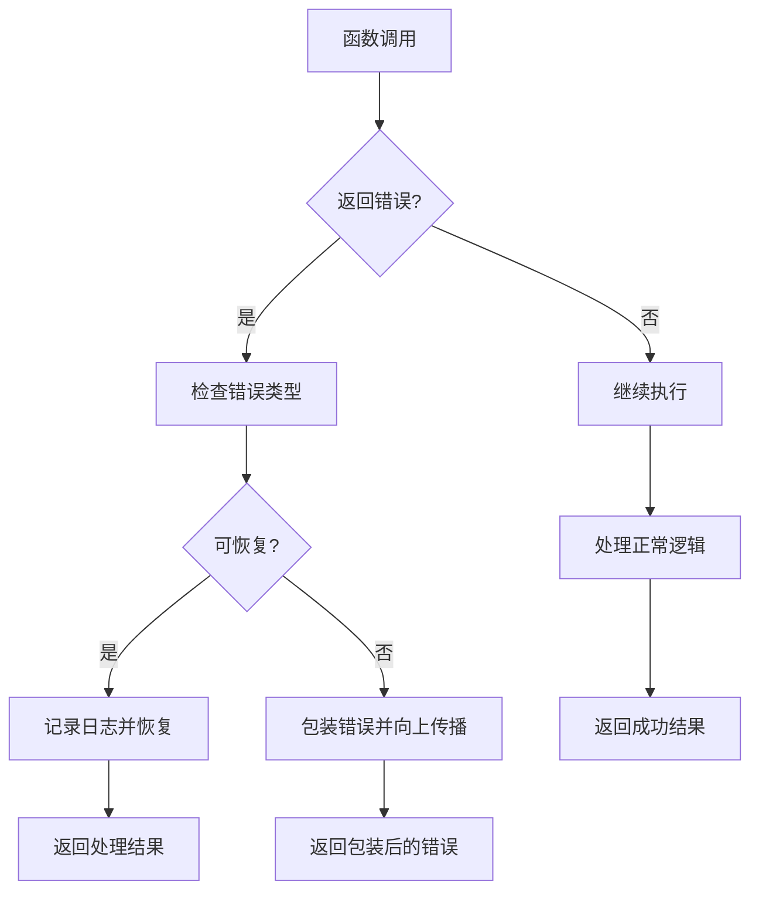
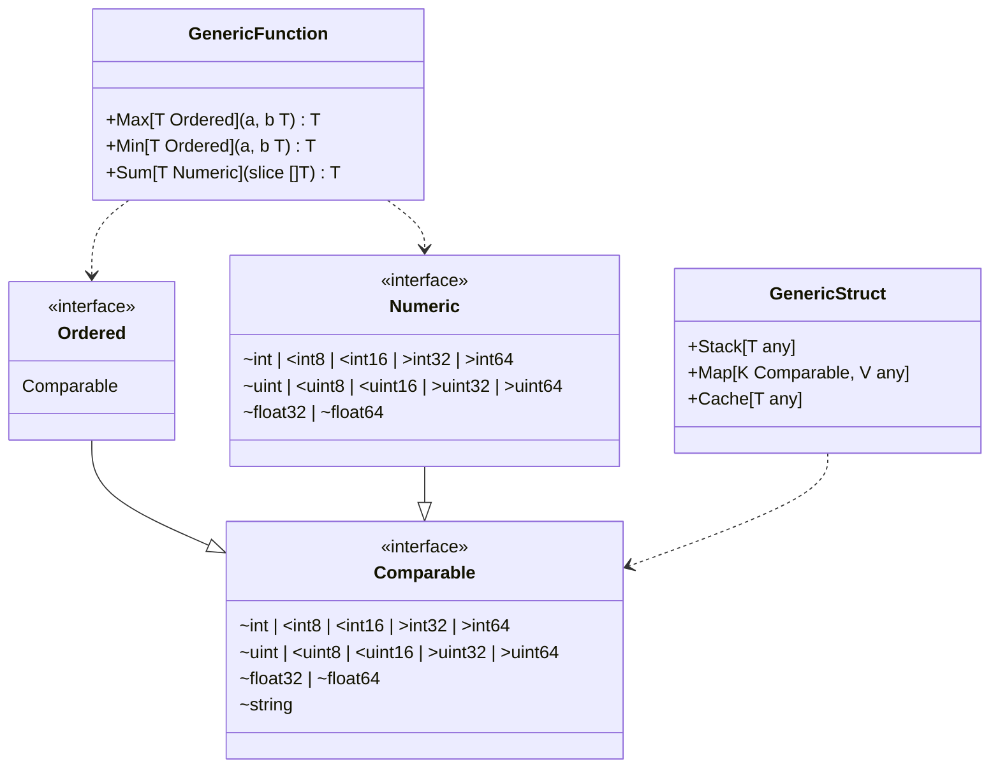

# 第3章 Go语言高级特性

## 3.1 接口（Interface）

### 3.1.1 接口的定义与实现

接口是Go语言的核心特性之一，它定义了对象的行为规范。在New API项目中，接口被广泛用于抽象不同的实现。

#### 基本接口定义

```go
// 定义一个基本接口
type Writer interface {
    Write([]byte) (int, error)
}

// 定义多方法接口
type ReadWriter interface {
    Read([]byte) (int, error)
    Write([]byte) (int, error)
}
```

#### New API项目中的接口应用

在New API项目中，我们可以看到多个接口的实际应用：

```go
// 渠道接口定义
type ChannelInterface interface {
    GetBalance() (float64, error)
    CreateCompletion(request *ChatCompletionRequest) (*ChatCompletionResponse, error)
    CreateEmbedding(request *EmbeddingRequest) (*EmbeddingResponse, error)
}

// OpenAI渠道实现
type OpenAIChannel struct {
    APIKey  string
    BaseURL string
}

func (c *OpenAIChannel) GetBalance() (float64, error) {
    // 实现获取余额逻辑
    return 0.0, nil
}

func (c *OpenAIChannel) CreateCompletion(request *ChatCompletionRequest) (*ChatCompletionResponse, error) {
    // 实现聊天完成逻辑
    return nil, nil
}

func (c *OpenAIChannel) CreateEmbedding(request *EmbeddingRequest) (*EmbeddingResponse, error) {
    // 实现嵌入向量逻辑
    return nil, nil
}
```

### 3.1.2 空接口与类型断言

**空接口（interface{}）概念说明**：

**定义**：空接口是不包含任何方法的接口类型，由于Go语言中任何类型都至少实现了零个方法，因此空接口可以存储任意类型的值。

**语法形式**：
- `interface{}`：传统写法
- `any`：Go 1.18+引入的类型别名，等价于interface{}

**核心特性**：
- **类型擦除**：存储时丢失具体类型信息
- **运行时类型**：需要通过反射或类型断言获取真实类型
- **零值**：空接口的零值是nil
- **内存布局**：包含类型信息和数据指针的结构体

**使用场景**：
- 需要处理多种不同类型的场景
- JSON解析等动态数据处理
- 通用容器和集合类型
- 函数参数需要接受任意类型

**类型断言**：
- **安全断言**：`value, ok := x.(Type)`
- **直接断言**：`value := x.(Type)`（可能panic）
- **类型开关**：`switch x.(type)`

**性能考虑**：
- 涉及装箱/拆箱操作
- 类型断言有运行时开销
- 失去编译时类型检查

```go
// 空接口可以接受任何类型
var data interface{}
data = 42
data = "hello"
data = []int{1, 2, 3}

// 类型断言
if str, ok := data.(string); ok {
    fmt.Println("数据是字符串:", str)
}

// 类型选择
switch v := data.(type) {
case int:
    fmt.Println("整数:", v)
case string:
    fmt.Println("字符串:", v)
case []int:
    fmt.Println("整数切片:", v)
default:
    fmt.Println("未知类型")
}
```

### 3.1.3 接口组合



图1：Go语言接口组合与实现关系

```go
// 基础接口
type Reader interface {
    Read([]byte) (int, error)
}

type Writer interface {
    Write([]byte) (int, error)
}

type Closer interface {
    Close() error
}

// 组合接口
type ReadWriteCloser interface {
    Reader
    Writer
    Closer
}
```

## 3.2 Go Modules 与依赖管理

### 3.2.1 Go Modules 基础

Go Modules 是 Go 1.11 引入的官方依赖管理系统，它解决了 GOPATH 模式下的诸多问题。



图2：Go Modules 依赖管理流程

### 3.2.2 go.mod 文件详解

```go
// go.mod 文件示例
module github.com/songquanpeng/one-api

go 1.21

require (
    github.com/gin-gonic/gin v1.9.1
    github.com/golang-jwt/jwt v3.2.2+incompatible
    gorm.io/driver/mysql v1.5.2
    gorm.io/driver/postgres v1.5.3
    gorm.io/driver/sqlite v1.5.4
    gorm.io/gorm v1.25.5
    github.com/redis/go-redis/v9 v9.3.0
)

require (
    github.com/bytedance/sonic v1.9.1 // indirect
    github.com/chenzhuoyu/base64x v0.0.0-20221115062448-fe3a3abad311 // indirect
    github.com/gabriel-vasile/mimetype v1.4.2 // indirect
    // ... 其他间接依赖
)

// 排除特定版本
exclude github.com/some/package v1.0.0

// 替换依赖
replace github.com/old/package => github.com/new/package v1.0.0

// 撤回版本
retract v1.0.1 // 包含严重bug
```

### 3.2.3 版本管理策略

#### 语义化版本控制

```go
// 版本格式：v主版本.次版本.修订版本
v1.2.3
v2.0.0-beta.1  // 预发布版本
v1.2.4-rc.1    // 候选版本

// 伪版本（用于未打标签的提交）
v0.0.0-20230101120000-abcdef123456
```

#### 版本选择规则

```bash
# 获取最新版本
go get github.com/gin-gonic/gin@latest

# 获取特定版本
go get github.com/gin-gonic/gin@v1.9.1

# 获取特定分支
go get github.com/gin-gonic/gin@master

# 获取特定提交
go get github.com/gin-gonic/gin@abcdef1

# 升级到最新的修订版本
go get -u=patch github.com/gin-gonic/gin

# 升级到最新的次版本
go get -u github.com/gin-gonic/gin
```

### 3.2.4 常用命令详解

```bash
# 初始化模块
go mod init [module-name]

# 添加依赖并更新 go.mod
go get package@version

# 移除未使用的依赖，添加缺失的依赖
go mod tidy

# 查看依赖图
go mod graph

# 解释为什么需要某个依赖
go mod why package

# 下载依赖到本地缓存
go mod download

# 将依赖复制到 vendor 目录
go mod vendor

# 验证依赖的完整性
go mod verify

# 编辑 go.mod 文件
go mod edit -require=package@version
go mod edit -exclude=package@version
go mod edit -replace=old@version=new@version
```

### 3.2.5 企业级配置

#### 代理配置

```bash
# 设置模块代理
export GOPROXY=https://goproxy.cn,direct

# 设置私有模块（不通过代理）
export GOPRIVATE=*.corp.example.com,rsc.io/private

# 设置校验和数据库
export GOSUMDB=sum.golang.org

# 禁用校验和验证（不推荐）
export GOSUMDB=off
```

#### New API 项目的依赖管理实践

```go
// 实际的 go.mod 文件片段
module one-api

go 1.21

require (
    github.com/gin-gonic/gin v1.9.1
    github.com/golang-jwt/jwt v3.2.2+incompatible
    gorm.io/driver/mysql v1.5.2
    gorm.io/driver/postgres v1.5.3
    gorm.io/driver/sqlite v1.5.4
    gorm.io/gorm v1.25.5
    github.com/redis/go-redis/v9 v9.3.0
    github.com/sashabaranov/go-openai v1.17.9
    github.com/gin-contrib/cors v1.4.0
    github.com/gin-contrib/sessions v0.0.5
    github.com/google/uuid v1.4.0
)
```

#### 依赖安全管理

```bash
# 检查已知漏洞
go list -json -m all | nancy sleuth

# 使用 govulncheck 检查漏洞
go install golang.org/x/vuln/cmd/govulncheck@latest
govulncheck ./...

# 审计依赖
go mod graph | grep "suspicious-package"
```

## 3.3 并发编程与Goroutine

### 3.3.1 并发编程概述

Go语言的并发模型基于CSP（Communicating Sequential Processes）理论，核心理念是"不要通过共享内存来通信，而要通过通信来共享内存"。



图3：Goroutine 并发执行模型

### 3.3.2 Goroutine 基础

Goroutine是Go语言并发的基础，它是轻量级的线程，由Go运行时调度器管理。

#### 基本概念与特性

- **轻量级**：初始栈大小仅2KB，可动态增长
- **高效调度**：M:N调度模型，少量OS线程调度大量Goroutine
- **通信机制**：通过Channel进行安全的数据交换
- **垃圾回收友好**：与GC协同工作，避免内存泄漏

#### 基本使用

```go
package main

import (
    "fmt"
    "time"
)

func sayHello(name string) {
    for i := 0; i < 3; i++ {
        fmt.Printf("Hello %s! (%d)\n", name, i)
        time.Sleep(100 * time.Millisecond)
    }
}

func main() {
    // 启动goroutine
    go sayHello("Alice")
    go sayHello("Bob")
    
    // 等待goroutine完成
    time.Sleep(1 * time.Second)
    fmt.Println("程序结束")
}
```

#### New API项目中的Goroutine应用

```go
// 异步处理请求日志
func LogRequest(logData *LogData) {
    go func() {
        defer func() {
            if r := recover(); r != nil {
                logger.Error("日志记录失败:", r)
            }
        }()
        
        // 写入数据库
        if err := database.CreateLog(logData); err != nil {
            logger.Error("保存日志失败:", err)
        }
    }()
}

// 批量处理任务
func ProcessChannels() {
    channels := GetAllChannels()
    
    for _, channel := range channels {
        go func(ch *Channel) {
            defer func() {
                if r := recover(); r != nil {
                    logger.Error("处理渠道失败:", ch.Name, r)
                }
            }()
            
            // 测试渠道可用性
            if err := TestChannel(ch); err != nil {
                ch.Status = ChannelStatusDisabled
                UpdateChannel(ch)
            }
        }(channel)
    }
}
```

### 3.3.3 Channel通信

**Channel 概念说明**：

**定义**：Channel是Go语言提供的用于Goroutine间通信的类型安全管道，实现了CSP（Communicating Sequential Processes）并发模型。

**设计哲学**："不要通过共享内存来通信，而要通过通信来共享内存"（Don't communicate by sharing memory; share memory by communicating）。

**核心特性**：
- **类型安全**：Channel具有明确的元素类型
- **同步机制**：无缓冲Channel提供同步点
- **方向性**：可以限制Channel的读写方向
- **关闭语义**：支持优雅的关闭和检测

**Channel类型**：
- **无缓冲Channel**：`make(chan T)`，同步通信
- **缓冲Channel**：`make(chan T, size)`，异步通信
- **只读Channel**：`<-chan T`，只能接收
- **只写Channel**：`chan<- T`，只能发送

**基本操作**：
- **发送**：`ch <- value`
- **接收**：`value := <-ch` 或 `value, ok := <-ch`
- **关闭**：`close(ch)`
- **选择**：`select` 语句进行多路复用

**内部实现**：
- 基于环形缓冲区
- 使用互斥锁保证并发安全
- 维护发送和接收Goroutine队列
- 支持非阻塞操作（select default）

**使用场景**：
- Goroutine间数据传递
- 同步和协调
- 扇入扇出模式
- 工作池模式
- 管道模式

**注意事项**：
- 向已关闭的Channel发送会panic
- 关闭已关闭的Channel会panic
- 从已关闭的Channel接收会立即返回零值
- nil Channel的发送和接收都会永久阻塞

Channel是Goroutine之间通信的管道，实现了类型安全的数据传递。



图4：Channel 通信机制

#### 基本Channel操作

```go
// 创建channel
ch := make(chan int)
ch2 := make(chan string, 10) // 带缓冲的channel

// 发送和接收
go func() {
    ch <- 42 // 发送数据
}()

value := <-ch // 接收数据
fmt.Println(value)

// 关闭channel
close(ch)

// 检查channel是否关闭
value, ok := <-ch
if !ok {
    fmt.Println("Channel已关闭")
}
```

#### 高级Channel模式

```go
// 工作池模式
func WorkerPool() {
    jobs := make(chan int, 100)
    results := make(chan int, 100)
    
    // 启动3个worker
    for w := 1; w <= 3; w++ {
        go worker(w, jobs, results)
    }
    
    // 发送任务
    for j := 1; j <= 9; j++ {
        jobs <- j
    }
    close(jobs)
    
    // 收集结果
    for r := 1; r <= 9; r++ {
        <-results
    }
}

func worker(id int, jobs <-chan int, results chan<- int) {
    for j := range jobs {
        fmt.Printf("Worker %d 处理任务 %d\n", id, j)
        time.Sleep(time.Second)
        results <- j * 2
    }
}
```

#### New API项目中的Channel应用

```go
// 请求限流器
type RateLimiter struct {
    tokens chan struct{}
    ticker *time.Ticker
}

func NewRateLimiter(rate int) *RateLimiter {
    rl := &RateLimiter{
        tokens: make(chan struct{}, rate),
        ticker: time.NewTicker(time.Second / time.Duration(rate)),
    }
    
    // 定期添加令牌
    go func() {
        for range rl.ticker.C {
            select {
            case rl.tokens <- struct{}{}:
            default:
                // 令牌桶已满
            }
        }
    }()
    
    return rl
}

func (rl *RateLimiter) Allow() bool {
    select {
    case <-rl.tokens:
        return true
    default:
        return false
    }
}

// 异步任务队列
type TaskQueue struct {
    tasks chan func()
    quit  chan bool
}

func NewTaskQueue(workers int) *TaskQueue {
    tq := &TaskQueue{
        tasks: make(chan func(), 1000),
        quit:  make(chan bool),
    }
    
    // 启动工作协程
    for i := 0; i < workers; i++ {
        go tq.worker()
    }
    
    return tq
}

func (tq *TaskQueue) worker() {
    for {
        select {
        case task := <-tq.tasks:
            task()
        case <-tq.quit:
            return
        }
    }
}

func (tq *TaskQueue) Submit(task func()) {
    select {
    case tq.tasks <- task:
    default:
        // 队列已满，可以选择丢弃或阻塞
        logger.Warn("任务队列已满")
    }
}
```

### 3.3.4 Select语句

Select语句提供了多路复用机制，可以同时监听多个Channel操作。

```go
// 多路复用
func SelectExample() {
    ch1 := make(chan string)
    ch2 := make(chan string)
    
    go func() {
        time.Sleep(1 * time.Second)
        ch1 <- "来自ch1的消息"
    }()
    
    go func() {
        time.Sleep(2 * time.Second)
        ch2 <- "来自ch2的消息"
    }()
    
    for i := 0; i < 2; i++ {
        select {
        case msg1 := <-ch1:
            fmt.Println(msg1)
        case msg2 := <-ch2:
            fmt.Println(msg2)
        case <-time.After(3 * time.Second):
            fmt.Println("超时")
            return
        }
    }
}
```

### 3.3.5 同步原语与Context

#### 同步原语

Go语言的sync包提供了多种同步原语，用于在并发程序中协调Goroutine之间的执行和数据访问。

#### WaitGroup

**定义**：WaitGroup用于等待一组Goroutine完成执行。它维护一个内部计数器，当计数器为0时，Wait方法会解除阻塞。

**核心方法**：
- `Add(delta int)`：增加计数器的值
- `Done()`：减少计数器的值（等价于Add(-1)）
- `Wait()`：阻塞直到计数器为0

**使用场景**：
- 等待多个Goroutine完成任务
- 并行处理后需要汇总结果
- 控制程序退出时机

```go
import "sync"

func WaitGroupExample() {
    var wg sync.WaitGroup
    
    for i := 0; i < 3; i++ {
        wg.Add(1)
        go func(id int) {
            defer wg.Done()
            fmt.Printf("Goroutine %d 完成\n", id)
            time.Sleep(time.Second)
        }(i)
    }
    
    wg.Wait()
    fmt.Println("所有goroutine完成")
}
```

#### Mutex

**定义**：Mutex（互斥锁）是最基本的同步原语，用于保护共享资源，确保同一时间只有一个Goroutine可以访问临界区。

**核心方法**：
- `Lock()`：获取锁，如果锁已被占用则阻塞等待
- `Unlock()`：释放锁

**使用场景**：
- 保护共享变量的读写操作
- 确保代码块的原子性执行
- 防止竞态条件（Race Condition）

**最佳实践**：
- 总是使用defer语句释放锁
- 尽量缩小锁的作用范围
- 避免在持有锁时调用可能阻塞的操作

```go
type Counter struct {
    mu    sync.Mutex
    value int
}

func (c *Counter) Increment() {
    c.mu.Lock()
    defer c.mu.Unlock()
    c.value++
}

func (c *Counter) Value() int {
    c.mu.Lock()
    defer c.mu.Unlock()
    return c.value
}
```

#### RWMutex

**定义**：RWMutex（读写互斥锁）是Mutex的扩展，允许多个读操作并发执行，但写操作是独占的。这种设计适用于读多写少的场景。

**核心方法**：
- `Lock()`：获取写锁（独占锁）
- `Unlock()`：释放写锁
- `RLock()`：获取读锁（共享锁）
- `RUnlock()`：释放读锁

**工作原理**：
- 多个Goroutine可以同时持有读锁
- 写锁与读锁、写锁互斥
- 当有写锁等待时，新的读锁请求会被阻塞

**使用场景**：
- 缓存系统（读多写少）
- 配置管理（频繁读取，偶尔更新）
- 统计数据收集

**性能优势**：
- 提高并发读取性能
- 减少不必要的阻塞
- 适合读写比例悬殊的场景

```go
type SafeMap struct {
    mu   sync.RWMutex
    data map[string]interface{}
}

func NewSafeMap() *SafeMap {
    return &SafeMap{
        data: make(map[string]interface{}),
    }
}

func (sm *SafeMap) Set(key string, value interface{}) {
    sm.mu.Lock()
    defer sm.mu.Unlock()
    sm.data[key] = value
}

func (sm *SafeMap) Get(key string) (interface{}, bool) {
    sm.mu.RLock()
    defer sm.mu.RUnlock()
    value, ok := sm.data[key]
    return value, ok
}
```
#### Context 上下文管理

**Context 概念说明**：

**定义**：Context是Go语言标准库提供的上下文管理包，用于在Goroutine之间传递取消信号、超时控制和请求范围的值。

**核心接口**：
```go
type Context interface {
    Deadline() (deadline time.Time, ok bool)
    Done() <-chan struct{}
    Err() error
    Value(key interface{}) interface{}
}
```

**主要功能**：
- **取消传播**：父Context取消时，所有子Context自动取消
- **超时控制**：设置操作的最大执行时间
- **值传递**：在请求链路中传递元数据
- **截止时间**：设置绝对的截止时间点

**常用创建方法**：
- `context.Background()`：根Context，通常用于main函数
- `context.TODO()`：当不确定使用哪个Context时的占位符
- `context.WithCancel()`：创建可取消的Context
- `context.WithTimeout()`：创建带超时的Context
- `context.WithDeadline()`：创建带截止时间的Context
- `context.WithValue()`：创建携带值的Context

**使用场景**：
- HTTP请求处理
- 数据库操作超时控制
- Goroutine协调和取消
- 微服务调用链路追踪

**最佳实践**：
- Context应该作为函数的第一个参数
- 不要将Context存储在结构体中
- 不要传递nil Context，使用context.TODO()
- Context是并发安全的，可以在多个Goroutine中使用

Context 用于在 Goroutine 之间传递取消信号、超时和其他请求范围的值。

```go
package main

import (
    "context"
    "fmt"
    "time"
)

// 带超时的操作
func doWorkWithTimeout(ctx context.Context) error {
    select {
    case <-time.After(2 * time.Second):
        return fmt.Errorf("工作完成")
    case <-ctx.Done():
        return ctx.Err()
    }
}

// 可取消的工作
func cancellableWork() {
    ctx, cancel := context.WithTimeout(context.Background(), 1*time.Second)
    defer cancel()
    
    if err := doWorkWithTimeout(ctx); err != nil {
        fmt.Println("操作被取消:", err)
    }
}

// New API 项目中的 Context 应用
func HandleRequest(ctx context.Context, req *Request) (*Response, error) {
    // 设置请求超时
    ctx, cancel := context.WithTimeout(ctx, 30*time.Second)
    defer cancel()
    
    // 传递用户信息
    userID := ctx.Value("userID").(string)
    
    // 调用下游服务
    return callDownstreamService(ctx, userID, req)
}
```


### 3.3.6 并发模式与最佳实践

#### Worker Pool 模式

```go
type WorkerPool struct {
    workerCount int
    jobs        chan Job
    results     chan Result
    quit        chan bool
}

type Job struct {
    ID   int
    Data interface{}
}

type Result struct {
    JobID int
    Data  interface{}
    Error error
}

func NewWorkerPool(workerCount, jobQueueSize int) *WorkerPool {
    return &WorkerPool{
        workerCount: workerCount,
        jobs:        make(chan Job, jobQueueSize),
        results:     make(chan Result, jobQueueSize),
        quit:        make(chan bool),
    }
}

func (wp *WorkerPool) Start() {
    for i := 0; i < wp.workerCount; i++ {
        go wp.worker(i)
    }
}

func (wp *WorkerPool) worker(id int) {
    for {
        select {
        case job := <-wp.jobs:
            result := wp.processJob(job)
            wp.results <- result
        case <-wp.quit:
            return
        }
    }
}

func (wp *WorkerPool) processJob(job Job) Result {
    // 处理具体任务
    time.Sleep(100 * time.Millisecond) // 模拟工作
    return Result{
        JobID: job.ID,
        Data:  fmt.Sprintf("处理结果: %v", job.Data),
    }
}
```

#### 性能优化建议

```go
// 1. 控制 Goroutine 数量
func OptimizedConcurrency() {
    // 根据 CPU 核数设置工作协程数
    numWorkers := runtime.NumCPU()
    
    // 对于 I/O 密集型任务，可以适当增加
    if isIOIntensive {
        numWorkers *= 2
    }
    
    // 使用信号量限制并发数
    semaphore := make(chan struct{}, numWorkers)
    
    for _, task := range tasks {
        semaphore <- struct{}{} // 获取信号量
        go func(t Task) {
            defer func() { <-semaphore }() // 释放信号量
            processTask(t)
        }(task)
    }
}

// 2. 避免 Goroutine 泄漏
func PreventGoroutineLeak() {
    ctx, cancel := context.WithCancel(context.Background())
    defer cancel() // 确保取消所有子 Goroutine
    
    for i := 0; i < 10; i++ {
        go func(ctx context.Context, id int) {
            for {
                select {
                case <-ctx.Done():
                    return // 正确退出
                default:
                    // 执行工作
                    time.Sleep(100 * time.Millisecond)
                }
            }
        }(ctx, i)
    }
}

// 3. 使用 sync.Pool 减少内存分配

**sync.Pool 概念说明**：

**定义**：sync.Pool是一个临时对象池，用于存储和复用临时对象，减少内存分配和垃圾回收的开销。

**核心特性**：
- 线程安全的对象池
- 自动垃圾回收清理
- 适用于频繁创建和销毁的临时对象
- 不保证对象的持久性

**核心方法**：
- `Get()`：从池中获取对象，如果池为空则调用New函数创建
- `Put(interface{})`：将对象放回池中供后续复用
- `New func() interface{}`：当池为空时创建新对象的函数

**使用场景**：
- 缓冲区复用（如[]byte切片）
- 临时结构体对象
- 频繁创建的小对象
- 减少GC压力的场景

**注意事项**：
- 对象可能在任何时候被GC清理
- 不适合存储需要持久化的数据
- Put的对象应该重置状态

var bufferPool = sync.Pool{
    New: func() interface{} {
        return make([]byte, 1024)
    },
}

func ProcessWithPool() {
    buffer := bufferPool.Get().([]byte)
    defer bufferPool.Put(buffer)
    
    // 使用 buffer 处理数据
}
```

## 3.4 反射（Reflection）

### 3.4.1 反射基础

**反射（Reflection）概念说明**：

**定义**：反射是程序在运行时检查、修改其自身结构和行为的能力。Go语言通过reflect包提供反射功能。

**核心概念**：
- **Type**：表示Go类型的接口，通过reflect.TypeOf()获取
- **Value**：表示Go值的结构体，通过reflect.ValueOf()获取
- **Kind**：表示类型的基础种类（如int、string、struct等）

**主要用途**：
- 运行时类型检查
- 动态调用方法
- 结构体字段操作
- 标签（Tag）解析
- 通用序列化/反序列化

**reflect包核心函数**：
- `reflect.TypeOf()`：获取值的类型信息
- `reflect.ValueOf()`：获取值的反射对象
- `reflect.New()`：创建指定类型的新值
- `reflect.MakeSlice()`：创建切片
- `reflect.MakeMap()`：创建映射

**Type接口主要方法**：
- `Name()`：类型名称
- `Kind()`：基础种类
- `NumField()`：结构体字段数量
- `Field(i)`：获取第i个字段
- `Method(i)`：获取第i个方法

**Value结构体主要方法**：
- `Interface()`：返回底层值
- `Kind()`：值的种类
- `CanSet()`：是否可设置
- `Set()`：设置值
- `Call()`：调用函数

**性能考虑**：
- 反射操作比直接操作慢10-100倍
- 失去编译时类型检查
- 增加代码复杂性

**使用原则**：
- 优先使用接口而非反射
- 仅在必要时使用反射
- 注意错误处理和类型安全

反射允许程序在运行时检查类型和值。

```go
import (
    "fmt"
    "reflect"
)

func ReflectionBasics() {
    var x float64 = 3.4
    
    // 获取反射对象
    v := reflect.ValueOf(x)
    t := reflect.TypeOf(x)
    
    fmt.Println("类型:", t)
    fmt.Println("值:", v)
    fmt.Println("种类:", v.Kind())
    fmt.Println("可设置:", v.CanSet())
}
```

### 3.4.2 结构体反射

```go
type User struct {
    Name  string `json:"name" validate:"required"`
    Age   int    `json:"age" validate:"min=0,max=120"`
    Email string `json:"email" validate:"email"`
}

func StructReflection() {
    user := User{Name: "Alice", Age: 30, Email: "alice@example.com"}
    
    v := reflect.ValueOf(user)
    t := reflect.TypeOf(user)
    
    for i := 0; i < v.NumField(); i++ {
        field := v.Field(i)
        fieldType := t.Field(i)
        
        fmt.Printf("字段: %s, 类型: %s, 值: %v\n", 
            fieldType.Name, field.Type(), field.Interface())
        
        // 获取标签
        jsonTag := fieldType.Tag.Get("json")
        validateTag := fieldType.Tag.Get("validate")
        fmt.Printf("JSON标签: %s, 验证标签: %s\n", jsonTag, validateTag)
    }
}
```

### 3.4.3 New API项目中的反射应用

#### 通用验证器

```go
package validator

import (
    "errors"
    "reflect"
    "strings"
)

// 验证结构体
func ValidateStruct(s interface{}) error {
    v := reflect.ValueOf(s)
    t := reflect.TypeOf(s)
    
    // 如果是指针，获取其指向的值
    if v.Kind() == reflect.Ptr {
        v = v.Elem()
        t = t.Elem()
    }
    
    if v.Kind() != reflect.Struct {
        return errors.New("参数必须是结构体")
    }
    
    for i := 0; i < v.NumField(); i++ {
        field := v.Field(i)
        fieldType := t.Field(i)
        
        // 检查required标签
        if tag := fieldType.Tag.Get("validate"); tag != "" {
            if err := validateField(field, tag, fieldType.Name); err != nil {
                return err
            }
        }
    }
    
    return nil
}

func validateField(field reflect.Value, tag, fieldName string) error {
    rules := strings.Split(tag, ",")
    
    for _, rule := range rules {
        rule = strings.TrimSpace(rule)
        
        switch {
        case rule == "required":
            if isZeroValue(field) {
                return fmt.Errorf("字段 %s 是必需的", fieldName)
            }
        case strings.HasPrefix(rule, "min="):
            // 实现最小值验证
        case strings.HasPrefix(rule, "max="):
            // 实现最大值验证
        }
    }
    
    return nil
}

func isZeroValue(v reflect.Value) bool {
    switch v.Kind() {
    case reflect.String:
        return v.String() == ""
    case reflect.Int, reflect.Int8, reflect.Int16, reflect.Int32, reflect.Int64:
        return v.Int() == 0
    case reflect.Uint, reflect.Uint8, reflect.Uint16, reflect.Uint32, reflect.Uint64:
        return v.Uint() == 0
    case reflect.Float32, reflect.Float64:
        return v.Float() == 0
    case reflect.Bool:
        return !v.Bool()
    case reflect.Slice, reflect.Map, reflect.Array:
        return v.Len() == 0
    case reflect.Ptr, reflect.Interface:
        return v.IsNil()
    }
    return false
}
```

#### 通用JSON映射

```go
// 将map转换为结构体
func MapToStruct(data map[string]interface{}, result interface{}) error {
    v := reflect.ValueOf(result)
    if v.Kind() != reflect.Ptr || v.Elem().Kind() != reflect.Struct {
        return errors.New("result必须是结构体指针")
    }
    
    v = v.Elem()
    t := v.Type()
    
    for i := 0; i < v.NumField(); i++ {
        field := v.Field(i)
        fieldType := t.Field(i)
        
        if !field.CanSet() {
            continue
        }
        
        // 获取JSON标签作为键名
        key := fieldType.Tag.Get("json")
        if key == "" {
            key = fieldType.Name
        }
        
        if value, ok := data[key]; ok {
            if err := setFieldValue(field, value); err != nil {
                return fmt.Errorf("设置字段 %s 失败: %v", fieldType.Name, err)
            }
        }
    }
    
    return nil
}

func setFieldValue(field reflect.Value, value interface{}) error {
    valueReflect := reflect.ValueOf(value)
    
    if field.Type() == valueReflect.Type() {
        field.Set(valueReflect)
        return nil
    }
    
    // 类型转换
    if valueReflect.Type().ConvertibleTo(field.Type()) {
        field.Set(valueReflect.Convert(field.Type()))
        return nil
    }
    
    return fmt.Errorf("无法将 %s 转换为 %s", valueReflect.Type(), field.Type())
}
```

## 3.5 错误处理

Go语言的错误处理机制基于显式错误返回，这种设计哲学鼓励开发者主动处理可能出现的错误情况。



图5：Go语言错误处理流程

### 3.5.1 基本错误处理

```go
import (
    "errors"
    "fmt"
)

// 创建错误
func divide(a, b float64) (float64, error) {
    if b == 0 {
        return 0, errors.New("除数不能为零")
    }
    return a / b, nil
}

// 使用fmt.Errorf创建格式化错误
func validateAge(age int) error {
    if age < 0 {
        return fmt.Errorf("年龄不能为负数: %d", age)
    }
    if age > 150 {
        return fmt.Errorf("年龄不能超过150: %d", age)
    }
    return nil
}
```

### 3.5.2 自定义错误类型

```go
// 实现error接口
type ValidationError struct {
    Field   string
    Value   interface{}
    Message string
}

func (e *ValidationError) Error() string {
    return fmt.Sprintf("验证失败 - 字段: %s, 值: %v, 消息: %s", 
        e.Field, e.Value, e.Message)
}

// 错误包装
type APIError struct {
    Code    int
    Message string
    Cause   error
}

func (e *APIError) Error() string {
    if e.Cause != nil {
        return fmt.Sprintf("API错误 [%d]: %s (原因: %v)", 
            e.Code, e.Message, e.Cause)
    }
    return fmt.Sprintf("API错误 [%d]: %s", e.Code, e.Message)
}

func (e *APIError) Unwrap() error {
    return e.Cause
}
```

### 3.5.3 New API项目中的错误处理

```go
// 统一错误响应
type ErrorResponse struct {
    Success bool   `json:"success"`
    Message string `json:"message"`
    Code    int    `json:"code"`
    Data    interface{} `json:"data,omitempty"`
}

// 错误码定义
const (
    ErrCodeInvalidRequest = 40001
    ErrCodeUnauthorized   = 40101
    ErrCodeForbidden      = 40301
    ErrCodeNotFound       = 40401
    ErrCodeRateLimit      = 42901
    ErrCodeInternalError  = 50001
)

// 业务错误类型
type BusinessError struct {
    Code    int
    Message string
    Details map[string]interface{}
}

func (e *BusinessError) Error() string {
    return e.Message
}

func NewBusinessError(code int, message string) *BusinessError {
    return &BusinessError{
        Code:    code,
        Message: message,
        Details: make(map[string]interface{}),
    }
}

func (e *BusinessError) WithDetail(key string, value interface{}) *BusinessError {
    e.Details[key] = value
    return e
}

// 错误处理中间件
func ErrorHandler() gin.HandlerFunc {
    return func(c *gin.Context) {
        c.Next()
        
        // 处理panic
        if len(c.Errors) > 0 {
            err := c.Errors.Last().Err
            
            var response ErrorResponse
            
            switch e := err.(type) {
            case *BusinessError:
                response = ErrorResponse{
                    Success: false,
                    Message: e.Message,
                    Code:    e.Code,
                    Data:    e.Details,
                }
                c.JSON(400, response)
            case *ValidationError:
                response = ErrorResponse{
                    Success: false,
                    Message: e.Error(),
                    Code:    ErrCodeInvalidRequest,
                }
                c.JSON(400, response)
            default:
                response = ErrorResponse{
                    Success: false,
                    Message: "内部服务器错误",
                    Code:    ErrCodeInternalError,
                }
                c.JSON(500, response)
                
                // 记录详细错误日志
                logger.Error("未处理的错误:", err)
            }
        }
    }
}
```

## 3.6 泛型（Go 1.18+）

Go 1.18引入了泛型支持，允许编写类型安全且可复用的代码。泛型通过类型参数和类型约束实现多态性。



图6：Go泛型类型约束关系图

### 3.6.1 泛型基础

```go
// 泛型函数
func Max[T comparable](a, b T) T {
    if a > b {
        return a
    }
    return b
}

// 使用
func main() {
    fmt.Println(Max(10, 20))       // int
    fmt.Println(Max(3.14, 2.71))   // float64
    fmt.Println(Max("hello", "world")) // string
}
```

### 3.6.2 泛型类型

```go
// 泛型切片
type Stack[T any] struct {
    items []T
}

func NewStack[T any]() *Stack[T] {
    return &Stack[T]{
        items: make([]T, 0),
    }
}

func (s *Stack[T]) Push(item T) {
    s.items = append(s.items, item)
}

func (s *Stack[T]) Pop() (T, bool) {
    if len(s.items) == 0 {
        var zero T
        return zero, false
    }
    
    index := len(s.items) - 1
    item := s.items[index]
    s.items = s.items[:index]
    return item, true
}

func (s *Stack[T]) IsEmpty() bool {
    return len(s.items) == 0
}
```

### 3.6.3 New API项目中的泛型应用

```go
// 通用响应结构
type Response[T any] struct {
    Success bool   `json:"success"`
    Message string `json:"message"`
    Data    T      `json:"data,omitempty"`
}

func SuccessResponse[T any](data T) Response[T] {
    return Response[T]{
        Success: true,
        Message: "操作成功",
        Data:    data,
    }
}

func ErrorResponse[T any](message string) Response[T] {
    var zero T
    return Response[T]{
        Success: false,
        Message: message,
        Data:    zero,
    }
}

// 通用分页结构
type PageResult[T any] struct {
    Items      []T `json:"items"`
    Total      int `json:"total"`
    Page       int `json:"page"`
    PageSize   int `json:"page_size"`
    TotalPages int `json:"total_pages"`
}

func NewPageResult[T any](items []T, total, page, pageSize int) PageResult[T] {
    totalPages := (total + pageSize - 1) / pageSize
    return PageResult[T]{
        Items:      items,
        Total:      total,
        Page:       page,
        PageSize:   pageSize,
        TotalPages: totalPages,
    }
}

// 通用缓存接口
type Cache[K comparable, V any] interface {
    Get(key K) (V, bool)
    Set(key K, value V, ttl time.Duration)
    Delete(key K)
    Clear()
}

// 内存缓存实现
type MemoryCache[K comparable, V any] struct {
    mu    sync.RWMutex
    items map[K]cacheItem[V]
}

type cacheItem[V any] struct {
    value  V
    expiry time.Time
}

func NewMemoryCache[K comparable, V any]() *MemoryCache[K, V] {
    cache := &MemoryCache[K, V]{
        items: make(map[K]cacheItem[V]),
    }
    
    // 启动清理goroutine
    go cache.cleanup()
    
    return cache
}

func (c *MemoryCache[K, V]) Get(key K) (V, bool) {
    c.mu.RLock()
    defer c.mu.RUnlock()
    
    item, exists := c.items[key]
    if !exists {
        var zero V
        return zero, false
    }
    
    if time.Now().After(item.expiry) {
        var zero V
        return zero, false
    }
    
    return item.value, true
}

func (c *MemoryCache[K, V]) Set(key K, value V, ttl time.Duration) {
    c.mu.Lock()
    defer c.mu.Unlock()
    
    c.items[key] = cacheItem[V]{
        value:  value,
        expiry: time.Now().Add(ttl),
    }
}

func (c *MemoryCache[K, V]) Delete(key K) {
    c.mu.Lock()
    defer c.mu.Unlock()
    
    delete(c.items, key)
}

func (c *MemoryCache[K, V]) Clear() {
    c.mu.Lock()
    defer c.mu.Unlock()
    
    c.items = make(map[K]cacheItem[V])
}

func (c *MemoryCache[K, V]) cleanup() {
    ticker := time.NewTicker(5 * time.Minute)
    defer ticker.Stop()
    
    for range ticker.C {
        c.mu.Lock()
        now := time.Now()
        for key, item := range c.items {
            if now.After(item.expiry) {
                delete(c.items, key)
            }
        }
        c.mu.Unlock()
    }
}
```

## 本章小结

本章深入介绍了Go语言的高级特性，包括：

1. **接口**：学习了接口的定义、实现、组合和在New API项目中的实际应用
2. **并发编程**：掌握了Goroutine、Channel、Select语句和同步原语的使用
3. **反射**：了解了反射的基本概念和在验证、JSON映射中的应用
4. **错误处理**：学习了Go语言的错误处理模式和自定义错误类型
5. **泛型**：掌握了Go 1.18+引入的泛型特性和实际应用

这些高级特性是构建企业级Go应用的重要基础，在后续章节中我们将看到它们在Web开发中的具体应用。

## 练习题

1. 实现一个支持多种存储后端的缓存接口
2. 使用Goroutine和Channel实现一个简单的任务调度器
3. 编写一个通用的结构体验证器，支持常见的验证规则
4. 实现一个泛型的优先队列数据结构
5. 设计一个错误处理中间件，能够统一处理不同类型的错误

## 扩展阅读

### 官方文档和教程
- [Go语言并发编程实战](https://golang.org/doc/effective_go.html#concurrency)
- [Go语言反射深入理解](https://golang.org/pkg/reflect/)
- [Go语言错误处理最佳实践](https://golang.org/blog/error-handling-and-go)
- [Go语言泛型设计文档](https://golang.org/doc/tutorial/generics)
- [Go语言接口设计原则](https://golang.org/doc/effective_go.html#interfaces)
- [Go并发模式演讲](https://talks.golang.org/2012/concurrency.slide)
- [高级Go并发模式](https://talks.golang.org/2013/advconc.slide)
- [Go Context包详解](https://golang.org/pkg/context/)

### 深度学习资源
- [Go语言内存模型](https://golang.org/ref/mem)
- [Go语言调度器设计](https://docs.google.com/document/d/1TTj4T2JO42uD5ID9e89oa0sLKhJYD0Y_kqxDv3I3XMw)
- [Go语言垃圾回收器](https://golang.org/doc/gc-guide)
- [Go语言程序诊断](https://golang.org/doc/diagnostics.html)

### 实践和工具
- [Go Playground](https://play.golang.org/) - 在线Go代码运行环境
- [Go代码审查评论](https://github.com/golang/go/wiki/CodeReviewComments)
- [Go性能优化指南](https://github.com/golang/go/wiki/Performance)
- [Effective Go中文版](https://learnku.com/docs/effective-go/2020)

### 开源项目学习
- [Go标准库源码](https://github.com/golang/go/tree/master/src)
- [Gin框架源码](https://github.com/gin-gonic/gin)
- [GORM源码](https://github.com/go-gorm/gorm)
- [Go Kit微服务工具包](https://github.com/go-kit/kit)
