# 第4章 Gin框架入门与实战

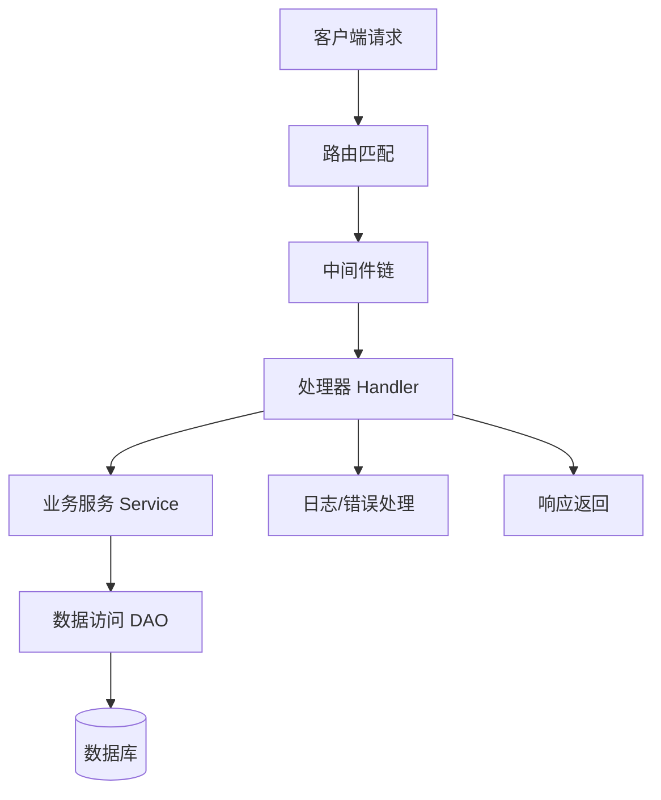

图1：Gin 请求生命周期与调用关系

## 4.x 实战要点

- 引擎初始化: `gin.New()` + 自定义 `Recovery`、`Logger` 与会话、CORS、中间件栈。
- 路由组织: 顶层 `SetRouter` 调用拆分为 API/Web/中继三类路由，使用路由分组与权限中间件。
- 错误处理: 统一 `CustomRecovery` 捕获 panic，返回结构化 JSON；业务错误用统一响应体。

项目片段:

```go
server := gin.New()
server.Use(gin.CustomRecovery(func(c *gin.Context, err any){
  c.JSON(http.StatusInternalServerError, gin.H{"error": gin.H{"message": fmt.Sprint(err)}})
}))
middleware.SetUpLogger(server)
router.SetRouter(server, buildFS, indexPage)
```

API 分组与权限:

```go
api := server.Group("/api")
api.Use(middleware.GlobalAPIRateLimit())
user := api.Group("")
user.Use(middleware.UserAuth())
admin := api.Group("")
admin.Use(middleware.AdminAuth())
```

调试与性能:
- 开发模式启用 `Debug` 日志；生产使用 `release` 模式、开启 gzip、合理的 405/去重斜杠配置。
- 路由优先级由注册顺序决定；避免通配符路由覆盖具体路径。

## 4.1 Gin框架简介

### 4.1.1 核心概念解析

在深入学习Gin框架之前，我们需要理解一些核心概念：

- **Web框架**：提供Web应用开发基础设施的软件框架，包括路由、中间件、模板渲染等功能
- **HTTP路由**：将HTTP请求映射到相应处理函数的机制
- **中间件**：在请求处理过程中可插拔的组件，用于实现横切关注点如日志、认证等
- **上下文(Context)**：封装HTTP请求和响应信息的对象，贯穿整个请求处理流程
- **处理函数(Handler)**：处理特定HTTP请求的函数
- **路由组(Route Group)**：具有相同前缀或中间件的路由集合

### 4.1.2 什么是Gin

Gin是一个用Go语言编写的HTTP Web框架，它具有类似Martini的API，但性能更好。Gin使用了httprouter，速度提高了近40倍。如果你需要极好的性能，使用Gin吧。

#### Gin的主要特性

- **高性能**：基于Radix树的路由，小内存占用
- **中间件支持**：HTTP请求可以由一系列中间件和最终操作来处理
- **Crash处理**：Gin可以catch一个发生在HTTP请求中的panic并recover它
- **JSON验证**：Gin可以解析并验证请求的JSON
- **路由组**：更好地组织路由
- **错误管理**：Gin提供了一种方便的方法来收集HTTP请求期间发生的所有错误

### 4.1.3 安装Gin

```bash
# 初始化Go模块
go mod init gin-example

# 安装Gin
go get github.com/gin-gonic/gin
```

### 4.1.4 第一个Gin应用

```go
package main

import (
    "net/http"
    "github.com/gin-gonic/gin"
)

func main() {
    // 创建Gin引擎
    r := gin.Default()
    
    // 定义路由
    r.GET("/", func(c *gin.Context) {
        c.JSON(http.StatusOK, gin.H{
            "message": "Hello, Gin!",
        })
    })
    
    // 启动服务器
    r.Run(":8080")
}
```

## 4.2 路由系统

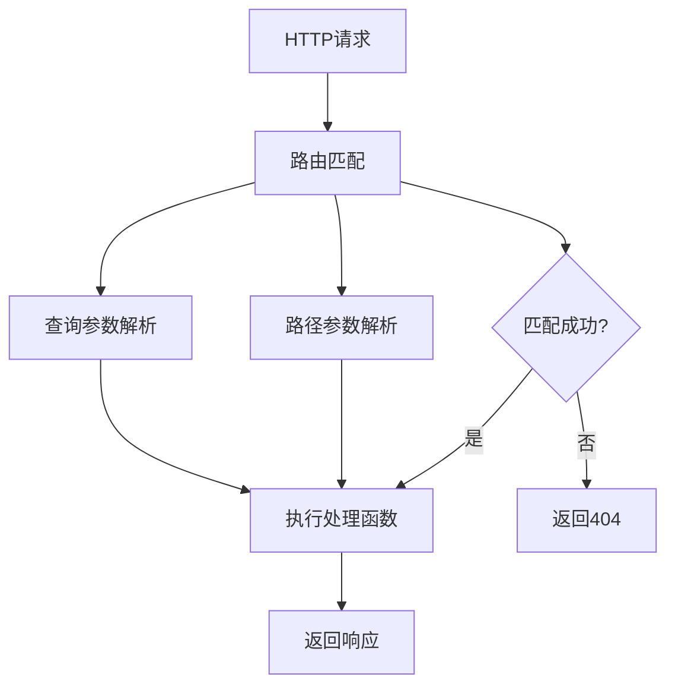

图2：Gin路由系统处理流程

### 4.2.1 路由系统核心概念

**路由(Route)**：定义URL路径与处理函数之间映射关系的规则。Gin的路由系统基于Radix树实现，具有高性能的路径匹配能力。

**路径参数(Path Parameter)**：URL路径中的动态部分，用冒号(:)标识，如`/users/:id`中的`:id`。

**查询参数(Query Parameter)**：URL中问号(?)后的键值对参数，如`/search?q=golang&page=1`。

**通配符(Wildcard)**：用星号(*)表示的路径匹配符，可以匹配任意路径段。

### 4.2.2 基本路由

```go
func setupRoutes() *gin.Engine {
    r := gin.Default()
    
    // GET请求
    r.GET("/users", getUsers)
    
    // POST请求
    r.POST("/users", createUser)
    
    // PUT请求
    r.PUT("/users/:id", updateUser)
    
    // DELETE请求
    r.DELETE("/users/:id", deleteUser)
    
    // PATCH请求
    r.PATCH("/users/:id", patchUser)
    
    // HEAD请求
    r.HEAD("/users", headUsers)
    
    // OPTIONS请求
    r.OPTIONS("/users", optionsUsers)
    
    return r
}
```

### 4.2.3 路径参数

```go
// 路径参数
r.GET("/users/:id", func(c *gin.Context) {
    id := c.Param("id")
    c.JSON(http.StatusOK, gin.H{
        "user_id": id,
    })
})

// 通配符参数
r.GET("/files/*filepath", func(c *gin.Context) {
    filepath := c.Param("filepath")
    c.JSON(http.StatusOK, gin.H{
        "filepath": filepath,
    })
})

// 多个参数
r.GET("/users/:id/posts/:post_id", func(c *gin.Context) {
    userID := c.Param("id")
    postID := c.Param("post_id")
    c.JSON(http.StatusOK, gin.H{
        "user_id": userID,
        "post_id": postID,
    })
})
```

### 4.2.4 查询参数

```go
r.GET("/search", func(c *gin.Context) {
    // 获取查询参数
    query := c.Query("q")
    page := c.DefaultQuery("page", "1")
    limit := c.DefaultQuery("limit", "10")
    
    // 获取所有查询参数
    queryMap := c.Request.URL.Query()
    
    c.JSON(http.StatusOK, gin.H{
        "query":     query,
        "page":      page,
        "limit":     limit,
        "all_params": queryMap,
    })
})
```

### 4.2.5 路由组

```go
func setupRouteGroups() *gin.Engine {
    r := gin.Default()
    
    // API v1路由组
    v1 := r.Group("/api/v1")
    {
        v1.GET("/users", getUsersV1)
        v1.POST("/users", createUserV1)
        v1.GET("/users/:id", getUserV1)
        v1.PUT("/users/:id", updateUserV1)
        v1.DELETE("/users/:id", deleteUserV1)
    }
    
    // API v2路由组
    v2 := r.Group("/api/v2")
    {
        v2.GET("/users", getUsersV2)
        v2.POST("/users", createUserV2)
    }
    
    // 管理员路由组（带中间件）
    admin := r.Group("/admin")
    admin.Use(AuthMiddleware())
    {
        admin.GET("/dashboard", adminDashboard)
        admin.GET("/users", adminUsers)
        admin.POST("/users", adminCreateUser)
    }
    
    return r
}
```

### 4.2.6 New API项目中的路由设计

让我们看看New API项目中的路由是如何组织的：

```go
// router/main.go
func SetRouter(router *gin.Engine) {
    // 设置API路由
    SetAPIRouter(router)
    
    // 设置Dashboard路由
    SetDashboardRouter(router)
    
    // 设置中继路由
    SetRelayRouter(router)
    
    // 设置视频路由
    SetVideoRouter(router)
    
    // 处理前端路由
    if os.Getenv("FRONTEND_BASE_URL") != "" {
        frontendBaseURL := os.Getenv("FRONTEND_BASE_URL")
        router.NoRoute(func(c *gin.Context) {
            c.Redirect(http.StatusMovedPermanently, frontendBaseURL+c.Request.RequestURI)
        })
    } else {
        SetWebRouter(router)
    }
}

// API路由设置
func SetAPIRouter(router *gin.Engine) {
    apiRouter := router.Group("/api")
    apiRouter.Use(middleware.GlobalAPIRateLimit())
    {
        // 用户认证相关
        apiRouter.POST("/user/register", controller.Register)
        apiRouter.POST("/user/login", controller.Login)
        apiRouter.GET("/user/logout", controller.Logout)
        
        // 需要认证的用户路由
        userRoute := apiRouter.Group("/")
        userRoute.Use(middleware.UserAuth())
        {
            userRoute.GET("/user/self", controller.GetSelf)
            userRoute.PUT("/user/self", controller.UpdateSelf)
            userRoute.DELETE("/user/self", controller.DeleteSelf)
            userRoute.GET("/user/token", controller.GetTokens)
            userRoute.POST("/user/token", controller.GenerateToken)
        }
        
        // 管理员路由
        adminRoute := apiRouter.Group("/")
        adminRoute.Use(middleware.AdminAuth())
        {
            adminRoute.GET("/user", controller.GetAllUsers)
            adminRoute.GET("/user/:id", controller.GetUser)
            adminRoute.POST("/user", controller.CreateUser)
            adminRoute.PUT("/user/:id", controller.UpdateUser)
            adminRoute.DELETE("/user/:id", controller.DeleteUser)
        }
    }
}
```

## 4.3 请求处理

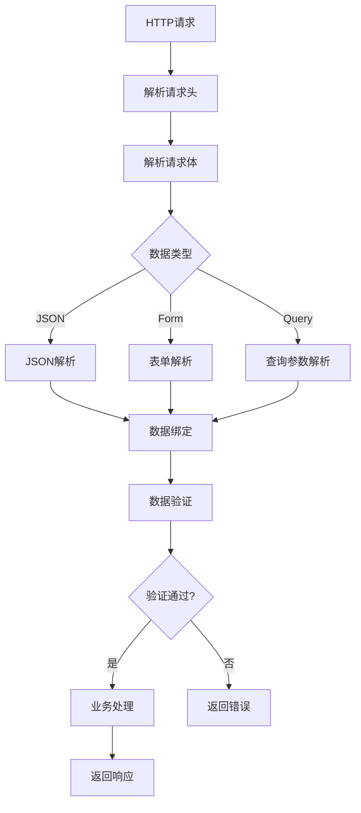

图3：Gin请求处理流程

### 4.3.1 JSON数据处理
```go
type User struct {
    ID    int    `json:"id"`
    Name  string `json:"name" binding:"required"`
    Email string `json:"email" binding:"required,email"`
    Age   int    `json:"age" binding:"gte=0,lte=130"`
}

// 绑定JSON数据
func createUser(c *gin.Context) {
    var user User
    
    // ShouldBindJSON会自动验证数据
    if err := c.ShouldBindJSON(&user); err != nil {
        c.JSON(http.StatusBadRequest, gin.H{
            "error": err.Error(),
        })
        return
    }
    
    // 处理用户创建逻辑
    // ...
    
    c.JSON(http.StatusCreated, gin.H{
        "message": "用户创建成功",
        "user":    user,
    })
}
```

### 4.3.2 处理表单数据

```go
// 处理表单数据
func handleForm(c *gin.Context) {
    // 获取表单字段
    name := c.PostForm("name")
    email := c.DefaultPostForm("email", "default@example.com")
    
    // 获取文件上传
    file, header, err := c.Request.FormFile("avatar")
    if err != nil {
        c.JSON(http.StatusBadRequest, gin.H{
            "error": "文件上传失败",
        })
        return
    }
    defer file.Close()
    
    // 保存文件
    filename := header.Filename
    if err := c.SaveUploadedFile(header, "./uploads/"+filename); err != nil {
        c.JSON(http.StatusInternalServerError, gin.H{
            "error": "文件保存失败",
        })
        return
    }
    
    c.JSON(http.StatusOK, gin.H{
        "name":     name,
        "email":    email,
        "filename": filename,
    })
}
```

### 4.3.3 数据绑定和验证

```go
// 自定义验证器
func customValidator() {
    if v, ok := binding.Validator.Engine().(*validator.Validate); ok {
        // 注册自定义验证规则
        v.RegisterValidation("customtag", func(fl validator.FieldLevel) bool {
            return fl.Field().String() != "invalid"
        })
    }
}

type LoginRequest struct {
    Username string `json:"username" binding:"required,min=3,max=20"`
    Password string `json:"password" binding:"required,min=6"`
    Remember bool   `json:"remember"`
}

func login(c *gin.Context) {
    var req LoginRequest
    
    if err := c.ShouldBindJSON(&req); err != nil {
        // 处理验证错误
        var validationErrors []string
        
        if errs, ok := err.(validator.ValidationErrors); ok {
            for _, e := range errs {
                switch e.Tag() {
                case "required":
                    validationErrors = append(validationErrors, 
                        fmt.Sprintf("%s是必需的", e.Field()))
                case "min":
                    validationErrors = append(validationErrors, 
                        fmt.Sprintf("%s长度不能少于%s", e.Field(), e.Param()))
                case "max":
                    validationErrors = append(validationErrors, 
                        fmt.Sprintf("%s长度不能超过%s", e.Field(), e.Param()))
                }
            }
        }
        
        c.JSON(http.StatusBadRequest, gin.H{
            "error":   "验证失败",
            "details": validationErrors,
        })
        return
    }
    
    // 处理登录逻辑
    // ...
    
    c.JSON(http.StatusOK, gin.H{
        "message": "登录成功",
        "token":   "jwt_token_here",
    })
}
```

### 4.3.4 数据验证流程

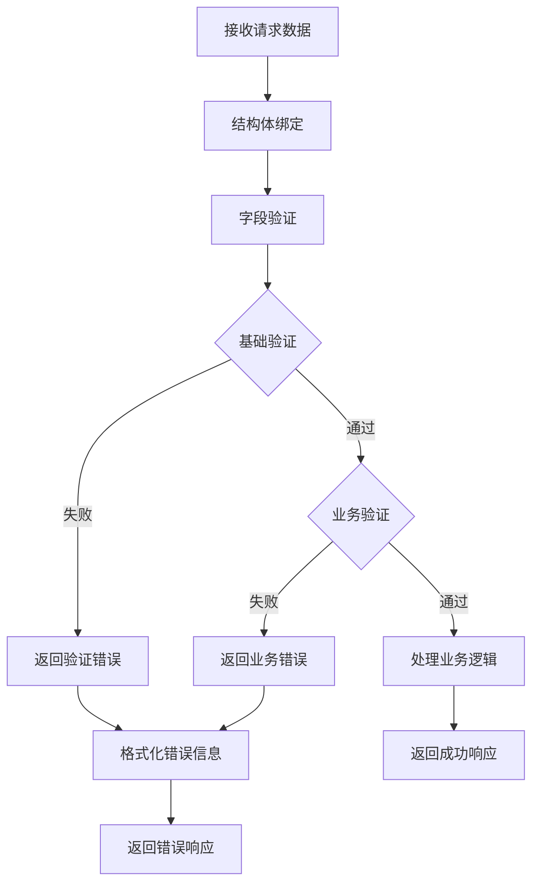

图4：数据验证流程图

### 4.3.5 New API项目中的请求处理

```go
// controller/user.go
func Register(c *gin.Context) {
    var user model.User
    
    // 绑定请求数据
    if err := c.ShouldBindJSON(&user); err != nil {
        c.JSON(http.StatusBadRequest, gin.H{
            "success": false,
            "message": "参数错误: " + err.Error(),
        })
        return
    }
    
    // 验证用户名格式
    if !common.ValidateUsername(user.Username) {
        c.JSON(http.StatusBadRequest, gin.H{
            "success": false,
            "message": "用户名格式不正确",
        })
        return
    }
    
    // 检查用户是否已存在
    if model.IsUsernameAlreadyTaken(user.Username) {
        c.JSON(http.StatusBadRequest, gin.H{
            "success": false,
            "message": "用户名已被占用",
        })
        return
    }
    
    // 创建用户
    if err := user.Insert(); err != nil {
        c.JSON(http.StatusInternalServerError, gin.H{
            "success": false,
            "message": "用户创建失败",
        })
        return
    }
    
    c.JSON(http.StatusOK, gin.H{
        "success": true,
        "message": "用户注册成功",
    })
}

// 统一响应格式
type Response struct {
    Success bool        `json:"success"`
    Message string      `json:"message"`
    Data    interface{} `json:"data,omitempty"`
}

func SuccessResponse(c *gin.Context, data interface{}) {
    c.JSON(http.StatusOK, Response{
        Success: true,
        Message: "操作成功",
        Data:    data,
    })
}

func ErrorResponse(c *gin.Context, code int, message string) {
    c.JSON(code, Response{
        Success: false,
        Message: message,
    })
}
```

## 4.4 中间件系统

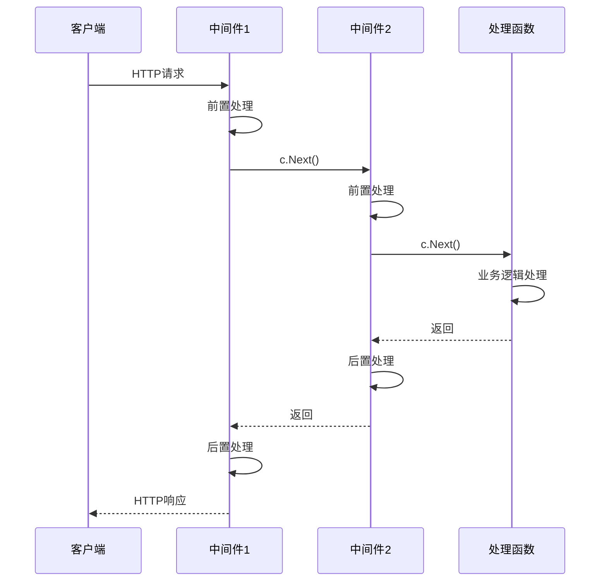

图5：Gin中间件执行时序图

### 4.4.1 中间件核心概念

**中间件(Middleware)**：是一种软件设计模式，在请求处理管道中插入可重用的组件。在Gin中，中间件是一个函数，它可以访问请求对象、响应对象和应用程序请求-响应循环中的下一个中间件函数。

**中间件链(Middleware Chain)**：多个中间件按顺序组成的处理链，请求会依次通过每个中间件。

**前置处理(Pre-processing)**：在调用`c.Next()`之前执行的逻辑，用于请求预处理。

**后置处理(Post-processing)**：在调用`c.Next()`之后执行的逻辑，用于响应后处理。

**中间件终止**：通过调用`c.Abort()`可以终止中间件链的执行，不再调用后续中间件。

### 4.4.2 中间件基础

```go
// 基本中间件
func Logger() gin.HandlerFunc {
    return func(c *gin.Context) {
        // 请求开始时间
        start := time.Now()
        
        // 处理请求
        c.Next()
        
        // 请求结束时间
        latency := time.Since(start)
        
        // 获取状态码
        status := c.Writer.Status()
        
        fmt.Printf("[%s] %s %s %d %v\n",
            c.Request.Method,
            c.Request.RequestURI,
            c.ClientIP(),
            status,
            latency,
        )
    }
}

// 使用中间件
func main() {
    r := gin.New() // 不使用默认中间件
    
    // 全局中间件
    r.Use(Logger())
    r.Use(gin.Recovery())
    
    // 路由
    r.GET("/", func(c *gin.Context) {
        c.JSON(http.StatusOK, gin.H{"message": "Hello"})
    })
    
    r.Run(":8080")
}
```

### 4.4.3 认证中间件

```go
// JWT认证中间件
func JWTAuth() gin.HandlerFunc {
    return func(c *gin.Context) {
        token := c.GetHeader("Authorization")
        if token == "" {
            c.JSON(http.StatusUnauthorized, gin.H{
                "error": "缺少认证令牌",
            })
            c.Abort()
            return
        }
        
        // 验证JWT令牌
        claims, err := validateJWT(token)
        if err != nil {
            c.JSON(http.StatusUnauthorized, gin.H{
                "error": "无效的认证令牌",
            })
            c.Abort()
            return
        }
        
        // 将用户信息存储到上下文
        c.Set("user_id", claims.UserID)
        c.Set("username", claims.Username)
        
        c.Next()
    }
}

// 角色权限中间件
func RequireRole(role string) gin.HandlerFunc {
    return func(c *gin.Context) {
        userRole, exists := c.Get("user_role")
        if !exists {
            c.JSON(http.StatusForbidden, gin.H{
                "error": "权限不足",
            })
            c.Abort()
            return
        }
        
        if userRole != role {
            c.JSON(http.StatusForbidden, gin.H{
                "error": "需要" + role + "权限",
            })
            c.Abort()
            return
        }
        
        c.Next()
    }
}
```

### 4.4.4 限流中间件

```go
import (
    "golang.org/x/time/rate"
    "sync"
)

// 基于IP的限流器
type IPRateLimiter struct {
    ips map[string]*rate.Limiter
    mu  *sync.RWMutex
    r   rate.Limit
    b   int
}

func NewIPRateLimiter(r rate.Limit, b int) *IPRateLimiter {
    return &IPRateLimiter{
        ips: make(map[string]*rate.Limiter),
        mu:  &sync.RWMutex{},
        r:   r,
        b:   b,
    }
}

func (i *IPRateLimiter) GetLimiter(ip string) *rate.Limiter {
    i.mu.Lock()
    defer i.mu.Unlock()
    
    limiter, exists := i.ips[ip]
    if !exists {
        limiter = rate.NewLimiter(i.r, i.b)
        i.ips[ip] = limiter
    }
    
    return limiter
}

// 限流中间件
func RateLimit(limiter *IPRateLimiter) gin.HandlerFunc {
    return func(c *gin.Context) {
        ip := c.ClientIP()
        l := limiter.GetLimiter(ip)
        
        if !l.Allow() {
            c.JSON(http.StatusTooManyRequests, gin.H{
                "error": "请求过于频繁，请稍后再试",
            })
            c.Abort()
            return
        }
        
        c.Next()
    }
}
```

### 4.4.5 New API项目中的中间件

```go
// middleware/auth.go
func UserAuth() gin.HandlerFunc {
    return func(c *gin.Context) {
        key := c.Request.Header.Get("Authorization")
        if key == "" {
            key = c.Query("token")
        }
        
        parts := strings.SplitN(key, " ", 2)
        if len(parts) == 2 && parts[0] == "Bearer" {
            key = parts[1]
        }
        
        if key == "" {
            abortWithMessage(c, http.StatusUnauthorized, "未提供认证令牌")
            return
        }
        
        token := model.ValidateUserToken(key)
        if token == nil {
            abortWithMessage(c, http.StatusUnauthorized, "无效的认证令牌")
            return
        }
        
        if token.Status != common.TokenStatusEnabled {
            abortWithMessage(c, http.StatusForbidden, "令牌已被禁用")
            return
        }
        
        user := model.GetUserById(token.UserId, false)
        if user == nil {
            abortWithMessage(c, http.StatusUnauthorized, "用户不存在")
            return
        }
        
        if user.Status != common.UserStatusEnabled {
            abortWithMessage(c, http.StatusForbidden, "用户已被禁用")
            return
        }
        
        c.Set("id", token.UserId)
        c.Set("token_id", token.Id)
        c.Set("token_name", token.Name)
        c.Next()
    }
}

// middleware/rate-limit.go
func GlobalAPIRateLimit() gin.HandlerFunc {
    return func(c *gin.Context) {
        if !common.RateLimitEnabled {
            c.Next()
            return
        }
        
        key := "rate_limit:" + c.ClientIP()
        
        // 使用Redis进行限流
        count, err := common.RedisGet(key)
        if err != nil {
            // Redis错误时允许请求通过
            c.Next()
            return
        }
        
        if count != "" {
            countInt, _ := strconv.Atoi(count)
            if countInt >= common.GlobalRateLimit {
                c.JSON(http.StatusTooManyRequests, gin.H{
                    "success": false,
                    "message": "请求过于频繁，请稍后再试",
                })
                c.Abort()
                return
            }
        }
        
        // 增加计数
        common.RedisSet(key, "1", time.Minute)
        
        c.Next()
    }
}
```

## 4.5 模板渲染

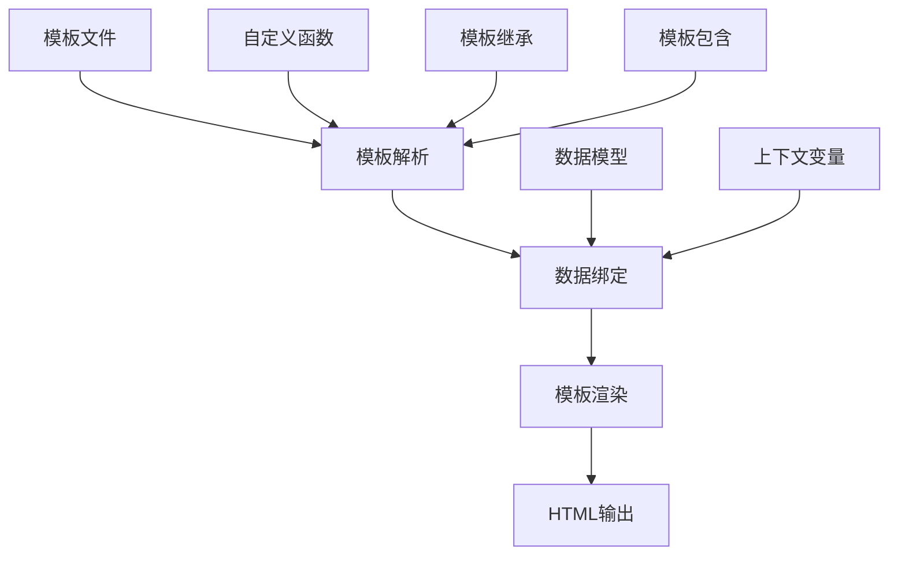

图6：Gin模板渲染流程

### 4.5.1 模板系统核心概念

**模板引擎**：将模板文件和数据结合生成最终输出的工具。Gin使用Go标准库的`html/template`包。

**模板语法**：Go模板使用双大括号`{{}}`作为动作标记，支持变量、函数调用、条件判断、循环等。

**模板继承**：通过`{{define}}`和`{{template}}`实现模板的继承和复用。

**自定义函数**：可以注册自定义函数到模板中，扩展模板的功能。

**上下文数据**：传递给模板的数据对象，在模板中可以通过`.`访问。

### 4.5.2 HTML模板

```go
// 加载模板
func setupTemplates() *gin.Engine {
    r := gin.Default()
    
    // 加载HTML模板
    r.LoadHTMLGlob("templates/*")
    
    // 静态文件
    r.Static("/static", "./static")
    
    return r
}

// 渲染模板
func indexHandler(c *gin.Context) {
    c.HTML(http.StatusOK, "index.html", gin.H{
        "title": "首页",
        "users": []string{"Alice", "Bob", "Charlie"},
    })
}
```

### 4.5.3 自定义模板函数

```go
import (
    "html/template"
    "time"
)

func setupCustomFunctions() *gin.Engine {
    r := gin.Default()
    
    // 自定义模板函数
    r.SetFuncMap(template.FuncMap{
        "formatDate": func(t time.Time) string {
            return t.Format("2006-01-02 15:04:05")
        },
        "add": func(a, b int) int {
            return a + b
        },
        "upper": func(s string) string {
            return strings.ToUpper(s)
        },
    })
    
    r.LoadHTMLGlob("templates/*")
    
    return r
}
```

## 4.6 文件上传和下载

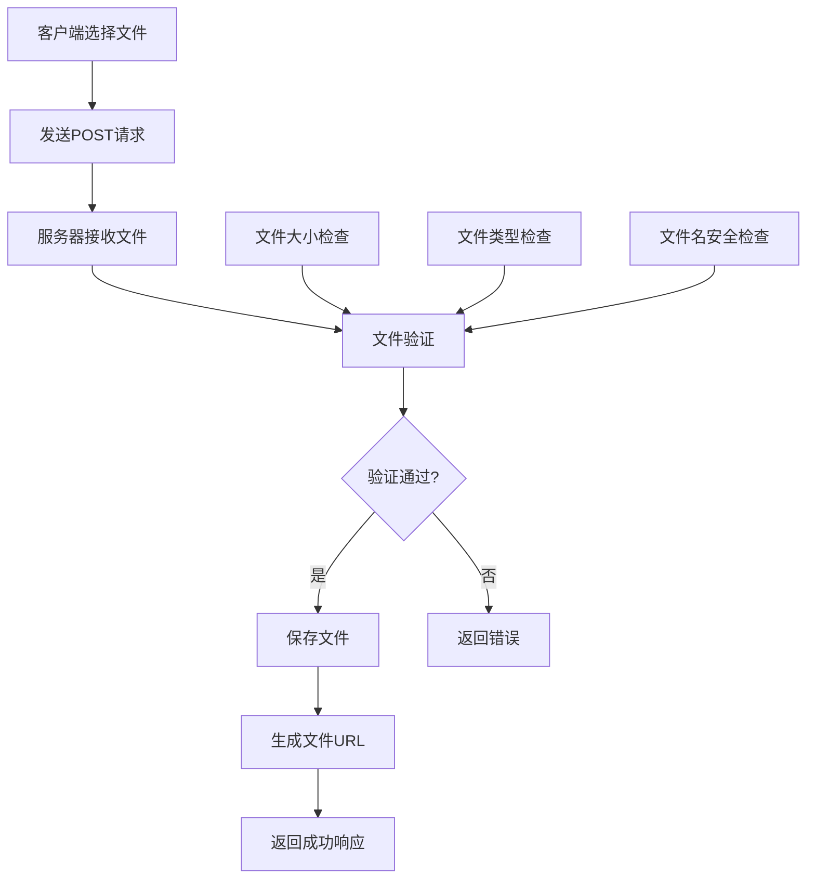

图7：文件上传处理流程

### 4.6.1 文件处理核心概念

**文件上传**：客户端通过HTTP POST请求将文件发送到服务器的过程，通常使用`multipart/form-data`编码。

**文件验证**：对上传文件进行安全检查，包括文件大小、类型、扩展名等验证。

**文件存储**：将上传的文件保存到服务器文件系统或云存储的过程。

**流式处理**：对于大文件，采用流式读写方式，避免一次性加载到内存。

**文件下载**：服务器向客户端发送文件的过程，可以是直接下载或流式下载。

### 4.6.2 单文件上传

```go
func uploadSingle(c *gin.Context) {
    // 单文件上传
    file, err := c.FormFile("file")
    if err != nil {
        c.JSON(http.StatusBadRequest, gin.H{
            "error": "文件上传失败: " + err.Error(),
        })
        return
    }
    
    // 验证文件类型
    if !isValidFileType(file.Header.Get("Content-Type")) {
        c.JSON(http.StatusBadRequest, gin.H{
            "error": "不支持的文件类型",
        })
        return
    }
    
    // 验证文件大小（10MB限制）
    if file.Size > 10*1024*1024 {
        c.JSON(http.StatusBadRequest, gin.H{
            "error": "文件大小不能超过10MB",
        })
        return
    }
    
    // 生成唯一文件名
    filename := generateUniqueFilename(file.Filename)
    filepath := "./uploads/" + filename
    
    // 保存文件
    if err := c.SaveUploadedFile(file, filepath); err != nil {
        c.JSON(http.StatusInternalServerError, gin.H{
            "error": "文件保存失败",
        })
        return
    }
    
    c.JSON(http.StatusOK, gin.H{
        "message":  "文件上传成功",
        "filename": filename,
        "size":     file.Size,
    })
}
```

### 4.6.3 多文件上传

```go
func uploadMultiple(c *gin.Context) {
    form, err := c.MultipartForm()
    if err != nil {
        c.JSON(http.StatusBadRequest, gin.H{
            "error": "解析表单失败",
        })
        return
    }
    
    files := form.File["files"]
    var uploadedFiles []string
    
    for _, file := range files {
        // 验证每个文件
        if !isValidFileType(file.Header.Get("Content-Type")) {
            continue
        }
        
        if file.Size > 10*1024*1024 {
            continue
        }
        
        filename := generateUniqueFilename(file.Filename)
        filepath := "./uploads/" + filename
        
        if err := c.SaveUploadedFile(file, filepath); err == nil {
            uploadedFiles = append(uploadedFiles, filename)
        }
    }
    
    c.JSON(http.StatusOK, gin.H{
        "message": "文件上传完成",
        "files":   uploadedFiles,
        "count":   len(uploadedFiles),
    })
}
```

### 4.6.4 文件下载

```go
func downloadFile(c *gin.Context) {
    filename := c.Param("filename")
    filepath := "./uploads/" + filename
    
    // 检查文件是否存在
    if _, err := os.Stat(filepath); os.IsNotExist(err) {
        c.JSON(http.StatusNotFound, gin.H{
            "error": "文件不存在",
        })
        return
    }
    
    // 设置响应头
    c.Header("Content-Description", "File Transfer")
    c.Header("Content-Transfer-Encoding", "binary")
    c.Header("Content-Disposition", "attachment; filename="+filename)
    c.Header("Content-Type", "application/octet-stream")
    
    // 发送文件
    c.File(filepath)
}

// 流式下载大文件
func downloadLargeFile(c *gin.Context) {
    filename := c.Param("filename")
    filepath := "./uploads/" + filename
    
    file, err := os.Open(filepath)
    if err != nil {
        c.JSON(http.StatusNotFound, gin.H{
            "error": "文件不存在",
        })
        return
    }
    defer file.Close()
    
    fileInfo, _ := file.Stat()
    fileSize := fileInfo.Size()
    
    c.Header("Content-Length", strconv.FormatInt(fileSize, 10))
    c.Header("Content-Type", "application/octet-stream")
    c.Header("Content-Disposition", "attachment; filename="+filename)
    
    // 流式传输
    io.Copy(c.Writer, file)
}
```

## 4.7 错误处理和日志

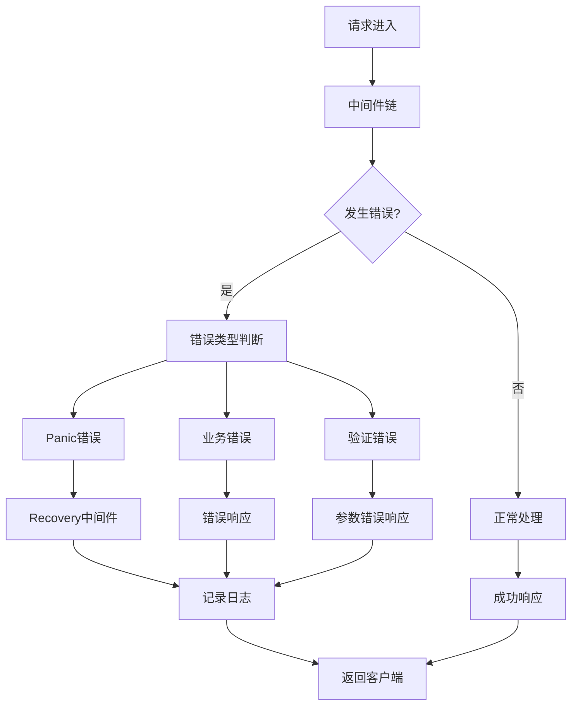

图8：Gin错误处理流程

### 4.7.1 错误处理概念

在Web应用中，错误处理是保证系统稳定性和用户体验的关键环节。Gin框架提供了多层次的错误处理机制：

- **Panic Recovery**：捕获运行时panic，防止程序崩溃
- **错误收集**：通过`c.Error()`收集处理过程中的错误
- **统一响应**：为不同类型的错误提供统一的响应格式
- **日志记录**：记录错误详情，便于问题排查

### 4.7.2 错误处理中间件

```go
// 全局错误处理
func ErrorHandler() gin.HandlerFunc {
    return func(c *gin.Context) {
        defer func() {
            if err := recover(); err != nil {
                // 记录panic日志
                log.Printf("Panic recovered: %v", err)
                
                c.JSON(http.StatusInternalServerError, gin.H{
                    "error": "服务器内部错误",
                })
                c.Abort()
            }
        }()
        
        c.Next()
        
        // 处理错误
        if len(c.Errors) > 0 {
            err := c.Errors.Last()
            
            switch err.Type {
            case gin.ErrorTypeBind:
                c.JSON(http.StatusBadRequest, gin.H{
                    "error": "请求参数错误: " + err.Error(),
                })
            case gin.ErrorTypePublic:
                c.JSON(http.StatusInternalServerError, gin.H{
                    "error": err.Error(),
                })
            default:
                c.JSON(http.StatusInternalServerError, gin.H{
                    "error": "服务器内部错误",
                })
            }
        }
    }
}

// 自定义错误类型
type APIError struct {
    Code    int    `json:"code"`
    Message string `json:"message"`
    Details string `json:"details,omitempty"`
}

func (e *APIError) Error() string {
    return e.Message
}

// 业务错误处理
func BusinessErrorHandler() gin.HandlerFunc {
    return func(c *gin.Context) {
        c.Next()
        
        if len(c.Errors) > 0 {
            err := c.Errors.Last().Err
            
            if apiErr, ok := err.(*APIError); ok {
                c.JSON(apiErr.Code, apiErr)
                return
            }
            
            // 默认错误处理
            c.JSON(http.StatusInternalServerError, &APIError{
                Code:    http.StatusInternalServerError,
                Message: "服务器内部错误",
            })
        }
    }
}
```

### 4.7.3 日志系统设计

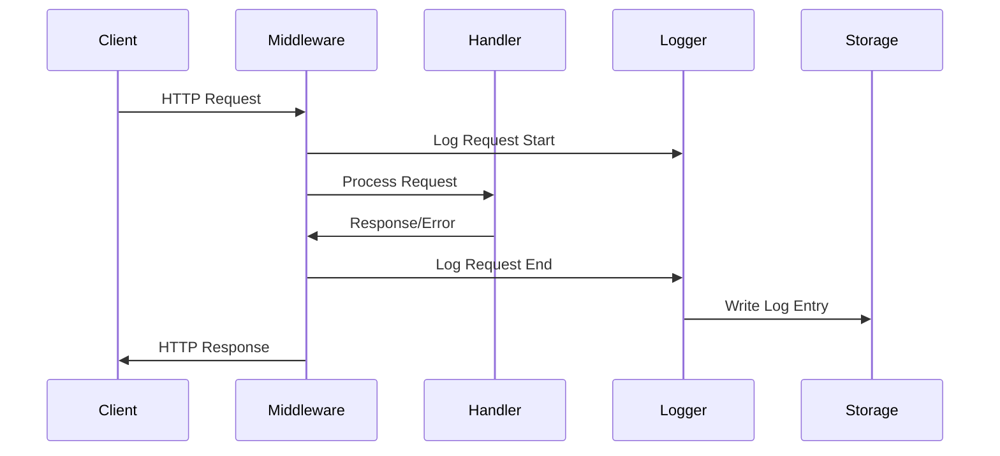

图9：日志记录时序图

### 4.7.4 结构化日志

```go
import (
    "github.com/sirupsen/logrus"
)

// 结构化日志中间件
func StructuredLogger() gin.HandlerFunc {
    logger := logrus.New()
    logger.SetFormatter(&logrus.JSONFormatter{})
    
    return func(c *gin.Context) {
        start := time.Now()
        path := c.Request.URL.Path
        raw := c.Request.URL.RawQuery
        
        c.Next()
        
        latency := time.Since(start)
        clientIP := c.ClientIP()
        method := c.Request.Method
        statusCode := c.Writer.Status()
        
        if raw != "" {
            path = path + "?" + raw
        }
        
        entry := logger.WithFields(logrus.Fields{
            "status":     statusCode,
            "latency":    latency,
            "client_ip":  clientIP,
            "method":     method,
            "path":       path,
            "user_agent": c.Request.UserAgent(),
        })
        
        if len(c.Errors) > 0 {
            entry.Error(c.Errors.String())
        } else {
            entry.Info("Request completed")
        }
    }
}

// 分级日志配置
func SetupLogger() *logrus.Logger {
    logger := logrus.New()
    
    // 设置日志级别
    logger.SetLevel(logrus.InfoLevel)
    
    // 设置日志格式
    if gin.Mode() == gin.ReleaseMode {
        logger.SetFormatter(&logrus.JSONFormatter{})
    } else {
        logger.SetFormatter(&logrus.TextFormatter{
            FullTimestamp: true,
        })
    }
    
    // 设置日志输出
    if gin.Mode() == gin.ReleaseMode {
        file, err := os.OpenFile("app.log", os.O_CREATE|os.O_WRONLY|os.O_APPEND, 0666)
        if err == nil {
            logger.SetOutput(file)
        }
    }
    
    return logger
}
```

### 4.7.5 New API项目中的错误处理

```go
// common/gin.go
func SetupGinLogger(server *gin.Engine) {
    if os.Getenv("GIN_MODE") != "debug" {
        gin.DefaultWriter = io.Discard
    }
    
    server.Use(gin.CustomRecovery(func(c *gin.Context, err any) {
        logger.SysError(fmt.Sprintf("panic detected: %v", err))
        c.JSON(http.StatusInternalServerError, gin.H{
            "error": gin.H{
                "message": "服务器内部错误",
                "type":    "internal_server_error",
            },
        })
    }))
    
    server.Use(RequestLogger())
}

// 请求日志中间件
func RequestLogger() gin.HandlerFunc {
    return func(c *gin.Context) {
        start := time.Now()
        
        c.Next()
        
        latency := time.Since(start)
        
        logger.SysLog(fmt.Sprintf(
            "[%s] %s %s %d %v %s",
            c.Request.Method,
            c.Request.RequestURI,
            c.ClientIP(),
            c.Writer.Status(),
            latency,
            c.Request.UserAgent(),
        ))
    }
}
```
```

## 4.8 测试

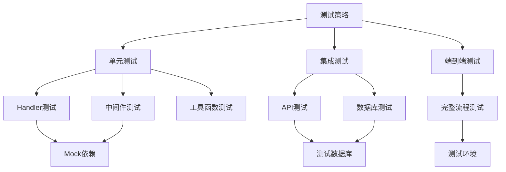

图10：Gin应用测试策略

### 4.8.1 测试基础概念

在Gin应用开发中，测试是保证代码质量的重要手段。主要测试类型包括：

- **单元测试**：测试单个函数或方法的功能
- **集成测试**：测试多个组件协同工作的情况
- **端到端测试**：测试完整的用户场景
- **性能测试**：测试应用的性能表现

### 4.8.2 HTTP测试

```go
import (
    "bytes"
    "encoding/json"
    "net/http"
    "net/http/httptest"
    "testing"
    
    "github.com/gin-gonic/gin"
    "github.com/stretchr/testify/assert"
    "github.com/stretchr/testify/suite"
)

// 测试套件
type APITestSuite struct {
    suite.Suite
    router *gin.Engine
}

func (suite *APITestSuite) SetupTest() {
    gin.SetMode(gin.TestMode)
    suite.router = setupTestRouter()
}

func setupTestRouter() *gin.Engine {
    r := gin.New()
    
    r.GET("/ping", func(c *gin.Context) {
        c.JSON(http.StatusOK, gin.H{"message": "pong"})
    })
    
    r.POST("/users", func(c *gin.Context) {
        var user User
        if err := c.ShouldBindJSON(&user); err != nil {
            c.JSON(http.StatusBadRequest, gin.H{"error": err.Error()})
            return
        }
        c.JSON(http.StatusCreated, user)
    })
    
    return r
}

func (suite *APITestSuite) TestPingRoute() {
    w := httptest.NewRecorder()
    req, _ := http.NewRequest("GET", "/ping", nil)
    suite.router.ServeHTTP(w, req)
    
    assert.Equal(suite.T(), http.StatusOK, w.Code)
    assert.Contains(suite.T(), w.Body.String(), "pong")
}

func (suite *APITestSuite) TestCreateUser() {
    user := User{
        Name:  "Test User",
        Email: "test@example.com",
        Age:   25,
    }
    
    jsonData, _ := json.Marshal(user)
    
    w := httptest.NewRecorder()
    req, _ := http.NewRequest("POST", "/users", bytes.NewBuffer(jsonData))
    req.Header.Set("Content-Type", "application/json")
    
    suite.router.ServeHTTP(w, req)
    
    assert.Equal(suite.T(), http.StatusCreated, w.Code)
    
    var response User
    err := json.Unmarshal(w.Body.Bytes(), &response)
    assert.NoError(suite.T(), err)
    assert.Equal(suite.T(), user.Name, response.Name)
    assert.Equal(suite.T(), user.Email, response.Email)
}

// 运行测试套件
func TestAPISuite(t *testing.T) {
    suite.Run(t, new(APITestSuite))
}
```

### 4.8.3 中间件测试

```go
func TestAuthMiddleware(t *testing.T) {
    tests := []struct {
        name           string
        token          string
        expectedStatus int
        expectedBody   string
    }{
        {
            name:           "无token",
            token:          "",
            expectedStatus: http.StatusUnauthorized,
            expectedBody:   "缺少认证令牌",
        },
        {
            name:           "无效token",
            token:          "invalid_token",
            expectedStatus: http.StatusUnauthorized,
            expectedBody:   "无效的认证令牌",
        },
        {
            name:           "有效token",
            token:          "valid_token_here",
            expectedStatus: http.StatusOK,
            expectedBody:   "success",
        },
    }
    
    for _, tt := range tests {
        t.Run(tt.name, func(t *testing.T) {
            router := gin.New()
            router.Use(JWTAuth())
            router.GET("/protected", func(c *gin.Context) {
                c.JSON(http.StatusOK, gin.H{"message": "success"})
            })
            
            w := httptest.NewRecorder()
            req, _ := http.NewRequest("GET", "/protected", nil)
            
            if tt.token != "" {
                req.Header.Set("Authorization", tt.token)
            }
            
            router.ServeHTTP(w, req)
            
            assert.Equal(t, tt.expectedStatus, w.Code)
            assert.Contains(t, w.Body.String(), tt.expectedBody)
        })
    }
}

// 限流中间件测试
func TestRateLimitMiddleware(t *testing.T) {
    limiter := NewIPRateLimiter(1, 1) // 每秒1个请求
    
    router := gin.New()
    router.Use(RateLimit(limiter))
    router.GET("/test", func(c *gin.Context) {
        c.JSON(http.StatusOK, gin.H{"message": "ok"})
    })
    
    // 第一个请求应该成功
    w1 := httptest.NewRecorder()
    req1, _ := http.NewRequest("GET", "/test", nil)
    router.ServeHTTP(w1, req1)
    assert.Equal(t, http.StatusOK, w1.Code)
    
    // 第二个请求应该被限流
    w2 := httptest.NewRecorder()
    req2, _ := http.NewRequest("GET", "/test", nil)
    router.ServeHTTP(w2, req2)
    assert.Equal(t, http.StatusTooManyRequests, w2.Code)
}
```

### 4.8.4 Mock测试

```go
import (
    "github.com/golang/mock/gomock"
    "github.com/stretchr/testify/mock"
)

// Mock用户服务
type MockUserService struct {
    mock.Mock
}

func (m *MockUserService) CreateUser(user *User) error {
    args := m.Called(user)
    return args.Error(0)
}

func (m *MockUserService) GetUser(id int) (*User, error) {
    args := m.Called(id)
    return args.Get(0).(*User), args.Error(1)
}

// 使用Mock进行测试
func TestUserHandler(t *testing.T) {
    mockService := new(MockUserService)
    
    // 设置Mock期望
    user := &User{ID: 1, Name: "Test User", Email: "test@example.com"}
    mockService.On("CreateUser", mock.AnythingOfType("*User")).Return(nil)
    mockService.On("GetUser", 1).Return(user, nil)
    
    // 创建处理器
    handler := &UserHandler{service: mockService}
    
    // 测试创建用户
    router := gin.New()
    router.POST("/users", handler.CreateUser)
    
    jsonData, _ := json.Marshal(user)
    w := httptest.NewRecorder()
    req, _ := http.NewRequest("POST", "/users", bytes.NewBuffer(jsonData))
    req.Header.Set("Content-Type", "application/json")
    
    router.ServeHTTP(w, req)
    
    assert.Equal(t, http.StatusCreated, w.Code)
    mockService.AssertExpectations(t)
}
```

### 4.8.5 集成测试

```go
// 集成测试套件
type IntegrationTestSuite struct {
    suite.Suite
    server *httptest.Server
    client *http.Client
}

func (suite *IntegrationTestSuite) SetupSuite() {
    // 设置测试数据库
    setupTestDB()
    
    // 创建测试服务器
    router := setupRouter()
    suite.server = httptest.NewServer(router)
    suite.client = &http.Client{}
}

func (suite *IntegrationTestSuite) TearDownSuite() {
    suite.server.Close()
    cleanupTestDB()
}

func (suite *IntegrationTestSuite) TestUserWorkflow() {
    // 1. 注册用户
    user := User{
        Username: "testuser",
        Email:    "test@example.com",
        Password: "password123",
    }
    
    registerResp := suite.makeRequest("POST", "/api/register", user)
    assert.Equal(suite.T(), http.StatusOK, registerResp.StatusCode)
    
    // 2. 登录用户
    loginData := LoginRequest{
        Username: "testuser",
        Password: "password123",
    }
    
    loginResp := suite.makeRequest("POST", "/api/login", loginData)
    assert.Equal(suite.T(), http.StatusOK, loginResp.StatusCode)
    
    // 解析token
    var loginResult struct {
        Token string `json:"token"`
    }
    json.NewDecoder(loginResp.Body).Decode(&loginResult)
    
    // 3. 使用token访问受保护资源
    req, _ := http.NewRequest("GET", suite.server.URL+"/api/profile", nil)
    req.Header.Set("Authorization", "Bearer "+loginResult.Token)
    
    profileResp, _ := suite.client.Do(req)
    assert.Equal(suite.T(), http.StatusOK, profileResp.StatusCode)
}

func (suite *IntegrationTestSuite) makeRequest(method, path string, data interface{}) *http.Response {
    jsonData, _ := json.Marshal(data)
    req, _ := http.NewRequest(method, suite.server.URL+path, bytes.NewBuffer(jsonData))
    req.Header.Set("Content-Type", "application/json")
    
    resp, _ := suite.client.Do(req)
    return resp
}
```

### 4.8.6 性能测试

```go
// 基准测试
func BenchmarkPingHandler(b *testing.B) {
    router := setupTestRouter()
    
    b.ResetTimer()
    b.RunParallel(func(pb *testing.PB) {
        for pb.Next() {
            w := httptest.NewRecorder()
            req, _ := http.NewRequest("GET", "/ping", nil)
            router.ServeHTTP(w, req)
        }
    })
}

// 压力测试
func TestConcurrentRequests(t *testing.T) {
    router := setupTestRouter()
    server := httptest.NewServer(router)
    defer server.Close()
    
    const numRequests = 100
    const numWorkers = 10
    
    requests := make(chan int, numRequests)
    results := make(chan int, numRequests)
    
    // 启动工作协程
    for i := 0; i < numWorkers; i++ {
        go func() {
            client := &http.Client{}
            for range requests {
                resp, err := client.Get(server.URL + "/ping")
                if err != nil {
                    results <- 0
                    continue
                }
                results <- resp.StatusCode
                resp.Body.Close()
            }
        }()
    }
    
    // 发送请求
    for i := 0; i < numRequests; i++ {
        requests <- i
    }
    close(requests)
    
    // 收集结果
    successCount := 0
    for i := 0; i < numRequests; i++ {
        if status := <-results; status == http.StatusOK {
            successCount++
        }
    }
    
    assert.Equal(t, numRequests, successCount)
}
```

### 4.8.7 New API项目测试实践

```go
// controller/user_test.go
func TestUserController(t *testing.T) {
    // 设置测试环境
    gin.SetMode(gin.TestMode)
    
    tests := []struct {
        name           string
        method         string
        path           string
        body           interface{}
        expectedStatus int
        setupMock      func()
    }{
        {
            name:   "注册成功",
            method: "POST",
            path:   "/api/user/register",
            body: map[string]string{
                "username": "testuser",
                "password": "password123",
                "email":    "test@example.com",
            },
            expectedStatus: http.StatusOK,
            setupMock: func() {
                // 设置数据库Mock
            },
        },
    }
    
    for _, tt := range tests {
        t.Run(tt.name, func(t *testing.T) {
            if tt.setupMock != nil {
                tt.setupMock()
            }
            
            router := setupTestRouter()
            
            jsonData, _ := json.Marshal(tt.body)
            w := httptest.NewRecorder()
            req, _ := http.NewRequest(tt.method, tt.path, bytes.NewBuffer(jsonData))
            req.Header.Set("Content-Type", "application/json")
            
            router.ServeHTTP(w, req)
            
            assert.Equal(t, tt.expectedStatus, w.Code)
        })
    }
}
```

## 4.9 性能优化

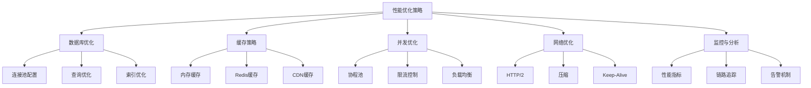

图11：Gin应用性能优化策略

### 4.9.1 性能优化基础概念

性能优化是提升应用响应速度和处理能力的关键技术，主要包括：

- **吞吐量**：单位时间内处理的请求数量
- **响应时间**：从请求发送到响应返回的时间
- **并发数**：同时处理的请求数量
- **资源利用率**：CPU、内存、网络等资源的使用效率

### 4.9.2 数据库优化

#### 连接池配置

```go
import (
    "database/sql"
    "time"
    
    _ "github.com/go-sql-driver/mysql"
    "gorm.io/driver/mysql"
    "gorm.io/gorm"
)

// 数据库配置结构
type DBConfig struct {
    MaxOpenConns    int           // 最大打开连接数
    MaxIdleConns    int           // 最大空闲连接数
    ConnMaxLifetime time.Duration // 连接最大生存时间
    ConnMaxIdleTime time.Duration // 连接最大空闲时间
}

func setupDB(config DBConfig) *sql.DB {
    db, err := sql.Open("mysql", "user:password@tcp(localhost:3306)/dbname?parseTime=true&loc=Local")
    if err != nil {
        panic(err)
    }
    
    // 设置连接池参数
    db.SetMaxOpenConns(config.MaxOpenConns)        // 最大打开连接数
    db.SetMaxIdleConns(config.MaxIdleConns)         // 最大空闲连接数
    db.SetConnMaxLifetime(config.ConnMaxLifetime)   // 连接最大生存时间
    db.SetConnMaxIdleTime(config.ConnMaxIdleTime)   // 连接最大空闲时间
    
    return db
}

// GORM连接池配置
func setupGormDB() *gorm.DB {
    dsn := "user:password@tcp(localhost:3306)/dbname?charset=utf8mb4&parseTime=True&loc=Local"
    db, err := gorm.Open(mysql.Open(dsn), &gorm.Config{
        // 禁用默认事务
        SkipDefaultTransaction: true,
        // 预编译语句
        PrepareStmt: true,
    })
    if err != nil {
        panic(err)
    }
    
    sqlDB, _ := db.DB()
    sqlDB.SetMaxOpenConns(100)
    sqlDB.SetMaxIdleConns(10)
    sqlDB.SetConnMaxLifetime(time.Hour)
    
    return db
}
```

#### 查询优化

```go
// 批量查询优化
func GetUsersByIDs(db *gorm.DB, ids []int) ([]User, error) {
    var users []User
    
    // 使用IN查询替代多次单独查询
    err := db.Where("id IN ?", ids).Find(&users).Error
    return users, err
}

// 分页查询优化
func GetUsersWithPagination(db *gorm.DB, page, pageSize int) ([]User, int64, error) {
    var users []User
    var total int64
    
    // 先查询总数
    db.Model(&User{}).Count(&total)
    
    // 再查询数据，使用LIMIT和OFFSET
    offset := (page - 1) * pageSize
    err := db.Offset(offset).Limit(pageSize).Find(&users).Error
    
    return users, total, err
}

// 预加载优化
func GetUserWithProfile(db *gorm.DB, userID int) (*User, error) {
    var user User
    
    // 使用Preload避免N+1查询问题
    err := db.Preload("Profile").Preload("Orders").First(&user, userID).Error
    return &user, err
}
```

### 4.9.3 缓存策略

#### 多级缓存系统

```go
import (
    "context"
    "crypto/md5"
    "fmt"
    "sync"
    "time"
    
    "github.com/gin-gonic/gin"
    "github.com/go-redis/redis/v8"
    "github.com/patrickmn/go-cache"
)

// 多级缓存管理器
type CacheManager struct {
    localCache  *cache.Cache
    redisClient *redis.Client
    mutex       sync.RWMutex
}

func NewCacheManager(redisClient *redis.Client) *CacheManager {
    return &CacheManager{
        localCache:  cache.New(5*time.Minute, 10*time.Minute),
        redisClient: redisClient,
    }
}

func (cm *CacheManager) Get(ctx context.Context, key string) (string, bool) {
    // 1. 先查本地缓存
    if value, found := cm.localCache.Get(key); found {
        return value.(string), true
    }
    
    // 2. 查Redis缓存
    value, err := cm.redisClient.Get(ctx, key).Result()
    if err == nil {
        // 回写到本地缓存
        cm.localCache.Set(key, value, cache.DefaultExpiration)
        return value, true
    }
    
    return "", false
}

func (cm *CacheManager) Set(ctx context.Context, key, value string, expiration time.Duration) error {
    // 同时设置本地缓存和Redis缓存
    cm.localCache.Set(key, value, expiration)
    return cm.redisClient.Set(ctx, key, value, expiration).Err()
}

// 缓存中间件
func CacheMiddleware(cacheManager *CacheManager, duration time.Duration) gin.HandlerFunc {
    return func(c *gin.Context) {
        // 只缓存GET请求
        if c.Request.Method != "GET" {
            c.Next()
            return
        }
        
        // 生成缓存键
        key := generateCacheKey(c.Request.URL.Path, c.Request.URL.RawQuery)
        
        // 尝试从缓存获取
        if cached, found := cacheManager.Get(c.Request.Context(), key); found {
            c.Header("X-Cache", "HIT")
            c.Header("Content-Type", "application/json")
            c.String(200, cached)
            c.Abort()
            return
        }
        
        // 缓存未命中
        c.Header("X-Cache", "MISS")
        
        // 使用ResponseWriter包装器捕获响应
        writer := &responseWriter{
            ResponseWriter: c.Writer,
            body:          &bytes.Buffer{},
        }
        c.Writer = writer
        
        c.Next()
        
        // 缓存成功响应
        if c.Writer.Status() == 200 && writer.body.Len() > 0 {
            cacheManager.Set(c.Request.Context(), key, writer.body.String(), duration)
        }
    }
}

func generateCacheKey(path, query string) string {
    data := fmt.Sprintf("%s?%s", path, query)
    return fmt.Sprintf("gin_cache:%x", md5.Sum([]byte(data)))
}

type responseWriter struct {
    gin.ResponseWriter
    body *bytes.Buffer
}

func (w *responseWriter) Write(data []byte) (int, error) {
    w.body.Write(data)
    return w.ResponseWriter.Write(data)
}
```

### 4.9.4 并发优化

#### 协程池

```go
import (
    "context"
    "sync"
)

// 工作池
type WorkerPool struct {
    workerCount int
    jobQueue    chan Job
    wg          sync.WaitGroup
    ctx         context.Context
    cancel      context.CancelFunc
}

type Job func() error

func NewWorkerPool(workerCount, queueSize int) *WorkerPool {
    ctx, cancel := context.WithCancel(context.Background())
    
    return &WorkerPool{
        workerCount: workerCount,
        jobQueue:    make(chan Job, queueSize),
        ctx:         ctx,
        cancel:      cancel,
    }
}

func (wp *WorkerPool) Start() {
    for i := 0; i < wp.workerCount; i++ {
        wp.wg.Add(1)
        go wp.worker()
    }
}

func (wp *WorkerPool) worker() {
    defer wp.wg.Done()
    
    for {
        select {
        case job := <-wp.jobQueue:
            if job != nil {
                job()
            }
        case <-wp.ctx.Done():
            return
        }
    }
}

func (wp *WorkerPool) Submit(job Job) bool {
    select {
    case wp.jobQueue <- job:
        return true
    default:
        return false // 队列已满
    }
}

func (wp *WorkerPool) Stop() {
    wp.cancel()
    close(wp.jobQueue)
    wp.wg.Wait()
}

// 在Gin中使用协程池
func AsyncHandler(pool *WorkerPool) gin.HandlerFunc {
    return func(c *gin.Context) {
        // 提交异步任务
        success := pool.Submit(func() error {
            // 执行耗时操作
            time.Sleep(time.Second)
            log.Println("异步任务完成")
            return nil
        })
        
        if success {
            c.JSON(200, gin.H{"message": "任务已提交"})
        } else {
            c.JSON(503, gin.H{"error": "服务繁忙，请稍后重试"})
        }
    }
}
```

### 4.9.5 网络优化

#### HTTP/2和压缩

```go
import (
    "compress/gzip"
    "net/http"
    "strings"
    
    "github.com/gin-gonic/gin"
)

// Gzip压缩中间件
func GzipMiddleware() gin.HandlerFunc {
    return func(c *gin.Context) {
        // 检查客户端是否支持gzip
        if !strings.Contains(c.GetHeader("Accept-Encoding"), "gzip") {
            c.Next()
            return
        }
        
        // 设置响应头
        c.Header("Content-Encoding", "gzip")
        c.Header("Vary", "Accept-Encoding")
        
        // 创建gzip writer
        gz := gzip.NewWriter(c.Writer)
        defer gz.Close()
        
        // 包装ResponseWriter
        c.Writer = &gzipWriter{ResponseWriter: c.Writer, Writer: gz}
        c.Next()
    }
}

type gzipWriter struct {
    gin.ResponseWriter
    Writer *gzip.Writer
}

func (g *gzipWriter) Write(data []byte) (int, error) {
    return g.Writer.Write(data)
}

// HTTP/2服务器配置
func startHTTP2Server() {
    router := gin.Default()
    router.Use(GzipMiddleware())
    
    // 配置TLS
    server := &http.Server{
        Addr:    ":8443",
        Handler: router,
    }
    
    // 启动HTTP/2服务器
    log.Fatal(server.ListenAndServeTLS("cert.pem", "key.pem"))
}
```

### 4.9.6 性能监控

#### 性能指标收集

```go
import (
    "time"
    
    "github.com/gin-gonic/gin"
    "github.com/prometheus/client_golang/prometheus"
    "github.com/prometheus/client_golang/prometheus/promhttp"
)

// Prometheus指标
var (
    httpRequestsTotal = prometheus.NewCounterVec(
        prometheus.CounterOpts{
            Name: "http_requests_total",
            Help: "Total number of HTTP requests",
        },
        []string{"method", "path", "status"},
    )
    
    httpRequestDuration = prometheus.NewHistogramVec(
        prometheus.HistogramOpts{
            Name:    "http_request_duration_seconds",
            Help:    "HTTP request duration in seconds",
            Buckets: prometheus.DefBuckets,
        },
        []string{"method", "path"},
    )
    
    httpRequestsInFlight = prometheus.NewGauge(
        prometheus.GaugeOpts{
            Name: "http_requests_in_flight",
            Help: "Current number of HTTP requests being processed",
        },
    )
)

func init() {
    prometheus.MustRegister(httpRequestsTotal)
    prometheus.MustRegister(httpRequestDuration)
    prometheus.MustRegister(httpRequestsInFlight)
}

// 性能监控中间件
func PrometheusMiddleware() gin.HandlerFunc {
    return func(c *gin.Context) {
        start := time.Now()
        
        // 增加正在处理的请求数
        httpRequestsInFlight.Inc()
        defer httpRequestsInFlight.Dec()
        
        c.Next()
        
        // 记录指标
        duration := time.Since(start).Seconds()
        status := string(rune(c.Writer.Status()))
        
        httpRequestsTotal.WithLabelValues(
            c.Request.Method,
            c.FullPath(),
            status,
        ).Inc()
        
        httpRequestDuration.WithLabelValues(
            c.Request.Method,
            c.FullPath(),
        ).Observe(duration)
    }
}

// 设置监控端点
func setupMonitoring(router *gin.Engine) {
    router.GET("/metrics", gin.WrapH(promhttp.Handler()))
    
    // 健康检查端点
    router.GET("/health", func(c *gin.Context) {
        c.JSON(200, gin.H{
            "status":    "ok",
            "timestamp": time.Now().Unix(),
        })
    })
}
```

### 4.9.7 New API项目性能优化实践

```go
// config/performance.go
type PerformanceConfig struct {
    // 数据库配置
    DB struct {
        MaxOpenConns    int `json:"max_open_conns"`
        MaxIdleConns    int `json:"max_idle_conns"`
        ConnMaxLifetime int `json:"conn_max_lifetime"`
    } `json:"db"`
    
    // 缓存配置
    Cache struct {
        Enabled    bool `json:"enabled"`
        DefaultTTL int  `json:"default_ttl"`
    } `json:"cache"`
    
    // 限流配置
    RateLimit struct {
        Enabled bool `json:"enabled"`
        RPS     int  `json:"rps"`
    } `json:"rate_limit"`
}

// middleware/performance.go
func SetupPerformanceMiddleware(router *gin.Engine, config *PerformanceConfig) {
    // 1. 性能监控
    router.Use(PrometheusMiddleware())
    
    // 2. Gzip压缩
    router.Use(GzipMiddleware())
    
    // 3. 缓存中间件
    if config.Cache.Enabled {
        cacheManager := NewCacheManager(redis.NewClient(&redis.Options{
            Addr: "localhost:6379",
        }))
        router.Use(CacheMiddleware(cacheManager, time.Duration(config.Cache.DefaultTTL)*time.Second))
    }
    
    // 4. 限流中间件
    if config.RateLimit.Enabled {
        limiter := NewIPRateLimiter(config.RateLimit.RPS, config.RateLimit.RPS)
        router.Use(RateLimit(limiter))
    }
}

// service/optimization.go
type OptimizedUserService struct {
    db    *gorm.DB
    cache *CacheManager
    pool  *WorkerPool
}

func (s *OptimizedUserService) GetUser(ctx context.Context, userID int) (*User, error) {
    cacheKey := fmt.Sprintf("user:%d", userID)
    
    // 先查缓存
    if cached, found := s.cache.Get(ctx, cacheKey); found {
        var user User
        if err := json.Unmarshal([]byte(cached), &user); err == nil {
            return &user, nil
        }
    }
    
    // 查数据库
    var user User
    if err := s.db.First(&user, userID).Error; err != nil {
        return nil, err
    }
    
    // 异步更新缓存
    s.pool.Submit(func() error {
        if data, err := json.Marshal(user); err == nil {
            s.cache.Set(ctx, cacheKey, string(data), 10*time.Minute)
        }
        return nil
    })
    
    return &user, nil
}
```
```

## 4.10 New API项目最佳实践总结

### 4.10.1 项目架构设计

```go
// main.go - 应用程序入口
func main() {
    // 1. 加载配置
    config := loadConfig()
    
    // 2. 初始化数据库
    db := initDatabase(config)
    
    // 3. 初始化Redis
    redis := initRedis(config)
    
    // 4. 创建服务层
    services := &Services{
        UserService:  NewUserService(db, redis),
        TokenService: NewTokenService(db, redis),
        ModelService: NewModelService(db, redis),
    }
    
    // 5. 设置路由
    router := setupRouter(services, config)
    
    // 6. 启动服务器
    startServer(router, config)
}

// 优雅关闭
func startServer(router *gin.Engine, config *Config) {
    srv := &http.Server{
        Addr:    ":" + config.Port,
        Handler: router,
    }
    
    go func() {
        if err := srv.ListenAndServe(); err != nil && err != http.ErrServerClosed {
            log.Fatalf("服务器启动失败: %s\n", err)
        }
    }()
    
    // 等待中断信号
    quit := make(chan os.Signal, 1)
    signal.Notify(quit, syscall.SIGINT, syscall.SIGTERM)
    <-quit
    
    log.Println("正在关闭服务器...")
    
    ctx, cancel := context.WithTimeout(context.Background(), 30*time.Second)
    defer cancel()
    
    if err := srv.Shutdown(ctx); err != nil {
        log.Fatal("服务器强制关闭:", err)
    }
    
    log.Println("服务器已退出")
}
```

### 4.10.2 统一响应格式

```go
// response/response.go
type Response struct {
    Success bool        `json:"success"`
    Message string      `json:"message"`
    Data    interface{} `json:"data,omitempty"`
    Error   *ErrorInfo  `json:"error,omitempty"`
}

type ErrorInfo struct {
    Code    string `json:"code"`
    Details string `json:"details,omitempty"`
}

// 成功响应
func Success(c *gin.Context, data interface{}) {
    c.JSON(http.StatusOK, Response{
        Success: true,
        Message: "操作成功",
        Data:    data,
    })
}

// 错误响应
func Error(c *gin.Context, code int, message string, details ...string) {
    errorInfo := &ErrorInfo{
        Code: fmt.Sprintf("E%d", code),
    }
    
    if len(details) > 0 {
        errorInfo.Details = details[0]
    }
    
    c.JSON(code, Response{
        Success: false,
        Message: message,
        Error:   errorInfo,
    })
}
```

### 4.10.3 配置管理最佳实践

```go
// config/config.go
type Config struct {
    Server   ServerConfig   `yaml:"server"`
    Database DatabaseConfig `yaml:"database"`
    Redis    RedisConfig    `yaml:"redis"`
    JWT      JWTConfig      `yaml:"jwt"`
    Log      LogConfig      `yaml:"log"`
}

type ServerConfig struct {
    Port         string        `yaml:"port"`
    Mode         string        `yaml:"mode"`
    ReadTimeout  time.Duration `yaml:"read_timeout"`
    WriteTimeout time.Duration `yaml:"write_timeout"`
}

// 加载配置
func LoadConfig() *Config {
    var config Config
    
    // 1. 从文件加载
    if data, err := ioutil.ReadFile("config.yaml"); err == nil {
        yaml.Unmarshal(data, &config)
    }
    
    // 2. 环境变量覆盖
    if port := os.Getenv("PORT"); port != "" {
        config.Server.Port = port
    }
    
    // 3. 设置默认值
    if config.Server.Port == "" {
        config.Server.Port = "3000"
    }
    
    return &config
}
```

### 4.10.4 数据库操作最佳实践

```go
// repository/base.go
type BaseRepository struct {
    db *gorm.DB
}

func (r *BaseRepository) Transaction(fn func(*gorm.DB) error) error {
    tx := r.db.Begin()
    defer func() {
        if r := recover(); r != nil {
            tx.Rollback()
        }
    }()
    
    if err := fn(tx); err != nil {
        tx.Rollback()
        return err
    }
    
    return tx.Commit().Error
}

// service/user.go
type UserService struct {
    repo  *UserRepository
    cache *CacheManager
}

func (s *UserService) CreateUser(ctx context.Context, req *CreateUserRequest) (*User, error) {
    // 1. 参数验证
    if err := s.validateCreateUser(req); err != nil {
        return nil, err
    }
    
    // 2. 检查用户是否存在
    if exists, _ := s.repo.ExistsByEmail(ctx, req.Email); exists {
        return nil, errors.New("邮箱已存在")
    }
    
    // 3. 创建用户
    user := &User{
        Username: req.Username,
        Email:    req.Email,
        Password: s.hashPassword(req.Password),
    }
    
    if err := s.repo.Create(ctx, user); err != nil {
        return nil, err
    }
    
    // 4. 清除相关缓存
    s.cache.Delete(ctx, "users:list")
    
    return user, nil
}
```

## 本章小结

本章全面介绍了Gin框架的核心特性和实际应用，包括：

1. **Gin框架基础**：了解了Gin的特性、安装和基本使用
2. **路由系统**：掌握了路径参数、查询参数、路由组等高级路由功能
3. **请求处理**：学习了JSON绑定、表单处理、数据验证等请求处理技术
4. **中间件系统**：实现了认证、限流、日志等常用中间件
5. **模板渲染**：了解了HTML模板和自定义函数的使用
6. **文件操作**：实现了文件上传和下载功能
7. **错误处理**：建立了完整的错误处理和日志系统
8. **测试**：学习了HTTP测试和中间件测试的方法
9. **性能优化**：掌握了服务器配置和缓存优化技术
10. **最佳实践**：总结了New API项目的架构设计和开发规范

通过New API项目的实际案例，我们看到了这些特性在企业级应用中的具体实现。

## 练习题

1. 实现一个完整的用户管理API，包括注册、登录、CRUD操作
2. 编写一个文件上传服务，支持多种文件类型和大小限制
3. 实现一个基于Redis的分布式限流中间件
4. 创建一个RESTful API的测试套件，覆盖所有端点
5. 设计一个高性能的缓存系统，支持不同的缓存策略

## 扩展阅读

### 官方文档和教程
- [Gin官方文档](https://gin-gonic.com/docs/)
- [Go Web编程教程](https://golang.org/doc/tutorial/web-service-gin)
- [Go语言Web开发最佳实践](https://golang.org/doc/articles/wiki/)
- [Go HTTP包详解](https://golang.org/pkg/net/http/)

### API设计和开发
- [RESTful API设计指南](https://restfulapi.net/)
- [API设计最佳实践](https://docs.microsoft.com/en-us/azure/architecture/best-practices/api-design)
- [OpenAPI规范](https://swagger.io/specification/)
- [GraphQL vs REST](https://blog.apollographql.com/graphql-vs-rest-5d425123e34b)

### 认证和安全
- [JWT认证详解](https://jwt.io/introduction/)
- [OAuth 2.0教程](https://auth0.com/intro-to-iam/what-is-oauth-2/)
- [Web安全OWASP指南](https://owasp.org/www-project-web-security-testing-guide/)
- [Go安全编程](https://golang.org/doc/security/)

### 性能优化和测试
- [Go语言性能优化](https://golang.org/doc/diagnostics.html)
- [pprof性能分析](https://golang.org/pkg/runtime/pprof/)
- [Go测试最佳实践](https://golang.org/pkg/testing/)
- [Go基准测试](https://golang.org/pkg/testing/#hdr-Benchmarks)

### 实践项目和示例
- [Gin示例项目](https://github.com/gin-gonic/examples)
- [Go Web框架对比](https://github.com/smallnest/go-web-framework-benchmark)
- [企业级Go项目结构](https://github.com/golang-standards/project-layout)
- [Go clean architecture示例](https://github.com/bxcodec/go-clean-arch)

### 中间件和工具
- [Gin中间件集合](https://github.com/gin-contrib)
- [Go Validator验证库](https://github.com/go-playground/validator)
- [Logrus日志库](https://github.com/sirupsen/logrus)
- [Viper配置管理](https://github.com/spf13/viper)
