# 第5章 RESTful API设计与实现

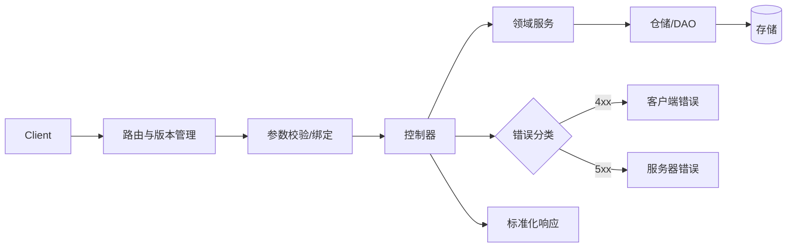

图1：RESTful 请求处理与响应规范流程

本章将深入探讨RESTful API的设计原则与实现技巧，通过New-API项目的实际案例，学习如何构建企业级的API服务。我们将从REST架构风格的核心概念开始，逐步深入到API设计的最佳实践、数据验证与序列化、分页与过滤机制，以及API文档生成和测试策略。

## 5.1 RESTful API设计原则

概念要点：
- 资源（Resource）：业务对象的抽象，如 `users`、`orders`。
- 表现（Representation）：资源的具体呈现格式，如 JSON、XML。
- 集合（Collection）与项（Item）：`/users` 表示集合，`/users/{id}` 表示集合中的单项。
- 幂等性（Idempotency）：同一操作多次执行效果一致（如 PUT/DELETE）。
- 安全性（Safety）：不会改变服务器状态（如 GET/HEAD/OPTIONS）。
- HATEOAS：通过响应中的链接发现下一步可执行的操作。

### 5.1.1 REST架构风格

REST（Representational State Transfer）是一种软件架构风格，定义了一组用于创建Web服务的约束条件和原则。

#### REST的核心原则

1. **统一接口（Uniform Interface）**
   - 资源标识：每个资源都有唯一的URI
   - 资源操作：通过HTTP方法操作资源
   - 自描述消息：消息包含足够的信息来描述如何处理
   - 超媒体驱动：客户端通过服务器提供的链接来发现可用操作

2. **无状态（Stateless）**
   - 每个请求都包含处理该请求所需的所有信息
   - 服务器不存储客户端的状态信息

3. **可缓存（Cacheable）**
   - 响应数据可以被缓存以提高性能
   - 必须明确标识响应是否可缓存

4. **分层系统（Layered System）**
   - 客户端无法直接知道是否连接到最终服务器
   - 中间层可以提供负载均衡、缓存等功能

5. **按需代码（Code on Demand）**
   - 服务器可以向客户端发送可执行代码
   - 这是一个可选约束

6. **客户端-服务器（Client-Server）**
   - 关注点分离，客户端和服务器独立演化

### 5.1.2 HTTP方法的语义

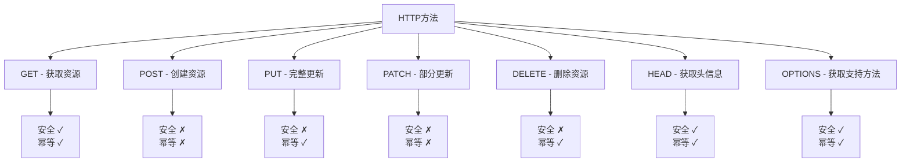

图2：HTTP方法的安全性与幂等性特征

```go
// HTTP方法对应的操作
const (
    // GET - 获取资源
    // 安全且幂等
    MethodGet = "GET"
    
    // POST - 创建资源
    // 非安全，非幂等
    MethodPost = "POST"
    
    // PUT - 更新或创建资源
    // 非安全，幂等
    MethodPut = "PUT"
    
    // PATCH - 部分更新资源
    // 非安全，非幂等
    MethodPatch = "PATCH"
    
    // DELETE - 删除资源
    // 非安全，幂等
    MethodDelete = "DELETE"
    
    // HEAD - 获取资源头信息
    // 安全且幂等
    MethodHead = "HEAD"
    
    // OPTIONS - 获取资源支持的方法
    // 安全且幂等
    MethodOptions = "OPTIONS"
)
```

### 5.1.3 状态码的使用

```go
// 常用HTTP状态码
const (
    // 2xx 成功
    StatusOK                   = 200 // 请求成功
    StatusCreated              = 201 // 资源创建成功
    StatusAccepted             = 202 // 请求已接受，但处理未完成
    StatusNoContent            = 204 // 请求成功，无返回内容
    
    // 3xx 重定向
    StatusMovedPermanently     = 301 // 资源永久移动
    StatusFound                = 302 // 资源临时移动
    StatusNotModified          = 304 // 资源未修改
    
    // 4xx 客户端错误
    StatusBadRequest           = 400 // 请求格式错误
    StatusUnauthorized         = 401 // 未认证
    StatusForbidden            = 403 // 无权限
    StatusNotFound             = 404 // 资源不存在
    StatusMethodNotAllowed     = 405 // 方法不允许
    StatusConflict             = 409 // 资源冲突
    StatusUnprocessableEntity  = 422 // 请求格式正确但语义错误
    StatusTooManyRequests      = 429 // 请求过多
    
    // 5xx 服务器错误
    StatusInternalServerError  = 500 // 服务器内部错误
    StatusNotImplemented       = 501 // 功能未实现
    StatusBadGateway          = 502 // 网关错误
    StatusServiceUnavailable   = 503 // 服务不可用
)
```

## 5.2 API设计最佳实践

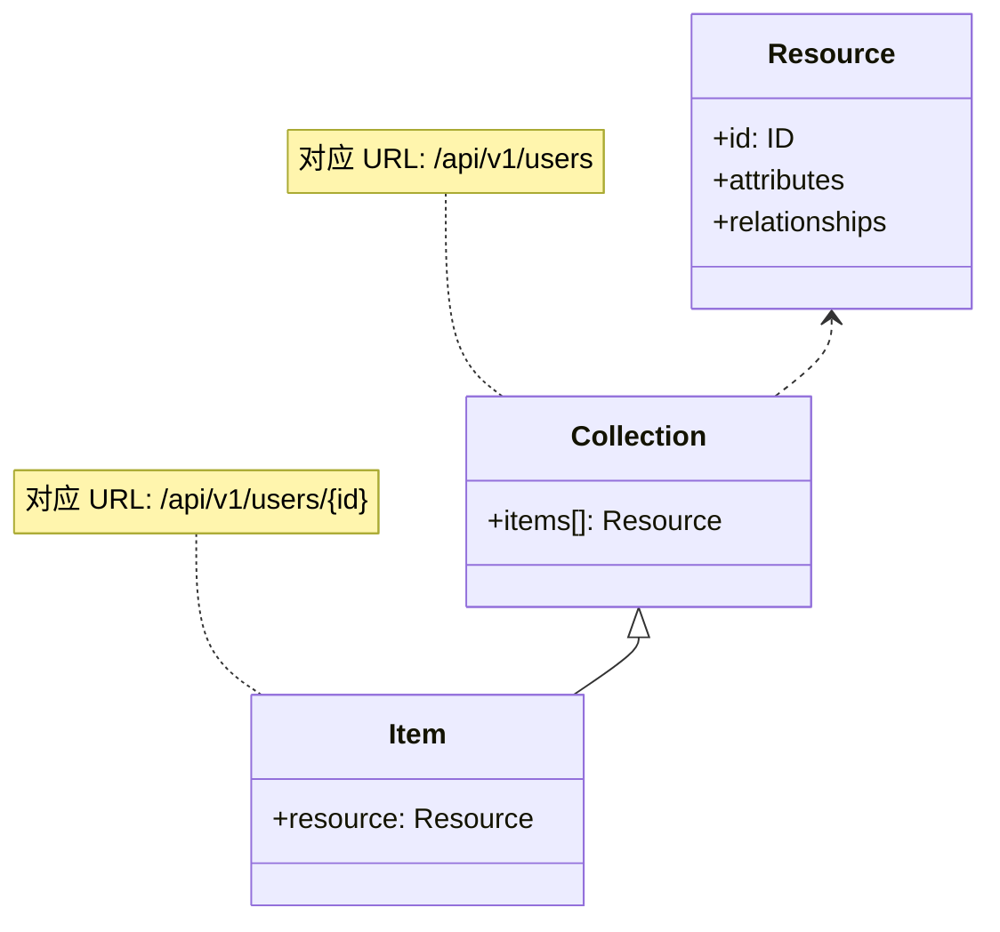

图3：资源/集合/项 与 URL 映射关系

### 5.2.1 URL设计规范

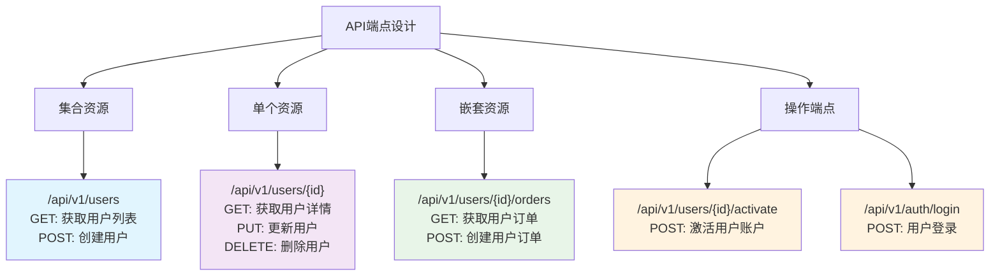

图4：RESTful API URL设计模式

```go
// 良好的URL设计示例

// 1. 使用名词而不是动词
// ✅ 好的设计
GET    /api/v1/users          // 获取用户列表
GET    /api/v1/users/123      // 获取特定用户
POST   /api/v1/users          // 创建用户
PUT    /api/v1/users/123      // 更新用户
DELETE /api/v1/users/123      // 删除用户

// ❌ 不好的设计
GET    /api/v1/getUsers
POST   /api/v1/createUser
POST   /api/v1/updateUser
POST   /api/v1/deleteUser

// 2. 使用复数名词
// ✅ 好的设计
/api/v1/users
/api/v1/orders
/api/v1/products

// ❌ 不好的设计
/api/v1/user
/api/v1/order
/api/v1/product

// 3. 嵌套资源
// ✅ 好的设计
GET    /api/v1/users/123/orders     // 获取用户的订单
POST   /api/v1/users/123/orders     // 为用户创建订单
GET    /api/v1/users/123/orders/456 // 获取用户的特定订单

// 4. 查询参数用于过滤和分页
GET /api/v1/users?page=1&limit=10&status=active&sort=created_at
```

### 5.2.2 版本控制

```go
// 版本控制策略

// 1. URL路径版本控制（推荐）
/api/v1/users
/api/v2/users

// 2. 请求头版本控制
// Accept: application/vnd.api+json;version=1
// API-Version: v1

// 3. 查询参数版本控制
/api/users?version=1

// New API项目中的版本控制实现
func SetAPIRouter(router *gin.Engine) {
    // API v1
    apiV1 := router.Group("/api/v1")
    {
        setupV1Routes(apiV1)
    }
    
    // 未来的API v2
    // apiV2 := router.Group("/api/v2")
    // {
    //     setupV2Routes(apiV2)
    // }
}
```

### 5.2.3 统一响应格式

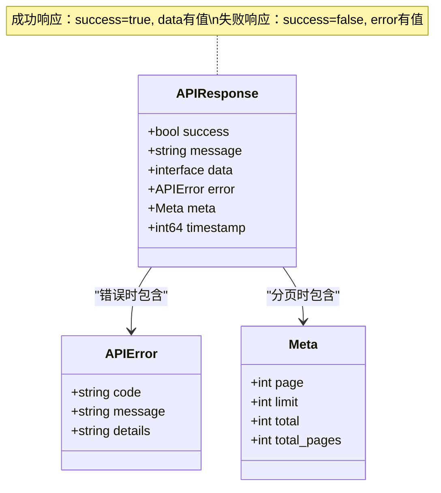

图5：统一API响应结构设计

```go
// 统一响应结构
type APIResponse struct {
    Success   bool        `json:"success"`
    Message   string      `json:"message"`
    Data      interface{} `json:"data,omitempty"`
    Error     *APIError   `json:"error,omitempty"`
    Meta      *Meta       `json:"meta,omitempty"`
    Timestamp int64       `json:"timestamp"`
}

type APIError struct {
    Code    string `json:"code"`
    Message string `json:"message"`
    Details string `json:"details,omitempty"`
}

type Meta struct {
    Page       int `json:"page,omitempty"`
    Limit      int `json:"limit,omitempty"`
    Total      int `json:"total,omitempty"`
    TotalPages int `json:"total_pages,omitempty"`
}

// 响应构建器
type ResponseBuilder struct {
    success   bool
    message   string
    data      interface{}
    error     *APIError
    meta      *Meta
}

func NewResponse() *ResponseBuilder {
    return &ResponseBuilder{
        success: true,
        message: "操作成功",
    }
}

func (rb *ResponseBuilder) Success(data interface{}) *ResponseBuilder {
    rb.success = true
    rb.data = data
    return rb
}

func (rb *ResponseBuilder) Error(code, message string) *ResponseBuilder {
    rb.success = false
    rb.error = &APIError{
        Code:    code,
        Message: message,
    }
    return rb
}

func (rb *ResponseBuilder) WithMeta(meta *Meta) *ResponseBuilder {
    rb.meta = meta
    return rb
}

func (rb *ResponseBuilder) Build() APIResponse {
    return APIResponse{
        Success:   rb.success,
        Message:   rb.message,
        Data:      rb.data,
        Error:     rb.error,
        Meta:      rb.meta,
        Timestamp: time.Now().Unix(),
    }
}

// 使用示例
func getUserHandler(c *gin.Context) {
    userID := c.Param("id")
    
    user, err := userService.GetUser(userID)
    if err != nil {
        response := NewResponse().Error("USER_NOT_FOUND", "用户不存在").Build()
        c.JSON(http.StatusNotFound, response)
        return
    }
    
    response := NewResponse().Success(user).Build()
    c.JSON(http.StatusOK, response)
}
```

## 5.3 New API项目的API设计

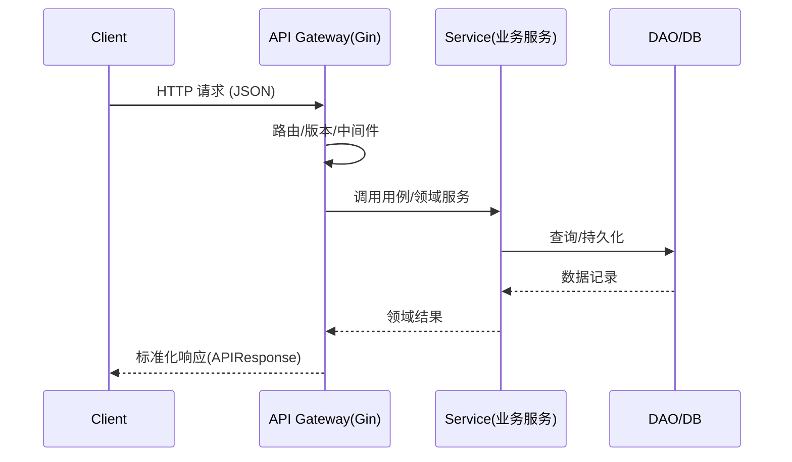

图6：New-API 典型请求路径（路由→服务→DAO）

### 5.3.1 用户管理API

```go
// 用户相关的数据结构
type User struct {
    ID          int       `json:"id" gorm:"primaryKey"`
    Username    string    `json:"username" gorm:"uniqueIndex" binding:"required,min=3,max=20"`
    Password    string    `json:"-" gorm:"not null"` // 不在JSON中返回密码
    DisplayName string    `json:"display_name" gorm:"index"`
    Role        int       `json:"role" gorm:"type:int;default:1"`
    Status      int       `json:"status" gorm:"type:int;default:1"`
    Email       string    `json:"email" gorm:"index"`
    GitHubID    string    `json:"github_id" gorm:"column:github_id;index"`
    WeChatID    string    `json:"wechat_id" gorm:"column:wechat_id;index"`
    AccessToken string    `json:"access_token" gorm:"type:char(32);index"`
    Quota       int       `json:"quota" gorm:"type:int;default:0"`
    UsedQuota   int       `json:"used_quota" gorm:"type:int;default:0;column:used_quota"`
    RequestCount int      `json:"request_count" gorm:"type:int;default:0;column:request_count"`
    Group       string    `json:"group" gorm:"type:varchar(32);default:'default'"`
    AffCode     string    `json:"aff_code" gorm:"type:varchar(32);column:aff_code;index"`
    CreatedTime int64     `json:"created_time" gorm:"bigint"`
}

// 用户注册请求
type RegisterRequest struct {
    Username    string `json:"username" binding:"required,min=3,max=20"`
    Password    string `json:"password" binding:"required,min=6"`
    Email       string `json:"email" binding:"email"`
    VerifyCode  string `json:"verify_code"`
}

// 用户登录请求
type LoginRequest struct {
    Username string `json:"username" binding:"required"`
    Password string `json:"password" binding:"required"`
}

// 用户更新请求
type UpdateUserRequest struct {
    DisplayName *string `json:"display_name,omitempty"`
    Email       *string `json:"email,omitempty" binding:"omitempty,email"`
    Password    *string `json:"password,omitempty" binding:"omitempty,min=6"`
}
```

#### 用户API端点设计

```go
// 用户认证相关API
func setupAuthRoutes(router *gin.RouterGroup) {
    auth := router.Group("/auth")
    {
        auth.POST("/register", Register)           // 用户注册
        auth.POST("/login", Login)                 // 用户登录
        auth.POST("/logout", UserAuth(), Logout)   // 用户登出
        auth.POST("/refresh", RefreshToken)        // 刷新令牌
        auth.GET("/verify/:code", VerifyEmail)     // 邮箱验证
    }
}

// 用户管理API
func setupUserRoutes(router *gin.RouterGroup) {
    users := router.Group("/users")
    {
        // 公开端点
        users.GET("/profile", UserAuth(), GetProfile)     // 获取当前用户信息
        users.PUT("/profile", UserAuth(), UpdateProfile)  // 更新当前用户信息
        users.DELETE("/profile", UserAuth(), DeleteSelf)  // 删除当前用户
        
        // 管理员端点
        admin := users.Group("/")
        admin.Use(AdminAuth())
        {
            admin.GET("/", GetUsers)              // 获取用户列表
            admin.GET("/:id", GetUser)            // 获取特定用户
            admin.POST("/", CreateUser)           // 创建用户
            admin.PUT("/:id", UpdateUser)         // 更新用户
            admin.DELETE("/:id", DeleteUser)      // 删除用户
            admin.POST("/:id/status", UpdateUserStatus) // 更新用户状态
        }
    }
}
```

#### 用户API实现

```go
// 用户注册
func Register(c *gin.Context) {
    var req RegisterRequest
    if err := c.ShouldBindJSON(&req); err != nil {
        c.JSON(http.StatusBadRequest, NewResponse().Error(
            "INVALID_REQUEST", "请求参数错误: "+err.Error()).Build())
        return
    }
    
    // 验证用户名是否已存在
    if model.IsUsernameAlreadyTaken(req.Username) {
        c.JSON(http.StatusConflict, NewResponse().Error(
            "USERNAME_EXISTS", "用户名已存在").Build())
        return
    }
    
    // 验证邮箱验证码（如果需要）
    if common.EmailVerificationEnabled {
        if !verifyEmailCode(req.Email, req.VerifyCode) {
            c.JSON(http.StatusBadRequest, NewResponse().Error(
                "INVALID_VERIFY_CODE", "验证码无效").Build())
            return
        }
    }
    
    // 创建用户
    user := &model.User{
        Username:    req.Username,
        Password:    common.Password2Hash(req.Password),
        Email:       req.Email,
        Role:        common.RoleCommonUser,
        Status:      common.UserStatusEnabled,
        Quota:       common.InitialQuota,
        CreatedTime: common.GetTimestamp(),
    }
    
    if err := user.Insert(); err != nil {
        c.JSON(http.StatusInternalServerError, NewResponse().Error(
            "CREATE_USER_FAILED", "用户创建失败").Build())
        return
    }
    
    // 返回用户信息（不包含密码）
    userResponse := struct {
        ID       int    `json:"id"`
        Username string `json:"username"`
        Email    string `json:"email"`
        Role     int    `json:"role"`
    }{
        ID:       user.ID,
        Username: user.Username,
        Email:    user.Email,
        Role:     user.Role,
    }
    
    c.JSON(http.StatusCreated, NewResponse().Success(userResponse).Build())
}

// 用户登录
func Login(c *gin.Context) {
    var req LoginRequest
    if err := c.ShouldBindJSON(&req); err != nil {
        c.JSON(http.StatusBadRequest, NewResponse().Error(
            "INVALID_REQUEST", "请求参数错误").Build())
        return
    }
    
    // 验证用户凭据
    user := model.ValidateUserCredentials(req.Username, req.Password)
    if user == nil {
        c.JSON(http.StatusUnauthorized, NewResponse().Error(
            "INVALID_CREDENTIALS", "用户名或密码错误").Build())
        return
    }
    
    // 检查用户状态
    if user.Status != common.UserStatusEnabled {
        c.JSON(http.StatusForbidden, NewResponse().Error(
            "USER_DISABLED", "用户已被禁用").Build())
        return
    }
    
    // 生成访问令牌
    token, err := generateAccessToken(user)
    if err != nil {
        c.JSON(http.StatusInternalServerError, NewResponse().Error(
            "TOKEN_GENERATION_FAILED", "令牌生成失败").Build())
        return
    }
    
    // 更新最后登录时间
    user.UpdateLastLoginTime()
    
    loginResponse := struct {
        Token string `json:"token"`
        User  struct {
            ID       int    `json:"id"`
            Username string `json:"username"`
            Role     int    `json:"role"`
        } `json:"user"`
    }{
        Token: token,
        User: struct {
            ID       int    `json:"id"`
            Username string `json:"username"`
            Role     int    `json:"role"`
        }{
            ID:       user.ID,
            Username: user.Username,
            Role:     user.Role,
        },
    }
    
    c.JSON(http.StatusOK, NewResponse().Success(loginResponse).Build())
}

// 获取用户列表（分页）
func GetUsers(c *gin.Context) {
    page, _ := strconv.Atoi(c.DefaultQuery("page", "1"))
    limit, _ := strconv.Atoi(c.DefaultQuery("limit", "10"))
    search := c.Query("search")
    status := c.Query("status")
    
    if page < 1 {
        page = 1
    }
    if limit < 1 || limit > 100 {
        limit = 10
    }
    
    users, total, err := model.GetUsers(page, limit, search, status)
    if err != nil {
        c.JSON(http.StatusInternalServerError, NewResponse().Error(
            "QUERY_FAILED", "查询用户失败").Build())
        return
    }
    
    meta := &Meta{
        Page:       page,
        Limit:      limit,
        Total:      total,
        TotalPages: (total + limit - 1) / limit,
    }
    
    c.JSON(http.StatusOK, NewResponse().Success(users).WithMeta(meta).Build())
}
```

### 5.3.2 令牌管理API

```go
// 令牌数据结构
type Token struct {
    ID             int    `json:"id" gorm:"primaryKey"`
    UserId         int    `json:"user_id" gorm:"index"`
    Key            string `json:"key" gorm:"type:char(48);uniqueIndex"`
    Status         int    `json:"status" gorm:"type:int;default:1"`
    Name           string `json:"name" gorm:"index"`
    CreatedTime    int64  `json:"created_time" gorm:"bigint"`
    AccessedTime   int64  `json:"accessed_time" gorm:"bigint"`
    ExpiredTime    int64  `json:"expired_time" gorm:"bigint;default:-1"`
    RemainQuota    int    `json:"remain_quota" gorm:"type:int;default:0"`
    UnlimitedQuota bool   `json:"unlimited_quota" gorm:"type:boolean;default:false"`
    UsedQuota      int    `json:"used_quota" gorm:"type:int;default:0"`
}

// 令牌创建请求
type CreateTokenRequest struct {
    Name           string `json:"name" binding:"required,max=50"`
    RemainQuota    int    `json:"remain_quota"`
    ExpiredTime    int64  `json:"expired_time"`
    UnlimitedQuota bool   `json:"unlimited_quota"`
}

// 令牌API端点
func setupTokenRoutes(router *gin.RouterGroup) {
    tokens := router.Group("/tokens")
    tokens.Use(UserAuth())
    {
        tokens.GET("/", GetTokens)              // 获取用户的令牌列表
        tokens.POST("/", CreateToken)           // 创建新令牌
        tokens.GET("/:id", GetToken)            // 获取特定令牌
        tokens.PUT("/:id", UpdateToken)         // 更新令牌
        tokens.DELETE("/:id", DeleteToken)      // 删除令牌
        tokens.POST("/:id/reset", ResetToken)   // 重置令牌密钥
    }
}

// 创建令牌
func CreateToken(c *gin.Context) {
    userID := c.GetInt("user_id")
    
    var req CreateTokenRequest
    if err := c.ShouldBindJSON(&req); err != nil {
        c.JSON(http.StatusBadRequest, NewResponse().Error(
            "INVALID_REQUEST", "请求参数错误").Build())
        return
    }
    
    // 检查用户令牌数量限制
    tokenCount := model.GetUserTokenCount(userID)
    if tokenCount >= common.MaxTokensPerUser {
        c.JSON(http.StatusBadRequest, NewResponse().Error(
            "TOKEN_LIMIT_EXCEEDED", "令牌数量已达上限").Build())
        return
    }
    
    // 生成令牌密钥
    key := common.GenerateToken()
    
    token := &model.Token{
        UserId:         userID,
        Key:            key,
        Name:           req.Name,
        Status:         common.TokenStatusEnabled,
        RemainQuota:    req.RemainQuota,
        ExpiredTime:    req.ExpiredTime,
        UnlimitedQuota: req.UnlimitedQuota,
        CreatedTime:    common.GetTimestamp(),
    }
    
    if err := token.Insert(); err != nil {
        c.JSON(http.StatusInternalServerError, NewResponse().Error(
            "CREATE_TOKEN_FAILED", "令牌创建失败").Build())
        return
    }
    
    c.JSON(http.StatusCreated, NewResponse().Success(token).Build())
}
```

### 5.3.3 渠道管理API

```go
// 渠道数据结构
type Channel struct {
    ID                 int     `json:"id" gorm:"primaryKey"`
    Type               int     `json:"type" gorm:"default:1"`
    Key                string  `json:"key" gorm:"type:text"`
    Status             int     `json:"status" gorm:"default:1"`
    Name               string  `json:"name" gorm:"index"`
    Weight             *uint   `json:"weight" gorm:"default:0"`
    CreatedTime        int64   `json:"created_time" gorm:"bigint"`
    TestTime           int64   `json:"test_time" gorm:"bigint"`
    ResponseTime       int     `json:"response_time"`
    BaseURL            *string `json:"base_url" gorm:"column:base_url;default:''"`
    RPM                int     `json:"rpm"`
    Models             string  `json:"models"`
    Group              string  `json:"group" gorm:"type:varchar(32);default:'default'"`
    UsedQuota          int64   `json:"used_quota" gorm:"bigint;default:0"`
    ModelMapping       *string `json:"model_mapping" gorm:"type:varchar(1024);default:''"`
    Priority           *int64  `json:"priority" gorm:"bigint;default:0"`
    AutoBan            *int    `json:"auto_ban" gorm:"default:1"`
}

// 渠道创建请求
type CreateChannelRequest struct {
    Type         int     `json:"type" binding:"required"`
    Name         string  `json:"name" binding:"required,max=50"`
    Key          string  `json:"key" binding:"required"`
    BaseURL      *string `json:"base_url"`
    Models       string  `json:"models"`
    Group        string  `json:"group"`
    ModelMapping *string `json:"model_mapping"`
    Priority     *int64  `json:"priority"`
    Weight       *uint   `json:"weight"`
    AutoBan      *int    `json:"auto_ban"`
}

// 渠道API端点
func setupChannelRoutes(router *gin.RouterGroup) {
    channels := router.Group("/channels")
    channels.Use(AdminAuth()) // 只有管理员可以管理渠道
    {
        channels.GET("/", GetChannels)              // 获取渠道列表
        channels.POST("/", CreateChannel)           // 创建渠道
        channels.GET("/:id", GetChannel)            // 获取特定渠道
        channels.PUT("/:id", UpdateChannel)         // 更新渠道
        channels.DELETE("/:id", DeleteChannel)      // 删除渠道
        channels.POST("/:id/test", TestChannel)     // 测试渠道
        channels.POST("/:id/status", UpdateChannelStatus) // 更新渠道状态
        channels.GET("/types", GetChannelTypes)     // 获取支持的渠道类型
    }
}

// 创建渠道
func CreateChannel(c *gin.Context) {
    var req CreateChannelRequest
    if err := c.ShouldBindJSON(&req); err != nil {
        c.JSON(http.StatusBadRequest, NewResponse().Error(
            "INVALID_REQUEST", "请求参数错误").Build())
        return
    }
    
    // 验证渠道类型
    if !isValidChannelType(req.Type) {
        c.JSON(http.StatusBadRequest, NewResponse().Error(
            "INVALID_CHANNEL_TYPE", "不支持的渠道类型").Build())
        return
    }
    
    // 验证模型列表
    if req.Models != "" {
        if !validateModels(req.Models) {
            c.JSON(http.StatusBadRequest, NewResponse().Error(
                "INVALID_MODELS", "模型列表格式错误").Build())
            return
        }
    }
    
    channel := &model.Channel{
        Type:         req.Type,
        Name:         req.Name,
        Key:          req.Key,
        BaseURL:      req.BaseURL,
        Models:       req.Models,
        Group:        req.Group,
        ModelMapping: req.ModelMapping,
        Priority:     req.Priority,
        Weight:       req.Weight,
        AutoBan:      req.AutoBan,
        Status:       common.ChannelStatusEnabled,
        CreatedTime:  common.GetTimestamp(),
    }
    
    if err := channel.Insert(); err != nil {
        c.JSON(http.StatusInternalServerError, NewResponse().Error(
            "CREATE_CHANNEL_FAILED", "渠道创建失败").Build())
        return
    }
    
    c.JSON(http.StatusCreated, NewResponse().Success(channel).Build())
}

// 测试渠道
func TestChannel(c *gin.Context) {
    channelID, err := strconv.Atoi(c.Param("id"))
    if err != nil {
        c.JSON(http.StatusBadRequest, NewResponse().Error(
            "INVALID_CHANNEL_ID", "无效的渠道ID").Build())
        return
    }
    
    channel := model.GetChannelById(channelID, true)
    if channel == nil {
        c.JSON(http.StatusNotFound, NewResponse().Error(
            "CHANNEL_NOT_FOUND", "渠道不存在").Build())
        return
    }
    
    // 执行渠道测试
    testResult, err := performChannelTest(channel)
    if err != nil {
        c.JSON(http.StatusInternalServerError, NewResponse().Error(
            "TEST_FAILED", "渠道测试失败: "+err.Error()).Build())
        return
    }
    
    // 更新测试时间和响应时间
    channel.TestTime = common.GetTimestamp()
    channel.ResponseTime = testResult.ResponseTime
    channel.Update()
    
    c.JSON(http.StatusOK, NewResponse().Success(testResult).Build())
}
```

## 5.4 数据验证和序列化

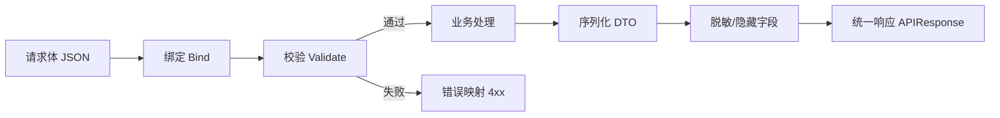

图7：请求验证与响应序列化流水线

术语速览：
- 绑定（Bind）：将 JSON/Query 映射为结构体。
- 校验（Validate）：基于标签或规则校验字段合法性。
- 序列化（Serialize）：面向外部的响应结构（DTO/View）。
- 脱敏（Masking）：隐藏敏感字段（如密码、密钥）。

### 5.4.1 请求验证

**验证层次结构**：
1. **结构体绑定**：JSON → Go结构体的类型转换
2. **字段验证**：基于标签的基础验证（required、min、max等）
3. **自定义验证**：业务逻辑相关的复杂验证规则
4. **跨字段验证**：多个字段之间的关联验证

```go
import (
    "github.com/go-playground/validator/v10"
)

// 自定义验证器
var validate *validator.Validate

func init() {
    validate = validator.New()
    
    // 注册自定义验证规则
    validate.RegisterValidation("username", validateUsername)
    validate.RegisterValidation("password", validatePassword)
    validate.RegisterValidation("models", validateModels)
    validate.RegisterValidation("phone", validatePhone)
    validate.RegisterValidation("idcard", validateIDCard)
}

// 用户名验证
func validateUsername(fl validator.FieldLevel) bool {
    username := fl.Field().String()
    // 用户名只能包含字母、数字、下划线，长度3-20
    matched, _ := regexp.MatchString(`^[a-zA-Z0-9_]{3,20}$`, username)
    return matched
}

// 密码强度验证
func validatePassword(fl validator.FieldLevel) bool {
    password := fl.Field().String()
    if len(password) < 6 {
        return false
    }
    
    // 至少包含一个字母和一个数字
    hasLetter := regexp.MustCompile(`[a-zA-Z]`).MatchString(password)
    hasNumber := regexp.MustCompile(`[0-9]`).MatchString(password)
    
    return hasLetter && hasNumber
}

// 模型列表验证
func validateModels(fl validator.FieldLevel) bool {
    models := fl.Field().String()
    if models == "" {
        return true
    }
    
    // 验证模型列表格式：model1,model2,model3
    modelList := strings.Split(models, ",")
    for _, model := range modelList {
        model = strings.TrimSpace(model)
        if model == "" {
            return false
        }
        // 验证模型名称格式
        matched, _ := regexp.MatchString(`^[a-zA-Z0-9_.-]+$`, model)
        if !matched {
            return false
        }
    }
    
    return true
}

// 手机号验证
func validatePhone(fl validator.FieldLevel) bool {
    phone := fl.Field().String()
    // 中国大陆手机号格式验证
    matched, _ := regexp.MatchString(`^1[3-9]\d{9}$`, phone)
    return matched
}

// 身份证号验证
func validateIDCard(fl validator.FieldLevel) bool {
    idCard := fl.Field().String()
    // 18位身份证号格式验证
    matched, _ := regexp.MatchString(`^[1-9]\d{5}(18|19|20)\d{2}((0[1-9])|(1[0-2]))(([0-2][1-9])|10|20|30|31)\d{3}[0-9Xx]$`, idCard)
    return matched
}

// 验证中间件
func ValidationMiddleware() gin.HandlerFunc {
    return func(c *gin.Context) {
        c.Set("validator", validate)
        c.Next()
    }
}

// 验证请求结构体
func ValidateStruct(c *gin.Context, obj interface{}) error {
    if err := c.ShouldBindJSON(obj); err != nil {
        return err
    }
    
    validator := c.MustGet("validator").(*validator.Validate)
    if err := validator.Struct(obj); err != nil {
        return err
    }
    
    return nil
}

// 验证错误处理
type ValidationError struct {
    Field   string `json:"field"`
    Tag     string `json:"tag"`
    Value   string `json:"value"`
    Message string `json:"message"`
}

// 格式化验证错误
func FormatValidationErrors(err error) []ValidationError {
    var errors []ValidationError
    
    if validationErrors, ok := err.(validator.ValidationErrors); ok {
        for _, fieldError := range validationErrors {
            errors = append(errors, ValidationError{
                Field:   fieldError.Field(),
                Tag:     fieldError.Tag(),
                Value:   fieldError.Param(),
                Message: getErrorMessage(fieldError),
            })
        }
    }
    
    return errors
}

// 获取错误消息（支持国际化）
func getErrorMessage(fieldError validator.FieldError) string {
    switch fieldError.Tag() {
    case "required":
        return fmt.Sprintf("%s是必填字段", fieldError.Field())
    case "min":
        return fmt.Sprintf("%s长度不能少于%s个字符", fieldError.Field(), fieldError.Param())
    case "max":
        return fmt.Sprintf("%s长度不能超过%s个字符", fieldError.Field(), fieldError.Param())
    case "email":
        return fmt.Sprintf("%s必须是有效的邮箱地址", fieldError.Field())
    case "username":
        return fmt.Sprintf("%s只能包含字母、数字和下划线，长度3-20个字符", fieldError.Field())
    case "password":
        return fmt.Sprintf("%s必须至少6个字符，包含字母和数字", fieldError.Field())
    case "phone":
        return fmt.Sprintf("%s必须是有效的手机号码", fieldError.Field())
    default:
        return fmt.Sprintf("%s验证失败", fieldError.Field())
    }
}
```

### 5.4.2 响应序列化

```go
// 用户响应序列化
type UserResponse struct {
    ID          int    `json:"id"`
    Username    string `json:"username"`
    DisplayName string `json:"display_name"`
    Email       string `json:"email"`
    Role        int    `json:"role"`
    Status      int    `json:"status"`
    Quota       int    `json:"quota"`
    UsedQuota   int    `json:"used_quota"`
    Group       string `json:"group"`
    CreatedTime int64  `json:"created_time"`
}

func (u *User) ToResponse() *UserResponse {
    return &UserResponse{
        ID:          u.ID,
        Username:    u.Username,
        DisplayName: u.DisplayName,
        Email:       u.Email,
        Role:        u.Role,
        Status:      u.Status,
        Quota:       u.Quota,
        UsedQuota:   u.UsedQuota,
        Group:       u.Group,
        CreatedTime: u.CreatedTime,
    }
}

// 令牌响应序列化
type TokenResponse struct {
    ID             int    `json:"id"`
    Name           string `json:"name"`
    Key            string `json:"key,omitempty"` // 只在创建时返回
    Status         int    `json:"status"`
    CreatedTime    int64  `json:"created_time"`
    AccessedTime   int64  `json:"accessed_time"`
    ExpiredTime    int64  `json:"expired_time"`
    RemainQuota    int    `json:"remain_quota"`
    UnlimitedQuota bool   `json:"unlimited_quota"`
    UsedQuota      int    `json:"used_quota"`
}

func (t *Token) ToResponse(includeKey bool) *TokenResponse {
    response := &TokenResponse{
        ID:             t.ID,
        Name:           t.Name,
        Status:         t.Status,
        CreatedTime:    t.CreatedTime,
        AccessedTime:   t.AccessedTime,
        ExpiredTime:    t.ExpiredTime,
        RemainQuota:    t.RemainQuota,
        UnlimitedQuota: t.UnlimitedQuota,
        UsedQuota:      t.UsedQuota,
    }
    
    if includeKey {
        response.Key = t.Key
    }
    
    return response
}

// 批量序列化
func SerializeUsers(users []*User) []*UserResponse {
    responses := make([]*UserResponse, len(users))
    for i, user := range users {
        responses[i] = user.ToResponse()
    }
    return responses
}

func SerializeTokens(tokens []*Token, includeKey bool) []*TokenResponse {
    responses := make([]*TokenResponse, len(tokens))
    for i, token := range tokens {
        responses[i] = token.ToResponse(includeKey)
    }
    return responses
}
```

## 5.5 分页和过滤

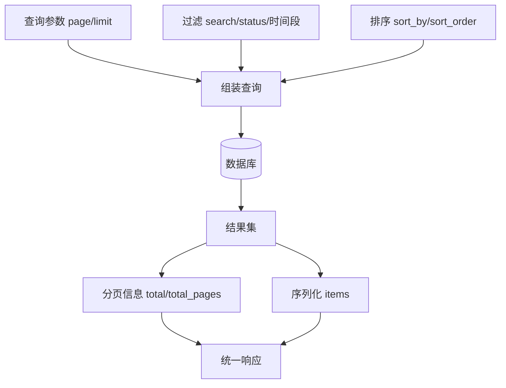

图8：分页与过滤的处理流程

分页和过滤是API设计中的重要组成部分，它们帮助客户端高效地获取和处理大量数据。合理的分页策略不仅能提升用户体验，还能减轻服务器负担，提高系统整体性能。

**核心概念**：
- **分页（Pagination）**：将大量数据分割成多个页面，每次只返回一页数据
- **过滤（Filtering）**：根据指定条件筛选数据，减少不必要的数据传输
- **排序（Sorting）**：按照指定字段对结果进行排序
- **搜索（Search）**：基于关键词进行全文或模糊搜索

术语速览：
- `page/limit`：第几页/每页条数。
- `sort_by/sort_order`：排序字段/顺序（asc/desc）。
- `total/total_pages`：总条数/总页数。
- `cursor`：游标分页的位置标识符。
- `offset`：偏移量分页的起始位置。

### 5.5.1 分页实现

分页实现有多种策略，每种都有其适用场景和性能特点：

#### 偏移量分页（Offset-based Pagination）

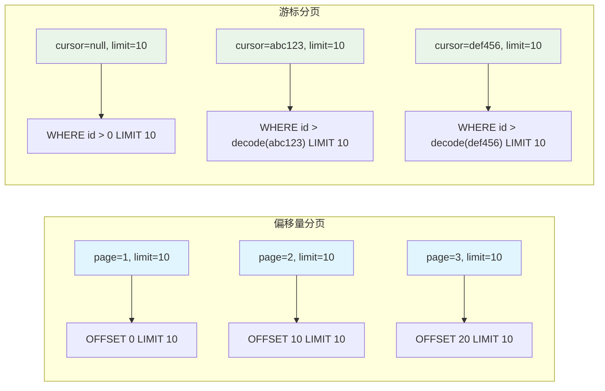

图9：偏移量分页 vs 游标分页对比

这是最常见的分页方式，使用页码和每页数量来控制数据返回。

```go
// 分页参数
type PaginationParams struct {
    Page  int `form:"page" binding:"min=1"`
    Limit int `form:"limit" binding:"min=1,max=100"`
}

// 分页结果
type PaginatedResult struct {
    Items      interface{} `json:"items"`
    Pagination *Pagination `json:"pagination"`
}

type Pagination struct {
    Page       int `json:"page"`
    Limit      int `json:"limit"`
    Total      int `json:"total"`
    TotalPages int `json:"total_pages"`
    HasNext    bool `json:"has_next"`
    HasPrev    bool `json:"has_prev"`
}

// 分页查询
func GetUsersWithPagination(c *gin.Context) {
    var params PaginationParams
    if err := c.ShouldBindQuery(&params); err != nil {
        // 设置默认值
        params.Page = 1
        params.Limit = 10
    }
    
    // 过滤参数
    search := c.Query("search")
    status := c.Query("status")
    role := c.Query("role")
    
    // 排序参数
    sortBy := c.DefaultQuery("sort_by", "created_time")
    sortOrder := c.DefaultQuery("sort_order", "desc")
    
    // 构建查询
    query := db.Model(&User{})
    
    // 应用过滤条件
    if search != "" {
        query = query.Where("username LIKE ? OR display_name LIKE ? OR email LIKE ?", 
            "%"+search+"%", "%"+search+"%", "%"+search+"%")
    }
    
    if status != "" {
        if statusInt, err := strconv.Atoi(status); err == nil {
            query = query.Where("status = ?", statusInt)
        }
    }
    
    if role != "" {
        if roleInt, err := strconv.Atoi(role); err == nil {
            query = query.Where("role = ?", roleInt)
        }
    }
    
    // 获取总数
    var total int64
    query.Count(&total)
    
    // 应用排序和分页
    var users []*User
    offset := (params.Page - 1) * params.Limit
    
    orderClause := fmt.Sprintf("%s %s", sortBy, sortOrder)
    query.Order(orderClause).Offset(offset).Limit(params.Limit).Find(&users)
    
    // 构建分页信息
    totalPages := int(math.Ceil(float64(total) / float64(params.Limit)))
    pagination := &Pagination{
        Page:       params.Page,
        Limit:      params.Limit,
        Total:      int(total),
        TotalPages: totalPages,
        HasNext:    params.Page < totalPages,
        HasPrev:    params.Page > 1,
    }
    
    result := &PaginatedResult{
        Items:      SerializeUsers(users),
        Pagination: pagination,
    }
    
    c.JSON(http.StatusOK, NewResponse().Success(result).Build())
}
```

#### 游标分页（Cursor-based Pagination）

游标分页适用于实时数据流和大数据集，避免了偏移量分页在数据变化时的一致性问题。

```go
// 游标分页参数
type CursorPaginationParams struct {
    Cursor string `form:"cursor" json:"cursor"`           // 游标位置
    Size   int    `form:"size" json:"size" binding:"min=1,max=100"` // 每页大小
    Order  string `form:"order" json:"order"`             // 排序方向：next/prev
}

// 游标分页结果
type CursorPaginationResult struct {
    Data       interface{} `json:"data"`
    NextCursor string      `json:"next_cursor,omitempty"`
    PrevCursor string      `json:"prev_cursor,omitempty"`
    HasNext    bool        `json:"has_next"`
    HasPrev    bool        `json:"has_prev"`
}

// 游标分页实现
func GetChannelsWithCursor(params CursorPaginationParams) (*CursorPaginationResult, error) {
    var channels []Channel
    query := db.Model(&Channel{})
    
    // 解析游标
    if params.Cursor != "" {
        cursorTime, err := decodeCursor(params.Cursor)
        if err != nil {
            return nil, err
        }
        
        if params.Order == "prev" {
            query = query.Where("created_at > ?", cursorTime).Order("created_at ASC")
        } else {
            query = query.Where("created_at < ?", cursorTime).Order("created_at DESC")
        }
    } else {
        query = query.Order("created_at DESC")
    }
    
    // 多查询一条用于判断是否有下一页
    if err := query.Limit(params.Size + 1).Find(&channels).Error; err != nil {
        return nil, err
    }
    
    hasNext := len(channels) > params.Size
    if hasNext {
        channels = channels[:params.Size]
    }
    
    var nextCursor, prevCursor string
    if len(channels) > 0 {
        if hasNext {
            nextCursor = encodeCursor(channels[len(channels)-1].CreatedAt)
        }
        if params.Cursor != "" {
            prevCursor = encodeCursor(channels[0].CreatedAt)
        }
    }
    
    return &CursorPaginationResult{
        Data:       channels,
        NextCursor: nextCursor,
        PrevCursor: prevCursor,
        HasNext:    hasNext,
        HasPrev:    params.Cursor != "",
    }, nil
}

// 编码游标
func encodeCursor(t time.Time) string {
    return base64.URLEncoding.EncodeToString([]byte(t.Format(time.RFC3339Nano)))
}

// 解码游标
func decodeCursor(cursor string) (time.Time, error) {
    data, err := base64.URLEncoding.DecodeString(cursor)
    if err != nil {
        return time.Time{}, err
    }
    return time.Parse(time.RFC3339Nano, string(data))
}
```

**分页策略对比**：

| 策略 | 优点 | 缺点 | 适用场景 |
|------|------|------|----------|
| 偏移量分页 | 实现简单，支持跳页 | 深分页性能差，数据一致性问题 | 小数据集，需要跳页功能 |
| 游标分页 | 性能稳定，数据一致性好 | 不支持跳页，实现复杂 | 大数据集，实时数据流 |
| 混合分页 | 兼顾性能和功能 | 实现最复杂 | 复杂业务场景 |

### 5.5.2 高级过滤

```go
// 过滤构建器
type FilterBuilder struct {
    query *gorm.DB
}

func NewFilterBuilder(db *gorm.DB) *FilterBuilder {
    return &FilterBuilder{query: db}
}

func (fb *FilterBuilder) ApplyFilters(c *gin.Context, model interface{}) *FilterBuilder {
    // 文本搜索
    if search := c.Query("search"); search != "" {
        fb.applyTextSearch(search, model)
    }
    
    // 状态过滤
    if status := c.Query("status"); status != "" {
        fb.query = fb.query.Where("status = ?", status)
    }
    
    // 日期范围过滤
    if startDate := c.Query("start_date"); startDate != "" {
        if timestamp, err := parseDate(startDate); err == nil {
            fb.query = fb.query.Where("created_time >= ?", timestamp)
        }
    }
    
    if endDate := c.Query("end_date"); endDate != "" {
        if timestamp, err := parseDate(endDate); err == nil {
            fb.query = fb.query.Where("created_time <= ?", timestamp)
        }
    }
    
    // 数值范围过滤
    if minQuota := c.Query("min_quota"); minQuota != "" {
        if quota, err := strconv.Atoi(minQuota); err == nil {
            fb.query = fb.query.Where("quota >= ?", quota)
        }
    }
    
    if maxQuota := c.Query("max_quota"); maxQuota != "" {
        if quota, err := strconv.Atoi(maxQuota); err == nil {
            fb.query = fb.query.Where("quota <= ?", quota)
        }
    }
    
    return fb
}

func (fb *FilterBuilder) applyTextSearch(search string, model interface{}) {
    switch model.(type) {
    case *User:
        fb.query = fb.query.Where(
            "username LIKE ? OR display_name LIKE ? OR email LIKE ?",
            "%"+search+"%", "%"+search+"%", "%"+search+"%")
    case *Token:
        fb.query = fb.query.Where("name LIKE ?", "%"+search+"%")
    case *Channel:
        fb.query = fb.query.Where(
            "name LIKE ? OR models LIKE ?",
            "%"+search+"%", "%"+search+"%")
    }
}

func (fb *FilterBuilder) ApplySorting(c *gin.Context) *FilterBuilder {
    sortBy := c.DefaultQuery("sort_by", "created_time")
    sortOrder := c.DefaultQuery("sort_order", "desc")
    
    // 验证排序字段
    allowedSortFields := map[string]bool{
        "id":           true,
        "username":     true,
        "created_time": true,
        "updated_time": true,
        "status":       true,
        "quota":        true,
    }
    
    if !allowedSortFields[sortBy] {
        sortBy = "created_time"
    }
    
    if sortOrder != "asc" && sortOrder != "desc" {
        sortOrder = "desc"
    }
    
    fb.query = fb.query.Order(fmt.Sprintf("%s %s", sortBy, sortOrder))
    return fb
}

func (fb *FilterBuilder) GetQuery() *gorm.DB {
    return fb.query
}
```

### 5.5.3 性能优化与最佳实践

**索引优化**：
```sql
-- 为常用的过滤和排序字段创建索引
CREATE INDEX idx_users_status_created ON users(status, created_time);
CREATE INDEX idx_users_role_username ON users(role, username);
CREATE INDEX idx_channels_status_name ON channels(status, name);

-- 复合索引支持多字段查询
CREATE INDEX idx_tokens_user_status ON tokens(user_id, status, created_time);
```

**缓存策略**：
```go
// Redis缓存分页结果
func GetUsersWithCache(params PaginationParams, filters map[string]interface{}) (*PaginatedResult, error) {
    // 生成缓存键
    cacheKey := generateCacheKey("users", params, filters)
    
    // 尝试从缓存获取
    if cached, err := redis.Get(cacheKey).Result(); err == nil {
        var result PaginatedResult
        if json.Unmarshal([]byte(cached), &result) == nil {
            return &result, nil
        }
    }
    
    // 从数据库查询
    result, err := GetUsers(params, filters)
    if err != nil {
        return nil, err
    }
    
    // 缓存结果（5分钟过期）
    if data, err := json.Marshal(result); err == nil {
        redis.Set(cacheKey, data, 5*time.Minute)
    }
    
    return result, nil
}

func generateCacheKey(prefix string, params PaginationParams, filters map[string]interface{}) string {
    h := sha256.New()
    h.Write([]byte(fmt.Sprintf("%s:%d:%d:%v", prefix, params.Page, params.Size, filters)))
    return fmt.Sprintf("%s:%x", prefix, h.Sum(nil)[:8])
}
```

**性能监控**：
```go
// 分页性能监控中间件
func PaginationMetrics() gin.HandlerFunc {
    return func(c *gin.Context) {
        start := time.Now()
        
        // 记录请求参数
        page := c.DefaultQuery("page", "1")
        size := c.DefaultQuery("size", "10")
        
        c.Next()
        
        // 记录性能指标
        duration := time.Since(start)
        
        // 发送到监控系统
        metrics.RecordPaginationMetrics(map[string]interface{}{
            "endpoint": c.FullPath(),
            "page":     page,
            "size":     size,
            "duration": duration.Milliseconds(),
            "status":   c.Writer.Status(),
        })
        
        // 慢查询告警
        if duration > 2*time.Second {
            log.Warnf("Slow pagination query: %s, page=%s, size=%s, duration=%v", 
                c.FullPath(), page, size, duration)
        }
    }
}
```

**最佳实践总结**：

1. **合理的分页大小**：默认10-20条，最大不超过100条
2. **索引优化**：为过滤和排序字段创建合适的索引
3. **缓存策略**：对热点数据进行缓存，注意缓存失效策略
4. **参数验证**：严格验证分页参数，防止恶意请求
5. **性能监控**：监控分页查询性能，及时发现问题
6. **错误处理**：提供友好的错误信息和降级方案

## 5.6 API文档和测试

API文档和测试是RESTful API开发的重要环节。良好的文档能够帮助开发者快速理解和使用API，而完善的测试则确保API的稳定性和可靠性。

**核心概念**：
- **API文档**：描述API接口、参数、响应格式的技术文档
- **OpenAPI规范**：用于描述REST API的标准规范（原Swagger规范）
- **自动化测试**：通过代码自动验证API功能的测试方法
- **集成测试**：测试多个组件协同工作的测试类型

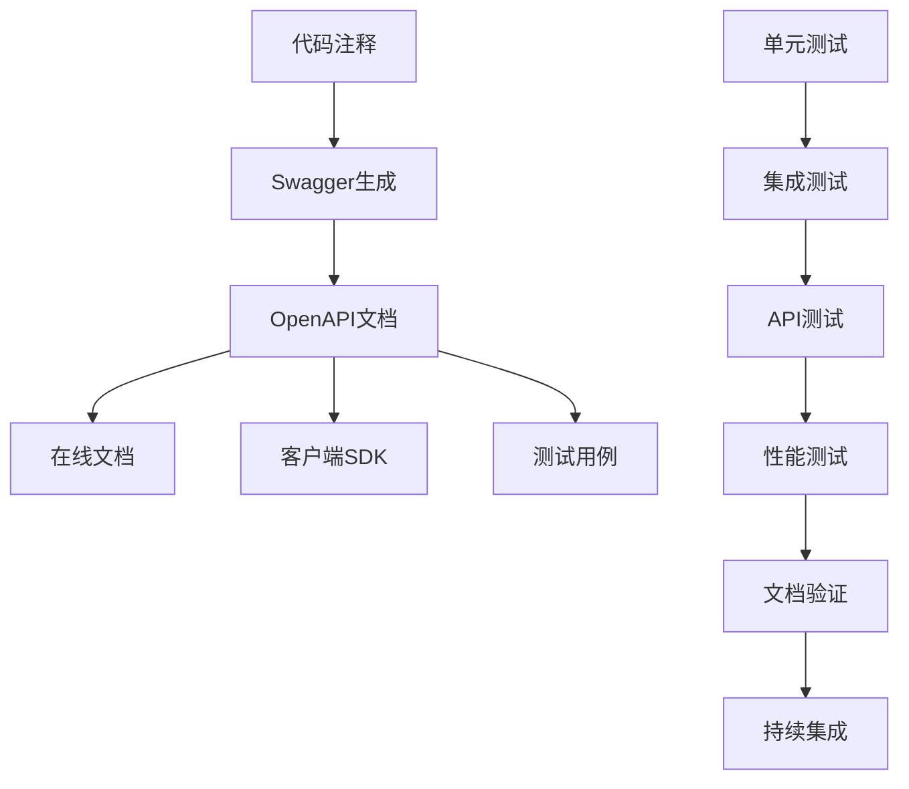

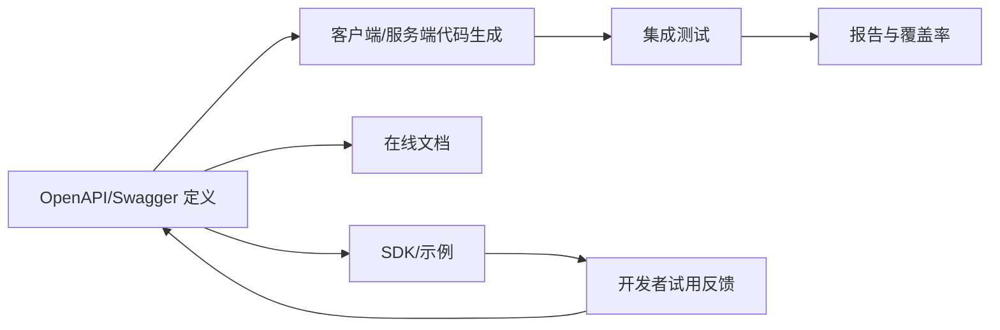

图10：OpenAPI 文档驱动的开发-测试闭环

术语速览：
- OAS3：OpenAPI Specification v3，规范接口契约与 Schema。
- 示例与示例值：便于快速试调与契约核验。
- 契约测试：以 OAS 为准进行接口一致性校验。

### 5.6.1 Swagger文档

```go
import (
    "github.com/swaggo/gin-swagger"
    "github.com/swaggo/files"
)

// @title New API 接口文档
// @version 1.0
// @description 这是New API项目的接口文档
// @termsOfService http://swagger.io/terms/

// @contact.name API Support
// @contact.url http://www.swagger.io/support
// @contact.email support@swagger.io

// @license.name Apache 2.0
// @license.url http://www.apache.org/licenses/LICENSE-2.0.html

// @host localhost:3000
// @BasePath /api/v1

// @securityDefinitions.apikey BearerAuth
// @in header
// @name Authorization

func main() {
    r := gin.Default()
    
    // Swagger文档路由
    r.GET("/swagger/*any", ginSwagger.WrapHandler(swaggerFiles.Handler))
    
    // API路由
    setupAPIRoutes(r)
    
    r.Run(":3000")
}

// 用户注册API文档
// @Summary 用户注册
// @Description 创建新用户账户
// @Tags 用户认证
// @Accept json
// @Produce json
// @Param request body RegisterRequest true "注册信息"
// @Success 201 {object} APIResponse{data=UserResponse} "注册成功"
// @Failure 400 {object} APIResponse "请求参数错误"
// @Failure 409 {object} APIResponse "用户名已存在"
// @Router /api/v1/auth/register [post]
func Register(c *gin.Context) {
    var req RegisterRequest
    if err := c.ShouldBindJSON(&req); err != nil {
        c.JSON(400, NewResponse().Error("参数错误", err.Error()).Build())
        return
    }
    
    // 业务逻辑...
}
```

**文档生成配置**：
```go
//go:generate swag init -g main.go -o ./docs

// 在main.go中添加
// @title New API 接口文档
// @version 1.0
// @description 基于Go语言的企业级API服务
// @host localhost:3000
// @BasePath /api/v1
// @securityDefinitions.apikey BearerAuth
// @in header
// @name Authorization
// @description JWT认证，格式：Bearer {token}
func main() {
    // 初始化Gin
    r := gin.Default()
    
    // 添加Swagger中间件
    r.GET("/swagger/*any", ginSwagger.WrapHandler(swaggerFiles.Handler))
    
    // 启动服务
    r.Run(":3000")
}
```

### 5.6.2 API自动化测试

**测试结构设计**：
```go
// 测试套件结构
type APITestSuite struct {
    suite.Suite
    router   *gin.Engine
    db       *gorm.DB
    testUser *User
    token    string
}

// 测试初始化
func (suite *APITestSuite) SetupSuite() {
    // 初始化测试数据库
    suite.db = setupTestDB()
    
    // 初始化路由
    suite.router = setupRouter(suite.db)
    
    // 创建测试用户
    suite.testUser = createTestUser(suite.db)
    suite.token = generateTestToken(suite.testUser)
}

// 测试清理
func (suite *APITestSuite) TearDownSuite() {
    cleanupTestDB(suite.db)
}

// 每个测试前的准备
func (suite *APITestSuite) SetupTest() {
    // 重置数据状态
    resetTestData(suite.db)
}


// 具体测试用例
func (suite *APITestSuite) TestUserRegistration() {
    tests := []struct {
        name           string
        payload        interface{}
        expectedStatus int
        expectedError  string
    }{
        {
            name: "成功注册",
            payload: RegisterRequest{
                Username: "testuser",
                Email:    "test@example.com",
                Password: "password123",
            },
            expectedStatus: 201,
        },
        {
            name: "用户名已存在",
            payload: RegisterRequest{
                Username: suite.testUser.Username,
                Email:    "another@example.com",
                Password: "password123",
            },
            expectedStatus: 409,
            expectedError:  "用户名已存在",
        },
        {
            name: "密码过短",
            payload: RegisterRequest{
                Username: "newuser",
                Email:    "new@example.com",
                Password: "123",
            },
            expectedStatus: 400,
            expectedError:  "密码长度不能少于6个字符",
        },
    }
    
    for _, tt := range tests {
        suite.Run(tt.name, func() {
            // 发送请求
            w := httptest.NewRecorder()
            body, _ := json.Marshal(tt.payload)
            req := httptest.NewRequest("POST", "/api/v1/auth/register", bytes.NewBuffer(body))
            req.Header.Set("Content-Type", "application/json")
            
            suite.router.ServeHTTP(w, req)
    
    // 验证响应
    suite.Equal(http.StatusCreated, w.Code)
    
    var response APIResponse
    err := json.Unmarshal(w.Body.Bytes(), &response)
    suite.NoError(err)
    suite.True(response.Success)
    suite.Equal("注册成功", response.Message)
}

// 测试用户登录
func (suite *APITestSuite) TestUserLogin() {
    // 先创建用户
    user := createTestUser(suite.db, "testuser", "password123")
    
    loginReq := LoginRequest{
        Username: user.Username,
        Password: "password123",
    }
    
    jsonData, _ := json.Marshal(loginReq)
    
    w := httptest.NewRecorder()
    req, _ := http.NewRequest("POST", "/api/v1/auth/login", bytes.NewBuffer(jsonData))
    req.Header.Set("Content-Type", "application/json")
    
    suite.router.ServeHTTP(w, req)
    
    suite.Equal(http.StatusOK, w.Code)
    
    var response APIResponse
    err := json.Unmarshal(w.Body.Bytes(), &response)
    suite.NoError(err)
    suite.True(response.Success)
    
    // 验证返回的token
    data := response.Data.(map[string]interface{})
    suite.NotEmpty(data["token"])
}

// 测试分页API
func (suite *APITestSuite) TestPaginationAPI() {
    // 创建测试数据
    for i := 0; i < 25; i++ {
        createTestUser(suite.db, fmt.Sprintf("user%d", i), "password123")
    }
    
    // 测试第一页
    w := httptest.NewRecorder()
    req, _ := http.NewRequest("GET", "/api/v1/users?page=1&size=10", nil)
    req.Header.Set("Authorization", "Bearer "+suite.getAdminToken())
    
    suite.router.ServeHTTP(w, req)
    
    suite.Equal(http.StatusOK, w.Code)
    
    var response APIResponse
    err := json.Unmarshal(w.Body.Bytes(), &response)
    suite.NoError(err)
    
    data := response.Data.(map[string]interface{})
    items := data["items"].([]interface{})
    pagination := data["pagination"].(map[string]interface{})
    
    suite.Len(items, 10)
    suite.Equal(float64(1), pagination["page"])
    suite.Equal(float64(3), pagination["total_pages"])
    suite.Equal(float64(25), pagination["total"])
}
```

### 5.6.3 性能测试

**基准测试**：
```go
// 基准测试
func BenchmarkUserLogin(b *testing.B) {
    router := setupTestRouter()
    
    loginReq := LoginRequest{
        Username: "testuser",
        Password: "password123",
    }
    
    jsonData, _ := json.Marshal(loginReq)
    
    b.ResetTimer()
    b.RunParallel(func(pb *testing.PB) {
        for pb.Next() {
            w := httptest.NewRecorder()
            req, _ := http.NewRequest("POST", "/api/v1/auth/login", bytes.NewBuffer(jsonData))
            req.Header.Set("Content-Type", "application/json")
            
            router.ServeHTTP(w, req)
            
            if w.Code != http.StatusOK {
                b.Errorf("Expected status 200, got %d", w.Code)
            }
        }
    })
}

// 压力测试
func BenchmarkGetUsers(b *testing.B) {
    router := setupTestRouter()
    token := generateTestToken()
    
    b.ResetTimer()
    b.RunParallel(func(pb *testing.PB) {
        for pb.Next() {
            w := httptest.NewRecorder()
            req, _ := http.NewRequest("GET", "/api/v1/users?page=1&size=10", nil)
            req.Header.Set("Authorization", "Bearer "+token)
            
            router.ServeHTTP(w, req)
            
            if w.Code != http.StatusOK {
                b.Errorf("Expected status 200, got %d", w.Code)
            }
        }
    })
}
```

**负载测试工具集成**：
```go
// 使用vegeta进行负载测试
func TestLoadTesting(t *testing.T) {
    if testing.Short() {
        t.Skip("跳过负载测试")
    }
    
    // 启动测试服务器
    server := httptest.NewServer(setupTestRouter())
    defer server.Close()
    
    // 配置负载测试
    rate := vegeta.Rate{Freq: 100, Per: time.Second}
    duration := 30 * time.Second
    
    targeter := vegeta.NewStaticTargeter(vegeta.Target{
        Method: "GET",
        URL:    server.URL + "/api/v1/users",
        Header: http.Header{
            "Authorization": []string{"Bearer " + generateTestToken()},
        },
    })
    
    attacker := vegeta.NewAttacker()
    
    var metrics vegeta.Metrics
    for res := range attacker.Attack(targeter, rate, duration, "Load Test") {
        metrics.Add(res)
    }
    metrics.Close()
    
    // 验证性能指标
     assert.True(t, metrics.Success > 0.95, "成功率应该大于95%%")
     assert.True(t, metrics.Latencies.P99 < 500*time.Millisecond, "P99延迟应该小于500ms")
 }
 ```

### 5.6.4 测试最佳实践

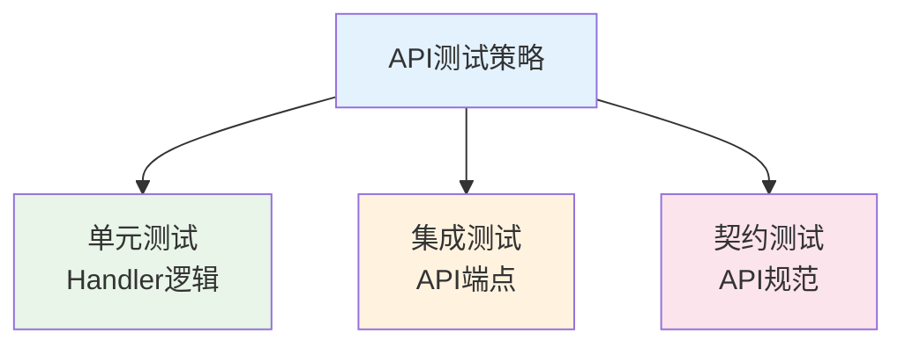

图11：API测试策略

**API测试重点**：
1. **Handler单元测试**：验证请求处理逻辑
2. **端点集成测试**：测试完整的HTTP请求响应
3. **API契约测试**：确保API规范一致性

> 💡 **提示**：完整的测试金字塔理论和实践请参考第14章《测试与质量保证》

**测试数据管理**：
```go
// 测试数据工厂
type TestDataFactory struct {
    db *gorm.DB
}

func NewTestDataFactory(db *gorm.DB) *TestDataFactory {
    return &TestDataFactory{db: db}
}

func (f *TestDataFactory) CreateUser(overrides ...func(*User)) *User {
    user := &User{
        Username:    "testuser_" + generateRandomString(8),
        Email:       "test_" + generateRandomString(8) + "@example.com",
        Password:    hashPassword("password123"),
        Status:      1,
        Role:        1,
        CreatedTime: time.Now().Unix(),
    }
    
    // 应用覆盖参数
    for _, override := range overrides {
        override(user)
    }
    
    f.db.Create(user)
    return user
}

func (f *TestDataFactory) CreateChannel(userID int, overrides ...func(*Channel)) *Channel {
    channel := &Channel{
        UserId:      userID,
        Name:        "test_channel_" + generateRandomString(8),
        Type:        1,
        Key:         generateRandomString(32),
        Status:      1,
        Models:      "gpt-3.5-turbo,gpt-4",
        CreatedTime: time.Now().Unix(),
    }
    
    for _, override := range overrides {
        override(channel)
    }
    
    f.db.Create(channel)
    return channel
}
```

**Mock和Stub使用**：
```go
// 使用testify/mock进行依赖注入测试
type MockUserService struct {
    mock.Mock
}

func (m *MockUserService) GetUser(id int) (*User, error) {
    args := m.Called(id)
    return args.Get(0).(*User), args.Error(1)
}

func (m *MockUserService) CreateUser(user *User) error {
    args := m.Called(user)
    return args.Error(0)
}

// 测试中使用Mock
func TestUserController_GetUser(t *testing.T) {
    mockService := new(MockUserService)
    controller := NewUserController(mockService)
    
    expectedUser := &User{ID: 1, Username: "testuser"}
    mockService.On("GetUser", 1).Return(expectedUser, nil)
    
    // 执行测试
    w := httptest.NewRecorder()
    req := httptest.NewRequest("GET", "/api/v1/users/1", nil)
    
    controller.GetUser(w, req)
    
    // 验证结果
    assert.Equal(t, http.StatusOK, w.Code)
    mockService.AssertExpectations(t)
}
```

**持续集成配置**：
```yaml
# .github/workflows/test.yml
name: API Tests

on:
  push:
    branches: [ main, develop ]
  pull_request:
    branches: [ main ]

jobs:
  test:
    runs-on: ubuntu-latest
    
    services:
      mysql:
        image: mysql:8.0
        env:
          MYSQL_ROOT_PASSWORD: password
          MYSQL_DATABASE: test_db
        options: >-
          --health-cmd="mysqladmin ping"
          --health-interval=10s
          --health-timeout=5s
          --health-retries=3
    
    steps:
    - uses: actions/checkout@v3
    
    - name: Set up Go
      uses: actions/setup-go@v3
      with:
        go-version: 1.19
    
    - name: Install dependencies
      run: go mod download
    
    - name: Run tests
      run: |
        go test -v -race -coverprofile=coverage.out ./...
        go tool cover -html=coverage.out -o coverage.html
    
    - name: Upload coverage
      uses: codecov/codecov-action@v3
      with:
        file: ./coverage.out
```
            
            // 验证响应
            suite.Equal(tt.expectedStatus, w.Code)
            
            if tt.expectedError != "" {
                var response APIResponse
                err := json.Unmarshal(w.Body.Bytes(), &response)
                suite.NoError(err)
                suite.Contains(response.Message, tt.expectedError)
            }
        })
    }
}
```

// 获取用户列表API文档
// @Summary 获取用户列表
// @Description 分页获取用户列表，支持搜索和过滤
// @Tags 用户管理
// @Accept json
// @Produce json
// @Security BearerAuth
// @Param page query int false "页码" default(1)
// @Param limit query int false "每页数量" default(10)
// @Param search query string false "搜索关键词"
// @Param status query int false "用户状态"
// @Param sort_by query string false "排序字段" default(created_time)
// @Param sort_order query string false "排序方向" default(desc)
// @Success 200 {object} APIResponse{data=PaginatedResult{items=[]UserResponse}} "获取成功"
// @Failure 401 {object} APIResponse "未认证"
// @Failure 403 {object} APIResponse "无权限"
// @Router /users [get]
func GetUsers(c *gin.Context) {
    // 实现代码...
}
```

### 5.6.2 API测试

```go
// API测试套件
package api_test

import (
    "bytes"
    "encoding/json"
    "net/http"
    "net/http/httptest"
    "testing"
    
    "github.com/gin-gonic/gin"
    "github.com/stretchr/testify/assert"
    "github.com/stretchr/testify/suite"
)

type APITestSuite struct {
    suite.Suite
    router *gin.Engine
    db     *gorm.DB
}

func (suite *APITestSuite) SetupSuite() {
    // 设置测试环境
    gin.SetMode(gin.TestMode)
    suite.router = setupTestRouter()
    suite.db = setupTestDB()
}

func (suite *APITestSuite) TearDownSuite() {
    // 清理测试环境
    cleanupTestDB(suite.db)
}

func (suite *APITestSuite) SetupTest() {
    // 每个测试前的准备
    cleanupTestData(suite.db)
}

// 测试用户注册
func (suite *APITestSuite) TestUserRegister() {
    // 准备测试数据
    registerReq := RegisterRequest{
        Username: "testuser",
        Password: "password123",
        Email:    "test@example.com",
    }
    
    jsonData, _ := json.Marshal(registerReq)
    
    // 发送请求
    w := httptest.NewRecorder()
    req, _ := http.NewRequest("POST", "/api/v1/auth/register", bytes.NewBuffer(jsonData))
    req.Header.Set("Content-Type", "application/json")
    
    suite.router.ServeHTTP(w, req)
    
    // 验证响应
    assert.Equal(suite.T(), http.StatusCreated, w.Code)
    
    var response APIResponse
    err := json.Unmarshal(w.Body.Bytes(), &response)
    assert.NoError(suite.T(), err)
    assert.True(suite.T(), response.Success)
    
    // 验证数据库中的用户
    var user User
    err = suite.db.Where("username = ?", registerReq.Username).First(&user).Error
    assert.NoError(suite.T(), err)
    assert.Equal(suite.T(), registerReq.Username, user.Username)
    assert.Equal(suite.T(), registerReq.Email, user.Email)
}

// 测试用户登录
func (suite *APITestSuite) TestUserLogin() {
    // 创建测试用户
    user := &User{
        Username: "testuser",
        Password: hashPassword("password123"),
        Email:    "test@example.com",
        Status:   UserStatusEnabled,
    }
    suite.db.Create(user)
    
    // 准备登录请求
    loginReq := LoginRequest{
        Username: "testuser",
        Password: "password123",
    }
    
    jsonData, _ := json.Marshal(loginReq)
    
    // 发送请求
    w := httptest.NewRecorder()
    req, _ := http.NewRequest("POST", "/api/v1/auth/login", bytes.NewBuffer(jsonData))
    req.Header.Set("Content-Type", "application/json")
    
    suite.router.ServeHTTP(w, req)
    
    // 验证响应
    assert.Equal(suite.T(), http.StatusOK, w.Code)
    
    var response APIResponse
    err := json.Unmarshal(w.Body.Bytes(), &response)
    assert.NoError(suite.T(), err)
    assert.True(suite.T(), response.Success)
    
    // 验证返回的令牌
    data := response.Data.(map[string]interface{})
    token, exists := data["token"]
    assert.True(suite.T(), exists)
    assert.NotEmpty(suite.T(), token)
}

// 测试需要认证的API
func (suite *APITestSuite) TestAuthenticatedAPI() {
    // 创建测试用户和令牌
    user, token := suite.createTestUserWithToken()
    
    // 测试获取用户信息
    w := httptest.NewRecorder()
    req, _ := http.NewRequest("GET", "/api/v1/users/profile", nil)
    req.Header.Set("Authorization", "Bearer "+token)
    
    suite.router.ServeHTTP(w, req)
    
    assert.Equal(suite.T(), http.StatusOK, w.Code)
    
    var response APIResponse
    err := json.Unmarshal(w.Body.Bytes(), &response)
    assert.NoError(suite.T(), err)
    assert.True(suite.T(), response.Success)
    
    // 验证返回的用户信息
    userData := response.Data.(map[string]interface{})
    assert.Equal(suite.T(), user.Username, userData["username"])
}

// 测试分页API
func (suite *APITestSuite) TestPaginationAPI() {
    // 创建测试数据
    suite.createTestUsers(25) // 创建25个测试用户
    
    // 创建管理员用户和令牌
    admin, token := suite.createTestAdminWithToken()
    
    // 测试第一页
    w := httptest.NewRecorder()
    req, _ := http.NewRequest("GET", "/api/v1/users?page=1&limit=10", nil)
    req.Header.Set("Authorization", "Bearer "+token)
    
    suite.router.ServeHTTP(w, req)
    
    assert.Equal(suite.T(), http.StatusOK, w.Code)
    
    var response APIResponse
    err := json.Unmarshal(w.Body.Bytes(), &response)
    assert.NoError(suite.T(), err)
    
    data := response.Data.(map[string]interface{})
    items := data["items"].([]interface{})
    pagination := data["pagination"].(map[string]interface{})
    
    assert.Len(suite.T(), items, 10)
    assert.Equal(suite.T(), float64(1), pagination["page"])
    assert.Equal(suite.T(), float64(10), pagination["limit"])
    assert.Equal(suite.T(), float64(26), pagination["total"]) // 25 + 1 admin
    assert.True(suite.T(), pagination["has_next"].(bool))
    assert.False(suite.T(), pagination["has_prev"].(bool))
}

// 辅助方法
func (suite *APITestSuite) createTestUserWithToken() (*User, string) {
    user := &User{
        Username: "testuser",
        Password: hashPassword("password123"),
        Email:    "test@example.com",
        Status:   UserStatusEnabled,
        Role:     RoleUser,
    }
    suite.db.Create(user)
    
    token := generateTestToken(user)
    return user, token
}

func (suite *APITestSuite) createTestAdminWithToken() (*User, string) {
    admin := &User{
        Username: "admin",
        Password: hashPassword("admin123"),
        Email:    "admin@example.com",
        Status:   UserStatusEnabled,
        Role:     RoleAdmin,
    }
    suite.db.Create(admin)
    
    token := generateTestToken(admin)
    return admin, token
}

func (suite *APITestSuite) createTestUsers(count int) {
    for i := 0; i < count; i++ {
        user := &User{
            Username: fmt.Sprintf("user%d", i),
            Password: hashPassword("password123"),
            Email:    fmt.Sprintf("user%d@example.com", i),
            Status:   UserStatusEnabled,
            Role:     RoleUser,
        }
        suite.db.Create(user)
    }
}

func TestAPITestSuite(t *testing.T) {
    suite.Run(t, new(APITestSuite))
}
```

## 本章小结

本章系统性地介绍了RESTful API的设计与实现，涵盖了从基础概念到企业级实践的完整知识体系。

### 核心概念回顾

**REST架构原则**
- 统一接口：标准化的HTTP方法和状态码使用
- 无状态性：每个请求包含完整的处理信息
- 可缓存性：合理利用HTTP缓存机制提升性能
- 分层系统：支持负载均衡、缓存代理等中间层
- 客户端-服务器分离：前后端职责清晰分离

**API设计规范**
- URL设计：资源导向的路径设计，使用名词而非动词
- HTTP方法：GET查询、POST创建、PUT更新、DELETE删除
- 状态码：2xx成功、4xx客户端错误、5xx服务器错误
- 版本控制：URL路径版本控制策略（/api/v1/）
- 响应格式：统一的JSON响应结构

### 实践要点总结

**数据验证与序列化**
- 使用结构体标签进行请求验证
- 自定义验证器处理复杂业务规则
- JSON序列化优化和字段控制
- 错误信息的标准化处理

**分页与过滤**
- 偏移量分页：适用于小数据集的简单分页
- 游标分页：适用于大数据集的高性能分页
- 多维度过滤：支持文本搜索、状态过滤、范围查询
- 性能优化：数据库索引、缓存策略、查询优化

**API文档与测试**
- Swagger/OpenAPI自动文档生成
- 结构化的API测试套件设计
- 单元测试、集成测试、性能测试的完整覆盖
- 持续集成中的自动化测试流程

### 企业级最佳实践

1. **安全性**：认证授权、输入验证、HTTPS传输
2. **性能**：缓存策略、数据库优化、响应压缩
3. **可维护性**：代码结构清晰、文档完善、测试覆盖
4. **可扩展性**：版本控制、向后兼容、模块化设计
5. **监控**：日志记录、性能监控、错误追踪
6. **用户体验**：一致的接口设计、清晰的错误信息、合理的响应时间

通过New API项目的实际案例，我们不仅学习了RESTful API的理论知识，更重要的是掌握了在真实企业环境中如何设计、实现和维护高质量的API服务。这些实践经验将为后续的微服务架构和分布式系统开发奠定坚实基础。

## 练习题

### 基础练习

**练习1：博客系统API设计**
设计一个博客系统的RESTful API，包含以下资源：
- 用户（Users）：注册、登录、个人资料管理
- 文章（Articles）：发布、编辑、删除、查看
- 评论（Comments）：添加、回复、删除
- 标签（Tags）：创建、关联文章
- 分类（Categories）：文章分类管理

要求：
1. 设计符合REST原则的URL结构
2. 定义合适的HTTP方法和状态码
3. 设计统一的响应格式
4. 考虑资源之间的关联关系
5. 实现分页和过滤功能

**练习2：数据验证实现**
基于Go语言实现以下验证功能：
```go
// 实现自定义验证器
type UserRegisterRequest struct {
    Username string `json:"username" validate:"required,min=3,max=20,alphanum"`
    Email    string `json:"email" validate:"required,email,blacklist_domain"`
    Password string `json:"password" validate:"required,min=8,strong_password"`
    Age      int    `json:"age" validate:"min=13,max=120"`
}

// 要求实现：
// 1. blacklist_domain验证器：禁止临时邮箱域名
// 2. strong_password验证器：至少包含大小写字母、数字、特殊字符
// 3. 自定义错误消息的国际化支持
```

### 进阶练习

**练习3：高性能分页实现**
优化现有分页查询，实现以下功能：
```go
// 实现游标分页
type CursorPaginationRequest struct {
    Cursor string `json:"cursor,omitempty"`
    Limit  int    `json:"limit" validate:"min=1,max=100"`
    Sort   string `json:"sort" validate:"oneof=created_at updated_at title"`
    Order  string `json:"order" validate:"oneof=asc desc"`
}

// 要求：
// 1. 支持基于时间戳的游标分页
// 2. 实现游标的加密/解密
// 3. 处理数据一致性问题
// 4. 添加性能监控
```

**练习4：错误处理系统**
设计完整的API错误处理系统：
```go
// 定义错误码体系
const (
    // 通用错误 (1000-1999)
    ErrInvalidRequest = 1001
    ErrUnauthorized   = 1002
    ErrForbidden      = 1003
    
    // 用户相关错误 (2000-2999)
    ErrUserNotFound      = 2001
    ErrUserAlreadyExists = 2002
    ErrInvalidCredentials = 2003
    
    // 业务逻辑错误 (3000-3999)
    ErrInsufficientBalance = 3001
    ErrResourceLocked      = 3002
)

// 要求实现：
// 1. 统一的错误响应格式
// 2. 错误信息的多语言支持
// 3. 错误日志记录和监控
// 4. 错误恢复机制
```

### 综合练习

**练习5：完整API测试套件**
为用户管理模块编写完整的测试：
```go
// 实现测试套件
type UserAPITestSuite struct {
    suite.Suite
    app    *gin.Engine
    db     *gorm.DB
    redis  *redis.Client
    config *Config
}

// 要求实现：
// 1. 单元测试：验证业务逻辑
// 2. 集成测试：测试API端到端流程
// 3. 性能测试：压力测试和基准测试
// 4. 契约测试：API规范一致性验证
// 5. 安全测试：SQL注入、XSS等安全漏洞测试
```

**练习6：API监控与优化**
实现API性能监控和优化：
```go
// 实现监控中间件
func MetricsMiddleware() gin.HandlerFunc {
    // 要求实现：
    // 1. 请求响应时间统计
    // 2. 请求频率限制
    // 3. 错误率监控
    // 4. 资源使用情况跟踪
    // 5. 自动告警机制
}

// 实现缓存策略
func CacheMiddleware() gin.HandlerFunc {
    // 要求实现：
    // 1. Redis缓存集成
    // 2. 缓存失效策略
    // 3. 缓存穿透防护
    // 4. 分布式缓存一致性
}
```

### 实战项目

**练习7：微服务API网关**
基于New API项目，实现一个简化的API网关：

功能要求：
1. **路由管理**：动态路由配置和负载均衡
2. **认证授权**：统一的身份验证和权限控制
3. **限流熔断**：请求限流和服务熔断机制
4. **监控日志**：请求链路追踪和性能监控
5. **协议转换**：HTTP/gRPC协议转换支持

技术栈：
- Go + Gin框架
- Redis缓存
- MySQL数据库
- Prometheus监控
- Jaeger链路追踪

评估标准：
- 代码质量和架构设计
- 性能表现和稳定性
- 文档完整性和测试覆盖率
- 部署和运维便利性

## 扩展阅读

### 官方文档与规范

**REST与HTTP协议**
1. [RESTful API设计指南](https://restfulapi.net/) - REST架构风格的权威指南
2. [HTTP/1.1规范 (RFC 7231)](https://tools.ietf.org/html/rfc7231) - HTTP协议官方规范
3. [HTTP状态码完整列表](https://httpstatuses.com/) - 所有HTTP状态码的详细说明
4. [HTTP缓存机制 (RFC 7234)](https://tools.ietf.org/html/rfc7234) - HTTP缓存的标准规范

**API文档与测试**
5. [OpenAPI规范文档](https://swagger.io/specification/) - API文档标准规范
6. [JSON Schema规范](https://json-schema.org/) - JSON数据验证标准
7. [Postman API测试指南](https://learning.postman.com/docs/) - API测试工具使用指南

### Go语言相关资源

**框架与库**
8. [Gin Web框架文档](https://gin-gonic.com/docs/) - 高性能Go Web框架
9. [GORM ORM文档](https://gorm.io/docs/) - Go语言ORM库
10. [Go Validator库文档](https://github.com/go-playground/validator) - 数据验证库
11. [Testify测试框架](https://github.com/stretchr/testify) - Go语言测试工具集

**性能与监控**
12. [pprof性能分析](https://golang.org/pkg/net/http/pprof/) - Go程序性能分析工具
13. [Prometheus Go客户端](https://github.com/prometheus/client_golang) - 监控指标收集
14. [Jaeger分布式追踪](https://www.jaegertracing.io/docs/) - 微服务链路追踪

### 最佳实践与设计模式

**API设计**
15. [Google API设计指南](https://cloud.google.com/apis/design) - Google的API设计最佳实践
16. [Microsoft REST API指南](https://github.com/Microsoft/api-guidelines) - 微软的API设计规范
17. [API版本控制最佳实践](https://blog.restcase.com/restful-api-versioning-insights/) - 版本控制策略
18. [Richardson成熟度模型](https://martinfowler.com/articles/richardsonMaturityModel.html) - REST API成熟度评估

**安全性**
19. [OWASP API安全Top 10](https://owasp.org/www-project-api-security/) - API安全威胁与防护
20. [JWT最佳实践](https://auth0.com/blog/a-look-at-the-latest-draft-for-jwt-bcp/) - JSON Web Token使用指南
21. [OAuth 2.0安全最佳实践](https://tools.ietf.org/html/draft-ietf-oauth-security-topics) - OAuth认证安全

**性能优化**
22. [API性能优化指南](https://blog.apigee.com/detail/api_performance_optimization) - API性能调优技巧
23. [数据库查询优化](https://use-the-index-luke.com/) - SQL查询性能优化
24. [Redis缓存最佳实践](https://redis.io/topics/memory-optimization) - 缓存策略与优化

### 企业级实践案例

**大厂实践**
25. [Netflix API网关架构](https://netflixtechblog.com/zuul-2-the-netflix-journey-to-asynchronous-non-blocking-systems-45947377fb5c) - 微服务网关设计
26. [Uber API设计原则](https://eng.uber.com/api-design-principles/) - 大规模API设计经验
27. [Stripe API设计哲学](https://stripe.com/blog/payment-api-design) - 支付API设计思考
28. [GitHub API v4设计](https://docs.github.com/en/graphql) - GraphQL API实践

**开源项目**
29. [Kong API网关](https://konghq.com/kong/) - 开源API网关解决方案
30. [Istio服务网格](https://istio.io/latest/docs/) - 微服务治理平台
31. [Envoy代理](https://www.envoyproxy.io/docs/) - 高性能代理服务器

### 学习路径建议

**初学者路径**
1. 掌握HTTP协议基础和REST原则
2. 学习Go语言Web开发基础
3. 实践简单的CRUD API开发
4. 了解API文档和测试工具使用

**进阶开发者路径**
1. 深入学习API设计模式和最佳实践
2. 掌握性能优化和缓存策略
3. 学习微服务架构和服务治理
4. 实践分布式系统设计

**架构师路径**
1. 研究大规模API架构设计
2. 学习API网关和服务网格技术
3. 掌握系统监控和运维实践
4. 关注行业标准和技术趋势

### 持续学习资源

**技术博客**
- [High Scalability](http://highscalability.com/) - 大规模系统架构案例
- [Martin Fowler's Blog](https://martinfowler.com/) - 软件架构和设计模式
- [The New Stack](https://thenewstack.io/) - 云原生技术趋势

**技术会议**
- [GopherCon](https://www.gophercon.com/) - Go语言技术大会
- [API World](https://apiworld.co/) - API技术峰会
- [KubeCon](https://www.cncf.io/kubecon-cloudnativecon-events/) - 云原生技术大会

通过系统性的学习这些资源，你将能够从基础的API开发逐步成长为能够设计和实现企业级API架构的专家。建议根据自己的技术水平选择合适的学习路径，循序渐进地提升技能。
