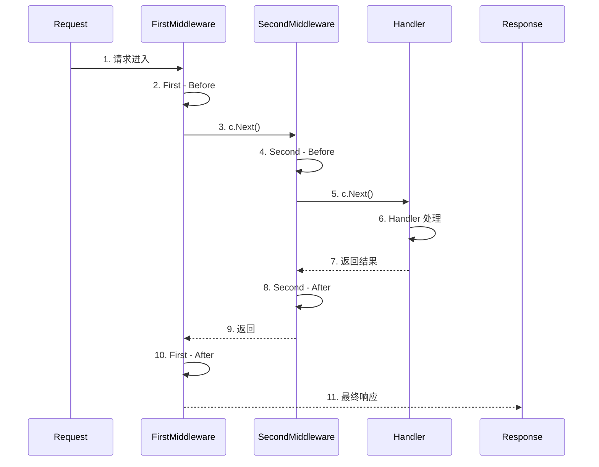
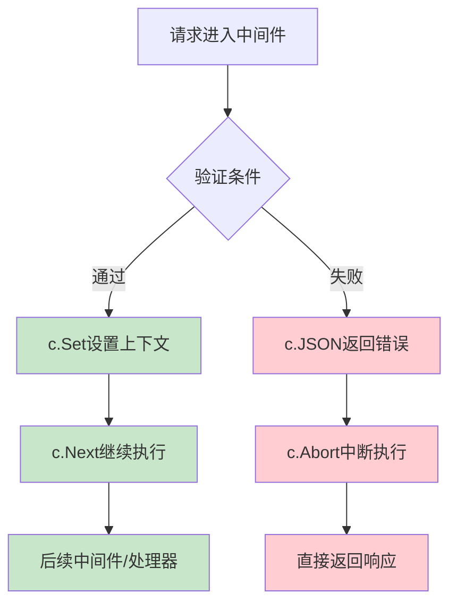
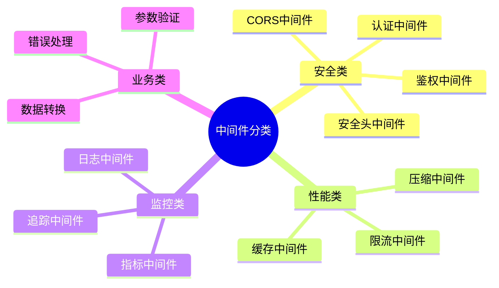
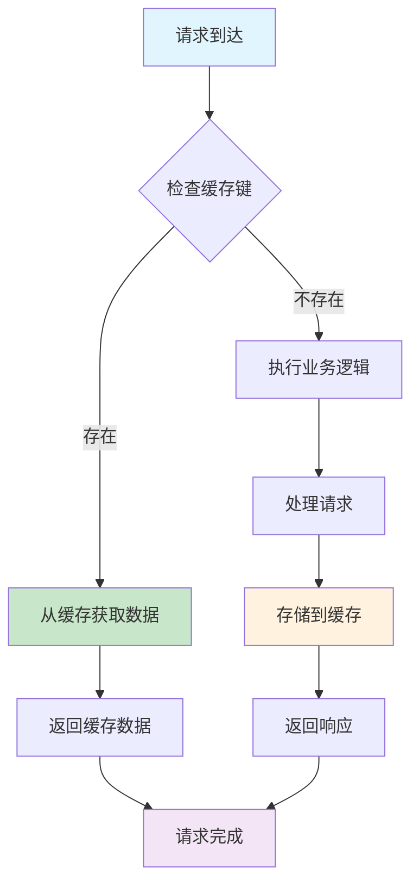
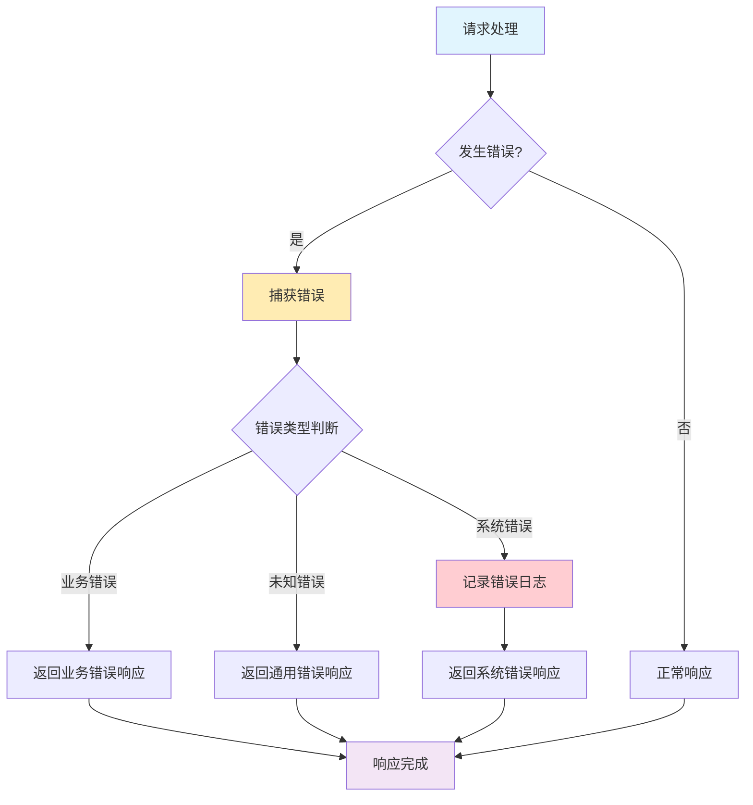
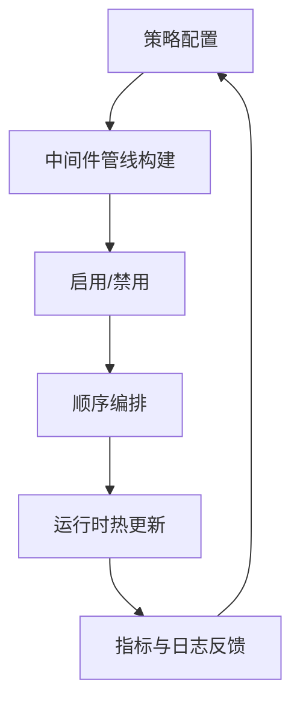
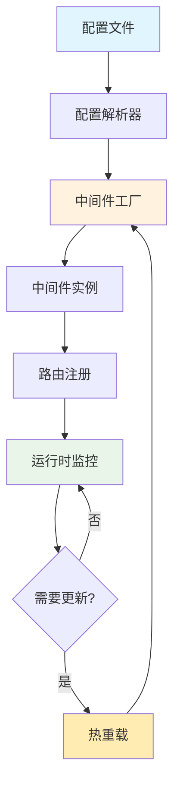
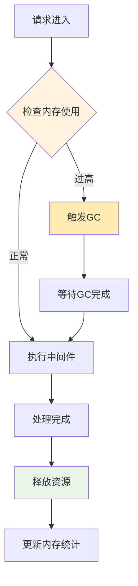
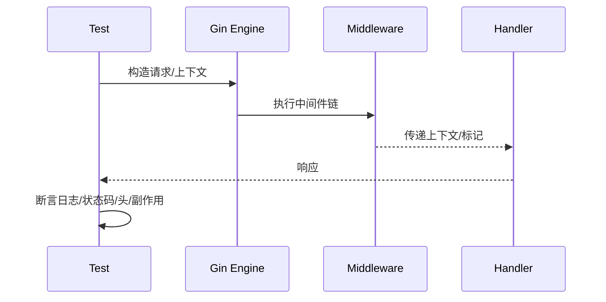
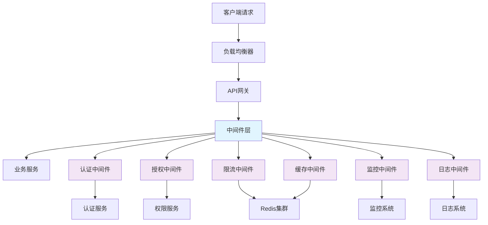

# 第6章 中间件开发与应用


图1：中间件链路与处理顺序

概念要点：
- 中间件（Middleware）：在请求抵达业务处理器前后执行的通用处理单元（如鉴权、限流、日志）。
- 有序链（Chain）：中间件按固定顺序串联，支持前置与后置处理。
- 关注点分离（SoC）：横切关注点抽离出复用中间件，降低重复代码。
- 可观测性：在链路中注入 request_id/span，统一日志与追踪上下文。
- 性能与可靠性：超时、限流、熔断、重试等策略优先在中间件实现。


## 6.1 中间件基础概念

### 6.1.1 什么是中间件

中间件（Middleware）是一种软件设计模式，它位于应用程序的不同层之间，提供通用的服务和功能。在Web开发中，中间件是处理HTTP请求和响应的函数，它们可以在请求到达最终处理器之前或响应返回客户端之前执行特定的逻辑。

#### 中间件的特点

1. **链式调用**：多个中间件可以按顺序执行
2. **可复用性**：同一个中间件可以在多个路由中使用
3. **职责单一**：每个中间件专注于特定功能
4. **透明性**：对业务逻辑透明，不影响核心功能

#### Gin框架中的中间件

```go
// Gin中间件的基本结构
func MiddlewareName() gin.HandlerFunc {
    return func(c *gin.Context) {
        // 请求前处理逻辑
        
        // 调用下一个中间件或处理器
        c.Next()
        
        // 请求后处理逻辑（可选）
    }
}

// 中间件的使用方式
func setupRouter() *gin.Engine {
    r := gin.New()
    
    // 全局中间件
    r.Use(gin.Logger())
    r.Use(gin.Recovery())
    r.Use(CORSMiddleware())
    
    // 路由组中间件
    api := r.Group("/api")
    api.Use(AuthMiddleware())
    {
        api.GET("/users", GetUsers)
        api.POST("/users", CreateUser)
    }
    
    // 单个路由中间件
    r.GET("/admin", AdminMiddleware(), AdminHandler)
    
    return r
}
```

### 6.1.2 中间件的执行顺序



图2：中间件执行顺序时序图

```go
// 中间件执行顺序示例
func FirstMiddleware() gin.HandlerFunc {
    return func(c *gin.Context) {
        fmt.Println("First - Before")
        c.Next()
        fmt.Println("First - After")
    }
}

func SecondMiddleware() gin.HandlerFunc {
    return func(c *gin.Context) {
        fmt.Println("Second - Before")
        c.Next()
        fmt.Println("Second - After")
    }
}

func Handler(c *gin.Context) {
    fmt.Println("Handler")
    c.JSON(200, gin.H{"message": "success"})
}

// 使用示例
r.GET("/test", FirstMiddleware(), SecondMiddleware(), Handler)

// 执行顺序：
// First - Before
// Second - Before
// Handler
// Second - After
// First - After
```

### 6.1.3 中间件的中断机制



图3：中间件中断机制流程图

```go
// 中断中间件链的执行
func AuthMiddleware() gin.HandlerFunc {
    return func(c *gin.Context) {
        token := c.GetHeader("Authorization")
        
        if token == "" {
            c.JSON(401, gin.H{"error": "未提供认证令牌"})
            c.Abort() // 中断执行，不会调用后续中间件和处理器
            return
        }
        
        // 验证令牌
        if !validateToken(token) {
            c.JSON(401, gin.H{"error": "无效的认证令牌"})
            c.Abort()
            return
        }
        
        // 设置用户信息到上下文
        user := getUserFromToken(token)
        c.Set("user", user)
        
        c.Next() // 继续执行下一个中间件
    }
}
```
### 6.1.4 中间件的分类与应用场景

#### 按功能分类



图4：中间件功能分类图

#### 按作用域分类

1. **全局中间件**：应用于所有路由
   - 日志记录
   - 错误恢复
   - CORS处理
   - 安全头设置

2. **路由组中间件**：应用于特定路由组
   - API认证
   - 版本控制
   - 限流策略

3. **路由级中间件**：应用于单个路由
   - 特殊权限检查
   - 参数验证
   - 缓存策略

```go
// 中间件作用域示例
func setupMiddlewareScopes() *gin.Engine {
    r := gin.New()
    
    // 全局中间件
    r.Use(gin.Logger())
    r.Use(gin.Recovery())
    r.Use(CORSMiddleware())
    r.Use(SecurityHeadersMiddleware())
    
    // 公开API路由组
    public := r.Group("/api/public")
    public.Use(RateLimitMiddleware(100)) // 路由组中间件
    {
        public.GET("/health", HealthCheck)
        public.POST("/register", RegisterHandler)
    }
    
    // 认证API路由组
    auth := r.Group("/api/v1")
    auth.Use(AuthMiddleware()) // 路由组中间件
    auth.Use(RateLimitMiddleware(1000))
    {
        auth.GET("/users", GetUsers)
        auth.POST("/users", CreateUser)
        
        // 管理员专用路由（路由级中间件）
        auth.DELETE("/users/:id", AdminMiddleware(), DeleteUser)
    }
    
    return r
}
```

### 6.1.5 中间件设计原则

#### 单一职责原则
每个中间件应该只负责一个特定的功能，避免在单个中间件中处理多种不相关的逻辑。

```go
// 好的设计：职责单一
func AuthMiddleware() gin.HandlerFunc { /* 只处理认证 */ }
func LoggingMiddleware() gin.HandlerFunc { /* 只处理日志 */ }
func RateLimitMiddleware() gin.HandlerFunc { /* 只处理限流 */ }

// 不好的设计：职责混合
func MegaMiddleware() gin.HandlerFunc {
    return func(c *gin.Context) {
        // 认证逻辑
        // 日志逻辑
        // 限流逻辑
        // 缓存逻辑
        // ...
    }
}
```

#### 可配置性原则
中间件应该支持配置，以适应不同的使用场景。

```go
// 可配置的中间件设计
type RateLimitConfig struct {
    Rate     int           // 速率限制
    Burst    int           // 突发限制
    Window   time.Duration // 时间窗口
    KeyFunc  func(*gin.Context) string // 键生成函数
    SkipFunc func(*gin.Context) bool   // 跳过条件
}

func RateLimitWithConfig(config RateLimitConfig) gin.HandlerFunc {
    // 实现逻辑
}

// 使用示例
r.Use(RateLimitWithConfig(RateLimitConfig{
    Rate:   100,
    Burst:  10,
    Window: time.Minute,
    KeyFunc: func(c *gin.Context) string {
        return c.ClientIP()
    },
}))
```

#### 错误处理原则
中间件应该优雅地处理错误，避免影响整个应用的稳定性。

```go
func SafeMiddleware() gin.HandlerFunc {
    return func(c *gin.Context) {
        defer func() {
            if err := recover(); err != nil {
                // 记录错误日志
                log.Printf("中间件发生panic: %v", err)
                
                // 返回通用错误响应
                c.JSON(500, gin.H{
                    "error": "内部服务器错误",
                })
                c.Abort()
            }
        }()
        
        // 中间件逻辑
        c.Next()
    }
}
```

## 6.2 New API项目中的核心中间件

术语速览：
- 认证与鉴权：识别身份与权限检查，拦截未授权访问。
- 限流与熔断：在高并发与异常时保护系统，避免级联故障。
- 日志与追踪：贯穿 request_id/trace_id 便于定位问题与审计。
- 缓存：降低下游压力与延迟，注意一致性与过期策略。
- CORS：控制跨域访问策略，保障浏览器端安全。


图5：核心中间件类别与作用

### 6.2.1 CORS中间件

```go
// middleware/cors.go
package middleware

import (
    "github.com/gin-gonic/gin"
    "net/http"
)

// CORS中间件配置
type CORSConfig struct {
    AllowOrigins     []string
    AllowMethods     []string
    AllowHeaders     []string
    ExposeHeaders    []string
    AllowCredentials bool
    MaxAge           int
}

// 默认CORS配置
func DefaultCORSConfig() CORSConfig {
    return CORSConfig{
        AllowOrigins: []string{"*"},
        AllowMethods: []string{
            http.MethodGet,
            http.MethodPost,
            http.MethodPut,
            http.MethodPatch,
            http.MethodDelete,
            http.MethodHead,
            http.MethodOptions,
        },
        AllowHeaders: []string{
            "Origin",
            "Content-Length",
            "Content-Type",
            "Authorization",
            "X-Requested-With",
            "Accept",
            "Accept-Encoding",
            "Accept-Language",
            "Connection",
            "Host",
            "Referer",
            "User-Agent",
        },
        ExposeHeaders: []string{
            "Content-Length",
            "Content-Type",
        },
        AllowCredentials: true,
        MaxAge:           86400, // 24小时
    }
}

// CORS中间件
func CORS() gin.HandlerFunc {
    return CORSWithConfig(DefaultCORSConfig())
}

func CORSWithConfig(config CORSConfig) gin.HandlerFunc {
    return func(c *gin.Context) {
        origin := c.Request.Header.Get("Origin")
        
        // 检查是否允许该来源
        if isOriginAllowed(origin, config.AllowOrigins) {
            c.Header("Access-Control-Allow-Origin", origin)
        }
        
        // 设置允许的方法
        if len(config.AllowMethods) > 0 {
            c.Header("Access-Control-Allow-Methods", joinStrings(config.AllowMethods, ", "))
        }
        
        // 设置允许的头部
        if len(config.AllowHeaders) > 0 {
            c.Header("Access-Control-Allow-Headers", joinStrings(config.AllowHeaders, ", "))
        }
        
        // 设置暴露的头部
        if len(config.ExposeHeaders) > 0 {
            c.Header("Access-Control-Expose-Headers", joinStrings(config.ExposeHeaders, ", "))
        }
        
        // 设置是否允许凭据
        if config.AllowCredentials {
            c.Header("Access-Control-Allow-Credentials", "true")
        }
        
        // 设置预检请求的缓存时间
        if config.MaxAge > 0 {
            c.Header("Access-Control-Max-Age", fmt.Sprintf("%d", config.MaxAge))
        }
        
        // 处理预检请求
        if c.Request.Method == http.MethodOptions {
            c.AbortWithStatus(http.StatusNoContent)
            return
        }
        
        c.Next()
    }
}

// 辅助函数
func isOriginAllowed(origin string, allowedOrigins []string) bool {
    for _, allowed := range allowedOrigins {
        if allowed == "*" || allowed == origin {
            return true
        }
        // 支持通配符匹配
        if matched, _ := filepath.Match(allowed, origin); matched {
            return true
        }
    }
    return false
}

func joinStrings(strs []string, sep string) string {
    return strings.Join(strs, sep)
}
```

### 6.2.2 认证中间件

```go
// middleware/auth.go
package middleware

import (
    "net/http"
    "strings"
    "strconv"
    
    "github.com/gin-gonic/gin"
    "one-api/common"
    "one-api/model"
)

// 用户认证中间件
func UserAuth() gin.HandlerFunc {
    return func(c *gin.Context) {
        // 从请求头获取令牌
        token := getTokenFromRequest(c)
        if token == "" {
            c.JSON(http.StatusUnauthorized, gin.H{
                "success": false,
                "message": "未提供认证令牌",
                "error": gin.H{
                    "code": "MISSING_TOKEN",
                    "message": "请在请求头中提供Authorization令牌",
                },
            })
            c.Abort()
            return
        }
        
        // 验证令牌并获取用户信息
        user := model.ValidateAccessToken(token)
        if user == nil {
            c.JSON(http.StatusUnauthorized, gin.H{
                "success": false,
                "message": "无效的认证令牌",
                "error": gin.H{
                    "code": "INVALID_TOKEN",
                    "message": "提供的令牌无效或已过期",
                },
            })
            c.Abort()
            return
        }
        
        // 检查用户状态
        if user.Status != common.UserStatusEnabled {
            c.JSON(http.StatusForbidden, gin.H{
                "success": false,
                "message": "用户账户已被禁用",
                "error": gin.H{
                    "code": "USER_DISABLED",
                    "message": "您的账户已被管理员禁用",
                },
            })
            c.Abort()
            return
        }
        
        // 将用户信息存储到上下文中
        c.Set("user", user)
        c.Set("user_id", user.ID)
        c.Set("username", user.Username)
        c.Set("user_role", user.Role)
        
        c.Next()
    }
}

// 管理员认证中间件
func AdminAuth() gin.HandlerFunc {
    return func(c *gin.Context) {
        // 先进行用户认证
        UserAuth()(c)
        
        // 如果用户认证失败，直接返回
        if c.IsAborted() {
            return
        }
        
        // 检查用户角色
        userRole := c.GetInt("user_role")
        if userRole != common.RoleRootUser && userRole != common.RoleAdminUser {
            c.JSON(http.StatusForbidden, gin.H{
                "success": false,
                "message": "权限不足",
                "error": gin.H{
                    "code": "INSUFFICIENT_PERMISSIONS",
                    "message": "您没有执行此操作的权限",
                },
            })
            c.Abort()
            return
        }
        
        c.Next()
    }
}

// 根用户认证中间件
func RootAuth() gin.HandlerFunc {
    return func(c *gin.Context) {
        // 先进行用户认证
        UserAuth()(c)
        
        if c.IsAborted() {
            return
        }
        
        // 检查是否为根用户
        userRole := c.GetInt("user_role")
        if userRole != common.RoleRootUser {
            c.JSON(http.StatusForbidden, gin.H{
                "success": false,
                "message": "需要根用户权限",
                "error": gin.H{
                    "code": "ROOT_REQUIRED",
                    "message": "此操作需要根用户权限",
                },
            })
            c.Abort()
            return
        }
        
        c.Next()
    }
}

// 令牌认证中间件（用于API调用）
func TokenAuth() gin.HandlerFunc {
    return func(c *gin.Context) {
        token := getTokenFromRequest(c)
        if token == "" {
            c.JSON(http.StatusUnauthorized, gin.H{
                "error": gin.H{
                    "message": "未提供API令牌",
                    "type": "invalid_request_error",
                    "code": "missing_token",
                },
            })
            c.Abort()
            return
        }
        
        // 验证API令牌
        tokenObj := model.ValidateUserToken(token)
        if tokenObj == nil {
            c.JSON(http.StatusUnauthorized, gin.H{
                "error": gin.H{
                    "message": "无效的API令牌",
                    "type": "invalid_request_error",
                    "code": "invalid_token",
                },
            })
            c.Abort()
            return
        }
        
        // 检查令牌状态
        if tokenObj.Status != common.TokenStatusEnabled {
            c.JSON(http.StatusUnauthorized, gin.H{
                "error": gin.H{
                    "message": "令牌已被禁用",
                    "type": "invalid_request_error",
                    "code": "token_disabled",
                },
            })
            c.Abort()
            return
        }
        
        // 检查令牌是否过期
        if tokenObj.ExpiredTime != -1 && tokenObj.ExpiredTime < common.GetTimestamp() {
            c.JSON(http.StatusUnauthorized, gin.H{
                "error": gin.H{
                    "message": "令牌已过期",
                    "type": "invalid_request_error",
                    "code": "token_expired",
                },
            })
            c.Abort()
            return
        }
        
        // 获取令牌对应的用户
        user := model.GetUserById(tokenObj.UserId, false)
        if user == nil || user.Status != common.UserStatusEnabled {
            c.JSON(http.StatusUnauthorized, gin.H{
                "error": gin.H{
                    "message": "令牌对应的用户不存在或已被禁用",
                    "type": "invalid_request_error",
                    "code": "user_disabled",
                },
            })
            c.Abort()
            return
        }
        
        // 更新令牌访问时间
        go func() {
            tokenObj.AccessedTime = common.GetTimestamp()
            tokenObj.Update()
        }()
        
        // 将信息存储到上下文
        c.Set("token", tokenObj)
        c.Set("user", user)
        c.Set("user_id", user.ID)
        c.Set("token_id", tokenObj.ID)
        c.Set("token_name", tokenObj.Name)
        
        c.Next()
    }
}

// 从请求中获取令牌
func getTokenFromRequest(c *gin.Context) string {
    // 1. 从Authorization头获取
    auth := c.GetHeader("Authorization")
    if auth != "" {
        // 支持Bearer格式
        if strings.HasPrefix(auth, "Bearer ") {
            return strings.TrimPrefix(auth, "Bearer ")
        }
        return auth
    }
    
    // 2. 从查询参数获取
    if token := c.Query("token"); token != "" {
        return token
    }
    
    // 3. 从表单参数获取
    if token := c.PostForm("token"); token != "" {
        return token
    }
    
    return ""
}
```

### 6.2.3 速率限制中间件

```go
// middleware/rate_limit.go
package middleware

import (
    "fmt"
    "net/http"
    "strconv"
    "time"
    
    "github.com/gin-gonic/gin"
    "github.com/go-redis/redis/v8"
    "one-api/common"
)

// 速率限制配置
type RateLimitConfig struct {
    KeyGenerator func(*gin.Context) string // 生成限制键的函数
    Limit        int                       // 限制次数
    Window       time.Duration             // 时间窗口
    Message      string                    // 超限时的消息
    SkipFunc     func(*gin.Context) bool   // 跳过限制的条件
}

// 全局API速率限制
func GlobalAPIRateLimit() gin.HandlerFunc {
    config := RateLimitConfig{
        KeyGenerator: func(c *gin.Context) string {
            return "global_api_rate_limit:" + c.ClientIP()
        },
        Limit:   common.GlobalAPIRateLimit,
        Window:  time.Minute,
        Message: "请求过于频繁，请稍后再试",
        SkipFunc: func(c *gin.Context) bool {
            // 跳过静态资源和健康检查
            path := c.Request.URL.Path
            return strings.HasPrefix(path, "/static/") || path == "/health"
        },
    }
    
    return RateLimitWithConfig(config)
}

// 用户级别速率限制
func UserRateLimit(limit int, window time.Duration) gin.HandlerFunc {
    config := RateLimitConfig{
        KeyGenerator: func(c *gin.Context) string {
            userID := c.GetInt("user_id")
            if userID == 0 {
                return "user_rate_limit:anonymous:" + c.ClientIP()
            }
            return fmt.Sprintf("user_rate_limit:%d", userID)
        },
        Limit:   limit,
        Window:  window,
        Message: "用户请求过于频繁，请稍后再试",
    }
    
    return RateLimitWithConfig(config)
}

// 邮箱验证速率限制
func EmailVerificationRateLimit() gin.HandlerFunc {
    config := RateLimitConfig{
        KeyGenerator: func(c *gin.Context) string {
            email := c.PostForm("email")
            if email == "" {
                email = c.ClientIP()
            }
            return "email_verification:" + email
        },
        Limit:   2,
        Window:  30 * time.Second,
        Message: "邮箱验证请求过于频繁，请30秒后再试",
    }
    
    return RateLimitWithConfig(config)
}

// 模型请求速率限制
func ModelRateLimit() gin.HandlerFunc {
    return func(c *gin.Context) {
        // 获取用户和令牌信息
        userID := c.GetInt("user_id")
        tokenID := c.GetInt("token_id")
        
        if userID == 0 {
            c.Next()
            return
        }
        
        // 检查用户级别的模型请求限制
        userKey := fmt.Sprintf("model_rate_limit:user:%d", userID)
        if !checkRateLimit(userKey, common.UserModelRateLimit, time.Minute) {
            c.JSON(http.StatusTooManyRequests, gin.H{
                "error": gin.H{
                    "message": "模型请求过于频繁，请稍后再试",
                    "type": "rate_limit_error",
                    "code": "user_rate_limit_exceeded",
                },
            })
            c.Abort()
            return
        }
        
        // 检查令牌级别的模型请求限制
        if tokenID > 0 {
            tokenKey := fmt.Sprintf("model_rate_limit:token:%d", tokenID)
            if !checkRateLimit(tokenKey, common.TokenModelRateLimit, time.Minute) {
                c.JSON(http.StatusTooManyRequests, gin.H{
                    "error": gin.H{
                        "message": "令牌请求过于频繁，请稍后再试",
                        "type": "rate_limit_error",
                        "code": "token_rate_limit_exceeded",
                    },
                })
                c.Abort()
                return
            }
        }
        
        c.Next()
    }
}

// 通用速率限制中间件
func RateLimitWithConfig(config RateLimitConfig) gin.HandlerFunc {
    return func(c *gin.Context) {
        // 检查是否跳过限制
        if config.SkipFunc != nil && config.SkipFunc(c) {
            c.Next()
            return
        }
        
        // 生成限制键
        key := config.KeyGenerator(c)
        
        // 检查速率限制
        if !checkRateLimit(key, config.Limit, config.Window) {
            c.JSON(http.StatusTooManyRequests, gin.H{
                "success": false,
                "message": config.Message,
                "error": gin.H{
                    "code": "RATE_LIMIT_EXCEEDED",
                    "message": config.Message,
                },
            })
            c.Abort()
            return
        }
        
        c.Next()
    }
}

// 检查速率限制（使用Redis实现）
func checkRateLimit(key string, limit int, window time.Duration) bool {
    if common.RedisEnabled {
        return checkRateLimitWithRedis(key, limit, window)
    }
    return checkRateLimitWithMemory(key, limit, window)
}

// 使用Redis实现速率限制
func checkRateLimitWithRedis(key string, limit int, window time.Duration) bool {
    ctx := context.Background()
    rdb := common.RDB
    
    // 使用滑动窗口算法
    now := time.Now().Unix()
    windowStart := now - int64(window.Seconds())
    
    pipe := rdb.Pipeline()
    
    // 删除窗口外的记录
    pipe.ZRemRangeByScore(ctx, key, "0", strconv.FormatInt(windowStart, 10))
    
    // 添加当前请求
    pipe.ZAdd(ctx, key, &redis.Z{
        Score:  float64(now),
        Member: fmt.Sprintf("%d_%d", now, rand.Int()),
    })
    
    // 获取当前窗口内的请求数
    pipe.ZCard(ctx, key)
    
    // 设置过期时间
    pipe.Expire(ctx, key, window)
    
    results, err := pipe.Exec(ctx)
    if err != nil {
        common.SysError("Redis速率限制检查失败: " + err.Error())
        return true // 出错时允许请求
    }
    
    // 获取当前请求数
    count := results[2].(*redis.IntCmd).Val()
    
    return count <= int64(limit)
}

// 使用内存实现速率限制（简单实现）
var memoryRateLimit = make(map[string][]time.Time)
var rateLimitMutex sync.RWMutex

func checkRateLimitWithMemory(key string, limit int, window time.Duration) bool {
    rateLimitMutex.Lock()
    defer rateLimitMutex.Unlock()
    
    now := time.Now()
    windowStart := now.Add(-window)
    
    // 获取或创建请求记录
    requests, exists := memoryRateLimit[key]
    if !exists {
        requests = make([]time.Time, 0)
    }
    
    // 清理过期记录
    validRequests := make([]time.Time, 0)
    for _, reqTime := range requests {
        if reqTime.After(windowStart) {
            validRequests = append(validRequests, reqTime)
        }
    }
    
    // 检查是否超过限制
    if len(validRequests) >= limit {
        memoryRateLimit[key] = validRequests
        return false
    }
    
    // 添加当前请求
    validRequests = append(validRequests, now)
    memoryRateLimit[key] = validRequests
    
    return true
}
```
### 6.2.4 缓存中间件



图6：缓存中间件处理流程

```go
// middleware/cache.go
package middleware

import (
    "crypto/md5"
    "encoding/hex"
    "encoding/json"
    "fmt"
    "net/http"
    "strconv"
    "strings"
    "time"
    
    "github.com/gin-gonic/gin"
    "one-api/common"
)

// 缓存配置
type CacheConfig struct {
    TTL          time.Duration                     // 缓存过期时间
    KeyGenerator func(*gin.Context) string        // 缓存键生成器
    ShouldCache  func(*gin.Context, int) bool     // 是否应该缓存
    Prefix       string                           // 缓存键前缀
}

// 响应缓存中间件
func ResponseCache(ttl time.Duration) gin.HandlerFunc {
    config := CacheConfig{
        TTL: ttl,
        KeyGenerator: func(c *gin.Context) string {
            return generateCacheKey(c)
        },
        ShouldCache: func(c *gin.Context, status int) bool {
            return status == http.StatusOK && c.Request.Method == "GET"
        },
        Prefix: "response_cache:",
    }
    
    return ResponseCacheWithConfig(config)
}

func ResponseCacheWithConfig(config CacheConfig) gin.HandlerFunc {
    return func(c *gin.Context) {
        // 只缓存GET请求
        if c.Request.Method != "GET" {
            c.Next()
            return
        }
        
        // 生成缓存键
        cacheKey := config.Prefix + config.KeyGenerator(c)
        
        // 尝试从缓存获取
        if cachedData, exists := getCachedResponse(cacheKey); exists {
            var response CachedResponse
            if err := json.Unmarshal([]byte(cachedData), &response); err == nil {
                // 设置响应头
                for key, value := range response.Headers {
                    c.Header(key, value)
                }
                c.Header("X-Cache", "HIT")
                
                // 返回缓存的响应
                c.Data(response.Status, response.ContentType, response.Body)
                c.Abort()
                return
            }
        }
        
        // 创建响应写入器包装器
        writer := &cacheWriter{
            ResponseWriter: c.Writer,
            cacheKey:      cacheKey,
            config:        config,
            context:       c,
        }
        c.Writer = writer
        
        c.Header("X-Cache", "MISS")
        c.Next()
    }
}

// 缓存的响应结构
type CachedResponse struct {
    Status      int               `json:"status"`
    Headers     map[string]string `json:"headers"`
    Body        []byte            `json:"body"`
    ContentType string            `json:"content_type"`
    CachedAt    time.Time         `json:"cached_at"`
}

// 缓存写入器
type cacheWriter struct {
    gin.ResponseWriter
    cacheKey string
    config   CacheConfig
    context  *gin.Context
    body     []byte
}

func (w *cacheWriter) Write(data []byte) (int, error) {
    w.body = append(w.body, data...)
    return w.ResponseWriter.Write(data)
}

func (w *cacheWriter) WriteHeader(statusCode int) {
    w.ResponseWriter.WriteHeader(statusCode)
    
    // 检查是否应该缓存
    if w.config.ShouldCache(w.context, statusCode) {
        go w.cacheResponse(statusCode)
    }
}

func (w *cacheWriter) cacheResponse(status int) {
    // 构建缓存响应
    headers := make(map[string]string)
    for key, values := range w.Header() {
        if len(values) > 0 {
            headers[key] = values[0]
        }
    }
    
    response := CachedResponse{
        Status:      status,
        Headers:     headers,
        Body:        w.body,
        ContentType: w.Header().Get("Content-Type"),
        CachedAt:    time.Now(),
    }
    
    // 序列化并存储到缓存
    if data, err := json.Marshal(response); err == nil {
        setCachedResponse(w.cacheKey, string(data), w.config.TTL)
    }
}

// 生成缓存键
func generateCacheKey(c *gin.Context) string {
    h := md5.New()
    h.Write([]byte(c.Request.URL.Path))
    h.Write([]byte(c.Request.URL.RawQuery))
    
    // 包含用户相关信息（如果存在）
    if userID := c.GetInt("user_id"); userID > 0 {
        h.Write([]byte(strconv.Itoa(userID)))
    }
    
    return hex.EncodeToString(h.Sum(nil))
}

// 缓存操作函数
func getCachedResponse(key string) (string, bool) {
    if common.RedisEnabled {
        val, err := common.RDB.Get(common.RDBContext, key).Result()
        return val, err == nil
    }
    return "", false
}

func setCachedResponse(key, value string, ttl time.Duration) {
    if common.RedisEnabled {
        common.RDB.Set(common.RDBContext, key, value, ttl)
    }
}
```

### 6.2.5 压缩中间件

```go
// middleware/compress.go
package middleware

import (
    "compress/gzip"
    "io"
    "net/http"
    "strings"
    
    "github.com/gin-gonic/gin"
)

// 压缩配置
type CompressConfig struct {
    Level            int      // 压缩级别 (1-9)
    MinLength        int      // 最小压缩长度
    ExcludedPaths    []string // 排除的路径
    ExcludedMimeTypes []string // 排除的MIME类型
}

// Gzip压缩中间件
func Gzip() gin.HandlerFunc {
    return GzipWithConfig(CompressConfig{
        Level:     gzip.DefaultCompression,
        MinLength: 1024, // 1KB
        ExcludedPaths: []string{
            "/metrics",
            "/health",
        },
        ExcludedMimeTypes: []string{
            "image/",
            "video/",
            "audio/",
        },
    })
}

func GzipWithConfig(config CompressConfig) gin.HandlerFunc {
    return func(c *gin.Context) {
        // 检查客户端是否支持gzip
        if !strings.Contains(c.GetHeader("Accept-Encoding"), "gzip") {
            c.Next()
            return
        }
        
        // 检查是否为排除的路径
        path := c.Request.URL.Path
        for _, excludedPath := range config.ExcludedPaths {
            if strings.HasPrefix(path, excludedPath) {
                c.Next()
                return
            }
        }
        
        // 创建gzip写入器
        gz, err := gzip.NewWriterLevel(c.Writer, config.Level)
        if err != nil {
            c.Next()
            return
        }
        defer gz.Close()
        
        // 设置响应头
        c.Header("Content-Encoding", "gzip")
        c.Header("Vary", "Accept-Encoding")
        
        // 包装响应写入器
        c.Writer = &gzipWriter{
            ResponseWriter: c.Writer,
            writer:        gz,
            config:        config,
        }
        
        c.Next()
    }
}

// Gzip写入器
type gzipWriter struct {
    gin.ResponseWriter
    writer io.Writer
    config CompressConfig
}

func (g *gzipWriter) Write(data []byte) (int, error) {
    // 检查内容长度
    if len(data) < g.config.MinLength {
        return g.ResponseWriter.Write(data)
    }
    
    // 检查MIME类型
    contentType := g.Header().Get("Content-Type")
    for _, excludedType := range g.config.ExcludedMimeTypes {
        if strings.HasPrefix(contentType, excludedType) {
            return g.ResponseWriter.Write(data)
        }
    }
    
    return g.writer.Write(data)
}
```

### 6.2.6 安全头中间件

```go
// middleware/security.go
package middleware

import (
    "github.com/gin-gonic/gin"
)

// 安全配置
type SecurityConfig struct {
    ContentTypeNosniff    bool   // X-Content-Type-Options
    FrameDeny            bool   // X-Frame-Options
    XSSProtection        bool   // X-XSS-Protection
    HSTSMaxAge           int    // Strict-Transport-Security
    ContentSecurityPolicy string // Content-Security-Policy
    ReferrerPolicy       string // Referrer-Policy
    PermissionsPolicy    string // Permissions-Policy
}

// 安全头中间件
func SecureHeaders() gin.HandlerFunc {
    config := SecurityConfig{
        ContentTypeNosniff: true,
        FrameDeny:         true,
        XSSProtection:     true,
        HSTSMaxAge:        31536000, // 1年
        ContentSecurityPolicy: "default-src 'self'; script-src 'self' 'unsafe-inline'; style-src 'self' 'unsafe-inline'",
        ReferrerPolicy:       "strict-origin-when-cross-origin",
        PermissionsPolicy:    "geolocation=(), microphone=(), camera=()",
    }
    
    return SecureHeadersWithConfig(config)
}

func SecureHeadersWithConfig(config SecurityConfig) gin.HandlerFunc {
    return func(c *gin.Context) {
        // X-Content-Type-Options
        if config.ContentTypeNosniff {
            c.Header("X-Content-Type-Options", "nosniff")
        }
        
        // X-Frame-Options
        if config.FrameDeny {
            c.Header("X-Frame-Options", "DENY")
        }
        
        // X-XSS-Protection
        if config.XSSProtection {
            c.Header("X-XSS-Protection", "1; mode=block")
        }
        
        // Strict-Transport-Security
        if config.HSTSMaxAge > 0 && c.Request.TLS != nil {
            c.Header("Strict-Transport-Security", fmt.Sprintf("max-age=%d; includeSubDomains", config.HSTSMaxAge))
        }
        
        // Content-Security-Policy
        if config.ContentSecurityPolicy != "" {
            c.Header("Content-Security-Policy", config.ContentSecurityPolicy)
        }
        
        // Referrer-Policy
        if config.ReferrerPolicy != "" {
            c.Header("Referrer-Policy", config.ReferrerPolicy)
        }
        
        // Permissions-Policy
        if config.PermissionsPolicy != "" {
            c.Header("Permissions-Policy", config.PermissionsPolicy)
        }
        
        c.Next()
    }
}
```

## 6.3 自定义中间件开发

### 6.3.1 请求日志中间件

```go
// middleware/logger.go
package middleware

import (
    "bytes"
    "encoding/json"
    "fmt"
    "io"
    "time"
    
    "github.com/gin-gonic/gin"
    "one-api/common"
)

// 日志配置
type LoggerConfig struct {
    SkipPaths    []string                          // 跳过记录的路径
    LogLevel     string                            // 日志级别
    LogFormat    string                            // 日志格式
    CustomFields func(*gin.Context) map[string]interface{} // 自定义字段
}

// 请求日志中间件
func RequestLogger() gin.HandlerFunc {
    return RequestLoggerWithConfig(LoggerConfig{
        SkipPaths: []string{"/health", "/metrics"},
        LogLevel:  "info",
        LogFormat: "json",
    })
}

func RequestLoggerWithConfig(config LoggerConfig) gin.HandlerFunc {
    return func(c *gin.Context) {
        // 检查是否跳过记录
        path := c.Request.URL.Path
        for _, skipPath := range config.SkipPaths {
            if path == skipPath {
                c.Next()
                return
            }
        }
        
        // 记录开始时间
        start := time.Now()
        
        // 读取请求体（如果需要）
        var requestBody []byte
        if shouldLogRequestBody(c) {
            requestBody = readRequestBody(c)
        }
        
        // 创建响应写入器包装器
        responseWriter := &responseWriter{
            ResponseWriter: c.Writer,
            body:          &bytes.Buffer{},
        }
        c.Writer = responseWriter
        
        // 处理请求
        c.Next()
        
        // 计算处理时间
        latency := time.Since(start)
        
        // 构建日志数据
        logData := buildLogData(c, start, latency, requestBody, responseWriter.body.Bytes(), config)
        
        // 记录日志
        logRequest(logData, config.LogLevel)
    }
}

// 响应写入器包装器
type responseWriter struct {
    gin.ResponseWriter
    body *bytes.Buffer
}

func (w *responseWriter) Write(b []byte) (int, error) {
    w.body.Write(b)
    return w.ResponseWriter.Write(b)
}

// 构建日志数据
func buildLogData(c *gin.Context, start time.Time, latency time.Duration, requestBody, responseBody []byte, config LoggerConfig) map[string]interface{} {
    logData := map[string]interface{}{
        "timestamp":    start.Format(time.RFC3339),
        "method":       c.Request.Method,
        "path":         c.Request.URL.Path,
        "query":        c.Request.URL.RawQuery,
        "status":       c.Writer.Status(),
        "latency":      latency.String(),
        "latency_ms":   latency.Nanoseconds() / 1000000,
        "client_ip":    c.ClientIP(),
        "user_agent":   c.Request.UserAgent(),
        "referer":      c.Request.Referer(),
        "request_size": c.Request.ContentLength,
        "response_size": c.Writer.Size(),
    }
    
    // 添加用户信息（如果已认证）
    if userID := c.GetInt("user_id"); userID > 0 {
        logData["user_id"] = userID
        logData["username"] = c.GetString("username")
    }
    
    // 添加令牌信息（如果存在）
    if tokenID := c.GetInt("token_id"); tokenID > 0 {
        logData["token_id"] = tokenID
        logData["token_name"] = c.GetString("token_name")
    }
    
    // 添加请求体（如果需要且不为空）
    if len(requestBody) > 0 {
        logData["request_body"] = string(requestBody)
    }
    
    // 添加响应体（如果需要且不为空）
    if shouldLogResponseBody(c) && len(responseBody) > 0 {
        logData["response_body"] = string(responseBody)
    }
    
    // 添加错误信息（如果存在）
    if len(c.Errors) > 0 {
        logData["errors"] = c.Errors.String()
    }
    
    // 添加自定义字段
    if config.CustomFields != nil {
        customFields := config.CustomFields(c)
        for key, value := range customFields {
            logData[key] = value
        }
    }
    
    return logData
}

// 判断是否应该记录请求体
func shouldLogRequestBody(c *gin.Context) bool {
    // 只记录POST、PUT、PATCH请求的请求体
    method := c.Request.Method
    if method != "POST" && method != "PUT" && method != "PATCH" {
        return false
    }
    
    // 检查内容类型
    contentType := c.GetHeader("Content-Type")
    return strings.Contains(contentType, "application/json") ||
           strings.Contains(contentType, "application/x-www-form-urlencoded")
}

// 判断是否应该记录响应体
func shouldLogResponseBody(c *gin.Context) bool {
    // 只记录错误响应
    return c.Writer.Status() >= 400
}

// 读取请求体
func readRequestBody(c *gin.Context) []byte {
    if c.Request.Body == nil {
        return nil
    }
    
    body, err := io.ReadAll(c.Request.Body)
    if err != nil {
        return nil
    }
    
    // 重新设置请求体，以便后续处理器可以读取
    c.Request.Body = io.NopCloser(bytes.NewBuffer(body))
    
    return body
}

// 记录日志
func logRequest(logData map[string]interface{}, level string) {
    jsonData, err := json.Marshal(logData)
    if err != nil {
        common.SysError("序列化日志数据失败: " + err.Error())
        return
    }
    
    switch level {
    case "debug":
        common.SysLog(string(jsonData))
    case "info":
        common.SysLog(string(jsonData))
    case "warn":
        common.SysLog(string(jsonData))
    case "error":
        common.SysError(string(jsonData))
    default:
        common.SysLog(string(jsonData))
    }
}
```

### 6.3.2 请求追踪中间件

```go
// middleware/tracing.go
package middleware

import (
    "crypto/rand"
    "encoding/hex"
    "fmt"
    
    "github.com/gin-gonic/gin"
)

// 请求追踪中间件
func RequestTracing() gin.HandlerFunc {
    return func(c *gin.Context) {
        // 生成或获取追踪ID
        traceID := getOrGenerateTraceID(c)
        
        // 生成span ID
        spanID := generateSpanID()
        
        // 设置到上下文
        c.Set("trace_id", traceID)
        c.Set("span_id", spanID)
        
        // 设置响应头
        c.Header("X-Trace-ID", traceID)
        c.Header("X-Span-ID", spanID)
        
        // 记录请求开始
        common.SysLog(fmt.Sprintf("[TRACE] %s %s - TraceID: %s, SpanID: %s", 
            c.Request.Method, c.Request.URL.Path, traceID, spanID))
        
        c.Next()
        
        // 记录请求结束
        common.SysLog(fmt.Sprintf("[TRACE] %s %s completed - TraceID: %s, SpanID: %s, Status: %d", 
            c.Request.Method, c.Request.URL.Path, traceID, spanID, c.Writer.Status()))
    }
}

// 获取或生成追踪ID
func getOrGenerateTraceID(c *gin.Context) string {
    // 从请求头获取
    if traceID := c.GetHeader("X-Trace-ID"); traceID != "" {
        return traceID
    }
    
    // 从查询参数获取
    if traceID := c.Query("trace_id"); traceID != "" {
        return traceID
    }
    
    // 生成新的追踪ID
    return generateTraceID()
}

// 生成追踪ID
func generateTraceID() string {
    bytes := make([]byte, 16)
    rand.Read(bytes)
    return hex.EncodeToString(bytes)
}

// 生成span ID
func generateSpanID() string {
    bytes := make([]byte, 8)
    rand.Read(bytes)
    return hex.EncodeToString(bytes)
}
```

### 6.3.3 错误处理中间件



图7：错误处理中间件流程

```go
// middleware/error_handler.go
package middleware

import (
    "net/http"
    "runtime/debug"
    
    "github.com/gin-gonic/gin"
    "one-api/common"
)

// 错误类型定义
type ErrorType string

const (
    BusinessError ErrorType = "business"
    SystemError   ErrorType = "system"
    ValidationError ErrorType = "validation"
    AuthError     ErrorType = "auth"
)

// 自定义错误结构
type CustomError struct {
    Type    ErrorType `json:"type"`
    Code    string    `json:"code"`
    Message string    `json:"message"`
    Details interface{} `json:"details,omitempty"`
}

func (e *CustomError) Error() string {
    return e.Message
}

// 错误处理中间件
func ErrorHandler() gin.HandlerFunc {
    return func(c *gin.Context) {
        defer func() {
            if err := recover(); err != nil {
                // 记录panic信息
                stack := debug.Stack()
                common.SysError(fmt.Sprintf("Panic recovered: %v\nStack: %s", err, stack))
                
                // 返回内部服务器错误
                c.JSON(http.StatusInternalServerError, gin.H{
                    "success": false,
                    "error": gin.H{
                        "type":    "system",
                        "code":    "INTERNAL_SERVER_ERROR",
                        "message": "服务器内部错误",
                    },
                })
                c.Abort()
            }
        }()
        
        c.Next()
        
        // 处理错误
        if len(c.Errors) > 0 {
            err := c.Errors.Last().Err
            handleError(c, err)
        }
    }
}

// 处理错误
func handleError(c *gin.Context, err error) {
    // 如果已经写入响应，则不再处理
    if c.Writer.Written() {
        return
    }
    
    switch e := err.(type) {
    case *CustomError:
        handleCustomError(c, e)
    default:
        handleGenericError(c, err)
    }
}

// 处理自定义错误
func handleCustomError(c *gin.Context, err *CustomError) {
    var statusCode int
    
    switch err.Type {
    case BusinessError:
        statusCode = http.StatusBadRequest
    case ValidationError:
        statusCode = http.StatusBadRequest
    case AuthError:
        statusCode = http.StatusUnauthorized
    case SystemError:
        statusCode = http.StatusInternalServerError
        // 记录系统错误
        common.SysError(fmt.Sprintf("System error: %s - %s", err.Code, err.Message))
    default:
        statusCode = http.StatusInternalServerError
    }
    
    c.JSON(statusCode, gin.H{
        "success": false,
        "error": gin.H{
            "type":    err.Type,
            "code":    err.Code,
            "message": err.Message,
            "details": err.Details,
        },
    })
}

// 处理通用错误
func handleGenericError(c *gin.Context, err error) {
    // 记录错误
    common.SysError(fmt.Sprintf("Unhandled error: %v", err))
    
    c.JSON(http.StatusInternalServerError, gin.H{
        "success": false,
        "error": gin.H{
            "type":    "system",
            "code":    "UNKNOWN_ERROR",
            "message": "未知错误",
        },
    })
}

// 创建业务错误
func NewBusinessError(code, message string) *CustomError {
    return &CustomError{
        Type:    BusinessError,
        Code:    code,
        Message: message,
    }
}

// 创建验证错误
func NewValidationError(code, message string, details interface{}) *CustomError {
    return &CustomError{
        Type:    ValidationError,
        Code:    code,
        Message: message,
        Details: details,
    }
}

// 创建认证错误
func NewAuthError(code, message string) *CustomError {
    return &CustomError{
        Type:    AuthError,
        Code:    code,
        Message: message,
    }
}

// 创建系统错误
func NewSystemError(code, message string) *CustomError {
    return &CustomError{
        Type:    SystemError,
        Code:    code,
        Message: message,
    }
}
```

### 6.3.4 请求验证中间件

```go
// middleware/validation.go
package middleware

import (
    "encoding/json"
    "fmt"
    "io"
    "net/http"
    "reflect"
    "strings"
    
    "github.com/gin-gonic/gin"
    "github.com/go-playground/validator/v10"
)

// 验证器实例
var validate *validator.Validate

func init() {
    validate = validator.New()
    
    // 注册自定义验证规则
    validate.RegisterValidation("username", validateUsername)
    validate.RegisterValidation("password", validatePassword)
}

// 请求验证中间件
func ValidateJSON(model interface{}) gin.HandlerFunc {
    return func(c *gin.Context) {
        // 检查Content-Type
        contentType := c.GetHeader("Content-Type")
        if !strings.Contains(contentType, "application/json") {
            c.JSON(http.StatusBadRequest, gin.H{
                "success": false,
                "error": gin.H{
                    "type":    "validation",
                    "code":    "INVALID_CONTENT_TYPE",
                    "message": "请求必须是JSON格式",
                },
            })
            c.Abort()
            return
        }
        
        // 读取请求体
        body, err := io.ReadAll(c.Request.Body)
        if err != nil {
            c.JSON(http.StatusBadRequest, gin.H{
                "success": false,
                "error": gin.H{
                    "type":    "validation",
                    "code":    "INVALID_REQUEST_BODY",
                    "message": "无法读取请求体",
                },
            })
            c.Abort()
            return
        }
        
        // 创建模型实例
        modelType := reflect.TypeOf(model)
        if modelType.Kind() == reflect.Ptr {
            modelType = modelType.Elem()
        }
        modelValue := reflect.New(modelType).Interface()
        
        // 解析JSON
        if err := json.Unmarshal(body, modelValue); err != nil {
            c.JSON(http.StatusBadRequest, gin.H{
                "success": false,
                "error": gin.H{
                    "type":    "validation",
                    "code":    "INVALID_JSON",
                    "message": "JSON格式错误: " + err.Error(),
                },
            })
            c.Abort()
            return
        }
        
        // 验证数据
        if err := validate.Struct(modelValue); err != nil {
            validationErrors := formatValidationErrors(err)
            c.JSON(http.StatusBadRequest, gin.H{
                "success": false,
                "error": gin.H{
                    "type":    "validation",
                    "code":    "VALIDATION_FAILED",
                    "message": "数据验证失败",
                    "details": validationErrors,
                },
            })
            c.Abort()
            return
        }
        
        // 将验证后的数据存储到上下文
        c.Set("validated_data", modelValue)
        c.Next()
    }
}

// 格式化验证错误
func formatValidationErrors(err error) []map[string]string {
    var errors []map[string]string
    
    for _, err := range err.(validator.ValidationErrors) {
        errorMap := map[string]string{
            "field":   err.Field(),
            "tag":     err.Tag(),
            "value":   fmt.Sprintf("%v", err.Value()),
            "message": getValidationMessage(err),
        }
        errors = append(errors, errorMap)
    }
    
    return errors
}

// 获取验证错误消息
func getValidationMessage(err validator.FieldError) string {
    switch err.Tag() {
    case "required":
        return fmt.Sprintf("%s是必填字段", err.Field())
    case "min":
        return fmt.Sprintf("%s最小长度为%s", err.Field(), err.Param())
    case "max":
        return fmt.Sprintf("%s最大长度为%s", err.Field(), err.Param())
    case "email":
        return fmt.Sprintf("%s必须是有效的邮箱地址", err.Field())
    case "username":
        return fmt.Sprintf("%s必须是有效的用户名", err.Field())
    case "password":
        return fmt.Sprintf("%s必须包含字母和数字，长度8-20位", err.Field())
    default:
        return fmt.Sprintf("%s验证失败", err.Field())
    }
}

// 自定义验证规则：用户名
func validateUsername(fl validator.FieldLevel) bool {
    username := fl.Field().String()
    if len(username) < 3 || len(username) > 20 {
        return false
    }
    
    // 只允许字母、数字、下划线
    for _, char := range username {
        if !((char >= 'a' && char <= 'z') || 
             (char >= 'A' && char <= 'Z') || 
             (char >= '0' && char <= '9') || 
             char == '_') {
            return false
        }
    }
    
    return true
}

// 自定义验证规则：密码
func validatePassword(fl validator.FieldLevel) bool {
    password := fl.Field().String()
    if len(password) < 8 || len(password) > 20 {
        return false
    }
    
    hasLetter := false
    hasDigit := false
    
    for _, char := range password {
        if (char >= 'a' && char <= 'z') || (char >= 'A' && char <= 'Z') {
            hasLetter = true
        } else if char >= '0' && char <= '9' {
            hasDigit = true
        }
    }
    
    return hasLetter && hasDigit
}
```

### 6.3.5 中间件开发最佳实践

#### 1. 设计原则

- **单一职责**：每个中间件只负责一个特定功能
- **可配置性**：提供配置选项以适应不同场景
- **错误处理**：妥善处理各种异常情况
- **性能考虑**：避免不必要的计算和内存分配
- **可测试性**：编写易于测试的代码

#### 2. 开发模板

```go
// middleware/template.go
package middleware

import (
    "github.com/gin-gonic/gin"
)

// 中间件配置
type MiddlewareConfig struct {
    // 配置字段
    Enabled    bool
    SkipPaths  []string
    CustomFunc func(*gin.Context) bool
}

// 默认配置
func DefaultMiddlewareConfig() MiddlewareConfig {
    return MiddlewareConfig{
        Enabled:   true,
        SkipPaths: []string{},
    }
}

// 中间件函数（使用默认配置）
func Middleware() gin.HandlerFunc {
    return MiddlewareWithConfig(DefaultMiddlewareConfig())
}

// 中间件函数（使用自定义配置）
func MiddlewareWithConfig(config MiddlewareConfig) gin.HandlerFunc {
    return func(c *gin.Context) {
        // 检查是否启用
        if !config.Enabled {
            c.Next()
            return
        }
        
        // 检查跳过路径
        path := c.Request.URL.Path
        for _, skipPath := range config.SkipPaths {
            if path == skipPath {
                c.Next()
                return
            }
        }
        
        // 自定义跳过逻辑
        if config.CustomFunc != nil && config.CustomFunc(c) {
            c.Next()
            return
        }
        
        // 中间件逻辑
        // ...
        
        c.Next()
    }
}
        c.Set("span_id", spanID)
        
        // 设置响应头
        c.Header("X-Trace-Id", traceID)
        c.Header("X-Span-Id", spanID)
        
        // 记录追踪开始
        common.SysLog(fmt.Sprintf("[TRACE] %s %s - TraceID: %s, SpanID: %s", 
            c.Request.Method, c.Request.URL.Path, traceID, spanID))
        
        c.Next()
        
        // 记录追踪结束
        common.SysLog(fmt.Sprintf("[TRACE] %s %s - TraceID: %s, SpanID: %s, Status: %d", 
            c.Request.Method, c.Request.URL.Path, traceID, spanID, c.Writer.Status()))
    }
}

// 获取或生成追踪ID
func getOrGenerateTraceID(c *gin.Context) string {
    // 从请求头获取
    if traceID := c.GetHeader("X-Trace-Id"); traceID != "" {
        return traceID
    }
    
    // 从查询参数获取
    if traceID := c.Query("trace_id"); traceID != "" {
        return traceID
    }
    
    // 生成新的追踪ID
    return generateTraceID()
}

// 生成追踪ID
func generateTraceID() string {
    bytes := make([]byte, 16)
    rand.Read(bytes)
    return hex.EncodeToString(bytes)
}

// 生成span ID
func generateSpanID() string {
    bytes := make([]byte, 8)
    rand.Read(bytes)
    return hex.EncodeToString(bytes)
}
```

### 6.3.3 安全头中间件

```go
// middleware/security.go
package middleware

import (
    "github.com/gin-gonic/gin"
)

// 安全头配置
type SecurityConfig struct {
    ContentTypeNosniff    bool
    XFrameOptions         string
    XSSProtection         string
    ContentSecurityPolicy string
    ReferrerPolicy        string
    PermissionsPolicy     string
    StrictTransportSecurity string
}

// 默认安全配置
func DefaultSecurityConfig() SecurityConfig {
    return SecurityConfig{
        ContentTypeNosniff:    true,
        XFrameOptions:         "DENY",
        XSSProtection:         "1; mode=block",
        ContentSecurityPolicy: "default-src 'self'",
        ReferrerPolicy:        "strict-origin-when-cross-origin",
        PermissionsPolicy:     "geolocation=(), microphone=(), camera=()",
        StrictTransportSecurity: "max-age=31536000; includeSubDomains",
    }
}

// 安全头中间件
func Security() gin.HandlerFunc {
    return SecurityWithConfig(DefaultSecurityConfig())
}

func SecurityWithConfig(config SecurityConfig) gin.HandlerFunc {
    return func(c *gin.Context) {
        // X-Content-Type-Options
        if config.ContentTypeNosniff {
            c.Header("X-Content-Type-Options", "nosniff")
        }
        
        // X-Frame-Options
        if config.XFrameOptions != "" {
            c.Header("X-Frame-Options", config.XFrameOptions)
        }
        
        // X-XSS-Protection
        if config.XSSProtection != "" {
            c.Header("X-XSS-Protection", config.XSSProtection)
        }
        
        // Content-Security-Policy
        if config.ContentSecurityPolicy != "" {
            c.Header("Content-Security-Policy", config.ContentSecurityPolicy)
        }
        
        // Referrer-Policy
        if config.ReferrerPolicy != "" {
            c.Header("Referrer-Policy", config.ReferrerPolicy)
        }
        
        // Permissions-Policy
        if config.PermissionsPolicy != "" {
            c.Header("Permissions-Policy", config.PermissionsPolicy)
        }
        
        // Strict-Transport-Security (只在HTTPS下设置)
        if c.Request.TLS != nil && config.StrictTransportSecurity != "" {
            c.Header("Strict-Transport-Security", config.StrictTransportSecurity)
        }
        
        c.Next()
    }
}
```

## 6.4 中间件组合与管理



图8：中间件组合编排与策略闭环

### 6.4.1 中间件链管理

```go
// middleware/chain.go
package middleware

import (
    "github.com/gin-gonic/gin"
)

// 中间件链管理器
type MiddlewareChain struct {
    middlewares []gin.HandlerFunc
}

// 创建新的中间件链
func NewMiddlewareChain() *MiddlewareChain {
    return &MiddlewareChain{
        middlewares: make([]gin.HandlerFunc, 0),
    }
}

// 添加中间件
func (mc *MiddlewareChain) Use(middleware gin.HandlerFunc) *MiddlewareChain {
    mc.middlewares = append(mc.middlewares, middleware)
    return mc
}

// 条件添加中间件
func (mc *MiddlewareChain) UseIf(condition bool, middleware gin.HandlerFunc) *MiddlewareChain {
    if condition {
        mc.middlewares = append(mc.middlewares, middleware)
    }
    return mc
}

// 获取中间件列表
func (mc *MiddlewareChain) GetMiddlewares() []gin.HandlerFunc {
    return mc.middlewares
}

// 应用到路由组
func (mc *MiddlewareChain) ApplyTo(group *gin.RouterGroup) {
    for _, middleware := range mc.middlewares {
        group.Use(middleware)
    }
}

// 预定义的中间件链

// 基础中间件链
func BaseMiddlewareChain() *MiddlewareChain {
    return NewMiddlewareChain().
        Use(gin.Recovery()).
        Use(RequestTracing()).
        Use(Security()).
        Use(CORS())
}

// API中间件链
func APIMiddlewareChain() *MiddlewareChain {
    return BaseMiddlewareChain().
        Use(RequestLogger()).
        Use(GlobalAPIRateLimit()).
        Use(TokenAuth())
}

// 管理员API中间件链
func AdminAPIMiddlewareChain() *MiddlewareChain {
    return APIMiddlewareChain().
        Use(AdminAuth())
}

// 公开API中间件链
func PublicAPIMiddlewareChain() *MiddlewareChain {
    return BaseMiddlewareChain().
        Use(RequestLogger()).
        Use(GlobalAPIRateLimit())
}
```

### 6.4.2 中间件配置管理



图9：中间件配置管理流程

```go
// config/middleware.go
package config

import (
    "encoding/json"
    "fmt"
    "io/ioutil"
    "sync"
    
    "github.com/gin-gonic/gin"
    "one-api/middleware"
)

// 中间件配置
type MiddlewareConfig struct {
    Name     string                 `json:"name"`
    Enabled  bool                   `json:"enabled"`
    Priority int                    `json:"priority"`
    Config   map[string]interface{} `json:"config"`
}

// 中间件组配置
type MiddlewareGroupConfig struct {
    Name        string              `json:"name"`
    Description string              `json:"description"`
    Middlewares []MiddlewareConfig  `json:"middlewares"`
}

// 全局中间件配置
type GlobalMiddlewareConfig struct {
    Groups map[string]MiddlewareGroupConfig `json:"groups"`
    mutex  sync.RWMutex
}

// 中间件管理器
type MiddlewareManager struct {
    config   *GlobalMiddlewareConfig
    factory  *MiddlewareFactory
    chains   map[string]*middleware.MiddlewareChain
    mutex    sync.RWMutex
}

// 创建中间件管理器
func NewMiddlewareManager() *MiddlewareManager {
    return &MiddlewareManager{
        config:  &GlobalMiddlewareConfig{Groups: make(map[string]MiddlewareGroupConfig)},
        factory: NewMiddlewareFactory(),
        chains:  make(map[string]*middleware.MiddlewareChain),
    }
}

// 从文件加载配置
func (mm *MiddlewareManager) LoadFromFile(filename string) error {
    data, err := ioutil.ReadFile(filename)
    if err != nil {
        return fmt.Errorf("读取配置文件失败: %v", err)
    }
    
    mm.config.mutex.Lock()
    defer mm.config.mutex.Unlock()
    
    if err := json.Unmarshal(data, &mm.config.Groups); err != nil {
        return fmt.Errorf("解析配置文件失败: %v", err)
    }
    
    return mm.rebuildChains()
}

// 重建中间件链
func (mm *MiddlewareManager) rebuildChains() error {
    mm.mutex.Lock()
    defer mm.mutex.Unlock()
    
    // 清空现有链
    mm.chains = make(map[string]*middleware.MiddlewareChain)
    
    // 为每个组构建中间件链
    for groupName, groupConfig := range mm.config.Groups {
        chain := middleware.NewMiddlewareChain()
        
        // 按优先级排序中间件
        middlewares := make([]MiddlewareConfig, len(groupConfig.Middlewares))
        copy(middlewares, groupConfig.Middlewares)
        
        // 简单的冒泡排序（按优先级）
        for i := 0; i < len(middlewares)-1; i++ {
            for j := 0; j < len(middlewares)-i-1; j++ {
                if middlewares[j].Priority > middlewares[j+1].Priority {
                    middlewares[j], middlewares[j+1] = middlewares[j+1], middlewares[j]
                }
            }
        }
        
        // 创建中间件实例
        for _, mwConfig := range middlewares {
            if !mwConfig.Enabled {
                continue
            }
            
            mw, err := mm.factory.Create(mwConfig.Name, mwConfig.Config)
            if err != nil {
                return fmt.Errorf("创建中间件 %s 失败: %v", mwConfig.Name, err)
            }
            
            chain.Use(mw)
        }
        
        mm.chains[groupName] = chain
    }
    
    return nil
}

// 获取中间件链
func (mm *MiddlewareManager) GetChain(groupName string) *middleware.MiddlewareChain {
    mm.mutex.RLock()
    defer mm.mutex.RUnlock()
    
    if chain, exists := mm.chains[groupName]; exists {
        return chain
    }
    
    return middleware.NewMiddlewareChain()
}

// 动态更新中间件配置
func (mm *MiddlewareManager) UpdateMiddleware(groupName, middlewareName string, config map[string]interface{}) error {
    mm.config.mutex.Lock()
    defer mm.config.mutex.Unlock()
    
    group, exists := mm.config.Groups[groupName]
    if !exists {
        return fmt.Errorf("中间件组 %s 不存在", groupName)
    }
    
    // 查找并更新中间件配置
    for i, mw := range group.Middlewares {
        if mw.Name == middlewareName {
            group.Middlewares[i].Config = config
            mm.config.Groups[groupName] = group
            return mm.rebuildChains()
        }
    }
    
    return fmt.Errorf("中间件 %s 在组 %s 中不存在", middlewareName, groupName)
}

// 启用/禁用中间件
func (mm *MiddlewareManager) SetMiddlewareEnabled(groupName, middlewareName string, enabled bool) error {
    mm.config.mutex.Lock()
    defer mm.config.mutex.Unlock()
    
    group, exists := mm.config.Groups[groupName]
    if !exists {
        return fmt.Errorf("中间件组 %s 不存在", groupName)
    }
    
    // 查找并更新中间件状态
    for i, mw := range group.Middlewares {
        if mw.Name == middlewareName {
            group.Middlewares[i].Enabled = enabled
            mm.config.Groups[groupName] = group
            return mm.rebuildChains()
        }
    }
    
    return fmt.Errorf("中间件 %s 在组 %s 中不存在", middlewareName, groupName)
}
```

### 6.4.3 中间件工厂模式

```go
// middleware/factory.go
package middleware

import (
    "fmt"
    "time"
    
    "github.com/gin-gonic/gin"
)

// 中间件创建函数类型
type MiddlewareCreator func(config map[string]interface{}) (gin.HandlerFunc, error)

// 中间件工厂
type MiddlewareFactory struct {
    creators map[string]MiddlewareCreator
}

// 创建中间件工厂
func NewMiddlewareFactory() *MiddlewareFactory {
    factory := &MiddlewareFactory{
        creators: make(map[string]MiddlewareCreator),
    }
    
    // 注册内置中间件
    factory.registerBuiltinMiddlewares()
    
    return factory
}

// 注册中间件创建函数
func (mf *MiddlewareFactory) Register(name string, creator MiddlewareCreator) {
    mf.creators[name] = creator
}

// 创建中间件实例
func (mf *MiddlewareFactory) Create(name string, config map[string]interface{}) (gin.HandlerFunc, error) {
    creator, exists := mf.creators[name]
    if !exists {
        return nil, fmt.Errorf("未知的中间件类型: %s", name)
    }
    
    return creator(config)
}

// 注册内置中间件
func (mf *MiddlewareFactory) registerBuiltinMiddlewares() {
    // 日志中间件
    mf.Register("logger", func(config map[string]interface{}) (gin.HandlerFunc, error) {
        logConfig := LoggerConfig{
            SkipPaths: getStringSlice(config, "skip_paths"),
            LogLevel:  getString(config, "log_level", "info"),
            LogFormat: getString(config, "log_format", "json"),
        }
        return RequestLoggerWithConfig(logConfig), nil
    })
    
    // 速率限制中间件
    mf.Register("rate_limit", func(config map[string]interface{}) (gin.HandlerFunc, error) {
        limit := getInt(config, "limit", 100)
        window := getDuration(config, "window", time.Minute)
        
        rateLimitConfig := RateLimitConfig{
            Limit:  limit,
            Window: window,
            KeyGenerator: func(c *gin.Context) string {
                return "rate_limit:" + c.ClientIP()
            },
        }
        return RateLimitWithConfig(rateLimitConfig), nil
    })
    
    // 缓存中间件
    mf.Register("cache", func(config map[string]interface{}) (gin.HandlerFunc, error) {
        ttl := getDuration(config, "ttl", 5*time.Minute)
        return ResponseCache(ttl), nil
    })
    
    // 压缩中间件
    mf.Register("gzip", func(config map[string]interface{}) (gin.HandlerFunc, error) {
        level := getInt(config, "level", 6)
        minLength := getInt(config, "min_length", 1024)
        
        compressConfig := CompressConfig{
            Level:     level,
            MinLength: minLength,
        }
        return GzipWithConfig(compressConfig), nil
    })
    
    // 安全头中间件
    mf.Register("security", func(config map[string]interface{}) (gin.HandlerFunc, error) {
        securityConfig := SecurityConfig{
            ContentTypeNosniff: getBool(config, "content_type_nosniff", true),
            FrameDeny:         getBool(config, "frame_deny", true),
            XSSProtection:     getBool(config, "xss_protection", true),
        }
        return SecureHeadersWithConfig(securityConfig), nil
    })
    
    // CORS中间件
    mf.Register("cors", func(config map[string]interface{}) (gin.HandlerFunc, error) {
        return CORS(), nil
    })
    
    // 追踪中间件
    mf.Register("tracing", func(config map[string]interface{}) (gin.HandlerFunc, error) {
        return RequestTracing(), nil
    })
}

// 配置辅助函数
func getString(config map[string]interface{}, key, defaultValue string) string {
    if value, exists := config[key]; exists {
        if str, ok := value.(string); ok {
            return str
        }
    }
    return defaultValue
}

func getInt(config map[string]interface{}, key string, defaultValue int) int {
    if value, exists := config[key]; exists {
        if num, ok := value.(float64); ok {
            return int(num)
        }
        if num, ok := value.(int); ok {
            return num
        }
    }
    return defaultValue
}

func getBool(config map[string]interface{}, key string, defaultValue bool) bool {
    if value, exists := config[key]; exists {
        if b, ok := value.(bool); ok {
            return b
        }
    }
    return defaultValue
}

func getDuration(config map[string]interface{}, key string, defaultValue time.Duration) time.Duration {
    if value, exists := config[key]; exists {
        if str, ok := value.(string); ok {
            if duration, err := time.ParseDuration(str); err == nil {
                return duration
            }
        }
    }
    return defaultValue
}

func getStringSlice(config map[string]interface{}, key string) []string {
    if value, exists := config[key]; exists {
        if slice, ok := value.([]interface{}); ok {
            result := make([]string, len(slice))
            for i, v := range slice {
                if str, ok := v.(string); ok {
                    result[i] = str
                }
            }
            return result
        }
    }
    return []string{}
}
```

### 6.4.4 路由级中间件管理

```go
// router/middleware.go
package router

import (
    "github.com/gin-gonic/gin"
    "one-api/config"
    "one-api/middleware"
)

// 路由中间件管理器
type RouteMiddlewareManager struct {
    manager *config.MiddlewareManager
}

// 创建路由中间件管理器
func NewRouteMiddlewareManager(manager *config.MiddlewareManager) *RouteMiddlewareManager {
    return &RouteMiddlewareManager{
        manager: manager,
    }
}

// 设置路由中间件
func (rmm *RouteMiddlewareManager) SetupRoutes(engine *gin.Engine) {
    // 全局中间件
    globalChain := rmm.manager.GetChain("global")
    globalChain.ApplyTo(&engine.RouterGroup)
    
    // API路由组
    apiGroup := engine.Group("/api/v1")
    apiChain := rmm.manager.GetChain("api")
    apiChain.ApplyTo(apiGroup)
    
    // 管理员API路由组
    adminGroup := apiGroup.Group("/admin")
    adminChain := rmm.manager.GetChain("admin")
    adminChain.ApplyTo(adminGroup)
    
    // 公开API路由组
    publicGroup := apiGroup.Group("/public")
    publicChain := rmm.manager.GetChain("public")
    publicChain.ApplyTo(publicGroup)
    
    // 静态文件路由（最少中间件）
    staticGroup := engine.Group("/static")
    staticChain := rmm.manager.GetChain("static")
    staticChain.ApplyTo(staticGroup)
}

// 动态添加路由中间件
func (rmm *RouteMiddlewareManager) AddRouteMiddleware(path string, middlewares ...gin.HandlerFunc) {
    // 实现动态路由中间件添加逻辑
}
```

### 6.4.5 中间件配置示例

```json
{
  "groups": {
    "global": {
      "name": "全局中间件",
      "description": "应用于所有请求的中间件",
      "middlewares": [
        {
          "name": "recovery",
          "enabled": true,
          "priority": 1,
          "config": {}
        },
        {
          "name": "tracing",
          "enabled": true,
          "priority": 2,
          "config": {}
        },
        {
          "name": "security",
          "enabled": true,
          "priority": 3,
          "config": {
            "content_type_nosniff": true,
            "frame_deny": true,
            "xss_protection": true
          }
        },
        {
          "name": "cors",
          "enabled": true,
          "priority": 4,
          "config": {}
        }
      ]
    },
    "api": {
      "name": "API中间件",
      "description": "应用于API请求的中间件",
      "middlewares": [
        {
          "name": "logger",
          "enabled": true,
          "priority": 1,
          "config": {
            "skip_paths": ["/health", "/metrics"],
            "log_level": "info",
            "log_format": "json"
          }
        },
        {
          "name": "rate_limit",
          "enabled": true,
          "priority": 2,
          "config": {
            "limit": 100,
            "window": "1m"
          }
        },
        {
          "name": "cache",
          "enabled": false,
          "priority": 3,
          "config": {
            "ttl": "5m"
          }
        }
      ]
    },
    "admin": {
      "name": "管理员中间件",
      "description": "应用于管理员API的中间件",
      "middlewares": [
        {
          "name": "admin_auth",
          "enabled": true,
          "priority": 1,
          "config": {}
        }
      ]
    }
  }
}
        Use(GlobalAPIRateLimit())
}

// 认证API中间件链
func AuthAPIMiddlewareChain() *MiddlewareChain {
    return APIMiddlewareChain().
        Use(UserAuth()).
        Use(UserRateLimit(100, time.Minute))
}

// 管理员API中间件链
func AdminAPIMiddlewareChain() *MiddlewareChain {
    return APIMiddlewareChain().
        Use(AdminAuth())
}

// 模型API中间件链
func ModelAPIMiddlewareChain() *MiddlewareChain {
    return NewMiddlewareChain().
        Use(gin.Recovery()).
        Use(RequestTracing()).
        Use(CORS()).
        Use(TokenAuth()).
        Use(ModelRateLimit())
}
```

### 6.4.2 中间件配置管理

```go
// middleware/config.go
package middleware

import (
    "time"
    "one-api/common"
)

// 中间件配置
type MiddlewareConfig struct {
    // CORS配置
    CORS CORSConfig `json:"cors"`
    
    // 速率限制配置
    RateLimit struct {
        GlobalAPI struct {
            Enabled bool `json:"enabled"`
            Limit   int  `json:"limit"`
            Window  int  `json:"window"` // 秒
        } `json:"global_api"`
        
        User struct {
            Enabled bool `json:"enabled"`
            Limit   int  `json:"limit"`
            Window  int  `json:"window"`
        } `json:"user"`
        
        Model struct {
            Enabled bool `json:"enabled"`
            Limit   int  `json:"limit"`
            Window  int  `json:"window"`
        } `json:"model"`
    } `json:"rate_limit"`
    
    // 日志配置
    Logger struct {
        Enabled   bool     `json:"enabled"`
        Level     string   `json:"level"`
        SkipPaths []string `json:"skip_paths"`
    } `json:"logger"`
    
    // 安全配置
    Security SecurityConfig `json:"security"`
    
    // 追踪配置
    Tracing struct {
        Enabled bool `json:"enabled"`
    } `json:"tracing"`
}

// 默认中间件配置
func DefaultMiddlewareConfig() MiddlewareConfig {
    config := MiddlewareConfig{}
    
    // CORS默认配置
    config.CORS = DefaultCORSConfig()
    
    // 速率限制默认配置
    config.RateLimit.GlobalAPI.Enabled = true
    config.RateLimit.GlobalAPI.Limit = 1000
    config.RateLimit.GlobalAPI.Window = 60
    
    config.RateLimit.User.Enabled = true
    config.RateLimit.User.Limit = 100
    config.RateLimit.User.Window = 60
    
    config.RateLimit.Model.Enabled = true
    config.RateLimit.Model.Limit = 60
    config.RateLimit.Model.Window = 60
    
    // 日志默认配置
    config.Logger.Enabled = true
    config.Logger.Level = "info"
    config.Logger.SkipPaths = []string{"/health", "/metrics"}
    
    // 安全默认配置
    config.Security = DefaultSecurityConfig()
    
    // 追踪默认配置
    config.Tracing.Enabled = true
    
    return config
}

// 从环境变量加载配置
func LoadMiddlewareConfig() MiddlewareConfig {
    config := DefaultMiddlewareConfig()
    
    // 从环境变量或配置文件加载配置
    if common.GlobalAPIRateLimit > 0 {
        config.RateLimit.GlobalAPI.Limit = common.GlobalAPIRateLimit
    }
    
    if common.UserAPIRateLimit > 0 {
        config.RateLimit.User.Limit = common.UserAPIRateLimit
    }
    
    // 其他配置项的加载...
    
    return config
}

// 根据配置创建中间件链
func CreateMiddlewareChain(config MiddlewareConfig, chainType string) *MiddlewareChain {
    chain := NewMiddlewareChain()
    
    // 基础中间件
    chain.Use(gin.Recovery())
    
    // 追踪中间件
    chain.UseIf(config.Tracing.Enabled, RequestTracing())
    
    // 安全中间件
    chain.Use(SecurityWithConfig(config.Security))
    
    // CORS中间件
    chain.Use(CORSWithConfig(config.CORS))
    
    // 日志中间件
    if config.Logger.Enabled {
        loggerConfig := LoggerConfig{
            SkipPaths: config.Logger.SkipPaths,
            LogLevel:  config.Logger.Level,
        }
        chain.Use(RequestLoggerWithConfig(loggerConfig))
    }
    
    // 根据链类型添加特定中间件
    switch chainType {
    case "api":
        // API速率限制
        if config.RateLimit.GlobalAPI.Enabled {
            rateLimitConfig := RateLimitConfig{
                KeyGenerator: func(c *gin.Context) string {
                    return "global_api:" + c.ClientIP()
                },
                Limit:   config.RateLimit.GlobalAPI.Limit,
                Window:  time.Duration(config.RateLimit.GlobalAPI.Window) * time.Second,
                Message: "API请求过于频繁，请稍后再试",
            }
            chain.Use(RateLimitWithConfig(rateLimitConfig))
        }
        
    case "auth_api":
        // 用户认证
        chain.Use(UserAuth())
        
        // 用户速率限制
        if config.RateLimit.User.Enabled {
            chain.Use(UserRateLimit(
                config.RateLimit.User.Limit,
                time.Duration(config.RateLimit.User.Window)*time.Second,
            ))
        }
        
    case "model_api":
        // 令牌认证
        chain.Use(TokenAuth())
        
        // 模型速率限制
        if config.RateLimit.Model.Enabled {
            chain.Use(ModelRateLimit())
        }
    }
    
    return chain
}
```

## 6.5 中间件性能优化


图10：高并发下的日志与中间件性能路径

### 6.5.1 中间件性能监控

```go
// middleware/performance.go
package middleware

import (
    "fmt"
    "runtime"
    "time"
    
    "github.com/gin-gonic/gin"
    "one-api/common"
)

// 性能监控中间件
func PerformanceMonitor() gin.HandlerFunc {
    return func(c *gin.Context) {
        start := time.Now()
        
        // 记录内存使用情况
        var memBefore runtime.MemStats
        runtime.ReadMemStats(&memBefore)
        
        c.Next()
        
        // 计算处理时间
        latency := time.Since(start)
        
        // 记录内存使用情况
        var memAfter runtime.MemStats
        runtime.ReadMemStats(&memAfter)
        
        // 计算内存增长
        memDiff := memAfter.Alloc - memBefore.Alloc
        
        // 记录性能指标
        if latency > 100*time.Millisecond || memDiff > 1024*1024 { // 100ms或1MB
            common.SysLog(fmt.Sprintf(
                "[PERF] %s %s - Latency: %v, Memory: +%d bytes, Status: %d",
                c.Request.Method, c.Request.URL.Path, latency, memDiff, c.Writer.Status(),
            ))
        }
        
        // 设置性能头
        c.Header("X-Response-Time", latency.String())
    }
}

// 中间件执行时间统计
type MiddlewareStats struct {
    Name         string
    TotalTime    time.Duration
    Count        int64
    AverageTime  time.Duration
    MaxTime      time.Duration
    MinTime      time.Duration
}

var middlewareStats = make(map[string]*MiddlewareStats)
var statsMutex sync.RWMutex

// 中间件性能统计装饰器
func WithStats(name string, middleware gin.HandlerFunc) gin.HandlerFunc {
    return func(c *gin.Context) {
        start := time.Now()
        
        middleware(c)
        
        duration := time.Since(start)
        
        // 更新统计信息
        updateMiddlewareStats(name, duration)
    }
}

// 更新中间件统计信息
func updateMiddlewareStats(name string, duration time.Duration) {
    statsMutex.Lock()
    defer statsMutex.Unlock()
    
    stats, exists := middlewareStats[name]
    if !exists {
        stats = &MiddlewareStats{
            Name:    name,
            MinTime: duration,
            MaxTime: duration,
        }
        middlewareStats[name] = stats
    }
    
    stats.TotalTime += duration
    stats.Count++
    stats.AverageTime = stats.TotalTime / time.Duration(stats.Count)
    
    if duration > stats.MaxTime {
        stats.MaxTime = duration
    }
    if duration < stats.MinTime {
        stats.MinTime = duration
    }
}

// 获取中间件统计信息
func GetMiddlewareStats() map[string]*MiddlewareStats {
    statsMutex.RLock()
    defer statsMutex.RUnlock()
    
    result := make(map[string]*MiddlewareStats)
    for name, stats := range middlewareStats {
        result[name] = &MiddlewareStats{
            Name:        stats.Name,
            TotalTime:   stats.TotalTime,
            Count:       stats.Count,
            AverageTime: stats.AverageTime,
            MaxTime:     stats.MaxTime,
            MinTime:     stats.MinTime,
        }
    }
    
    return result
}
```

### 6.5.2 中间件缓存优化

```go
// middleware/cache.go
package middleware

import (
    "crypto/md5"
    "encoding/hex"
    "fmt"
    "net/http"
    "strconv"
    "strings"
    "time"
    
    "github.com/gin-gonic/gin"
    "one-api/common"
)

// 缓存配置
type CacheConfig struct {
    TTL          time.Duration
    KeyGenerator func(*gin.Context) string
    ShouldCache  func(*gin.Context) bool
    VaryHeaders  []string
}

// 响应缓存中间件
func ResponseCache(ttl time.Duration) gin.HandlerFunc {
    config := CacheConfig{
        TTL: ttl,
        KeyGenerator: func(c *gin.Context) string {
            return generateCacheKey(c)
        },
        ShouldCache: func(c *gin.Context) bool {
            return c.Request.Method == "GET" && c.Writer.Status() == 200
        },
    }
    
    return ResponseCacheWithConfig(config)
}

func ResponseCacheWithConfig(config CacheConfig) gin.HandlerFunc {
    return func(c *gin.Context) {
        // 只缓存GET请求
        if c.Request.Method != "GET" {
            c.Next()
            return
        }
        
        // 生成缓存键
        cacheKey := config.KeyGenerator(c)
        
        // 尝试从缓存获取响应
        if cachedResponse := getCachedResponse(cacheKey); cachedResponse != nil {
            // 设置缓存头
            c.Header("X-Cache", "HIT")
            c.Header("Cache-Control", fmt.Sprintf("max-age=%d", int(config.TTL.Seconds())))
            
            // 返回缓存的响应
            c.Data(cachedResponse.StatusCode, cachedResponse.ContentType, cachedResponse.Body)
            c.Abort()
            return
        }
        
        // 创建响应写入器包装器
        cacheWriter := &cacheResponseWriter{
            ResponseWriter: c.Writer,
            body:          make([]byte, 0),
        }
        c.Writer = cacheWriter
        
        c.Next()
        
        // 检查是否应该缓存响应
        if config.ShouldCache(c) {
            // 缓存响应
            response := &CachedResponse{
                StatusCode:  c.Writer.Status(),
                ContentType: c.Writer.Header().Get("Content-Type"),
                Body:        cacheWriter.body,
                Timestamp:   time.Now(),
            }
            
            setCachedResponse(cacheKey, response, config.TTL)
            
            // 设置缓存头
            c.Header("X-Cache", "MISS")
            c.Header("Cache-Control", fmt.Sprintf("max-age=%d", int(config.TTL.Seconds())))
        }
    }
}

// 缓存响应写入器
type cacheResponseWriter struct {
    gin.ResponseWriter
    body []byte
}

func (w *cacheResponseWriter) Write(data []byte) (int, error) {
    w.body = append(w.body, data...)
    return w.ResponseWriter.Write(data)
}

// 缓存响应结构
type CachedResponse struct {
    StatusCode  int
    ContentType string
    Body        []byte
    Timestamp   time.Time
}

// 生成缓存键
func generateCacheKey(c *gin.Context) string {
    h := md5.New()
    h.Write([]byte(c.Request.URL.Path))
    h.Write([]byte(c.Request.URL.RawQuery))
    
    // 包含用户ID（如果存在）
    if userID := c.GetInt("user_id"); userID > 0 {
        h.Write([]byte(strconv.Itoa(userID)))
    }
    
    return "cache:" + hex.EncodeToString(h.Sum(nil))
}

// 从缓存获取响应
func getCachedResponse(key string) *CachedResponse {
    // 这里应该使用Redis或其他缓存系统
    // 简化示例使用内存缓存
    return nil
}

// 设置缓存响应
func setCachedResponse(key string, response *CachedResponse, ttl time.Duration) {
    // 这里应该使用Redis或其他缓存系统
    // 简化示例
}
```

### 6.5.3 连接池优化

```go
// middleware/pool.go
package middleware

import (
    "context"
    "sync"
    "time"
    
    "github.com/gin-gonic/gin"
    "github.com/go-redis/redis/v8"
)

// 连接池管理器
type PoolManager struct {
    redisPool   *redis.Client
    dbPool      *sql.DB
    httpPool    *http.Client
    workerPool  *WorkerPool
    mutex       sync.RWMutex
}

// 工作池
type WorkerPool struct {
    workers    chan chan func()
    jobQueue   chan func()
    quit       chan bool
    workerSize int
}

// 创建工作池
func NewWorkerPool(workerSize, jobQueueSize int) *WorkerPool {
    pool := &WorkerPool{
        workers:    make(chan chan func(), workerSize),
        jobQueue:   make(chan func(), jobQueueSize),
        quit:       make(chan bool),
        workerSize: workerSize,
    }
    
    pool.start()
    return pool
}

// 启动工作池
func (p *WorkerPool) start() {
    for i := 0; i < p.workerSize; i++ {
        worker := NewWorker(p.workers, p.quit)
        worker.start()
    }
    
    go p.dispatch()
}

// 分发任务
func (p *WorkerPool) dispatch() {
    for {
        select {
        case job := <-p.jobQueue:
            go func() {
                worker := <-p.workers
                worker <- job
            }()
        case <-p.quit:
            return
        }
    }
}

// 提交任务
func (p *WorkerPool) Submit(job func()) {
    select {
    case p.jobQueue <- job:
    default:
        // 队列满时直接执行
        go job()
    }
}

// 工作者
type Worker struct {
    workerPool chan chan func()
    jobChannel chan func()
    quit       chan bool
}

// 创建工作者
func NewWorker(workerPool chan chan func(), quit chan bool) *Worker {
    return &Worker{
        workerPool: workerPool,
        jobChannel: make(chan func()),
        quit:       quit,
    }
}

// 启动工作者
func (w *Worker) start() {
    go func() {
        for {
            w.workerPool <- w.jobChannel
            
            select {
            case job := <-w.jobChannel:
                job()
            case <-w.quit:
                return
            }
        }
    }()
}

// 异步日志中间件
func AsyncLogger(pool *WorkerPool) gin.HandlerFunc {
    return func(c *gin.Context) {
        start := time.Now()
        path := c.Request.URL.Path
        method := c.Request.Method
        clientIP := c.ClientIP()
        userAgent := c.Request.UserAgent()
        
        c.Next()
        
        // 异步记录日志
        pool.Submit(func() {
            latency := time.Since(start)
            statusCode := c.Writer.Status()
            
            logData := map[string]interface{}{
                "timestamp":  start.Format(time.RFC3339),
                "method":     method,
                "path":       path,
                "status":     statusCode,
                "latency":    latency.String(),
                "client_ip":  clientIP,
                "user_agent": userAgent,
            }
            
            // 写入日志（这里可以是文件、数据库或日志服务）
            writeLog(logData)
        })
    }
}

// 批量日志写入
type BatchLogger struct {
    buffer    []map[string]interface{}
    batchSize int
    ticker    *time.Ticker
    mutex     sync.Mutex
}

// 创建批量日志器
func NewBatchLogger(batchSize int, flushInterval time.Duration) *BatchLogger {
    logger := &BatchLogger{
        buffer:    make([]map[string]interface{}, 0, batchSize),
        batchSize: batchSize,
        ticker:    time.NewTicker(flushInterval),
    }
    
    go logger.flushLoop()
    return logger
}

// 添加日志
func (bl *BatchLogger) Add(logData map[string]interface{}) {
    bl.mutex.Lock()
    defer bl.mutex.Unlock()
    
    bl.buffer = append(bl.buffer, logData)
    
    if len(bl.buffer) >= bl.batchSize {
        bl.flush()
    }
}

// 刷新日志
func (bl *BatchLogger) flush() {
    if len(bl.buffer) == 0 {
        return
    }
    
    // 批量写入日志
    batchWriteLog(bl.buffer)
    
    // 清空缓冲区
    bl.buffer = bl.buffer[:0]
}

// 定时刷新循环
func (bl *BatchLogger) flushLoop() {
    for range bl.ticker.C {
        bl.mutex.Lock()
        bl.flush()
        bl.mutex.Unlock()
    }
}

// 批量日志中间件
func BatchLoggerMiddleware(batchLogger *BatchLogger) gin.HandlerFunc {
    return func(c *gin.Context) {
        start := time.Now()
        
        c.Next()
        
        logData := map[string]interface{}{
            "timestamp": start.Format(time.RFC3339),
            "method":    c.Request.Method,
            "path":      c.Request.URL.Path,
            "status":    c.Writer.Status(),
            "latency":   time.Since(start).String(),
            "client_ip": c.ClientIP(),
        }
        
        batchLogger.Add(logData)
    }
}
```

### 6.5.4 内存优化



图11：中间件内存管理流程

```go
// middleware/memory.go
package middleware

import (
    "runtime"
    "runtime/debug"
    "sync"
    "time"
    
    "github.com/gin-gonic/gin"
    "one-api/common"
)

// 内存监控配置
type MemoryConfig struct {
    MaxMemoryMB     int64         // 最大内存使用量(MB)
    GCThresholdMB   int64         // GC触发阈值(MB)
    CheckInterval   time.Duration // 检查间隔
    EnableGCTuning  bool          // 启用GC调优
}

// 内存监控器
type MemoryMonitor struct {
    config    MemoryConfig
    stats     *MemoryStats
    ticker    *time.Ticker
    mutex     sync.RWMutex
    gcPercent int
}

// 内存统计
type MemoryStats struct {
    CurrentMB    int64
    MaxMB        int64
    GCCount      uint32
    LastGCTime   time.Time
    AllocRate    float64 // MB/s
    lastAlloc    uint64
    lastTime     time.Time
}

// 创建内存监控器
func NewMemoryMonitor(config MemoryConfig) *MemoryMonitor {
    monitor := &MemoryMonitor{
        config:    config,
        stats:     &MemoryStats{},
        ticker:    time.NewTicker(config.CheckInterval),
        gcPercent: debug.SetGCPercent(-1), // 获取当前GC百分比
    }
    
    debug.SetGCPercent(monitor.gcPercent) // 恢复原值
    
    go monitor.monitorLoop()
    return monitor
}

// 监控循环
func (mm *MemoryMonitor) monitorLoop() {
    for range mm.ticker.C {
        mm.updateStats()
        mm.checkMemoryUsage()
    }
}

// 更新统计信息
func (mm *MemoryMonitor) updateStats() {
    var m runtime.MemStats
    runtime.ReadMemStats(&m)
    
    mm.mutex.Lock()
    defer mm.mutex.Unlock()
    
    currentMB := int64(m.Alloc / 1024 / 1024)
    mm.stats.CurrentMB = currentMB
    
    if currentMB > mm.stats.MaxMB {
        mm.stats.MaxMB = currentMB
    }
    
    mm.stats.GCCount = m.NumGC
    
    // 计算分配速率
    now := time.Now()
    if !mm.stats.lastTime.IsZero() {
        duration := now.Sub(mm.stats.lastTime).Seconds()
        allocDiff := float64(m.Alloc - mm.stats.lastAlloc)
        mm.stats.AllocRate = (allocDiff / 1024 / 1024) / duration // MB/s
    }
    
    mm.stats.lastAlloc = m.Alloc
    mm.stats.lastTime = now
}

// 检查内存使用情况
func (mm *MemoryMonitor) checkMemoryUsage() {
    mm.mutex.RLock()
    currentMB := mm.stats.CurrentMB
    allocRate := mm.stats.AllocRate
    mm.mutex.RUnlock()
    
    // 检查是否需要触发GC
    if currentMB > mm.config.GCThresholdMB {
        common.SysLog(fmt.Sprintf("内存使用过高: %dMB, 触发GC", currentMB))
        runtime.GC()
        
        mm.mutex.Lock()
        mm.stats.LastGCTime = time.Now()
        mm.mutex.Unlock()
    }
    
    // 动态调整GC百分比
    if mm.config.EnableGCTuning {
        mm.tuneGC(currentMB, allocRate)
    }
    
    // 检查内存泄漏
    if currentMB > mm.config.MaxMemoryMB {
        common.SysError(fmt.Sprintf("内存使用超过限制: %dMB > %dMB", currentMB, mm.config.MaxMemoryMB))
    }
}

// 调优GC
func (mm *MemoryMonitor) tuneGC(currentMB int64, allocRate float64) {
    var newGCPercent int
    
    switch {
    case currentMB > mm.config.GCThresholdMB:
        // 内存使用高，降低GC百分比，更频繁GC
        newGCPercent = 50
    case allocRate > 10: // 分配速率高于10MB/s
        // 分配速率高，适中的GC频率
        newGCPercent = 75
    default:
        // 正常情况，使用默认值
        newGCPercent = 100
    }
    
    if newGCPercent != mm.gcPercent {
        debug.SetGCPercent(newGCPercent)
        mm.gcPercent = newGCPercent
        common.SysLog(fmt.Sprintf("调整GC百分比: %d", newGCPercent))
    }
}

// 内存监控中间件
func MemoryMonitorMiddleware(monitor *MemoryMonitor) gin.HandlerFunc {
    return func(c *gin.Context) {
        var memBefore runtime.MemStats
        runtime.ReadMemStats(&memBefore)
        
        c.Next()
        
        var memAfter runtime.MemStats
        runtime.ReadMemStats(&memAfter)
        
        // 计算内存增长
        memDiff := int64(memAfter.Alloc - memBefore.Alloc)
        
        // 记录大内存分配
        if memDiff > 1024*1024 { // 1MB
            common.SysLog(fmt.Sprintf(
                "大内存分配: %s %s +%dMB",
                c.Request.Method, c.Request.URL.Path, memDiff/1024/1024,
            ))
        }
        
        // 设置内存使用头
        c.Header("X-Memory-Usage", fmt.Sprintf("%dMB", monitor.stats.CurrentMB))
    }
}

// 对象池优化
var (
    requestPool = sync.Pool{
        New: func() interface{} {
            return make(map[string]interface{})
        },
    }
    
    bufferPool = sync.Pool{
        New: func() interface{} {
            return make([]byte, 0, 1024)
        },
    }
)

// 获取请求对象
func GetRequestObject() map[string]interface{} {
    obj := requestPool.Get().(map[string]interface{})
    // 清空对象
    for k := range obj {
        delete(obj, k)
    }
    return obj
}

// 释放请求对象
func PutRequestObject(obj map[string]interface{}) {
    requestPool.Put(obj)
}

// 获取缓冲区
func GetBuffer() []byte {
    return bufferPool.Get().([]byte)[:0]
}

// 释放缓冲区
func PutBuffer(buf []byte) {
    if cap(buf) < 64*1024 { // 只缓存小于64KB的缓冲区
        bufferPool.Put(buf)
    }
}

// 使用对象池的日志中间件
func PooledLogger() gin.HandlerFunc {
    return func(c *gin.Context) {
        start := time.Now()
        
        c.Next()
        
        // 使用对象池
        logData := GetRequestObject()
        defer PutRequestObject(logData)
        
        logData["timestamp"] = start.Format(time.RFC3339)
        logData["method"] = c.Request.Method
        logData["path"] = c.Request.URL.Path
        logData["status"] = c.Writer.Status()
        logData["latency"] = time.Since(start).String()
        logData["client_ip"] = c.ClientIP()
        
        // 写入日志
        writeLogData(logData)
    }
}
```

### 6.5.5 并发优化

```go
// middleware/concurrency.go
package middleware

import (
    "context"
    "sync"
    "time"
    
    "github.com/gin-gonic/gin"
    "golang.org/x/time/rate"
)

// 并发限制器
type ConcurrencyLimiter struct {
    semaphore chan struct{}
    timeout   time.Duration
}

// 创建并发限制器
func NewConcurrencyLimiter(maxConcurrency int, timeout time.Duration) *ConcurrencyLimiter {
    return &ConcurrencyLimiter{
        semaphore: make(chan struct{}, maxConcurrency),
        timeout:   timeout,
    }
}

// 并发限制中间件
func (cl *ConcurrencyLimiter) Middleware() gin.HandlerFunc {
    return func(c *gin.Context) {
        ctx, cancel := context.WithTimeout(c.Request.Context(), cl.timeout)
        defer cancel()
        
        select {
        case cl.semaphore <- struct{}{}:
            defer func() { <-cl.semaphore }()
            c.Next()
        case <-ctx.Done():
            c.JSON(503, gin.H{"error": "服务器繁忙，请稍后重试"})
            c.Abort()
        }
    }
}

// 自适应限流器
type AdaptiveRateLimiter struct {
    limiter     *rate.Limiter
    mutex       sync.RWMutex
    successRate float64
    errorRate   float64
    lastAdjust  time.Time
    minRate     float64
    maxRate     float64
}

// 创建自适应限流器
func NewAdaptiveRateLimiter(initialRate, minRate, maxRate float64) *AdaptiveRateLimiter {
    return &AdaptiveRateLimiter{
        limiter:    rate.NewLimiter(rate.Limit(initialRate), int(initialRate)),
        minRate:    minRate,
        maxRate:    maxRate,
        lastAdjust: time.Now(),
    }
}

// 自适应限流中间件
func (arl *AdaptiveRateLimiter) Middleware() gin.HandlerFunc {
    return func(c *gin.Context) {
        if !arl.limiter.Allow() {
            c.JSON(429, gin.H{"error": "请求过于频繁"})
            c.Abort()
            return
        }
        
        start := time.Now()
        c.Next()
        
        // 根据响应状态调整限流
        arl.adjustRate(c.Writer.Status(), time.Since(start))
    }
}

// 调整限流速率
func (arl *AdaptiveRateLimiter) adjustRate(statusCode int, latency time.Duration) {
    arl.mutex.Lock()
    defer arl.mutex.Unlock()
    
    // 每10秒调整一次
    if time.Since(arl.lastAdjust) < 10*time.Second {
        return
    }
    
    currentRate := float64(arl.limiter.Limit())
    newRate := currentRate
    
    // 根据状态码和延迟调整
    if statusCode >= 500 || latency > 1*time.Second {
        // 服务器错误或高延迟，降低速率
        newRate = currentRate * 0.8
    } else if statusCode < 400 && latency < 100*time.Millisecond {
        // 成功且低延迟，提高速率
        newRate = currentRate * 1.1
    }
    
    // 限制在最小和最大速率之间
    if newRate < arl.minRate {
        newRate = arl.minRate
    } else if newRate > arl.maxRate {
        newRate = arl.maxRate
    }
    
    if newRate != currentRate {
        arl.limiter.SetLimit(rate.Limit(newRate))
        arl.limiter.SetBurst(int(newRate))
        arl.lastAdjust = time.Now()
    }
}
```

### 6.5.6 性能测试与基准

```go
// middleware/benchmark_test.go
package middleware

import (
    "net/http"
    "net/http/httptest"
    "testing"
    "time"
    
    "github.com/gin-gonic/gin"
)

// 基准测试：基础中间件
func BenchmarkBasicMiddleware(b *testing.B) {
    gin.SetMode(gin.ReleaseMode)
    router := gin.New()
    router.Use(gin.Recovery())
    router.GET("/test", func(c *gin.Context) {
        c.JSON(200, gin.H{"message": "ok"})
    })
    
    req, _ := http.NewRequest("GET", "/test", nil)
    
    b.ResetTimer()
    b.RunParallel(func(pb *testing.PB) {
        for pb.Next() {
            w := httptest.NewRecorder()
            router.ServeHTTP(w, req)
        }
    })
}

// 基准测试：日志中间件
func BenchmarkLoggerMiddleware(b *testing.B) {
    gin.SetMode(gin.ReleaseMode)
    router := gin.New()
    router.Use(RequestLogger())
    router.GET("/test", func(c *gin.Context) {
        c.JSON(200, gin.H{"message": "ok"})
    })
    
    req, _ := http.NewRequest("GET", "/test", nil)
    
    b.ResetTimer()
    b.RunParallel(func(pb *testing.PB) {
        for pb.Next() {
            w := httptest.NewRecorder()
            router.ServeHTTP(w, req)
        }
    })
}

// 基准测试：异步日志中间件
func BenchmarkAsyncLoggerMiddleware(b *testing.B) {
    gin.SetMode(gin.ReleaseMode)
    pool := NewWorkerPool(10, 1000)
    
    router := gin.New()
    router.Use(AsyncLogger(pool))
    router.GET("/test", func(c *gin.Context) {
        c.JSON(200, gin.H{"message": "ok"})
    })
    
    req, _ := http.NewRequest("GET", "/test", nil)
    
    b.ResetTimer()
    b.RunParallel(func(pb *testing.PB) {
        for pb.Next() {
            w := httptest.NewRecorder()
            router.ServeHTTP(w, req)
        }
    })
}

// 基准测试：缓存中间件
func BenchmarkCacheMiddleware(b *testing.B) {
    gin.SetMode(gin.ReleaseMode)
    router := gin.New()
    router.Use(ResponseCache(5 * time.Minute))
    router.GET("/test", func(c *gin.Context) {
        c.JSON(200, gin.H{"message": "ok"})
    })
    
    req, _ := http.NewRequest("GET", "/test", nil)
    
    b.ResetTimer()
    b.RunParallel(func(pb *testing.PB) {
        for pb.Next() {
            w := httptest.NewRecorder()
            router.ServeHTTP(w, req)
        }
    })
}

// 性能测试报告
func TestMiddlewarePerformance(t *testing.T) {
    middlewares := map[string]gin.HandlerFunc{
        "Recovery":     gin.Recovery(),
        "Logger":       RequestLogger(),
        "AsyncLogger":  AsyncLogger(NewWorkerPool(10, 1000)),
        "RateLimit":    GlobalAPIRateLimit(),
        "Cache":        ResponseCache(5 * time.Minute),
        "Security":     SecureHeaders(),
        "CORS":         CORS(),
    }
    
    for name, middleware := range middlewares {
        t.Run(name, func(t *testing.T) {
            result := testing.Benchmark(func(b *testing.B) {
                gin.SetMode(gin.ReleaseMode)
                router := gin.New()
                router.Use(middleware)
                router.GET("/test", func(c *gin.Context) {
                    c.JSON(200, gin.H{"message": "ok"})
                })
                
                req, _ := http.NewRequest("GET", "/test", nil)
                
                b.ResetTimer()
                for i := 0; i < b.N; i++ {
                    w := httptest.NewRecorder()
                    router.ServeHTTP(w, req)
                }
            })
            
            t.Logf("%s: %d ns/op, %d allocs/op", 
                name, result.NsPerOp(), result.AllocsPerOp())
        })
    }
}

// 内存使用测试
func TestMiddlewareMemoryUsage(t *testing.T) {
    gin.SetMode(gin.ReleaseMode)
    
    // 测试不同中间件组合的内存使用
    testCases := []struct {
        name        string
        middlewares []gin.HandlerFunc
    }{
        {
            name:        "Basic",
            middlewares: []gin.HandlerFunc{gin.Recovery()},
        },
        {
            name: "Full",
            middlewares: []gin.HandlerFunc{
                gin.Recovery(),
                RequestLogger(),
                GlobalAPIRateLimit(),
                SecureHeaders(),
                CORS(),
            },
        },
        {
            name: "Optimized",
            middlewares: []gin.HandlerFunc{
                gin.Recovery(),
                AsyncLogger(NewWorkerPool(10, 1000)),
                GlobalAPIRateLimit(),
                SecureHeaders(),
                CORS(),
            },
        },
    }
    
    for _, tc := range testCases {
        t.Run(tc.name, func(t *testing.T) {
            router := gin.New()
            for _, mw := range tc.middlewares {
                router.Use(mw)
            }
            router.GET("/test", func(c *gin.Context) {
                c.JSON(200, gin.H{"message": "ok"})
            })
            
            // 执行多次请求并监控内存
            var memStats runtime.MemStats
            runtime.ReadMemStats(&memStats)
            before := memStats.Alloc
            
            for i := 0; i < 1000; i++ {
                req, _ := http.NewRequest("GET", "/test", nil)
                w := httptest.NewRecorder()
                router.ServeHTTP(w, req)
            }
            
            runtime.ReadMemStats(&memStats)
            after := memStats.Alloc
            
            t.Logf("%s: Memory used: %d bytes", tc.name, after-before)
        })
    }
}
            c.Header("Cache-Control", fmt.Sprintf("max-age=%d", int(config.TTL.Seconds())))
        }
    }
}

// 缓存响应结构
type CachedResponse struct {
    StatusCode  int
    ContentType string
    Body        []byte
    Timestamp   time.Time
}

// 缓存响应写入器
type cacheResponseWriter struct {
    gin.ResponseWriter
    body []byte
}

func (w *cacheResponseWriter) Write(data []byte) (int, error) {
    w.body = append(w.body, data...)
    return w.ResponseWriter.Write(data)
}

// 生成缓存键
func generateCacheKey(c *gin.Context) string {
    key := fmt.Sprintf("%s:%s", c.Request.Method, c.Request.URL.Path)
    
    // 添加查询参数
    if c.Request.URL.RawQuery != "" {
        key += "?" + c.Request.URL.RawQuery
    }
    
    // 添加用户ID（如果已认证）
    if userID := c.GetInt("user_id"); userID > 0 {
        key += fmt.Sprintf(":user:%d", userID)
    }
    
    // 生成MD5哈希
    hash := md5.Sum([]byte(key))
    return "cache:" + hex.EncodeToString(hash[:])
}

// 从缓存获取响应
func getCachedResponse(key string) *CachedResponse {
    if !common.RedisEnabled {
        return nil
    }
    
    // 从Redis获取缓存数据
    data, err := common.RDB.Get(context.Background(), key).Bytes()
    if err != nil {
        return nil
    }
    
    // 反序列化缓存数据
    var response CachedResponse
    if err := json.Unmarshal(data, &response); err != nil {
        return nil
    }
    
    return &response
}

// 设置缓存响应
func setCachedResponse(key string, response *CachedResponse, ttl time.Duration) {
    if !common.RedisEnabled {
        return
    }
    
    // 序列化响应数据
    data, err := json.Marshal(response)
    if err != nil {
        return
    }
    
    // 存储到Redis
    common.RDB.Set(context.Background(), key, data, ttl)
}
```

## 6.6 中间件测试



图12：中间件测试时序（链路与断言）

### 6.6.1 单元测试

```go
// middleware/middleware_test.go
package middleware

import (
    "net/http"
    "net/http/httptest"
    "testing"
    "time"
    
    "github.com/gin-gonic/gin"
    "github.com/stretchr/testify/assert"
)

// 测试CORS中间件
func TestCORSMiddleware(t *testing.T) {
    gin.SetMode(gin.TestMode)
    
    r := gin.New()
    r.Use(CORS())
    r.GET("/test", func(c *gin.Context) {
        c.JSON(200, gin.H{"message": "success"})
    })
    
    // 测试预检请求
    req := httptest.NewRequest("OPTIONS", "/test", nil)
    req.Header.Set("Origin", "http://localhost:3000")
    req.Header.Set("Access-Control-Request-Method", "GET")
    
    w := httptest.NewRecorder()
    r.ServeHTTP(w, req)
    
    assert.Equal(t, http.StatusNoContent, w.Code)
    assert.Equal(t, "http://localhost:3000", w.Header().Get("Access-Control-Allow-Origin"))
    assert.Contains(t, w.Header().Get("Access-Control-Allow-Methods"), "GET")
}

// 测试认证中间件
func TestUserAuthMiddleware(t *testing.T) {
    gin.SetMode(gin.TestMode)
    
    r := gin.New()
    r.Use(UserAuth())
    r.GET("/test", func(c *gin.Context) {
        c.JSON(200, gin.H{"message": "success"})
    })
    
    // 测试无令牌请求
    req := httptest.NewRequest("GET", "/test", nil)
    w := httptest.NewRecorder()
    r.ServeHTTP(w, req)
    
    assert.Equal(t, http.StatusUnauthorized, w.Code)
    
    // 测试有效令牌请求
    req = httptest.NewRequest("GET", "/test", nil)
    req.Header.Set("Authorization", "Bearer valid_token")
    w = httptest.NewRecorder()
    r.ServeHTTP(w, req)
    
    // 根据实际的令牌验证逻辑调整断言
}

// 测试速率限制中间件
func TestRateLimitMiddleware(t *testing.T) {
    gin.SetMode(gin.TestMode)
    
    config := RateLimitConfig{
        KeyGenerator: func(c *gin.Context) string {
            return "test:" + c.ClientIP()
        },
        Limit:   2,
        Window:  time.Second,
        Message: "请求过于频繁",
    }
    
    r := gin.New()
    r.Use(RateLimitWithConfig(config))
    r.GET("/test", func(c *gin.Context) {
        c.JSON(200, gin.H{"message": "success"})
    })
    
    // 发送多个请求测试速率限制
    for i := 0; i < 3; i++ {
        req := httptest.NewRequest("GET", "/test", nil)
        w := httptest.NewRecorder()
        r.ServeHTTP(w, req)
        
        if i < 2 {
            assert.Equal(t, http.StatusOK, w.Code)
        } else {
            assert.Equal(t, http.StatusTooManyRequests, w.Code)
        }
    }
}
```

### 6.6.2 集成测试

```go
// middleware/integration_test.go
package middleware

import (
    "bytes"
    "encoding/json"
    "net/http"
    "net/http/httptest"
    "testing"
    
    "github.com/gin-gonic/gin"
    "github.com/stretchr/testify/assert"
    "github.com/stretchr/testify/suite"
)

// 中间件集成测试套件
type MiddlewareIntegrationTestSuite struct {
    suite.Suite
    router *gin.Engine
}

// 设置测试套件
func (suite *MiddlewareIntegrationTestSuite) SetupTest() {
    gin.SetMode(gin.TestMode)
    
    suite.router = gin.New()
    
    // 设置中间件链
    apiChain := APIMiddlewareChain()
    authChain := AuthAPIMiddlewareChain()
    
    // API路由组
    api := suite.router.Group("/api")
    apiChain.ApplyTo(api)
    {
        api.GET("/public", func(c *gin.Context) {
            c.JSON(200, gin.H{"message": "public endpoint"})
        })
    }
    
    // 认证API路由组
    authAPI := suite.router.Group("/api/auth")
    authChain.ApplyTo(authAPI)
    {
        authAPI.GET("/profile", func(c *gin.Context) {
            c.JSON(200, gin.H{"message": "user profile"})
        })
    }
}

// 测试公共API访问
func (suite *MiddlewareIntegrationTestSuite) TestPublicAPIAccess() {
    req := httptest.NewRequest("GET", "/api/public", nil)
    w := httptest.NewRecorder()
    
    suite.router.ServeHTTP(w, req)
    
    assert.Equal(suite.T(), http.StatusOK, w.Code)
    
    // 检查CORS头
    assert.NotEmpty(suite.T(), w.Header().Get("Access-Control-Allow-Origin"))
    
    // 检查安全头
    assert.Equal(suite.T(), "nosniff", w.Header().Get("X-Content-Type-Options"))
    assert.Equal(suite.T(), "DENY", w.Header().Get("X-Frame-Options"))
}

// 测试认证API访问
func (suite *MiddlewareIntegrationTestSuite) TestAuthAPIAccess() {
    // 无认证访问
    req := httptest.NewRequest("GET", "/api/auth/profile", nil)
    w := httptest.NewRecorder()
    
    suite.router.ServeHTTP(w, req)
    
    assert.Equal(suite.T(), http.StatusUnauthorized, w.Code)
    
    // 有认证访问（需要模拟有效令牌）
    req = httptest.NewRequest("GET", "/api/auth/profile", nil)
    req.Header.Set("Authorization", "Bearer valid_token")
    w = httptest.NewRecorder()
    
    suite.router.ServeHTTP(w, req)
    
    // 根据实际认证逻辑调整断言
}

// 运行集成测试套件
func TestMiddlewareIntegrationTestSuite(t *testing.T) {
    suite.Run(t, new(MiddlewareIntegrationTestSuite))
}
```

### 6.6.3 性能测试

```go
// middleware/benchmark_test.go
package middleware

import (
    "net/http"
    "net/http/httptest"
    "testing"
    
    "github.com/gin-gonic/gin"
)

// 基准测试：无中间件
func BenchmarkNoMiddleware(b *testing.B) {
    gin.SetMode(gin.TestMode)
    
    r := gin.New()
    r.GET("/test", func(c *gin.Context) {
        c.JSON(200, gin.H{"message": "success"})
    })
    
    req := httptest.NewRequest("GET", "/test", nil)
    
    b.ResetTimer()
    for i := 0; i < b.N; i++ {
        w := httptest.NewRecorder()
        r.ServeHTTP(w, req)
    }
}

// 基准测试：单个中间件
func BenchmarkSingleMiddleware(b *testing.B) {
    gin.SetMode(gin.TestMode)
    
    r := gin.New()
    r.Use(CORS())
    r.GET("/test", func(c *gin.Context) {
        c.JSON(200, gin.H{"message": "success"})
    })
    
    req := httptest.NewRequest("GET", "/test", nil)
    
    b.ResetTimer()
    for i := 0; i < b.N; i++ {
        w := httptest.NewRecorder()
        r.ServeHTTP(w, req)
    }
}

// 基准测试：多个中间件
func BenchmarkMultipleMiddleware(b *testing.B) {
    gin.SetMode(gin.TestMode)
    
    r := gin.New()
    chain := APIMiddlewareChain()
    chain.ApplyTo(r)
    
    r.GET("/test", func(c *gin.Context) {
        c.JSON(200, gin.H{"message": "success"})
    })
    
    req := httptest.NewRequest("GET", "/test", nil)
    
    b.ResetTimer()
    for i := 0; i < b.N; i++ {
        w := httptest.NewRecorder()
        r.ServeHTTP(w, req)
    }
}

// 内存分配测试
func BenchmarkMiddlewareMemory(b *testing.B) {
    gin.SetMode(gin.TestMode)
    
    r := gin.New()
    r.Use(RequestLogger(RequestLoggerConfig{
        SkipPaths: []string{"/health"},
    }))
    
    r.GET("/test", func(c *gin.Context) {
        c.JSON(200, gin.H{"message": "success"})
    })
    
    req := httptest.NewRequest("GET", "/test", nil)
    
    b.ReportAllocs()
    b.ResetTimer()
    
    for i := 0; i < b.N; i++ {
        w := httptest.NewRecorder()
        r.ServeHTTP(w, req)
    }
}
```

### 6.6.4 Mock测试

```go
// middleware/mock_test.go
package middleware

import (
    "context"
    "net/http"
    "net/http/httptest"
    "testing"
    "time"
    
    "github.com/gin-gonic/gin"
    "github.com/golang/mock/gomock"
    "github.com/stretchr/testify/assert"
)

// Mock Redis客户端接口
type MockRedisClient struct {
    data map[string]string
}

func (m *MockRedisClient) Get(ctx context.Context, key string) *StringCmd {
    value, exists := m.data[key]
    cmd := &StringCmd{}
    if exists {
        cmd.val = value
    } else {
        cmd.err = redis.Nil
    }
    return cmd
}

func (m *MockRedisClient) Set(ctx context.Context, key string, value interface{}, expiration time.Duration) *StatusCmd {
    m.data[key] = value.(string)
    return &StatusCmd{}
}

// 使用Mock测试速率限制中间件
func TestRateLimitWithMock(t *testing.T) {
    gin.SetMode(gin.TestMode)
    
    // 创建Mock Redis客户端
    mockRedis := &MockRedisClient{
        data: make(map[string]string),
    }
    
    // 替换全局Redis客户端
    originalRDB := common.RDB
    common.RDB = mockRedis
    defer func() {
        common.RDB = originalRDB
    }()
    
    config := RateLimitConfig{
        KeyGenerator: func(c *gin.Context) string {
            return "test:" + c.ClientIP()
        },
        Limit:  2,
        Window: time.Minute,
    }
    
    r := gin.New()
    r.Use(RateLimitWithConfig(config))
    r.GET("/test", func(c *gin.Context) {
        c.JSON(200, gin.H{"message": "success"})
    })
    
    // 测试速率限制
    for i := 0; i < 3; i++ {
        req := httptest.NewRequest("GET", "/test", nil)
        w := httptest.NewRecorder()
        r.ServeHTTP(w, req)
        
        if i < 2 {
            assert.Equal(t, http.StatusOK, w.Code)
        } else {
            assert.Equal(t, http.StatusTooManyRequests, w.Code)
        }
    }
}
```

### 6.6.5 测试覆盖率

```bash
# 运行测试并生成覆盖率报告
go test -coverprofile=coverage.out ./middleware/...

# 查看覆盖率详情
go tool cover -html=coverage.out -o coverage.html

# 设置覆盖率阈值
go test -coverprofile=coverage.out ./middleware/... && \
go tool cover -func=coverage.out | grep "total:" | \
awk '{if ($3+0 < 80) {print "Coverage below 80%: " $3; exit 1}}'
```

```go
// middleware/coverage_test.go
package middleware

import (
    "os"
    "testing"
)

// 测试覆盖率检查
func TestCoverageThreshold(t *testing.T) {
    // 这个测试确保我们的测试覆盖率达到预期阈值
    // 在CI/CD流水线中运行
    
    if os.Getenv("CI") == "true" {
        // 在CI环境中检查覆盖率
        t.Log("Running in CI environment, coverage will be checked")
    }
}
```

### 6.6.6 端到端测试

```go
// middleware/e2e_test.go
package middleware

import (
    "bytes"
    "encoding/json"
    "net/http"
    "testing"
    "time"
    
    "github.com/stretchr/testify/assert"
    "github.com/stretchr/testify/suite"
)

// 端到端测试套件
type E2ETestSuite struct {
    suite.Suite
    serverURL string
    client    *http.Client
}

// 设置E2E测试环境
func (suite *E2ETestSuite) SetupSuite() {
    // 启动测试服务器
    suite.serverURL = "http://localhost:8080"
    suite.client = &http.Client{
        Timeout: 30 * time.Second,
    }
    
    // 等待服务器启动
    time.Sleep(2 * time.Second)
}

// 测试完整的API请求流程
func (suite *E2ETestSuite) TestCompleteAPIFlow() {
    // 1. 测试公共API访问
    resp, err := suite.client.Get(suite.serverURL + "/api/status")
    assert.NoError(suite.T(), err)
    assert.Equal(suite.T(), http.StatusOK, resp.StatusCode)
    
    // 检查CORS头
    assert.NotEmpty(suite.T(), resp.Header.Get("Access-Control-Allow-Origin"))
    
    // 2. 测试认证API访问
    req, _ := http.NewRequest("GET", suite.serverURL+"/api/user/profile", nil)
    resp, err = suite.client.Do(req)
    assert.NoError(suite.T(), err)
    assert.Equal(suite.T(), http.StatusUnauthorized, resp.StatusCode)
    
    // 3. 测试带认证的API访问
    req.Header.Set("Authorization", "Bearer valid_token")
    resp, err = suite.client.Do(req)
    assert.NoError(suite.T(), err)
    // 根据实际认证逻辑调整断言
}

// 测试速率限制
func (suite *E2ETestSuite) TestRateLimiting() {
    // 快速发送多个请求
    for i := 0; i < 10; i++ {
        resp, err := suite.client.Get(suite.serverURL + "/api/test")
        assert.NoError(suite.T(), err)
        
        if resp.StatusCode == http.StatusTooManyRequests {
            // 验证速率限制生效
            assert.True(suite.T(), i > 0, "Rate limit should not trigger on first request")
            break
        }
    }
}

// 运行E2E测试套件
func TestE2ETestSuite(t *testing.T) {
    if testing.Short() {
        t.Skip("Skipping E2E tests in short mode")
    }
    
    suite.Run(t, new(E2ETestSuite))
}
```

## 6.7 中间件最佳实践

### 6.7.1 设计原则

1. **单一职责原则**
   - 每个中间件只负责一个特定功能
   - 避免在单个中间件中处理多种不相关的逻辑

2. **可组合性**
   - 中间件应该能够灵活组合使用
   - 避免中间件之间的强耦合

3. **性能优先**
   - 中间件会影响所有请求的性能
   - 优化中间件的执行效率

4. **错误处理**
   - 中间件应该优雅地处理错误
   - 避免因中间件错误导致整个应用崩溃

### 6.7.2 常见陷阱

1. **忘记调用c.Next()**
```go
// 错误示例
func BadMiddleware() gin.HandlerFunc {
    return func(c *gin.Context) {
        // 处理逻辑
        if someCondition {
            c.JSON(400, gin.H{"error": "bad request"})
            return // 忘记调用c.Abort()
        }
        // 忘记调用c.Next()
    }
}

// 正确示例
func GoodMiddleware() gin.HandlerFunc {
    return func(c *gin.Context) {
        if someCondition {
            c.JSON(400, gin.H{"error": "bad request"})
            c.Abort() // 明确中断执行
            return
        }
        c.Next() // 继续执行
    }
}
```

2. **中间件顺序错误**
```go
// 错误示例：认证中间件在CORS中间件之前
r.Use(UserAuth()) // 这会导致预检请求失败
r.Use(CORS())

// 正确示例：CORS中间件在认证中间件之前
r.Use(CORS())
r.Use(UserAuth())
```

3. **内存泄漏**
```go
// 错误示例：在中间件中创建goroutine但不管理生命周期
func BadAsyncMiddleware() gin.HandlerFunc {
    return func(c *gin.Context) {
        go func() {
            // 长时间运行的任务，可能导致goroutine泄漏
            for {
                // 无限循环
            }
        }()
        c.Next()
    }
}

// 正确示例：使用context控制goroutine生命周期
func GoodAsyncMiddleware() gin.HandlerFunc {
    return func(c *gin.Context) {
        ctx, cancel := context.WithTimeout(c.Request.Context(), 30*time.Second)
        defer cancel()
        
        go func() {
            select {
            case <-ctx.Done():
                return
            default:
                // 执行任务
            }
        }()
        
        c.Next()
    }
}
```

### 6.7.3 企业级架构设计



图13：企业级中间件架构设计

#### 分层中间件架构

```go
// middleware/architecture.go
package middleware

import (
    "github.com/gin-gonic/gin"
)

// 中间件层级定义
type MiddlewareLayer int

const (
    // 基础设施层：CORS、安全头等
    InfrastructureLayer MiddlewareLayer = iota
    // 认证授权层：用户认证、权限检查
    AuthenticationLayer
    // 业务控制层：限流、缓存等
    BusinessControlLayer
    // 监控日志层：请求日志、性能监控
    ObservabilityLayer
)

// 企业级中间件管理器
type EnterpriseMiddlewareManager struct {
    layers map[MiddlewareLayer][]gin.HandlerFunc
    config *EnterpriseConfig
}

// 企业级配置
type EnterpriseConfig struct {
    Environment string `json:"environment"` // dev, staging, prod
    Region      string `json:"region"`
    Cluster     string `json:"cluster"`
    
    // 功能开关
    Features struct {
        EnableAuth      bool `json:"enable_auth"`
        EnableRateLimit bool `json:"enable_rate_limit"`
        EnableCache     bool `json:"enable_cache"`
        EnableMetrics   bool `json:"enable_metrics"`
    } `json:"features"`
    
    // 性能配置
    Performance struct {
        MaxConcurrency int           `json:"max_concurrency"`
        Timeout        time.Duration `json:"timeout"`
        BufferSize     int           `json:"buffer_size"`
    } `json:"performance"`
}

// 创建企业级中间件管理器
func NewEnterpriseMiddlewareManager(config *EnterpriseConfig) *EnterpriseMiddlewareManager {
    return &EnterpriseMiddlewareManager{
        layers: make(map[MiddlewareLayer][]gin.HandlerFunc),
        config: config,
    }
}

// 注册中间件到指定层级
func (m *EnterpriseMiddlewareManager) RegisterMiddleware(layer MiddlewareLayer, middleware gin.HandlerFunc) {
    m.layers[layer] = append(m.layers[layer], middleware)
}

// 构建完整的中间件链
func (m *EnterpriseMiddlewareManager) BuildMiddlewareChain() []gin.HandlerFunc {
    var chain []gin.HandlerFunc
    
    // 按层级顺序添加中间件
    for layer := InfrastructureLayer; layer <= ObservabilityLayer; layer++ {
        if middlewares, exists := m.layers[layer]; exists {
            chain = append(chain, middlewares...)
        }
    }
    
    return chain
}

// 应用到路由组
func (m *EnterpriseMiddlewareManager) ApplyTo(group *gin.RouterGroup) {
    chain := m.BuildMiddlewareChain()
    for _, middleware := range chain {
        group.Use(middleware)
    }
}
```

### 6.7.4 部署与运维策略

#### 蓝绿部署中间件

```go
// middleware/deployment.go
package middleware

import (
    "context"
    "sync/atomic"
    "time"
    
    "github.com/gin-gonic/gin"
)

// 部署状态
type DeploymentStatus int32

const (
    StatusBlue  DeploymentStatus = 0
    StatusGreen DeploymentStatus = 1
)

// 蓝绿部署管理器
type BlueGreenDeployment struct {
    currentStatus int32
    blueConfig    *MiddlewareConfig
    greenConfig   *MiddlewareConfig
    switchChan    chan DeploymentStatus
}

// 创建蓝绿部署管理器
func NewBlueGreenDeployment(blueConfig, greenConfig *MiddlewareConfig) *BlueGreenDeployment {
    return &BlueGreenDeployment{
        currentStatus: int32(StatusBlue),
        blueConfig:    blueConfig,
        greenConfig:   greenConfig,
        switchChan:    make(chan DeploymentStatus, 1),
    }
}

// 蓝绿部署中间件
func (bg *BlueGreenDeployment) BlueGreenMiddleware() gin.HandlerFunc {
    return func(c *gin.Context) {
        status := DeploymentStatus(atomic.LoadInt32(&bg.currentStatus))
        
        var config *MiddlewareConfig
        if status == StatusBlue {
            config = bg.blueConfig
        } else {
            config = bg.greenConfig
        }
        
        // 使用对应配置处理请求
        c.Set("deployment_config", config)
        c.Set("deployment_status", status)
        
        c.Next()
    }
}

// 切换部署状态
func (bg *BlueGreenDeployment) Switch(newStatus DeploymentStatus) {
    atomic.StoreInt32(&bg.currentStatus, int32(newStatus))
    
    select {
    case bg.switchChan <- newStatus:
    default:
    }
}

// 获取当前状态
func (bg *BlueGreenDeployment) GetCurrentStatus() DeploymentStatus {
    return DeploymentStatus(atomic.LoadInt32(&bg.currentStatus))
}
```

#### 健康检查中间件

```go
// middleware/health.go
package middleware

import (
    "context"
    "net/http"
    "sync"
    "time"
    
    "github.com/gin-gonic/gin"
)

// 健康检查器接口
type HealthChecker interface {
    Check(ctx context.Context) error
    Name() string
}

// 健康检查管理器
type HealthCheckManager struct {
    checkers []HealthChecker
    cache    map[string]*HealthResult
    cacheTTL time.Duration
    mu       sync.RWMutex
}

// 健康检查结果
type HealthResult struct {
    Status    string    `json:"status"`
    Timestamp time.Time `json:"timestamp"`
    Error     string    `json:"error,omitempty"`
}

// 创建健康检查管理器
func NewHealthCheckManager(cacheTTL time.Duration) *HealthCheckManager {
    return &HealthCheckManager{
        checkers: make([]HealthChecker, 0),
        cache:    make(map[string]*HealthResult),
        cacheTTL: cacheTTL,
    }
}

// 注册健康检查器
func (h *HealthCheckManager) RegisterChecker(checker HealthChecker) {
    h.checkers = append(h.checkers, checker)
}

// 健康检查中间件
func (h *HealthCheckManager) HealthCheckMiddleware() gin.HandlerFunc {
    return func(c *gin.Context) {
        if c.Request.URL.Path == "/health" {
            results := h.runHealthChecks(c.Request.Context())
            
            allHealthy := true
            for _, result := range results {
                if result.Status != "healthy" {
                    allHealthy = false
                    break
                }
            }
            
            status := http.StatusOK
            if !allHealthy {
                status = http.StatusServiceUnavailable
            }
            
            c.JSON(status, gin.H{
                "status":  map[bool]string{true: "healthy", false: "unhealthy"}[allHealthy],
                "checks":  results,
                "version": "1.0.0",
            })
            c.Abort()
            return
        }
        
        c.Next()
    }
}

// 运行健康检查
func (h *HealthCheckManager) runHealthChecks(ctx context.Context) map[string]*HealthResult {
    results := make(map[string]*HealthResult)
    
    for _, checker := range h.checkers {
        name := checker.Name()
        
        // 检查缓存
        h.mu.RLock()
        if cached, exists := h.cache[name]; exists {
            if time.Since(cached.Timestamp) < h.cacheTTL {
                results[name] = cached
                h.mu.RUnlock()
                continue
            }
        }
        h.mu.RUnlock()
        
        // 执行检查
        result := &HealthResult{
            Timestamp: time.Now(),
        }
        
        if err := checker.Check(ctx); err != nil {
            result.Status = "unhealthy"
            result.Error = err.Error()
        } else {
            result.Status = "healthy"
        }
        
        // 更新缓存
        h.mu.Lock()
        h.cache[name] = result
        h.mu.Unlock()
        
        results[name] = result
    }
    
    return results
}
```

### 6.7.5 监控与告警

```go
// middleware/alerting.go
package middleware

import (
    "context"
    "fmt"
    "sync"
    "time"
    
    "github.com/gin-gonic/gin"
)

// 告警级别
type AlertLevel int

const (
    AlertLevelInfo AlertLevel = iota
    AlertLevelWarning
    AlertLevelError
    AlertLevelCritical
)

// 告警规则
type AlertRule struct {
    Name        string
    Condition   func(*Metrics) bool
    Level       AlertLevel
    Message     string
    Cooldown    time.Duration
    lastTriggered time.Time
}

// 告警管理器
type AlertManager struct {
    rules    []*AlertRule
    handlers []AlertHandler
    mu       sync.RWMutex
}

// 告警处理器接口
type AlertHandler interface {
    Handle(alert *Alert) error
}

// 告警信息
type Alert struct {
    Rule      *AlertRule
    Timestamp time.Time
    Metrics   *Metrics
}

// 创建告警管理器
func NewAlertManager() *AlertManager {
    return &AlertManager{
        rules:    make([]*AlertRule, 0),
        handlers: make([]AlertHandler, 0),
    }
}

// 添加告警规则
func (am *AlertManager) AddRule(rule *AlertRule) {
    am.mu.Lock()
    defer am.mu.Unlock()
    am.rules = append(am.rules, rule)
}

// 添加告警处理器
func (am *AlertManager) AddHandler(handler AlertHandler) {
    am.handlers = append(am.handlers, handler)
}

// 检查告警
func (am *AlertManager) CheckAlerts(metrics *Metrics) {
    am.mu.RLock()
    defer am.mu.RUnlock()
    
    for _, rule := range am.rules {
        if rule.Condition(metrics) {
            // 检查冷却时间
            if time.Since(rule.lastTriggered) < rule.Cooldown {
                continue
            }
            
            alert := &Alert{
                Rule:      rule,
                Timestamp: time.Now(),
                Metrics:   metrics,
            }
            
            // 触发告警
            for _, handler := range am.handlers {
                go handler.Handle(alert)
            }
            
            rule.lastTriggered = time.Now()
        }
    }
}

// 邮件告警处理器
type EmailAlertHandler struct {
    SMTPServer string
    From       string
    To         []string
}

func (e *EmailAlertHandler) Handle(alert *Alert) error {
    subject := fmt.Sprintf("[%s] %s", alert.Rule.Level, alert.Rule.Name)
    body := fmt.Sprintf("Alert: %s\nTime: %s\nMessage: %s",
        alert.Rule.Name,
        alert.Timestamp.Format(time.RFC3339),
        alert.Rule.Message)
    
    // 发送邮件逻辑
    return nil
}

// Webhook告警处理器
type WebhookAlertHandler struct {
    URL string
}

func (w *WebhookAlertHandler) Handle(alert *Alert) error {
    // 发送Webhook请求逻辑
    return nil
}

// 告警中间件
func (am *AlertManager) AlertingMiddleware() gin.HandlerFunc {
    return func(c *gin.Context) {
        start := time.Now()
        
        c.Next()
        
        // 收集指标
        metrics := &Metrics{
            ResponseTime: time.Since(start),
            StatusCode:   c.Writer.Status(),
            Path:         c.Request.URL.Path,
            Method:       c.Request.Method,
        }
        
        // 检查告警
        go am.CheckAlerts(metrics)
    }
}
```

## 本章小结

本章详细介绍了Go语言Web开发中的中间件开发与应用，主要内容包括：

1. **中间件基础概念**：介绍了中间件的定义、特点、执行顺序和中断机制
2. **核心中间件实现**：详细实现了CORS、认证、速率限制等关键中间件
3. **自定义中间件开发**：展示了如何开发请求日志、追踪、安全头等中间件
4. **中间件组合与管理**：介绍了中间件链管理和配置管理的最佳实践
5. **性能优化**：讲解了中间件性能监控和缓存优化技术
6. **测试策略**：提供了完整的单元测试和集成测试示例
7. **最佳实践**：总结了中间件设计原则和常见陷阱

通过本章的学习，读者应该能够：
- 理解中间件的工作原理和设计模式
- 实现常用的Web中间件功能
- 设计可复用、高性能的中间件
- 合理组织和管理中间件链
- 对中间件进行有效的测试和优化

## 练习题

1. **中间件开发题**：实现一个IP白名单中间件，只允许特定IP地址访问API

2. **性能优化题**：为现有的日志中间件添加异步写入功能，提高性能

3. **安全加固题**：实现一个防止SQL注入的中间件，检查请求参数中的恶意SQL语句

4. **监控告警题**：开发一个API监控中间件，当错误率超过阈值时发送告警

5. **缓存策略题**：设计一个智能缓存中间件，根据请求特征自动选择缓存策略

## 扩展阅读

### 官方文档和教程
- [Gin中间件官方文档](https://gin-gonic.com/docs/examples/using-middleware/)
- [Go Context包详解](https://golang.org/pkg/context/)
- [Go HTTP服务器编程](https://golang.org/pkg/net/http/)
- [Gin框架源码解析](https://github.com/gin-gonic/gin)

### 中间件设计模式
- [Go Web中间件设计模式](https://www.alexedwards.net/blog/making-and-using-middleware)
- [中间件链式调用原理](https://drstearns.github.io/tutorials/gomiddleware/)
- [HTTP中间件最佳实践](https://blog.golang.org/context)
- [企业级中间件架构](https://12factor.net/)

### 安全相关中间件
- [Web安全中间件指南](https://cheatsheetseries.owasp.org/cheatsheets/REST_Security_Cheat_Sheet.html)
- [CORS详解](https://developer.mozilla.org/en-US/docs/Web/HTTP/CORS)
- [JWT认证中间件](https://jwt.io/introduction/)
- [Rate Limiting算法](https://konghq.com/blog/how-to-design-a-scalable-rate-limiting-algorithm/)

### 性能和监控
- [Go性能监控](https://golang.org/doc/diagnostics.html)
- [pprof性能分析](https://golang.org/pkg/runtime/pprof/)
- [OpenTelemetry Go集成](https://opentelemetry.io/docs/instrumentation/go/)
- [Prometheus Go客户端](https://github.com/prometheus/client_golang)

### 开源中间件库
- [Gin-contrib中间件集合](https://github.com/gin-contrib)
- [Gorilla Web工具包](https://github.com/gorilla)
- [Chi路由器和中间件](https://github.com/go-chi/chi)
- [Echo框架中间件](https://echo.labstack.com/middleware/)

### 微服务和API网关
- [微服务中间件架构](https://microservices.io/patterns/apigateway.html)
- [API网关模式](https://docs.microsoft.com/en-us/azure/architecture/microservices/design/gateway)
- [服务网格概念](https://istio.io/latest/docs/concepts/what-is-istio/)
- [Kong API网关](https://konghq.com/kong/)

### 实践案例
- [GitHub API中间件实现](https://docs.github.com/en/rest/guides/best-practices-for-integrators)
- [Netflix API架构](https://netflixtechblog.com/making-the-netflix-api-more-resilient-a8ec62159c2d)
- [Uber Go风格指南](https://github.com/uber-go/guide/blob/master/style.md)
