# 第7章 数据库设计与GORM实战

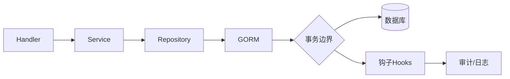

图1：应用-仓储-GORM-数据库的调用与事务边界

概念要点：
- 模型与迁移：结构体标签驱动表结构，迁移管理演进历史。
- 事务与隔离：显式事务（Begin/Commit/Rollback），按场景选择隔离级别。
- 查询性能：索引设计（前缀、联合、覆盖）、避免 N+1 查询、分页与排序。
- 钩子（Hooks）：Before/After Create/Update/Delete/Find，注意幂等与副作用。
- 连接池：合理配置 MaxOpen/MaxIdle/ConnMaxLifetime，避免泄露与抖动。

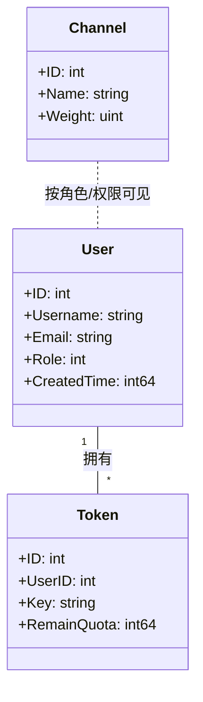

图2：核心实体关系（示意）

## 7.2 数据库连接与多库配置

术语速览：
- 主从/读写分离：写入走主库，查询优先走只读从库。
- 连接池：MaxOpen/MaxIdle/ConnMaxLifetime 避免耗尽与碎片化。
- 连接路由：按业务标签/强一致需求选择主/从/特定库。
- 健康检查：失败重试与熔断策略，隔离不健康实例。

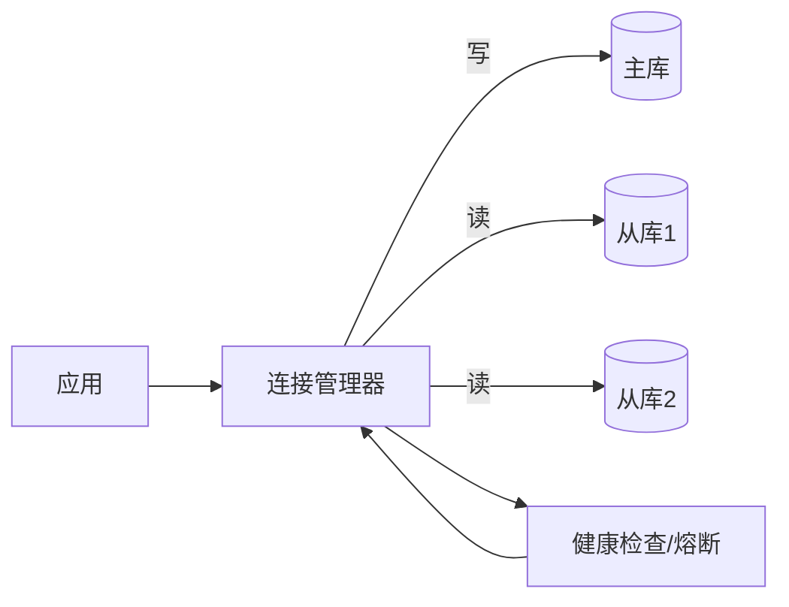

图3：多库连接与读写路由

- 支持 MySQL/PostgreSQL/SQLite，依据 `SQL_DSN` 前缀选择驱动；默认 SQLite。
- 建议启用 `PrepareStmt` 并合理配置连接池：`SetMaxIdleConns/SetMaxOpenConns/SetConnMaxLifetime`。

示例（片段）:

```go
sqlDB, _ := db.DB()
sqlDB.SetMaxIdleConns(100)
sqlDB.SetMaxOpenConns(1000)
sqlDB.SetConnMaxLifetime(time.Hour)
```

## 7.4 模型定义与标签

- 基础标签: 主键、自增、索引、唯一、默认值、时间戳、软删除。
- 关联标签: `foreignKey`、`references`、`constraint:OnDelete/OnUpdate`。

示例（片段）:

```go
type Token struct {
  Id     int    `gorm:"primaryKey"`
  UserId int    `gorm:"index;not null"`
  Key    string `gorm:"uniqueIndex;type:char(48)"`
}
```

## 7.6 数据库迁移与钩子

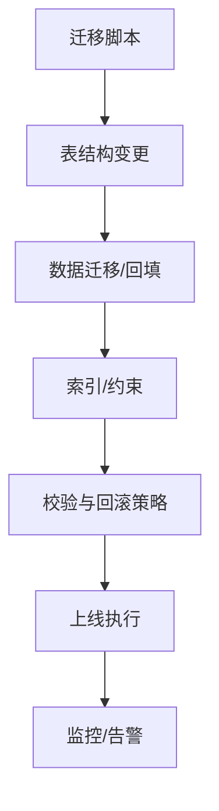

图4：迁移执行流水线

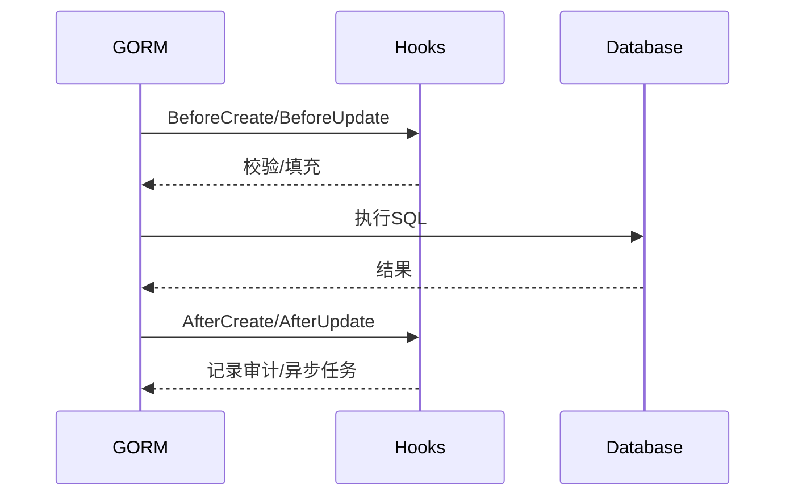

图5：GORM 钩子触发顺序（示意）

- 迁移: `AutoMigrate` 按模型分批执行；仅主节点运行，错误集中处理。
- 钩子: `BeforeCreate/AfterCreate/BeforeUpdate` 规范字段与触发动作（如加密密码、发送通知）。

## 7.1 数据库设计基础

### 7.1.1 关系型数据库设计原则

在企业级应用开发中，良好的数据库设计是系统稳定性和性能的基础。New API项目采用关系型数据库设计，遵循以下核心原则：

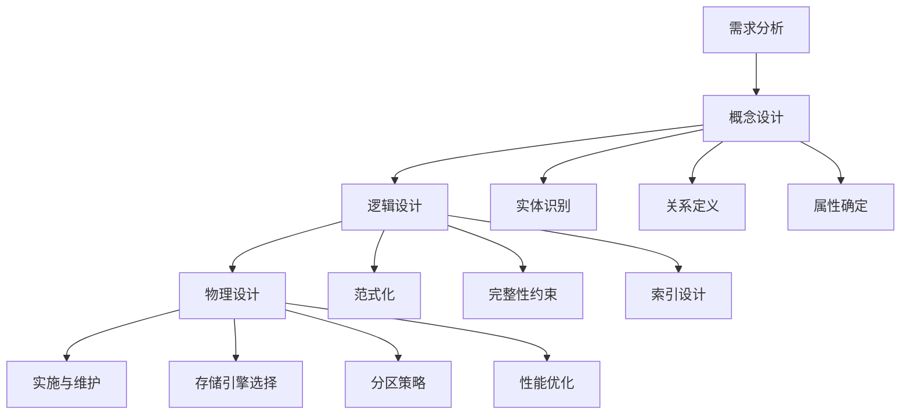

图6：数据库设计流程与关键决策点

#### 1. 范式化设计

**第一范式（1NF）**：确保每个字段都是原子性的，不可再分。

```sql
-- 错误示例：将多个值存储在一个字段中
CREATE TABLE bad_users (
    id INT PRIMARY KEY,
    name VARCHAR(100),
    emails TEXT -- 'email1@example.com,email2@example.com'
);

-- 正确示例：原子性字段
CREATE TABLE users (
    id INT PRIMARY KEY,
    username VARCHAR(50) UNIQUE NOT NULL,
    email VARCHAR(100) UNIQUE,
    display_name VARCHAR(100)
);
```

**第二范式（2NF）**：在满足1NF的基础上，非主键字段完全依赖于主键。

```sql
-- 违反2NF的示例：订单详情表中包含产品信息
CREATE TABLE bad_order_items (
    order_id INT,
    product_id INT,
    product_name VARCHAR(100), -- 依赖于product_id，不依赖于复合主键
    product_price DECIMAL(10,2), -- 依赖于product_id
    quantity INT,
    PRIMARY KEY (order_id, product_id)
);

-- 符合2NF的设计：分离产品信息
CREATE TABLE order_items (
    order_id INT,
    product_id INT,
    quantity INT,
    unit_price DECIMAL(10,2), -- 订单时的价格，依赖于复合主键
    PRIMARY KEY (order_id, product_id)
);

CREATE TABLE products (
    id INT PRIMARY KEY,
    name VARCHAR(100),
    price DECIMAL(10,2)
);
```

**第三范式（3NF）**：在满足2NF的基础上，非主键字段不依赖于其他非主键字段。

```sql
-- 违反3NF的示例：用户表中包含部门信息
CREATE TABLE bad_users (
    id INT PRIMARY KEY,
    username VARCHAR(50),
    department_id INT,
    department_name VARCHAR(100), -- 依赖于department_id，传递依赖
    department_location VARCHAR(100) -- 依赖于department_id
);

-- 符合3NF的设计：分离部门信息
CREATE TABLE users (
    id INT PRIMARY KEY,
    username VARCHAR(50),
    department_id INT,
    FOREIGN KEY (department_id) REFERENCES departments(id)
);

CREATE TABLE departments (
    id INT PRIMARY KEY,
    name VARCHAR(100),
    location VARCHAR(100)
);
```

#### 2. ACID特性保证

关系型数据库必须满足ACID特性，确保数据的可靠性：

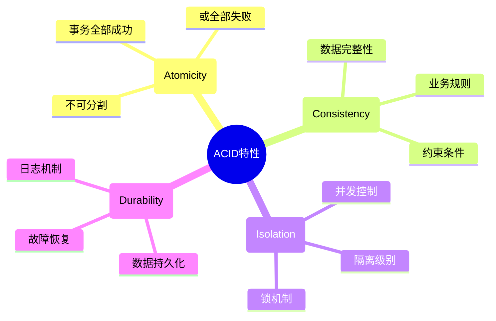

图7：ACID特性详解

- **原子性（Atomicity）**：事务中的所有操作要么全部成功，要么全部失败回滚
- **一致性（Consistency）**：事务执行前后，数据库都处于一致性状态
- **隔离性（Isolation）**：并发事务之间相互隔离，不会互相干扰
- **持久性（Durability）**：事务提交后，数据修改是永久性的

#### 3. 数据完整性约束

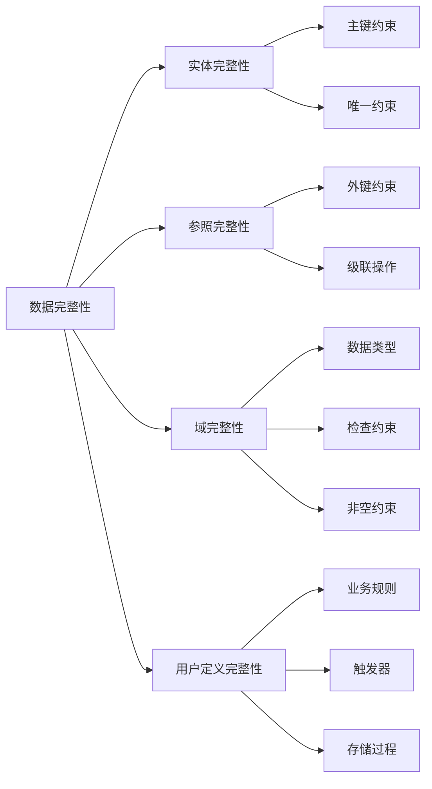

图8：数据完整性约束体系

- **实体完整性**：主键约束，确保每行数据的唯一性
- **参照完整性**：外键约束，维护表间关系的一致性
- **域完整性**：数据类型和检查约束，确保字段值的有效性
- **用户定义完整性**：业务规则约束，满足特定业务需求

#### 4. 索引设计策略

```sql
-- 主键索引（自动创建）
PRIMARY KEY (id)

-- 唯一索引
UNIQUE INDEX idx_username ON users(username)
UNIQUE INDEX idx_email ON users(email)

-- 复合索引（注意字段顺序）
INDEX idx_user_status_time ON users(status, created_time)
INDEX idx_user_role_group ON users(role, group_name)

-- 部分索引（条件索引）
INDEX idx_active_users ON users(username) WHERE status = 1
INDEX idx_recent_logs ON logs(created_at) WHERE created_at > '2024-01-01'

-- 覆盖索引（包含所需的所有列）
INDEX idx_user_cover ON users(username) INCLUDE (email, display_name)

-- 函数索引
INDEX idx_username_lower ON users(LOWER(username))
```

**索引设计原则：**

1. **选择性原则**：高选择性字段优先建索引
2. **最左前缀原则**：复合索引遵循最左前缀匹配
3. **覆盖索引原则**：尽量使用覆盖索引避免回表
4. **维护成本原则**：平衡查询性能和写入性能

### 7.1.2 New API项目数据库架构

#### 核心表结构设计

New API项目的数据库设计围绕以下核心实体：

1. **用户管理**：users表 - 管理系统用户信息和权限
2. **令牌管理**：tokens表 - 管理API访问令牌和配额
3. **渠道管理**：channels表 - 管理AI服务提供商渠道
4. **日志记录**：logs表 - 记录API调用和系统操作日志
5. **能力配置**：abilities表 - 配置模型能力和限制
6. **充值记录**：topups表 - 记录用户充值历史
7. **兑换码**：redemptions表 - 管理兑换码系统

#### 数据库架构层次

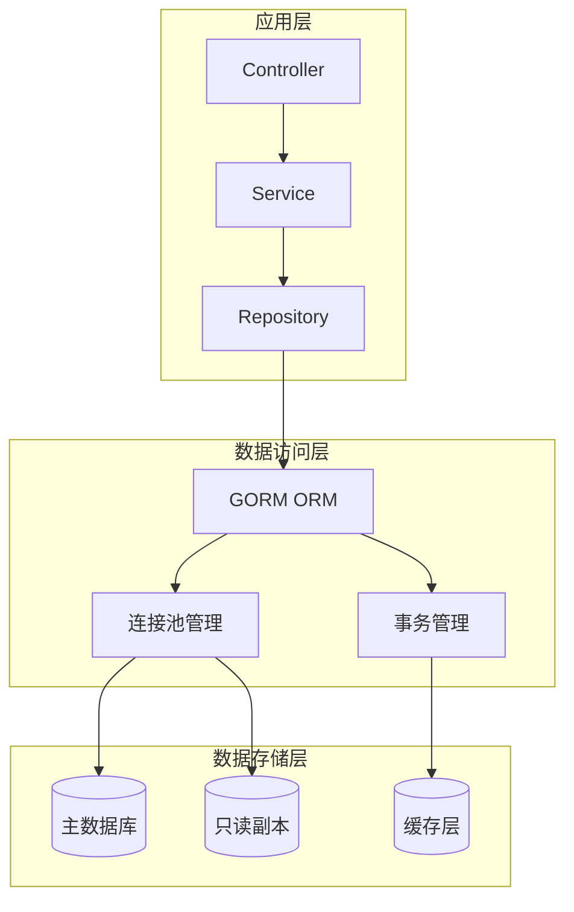

图9：New API数据库架构分层设计

#### 表间关系设计原则

1. **用户中心化**：以用户为核心，其他实体通过外键关联
2. **权限分离**：用户权限通过角色字段控制，支持多级权限
3. **审计追踪**：重要操作通过日志表记录，支持审计和分析
4. **配额管理**：用户和令牌都有独立的配额系统
5. **软删除**：关键数据支持软删除，保证数据完整性

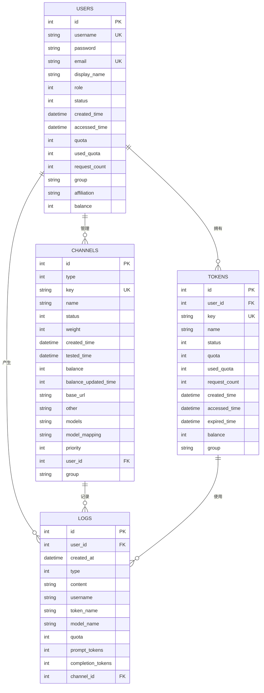

## 7.2 数据库连接与多库配置

### 7.2.1 连接池管理与配置

数据库连接池是企业级应用中的关键组件，它负责管理数据库连接的创建、复用和销毁，有效控制资源使用并提升性能。

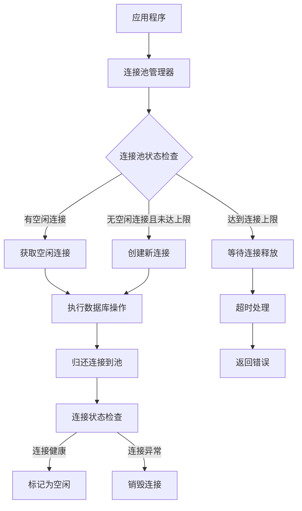
图10：数据库连接池管理流程

#### 连接池核心参数

```go
// 连接池配置参数详解
type ConnectionPoolConfig struct {
    // 最大空闲连接数：池中保持的空闲连接数量上限
    MaxIdleConns int `json:"max_idle_conns" default:"10"`
    
    // 最大打开连接数：同时打开的连接总数上限（包括使用中和空闲的）
    MaxOpenConns int `json:"max_open_conns" default:"100"`
    
    // 连接最大生存时间：连接被重用的最长时间
    ConnMaxLifetime time.Duration `json:"conn_max_lifetime" default:"1h"`
    
    // 连接最大空闲时间：连接在池中空闲的最长时间
    ConnMaxIdleTime time.Duration `json:"conn_max_idle_time" default:"10m"`
    
    // 连接超时配置
    ConnectTimeout time.Duration `json:"connect_timeout" default:"10s"`
    ReadTimeout    time.Duration `json:"read_timeout" default:"30s"`
    WriteTimeout   time.Duration `json:"write_timeout" default:"30s"`
}

// 连接池性能监控
type PoolStats struct {
    MaxOpenConnections int           // 最大连接数
    OpenConnections    int           // 当前打开连接数
    InUse             int           // 使用中连接数
    Idle              int           // 空闲连接数
    WaitCount         int64         // 等待连接的总次数
    WaitDuration      time.Duration // 等待连接的总时间
    MaxIdleClosed     int64         // 因空闲超时关闭的连接数
    MaxLifetimeClosed int64         // 因生存时间到期关闭的连接数
}

// 获取连接池统计信息
func (db *DatabaseManager) GetPoolStats() *PoolStats {
    sqlDB, err := db.DB.DB()
    if err != nil {
        return nil
    }
    
    stats := sqlDB.Stats()
    return &PoolStats{
        MaxOpenConnections: stats.MaxOpenConnections,
        OpenConnections:    stats.OpenConnections,
        InUse:             stats.InUse,
        Idle:              stats.Idle,
        WaitCount:         stats.WaitCount,
        WaitDuration:      stats.WaitDuration,
        MaxIdleClosed:     stats.MaxIdleClosed,
        MaxLifetimeClosed: stats.MaxLifetimeClosed,
    }
}
```

### 7.2.2 多数据库配置与管理

在企业级应用中，通常需要连接多个数据库实例来实现读写分离、分库分表或多租户架构。

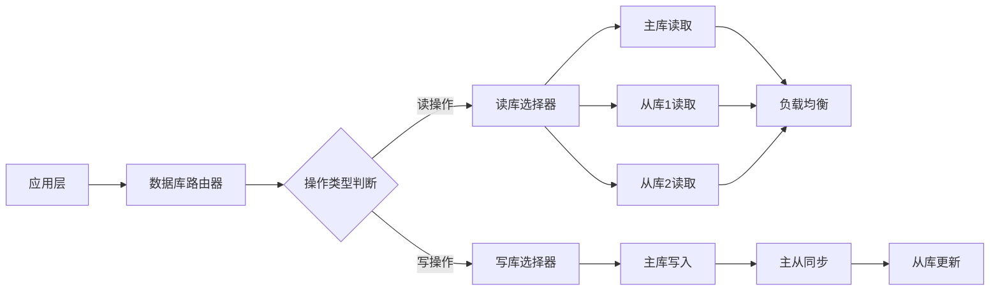
图11：多数据库读写分离架构

#### 多库配置实现

```go
// 多数据库管理器
type MultiDatabaseManager struct {
    Master *gorm.DB              // 主库（写）
    Slaves []*gorm.DB            // 从库（读）
    Config *MultiDBConfig        // 配置
    Router *DatabaseRouter       // 路由器
    Health *HealthChecker        // 健康检查
}

// 多库配置
type MultiDBConfig struct {
    Master SlaveConfig   `json:"master"`   // 主库配置
    Slaves []SlaveConfig `json:"slaves"`   // 从库配置
    
    // 路由策略
    ReadStrategy  string `json:"read_strategy"`  // round_robin, random, weight
    WriteStrategy string `json:"write_strategy"` // master_only, master_slave
    
    // 故障转移
    FailoverEnabled     bool          `json:"failover_enabled"`
    HealthCheckInterval time.Duration `json:"health_check_interval"`
    MaxRetries         int           `json:"max_retries"`
    RetryInterval      time.Duration `json:"retry_interval"`
}

type SlaveConfig struct {
    Name     string         `json:"name"`
    DSN      string         `json:"dsn"`
    Weight   int            `json:"weight"`   // 权重（用于加权轮询）
    ReadOnly bool           `json:"read_only"` // 是否只读
    Config   DatabaseConfig `json:"config"`
}

// 初始化多数据库管理器
func NewMultiDatabaseManager(config *MultiDBConfig) (*MultiDatabaseManager, error) {
    manager := &MultiDatabaseManager{
        Config: config,
        Router: NewDatabaseRouter(config.ReadStrategy),
        Health: NewHealthChecker(config.HealthCheckInterval),
    }
    
    // 初始化主库
    masterDB, err := initDatabase(config.Master.DSN, config.Master.Config)
    if err != nil {
        return nil, fmt.Errorf("初始化主库失败: %v", err)
    }
    manager.Master = masterDB
    
    // 初始化从库
    for _, slaveConfig := range config.Slaves {
        slaveDB, err := initDatabase(slaveConfig.DSN, slaveConfig.Config)
        if err != nil {
            log.Printf("初始化从库 %s 失败: %v", slaveConfig.Name, err)
            continue
        }
        manager.Slaves = append(manager.Slaves, slaveDB)
        
        // 注册到路由器
        manager.Router.AddSlave(slaveDB, slaveConfig.Weight)
    }
    
    // 启动健康检查
    if config.FailoverEnabled {
        manager.Health.Start(manager)
    }
    
    return manager, nil
}

// 数据库路由器
type DatabaseRouter struct {
    strategy string
    slaves   []*SlaveNode
    current  int // 用于轮询
    mutex    sync.RWMutex
}

type SlaveNode struct {
    DB       *gorm.DB
    Weight   int
    Healthy  bool
    LastUsed time.Time
}

// 获取读库
func (r *DatabaseRouter) GetReadDB() *gorm.DB {
    r.mutex.RLock()
    defer r.mutex.RUnlock()
    
    healthySlaves := make([]*SlaveNode, 0)
    for _, slave := range r.slaves {
        if slave.Healthy {
            healthySlaves = append(healthySlaves, slave)
        }
    }
    
    if len(healthySlaves) == 0 {
        return nil // 无可用从库
    }
    
    switch r.strategy {
    case "round_robin":
        return r.roundRobin(healthySlaves)
    case "random":
        return r.random(healthySlaves)
    case "weight":
        return r.weighted(healthySlaves)
    default:
        return healthySlaves[0].DB
    }
}

// 轮询策略
func (r *DatabaseRouter) roundRobin(slaves []*SlaveNode) *gorm.DB {
    if len(slaves) == 0 {
        return nil
    }
    
    r.current = (r.current + 1) % len(slaves)
    return slaves[r.current].DB
}

// 随机策略
func (r *DatabaseRouter) random(slaves []*SlaveNode) *gorm.DB {
    if len(slaves) == 0 {
        return nil
    }
    
    index := rand.Intn(len(slaves))
    return slaves[index].DB
}

// 加权策略
func (r *DatabaseRouter) weighted(slaves []*SlaveNode) *gorm.DB {
    if len(slaves) == 0 {
        return nil
    }
    
    totalWeight := 0
    for _, slave := range slaves {
        totalWeight += slave.Weight
    }
    
    if totalWeight == 0 {
        return slaves[0].DB
    }
    
    random := rand.Intn(totalWeight)
    for _, slave := range slaves {
        random -= slave.Weight
        if random < 0 {
            return slave.DB
        }
    }
    
    return slaves[0].DB
}
```

### 7.2.3 故障转移与健康检查

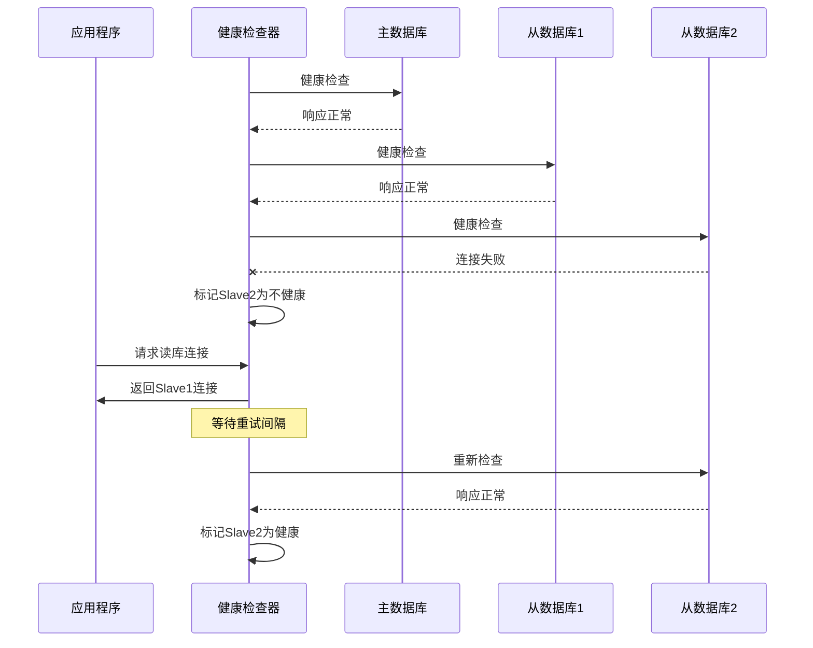
图12：数据库故障转移时序图

#### 健康检查实现

```go
// 健康检查器
type HealthChecker struct {
    interval time.Duration
    running  bool
    stopCh   chan struct{}
    mutex    sync.RWMutex
}

func NewHealthChecker(interval time.Duration) *HealthChecker {
    return &HealthChecker{
        interval: interval,
        stopCh:   make(chan struct{}),
    }
}

// 启动健康检查
func (hc *HealthChecker) Start(manager *MultiDatabaseManager) {
    hc.mutex.Lock()
    defer hc.mutex.Unlock()
    
    if hc.running {
        return
    }
    
    hc.running = true
    go hc.run(manager)
}

// 健康检查主循环
func (hc *HealthChecker) run(manager *MultiDatabaseManager) {
    ticker := time.NewTicker(hc.interval)
    defer ticker.Stop()
    
    for {
        select {
        case <-ticker.C:
            hc.checkHealth(manager)
        case <-hc.stopCh:
            return
        }
    }
}

// 执行健康检查
func (hc *HealthChecker) checkHealth(manager *MultiDatabaseManager) {
    // 检查主库
    if err := hc.pingDatabase(manager.Master); err != nil {
        log.Printf("主库健康检查失败: %v", err)
        // 主库故障处理逻辑
        hc.handleMasterFailure(manager)
    }
    
    // 检查从库
    for i, slave := range manager.Slaves {
        if err := hc.pingDatabase(slave); err != nil {
            log.Printf("从库 %d 健康检查失败: %v", i, err)
            manager.Router.MarkUnhealthy(i)
        } else {
            manager.Router.MarkHealthy(i)
        }
    }
}

// 数据库连通性检查
func (hc *HealthChecker) pingDatabase(db *gorm.DB) error {
    sqlDB, err := db.DB()
    if err != nil {
        return err
    }
    
    ctx, cancel := context.WithTimeout(context.Background(), 5*time.Second)
    defer cancel()
    
    return sqlDB.PingContext(ctx)
}

// 主库故障处理
func (hc *HealthChecker) handleMasterFailure(manager *MultiDatabaseManager) {
    // 实现主库故障转移逻辑
    // 1. 选择一个健康的从库作为新主库
    // 2. 更新路由配置
    // 3. 通知应用层
    log.Println("主库故障，启动故障转移流程")
}
```

## 7.3 GORM框架入门

### 7.3.1 GORM简介与特性

GORM是Go语言最受欢迎的ORM（Object-Relational Mapping）库，它将面向对象编程语言中的对象与关系数据库中的数据表建立映射关系，使开发者能够用面向对象的方式操作数据库。

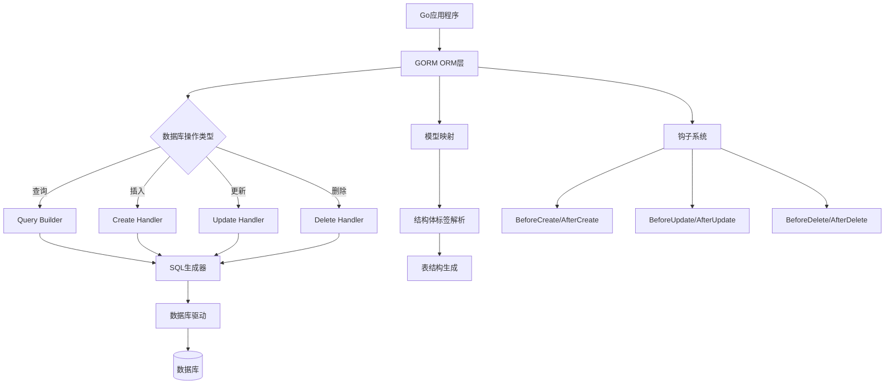
图13：GORM架构与工作流程

#### 核心特性详解

**1. 全功能ORM支持**
- **关联管理**：自动处理表间关系（一对一、一对多、多对多）
- **钩子函数**：在数据操作的生命周期中插入自定义逻辑
- **事务支持**：提供完整的事务管理功能
- **自动迁移**：根据模型结构自动创建和更新数据库表

**2. 多数据库兼容**
```go
// 支持的数据库类型
const (
    MySQL      = "mysql"      // MySQL 5.7+, 8.0+
    PostgreSQL = "postgres"   // PostgreSQL 9.6+
    SQLite     = "sqlite"     // SQLite 3.8.3+
    SQLServer  = "sqlserver"  // SQL Server 2016+
)

// 数据库特性支持矩阵
type DatabaseFeatures struct {
    AutoIncrement bool // 自增主键
    ForeignKey    bool // 外键约束
    Index         bool // 索引支持
    Transaction   bool // 事务支持
    JSON          bool // JSON字段类型
    FullText      bool // 全文搜索
}

var SupportMatrix = map[string]DatabaseFeatures{
    MySQL: {
        AutoIncrement: true,
        ForeignKey:    true,
        Index:         true,
        Transaction:   true,
        JSON:          true,  // MySQL 5.7+
        FullText:      true,
    },
    PostgreSQL: {
        AutoIncrement: true,
        ForeignKey:    true,
        Index:         true,
        Transaction:   true,
        JSON:          true,  // JSONB支持
        FullText:      true,
    },
    SQLite: {
        AutoIncrement: true,
        ForeignKey:    true,  // 需要启用
        Index:         true,
        Transaction:   true,
        JSON:          true,  // SQLite 3.38+
        FullText:      true,  // FTS扩展
    },
}
```

**3. 灵活的查询构建器**
```go
// 链式查询示例
type QueryBuilder struct {
    db *gorm.DB
}

// 复杂查询构建
func (qb *QueryBuilder) BuildComplexQuery() *gorm.DB {
    return qb.db.
        Select("users.id, users.username, COUNT(tokens.id) as token_count").
        Table("users").
        Joins("LEFT JOIN tokens ON users.id = tokens.user_id").
        Where("users.status = ?", 1).
        Group("users.id").
        Having("token_count > ?", 0).
        Order("users.created_time DESC").
        Limit(10).
        Offset(0)
}

// 动态查询条件
func (qb *QueryBuilder) DynamicQuery(conditions map[string]interface{}) *gorm.DB {
    query := qb.db.Model(&User{})
    
    for field, value := range conditions {
        switch field {
        case "username":
            if v, ok := value.(string); ok && v != "" {
                query = query.Where("username LIKE ?", "%"+v+"%")
            }
        case "status":
            if v, ok := value.(int); ok {
                query = query.Where("status = ?", v)
            }
        case "created_after":
            if v, ok := value.(time.Time); ok {
                query = query.Where("created_time > ?", v.Unix())
            }
        }
    }
    
    return query
}
```

#### 安装和依赖管理

```bash
# 安装GORM核心库
go get -u gorm.io/gorm

# 安装数据库驱动
go get -u gorm.io/driver/mysql      # MySQL驱动
go get -u gorm.io/driver/postgres   # PostgreSQL驱动
go get -u gorm.io/driver/sqlite     # SQLite驱动
go get -u gorm.io/driver/sqlserver  # SQL Server驱动

# 可选插件
go get -u gorm.io/plugin/dbresolver  # 读写分离插件
go get -u gorm.io/plugin/prometheus  # Prometheus监控插件
go get -u gorm.io/plugin/opentelemetry # OpenTelemetry追踪插件
```

### 7.3.2 GORM初始化与配置

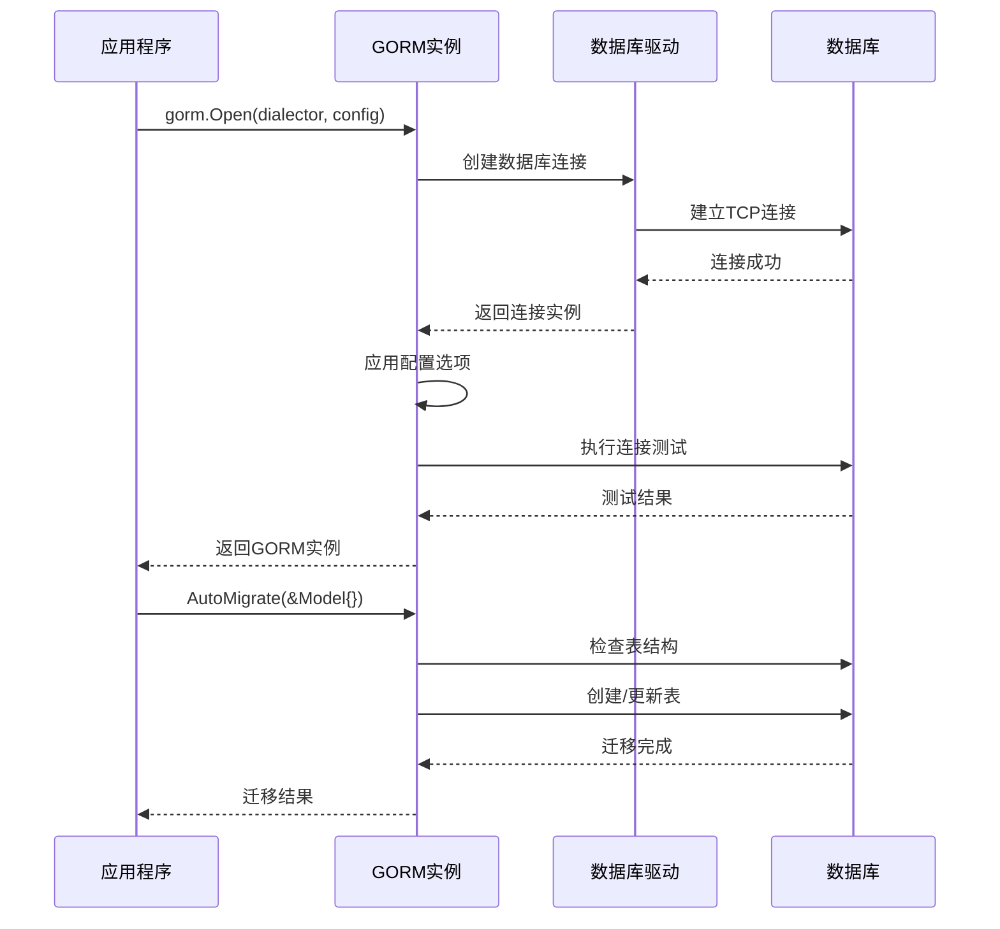
图14：GORM初始化时序图

#### GORM配置选项详解

```go
// GORM完整配置示例
func InitGORM() (*gorm.DB, error) {
    // 数据库连接字符串
    dsn := "user:password@tcp(localhost:3306)/dbname?charset=utf8mb4&parseTime=True&loc=Local"
    
    // GORM配置
    config := &gorm.Config{
        // 命名策略
        NamingStrategy: schema.NamingStrategy{
            TablePrefix:   "t_",    // 表名前缀
            SingularTable: true,     // 使用单数表名
            NameReplacer:  strings.NewReplacer("CID", "Cid"), // 名称替换
        },
        
        // 日志配置
        Logger: logger.New(
            log.New(os.Stdout, "\r\n", log.LstdFlags), // io writer
            logger.Config{
                SlowThreshold:             time.Second,   // 慢查询阈值
                LogLevel:                  logger.Silent, // 日志级别
                IgnoreRecordNotFoundError: true,          // 忽略ErrRecordNotFound错误
                Colorful:                  false,         // 禁用彩色打印
            },
        ),
        
        // 性能配置
        PrepareStmt:                              true,  // 预编译语句
        DisableForeignKeyConstraintWhenMigrating: true,  // 迁移时禁用外键约束
        IgnoreRelationshipsWhenMigrating:        false, // 迁移时忽略关联
        
        // 插件配置
        Plugins: map[string]gorm.Plugin{
            "prometheus": prometheus.New(prometheus.Config{
                DBName:          "db1",
                RefreshInterval: 15,
                MetricsCollector: []prometheus.MetricsCollector{
                    &prometheus.MySQL{
                        VariableNames: []string{"Threads_running"},
                    },
                },
            }),
        },
        
        // 连接池配置（通过sql.DB设置）
        ConnPool: nil, // 自定义连接池
    }
    
    // 创建GORM实例
    db, err := gorm.Open(mysql.Open(dsn), config)
    if err != nil {
        return nil, fmt.Errorf("连接数据库失败: %v", err)
    }
    
    // 获取底层sql.DB进行连接池配置
    sqlDB, err := db.DB()
    if err != nil {
        return nil, fmt.Errorf("获取sql.DB失败: %v", err)
    }
    
    // 连接池配置
    sqlDB.SetMaxIdleConns(10)                  // 最大空闲连接数
    sqlDB.SetMaxOpenConns(100)                 // 最大打开连接数
    sqlDB.SetConnMaxLifetime(time.Hour)        // 连接最大生存时间
    sqlDB.SetConnMaxIdleTime(10 * time.Minute) // 连接最大空闲时间
    
    return db, nil
}
```

### 7.3.3 基础CRUD操作

#### 创建记录（Create）

```go
// 单条记录创建
func CreateUser(db *gorm.DB) error {
    user := &User{
        Username:    "john_doe",
        Email:      "john@example.com",
        Role:       RoleCommonUser,
        Status:     UserStatusEnabled,
        CreatedTime: int(time.Now().Unix()),
    }
    
    // 创建记录
    result := db.Create(user)
    if result.Error != nil {
        return fmt.Errorf("创建用户失败: %v", result.Error)
    }
    
    fmt.Printf("创建用户成功，ID: %d，影响行数: %d\n", user.ID, result.RowsAffected)
    return nil
}

// 批量创建
func CreateUsers(db *gorm.DB) error {
    users := []*User{
        {Username: "user1", Email: "user1@example.com"},
        {Username: "user2", Email: "user2@example.com"},
        {Username: "user3", Email: "user3@example.com"},
    }
    
    // 批量创建（分批处理，每批100条）
    result := db.CreateInBatches(users, 100)
    if result.Error != nil {
        return fmt.Errorf("批量创建用户失败: %v", result.Error)
    }
    
    fmt.Printf("批量创建成功，影响行数: %d\n", result.RowsAffected)
    return nil
}

// 创建时忽略冲突
func CreateOrIgnore(db *gorm.DB) error {
    user := &User{Username: "existing_user"}
    
    // 忽略重复键错误
    result := db.Clauses(clause.OnConflict{DoNothing: true}).Create(user)
    return result.Error
}

// 创建时更新冲突记录
func CreateOrUpdate(db *gorm.DB) error {
    user := &User{
        Username: "john_doe",
        Email:   "newemail@example.com",
    }
    
    // 冲突时更新指定字段
    result := db.Clauses(clause.OnConflict{
        Columns:   []clause.Column{{Name: "username"}},
        DoUpdates: clause.AssignmentColumns([]string{"email", "updated_time"}),
    }).Create(user)
    
    return result.Error
}
```

#### 查询记录（Read）

```go
// 基础查询
func QueryUsers(db *gorm.DB) {
    var user User
    var users []User
    
    // 根据主键查询
    db.First(&user, 1) // SELECT * FROM users WHERE id = 1 LIMIT 1;
    
    // 根据条件查询第一条记录
    db.Where("username = ?", "john_doe").First(&user)
    
    // 查询所有记录
    db.Find(&users) // SELECT * FROM users;
    
    // 条件查询
    db.Where("status = ? AND role > ?", UserStatusEnabled, RoleCommonUser).Find(&users)
    
    // 排序查询
    db.Order("created_time DESC").Limit(10).Find(&users)
    
    // 分页查询
    var total int64
    db.Model(&User{}).Where("status = ?", UserStatusEnabled).Count(&total)
    db.Where("status = ?", UserStatusEnabled).Offset(0).Limit(20).Find(&users)
}

// 高级查询
func AdvancedQuery(db *gorm.DB) {
    var users []User
    var result []map[string]interface{}
    
    // 选择特定字段
    db.Select("id, username, email").Where("status = ?", 1).Find(&users)
    
    // 原生SQL查询
    db.Raw("SELECT id, username FROM users WHERE status = ?", 1).Scan(&result)
    
    // 子查询
    subQuery := db.Model(&Token{}).Select("user_id").Where("status = ?", 1)
    db.Where("id IN (?)", subQuery).Find(&users)
    
    // 联表查询
    db.Joins("LEFT JOIN tokens ON users.id = tokens.user_id").
        Where("tokens.status = ?", 1).
        Find(&users)
    
    // 预加载关联
    db.Preload("Tokens").Preload("Channels").Find(&users)
    
    // 条件预加载
    db.Preload("Tokens", "status = ?", 1).Find(&users)
}
```

#### 更新记录（Update）

```go
// 更新操作
func UpdateUser(db *gorm.DB) error {
    var user User
    
    // 查询记录
    if err := db.First(&user, 1).Error; err != nil {
        return err
    }
    
    // 更新单个字段
    db.Model(&user).Update("email", "newemail@example.com")
    
    // 更新多个字段（使用结构体）
    db.Model(&user).Updates(User{Email: "new@example.com", Status: UserStatusEnabled})
    
    // 更新多个字段（使用map）
    db.Model(&user).Updates(map[string]interface{}{
        "email":        "new@example.com",
        "status":       UserStatusEnabled,
        "updated_time": time.Now().Unix(),
    })
    
    // 批量更新
    db.Model(&User{}).Where("status = ?", UserStatusDisabled).Update("status", UserStatusEnabled)
    
    // 使用SQL表达式更新
    db.Model(&user).Update("quota", gorm.Expr("quota + ?", 1000))
    
    return nil
}

// 条件更新
func ConditionalUpdate(db *gorm.DB) error {
    // 只更新非零值字段
    user := User{Email: "new@example.com"} // Status为0不会被更新
    db.Model(&User{}).Where("id = ?", 1).Updates(user)
    
    // 强制更新零值字段
    db.Model(&User{}).Where("id = ?", 1).Select("status").Updates(User{Status: 0})
    
    // 忽略特定字段
    db.Model(&User{}).Where("id = ?", 1).Omit("created_time").Updates(user)
    
    return nil
}
```

#### 删除记录（Delete）

```go
// 删除操作
func DeleteUser(db *gorm.DB) error {
    var user User
    
    // 根据主键删除
    db.Delete(&User{}, 1) // DELETE FROM users WHERE id = 1;
    
    // 根据条件删除
    db.Where("status = ?", UserStatusDisabled).Delete(&User{})
    
    // 软删除（如果模型包含gorm.DeletedAt字段）
    db.Delete(&user, 1) // UPDATE users SET deleted_at = NOW() WHERE id = 1;
    
    // 永久删除
    db.Unscoped().Delete(&user, 1) // DELETE FROM users WHERE id = 1;
    
    // 批量删除
    db.Where("created_time < ?", time.Now().AddDate(0, -6, 0).Unix()).Delete(&User{})
    
    return nil
}
```

### 7.3.4 数据库连接与配置

#### 连接配置

```go
// common/database.go
package common

import (
    "fmt"
    "log"
    "os"
    "time"
    
    "gorm.io/driver/mysql"
    "gorm.io/driver/postgres"
    "gorm.io/driver/sqlite"
    "gorm.io/gorm"
    "gorm.io/gorm/logger"
    "gorm.io/gorm/schema"
)

var DB *gorm.DB

// 数据库配置
type DatabaseConfig struct {
    Type     string `json:"type"`     // mysql, postgres, sqlite
    Host     string `json:"host"`
    Port     int    `json:"port"`
    Username string `json:"username"`
    Password string `json:"password"`
    Database string `json:"database"`
    Charset  string `json:"charset"`
    
    // 连接池配置
    MaxIdleConns    int           `json:"max_idle_conns"`
    MaxOpenConns    int           `json:"max_open_conns"`
    ConnMaxLifetime time.Duration `json:"conn_max_lifetime"`
    ConnMaxIdleTime time.Duration `json:"conn_max_idle_time"`
    
    // GORM配置
    LogLevel                  logger.LogLevel `json:"log_level"`
    SlowThreshold            time.Duration    `json:"slow_threshold"`
    IgnoreRecordNotFoundError bool            `json:"ignore_record_not_found_error"`
    DisableForeignKeyConstraintWhenMigrating bool `json:"disable_foreign_key_constraint_when_migrating"`
}

// 默认数据库配置
func DefaultDatabaseConfig() DatabaseConfig {
    return DatabaseConfig{
        Type:     "sqlite",
        Host:     "localhost",
        Port:     3306,
        Charset:  "utf8mb4",
        
        MaxIdleConns:    10,
        MaxOpenConns:    100,
        ConnMaxLifetime: time.Hour,
        ConnMaxIdleTime: 10 * time.Minute,
        
        LogLevel:                  logger.Info,
        SlowThreshold:            200 * time.Millisecond,
        IgnoreRecordNotFoundError: true,
        DisableForeignKeyConstraintWhenMigrating: true,
    }
}

// 初始化数据库连接
func InitDB(config DatabaseConfig) error {
    var dialector gorm.Dialector
    var err error
    
    // 根据数据库类型选择驱动
    switch config.Type {
    case "mysql":
        dsn := fmt.Sprintf("%s:%s@tcp(%s:%d)/%s?charset=%s&parseTime=True&loc=Local",
            config.Username, config.Password, config.Host, config.Port, config.Database, config.Charset)
        dialector = mysql.Open(dsn)
        
    case "postgres":
        dsn := fmt.Sprintf("host=%s user=%s password=%s dbname=%s port=%d sslmode=disable TimeZone=Asia/Shanghai",
            config.Host, config.Username, config.Password, config.Database, config.Port)
        dialector = postgres.Open(dsn)
        
    case "sqlite":
        dialector = sqlite.Open(config.Database)
        
    default:
        return fmt.Errorf("不支持的数据库类型: %s", config.Type)
    }
    
    // GORM配置
    gormConfig := &gorm.Config{
        NamingStrategy: schema.NamingStrategy{
            SingularTable: true, // 使用单数表名
        },
        Logger: logger.New(
            log.New(os.Stdout, "\r\n", log.LstdFlags),
            logger.Config{
                SlowThreshold:             config.SlowThreshold,
                LogLevel:                  config.LogLevel,
                IgnoreRecordNotFoundError: config.IgnoreRecordNotFoundError,
                Colorful:                  true,
            },
        ),
        DisableForeignKeyConstraintWhenMigrating: config.DisableForeignKeyConstraintWhenMigrating,
    }
    
    // 建立数据库连接
    DB, err = gorm.Open(dialector, gormConfig)
    if err != nil {
        return fmt.Errorf("连接数据库失败: %v", err)
    }
    
    // 获取底层sql.DB对象进行连接池配置
    sqlDB, err := DB.DB()
    if err != nil {
        return fmt.Errorf("获取数据库连接失败: %v", err)
    }
    
    // 配置连接池
    sqlDB.SetMaxIdleConns(config.MaxIdleConns)
    sqlDB.SetMaxOpenConns(config.MaxOpenConns)
    sqlDB.SetConnMaxLifetime(config.ConnMaxLifetime)
    sqlDB.SetConnMaxIdleTime(config.ConnMaxIdleTime)
    
    // 测试连接
    if err := sqlDB.Ping(); err != nil {
        return fmt.Errorf("数据库连接测试失败: %v", err)
    }
    
    SysLog("数据库连接成功")
    return nil
}

// 关闭数据库连接
func CloseDB() error {
    if DB != nil {
        sqlDB, err := DB.DB()
        if err != nil {
            return err
        }
        return sqlDB.Close()
    }
    return nil
}

// 获取数据库连接统计信息
func GetDBStats() map[string]interface{} {
    if DB == nil {
        return nil
    }
    
    sqlDB, err := DB.DB()
    if err != nil {
        return nil
    }
    
    stats := sqlDB.Stats()
    return map[string]interface{}{
        "max_open_connections": stats.MaxOpenConnections,
        "open_connections":     stats.OpenConnections,
        "in_use":              stats.InUse,
        "idle":                stats.Idle,
        "wait_count":          stats.WaitCount,
        "wait_duration":       stats.WaitDuration.String(),
        "max_idle_closed":     stats.MaxIdleClosed,
        "max_idle_time_closed": stats.MaxIdleTimeClosed,
        "max_lifetime_closed": stats.MaxLifetimeClosed,
    }
}
```

## 7.4 模型定义与标签

### 7.4.1 基础模型设计

#### 模型设计原则

在企业级应用开发中，良好的模型设计是数据层稳定性和可维护性的基础。以下是模型设计的核心原则：

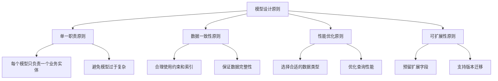

图15：模型设计原则架构图

#### 基础模型定义

```go
// model/base.go
package model

import (
    "time"
    "gorm.io/gorm"
)

// 基础模型（使用标准时间）
type BaseModel struct {
    ID        int            `gorm:"primaryKey;autoIncrement;comment:主键ID" json:"id"`
    CreatedAt time.Time      `gorm:"index;comment:创建时间" json:"created_at"`
    UpdatedAt time.Time      `gorm:"comment:更新时间" json:"updated_at"`
    DeletedAt gorm.DeletedAt `gorm:"index;comment:删除时间" json:"-"`
}

// 时间戳模型（使用Unix时间戳，适用于高性能场景）
type TimestampModel struct {
    ID          int `gorm:"primaryKey;autoIncrement;comment:主键ID" json:"id"`
    CreatedTime int `gorm:"bigint;index;comment:创建时间戳" json:"created_time"`
    UpdatedTime int `gorm:"bigint;comment:更新时间戳" json:"updated_time"`
}

// 审计模型（包含创建者和更新者信息）
type AuditModel struct {
    ID          int            `gorm:"primaryKey;autoIncrement;comment:主键ID" json:"id"`
    CreatedAt   time.Time      `gorm:"index;comment:创建时间" json:"created_at"`
    UpdatedAt   time.Time      `gorm:"comment:更新时间" json:"updated_at"`
    DeletedAt   gorm.DeletedAt `gorm:"index;comment:删除时间" json:"-"`
    CreatedBy   int            `gorm:"index;comment:创建者ID" json:"created_by"`
    UpdatedBy   int            `gorm:"comment:更新者ID" json:"updated_by"`
}

// BeforeCreate 钩子函数
func (m *TimestampModel) BeforeCreate(tx *gorm.DB) error {
    now := int(time.Now().Unix())
    m.CreatedTime = now
    m.UpdatedTime = now
    return nil
}

// BeforeUpdate 钩子函数
func (m *TimestampModel) BeforeUpdate(tx *gorm.DB) error {
    m.UpdatedTime = int(time.Now().Unix())
    return nil
}
```

### 7.4.2 GORM标签系统

#### 标签分类与作用域

GORM标签系统提供了丰富的配置选项，可以分为以下几个类别：

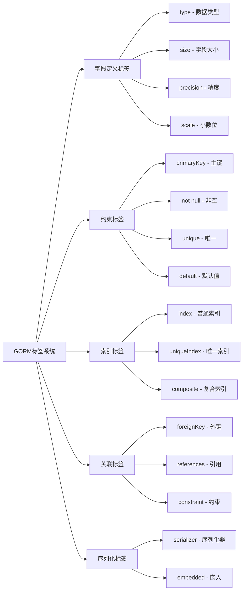

图16：GORM标签系统分类图

#### 完整标签示例

```go
// 完整的标签示例
type User struct {
    // 主键配置
    ID int `gorm:"primaryKey;autoIncrement;comment:用户ID" json:"id"`
    
    // 字符串字段配置
    Username string `gorm:"type:varchar(50);uniqueIndex:idx_username;not null;comment:用户名" json:"username"`
    Password string `gorm:"type:varchar(255);not null;comment:密码哈希" json:"-"` // json:"-" 表示不序列化
    Email    string `gorm:"type:varchar(100);uniqueIndex:idx_email;comment:邮箱地址" json:"email"`
    
    // 数值字段配置
    Role   int `gorm:"type:int;default:1;index:idx_role;comment:用户角色" json:"role"`
    Status int `gorm:"type:int;default:1;index:idx_status;comment:用户状态" json:"status"`
    Quota  int `gorm:"type:int;default:0;comment:用户配额" json:"quota"`
    
    // 时间字段配置
    CreatedTime  int `gorm:"bigint;index:idx_created;comment:创建时间" json:"created_time"`
    AccessedTime int `gorm:"bigint;comment:最后访问时间" json:"accessed_time"`
    
    // 软删除
    DeletedAt gorm.DeletedAt `gorm:"index:idx_deleted" json:"-"`
    
    // JSON字段（MySQL 5.7+）
    Metadata string `gorm:"type:json;comment:元数据" json:"metadata"`
    
    // 复合索引字段
    Group    string `gorm:"type:varchar(50);index:idx_group_status,priority:1;comment:用户组" json:"group"`
    // Status字段也参与复合索引
    // Status int `gorm:"type:int;default:1;index:idx_group_status,priority:2;comment:用户状态" json:"status"`
    
    // 关联字段
    Tokens   []Token   `gorm:"foreignKey:UserID;constraint:OnDelete:CASCADE" json:"tokens,omitempty"`
    Channels []Channel `gorm:"foreignKey:UserID;constraint:OnDelete:SET NULL" json:"channels,omitempty"`
    Profile  *Profile  `gorm:"foreignKey:UserID;constraint:OnDelete:CASCADE" json:"profile,omitempty"`
}

// 表名配置
func (User) TableName() string {
    return "users"
}

// 复合索引配置（另一种方式）
func (User) Indexes() []gorm.Index {
    return []gorm.Index{
        {
            Name:   "idx_user_role_status",
            Fields: []string{"role", "status"},
        },
        {
            Name:   "idx_user_created_group",
            Fields: []string{"created_time", "group"},
        },
    }
}
```

#### 高级标签配置示例

```go
// 嵌入结构体示例
type Address struct {
    Country  string `gorm:"type:varchar(50);comment:国家" json:"country"`
    Province string `gorm:"type:varchar(50);comment:省份" json:"province"`
    City     string `gorm:"type:varchar(50);comment:城市" json:"city"`
    Street   string `gorm:"type:varchar(200);comment:街道" json:"street"`
}

type Company struct {
    ID   int    `gorm:"primaryKey;autoIncrement" json:"id"`
    Name string `gorm:"type:varchar(100);not null" json:"name"`
    
    // 嵌入结构体，使用前缀
    Address Address `gorm:"embedded;embeddedPrefix:addr_" json:"address"`
    
    // 序列化为JSON
    Settings map[string]interface{} `gorm:"serializer:json;type:text" json:"settings"`
    
    // 自定义序列化器
    Tags []string `gorm:"serializer:json;type:text" json:"tags"`
}

// 数值精度示例
type Product struct {
    ID    int     `gorm:"primaryKey;autoIncrement" json:"id"`
    Name  string  `gorm:"type:varchar(100);not null" json:"name"`
    Price float64 `gorm:"type:decimal(10,2);not null;comment:价格" json:"price"`
    
    // 检查约束（MySQL 8.0+）
    Stock int `gorm:"type:int;not null;check:stock >= 0;comment:库存" json:"stock"`
}
```

### 7.4.3 模型关系映射

#### 关系类型与映射策略

GORM支持四种主要的关系类型，每种关系都有其特定的使用场景和配置方式：

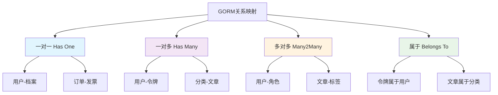

图17：GORM关系映射类型图

#### 关系映射实现示例

```go
// 一对一关系：用户和档案
type User struct {
    ID      int     `gorm:"primaryKey;autoIncrement" json:"id"`
    Name    string  `gorm:"type:varchar(100);not null" json:"name"`
    Profile Profile `gorm:"foreignKey:UserID;constraint:OnDelete:CASCADE" json:"profile"`
}

type Profile struct {
    ID     int    `gorm:"primaryKey;autoIncrement" json:"id"`
    UserID int    `gorm:"uniqueIndex;not null;comment:用户ID" json:"user_id"`
    Avatar string `gorm:"type:varchar(255);comment:头像" json:"avatar"`
    Bio    string `gorm:"type:text;comment:个人简介" json:"bio"`
    User   User   `gorm:"constraint:OnDelete:CASCADE" json:"user"`
}

// 一对多关系：用户和令牌
type User struct {
    ID     int     `gorm:"primaryKey;autoIncrement" json:"id"`
    Name   string  `gorm:"type:varchar(100);not null" json:"name"`
    Tokens []Token `gorm:"foreignKey:UserID;constraint:OnDelete:CASCADE" json:"tokens"`
}

type Token struct {
    ID          int    `gorm:"primaryKey;autoIncrement" json:"id"`
    UserID      int    `gorm:"index;not null;comment:用户ID" json:"user_id"`
    Key         string `gorm:"type:varchar(255);uniqueIndex;not null" json:"key"`
    Name        string `gorm:"type:varchar(100)" json:"name"`
    Status      int    `gorm:"type:int;default:1;index" json:"status"`
    CreatedTime int    `gorm:"bigint;index" json:"created_time"`
    User        User   `gorm:"constraint:OnDelete:CASCADE" json:"user"`
}

// 多对多关系：用户和角色
type User struct {
    ID    int    `gorm:"primaryKey;autoIncrement" json:"id"`
    Name  string `gorm:"type:varchar(100);not null" json:"name"`
    Roles []Role `gorm:"many2many:user_roles;constraint:OnDelete:CASCADE" json:"roles"`
}

type Role struct {
    ID    int    `gorm:"primaryKey;autoIncrement" json:"id"`
    Name  string `gorm:"type:varchar(50);uniqueIndex;not null" json:"name"`
    Users []User `gorm:"many2many:user_roles;constraint:OnDelete:CASCADE" json:"users"`
}

// 中间表（可选，用于自定义字段）
type UserRole struct {
    UserID      int       `gorm:"primaryKey" json:"user_id"`
    RoleID      int       `gorm:"primaryKey" json:"role_id"`
    AssignedAt  time.Time `gorm:"autoCreateTime" json:"assigned_at"`
    AssignedBy  int       `gorm:"comment:分配者ID" json:"assigned_by"`
    User        User      `gorm:"constraint:OnDelete:CASCADE"`
    Role        Role      `gorm:"constraint:OnDelete:CASCADE"`
}
```

#### 关系查询时序图

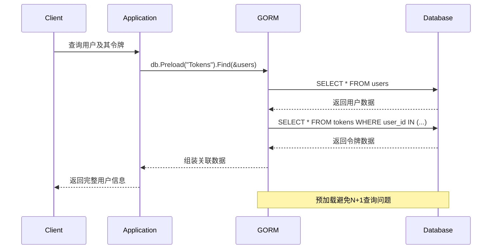

图18：关系查询执行时序图

### 7.4.4 标签参考手册

#### 完整标签分类表

| 分类 | 标签 | 说明 | 示例 | 适用场景 |
|------|------|------|------|----------|
| **主键与自增** | `primaryKey` | 主键 | `gorm:"primaryKey"` | 所有主键字段 |
| | `autoIncrement` | 自增 | `gorm:"autoIncrement"` | 整数主键 |
| **数据类型** | `type` | 数据类型 | `gorm:"type:varchar(100)"` | 自定义字段类型 |
| | `size` | 字段大小 | `gorm:"size:255"` | 字符串字段 |
| | `precision` | 数值精度 | `gorm:"precision:10"` | 浮点数字段 |
| | `scale` | 小数位数 | `gorm:"scale:2"` | 浮点数字段 |
| **约束** | `not null` | 非空约束 | `gorm:"not null"` | 必填字段 |
| | `unique` | 唯一约束 | `gorm:"unique"` | 唯一值字段 |
| | `check` | 检查约束 | `gorm:"check:age > 0"` | 数据验证 |
| | `default` | 默认值 | `gorm:"default:1"` | 有默认值的字段 |
| **索引** | `index` | 普通索引 | `gorm:"index:idx_name"` | 查询优化 |
| | `uniqueIndex` | 唯一索引 | `gorm:"uniqueIndex:idx_email"` | 唯一值查询优化 |
| | `priority` | 复合索引优先级 | `gorm:"index:idx_name,priority:1"` | 复合索引 |
| **关联** | `foreignKey` | 外键字段 | `gorm:"foreignKey:UserID"` | 关联关系 |
| | `references` | 引用字段 | `gorm:"references:ID"` | 关联关系 |
| | `constraint` | 约束行为 | `gorm:"constraint:OnDelete:CASCADE"` | 级联操作 |
| | `many2many` | 多对多中间表 | `gorm:"many2many:user_roles"` | 多对多关系 |
| **序列化** | `serializer` | 序列化器 | `gorm:"serializer:json"` | 复杂数据类型 |
| | `embedded` | 嵌入结构体 | `gorm:"embedded"` | 结构体嵌入 |
| | `embeddedPrefix` | 嵌入前缀 | `gorm:"embeddedPrefix:addr_"` | 避免字段冲突 |
| **其他** | `comment` | 字段注释 | `gorm:"comment:用户名"` | 文档说明 |
| | `-` | 忽略字段 | `gorm:"-"` | 不映射到数据库 |
| | `->` | 只读字段 | `gorm:"->"` | 查询时包含 |
| | `<-` | 只写字段 | `gorm:"<-"` | 创建时包含 |
| | `<-:create` | 仅创建时写入 | `gorm:"<-:create"` | 创建时写入 |
| | `<-:update` | 仅更新时写入 | `gorm:"<-:update"` | 更新时写入 |

## 7.5 New API项目模型实现

### 7.5.1 项目模型架构设计

#### 模型层次架构

New API项目采用分层架构设计，模型层作为数据访问的核心，承担着业务实体与数据库之间的映射责任：

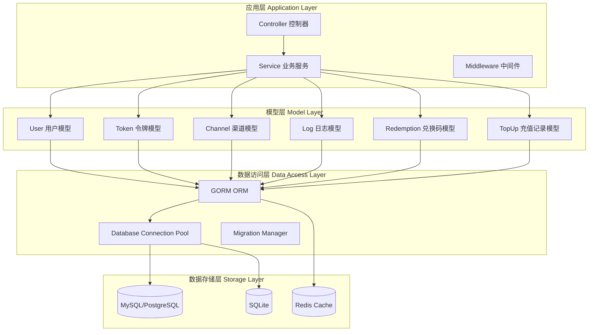

图19：New API项目模型层次架构图

#### 核心模型关系图

```mermaid
erDiagram
    USER {
        int id PK
        string username UK
        string password
        string email UK
        int role
        int status
        int created_time
        int quota
        int balance
    }
    
    TOKEN {
        int id PK
        int user_id FK
        string key UK
        string name
        int status
        int created_time
        int quota
        int balance
    }
    
    CHANNEL {
        int id PK
        int user_id FK
        string type
        string key
        string name
        int status
        int priority
        int balance
    }
    
    LOG {
        int id PK
        int user_id FK
        int token_id FK
        int channel_id FK
        string type
        string content
        int created_time
        int quota
    }
    
    REDEMPTION {
        int id PK
        int user_id FK
        string key UK
        int status
        string name
        int quota
        int created_time
    }
    
    TOPUP {
        int id PK
        int user_id FK
        int amount
        string trade_no UK
        int status
        int created_time
    }
    
    USER ||--o{ TOKEN : "拥有"
    USER ||--o{ CHANNEL : "管理"
    USER ||--o{ LOG : "产生"
    USER ||--o{ REDEMPTION : "兑换"
    USER ||--o{ TOPUP : "充值"
    
    TOKEN ||--o{ LOG : "使用"
    CHANNEL ||--o{ LOG : "处理"
```

图20：New API核心模型关系图

### 7.5.2 用户模型实现

```go
// model/user.go
package model

import (
    "errors"
    "fmt"
    "time"
    
    "golang.org/x/crypto/bcrypt"
    "gorm.io/gorm"
    "one-api/common"
)

// 用户角色常量
const (
    RoleGuestUser  = 0 // 游客用户
    RoleCommonUser = 1 // 普通用户
    RoleAdminUser  = 10 // 管理员
    RoleRootUser   = 100 // 根用户
)

// 用户状态常量
const (
    UserStatusDisabled = 0 // 禁用
    UserStatusEnabled  = 1 // 启用
)

// 用户模型
type User struct {
    ID           int    `gorm:"primaryKey;autoIncrement" json:"id"`
    Username     string `gorm:"type:varchar(50);uniqueIndex;not null" json:"username"`
    Password     string `gorm:"type:varchar(255);not null" json:"-"`
    DisplayName  string `gorm:"type:varchar(100)" json:"display_name"`
    Email        string `gorm:"type:varchar(100);uniqueIndex" json:"email"`
    Role         int    `gorm:"type:int;default:1;index" json:"role"`
    Status       int    `gorm:"type:int;default:1;index" json:"status"`
    CreatedTime  int    `gorm:"bigint;index" json:"created_time"`
    AccessedTime int    `gorm:"bigint" json:"accessed_time"`
    
    // 配额相关
    Quota     int `gorm:"type:int;default:0" json:"quota"`
    UsedQuota int `gorm:"type:int;default:0" json:"used_quota"`
    
    // 统计信息
    RequestCount int `gorm:"type:int;default:0" json:"request_count"`
    
    // 分组和归属
    Group       string `gorm:"type:varchar(50);default:'default';index" json:"group"`
    Affiliation string `gorm:"type:varchar(100)" json:"affiliation"`
    
    // 余额（以分为单位）
    Balance int `gorm:"type:int;default:0" json:"balance"`
    
    // 关联
    Tokens   []Token   `gorm:"foreignKey:UserID" json:"tokens,omitempty"`
    Channels []Channel `gorm:"foreignKey:UserID" json:"channels,omitempty"`
    Logs     []Log     `gorm:"foreignKey:UserID" json:"logs,omitempty"`
}

// 表名
func (User) TableName() string {
    return "users"
}

// BeforeCreate 创建前钩子
func (u *User) BeforeCreate(tx *gorm.DB) error {
    now := int(time.Now().Unix())
    u.CreatedTime = now
    u.AccessedTime = now
    
    // 密码加密
    if u.Password != "" {
        hashedPassword, err := bcrypt.GenerateFromPassword([]byte(u.Password), bcrypt.DefaultCost)
        if err != nil {
            return err
        }
        u.Password = string(hashedPassword)
    }
    
    return nil
}

// BeforeUpdate 更新前钩子
func (u *User) BeforeUpdate(tx *gorm.DB) error {
    // 如果密码字段被修改，则重新加密
    if tx.Statement.Changed("password") && u.Password != "" {
        hashedPassword, err := bcrypt.GenerateFromPassword([]byte(u.Password), bcrypt.DefaultCost)
        if err != nil {
            return err
        }
        u.Password = string(hashedPassword)
    }
    return nil
}

// 验证密码
func (u *User) ValidatePassword(password string) bool {
    err := bcrypt.CompareHashAndPassword([]byte(u.Password), []byte(password))
    return err == nil
}

// 是否为管理员
func (u *User) IsAdmin() bool {
    return u.Role >= RoleAdminUser
}

// 是否为根用户
func (u *User) IsRoot() bool {
    return u.Role >= RoleRootUser
}

// 是否启用
func (u *User) IsEnabled() bool {
    return u.Status == UserStatusEnabled
}

// 获取角色名称
func (u *User) GetRoleName() string {
    switch u.Role {
    case RoleGuestUser:
        return "游客"
    case RoleCommonUser:
        return "普通用户"
    case RoleAdminUser:
        return "管理员"
    case RoleRootUser:
        return "根用户"
    default:
        return "未知"
    }
}

// 获取状态名称
func (u *User) GetStatusName() string {
    switch u.Status {
    case UserStatusDisabled:
        return "禁用"
    case UserStatusEnabled:
        return "启用"
    default:
        return "未知"
    }
}

// 更新访问时间
func (u *User) UpdateAccessTime() error {
    u.AccessedTime = int(time.Now().Unix())
    return common.DB.Model(u).Update("accessed_time", u.AccessedTime).Error
}

// 增加配额使用量
func (u *User) IncreaseUsedQuota(amount int) error {
    return common.DB.Model(u).Update("used_quota", gorm.Expr("used_quota + ?", amount)).Error
}

// 增加请求计数
func (u *User) IncreaseRequestCount() error {
    return common.DB.Model(u).Update("request_count", gorm.Expr("request_count + 1")).Error
}

// 用户CRUD操作

// 创建用户
func CreateUser(user *User) error {
    return common.DB.Create(user).Error
}

// 根据ID获取用户
func GetUserById(id int, selectAll bool) *User {
    var user User
    var db *gorm.DB
    
    if selectAll {
        db = common.DB
    } else {
        db = common.DB.Omit("password")
    }
    
    if err := db.First(&user, id).Error; err != nil {
        return nil
    }
    return &user
}

// 根据用户名获取用户
func GetUserByUsername(username string, selectAll bool) *User {
    var user User
    var db *gorm.DB
    
    if selectAll {
        db = common.DB
    } else {
        db = common.DB.Omit("password")
    }
    
    if err := db.Where("username = ?", username).First(&user).Error; err != nil {
        return nil
    }
    return &user
}

// 根据邮箱获取用户
func GetUserByEmail(email string, selectAll bool) *User {
    var user User
    var db *gorm.DB
    
    if selectAll {
        db = common.DB
    } else {
        db = common.DB.Omit("password")
    }
    
    if err := db.Where("email = ?", email).First(&user).Error; err != nil {
        return nil
    }
    return &user
}

// 更新用户
func (u *User) Update() error {
    return common.DB.Save(u).Error
}

// 删除用户
func (u *User) Delete() error {
    return common.DB.Delete(u).Error
}

// 获取用户列表
func GetUsers(offset, limit int, order, search string) ([]*User, int64, error) {
    var users []*User
    var total int64
    
    db := common.DB.Model(&User{}).Omit("password")
    
    // 搜索条件
    if search != "" {
        searchPattern := "%" + search + "%"
        db = db.Where("username LIKE ? OR display_name LIKE ? OR email LIKE ?", 
            searchPattern, searchPattern, searchPattern)
    }
    
    // 获取总数
    if err := db.Count(&total).Error; err != nil {
        return nil, 0, err
    }
    
    // 排序
    if order == "" {
        order = "id desc"
    }
    
    // 分页查询
    if err := db.Order(order).Offset(offset).Limit(limit).Find(&users).Error; err != nil {
        return nil, 0, err
    }
    
    return users, total, nil
}

// 根据分组获取用户
func GetUsersByGroup(group string) ([]*User, error) {
    var users []*User
    err := common.DB.Where("group = ?", group).Omit("password").Find(&users).Error
    return users, err
}

// 获取用户统计信息
func GetUserStats() map[string]interface{} {
    var stats map[string]interface{} = make(map[string]interface{})
    
    // 总用户数
    var totalUsers int64
    common.DB.Model(&User{}).Count(&totalUsers)
    stats["total_users"] = totalUsers
    
    // 启用用户数
    var enabledUsers int64
    common.DB.Model(&User{}).Where("status = ?", UserStatusEnabled).Count(&enabledUsers)
    stats["enabled_users"] = enabledUsers
    
    // 今日新增用户
    today := time.Now().Unix() - time.Now().Unix()%86400
    var todayUsers int64
    common.DB.Model(&User{}).Where("created_time >= ?", today).Count(&todayUsers)
    stats["today_users"] = todayUsers
    
    // 按角色统计
    var roleStats []map[string]interface{}
    common.DB.Model(&User{}).Select("role, count(*) as count").Group("role").Scan(&roleStats)
    stats["role_stats"] = roleStats
    
    return stats
}

// 验证用户登录
func ValidateUser(username, password string) (*User, error) {
    user := GetUserByUsername(username, true)
    if user == nil {
        return nil, errors.New("用户不存在")
    }
    
    if !user.IsEnabled() {
        return nil, errors.New("用户已被禁用")
    }
    
    if !user.ValidatePassword(password) {
        return nil, errors.New("密码错误")
    }
    
    // 更新访问时间
    go user.UpdateAccessTime()
    
    return user, nil
}
```

### 7.5.3 令牌模型实现

#### 令牌生命周期管理

令牌模型是New API项目的核心组件，负责API访问控制和配额管理：

```mermaid
stateDiagram-v2
    [*] --> Created : 创建令牌
    Created --> Enabled : 激活
    Enabled --> Disabled : 禁用
    Enabled --> Expired : 过期
    Disabled --> Enabled : 重新激活
    Expired --> [*] : 清理
    Disabled --> [*] : 删除
    
    note right of Created : 生成唯一Key
    note right of Enabled : 可正常使用
    note right of Disabled : 暂停使用
    note right of Expired : 超过有效期
```

图21：令牌生命周期状态图

```go
// model/token.go
package model

import (
    "crypto/rand"
    "encoding/hex"
    "errors"
    "fmt"
    "time"
    
    "gorm.io/gorm"
    "one-api/common"
)

// 令牌状态常量
const (
    TokenStatusDisabled = 0 // 禁用
    TokenStatusEnabled  = 1 // 启用
    TokenStatusExpired  = 2 // 过期
)

// 令牌模型
type Token struct {
    ID           int    `gorm:"primaryKey;autoIncrement;comment:令牌ID" json:"id"`
    UserID       int    `gorm:"index:idx_user_token;not null;comment:用户ID" json:"user_id"`
    Key          string `gorm:"type:varchar(255);uniqueIndex:idx_token_key;not null;comment:令牌密钥" json:"key"`
    Name         string `gorm:"type:varchar(100);not null;comment:令牌名称" json:"name"`
    Status       int    `gorm:"type:int;default:1;index:idx_token_status;comment:令牌状态" json:"status"`
    CreatedTime  int    `gorm:"bigint;index:idx_token_created;comment:创建时间" json:"created_time"`
    AccessedTime int    `gorm:"bigint;comment:最后访问时间" json:"accessed_time"`
    ExpiredTime  int    `gorm:"bigint;default:-1;comment:过期时间" json:"expired_time"` // -1表示永不过期
    
    // 配额相关
    Quota     int `gorm:"type:int;default:0;comment:总配额" json:"quota"`
    UsedQuota int `gorm:"type:int;default:0;comment:已用配额" json:"used_quota"`
    
    // 统计信息
    RequestCount int `gorm:"type:int;default:0;comment:请求次数" json:"request_count"`
    
    // 余额（以分为单位）
    Balance int `gorm:"type:int;default:0;comment:余额" json:"balance"`
    
    // 分组和权限
    Group       string `gorm:"type:varchar(50);default:'default';index:idx_token_group;comment:分组" json:"group"`
    Models      string `gorm:"type:text;comment:可用模型列表" json:"models"`
    Subnet      string `gorm:"type:varchar(255);comment:IP白名单" json:"subnet"`
    
    // 关联
    User *User `gorm:"foreignKey:UserID;constraint:OnDelete:CASCADE" json:"user,omitempty"`
    Logs []Log `gorm:"foreignKey:TokenID;constraint:OnDelete:SET NULL" json:"logs,omitempty"`
}

// 表名
func (Token) TableName() string {
    return "tokens"
}

// 复合索引
func (Token) Indexes() []gorm.Index {
    return []gorm.Index{
        {
            Name:   "idx_token_user_status",
            Fields: []string{"user_id", "status"},
        },
        {
            Name:   "idx_token_created_status",
            Fields: []string{"created_time", "status"},
        },
    }
}

// BeforeCreate 创建前钩子
func (t *Token) BeforeCreate(tx *gorm.DB) error {
    now := int(time.Now().Unix())
    t.CreatedTime = now
    t.AccessedTime = now
    
    // 如果没有设置Key，则自动生成
    if t.Key == "" {
        key, err := generateTokenKey()
        if err != nil {
            return err
        }
        t.Key = key
    }
    
    return nil
}

// 生成令牌密钥
func generateTokenKey() (string, error) {
    bytes := make([]byte, 32) // 256位
    if _, err := rand.Read(bytes); err != nil {
        return "", err
    }
    return "sk-" + hex.EncodeToString(bytes), nil
}

// 业务方法

// 是否启用
func (t *Token) IsEnabled() bool {
    return t.Status == TokenStatusEnabled && !t.IsExpired()
}

// 是否过期
func (t *Token) IsExpired() bool {
    if t.ExpiredTime == -1 {
        return false // 永不过期
    }
    return int(time.Now().Unix()) > t.ExpiredTime
}

// 检查配额是否足够
func (t *Token) HasEnoughQuota(required int) bool {
    if t.Quota == -1 {
        return true // 无限配额
    }
    return t.Quota-t.UsedQuota >= required
}

// 更新访问时间
func (t *Token) UpdateAccessTime() error {
    t.AccessedTime = int(time.Now().Unix())
    return common.DB.Model(t).Update("accessed_time", t.AccessedTime).Error
}

// 增加配额使用量
func (t *Token) IncreaseUsedQuota(amount int) error {
    return common.DB.Model(t).Update("used_quota", gorm.Expr("used_quota + ?", amount)).Error
}

// 增加请求计数
func (t *Token) IncreaseRequestCount() error {
    return common.DB.Model(t).Update("request_count", gorm.Expr("request_count + 1")).Error
}

// CRUD操作

// 创建令牌
func CreateToken(token *Token) error {
    return common.DB.Create(token).Error
}

// 根据Key获取令牌
func GetTokenByKey(key string) *Token {
    var token Token
    if err := common.DB.Where("key = ? AND status = ?", key, TokenStatusEnabled).First(&token).Error; err != nil {
        return nil
    }
    return &token
}

// 根据用户ID获取令牌列表
func GetTokensByUserID(userID int) ([]*Token, error) {
    var tokens []*Token
    err := common.DB.Where("user_id = ?", userID).Order("id desc").Find(&tokens).Error
    return tokens, err
}

// 验证令牌
func ValidateToken(key string) (*Token, error) {
    token := GetTokenByKey(key)
    if token == nil {
        return nil, errors.New("令牌不存在或已禁用")
    }
    
    if token.IsExpired() {
        return nil, errors.New("令牌已过期")
    }
    
    // 更新访问时间
    go token.UpdateAccessTime()
    
    return token, nil
}

// 是否可用
func (t *Token) IsAvailable() bool {
    return t.IsEnabled() && !t.IsExpired()
}

// 获取状态名称
func (t *Token) GetStatusName() string {
    if t.IsExpired() {
        return "已过期"
    }
    
    switch t.Status {
    case TokenStatusDisabled:
        return "禁用"
    case TokenStatusEnabled:
        return "启用"
    default:
        return "未知"
    }
}

// 获取过期时间字符串
func (t *Token) GetExpiredTimeString() string {
    if t.ExpiredTime == -1 {
        return "永不过期"
    }
    return time.Unix(int64(t.ExpiredTime), 0).Format("2006-01-02 15:04:05")
}

// 更新访问时间
func (t *Token) UpdateAccessTime() error {
    t.AccessedTime = int(time.Now().Unix())
    return common.DB.Model(t).Update("accessed_time", t.AccessedTime).Error
}

// 增加配额使用量
func (t *Token) IncreaseUsedQuota(amount int) error {
    return common.DB.Model(t).Update("used_quota", gorm.Expr("used_quota + ?", amount)).Error
}

// 增加请求计数
func (t *Token) IncreaseRequestCount() error {
    return common.DB.Model(t).Update("request_count", gorm.Expr("request_count + 1")).Error
}

// 令牌CRUD操作

// 创建令牌
func CreateToken(token *Token) error {
    return common.DB.Create(token).Error
}

// 根据ID获取令牌
func GetTokenById(id int) *Token {
    var token Token
    if err := common.DB.First(&token, id).Error; err != nil {
        return nil
    }
    return &token
}

// 根据Key获取令牌
func GetTokenByKey(key string) *Token {
    var token Token
    if err := common.DB.Where("key = ?", key).First(&token).Error; err != nil {
        return nil
    }
    return &token
}

// 验证令牌
func ValidateUserToken(key string) *Token {
    token := GetTokenByKey(key)
    if token == nil {
        return nil
    }
    
    if !token.IsAvailable() {
        return nil
    }
    
    // 更新访问时间
    go token.UpdateAccessTime()
    
    return token
}

// 更新令牌
func (t *Token) Update() error {
    return common.DB.Save(t).Error
}

// 删除令牌
func (t *Token) Delete() error {
    return common.DB.Delete(t).Error
}

// 获取用户的令牌列表
func GetTokensByUserId(userId int, offset, limit int) ([]*Token, int64, error) {
    var tokens []*Token
    var total int64
    
    db := common.DB.Model(&Token{}).Where("user_id = ?", userId)
    
    // 获取总数
    if err := db.Count(&total).Error; err != nil {
        return nil, 0, err
    }
    
    // 分页查询
    if err := db.Order("id desc").Offset(offset).Limit(limit).Find(&tokens).Error; err != nil {
        return nil, 0, err
    }
    
    return tokens, total, nil
}

// 获取令牌列表
func GetTokens(offset, limit int, order, search string) ([]*Token, int64, error) {
    var tokens []*Token
    var total int64
    
    db := common.DB.Model(&Token{})
    
    // 搜索条件
    if search != "" {
        searchPattern := "%" + search + "%"
        db = db.Where("name LIKE ? OR key LIKE ?", searchPattern, searchPattern)
    }
    
    // 获取总数
    if err := db.Count(&total).Error; err != nil {
        return nil, 0, err
    }
    
    // 排序
    if order == "" {
        order = "id desc"
    }
    
    // 分页查询
    if err := db.Order(order).Offset(offset).Limit(limit).Find(&tokens).Error; err != nil {
        return nil, 0, err
    }
    
    return tokens, total, nil
}

// 获取令牌统计信息
func GetTokenStats() map[string]interface{} {
    var stats map[string]interface{} = make(map[string]interface{})
    
    // 总令牌数
    var totalTokens int64
    common.DB.Model(&Token{}).Count(&totalTokens)
    stats["total_tokens"] = totalTokens
    
    // 启用令牌数
    var enabledTokens int64
    common.DB.Model(&Token{}).Where("status = ?", TokenStatusEnabled).Count(&enabledTokens)
    stats["enabled_tokens"] = enabledTokens
    
    // 今日新增令牌
    today := time.Now().Unix() - time.Now().Unix()%86400
    var todayTokens int64
    common.DB.Model(&Token{}).Where("created_time >= ?", today).Count(&todayTokens)
    stats["today_tokens"] = todayTokens
    
    // 过期令牌数
    now := int(time.Now().Unix())
    var expiredTokens int64
    common.DB.Model(&Token{}).Where("expired_time != -1 AND expired_time < ?", now).Count(&expiredTokens)
    stats["expired_tokens"] = expiredTokens
    
    return stats
}

// 清理过期令牌
func CleanExpiredTokens() error {
    now := int(time.Now().Unix())
    return common.DB.Where("expired_time != -1 AND expired_time < ?", now).
        Update("status", TokenStatusExpired).Error
}
```

### 7.5.4 渠道模型实现

渠道模型是New API项目中管理各种AI服务提供商的核心组件，负责统一管理不同类型的API渠道。

#### 渠道管理架构

```mermaid
flowchart TD
    A[渠道管理器] --> B[渠道注册]
    A --> C[渠道选择]
    A --> D[负载均衡]
    A --> E[健康检查]
    
    B --> F[OpenAI]
    B --> G[Azure]
    B --> H[自定义渠道]
    
    C --> I[权重算法]
    C --> J[优先级排序]
    C --> K[可用性检查]
    
    D --> L[轮询策略]
    D --> M[加权轮询]
    D --> N[最少连接]
    
    E --> O[定时检测]
    E --> P[故障转移]
    E --> Q[自动恢复]
```

图17 渠道管理架构图

#### 渠道模型定义

```go
// model/channel.go
package model

import (
    "encoding/json"
    "fmt"
    "strings"
    "time"
    
    "gorm.io/gorm"
    "one-api/common"
)

// 渠道类型常量
const (
    ChannelTypeOpenAI     = 1  // OpenAI
    ChannelTypeAPI2D      = 2  // API2D
    ChannelTypeAzure      = 3  // Azure OpenAI
    ChannelTypeCloseAI    = 4  // CloseAI
    ChannelTypeOpenAISB   = 5  // OpenAI-SB
    ChannelTypeOpenAIMax  = 6  // OpenAI-Max
    ChannelTypeOhMyGPT    = 7  // OhMyGPT
    ChannelTypeCustom     = 8  // 自定义
    ChannelTypeAILS       = 9  // AILS
    ChannelTypeAIProxy    = 10 // AIProxy
)

// 渠道状态常量
const (
    ChannelStatusDisabled = 0 // 禁用
    ChannelStatusEnabled  = 1 // 启用
    ChannelStatusTesting  = 2 // 测试中
    ChannelStatusError    = 3 // 错误
)

// 渠道模型
type Channel struct {
    BaseModel
    
    // 基础信息
    Type               int    `gorm:"type:int;not null;index;comment:渠道类型" json:"type"`
    Key                string `gorm:"type:text;not null;comment:API密钥" json:"key"`
    Name               string `gorm:"type:varchar(100);not null;comment:渠道名称" json:"name"`
    Status             int    `gorm:"type:int;default:1;index;comment:渠道状态" json:"status"`
    
    // 负载均衡配置
    Weight             int    `gorm:"type:int;default:1;comment:权重" json:"weight"`
    Priority           int    `gorm:"type:int;default:0;index;comment:优先级" json:"priority"`
    
    // 时间戳
    TestedTime         int    `gorm:"bigint;comment:最后测试时间" json:"tested_time"`
    BalanceUpdatedTime int    `gorm:"bigint;comment:余额更新时间" json:"balance_updated_time"`
    
    // 配置信息
    Balance            int    `gorm:"type:int;default:0;comment:余额" json:"balance"`
    BaseURL            string `gorm:"type:varchar(255);comment:基础URL" json:"base_url"`
    Other              string `gorm:"type:text;comment:其他配置" json:"other"`
    
    // 模型配置
    Models             string `gorm:"type:text;comment:支持的模型列表" json:"models"`
    ModelMapping       string `gorm:"type:text;comment:模型映射配置" json:"model_mapping"`
    
    // 分组管理
    UserID             int    `gorm:"index;comment:所属用户ID" json:"user_id"`
    Group              string `gorm:"type:varchar(50);default:'default';index;comment:渠道分组" json:"group"`
    
    // 关联关系
    User *User `gorm:"foreignKey:UserID;constraint:OnUpdate:CASCADE,OnDelete:SET NULL" json:"user,omitempty"`
    Logs []Log `gorm:"foreignKey:ChannelID;constraint:OnUpdate:CASCADE,OnDelete:CASCADE" json:"logs,omitempty"`
}

// 复合索引定义
func (Channel) Indexes() []gorm.Index {
    return []gorm.Index{
        {Name: "idx_channel_status_priority", Fields: []string{"status", "priority"}},
        {Name: "idx_channel_type_group", Fields: []string{"type", "group"}},
        {Name: "idx_channel_user_status", Fields: []string{"user_id", "status"}},
    }
}

// 表名
func (Channel) TableName() string {
    return "channels"
}

// BeforeCreate 创建前钩子
func (c *Channel) BeforeCreate(tx *gorm.DB) error {
    c.CreatedTime = int(time.Now().Unix())
    return nil
}

// 是否启用
func (c *Channel) IsEnabled() bool {
    return c.Status == ChannelStatusEnabled
}

// 获取类型名称
func (c *Channel) GetTypeName() string {
    switch c.Type {
    case ChannelTypeOpenAI:
        return "OpenAI"
    case ChannelTypeAPI2D:
        return "API2D"
    case ChannelTypeAzure:
        return "Azure OpenAI"
    case ChannelTypeCloseAI:
        return "CloseAI"
    case ChannelTypeOpenAISB:
        return "OpenAI-SB"
    case ChannelTypeOpenAIMax:
        return "OpenAI-Max"
    case ChannelTypeOhMyGPT:
        return "OhMyGPT"
    case ChannelTypeCustom:
        return "自定义"
    case ChannelTypeAILS:
        return "AILS"
    case ChannelTypeAIProxy:
        return "AIProxy"
    default:
        return "未知"
    }
}

// 获取状态名称
func (c *Channel) GetStatusName() string {
    switch c.Status {
    case ChannelStatusDisabled:
        return "禁用"
    case ChannelStatusEnabled:
        return "启用"
    case ChannelStatusTesting:
        return "测试中"
    case ChannelStatusError:
        return "错误"
    default:
        return "未知"
    }
}

// 获取支持的模型列表
func (c *Channel) GetModelList() []string {
    if c.Models == "" {
        return []string{}
    }
    return strings.Split(c.Models, ",")
}

// 设置支持的模型列表
func (c *Channel) SetModelList(models []string) {
    c.Models = strings.Join(models, ",")
}

// 获取模型映射
func (c *Channel) GetModelMapping() map[string]string {
    if c.ModelMapping == "" {
        return make(map[string]string)
    }
    
    var mapping map[string]string
    if err := json.Unmarshal([]byte(c.ModelMapping), &mapping); err != nil {
        return make(map[string]string)
    }
    return mapping
}

// 设置模型映射
func (c *Channel) SetModelMapping(mapping map[string]string) error {
    data, err := json.Marshal(mapping)
    if err != nil {
        return err
    }
    c.ModelMapping = string(data)
    return nil
}

// 获取其他配置
func (c *Channel) GetOtherConfig() map[string]interface{} {
    if c.Other == "" {
        return make(map[string]interface{})
    }
    
    var config map[string]interface{}
    if err := json.Unmarshal([]byte(c.Other), &config); err != nil {
        return make(map[string]interface{})
    }
    return config
}

// 设置其他配置
func (c *Channel) SetOtherConfig(config map[string]interface{}) error {
    data, err := json.Marshal(config)
    if err != nil {
        return err
    }
    c.Other = string(data)
    return nil
}

// 更新测试时间
func (c *Channel) UpdateTestTime() error {
    c.TestedTime = int(time.Now().Unix())
    return common.DB.Model(c).Update("tested_time", c.TestedTime).Error
}

// 更新余额
func (c *Channel) UpdateBalance(balance int) error {
    c.Balance = balance
    c.BalanceUpdatedTime = int(time.Now().Unix())
    return common.DB.Model(c).Updates(map[string]interface{}{
        "balance":              balance,
        "balance_updated_time": c.BalanceUpdatedTime,
    }).Error
}

// 渠道CRUD操作

// 创建渠道
func CreateChannel(channel *Channel) error {
    return common.DB.Create(channel).Error
}

// 根据ID获取渠道
func GetChannelById(id int, selectAll bool) *Channel {
    var channel Channel
    var db *gorm.DB
    
    if selectAll {
        db = common.DB
    } else {
        db = common.DB.Omit("key")
    }
    
    if err := db.First(&channel, id).Error; err != nil {
        return nil
    }
    return &channel
}

// 更新渠道
func (c *Channel) Update() error {
    return common.DB.Save(c).Error
}

// 删除渠道
func (c *Channel) Delete() error {
    return common.DB.Delete(c).Error
}

// 获取渠道列表
func GetChannels(offset, limit int, order, search string) ([]*Channel, int64, error) {
    var channels []*Channel
    var total int64
    
    db := common.DB.Model(&Channel{}).Omit("key")
    
    // 搜索条件
    if search != "" {
        searchPattern := "%" + search + "%"
        db = db.Where("name LIKE ? OR base_url LIKE ?", searchPattern, searchPattern)
    }
    
    // 获取总数
    if err := db.Count(&total).Error; err != nil {
        return nil, 0, err
    }
    
    // 排序
    if order == "" {
        order = "priority desc, id desc"
    }
    
    // 分页查询
    if err := db.Order(order).Offset(offset).Limit(limit).Find(&channels).Error; err != nil {
        return nil, 0, err
    }
    
    return channels, total, nil
}

// 获取启用的渠道
func GetEnabledChannels() ([]*Channel, error) {
    var channels []*Channel
    err := common.DB.Where("status = ?", ChannelStatusEnabled).
        Order("priority desc, weight desc").Find(&channels).Error
    return channels, err
}

// 根据类型获取渠道
func GetChannelsByType(channelType int) ([]*Channel, error) {
    var channels []*Channel
    err := common.DB.Where("type = ? AND status = ?", channelType, ChannelStatusEnabled).
        Order("priority desc, weight desc").Find(&channels).Error
    return channels, err
}

// 获取渠道统计信息
func GetChannelStats() map[string]interface{} {
    var stats map[string]interface{} = make(map[string]interface{})
    
    // 总渠道数
    var totalChannels int64
    common.DB.Model(&Channel{}).Count(&totalChannels)
    stats["total_channels"] = totalChannels
    
    // 启用渠道数
    var enabledChannels int64
    common.DB.Model(&Channel{}).Where("status = ?", ChannelStatusEnabled).Count(&enabledChannels)
    stats["enabled_channels"] = enabledChannels
    
    // 按类型统计
    var typeStats []map[string]interface{}
    common.DB.Model(&Channel{}).Select("type, count(*) as count").Group("type").Scan(&typeStats)
    stats["type_stats"] = typeStats
    
    return stats
}
```

### 7.5.5 日志模型实现

日志模型是New API项目中记录系统操作和用户行为的核心组件，提供完整的审计追踪功能。

#### 日志系统架构

```mermaid
flowchart TD
    A[日志系统] --> B[日志收集]
    A --> C[日志存储]
    A --> D[日志查询]
    A --> E[日志分析]
    
    B --> F[API请求日志]
    B --> G[用户操作日志]
    B --> H[系统事件日志]
    B --> I[错误日志]
    
    C --> J[数据库存储]
    C --> K[文件存储]
    C --> L[缓存层]
    
    D --> M[条件查询]
    D --> N[分页查询]
    D --> O[聚合查询]
    
    E --> P[统计分析]
    E --> Q[趋势分析]
    E --> R[异常检测]
```

图18 日志系统架构图

#### 日志生命周期

```mermaid
stateDiagram-v2
    [*] --> 创建: 事件触发
    创建 --> 验证: 数据校验
    验证 --> 存储: 校验通过
    验证 --> 丢弃: 校验失败
    存储 --> 索引: 建立索引
    索引 --> 可查询: 索引完成
    可查询 --> 归档: 达到归档条件
    可查询 --> 删除: 达到删除条件
    归档 --> 删除: 归档期满
    删除 --> [*]
    丢弃 --> [*]
```

图19 日志生命周期状态图

#### 日志模型定义

```go
// model/log.go
package model

import (
    "time"
    
    "gorm.io/gorm"
    "one-api/common"
)

// 日志类型常量
const (
    LogTypeUnknown = 0
    LogTypeTopup   = 1 // 充值
    LogTypeConsume = 2 // 消费
    LogTypeManage  = 3 // 管理
    LogTypeSystem  = 4 // 系统
)

// 日志模型
type Log struct {
    ID              int    `gorm:"primaryKey;autoIncrement" json:"id"`
    
    // 基础信息
    UserID          int    `gorm:"index;not null;comment:用户ID" json:"user_id"`
    CreatedAt       int64  `gorm:"bigint;index;comment:创建时间" json:"created_at"`
    Type            int    `gorm:"type:int;index;comment:日志类型" json:"type"`
    Content         string `gorm:"type:text;comment:日志内容" json:"content"`
    
    // 用户信息
    Username        string `gorm:"type:varchar(50);index;comment:用户名" json:"username"`
    
    // 令牌信息
    TokenName       string `gorm:"type:varchar(100);index;comment:令牌名称" json:"token_name"`
    
    // 模型信息
    ModelName       string `gorm:"type:varchar(100);index;comment:模型名称" json:"model_name"`
    
    // 配额信息
    Quota           int    `gorm:"type:int;default:0;comment:消耗配额" json:"quota"`
    PromptTokens    int    `gorm:"type:int;default:0;comment:输入令牌数" json:"prompt_tokens"`
    CompletionTokens int   `gorm:"type:int;default:0;comment:输出令牌数" json:"completion_tokens"`
    
    // 渠道信息
    ChannelID       int    `gorm:"index;comment:渠道ID" json:"channel_id"`
    
    // 扩展字段
    RequestID       string `gorm:"type:varchar(100);index;comment:请求ID" json:"request_id"`
    IP              string `gorm:"type:varchar(45);index;comment:客户端IP" json:"ip"`
    UserAgent       string `gorm:"type:varchar(500);comment:用户代理" json:"user_agent"`
    
    // 关联关系
    User    *User    `gorm:"foreignKey:UserID;constraint:OnUpdate:CASCADE,OnDelete:CASCADE" json:"user,omitempty"`
    Channel *Channel `gorm:"foreignKey:ChannelID;constraint:OnUpdate:CASCADE,OnDelete:SET NULL" json:"channel,omitempty"`
}

// 复合索引定义
func (Log) Indexes() []gorm.Index {
    return []gorm.Index{
        {Name: "idx_log_user_created", Fields: []string{"user_id", "created_at"}},
        {Name: "idx_log_type_created", Fields: []string{"type", "created_at"}},
        {Name: "idx_log_channel_created", Fields: []string{"channel_id", "created_at"}},
        {Name: "idx_log_model_created", Fields: []string{"model_name", "created_at"}},
    }
}

// 表名
func (Log) TableName() string {
    return "logs"
}

// BeforeCreate 创建前钩子
func (l *Log) BeforeCreate(tx *gorm.DB) error {
    l.CreatedAt = time.Now().Unix()
    return nil
}

// 获取类型名称
func (l *Log) GetTypeName() string {
    switch l.Type {
    case LogTypeTopup:
        return "充值"
    case LogTypeConsume:
        return "消费"
    case LogTypeManage:
        return "管理"
    case LogTypeSystem:
        return "系统"
    default:
        return "未知"
    }
}

// 获取创建时间字符串
func (l *Log) GetCreatedTimeString() string {
    return time.Unix(l.CreatedAt, 0).Format("2006-01-02 15:04:05")
}

// 日志CRUD操作

// 创建日志
func CreateLog(log *Log) error {
    return common.DB.Create(log).Error
}

// 批量创建日志
func CreateLogs(logs []*Log) error {
    return common.DB.CreateInBatches(logs, 100).Error
}

// 根据ID获取日志
func GetLogById(id int) *Log {
    var log Log
    if err := common.DB.First(&log, id).Error; err != nil {
        return nil
    }
    return &log
}

// 获取日志列表
func GetLogs(offset, limit int, order, search string, logType int, startTime, endTime int64) ([]*Log, int64, error) {
    var logs []*Log
    var total int64
    
    db := common.DB.Model(&Log{})
    
    // 搜索条件
    if search != "" {
        searchPattern := "%" + search + "%"
        db = db.Where("username LIKE ? OR token_name LIKE ? OR model_name LIKE ? OR content LIKE ?", 
            searchPattern, searchPattern, searchPattern, searchPattern)
    }
    
    // 日志类型过滤
    if logType != -1 {
        db = db.Where("type = ?", logType)
    }
    
    // 时间范围过滤
    if startTime > 0 {
        db = db.Where("created_at >= ?", startTime)
    }
    if endTime > 0 {
        db = db.Where("created_at <= ?", endTime)
    }
    
    // 获取总数
    if err := db.Count(&total).Error; err != nil {
        return nil, 0, err
    }
    
    // 排序
    if order == "" {
        order = "id desc"
    }
    
    // 分页查询
    if err := db.Order(order).Offset(offset).Limit(limit).Find(&logs).Error; err != nil {
        return nil, 0, err
    }
    
    return logs, total, nil
}

// 获取用户日志
func GetUserLogs(userID int, offset, limit int) ([]*Log, int64, error) {
    var logs []*Log
    var total int64
    
    db := common.DB.Model(&Log{}).Where("user_id = ?", userID)
    
    // 获取总数
    if err := db.Count(&total).Error; err != nil {
        return nil, 0, err
    }
    
    // 分页查询
    if err := db.Order("id desc").Offset(offset).Limit(limit).Find(&logs).Error; err != nil {
        return nil, 0, err
    }
    
    return logs, total, nil
}

// 删除日志
func (l *Log) Delete() error {
    return common.DB.Delete(l).Error
}

// 批量删除日志
func DeleteLogs(ids []int) error {
    return common.DB.Delete(&Log{}, ids).Error
}

// 清理过期日志
func CleanExpiredLogs(days int) error {
    expiredTime := time.Now().AddDate(0, 0, -days).Unix()
    return common.DB.Where("created_at < ?", expiredTime).Delete(&Log{}).Error
}

// 获取日志统计信息
func GetLogStats(startTime, endTime int64) map[string]interface{} {
    var stats map[string]interface{} = make(map[string]interface{})
    
    db := common.DB.Model(&Log{})
    if startTime > 0 {
        db = db.Where("created_at >= ?", startTime)
    }
    if endTime > 0 {
        db = db.Where("created_at <= ?", endTime)
    }
    
    // 总日志数
    var totalLogs int64
    db.Count(&totalLogs)
    stats["total_logs"] = totalLogs
    
    // 按类型统计
    var typeStats []map[string]interface{}
    db.Select("type, count(*) as count").Group("type").Scan(&typeStats)
    stats["type_stats"] = typeStats
    
    // 总配额消费
    var totalQuota int64
    db.Select("COALESCE(SUM(quota), 0)").Scan(&totalQuota)
    stats["total_quota"] = totalQuota
    
    // 总Token消费
    var totalTokens int64
    db.Select("COALESCE(SUM(prompt_tokens + completion_tokens), 0)").Scan(&totalTokens)
    stats["total_tokens"] = totalTokens
    
    return stats
}

// 便捷的日志记录函数

// 记录充值日志
func RecordTopupLog(userID int, username string, amount int, content string) {
    log := &Log{
        UserID:   userID,
        Type:     LogTypeTopup,
        Username: username,
        Quota:    amount,
        Content:  content,
    }
    CreateLog(log)
}

// 记录消费日志
func RecordConsumeLog(userID int, username, tokenName, modelName string, quota, promptTokens, completionTokens int, channelID int, content string) {
    log := &Log{
        UserID:           userID,
        Type:             LogTypeConsume,
        Username:         username,
        TokenName:        tokenName,
        ModelName:        modelName,
        Quota:            quota,
        PromptTokens:     promptTokens,
        CompletionTokens: completionTokens,
        ChannelID:        channelID,
        Content:          content,
    }
    CreateLog(log)
}

// 记录管理日志
func RecordManageLog(userID int, username, content string) {
    log := &Log{
        UserID:   userID,
        Type:     LogTypeManage,
        Username: username,
        Content:  content,
    }
    CreateLog(log)
}

// 记录系统日志
func RecordSystemLog(content string) {
    log := &Log{
        UserID:  0,
        Type:    LogTypeSystem,
        Content: content,
    }
    CreateLog(log)
}
```

### 7.5.6 模型关系总结

#### 完整的模型关系图

```mermaid
erDiagram
    User {
        int id PK
        string username UK
        string email UK
        string password
        int role
        int status
        int quota
        int64 created_time
        int64 updated_time
    }
    
    Token {
        int id PK
        int user_id FK
        string name
        string key UK
        int status
        int quota
        int used_quota
        int request_count
        int expired_time
        int accessed_time
        string models
        string subnet
        int64 created_time
        int64 updated_time
    }
    
    Channel {
        int id PK
        int user_id FK
        int type
        string name
        string key
        int status
        int weight
        int priority
        string base_url
        string models
        string model_mapping
        string other
        string group
        int balance
        int tested_time
        int64 created_time
        int64 updated_time
    }
    
    Log {
        int id PK
        int user_id FK
        int channel_id FK
        int type
        string content
        string username
        string token_name
        string model_name
        int quota
        int prompt_tokens
        int completion_tokens
        string request_id
        string ip
        string user_agent
        int64 created_at
    }
    
    User ||--o{ Token : "拥有"
    User ||--o{ Channel : "管理"
    User ||--o{ Log : "产生"
    Token ||--o{ Log : "使用记录"
    Channel ||--o{ Log : "处理记录"
```

图20 New API项目完整模型关系图

#### 关系类型说明

| 关系类型 | 说明 | 示例 | 外键约束 |
|---------|------|------|----------|
| 一对多 | 一个用户拥有多个令牌 | User -> Token | ON DELETE CASCADE |
| 一对多 | 一个用户管理多个渠道 | User -> Channel | ON DELETE SET NULL |
| 一对多 | 一个用户产生多条日志 | User -> Log | ON DELETE CASCADE |
| 一对多 | 一个令牌产生多条使用记录 | Token -> Log | ON DELETE CASCADE |
| 一对多 | 一个渠道产生多条处理记录 | Channel -> Log | ON DELETE SET NULL |

### 7.5.7 模型设计最佳实践

#### 设计原则

1. **单一职责原则**：每个模型只负责一个业务领域
2. **开闭原则**：对扩展开放，对修改封闭
3. **依赖倒置原则**：依赖抽象而不是具体实现
4. **接口隔离原则**：使用小而专一的接口

#### 命名规范

```go
// 模型命名：使用大驼峰命名法
type UserProfile struct {}

// 字段命名：使用大驼峰命名法
type User struct {
    UserID    int    `json:"user_id"`
    FirstName string `json:"first_name"`
    LastName  string `json:"last_name"`
}

// 表名命名：使用复数形式，小写加下划线
func (User) TableName() string {
    return "users"
}

// 索引命名：使用前缀 + 表名 + 字段名
// idx_users_username_email
// uk_users_email (唯一索引)
// fk_tokens_user_id (外键索引)
```

#### 字段设计规范

```go
type StandardModel struct {
    // 主键：统一使用 ID
    ID int `gorm:"primaryKey;autoIncrement" json:"id"`
    
    // 时间字段：统一使用 Unix 时间戳
    CreatedTime int64 `gorm:"bigint;index;comment:创建时间" json:"created_time"`
    UpdatedTime int64 `gorm:"bigint;comment:更新时间" json:"updated_time"`
    
    // 状态字段：使用整型常量
    Status int `gorm:"type:int;default:1;index;comment:状态" json:"status"`
    
    // 字符串字段：明确长度限制
    Name        string `gorm:"type:varchar(100);not null;comment:名称" json:"name"`
    Description string `gorm:"type:text;comment:描述" json:"description"`
    
    // 数值字段：明确类型和默认值
    Amount int `gorm:"type:int;default:0;comment:金额" json:"amount"`
    
    // JSON字段：使用 text 类型
    Config string `gorm:"type:text;comment:配置信息" json:"config"`
}
```

#### 索引设计策略

```go
// 1. 主键索引：自动创建
// 2. 唯一索引：保证数据唯一性
// 3. 普通索引：提高查询性能
// 4. 复合索引：多字段联合查询
// 5. 外键索引：关联查询优化

func (User) Indexes() []gorm.Index {
    return []gorm.Index{
        // 唯一索引
        {Name: "uk_users_username", Fields: []string{"username"}, Options: "UNIQUE"},
        {Name: "uk_users_email", Fields: []string{"email"}, Options: "UNIQUE"},
        
        // 复合索引（注意字段顺序）
        {Name: "idx_users_status_role", Fields: []string{"status", "role"}},
        {Name: "idx_users_created_status", Fields: []string{"created_time", "status"}},
        
        // 部分索引（MySQL 8.0+）
        {Name: "idx_users_active", Fields: []string{"username"}, Where: "status = 1"},
    }
}
```

## 7.7 GORM高级特性

### 7.4.1 关联查询

#### 预加载（Preload）

```go
// 预加载用户的令牌
var users []User
common.DB.Preload("Tokens").Find(&users)

// 预加载用户的令牌和渠道
common.DB.Preload("Tokens").Preload("Channels").Find(&users)

// 条件预加载
common.DB.Preload("Tokens", "status = ?", TokenStatusEnabled).Find(&users)

// 嵌套预加载
common.DB.Preload("Tokens.User").Find(&tokens)

// 自定义预加载
common.DB.Preload("Tokens", func(db *gorm.DB) *gorm.DB {
    return db.Order("created_time DESC").Limit(10)
}).Find(&users)
```

#### 连接查询（Joins）

```go
// 内连接
var users []User
common.DB.Joins("JOIN tokens ON tokens.user_id = users.id").
    Where("tokens.status = ?", TokenStatusEnabled).Find(&users)

// 左连接
common.DB.Joins("LEFT JOIN tokens ON tokens.user_id = users.id").
    Select("users.*, COUNT(tokens.id) as token_count").
    Group("users.id").Find(&users)

// 使用Joins预加载
common.DB.Joins("Tokens").Where("Tokens.status = ?", TokenStatusEnabled).Find(&users)
```

#### 子查询

```go
// 子查询
subQuery := common.DB.Model(&Token{}).Select("user_id").Where("status = ?", TokenStatusEnabled)
common.DB.Where("id IN (?)", subQuery).Find(&users)

// 使用子查询进行更新
common.DB.Model(&User{}).Where("id IN (?)", 
    common.DB.Model(&Token{}).Select("user_id").Where("status = ?", TokenStatusDisabled),
).Update("status", UserStatusDisabled)
```

### 7.4.2 事务处理

#### 手动事务

```go
// 手动事务示例
func TransferQuota(fromUserID, toUserID int, amount int) error {
    return common.DB.Transaction(func(tx *gorm.DB) error {
        // 检查源用户余额
        var fromUser User
        if err := tx.First(&fromUser, fromUserID).Error; err != nil {
            return err
        }
        
        if fromUser.Quota < amount {
            return errors.New("余额不足")
        }
        
        // 扣除源用户配额
        if err := tx.Model(&fromUser).Update("quota", gorm.Expr("quota - ?", amount)).Error; err != nil {
            return err
        }
        
        // 增加目标用户配额
        if err := tx.Model(&User{}).Where("id = ?", toUserID).
            Update("quota", gorm.Expr("quota + ?", amount)).Error; err != nil {
            return err
        }
        
        // 记录转账日志
        transferLog := &Log{
            UserID:   fromUserID,
            Type:     LogTypeManage,
            Username: fromUser.Username,
            Content:  fmt.Sprintf("转账给用户ID %d，金额 %d", toUserID, amount),
            Quota:    -amount,
        }
        
        if err := tx.Create(transferLog).Error; err != nil {
            return err
        }
        
        return nil
    })
}
```

## 7.6 数据库迁移与钩子

数据库迁移是管理数据库结构变更的重要机制，而钩子函数则提供了在数据操作前后执行自定义逻辑的能力。

### 7.6.1 数据库迁移策略

#### 迁移类型与策略

```mermaid
flowchart TD
    A[数据库迁移] --> B[自动迁移]
    A --> C[手动迁移]
    A --> D[版本化迁移]
    
    B --> E[AutoMigrate]
    B --> F[结构同步]
    B --> G[开发环境]
    
    C --> H[SQL脚本]
    C --> I[数据转换]
    C --> J[生产环境]
    
    D --> K[迁移文件]
    D --> L[版本控制]
    D --> M[回滚支持]
    
    style A fill:#e1f5fe
    style B fill:#f3e5f5
    style C fill:#fff3e0
    style D fill:#e8f5e8
```

图21 数据库迁移策略图

#### 自动迁移实现

```go
// migration/auto_migrate.go
package migration

import (
    "fmt"
    "one-api/common"
    "one-api/model"
    
    "gorm.io/gorm"
)

// 自动迁移所有模型
func AutoMigrate() error {
    db := common.DB
    
    // 定义需要迁移的模型
    models := []interface{}{
        &model.User{},
        &model.Token{},
        &model.Channel{},
        &model.Log{},
    }
    
    // 执行自动迁移
    for _, model := range models {
        if err := db.AutoMigrate(model); err != nil {
            return fmt.Errorf("迁移模型 %T 失败: %v", model, err)
        }
        fmt.Printf("模型 %T 迁移成功\n", model)
    }
    
    // 创建自定义索引
    if err := createCustomIndexes(db); err != nil {
        return fmt.Errorf("创建自定义索引失败: %v", err)
    }
    
    return nil
}

// 创建自定义索引
func createCustomIndexes(db *gorm.DB) error {
    indexes := []string{
        "CREATE INDEX IF NOT EXISTS idx_users_username_status ON users(username, status)",
        "CREATE INDEX IF NOT EXISTS idx_tokens_user_status ON tokens(user_id, status)",
        "CREATE INDEX IF NOT EXISTS idx_channels_type_status ON channels(type, status)",
        "CREATE INDEX IF NOT EXISTS idx_logs_user_created ON logs(user_id, created_at)",
    }
    
    for _, indexSQL := range indexes {
        if err := db.Exec(indexSQL).Error; err != nil {
            return fmt.Errorf("执行索引创建失败: %s, 错误: %v", indexSQL, err)
        }
    }
    
    return nil
}
```

#### 版本化迁移实现

```go
// migration/versioned_migration.go
package migration

import (
    "fmt"
    "sort"
    "time"
    
    "gorm.io/gorm"
)

// 迁移记录模型
type Migration struct {
    ID        uint      `gorm:"primaryKey"`
    Version   string    `gorm:"uniqueIndex;size:50"`
    Name      string    `gorm:"size:255"`
    AppliedAt time.Time `gorm:"autoCreateTime"`
}

// 迁移接口
type MigrationInterface interface {
    Version() string
    Name() string
    Up(db *gorm.DB) error
    Down(db *gorm.DB) error
}

// 迁移管理器
type MigrationManager struct {
    db         *gorm.DB
    migrations []MigrationInterface
}

// 创建迁移管理器
func NewMigrationManager(db *gorm.DB) *MigrationManager {
    return &MigrationManager{
        db:         db,
        migrations: make([]MigrationInterface, 0),
    }
}

// 注册迁移
func (m *MigrationManager) Register(migration MigrationInterface) {
    m.migrations = append(m.migrations, migration)
}

// 执行迁移
func (m *MigrationManager) Migrate() error {
    // 确保迁移表存在
    if err := m.db.AutoMigrate(&Migration{}); err != nil {
        return fmt.Errorf("创建迁移表失败: %v", err)
    }
    
    // 获取已应用的迁移
    appliedMigrations, err := m.getAppliedMigrations()
    if err != nil {
        return err
    }
    
    // 排序迁移
    sort.Slice(m.migrations, func(i, j int) bool {
        return m.migrations[i].Version() < m.migrations[j].Version()
    })
    
    // 执行未应用的迁移
    for _, migration := range m.migrations {
        if _, applied := appliedMigrations[migration.Version()]; !applied {
            if err := m.applyMigration(migration); err != nil {
                return err
            }
        }
    }
    
    return nil
}

// 获取已应用的迁移
func (m *MigrationManager) getAppliedMigrations() (map[string]bool, error) {
    var migrations []Migration
    if err := m.db.Find(&migrations).Error; err != nil {
        return nil, err
    }
    
    applied := make(map[string]bool)
    for _, migration := range migrations {
        applied[migration.Version] = true
    }
    
    return applied, nil
}

// 应用迁移
func (m *MigrationManager) applyMigration(migration MigrationInterface) error {
    return m.db.Transaction(func(tx *gorm.DB) error {
        // 执行迁移
        if err := migration.Up(tx); err != nil {
            return fmt.Errorf("执行迁移 %s 失败: %v", migration.Version(), err)
        }
        
        // 记录迁移
        migrationRecord := Migration{
            Version: migration.Version(),
            Name:    migration.Name(),
        }
        
        if err := tx.Create(&migrationRecord).Error; err != nil {
            return fmt.Errorf("记录迁移 %s 失败: %v", migration.Version(), err)
        }
        
        fmt.Printf("迁移 %s (%s) 应用成功\n", migration.Version(), migration.Name())
        return nil
    })
}
```

### 7.6.2 钩子函数系统

#### 钩子执行时序

```mermaid
sequenceDiagram
    participant App as 应用程序
    participant GORM as GORM引擎
    participant Hook as 钩子函数
    participant DB as 数据库
    
    App->>GORM: 创建记录请求
    GORM->>Hook: BeforeCreate
    Hook-->>GORM: 执行成功/失败
    
    alt 钩子执行成功
        GORM->>DB: 执行SQL插入
        DB-->>GORM: 插入结果
        
        alt 插入成功
            GORM->>Hook: AfterCreate
            Hook-->>GORM: 执行完成
            GORM-->>App: 创建成功
        else 插入失败
            GORM-->>App: 创建失败
        end
    else 钩子执行失败
        GORM-->>App: 创建失败
    end
```

图22 钩子函数执行时序图

#### 钩子函数实现

```go
// model/hooks.go
package model

import (
    "crypto/md5"
    "fmt"
    "time"
    
    "gorm.io/gorm"
)

// 用户模型钩子函数
func (u *User) BeforeCreate(tx *gorm.DB) error {
    // 设置默认值
    if u.Status == 0 {
        u.Status = UserStatusEnabled
    }
    
    // 生成用户ID
    if u.ID == 0 {
        u.ID = generateUserID()
    }
    
    // 密码加密
    if u.Password != "" {
        hashedPassword, err := hashPassword(u.Password)
        if err != nil {
            return fmt.Errorf("密码加密失败: %v", err)
        }
        u.Password = hashedPassword
    }
    
    return nil
}

func (u *User) AfterCreate(tx *gorm.DB) error {
    // 记录用户创建日志
    log := &Log{
        Type:      LogTypeSystem,
        UserID:    u.ID,
        Content:   fmt.Sprintf("用户 %s 创建成功", u.Username),
        CreatedAt: time.Now(),
    }
    
    return tx.Create(log).Error
}

func (u *User) BeforeUpdate(tx *gorm.DB) error {
    // 更新时间戳
    u.UpdatedAt = time.Now()
    
    // 如果密码被修改，重新加密
    if tx.Statement.Changed("password") && u.Password != "" {
        hashedPassword, err := hashPassword(u.Password)
        if err != nil {
            return fmt.Errorf("密码加密失败: %v", err)
        }
        u.Password = hashedPassword
    }
    
    return nil
}

func (u *User) AfterUpdate(tx *gorm.DB) error {
    // 记录用户更新日志
    log := &Log{
        Type:      LogTypeSystem,
        UserID:    u.ID,
        Content:   fmt.Sprintf("用户 %s 信息更新", u.Username),
        CreatedAt: time.Now(),
    }
    
    return tx.Create(log).Error
}

// 令牌模型钩子函数
func (t *Token) BeforeCreate(tx *gorm.DB) error {
    // 生成令牌密钥
    if t.Key == "" {
        t.Key = generateTokenKey()
    }
    
    // 设置默认状态
    if t.Status == 0 {
        t.Status = TokenStatusEnabled
    }
    
    // 设置默认配额
    if t.RemainQuota == 0 {
        t.RemainQuota = 500000 // 默认50万tokens
    }
    
    return nil
}

func (t *Token) AfterCreate(tx *gorm.DB) error {
    // 记录令牌创建日志
    log := &Log{
        Type:      LogTypeSystem,
        UserID:    t.UserID,
        TokenID:   t.ID,
        Content:   fmt.Sprintf("令牌 %s 创建成功", t.Name),
        CreatedAt: time.Now(),
    }
    
    return tx.Create(log).Error
}

func (t *Token) BeforeUpdate(tx *gorm.DB) error {
    // 更新访问时间
    if tx.Statement.Changed("remain_quota") {
        t.AccessedAt = time.Now()
    }
    
    return nil
}

// 渠道模型钩子函数
func (c *Channel) BeforeCreate(tx *gorm.DB) error {
    // 设置默认状态
    if c.Status == 0 {
        c.Status = ChannelStatusEnabled
    }
    
    // 验证渠道配置
    if err := c.validateConfig(); err != nil {
        return fmt.Errorf("渠道配置验证失败: %v", err)
    }
    
    return nil
}

func (c *Channel) AfterCreate(tx *gorm.DB) error {
    // 记录渠道创建日志
    log := &Log{
        Type:      LogTypeSystem,
        Content:   fmt.Sprintf("渠道 %s 创建成功", c.Name),
        CreatedAt: time.Now(),
    }
    
    return tx.Create(log).Error
}

// 日志模型钩子函数
func (l *Log) BeforeCreate(tx *gorm.DB) error {
    // 设置创建时间
    if l.CreatedAt.IsZero() {
        l.CreatedAt = time.Now()
    }
    
    // 生成请求ID
    if l.RequestID == "" {
        l.RequestID = generateRequestID()
    }
    
    return nil
}

// 工具函数
func generateUserID() int {
    return int(time.Now().UnixNano() % 1000000)
}

func generateTokenKey() string {
    return fmt.Sprintf("sk-%x", md5.Sum([]byte(fmt.Sprintf("%d", time.Now().UnixNano()))))
}

func generateRequestID() string {
    return fmt.Sprintf("req_%d", time.Now().UnixNano())
}

func hashPassword(password string) (string, error) {
    // 简化的密码哈希实现
    hash := md5.Sum([]byte(password + "salt"))
    return fmt.Sprintf("%x", hash), nil
}

func (c *Channel) validateConfig() error {
    // 验证渠道配置的有效性
    if c.Type == 0 {
        return fmt.Errorf("渠道类型不能为空")
    }
    
    if c.BaseURL == "" {
        return fmt.Errorf("基础URL不能为空")
    }
    
    return nil
}
```

#### 钩子函数最佳实践

```go
// hooks/best_practices.go
package hooks

import (
    "context"
    "fmt"
    "log"
    "time"
    
    "gorm.io/gorm"
)

// 钩子函数设计原则
type HookPrinciples struct {
    // 1. 保持幂等性
    // 2. 避免复杂业务逻辑
    // 3. 处理错误情况
    // 4. 记录操作日志
    // 5. 性能考虑
}

// 通用钩子处理器
type HookHandler struct {
    logger *log.Logger
}

// 创建钩子处理器
func NewHookHandler(logger *log.Logger) *HookHandler {
    return &HookHandler{
        logger: logger,
    }
}

// 安全的钩子执行
func (h *HookHandler) SafeExecute(hookName string, fn func() error) error {
    start := time.Now()
    
    defer func() {
        if r := recover(); r != nil {
            h.logger.Printf("钩子 %s 执行异常: %v", hookName, r)
        }
        h.logger.Printf("钩子 %s 执行耗时: %v", hookName, time.Since(start))
    }()
    
    if err := fn(); err != nil {
        h.logger.Printf("钩子 %s 执行失败: %v", hookName, err)
        return err
    }
    
    return nil
}

// 异步钩子执行
func (h *HookHandler) AsyncExecute(ctx context.Context, hookName string, fn func() error) {
    go func() {
        select {
        case <-ctx.Done():
            h.logger.Printf("钩子 %s 执行被取消", hookName)
            return
        default:
            if err := h.SafeExecute(hookName, fn); err != nil {
                h.logger.Printf("异步钩子 %s 执行失败: %v", hookName, err)
            }
        }
    }()
}

// 条件钩子执行
func (h *HookHandler) ConditionalExecute(condition bool, hookName string, fn func() error) error {
    if !condition {
        h.logger.Printf("钩子 %s 条件不满足，跳过执行", hookName)
        return nil
    }
    
    return h.SafeExecute(hookName, fn)
}
```

### 7.6.3 迁移示例实现

#### 具体迁移示例

```go
// migrations/20240101_add_user_avatar.go
package migrations

import (
    "gorm.io/gorm"
)

type AddUserAvatar struct{}

func (m *AddUserAvatar) Version() string {
    return "20240101_120000"
}

func (m *AddUserAvatar) Name() string {
    return "添加用户头像字段"
}

func (m *AddUserAvatar) Up(db *gorm.DB) error {
    // 添加头像字段
    if err := db.Exec("ALTER TABLE users ADD COLUMN avatar VARCHAR(255) DEFAULT ''").Error; err != nil {
        return err
    }
    
    // 添加头像索引
    return db.Exec("CREATE INDEX idx_users_avatar ON users(avatar)").Error
}

func (m *AddUserAvatar) Down(db *gorm.DB) error {
    // 删除索引
    if err := db.Exec("DROP INDEX idx_users_avatar").Error; err != nil {
        return err
    }
    
    // 删除字段
    return db.Exec("ALTER TABLE users DROP COLUMN avatar").Error
}
```

```go
// migrations/20240102_optimize_token_indexes.go
package migrations

import (
    "gorm.io/gorm"
)

type OptimizeTokenIndexes struct{}

func (m *OptimizeTokenIndexes) Version() string {
    return "20240102_100000"
}

func (m *OptimizeTokenIndexes) Name() string {
    return "优化令牌表索引"
}

func (m *OptimizeTokenIndexes) Up(db *gorm.DB) error {
    // 创建复合索引
    indexes := []string{
        "CREATE INDEX idx_tokens_user_status_created ON tokens(user_id, status, created_at)",
        "CREATE INDEX idx_tokens_key_status ON tokens(key, status)",
        "CREATE INDEX idx_tokens_quota_status ON tokens(remain_quota, status) WHERE remain_quota > 0",
    }
    
    for _, indexSQL := range indexes {
        if err := db.Exec(indexSQL).Error; err != nil {
            return err
        }
    }
    
    return nil
}

func (m *OptimizeTokenIndexes) Down(db *gorm.DB) error {
    // 删除索引
    indexes := []string{
        "DROP INDEX idx_tokens_user_status_created",
        "DROP INDEX idx_tokens_key_status",
        "DROP INDEX idx_tokens_quota_status",
    }
    
    for _, indexSQL := range indexes {
        if err := db.Exec(indexSQL).Error; err != nil {
            return err
        }
    }
    
    return nil
}
```

## 7.7 GORM高级特性

GORM提供了丰富的高级特性，包括关联查询、事务处理、钩子函数、自定义数据类型等，这些特性能够帮助我们构建更加强大和灵活的数据库应用。

### 7.7.1 关联查询

#### 预加载（Preload）

预加载是解决N+1查询问题的有效方法，通过一次性加载关联数据来提高查询效率。

```mermaid
flowchart LR
    A[主查询] --> B[预加载关联]
    B --> C[一次性获取]
    C --> D[避免N+1问题]
    
    E[不使用预加载] --> F[N+1查询]
    F --> G[性能问题]
    
    style A fill:#e1f5fe
    style C fill:#e8f5e8
    style F fill:#ffebee
```

图23 预加载查询优化图

```go
// 预加载示例
func PreloadExamples() {
    // 预加载用户的所有令牌
    var users []User
    common.DB.Preload("Tokens").Find(&users)
    
    // 预加载用户的启用状态令牌
    common.DB.Preload("Tokens", "status = ?", TokenStatusEnabled).Find(&users)
    
    // 嵌套预加载：用户 -> 令牌 -> 日志
    common.DB.Preload("Tokens.Logs").Find(&users)
    
    // 自定义预加载
    common.DB.Preload("Tokens", func(db *gorm.DB) *gorm.DB {
        return db.Order("created_at DESC").Limit(10)
    }).Find(&users)
    
    // 预加载所有关联
    common.DB.Preload(clause.Associations).Find(&users)
}

// 选择性预加载
func SelectivePreload(includeTokens, includeLogs bool) []User {
    var users []User
    query := common.DB.Model(&User{})
    
    if includeTokens {
        query = query.Preload("Tokens")
    }
    
    if includeLogs {
        query = query.Preload("Logs")
    }
    
    query.Find(&users)
    return users
}
```

#### 连接查询（Joins）

```go
// 内连接查询
func JoinQueries() {
    var results []struct {
        User
        TokenCount int64
    }
    
    // 查询用户及其令牌数量
    common.DB.Model(&User{}).
        Select("users.*, COUNT(tokens.id) as token_count").
        Joins("LEFT JOIN tokens ON tokens.user_id = users.id").
        Group("users.id").
        Scan(&results)
    
    // 使用GORM的Joins方法
    var users []User
    common.DB.Joins("Tokens").Where("tokens.status = ?", TokenStatusEnabled).Find(&users)
    
    // 复杂连接查询
    common.DB.Model(&User{}).
        Joins("LEFT JOIN tokens ON tokens.user_id = users.id").
        Joins("LEFT JOIN logs ON logs.user_id = users.id").
        Where("tokens.status = ? AND logs.created_at > ?", TokenStatusEnabled, time.Now().AddDate(0, -1, 0)).
        Group("users.id").
        Find(&users)
}
```

#### 子查询

```go
// 子查询示例
func SubqueryExamples() {
    // 查询有活跃令牌的用户
    subQuery := common.DB.Model(&Token{}).Select("user_id").Where("status = ?", TokenStatusEnabled)
    
    var users []User
    common.DB.Where("id IN (?)", subQuery).Find(&users)
    
    // EXISTS子查询
    common.DB.Where("EXISTS (?)", 
        common.DB.Model(&Token{}).Select("1").Where("tokens.user_id = users.id AND tokens.status = ?", TokenStatusEnabled),
    ).Find(&users)
    
    // 复杂子查询：查询令牌使用量最高的用户
    topUsersSubQuery := common.DB.Model(&Log{}).
        Select("user_id, SUM(quota) as total_quota").
        Where("type = ?", LogTypeConsume).
        Group("user_id").
        Order("total_quota DESC").
        Limit(10)
    
    common.DB.Where("id IN (?)", 
        common.DB.Model(&topUsersSubQuery).Select("user_id"),
    ).Find(&users)
}
```

### 7.7.2 事务处理

#### 事务执行流程

```mermaid
sequenceDiagram
    participant App as 应用程序
    participant GORM as GORM引擎
    participant DB as 数据库
    
    App->>GORM: 开始事务
    GORM->>DB: BEGIN
    DB-->>GORM: 事务开始
    
    loop 执行操作
        App->>GORM: 数据库操作
        GORM->>DB: SQL语句
        DB-->>GORM: 执行结果
        
        alt 操作失败
            GORM->>DB: ROLLBACK
            DB-->>GORM: 回滚完成
            GORM-->>App: 事务失败
        end
    end
    
    alt 所有操作成功
        App->>GORM: 提交事务
        GORM->>DB: COMMIT
        DB-->>GORM: 提交完成
        GORM-->>App: 事务成功
    else 发生异常
        GORM->>DB: ROLLBACK
        DB-->>GORM: 回滚完成
        GORM-->>App: 事务回滚
    end
```

图24 事务执行流程图

#### 手动事务管理

```go
// 手动事务示例
func ManualTransaction() error {
    tx := common.DB.Begin()
    defer func() {
        if r := recover(); r != nil {
            tx.Rollback()
            panic(r)
        }
    }()
    
    // 创建用户
    user := &User{
        Username: "newuser",
        Email:    "newuser@example.com",
        Status:   UserStatusEnabled,
    }
    
    if err := tx.Create(user).Error; err != nil {
        tx.Rollback()
        return err
    }
    
    // 创建默认令牌
    token := &Token{
        UserID:      user.ID,
        Name:        "默认令牌",
        Status:      TokenStatusEnabled,
        RemainQuota: 500000,
    }
    
    if err := tx.Create(token).Error; err != nil {
        tx.Rollback()
        return err
    }
    
    // 记录创建日志
    log := &Log{
        Type:      LogTypeSystem,
        UserID:    user.ID,
        Content:   fmt.Sprintf("用户 %s 注册成功", user.Username),
        CreatedAt: time.Now(),
    }
    
    if err := tx.Create(log).Error; err != nil {
        tx.Rollback()
        return err
    }
    
    return tx.Commit().Error
}

// 事务函数封装
func TransactionWrapper(fn func(*gorm.DB) error) error {
    return common.DB.Transaction(fn)
}

// 使用事务函数
func CreateUserWithTokens(username, email string, tokenNames []string) error {
    return TransactionWrapper(func(tx *gorm.DB) error {
        // 创建用户
        user := &User{
            Username: username,
            Email:    email,
            Status:   UserStatusEnabled,
        }
        
        if err := tx.Create(user).Error; err != nil {
            return err
        }
        
        // 批量创建令牌
        for _, name := range tokenNames {
            token := &Token{
                UserID:      user.ID,
                Name:        name,
                Status:      TokenStatusEnabled,
                RemainQuota: 100000,
            }
            
            if err := tx.Create(token).Error; err != nil {
                return err
            }
        }
        
        return nil
    })
}
```

#### 嵌套事务与保存点

```go
// 嵌套事务示例
func NestedTransaction() error {
    return common.DB.Transaction(func(tx *gorm.DB) error {
        // 外层事务：创建用户
        user := &User{
            Username: "testuser",
            Email:    "test@example.com",
            Status:   UserStatusEnabled,
        }
        
        if err := tx.Create(user).Error; err != nil {
            return err
        }
        
        // 内层事务：创建令牌
        return tx.Transaction(func(tx2 *gorm.DB) error {
            tokens := []Token{
                {
                    UserID:      user.ID,
                    Name:        "令牌1",
                    Status:      TokenStatusEnabled,
                    RemainQuota: 100000,
                },
                {
                    UserID:      user.ID,
                    Name:        "令牌2",
                    Status:      TokenStatusEnabled,
                    RemainQuota: 200000,
                },
            }
            
            return tx2.CreateInBatches(tokens, 100).Error
        })
    })
}

// 保存点使用示例
func SavepointExample() error {
    tx := common.DB.Begin()
    defer func() {
        if r := recover(); r != nil {
            tx.Rollback()
        }
    }()
    
    // 第一步：创建用户
    user := &User{
        Username: "savepoint_user",
        Email:    "savepoint@example.com",
        Status:   UserStatusEnabled,
    }
    
    if err := tx.Create(user).Error; err != nil {
        tx.Rollback()
        return err
    }
    
    // 创建保存点
    tx.SavePoint("user_created")
    
    // 第二步：尝试创建令牌（可能失败）
    token := &Token{
        UserID:      user.ID,
        Name:        "测试令牌",
        Status:      TokenStatusEnabled,
        RemainQuota: 500000,
    }
    
    if err := tx.Create(token).Error; err != nil {
        // 回滚到保存点，用户创建保持不变
        tx.RollbackTo("user_created")
        
        // 创建一个简单的令牌
        simpleToken := &Token{
            UserID:      user.ID,
            Name:        "简单令牌",
            Status:      TokenStatusEnabled,
            RemainQuota: 100000,
        }
        
        if err := tx.Create(simpleToken).Error; err != nil {
            tx.Rollback()
            return err
        }
    }
    
    return tx.Commit().Error
}

// 事务隔离级别设置
func TransactionIsolation() error {
    return common.DB.Transaction(func(tx *gorm.DB) error {
        // 设置事务隔离级别
        tx.Exec("SET TRANSACTION ISOLATION LEVEL READ COMMITTED")
        
        // 执行业务逻辑
        var user User
        if err := tx.First(&user, 1).Error; err != nil {
            return err
        }
        
        // 更新用户信息
        return tx.Model(&user).Update("last_login", time.Now()).Error
    })
}
```

### 7.7.3 自定义数据类型

#### JSON字段处理

```go
// 自定义JSON类型
type JSONMap map[string]interface{}

// 实现driver.Valuer接口
func (j JSONMap) Value() (driver.Value, error) {
    if j == nil {
        return nil, nil
    }
    return json.Marshal(j)
}

// 实现sql.Scanner接口
func (j *JSONMap) Scan(value interface{}) error {
    if value == nil {
        *j = nil
        return nil
    }
    
    bytes, ok := value.([]byte)
    if !ok {
        return fmt.Errorf("无法将 %T 转换为 JSONMap", value)
    }
    
    return json.Unmarshal(bytes, j)
}

// 使用自定义JSON类型的模型
type ChannelConfig struct {
    ID       int     `gorm:"primaryKey"`
    Name     string  `gorm:"size:100"`
    Config   JSONMap `gorm:"type:json"`
    Settings JSONMap `gorm:"type:json"`
}

// JSON字段操作示例
func JSONFieldOperations() {
    // 创建带JSON字段的记录
    config := &ChannelConfig{
        Name: "OpenAI配置",
        Config: JSONMap{
            "api_key":    "sk-xxx",
            "base_url":   "https://api.openai.com",
            "model_list": []string{"gpt-3.5-turbo", "gpt-4"},
        },
        Settings: JSONMap{
            "timeout":     30,
            "retry_count": 3,
            "enabled":     true,
        },
    }
    
    common.DB.Create(config)
    
    // 查询JSON字段
    var configs []ChannelConfig
    common.DB.Where("JSON_EXTRACT(config, '$.enabled') = ?", true).Find(&configs)
    
    // 更新JSON字段
    common.DB.Model(&ChannelConfig{}).Where("id = ?", config.ID).
        Update("config", gorm.Expr("JSON_SET(config, '$.timeout', ?)", 60))
}
```

#### 加密字段类型

```go
// 加密字段类型
type EncryptedString string

func (e EncryptedString) Value() (driver.Value, error) {
    if e == "" {
        return nil, nil
    }
    // 简化的加密实现
    encrypted := base64.StdEncoding.EncodeToString([]byte(e))
    return encrypted, nil
}

func (e *EncryptedString) Scan(value interface{}) error {
    if value == nil {
        *e = ""
        return nil
    }
    
    str, ok := value.(string)
    if !ok {
        return fmt.Errorf("无法将 %T 转换为 EncryptedString", value)
    }
    
    // 简化的解密实现
    decrypted, err := base64.StdEncoding.DecodeString(str)
    if err != nil {
        return err
    }
    
    *e = EncryptedString(decrypted)
    return nil
}

// 使用加密字段的模型
type SecureToken struct {
    ID     int             `gorm:"primaryKey"`
    Name   string          `gorm:"size:100"`
    Key    EncryptedString `gorm:"type:text"`
    Secret EncryptedString `gorm:"type:text"`
}
```

#### 时间戳类型

```go
// Unix时间戳类型
type UnixTime time.Time

func (t UnixTime) Value() (driver.Value, error) {
    return time.Time(t).Unix(), nil
}

func (t *UnixTime) Scan(value interface{}) error {
    if value == nil {
        *t = UnixTime(time.Time{})
        return nil
    }
    
    switch v := value.(type) {
    case int64:
        *t = UnixTime(time.Unix(v, 0))
    case int:
        *t = UnixTime(time.Unix(int64(v), 0))
    default:
        return fmt.Errorf("无法将 %T 转换为 UnixTime", value)
    }
    
    return nil
}

// MarshalJSON 实现JSON序列化
func (t UnixTime) MarshalJSON() ([]byte, error) {
    return json.Marshal(time.Time(t).Unix())
}

// UnmarshalJSON 实现JSON反序列化
func (t *UnixTime) UnmarshalJSON(data []byte) error {
    var timestamp int64
    if err := json.Unmarshal(data, &timestamp); err != nil {
        return err
    }
    *t = UnixTime(time.Unix(timestamp, 0))
    return nil
}

// 使用Unix时间戳的模型
type TimestampModel struct {
    ID        int      `gorm:"primaryKey"`
    Name      string   `gorm:"size:100"`
    CreatedAt UnixTime `gorm:"autoCreateTime"`
    UpdatedAt UnixTime `gorm:"autoUpdateTime"`
}
```

### 7.7.4 高级查询技巧

#### 动态查询构建

```go
// 动态查询构建器
type QueryBuilder struct {
    db *gorm.DB
}

func NewQueryBuilder() *QueryBuilder {
    return &QueryBuilder{db: common.DB}
}

func (qb *QueryBuilder) Users() *QueryBuilder {
    qb.db = qb.db.Model(&User{})
    return qb
}

func (qb *QueryBuilder) WithStatus(status int) *QueryBuilder {
    if status > 0 {
        qb.db = qb.db.Where("status = ?", status)
    }
    return qb
}

func (qb *QueryBuilder) WithEmail(email string) *QueryBuilder {
    if email != "" {
        qb.db = qb.db.Where("email LIKE ?", "%"+email+"%")
    }
    return qb
}

func (qb *QueryBuilder) WithDateRange(start, end time.Time) *QueryBuilder {
    if !start.IsZero() {
        qb.db = qb.db.Where("created_at >= ?", start)
    }
    if !end.IsZero() {
        qb.db = qb.db.Where("created_at <= ?", end)
    }
    return qb
}

func (qb *QueryBuilder) OrderBy(field, direction string) *QueryBuilder {
    if field != "" {
        order := field
        if direction != "" {
            order += " " + direction
        }
        qb.db = qb.db.Order(order)
    }
    return qb
}

func (qb *QueryBuilder) Paginate(page, pageSize int) *QueryBuilder {
    if page > 0 && pageSize > 0 {
        offset := (page - 1) * pageSize
        qb.db = qb.db.Offset(offset).Limit(pageSize)
    }
    return qb
}

func (qb *QueryBuilder) Find(dest interface{}) error {
    return qb.db.Find(dest).Error
}

func (qb *QueryBuilder) Count() (int64, error) {
    var count int64
    err := qb.db.Count(&count).Error
    return count, err
}

// 使用动态查询构建器
func DynamicQueryExample(status int, email string, page, pageSize int) ([]User, int64, error) {
    var users []User
    
    // 构建查询
    builder := NewQueryBuilder().Users()
    
    if status > 0 {
        builder = builder.WithStatus(status)
    }
    
    if email != "" {
        builder = builder.WithEmail(email)
    }
    
    // 获取总数
    count, err := builder.Count()
    if err != nil {
        return nil, 0, err
    }
    
    // 分页查询
    err = builder.OrderBy("created_at", "DESC").Paginate(page, pageSize).Find(&users)
    return users, count, err
}
```

## 7.8 性能优化

数据库性能优化是企业级应用开发中的关键环节，通过合理的索引设计、查询优化、连接池配置和缓存策略，可以显著提升应用性能。

### 7.8.1 性能优化策略概览

```mermaid
flowchart TD
    A[数据库性能优化] --> B[索引优化]
    A --> C[查询优化]
    A --> D[连接池优化]
    A --> E[缓存策略]
    A --> F[读写分离]
    
    B --> B1[单列索引]
    B --> B2[复合索引]
    B --> B3[唯一索引]
    B --> B4[部分索引]
    
    C --> C1[避免N+1查询]
    C --> C2[批量操作]
    C --> C3[分页优化]
    C --> C4[子查询优化]
    
    D --> D1[连接数配置]
    D --> D2[生命周期管理]
    D --> D3[监控告警]
    
    E --> E1[查询缓存]
    E --> E2[对象缓存]
    E --> E3[分布式缓存]
    E --> E4[缓存更新策略]
    
    F --> F1[主从复制]
    F --> F2[负载均衡]
    F --> F3[故障转移]
    
    style A fill:#e1f5fe
    style B fill:#f3e5f5
    style C fill:#fff3e0
    style D fill:#e8f5e8
    style E fill:#fce4ec
    style F fill:#f1f8e9
```

图25 数据库性能优化策略图

### 7.8.2 索引优化策略

#### 索引类型与选择

```mermaid
flowchart LR
    A[索引类型] --> B[B-Tree索引]
    A --> C[哈希索引]
    A --> D[全文索引]
    A --> E[空间索引]
    
    B --> B1[适用于范围查询]
    B --> B2[支持排序]
    B --> B3[最常用类型]
    
    C --> C1[适用于等值查询]
    C --> C2[查询速度快]
    C --> C3[不支持范围查询]
    
    D --> D1[文本搜索]
    D --> D2[关键词匹配]
    
    E --> E1[地理位置查询]
    E --> E2[空间数据]
    
    style A fill:#e1f5fe
    style B fill:#e8f5e8
    style C fill:#fff3e0
    style D fill:#f3e5f5
    style E fill:#fce4ec
```

图26 索引类型选择图

```go
// 索引设计原则
type IndexOptimizedUser struct {
    ID       int    `gorm:"primaryKey"`
    // 1. 高选择性字段优先
    Username string `gorm:"type:varchar(50);uniqueIndex:idx_username_status,priority:1"`
    // 2. 复合索引字段顺序：选择性高 -> 选择性低
    Status   int    `gorm:"index:idx_username_status,priority:2;index:idx_status_created"`
    // 3. 唯一约束自动创建唯一索引
    Email    string `gorm:"type:varchar(100);uniqueIndex"`
    // 4. 经常一起查询的字段建复合索引
    Role     int    `gorm:"index:idx_role_status"`
    // 5. 时间字段通常需要范围查询索引
    CreatedTime int64 `gorm:"index:idx_status_created,priority:2;index:idx_created_time"`
    // 6. 避免在低选择性字段上建索引
    IsActive bool   `gorm:"default:true"` // 不建议单独建索引
}

// 索引使用统计
type IndexStats struct {
    TableName   string
    IndexName   string
    Cardinality int64
    Usage       int64
    LastUsed    time.Time
}

// 索引性能监控
func MonitorIndexPerformance(db *gorm.DB) {
    var stats []IndexStats
    
    // MySQL索引使用统计查询
    query := `
        SELECT 
            TABLE_NAME as table_name,
            INDEX_NAME as index_name,
            CARDINALITY as cardinality,
            0 as usage,
            NOW() as last_used
        FROM information_schema.STATISTICS 
        WHERE TABLE_SCHEMA = DATABASE()
        ORDER BY TABLE_NAME, INDEX_NAME
    `
    
    db.Raw(query).Scan(&stats)
    
    for _, stat := range stats {
        if stat.Cardinality < 100 {
            SysLog(fmt.Sprintf("警告: 索引 %s.%s 选择性较低，基数仅为 %d", 
                stat.TableName, stat.IndexName, stat.Cardinality))
        }
    }
}
```

### 7.8.3 查询优化技术

#### 查询执行计划分析

```go
// 查询执行计划分析工具
type QueryAnalyzer struct {
    db *gorm.DB
}

// 分析查询执行计划
func (qa *QueryAnalyzer) ExplainQuery(query string, args ...interface{}) {
    var results []map[string]interface{}
    
    // 执行EXPLAIN分析
    explainQuery := "EXPLAIN " + query
    qa.db.Raw(explainQuery, args...).Scan(&results)
    
    SysLog("查询执行计划分析:")
    for _, result := range results {
        SysLog(fmt.Sprintf("表: %v, 类型: %v, 键: %v, 行数: %v", 
            result["table"], result["type"], result["key"], result["rows"]))
        
        // 检查性能问题
        if result["type"] == "ALL" {
            SysLog("警告: 全表扫描detected!")
        }
        if result["key"] == nil {
            SysLog("警告: 未使用索引!")
        }
    }
}

// 查询优化示例
func OptimizedQueries() {
    var users []User
    
    // 1. 使用复合索引的最佳实践
    common.DB.Where("username = ? AND status = ?", "testuser", 1).Find(&users)
    
    // 2. 范围查询优化
    common.DB.Where("created_time BETWEEN ? AND ?", startTime, endTime).
        Order("created_time DESC").Find(&users)
    
    // 3. LIKE查询优化
    // 避免前缀通配符（无法使用索引）
    // common.DB.Where("username LIKE ?", "%test").Find(&users) // 不好
    common.DB.Where("username LIKE ?", "test%").Find(&users) // 好
    
    // 4. IN查询优化
    userIDs := []int{1, 2, 3, 4, 5}
    if len(userIDs) <= 1000 { // 限制IN查询的参数数量
        common.DB.Where("id IN ?", userIDs).Find(&users)
    } else {
        // 大量ID时使用临时表或分批查询
        batchSize := 1000
        for i := 0; i < len(userIDs); i += batchSize {
            end := i + batchSize
            if end > len(userIDs) {
                end = len(userIDs)
            }
            batch := userIDs[i:end]
            var batchUsers []User
            common.DB.Where("id IN ?", batch).Find(&batchUsers)
            users = append(users, batchUsers...)
        }
    }
    
    // 5. EXISTS vs IN 优化
    // 小数据集使用IN
    common.DB.Where("id IN (SELECT user_id FROM tokens WHERE status = ?)", 1).Find(&users)
    
    // 大数据集使用EXISTS
    subQuery := common.DB.Model(&Token{}).Select("user_id").Where("status = ?", 1)
    common.DB.Where("EXISTS (?)", subQuery).Find(&users)
}

// N+1查询问题解决
func AvoidNPlusOneQuery() {
    var users []User
    
    // 错误的方式：会产生N+1查询
    // common.DB.Find(&users)
    // for _, user := range users {
    //     var tokens []Token
    //     common.DB.Where("user_id = ?", user.ID).Find(&tokens)
    // }
    
    // 正确的方式：使用预加载
    common.DB.Preload("Tokens").Find(&users)
    
    // 或者使用连接查询
    common.DB.Joins("LEFT JOIN tokens ON users.id = tokens.user_id").
        Where("tokens.status = ?", 1).Find(&users)
}
```

#### 分页优化策略

```mermaid
flowchart TD
    A[分页策略选择] --> B{数据量大小}
    B -->|小于10万| C[偏移分页]
    B -->|大于10万| D[游标分页]
    
    C --> C1[OFFSET + LIMIT]
    C --> C2[适用于跳页场景]
    C --> C3[性能随页数下降]
    
    D --> D1[基于ID或时间戳]
    D --> D2[性能稳定]
    D --> D3[不支持跳页]
    
    A --> E[混合分页]
    E --> E1[前几页用偏移]
    E --> E2[深度分页用游标]
    
    style A fill:#e1f5fe
    style C fill:#fff3e0
    style D fill:#e8f5e8
    style E fill:#f3e5f5
```

图27 分页策略选择图

```go
// 分页响应结构
type PaginationResponse struct {
    Data       interface{} `json:"data"`
    Total      int64       `json:"total,omitempty"`      // 偏移分页使用
    Page       int         `json:"page,omitempty"`       // 偏移分页使用
    PageSize   int         `json:"page_size,omitempty"`  // 偏移分页使用
    HasNext    bool        `json:"has_next"`             // 游标分页使用
    NextCursor string      `json:"next_cursor,omitempty"` // 游标分页使用
}

// 游标分页（推荐用于大数据集）
func CursorPagination(lastID int, limit int) (*PaginationResponse, error) {
    var users []User
    
    // 查询limit+1条记录，用于判断是否还有下一页
    query := common.DB.Where("id > ?", lastID).Order("id ASC").Limit(limit + 1)
    
    if err := query.Find(&users).Error; err != nil {
        return nil, err
    }
    
    hasNext := len(users) > limit
    if hasNext {
        users = users[:limit] // 移除多查询的一条记录
    }
    
    var nextCursor string
    if hasNext && len(users) > 0 {
        nextCursor = fmt.Sprintf("%d", users[len(users)-1].ID)
    }
    
    return &PaginationResponse{
        Data:       users,
        HasNext:    hasNext,
        NextCursor: nextCursor,
    }, nil
}

// 偏移分页（适用于小数据集）
func OffsetPagination(page, pageSize int) (*PaginationResponse, error) {
    var users []User
    var total int64
    
    // 先获取总数（可以缓存）
    if err := common.DB.Model(&User{}).Count(&total).Error; err != nil {
        return nil, err
    }
    
    offset := (page - 1) * pageSize
    if err := common.DB.Offset(offset).Limit(pageSize).Find(&users).Error; err != nil {
        return nil, err
    }
    
    return &PaginationResponse{
        Data:     users,
        Total:    total,
        Page:     page,
        PageSize: pageSize,
    }, nil
}

// 深度分页优化（子查询方式）
func DeepPaginationOptimized(page, pageSize int) ([]User, error) {
    var users []User
    
    // 使用子查询优化深度分页，避免大偏移量的性能问题
    subQuery := common.DB.Model(&User{}).Select("id").
        Order("id DESC").Offset((page-1)*pageSize).Limit(pageSize)
    
    err := common.DB.Where("id IN (?)", subQuery).Order("id DESC").Find(&users).Error
    return users, err
}

// 混合分页策略
func HybridPagination(page int, pageSize int, lastID int) (*PaginationResponse, error) {
    const deepPageThreshold = 100 // 超过100页使用游标分页
    
    if page <= deepPageThreshold && lastID == 0 {
        // 浅层分页使用偏移分页
        return OffsetPagination(page, pageSize)
    } else {
        // 深层分页使用游标分页
        return CursorPagination(lastID, pageSize)
    }
}
```

### 7.8.4 批量操作优化

```go
// 批量操作配置
type BatchConfig struct {
    BatchSize    int           // 批次大小
    MaxRetries   int           // 最大重试次数
    RetryDelay   time.Duration // 重试延迟
    Timeout      time.Duration // 操作超时
    EnableTx     bool          // 是否启用事务
}

// 默认批量配置
var DefaultBatchConfig = BatchConfig{
    BatchSize:  1000,
    MaxRetries: 3,
    RetryDelay: time.Second,
    Timeout:    time.Minute * 5,
    EnableTx:   true,
}

// 批量插入（带重试和事务）
func BatchInsertWithConfig(users []User, config BatchConfig) error {
    if len(users) == 0 {
        return nil
    }
    
    return common.DB.Transaction(func(tx *gorm.DB) error {
        for i := 0; i < len(users); i += config.BatchSize {
            end := i + config.BatchSize
            if end > len(users) {
                end = len(users)
            }
            
            batch := users[i:end]
            
            // 带重试的批量插入
            err := retryOperation(func() error {
                return tx.CreateInBatches(batch, config.BatchSize).Error
            }, config.MaxRetries, config.RetryDelay)
            
            if err != nil {
                return fmt.Errorf("批量插入失败 (批次 %d-%d): %w", i, end-1, err)
            }
            
            SysLog(fmt.Sprintf("批量插入完成: %d-%d/%d", i+1, end, len(users)))
        }
        return nil
    })
}

// 重试操作工具函数
func retryOperation(operation func() error, maxRetries int, delay time.Duration) error {
    var err error
    for i := 0; i <= maxRetries; i++ {
        err = operation()
        if err == nil {
            return nil
        }
        
        if i < maxRetries {
            SysLog(fmt.Sprintf("操作失败，%v后重试 (第%d次): %v", delay, i+1, err))
            time.Sleep(delay)
        }
    }
    return fmt.Errorf("操作失败，已重试%d次: %w", maxRetries, err)
}

// 批量更新（支持不同更新策略）
func BatchUpdateAdvanced(userIDs []int, updates map[string]interface{}) error {
    if len(userIDs) == 0 {
        return nil
    }
    
    // 小批量直接更新
    if len(userIDs) <= 100 {
        return common.DB.Model(&User{}).Where("id IN ?", userIDs).Updates(updates).Error
    }
    
    // 大批量分批更新
    batchSize := 1000
    return common.DB.Transaction(func(tx *gorm.DB) error {
        for i := 0; i < len(userIDs); i += batchSize {
            end := i + batchSize
            if end > len(userIDs) {
                end = len(userIDs)
            }
            
            batch := userIDs[i:end]
            if err := tx.Model(&User{}).Where("id IN ?", batch).Updates(updates).Error; err != nil {
                return fmt.Errorf("批量更新失败 (批次 %d-%d): %w", i, end-1, err)
            }
        }
        return nil
    })
}

// 批量Upsert操作
func BatchUpsert(users []User) error {
    if len(users) == 0 {
        return nil
    }
    
    // 使用ON DUPLICATE KEY UPDATE（MySQL）或 ON CONFLICT（PostgreSQL）
    return common.DB.Clauses(clause.OnConflict{
        Columns:   []clause.Column{{Name: "username"}}, // 冲突字段
        DoUpdates: clause.AssignmentColumns([]string{"email", "status", "updated_time"}), // 更新字段
    }).CreateInBatches(users, 1000).Error
}

// 批量删除（支持软删除和硬删除）
func BatchDelete(userIDs []int, hard bool) error {
    if len(userIDs) == 0 {
        return nil
    }
    
    batchSize := 1000
    
    for i := 0; i < len(userIDs); i += batchSize {
        end := i + batchSize
        if end > len(userIDs) {
            end = len(userIDs)
        }
        
        batch := userIDs[i:end]
        
        var err error
        if hard {
            // 物理删除
            err = common.DB.Unscoped().Where("id IN ?", batch).Delete(&User{}).Error
        } else {
            // 软删除
            err = common.DB.Where("id IN ?", batch).Delete(&User{}).Error
        }
        
        if err != nil {
            return fmt.Errorf("批量删除失败 (批次 %d-%d): %w", i, end-1, err)
        }
    }
    
    return nil
}
```

### 7.8.5 连接池优化

连接池是数据库性能优化的关键组件，合理的连接池配置可以显著提升应用的并发处理能力。

```mermaid
flowchart TD
    A[连接池优化] --> B[连接数配置]
    A --> C[生命周期管理]
    A --> D[监控告警]
    A --> E[故障恢复]
    
    B --> B1[MaxOpenConns<br/>最大连接数]
    B --> B2[MaxIdleConns<br/>最大空闲连接数]
    B --> B3[连接数计算公式<br/>CPU核数 × 2-4]
    
    C --> C1[ConnMaxLifetime<br/>连接最大生存时间]
    C --> C2[ConnMaxIdleTime<br/>连接最大空闲时间]
    C --> C3[定期清理过期连接]
    
    D --> D1[连接池状态监控]
    D --> D2[性能指标收集]
    D --> D3[告警阈值设置]
    
    E --> E1[连接重试机制]
    E --> E2[故障转移]
    E --> E3[健康检查]
    
    style A fill:#e1f5fe
    style B fill:#f3e5f5
    style C fill:#fff3e0
    style D fill:#e8f5e8
    style E fill:#fce4ec
```

图28 连接池优化策略图

```go
// 连接池配置结构
type ConnectionPoolConfig struct {
    MaxOpenConns    int           // 最大打开连接数
    MaxIdleConns    int           // 最大空闲连接数
    ConnMaxLifetime time.Duration // 连接最大生存时间
    ConnMaxIdleTime time.Duration // 连接最大空闲时间
    PingInterval    time.Duration // 健康检查间隔
}

// 根据环境自动计算连接池配置
func CalculatePoolConfig(cpuCores int, expectedConcurrency int) ConnectionPoolConfig {
    // 基于CPU核数和预期并发数计算
    maxOpen := cpuCores * 4
    if expectedConcurrency > 0 {
        maxOpen = min(maxOpen, expectedConcurrency*2)
    }
    
    maxIdle := maxOpen / 4
    if maxIdle < 2 {
        maxIdle = 2
    }
    
    return ConnectionPoolConfig{
        MaxOpenConns:    maxOpen,
        MaxIdleConns:    maxIdle,
        ConnMaxLifetime: time.Hour,
        ConnMaxIdleTime: time.Minute * 10,
        PingInterval:    time.Minute * 5,
    }
}

// 优化数据库连接池
func OptimizeConnectionPool(db *gorm.DB, config ConnectionPoolConfig) error {
    sqlDB, err := db.DB()
    if err != nil {
        return fmt.Errorf("获取底层数据库连接失败: %w", err)
    }
    
    // 应用连接池配置
    sqlDB.SetMaxOpenConns(config.MaxOpenConns)
    sqlDB.SetMaxIdleConns(config.MaxIdleConns)
    sqlDB.SetConnMaxLifetime(config.ConnMaxLifetime)
    sqlDB.SetConnMaxIdleTime(config.ConnMaxIdleTime)
    
    // 验证连接池配置
    if err := sqlDB.Ping(); err != nil {
        return fmt.Errorf("数据库连接测试失败: %w", err)
    }
    
    SysLog(fmt.Sprintf("连接池配置完成: MaxOpen=%d, MaxIdle=%d, MaxLifetime=%v, MaxIdleTime=%v",
        config.MaxOpenConns, config.MaxIdleConns, config.ConnMaxLifetime, config.ConnMaxIdleTime))
    
    return nil
}

// 连接池监控和告警
type PoolMonitor struct {
    db              *gorm.DB
    alertThresholds AlertThresholds
    lastStats       sql.DBStats
}

type AlertThresholds struct {
    MaxOpenConnsUsage    float64 // 最大连接数使用率告警阈值
    AvgWaitTime          time.Duration // 平均等待时间告警阈值
    MaxWaitCount         int64   // 最大等待连接数告警阈值
}

// 监控连接池状态
func (pm *PoolMonitor) MonitorConnectionPool() {
    sqlDB, _ := pm.db.DB()
    stats := sqlDB.Stats()
    
    // 计算使用率
    openConnsUsage := float64(stats.OpenConnections) / float64(stats.MaxOpenConnections)
    
    // 记录监控数据
    SysLog(fmt.Sprintf("=== 数据库连接池状态 ==="))
    SysLog(fmt.Sprintf("最大连接数: %d", stats.MaxOpenConnections))
    SysLog(fmt.Sprintf("当前连接数: %d (使用率: %.2f%%)", stats.OpenConnections, openConnsUsage*100))
    SysLog(fmt.Sprintf("使用中连接: %d", stats.InUse))
    SysLog(fmt.Sprintf("空闲连接数: %d", stats.Idle))
    SysLog(fmt.Sprintf("等待连接数: %d", stats.WaitCount))
    SysLog(fmt.Sprintf("等待总时间: %v", stats.WaitDuration))
    SysLog(fmt.Sprintf("空闲超时关闭: %d", stats.MaxIdleClosed))
    SysLog(fmt.Sprintf("生存期超时关闭: %d", stats.MaxLifetimeClosed))
    
    // 告警检查
    pm.checkAlerts(stats, openConnsUsage)
    
    pm.lastStats = stats
}

// 告警检查
func (pm *PoolMonitor) checkAlerts(stats sql.DBStats, usage float64) {
    // 连接数使用率告警
    if usage > pm.alertThresholds.MaxOpenConnsUsage {
        SysLog(fmt.Sprintf("🚨 告警: 连接池使用率过高 %.2f%% > %.2f%%", 
            usage*100, pm.alertThresholds.MaxOpenConnsUsage*100))
    }
    
    // 等待连接数告警
    if stats.WaitCount > pm.alertThresholds.MaxWaitCount {
        SysLog(fmt.Sprintf("🚨 告警: 等待连接数过多 %d > %d", 
            stats.WaitCount, pm.alertThresholds.MaxWaitCount))
    }
    
    // 平均等待时间告警
    if stats.WaitCount > 0 {
        avgWaitTime := stats.WaitDuration / time.Duration(stats.WaitCount)
        if avgWaitTime > pm.alertThresholds.AvgWaitTime {
            SysLog(fmt.Sprintf("🚨 告警: 平均等待时间过长 %v > %v", 
                avgWaitTime, pm.alertThresholds.AvgWaitTime))
        }
    }
}

// 启动连接池监控
func StartPoolMonitoring(db *gorm.DB) {
    monitor := &PoolMonitor{
        db: db,
        alertThresholds: AlertThresholds{
            MaxOpenConnsUsage: 0.8,  // 80%使用率告警
            AvgWaitTime:       time.Millisecond * 100, // 100ms平均等待时间告警
            MaxWaitCount:      10,   // 10个等待连接告警
        },
    }
    
    // 定期监控
    ticker := time.NewTicker(time.Minute * 5)
    go func() {
        for range ticker.C {
            monitor.MonitorConnectionPool()
        }
    }()
}
```

### 7.8.6 缓存策略

缓存是提升数据库性能的重要手段，通过减少数据库访问次数来提升响应速度。

```mermaid
flowchart TD
    A[缓存策略] --> B[缓存类型]
    A --> C[缓存模式]
    A --> D[缓存更新]
    A --> E[缓存监控]
    
    B --> B1[查询结果缓存]
    B --> B2[对象缓存]
    B --> B3[页面缓存]
    B --> B4[分布式缓存]
    
    C --> C1[Cache-Aside<br/>旁路缓存]
    C --> C2[Write-Through<br/>写穿透]
    C --> C3[Write-Behind<br/>写回]
    C --> C4[Refresh-Ahead<br/>预刷新]
    
    D --> D1[TTL过期]
    D --> D2[主动失效]
    D --> D3[版本控制]
    D --> D4[事件驱动]
    
    E --> E1[命中率监控]
    E --> E2[性能指标]
    E --> E3[容量监控]
    E --> E4[异常告警]
    
    style A fill:#e1f5fe
    style B fill:#f3e5f5
    style C fill:#fff3e0
    style D fill:#e8f5e8
    style E fill:#fce4ec
```

图29 缓存策略架构图

```go
// 缓存配置
type CacheConfig struct {
    DefaultTTL    time.Duration // 默认过期时间
    MaxRetries    int           // 最大重试次数
    RetryDelay    time.Duration // 重试延迟
    EnableMetrics bool          // 是否启用指标收集
    KeyPrefix     string        // 键前缀
}

// 缓存服务
type CacheService struct {
    redis   *redis.Client
    db      *gorm.DB
    config  CacheConfig
    metrics *CacheMetrics
}

// 缓存指标
type CacheMetrics struct {
    Hits        int64 // 命中次数
    Misses      int64 // 未命中次数
    Errors      int64 // 错误次数
    TotalOps    int64 // 总操作次数
    AvgLatency  time.Duration // 平均延迟
    mutex       sync.RWMutex
}

// 创建缓存服务
func NewCacheService(redis *redis.Client, db *gorm.DB, config CacheConfig) *CacheService {
    return &CacheService{
        redis:   redis,
        db:      db,
        config:  config,
        metrics: &CacheMetrics{},
    }
}

// 通用缓存获取方法（Cache-Aside模式）
func (c *CacheService) GetWithCache(ctx context.Context, key string, dest interface{}, 
    loader func() (interface{}, error), ttl time.Duration) error {
    
    start := time.Now()
    defer func() {
        c.updateMetrics(time.Since(start))
    }()
    
    fullKey := c.config.KeyPrefix + key
    
    // 1. 尝试从缓存获取
    cached, err := c.redis.Get(ctx, fullKey).Result()
    if err == nil {
        // 缓存命中
        c.recordHit()
        return json.Unmarshal([]byte(cached), dest)
    }
    
    if err != redis.Nil {
        // Redis错误，记录但不影响业务
        c.recordError()
        SysLog(fmt.Sprintf("Redis获取失败: %v", err))
    }
    
    // 2. 缓存未命中，从数据源加载
    c.recordMiss()
    data, err := loader()
    if err != nil {
        return err
    }
    
    // 3. 异步写入缓存
    go func() {
        if jsonData, err := json.Marshal(data); err == nil {
            c.redis.Set(context.Background(), fullKey, jsonData, ttl).Err()
        }
    }()
    
    // 4. 返回数据
    if jsonData, err := json.Marshal(data); err == nil {
        return json.Unmarshal(jsonData, dest)
    }
    
    return fmt.Errorf("数据序列化失败")
}

// 用户缓存实现
func (c *CacheService) GetUserByID(ctx context.Context, userID int) (*User, error) {
    var user User
    key := fmt.Sprintf("user:%d", userID)
    
    err := c.GetWithCache(ctx, key, &user, func() (interface{}, error) {
        var u User
        if err := c.db.First(&u, userID).Error; err != nil {
            return nil, err
        }
        return u, nil
    }, time.Hour)
    
    if err != nil {
        return nil, err
    }
    return &user, nil
}

// 批量缓存获取
func (c *CacheService) GetUsersByIDs(ctx context.Context, userIDs []int) (map[int]*User, error) {
    result := make(map[int]*User)
    var missedIDs []int
    
    // 1. 批量从缓存获取
    keys := make([]string, len(userIDs))
    for i, id := range userIDs {
        keys[i] = c.config.KeyPrefix + fmt.Sprintf("user:%d", id)
    }
    
    cached, err := c.redis.MGet(ctx, keys...).Result()
    if err == nil {
        for i, data := range cached {
            if data != nil {
                var user User
                if json.Unmarshal([]byte(data.(string)), &user) == nil {
                    result[userIDs[i]] = &user
                    c.recordHit()
                } else {
                    missedIDs = append(missedIDs, userIDs[i])
                    c.recordMiss()
                }
            } else {
                missedIDs = append(missedIDs, userIDs[i])
                c.recordMiss()
            }
        }
    } else {
        // Redis错误，查询所有
        missedIDs = userIDs
        c.recordError()
    }
    
    // 2. 从数据库获取未命中的数据
    if len(missedIDs) > 0 {
        var users []User
        if err := c.db.Where("id IN ?", missedIDs).Find(&users).Error; err != nil {
            return nil, err
        }
        
        // 3. 异步写入缓存
        go func() {
            pipe := c.redis.Pipeline()
            for _, user := range users {
                if jsonData, err := json.Marshal(user); err == nil {
                    key := c.config.KeyPrefix + fmt.Sprintf("user:%d", user.ID)
                    pipe.Set(context.Background(), key, jsonData, time.Hour)
                }
            }
            pipe.Exec(context.Background())
        }()
        
        // 4. 合并结果
        for _, user := range users {
            result[user.ID] = &user
        }
    }
    
    return result, nil
}

// 缓存失效
func (c *CacheService) InvalidateUser(ctx context.Context, userID int) error {
    key := c.config.KeyPrefix + fmt.Sprintf("user:%d", userID)
    return c.redis.Del(ctx, key).Err()
}

// 批量缓存失效
func (c *CacheService) InvalidateUsers(ctx context.Context, userIDs []int) error {
    keys := make([]string, len(userIDs))
    for i, id := range userIDs {
        keys[i] = c.config.KeyPrefix + fmt.Sprintf("user:%d", id)
    }
    return c.redis.Del(ctx, keys...).Err()
}

// 模式匹配删除缓存
func (c *CacheService) InvalidatePattern(ctx context.Context, pattern string) error {
    fullPattern := c.config.KeyPrefix + pattern
    keys, err := c.redis.Keys(ctx, fullPattern).Result()
    if err != nil {
        return err
    }
    
    if len(keys) > 0 {
        return c.redis.Del(ctx, keys...).Err()
    }
    return nil
}

// 缓存预热
func (c *CacheService) WarmupCache(ctx context.Context) error {
    // 预热热点用户数据
    var hotUsers []User
    if err := c.db.Where("status = ? AND last_login > ?", 1, 
        time.Now().Add(-24*time.Hour)).Limit(1000).Find(&hotUsers).Error; err != nil {
        return err
    }
    
    // 批量写入缓存
    pipe := c.redis.Pipeline()
    for _, user := range hotUsers {
        if jsonData, err := json.Marshal(user); err == nil {
            key := c.config.KeyPrefix + fmt.Sprintf("user:%d", user.ID)
            pipe.Set(ctx, key, jsonData, time.Hour*2) // 预热数据TTL更长
        }
    }
    
    _, err := pipe.Exec(ctx)
    if err == nil {
        SysLog(fmt.Sprintf("缓存预热完成，预热用户数: %d", len(hotUsers)))
    }
    return err
}

// 指标记录方法
func (c *CacheService) recordHit() {
    if c.config.EnableMetrics {
        c.metrics.mutex.Lock()
        c.metrics.Hits++
        c.metrics.TotalOps++
        c.metrics.mutex.Unlock()
    }
}

func (c *CacheService) recordMiss() {
    if c.config.EnableMetrics {
        c.metrics.mutex.Lock()
        c.metrics.Misses++
        c.metrics.TotalOps++
        c.metrics.mutex.Unlock()
    }
}

func (c *CacheService) recordError() {
    if c.config.EnableMetrics {
        c.metrics.mutex.Lock()
        c.metrics.Errors++
        c.metrics.TotalOps++
        c.metrics.mutex.Unlock()
    }
}

func (c *CacheService) updateMetrics(latency time.Duration) {
    if c.config.EnableMetrics {
        c.metrics.mutex.Lock()
        // 简单的移动平均
        c.metrics.AvgLatency = (c.metrics.AvgLatency + latency) / 2
        c.metrics.mutex.Unlock()
    }
}

// 获取缓存统计信息
func (c *CacheService) GetCacheStats() map[string]interface{} {
    c.metrics.mutex.RLock()
    defer c.metrics.mutex.RUnlock()
    
    hitRate := float64(0)
    if c.metrics.TotalOps > 0 {
        hitRate = float64(c.metrics.Hits) / float64(c.metrics.TotalOps) * 100
    }
    
    return map[string]interface{}{
        "hits":        c.metrics.Hits,
        "misses":      c.metrics.Misses,
        "errors":      c.metrics.Errors,
        "total_ops":   c.metrics.TotalOps,
        "hit_rate":    fmt.Sprintf("%.2f%%", hitRate),
        "avg_latency": c.metrics.AvgLatency.String(),
    }
}

// 查询结果缓存
func (c *CacheService) GetActiveUsers() ([]User, error) {
    cacheKey := "users:active"
    
    // 尝试从缓存获取
    cached, err := c.redis.Get(context.Background(), cacheKey).Result()
    if err == nil {
        var users []User
        if err := json.Unmarshal([]byte(cached), &users); err == nil {
            return users, nil
        }
    }
    
    // 从数据库查询
    var users []User
    if err := c.db.Where("status = ?", UserStatusEnabled).Find(&users).Error; err != nil {
        return nil, err
    }
    
    // 缓存结果
    usersJSON, _ := json.Marshal(users)
    c.redis.Set(context.Background(), cacheKey, usersJSON, time.Minute*30).Err()
    
    return users, nil
}
```

## 7.9 最佳实践

企业级数据库开发需要遵循一系列最佳实践，确保代码质量、性能和安全性。本节总结了在New API项目中积累的实践经验。

### 7.9.1 企业级开发规范

```mermaid
flowchart TD
    A[企业级开发规范] --> B[代码规范]
    A --> C[架构规范]
    A --> D[安全规范]
    A --> E[性能规范]
    A --> F[运维规范]
    
    B --> B1[命名规范]
    B --> B2[代码结构]
    B --> B3[注释文档]
    B --> B4[错误处理]
    
    C --> C1[分层架构]
    C --> C2[依赖注入]
    C --> C3[接口设计]
    C --> C4[配置管理]
    
    D --> D1[输入验证]
    D --> D2[权限控制]
    D --> D3[数据加密]
    D --> D4[审计日志]
    
    E --> E1[查询优化]
    E --> E2[缓存策略]
    E --> E3[连接池]
    E --> E4[监控告警]
    
    F --> F1[部署自动化]
    F --> F2[备份恢复]
    F --> F3[监控运维]
    F --> F4[故障处理]
    
    style A fill:#e1f5fe
    style B fill:#f3e5f5
    style C fill:#fff3e0
    style D fill:#e8f5e8
    style E fill:#fce4ec
    style F fill:#f1f8e9
```

图30 企业级开发规范体系图

### 7.9.2 模型设计最佳实践

#### 设计原则

```go
// 1. 单一职责原则 - 每个模型只负责一个业务实体
type User struct {
    // 基础信息
    ID       int    `gorm:"primaryKey" json:"id"`
    Username string `gorm:"type:varchar(50);uniqueIndex;not null" json:"username"`
    Email    string `gorm:"type:varchar(100);uniqueIndex;not null" json:"email"`
    
    // 状态信息
    Status    int   `gorm:"index;default:1" json:"status"`
    IsDeleted bool  `gorm:"default:false" json:"-"`
    
    // 时间戳
    CreatedTime int64 `gorm:"autoCreateTime" json:"created_time"`
    UpdatedTime int64 `gorm:"autoUpdateTime" json:"updated_time"`
    
    // 关联关系（延迟加载）
    Tokens   []Token   `gorm:"foreignKey:UserID" json:"-"`
    Channels []Channel `gorm:"many2many:user_channels" json:"-"`
}

// 2. 字段命名规范 - 使用有意义的字段名
type TokenUsageLog struct {
    ID              int    `gorm:"primaryKey" json:"id"`
    TokenID         int    `gorm:"index;not null" json:"token_id"`
    ModelName       string `gorm:"type:varchar(50);index" json:"model_name"`
    PromptTokens    int    `gorm:"default:0" json:"prompt_tokens"`
    CompletionTokens int   `gorm:"default:0" json:"completion_tokens"`
    TotalTokens     int    `gorm:"default:0;index" json:"total_tokens"`
    RequestTime     int64  `gorm:"index" json:"request_time"`
    ResponseTime    int64  `gorm:"index" json:"response_time"`
    Duration        int    `gorm:"default:0" json:"duration"` // 毫秒
}

// 3. 数据类型选择 - 选择合适的数据类型
type ChannelConfig struct {
    ID          int             `gorm:"primaryKey" json:"id"`
    ChannelID   int             `gorm:"uniqueIndex;not null" json:"channel_id"`
    ConfigType  string          `gorm:"type:varchar(50);not null" json:"config_type"`
    ConfigValue json.RawMessage `gorm:"type:json" json:"config_value"` // 使用JSON存储复杂配置
    IsActive    bool            `gorm:"default:true" json:"is_active"`
    CreatedTime int64           `gorm:"autoCreateTime" json:"created_time"`
    UpdatedTime int64           `gorm:"autoUpdateTime" json:"updated_time"`
}

// 4. 索引设计 - 根据查询模式设计索引
type QueryOptimizedLog struct {
    ID          int64  `gorm:"primaryKey" json:"id"`
    UserID      int    `gorm:"index:idx_user_time,priority:1" json:"user_id"`
    TokenID     int    `gorm:"index:idx_token_status" json:"token_id"`
    Type        int    `gorm:"index:idx_type_time,priority:1" json:"type"`
    Status      int    `gorm:"index:idx_token_status,priority:2" json:"status"`
    CreatedTime int64  `gorm:"index:idx_user_time,priority:2;index:idx_type_time,priority:2" json:"created_time"`
    
    // 复合索引说明：
    // idx_user_time: (user_id, created_time) - 用于按用户查询时间范围
    // idx_type_time: (type, created_time) - 用于按类型查询时间范围
    // idx_token_status: (token_id, status) - 用于按令牌查询状态
}
```

#### 模型验证和约束

```go
// 自定义验证器
type ValidatedUser struct {
    ID       int    `gorm:"primaryKey" json:"id"`
    Username string `gorm:"type:varchar(50);uniqueIndex;not null" json:"username" validate:"required,min=3,max=50,alphanum"`
    Email    string `gorm:"type:varchar(100);uniqueIndex;not null" json:"email" validate:"required,email"`
    Password string `gorm:"type:varchar(255);not null" json:"-" validate:"required,min=8"`
    Age      int    `gorm:"check:age >= 0 AND age <= 150" json:"age" validate:"min=0,max=150"`
    Status   int    `gorm:"check:status IN (0,1,2)" json:"status" validate:"oneof=0 1 2"`
}

// 模型验证函数
func (u *ValidatedUser) Validate() error {
    validate := validator.New()
    return validate.Struct(u)
}

// GORM钩子中进行验证
func (u *ValidatedUser) BeforeCreate(tx *gorm.DB) error {
    return u.Validate()
}

func (u *ValidatedUser) BeforeUpdate(tx *gorm.DB) error {
    return u.Validate()
}
```

### 7.9.3 查询优化最佳实践

#### 查询模式优化

```go
// 1. 避免N+1查询 - 使用预加载
func GetUsersWithTokens() ([]User, error) {
    var users []User
    
    // 错误的方式：会产生N+1查询
    // common.DB.Find(&users)
    // for i := range users {
    //     common.DB.Where("user_id = ?", users[i].ID).Find(&users[i].Tokens)
    // }
    
    // 正确的方式：使用预加载
    return users, common.DB.Preload("Tokens", func(db *gorm.DB) *gorm.DB {
        return db.Where("status = ?", TokenStatusEnabled).Order("created_time DESC")
    }).Find(&users).Error
}

// 2. 选择必要字段 - 减少数据传输
func GetUserSummary(userID int) (*UserSummary, error) {
    type UserSummary struct {
        ID       int    `json:"id"`
        Username string `json:"username"`
        Email    string `json:"email"`
        Status   int    `json:"status"`
    }
    
    var summary UserSummary
    return &summary, common.DB.Model(&User{}).
        Select("id, username, email, status").
        Where("id = ?", userID).
        First(&summary).Error
}

// 3. 合理使用索引 - 确保查询条件能够使用索引
func GetActiveUsersByTimeRange(startTime, endTime int64) ([]User, error) {
    var users []User
    
    // 使用复合索引 (status, created_time)
    return users, common.DB.Where("status = ? AND created_time BETWEEN ? AND ?", 
        UserStatusEnabled, startTime, endTime).
        Order("created_time DESC").
        Find(&users).Error
}

// 4. 分页查询优化
type PaginatedResult struct {
    Data       interface{} `json:"data"`
    Total      int64       `json:"total"`
    Page       int         `json:"page"`
    PageSize   int         `json:"page_size"`
    TotalPages int         `json:"total_pages"`
}

func GetUsersPaginated(page, pageSize int, filters map[string]interface{}) (*PaginatedResult, error) {
    var users []User
    var total int64
    
    query := common.DB.Model(&User{})
    
    // 应用过滤条件
    for key, value := range filters {
        switch key {
        case "status":
            query = query.Where("status = ?", value)
        case "username":
            query = query.Where("username LIKE ?", "%"+value.(string)+"%")
        case "created_after":
            query = query.Where("created_time >= ?", value)
        }
    }
    
    // 获取总数（可以缓存）
    if err := query.Count(&total).Error; err != nil {
        return nil, err
    }
    
    // 分页查询
    offset := (page - 1) * pageSize
    if err := query.Offset(offset).Limit(pageSize).Find(&users).Error; err != nil {
        return nil, err
    }
    
    totalPages := int((total + int64(pageSize) - 1) / int64(pageSize))
    
    return &PaginatedResult{
        Data:       users,
        Total:      total,
        Page:       page,
        PageSize:   pageSize,
        TotalPages: totalPages,
    }, nil
}
```

### 7.9.4 事务管理最佳实践

#### 事务使用原则

```go
// 1. 最小化事务范围 - 只在必要时使用事务
func TransferQuota(fromUserID, toUserID int, amount int64) error {
    return common.DB.Transaction(func(tx *gorm.DB) error {
        // 检查源用户余额（加锁）
        var fromUser User
        if err := tx.Clauses(clause.Locking{Strength: "UPDATE"}).
            Where("id = ?", fromUserID).First(&fromUser).Error; err != nil {
            return err
        }
        
        if fromUser.Quota < amount {
            return errors.New("余额不足")
        }
        
        // 扣减源用户余额
        if err := tx.Model(&fromUser).Update("quota", gorm.Expr("quota - ?", amount)).Error; err != nil {
            return err
        }
        
        // 增加目标用户余额
        if err := tx.Model(&User{}).Where("id = ?", toUserID).
            Update("quota", gorm.Expr("quota + ?", amount)).Error; err != nil {
            return err
        }
        
        // 记录转账日志
        transferLog := &Log{
            Type:    LogTypeTransfer,
            UserID:  fromUserID,
            Content: fmt.Sprintf("转账给用户%d，金额%d", toUserID, amount),
        }
        
        return tx.Create(transferLog).Error
    })
}

// 2. 避免长事务 - 分解复杂操作
func ProcessBatchUsers(userIDs []int) error {
    const batchSize = 100
    
    for i := 0; i < len(userIDs); i += batchSize {
        end := i + batchSize
        if end > len(userIDs) {
            end = len(userIDs)
        }
        
        batch := userIDs[i:end]
        
        // 每个批次使用独立事务
        if err := common.DB.Transaction(func(tx *gorm.DB) error {
            return tx.Model(&User{}).Where("id IN ?", batch).
                Update("last_processed", time.Now().Unix()).Error
        }); err != nil {
            return fmt.Errorf("处理批次 %d-%d 失败: %w", i, end-1, err)
        }
    }
    
    return nil
}

// 3. 死锁预防 - 按固定顺序访问资源
func UpdateMultipleUsers(userIDs []int, updates map[string]interface{}) error {
    // 对用户ID排序，避免死锁
    sort.Ints(userIDs)
    
    return common.DB.Transaction(func(tx *gorm.DB) error {
        for _, userID := range userIDs {
            if err := tx.Model(&User{}).Where("id = ?", userID).
                Updates(updates).Error; err != nil {
                return err
            }
        }
        return nil
    })
}
```

### 7.9.5 安全最佳实践

#### 输入验证和SQL注入防护

```go
// 1. 参数化查询 - 防止SQL注入
func GetUserByUsernameSecure(username string) (*User, error) {
    // 错误的方式：容易受到SQL注入攻击
    // query := fmt.Sprintf("SELECT * FROM users WHERE username = '%s'", username)
    
    // 正确的方式：使用参数化查询
    var user User
    return &user, common.DB.Where("username = ?", username).First(&user).Error
}

// 2. 输入验证和清理
func ValidateAndSanitizeInput(input string) (string, error) {
    // 长度验证
    if len(input) == 0 {
        return "", errors.New("输入不能为空")
    }
    if len(input) > 255 {
        return "", errors.New("输入长度超过限制")
    }
    
    // 字符验证（只允许字母、数字、下划线）
    matched, _ := regexp.MatchString("^[a-zA-Z0-9_]+$", input)
    if !matched {
        return "", errors.New("输入包含非法字符")
    }
    
    // HTML转义
    sanitized := html.EscapeString(input)
    return sanitized, nil
}

// 3. 动态查询构建安全实践
func BuildSecureQuery(filters map[string]interface{}) *gorm.DB {
    query := common.DB.Model(&User{})
    
    // 白名单验证
    allowedFields := map[string]bool{
        "username": true,
        "email":    true,
        "status":   true,
        "created_time": true,
    }
    
    for field, value := range filters {
        if !allowedFields[field] {
            continue // 跳过不允许的字段
        }
        
        switch field {
        case "username":
            if str, ok := value.(string); ok && len(str) > 0 {
                query = query.Where("username LIKE ?", "%"+str+"%")
            }
        case "email":
            if str, ok := value.(string); ok && len(str) > 0 {
                query = query.Where("email = ?", str)
            }
        case "status":
            if status, ok := value.(int); ok && status >= 0 && status <= 2 {
                query = query.Where("status = ?", status)
            }
        case "created_time":
            if timeRange, ok := value.(map[string]int64); ok {
                if start, exists := timeRange["start"]; exists {
                    query = query.Where("created_time >= ?", start)
                }
                if end, exists := timeRange["end"]; exists {
                    query = query.Where("created_time <= ?", end)
                }
            }
        }
    }
    
    return query
}
```

#### 敏感数据处理

```go
// 4. 密码加密和验证
type PasswordManager struct {
    cost int
}

func NewPasswordManager() *PasswordManager {
    return &PasswordManager{cost: 12} // bcrypt cost
}

func (pm *PasswordManager) HashPassword(password string) (string, error) {
    // 密码强度验证
    if len(password) < 8 {
        return "", errors.New("密码长度至少8位")
    }
    
    // 检查密码复杂度
    hasUpper := regexp.MustCompile(`[A-Z]`).MatchString(password)
    hasLower := regexp.MustCompile(`[a-z]`).MatchString(password)
    hasNumber := regexp.MustCompile(`[0-9]`).MatchString(password)
    hasSpecial := regexp.MustCompile(`[!@#$%^&*(),.?":{}|<>]`).MatchString(password)
    
    if !(hasUpper && hasLower && hasNumber && hasSpecial) {
        return "", errors.New("密码必须包含大小写字母、数字和特殊字符")
    }
    
    bytes, err := bcrypt.GenerateFromPassword([]byte(password), pm.cost)
    return string(bytes), err
}

func (pm *PasswordManager) CheckPassword(password, hash string) bool {
    err := bcrypt.CompareHashAndPassword([]byte(hash), []byte(password))
    return err == nil
}

// 5. 敏感字段加密
type EncryptedField struct {
    key []byte
}

func NewEncryptedField(key string) *EncryptedField {
    return &EncryptedField{key: []byte(key)}
}

func (ef *EncryptedField) Encrypt(plaintext string) (string, error) {
    block, err := aes.NewCipher(ef.key)
    if err != nil {
        return "", err
    }
    
    gcm, err := cipher.NewGCM(block)
    if err != nil {
        return "", err
    }
    
    nonce := make([]byte, gcm.NonceSize())
    if _, err = io.ReadFull(rand.Reader, nonce); err != nil {
        return "", err
    }
    
    ciphertext := gcm.Seal(nonce, nonce, []byte(plaintext), nil)
    return base64.StdEncoding.EncodeToString(ciphertext), nil
}

func (ef *EncryptedField) Decrypt(ciphertext string) (string, error) {
    data, err := base64.StdEncoding.DecodeString(ciphertext)
    if err != nil {
        return "", err
    }
    
    block, err := aes.NewCipher(ef.key)
    if err != nil {
        return "", err
    }
    
    gcm, err := cipher.NewGCM(block)
    if err != nil {
        return "", err
    }
    
    nonceSize := gcm.NonceSize()
    if len(data) < nonceSize {
        return "", errors.New("密文太短")
    }
    
    nonce, ciphertext := data[:nonceSize], data[nonceSize:]
    plaintext, err := gcm.Open(nil, nonce, ciphertext, nil)
    if err != nil {
        return "", err
    }
    
    return string(plaintext), nil
}
```

#### 权限控制和审计

```go
// 6. 数据访问权限控制
type AccessController struct {
    userRoles map[int][]string
}

func NewAccessController() *AccessController {
    return &AccessController{
        userRoles: make(map[int][]string),
    }
}

func (ac *AccessController) CheckPermission(userID int, resource, action string) bool {
    roles, exists := ac.userRoles[userID]
    if !exists {
        return false
    }
    
    for _, role := range roles {
        if ac.hasPermission(role, resource, action) {
            return true
        }
    }
    
    return false
}

func (ac *AccessController) hasPermission(role, resource, action string) bool {
    permissions := map[string]map[string][]string{
        "admin": {
            "user":    {"create", "read", "update", "delete"},
            "token":   {"create", "read", "update", "delete"},
            "channel": {"create", "read", "update", "delete"},
        },
        "user": {
            "user":  {"read", "update"}, // 只能读取和更新自己的信息
            "token": {"create", "read", "update"},
        },
        "guest": {
            "user": {"read"}, // 只读权限
        },
    }
    
    if resourcePerms, exists := permissions[role][resource]; exists {
        for _, perm := range resourcePerms {
            if perm == action {
                return true
            }
        }
    }
    
    return false
}

// 7. 审计日志
type AuditLog struct {
    ID         int64  `gorm:"primaryKey" json:"id"`
    UserID     int    `gorm:"index" json:"user_id"`
    Action     string `gorm:"type:varchar(50);index" json:"action"`
    Resource   string `gorm:"type:varchar(50);index" json:"resource"`
    ResourceID string `gorm:"type:varchar(50);index" json:"resource_id"`
    OldValue   string `gorm:"type:text" json:"old_value,omitempty"`
    NewValue   string `gorm:"type:text" json:"new_value,omitempty"`
    IPAddress  string `gorm:"type:varchar(45)" json:"ip_address"`
    UserAgent  string `gorm:"type:text" json:"user_agent"`
    Timestamp  int64  `gorm:"autoCreateTime;index" json:"timestamp"`
    Success    bool   `gorm:"index" json:"success"`
    ErrorMsg   string `gorm:"type:text" json:"error_msg,omitempty"`
}

func LogAuditEvent(userID int, action, resource, resourceID string, oldValue, newValue interface{}, success bool, errorMsg string, ctx context.Context) {
    // 从上下文获取请求信息
    ipAddress := ""
    userAgent := ""
    
    if ginCtx, ok := ctx.(*gin.Context); ok {
        ipAddress = ginCtx.ClientIP()
        userAgent = ginCtx.GetHeader("User-Agent")
    }
    
    // 序列化值
    oldValueStr := ""
    newValueStr := ""
    
    if oldValue != nil {
        if bytes, err := json.Marshal(oldValue); err == nil {
            oldValueStr = string(bytes)
        }
    }
    
    if newValue != nil {
        if bytes, err := json.Marshal(newValue); err == nil {
            newValueStr = string(bytes)
        }
    }
    
    auditLog := &AuditLog{
        UserID:     userID,
        Action:     action,
        Resource:   resource,
        ResourceID: resourceID,
        OldValue:   oldValueStr,
        NewValue:   newValueStr,
        IPAddress:  ipAddress,
        UserAgent:  userAgent,
        Success:    success,
        ErrorMsg:   errorMsg,
    }
    
    // 异步写入审计日志
    go func() {
        if err := common.DB.Create(auditLog).Error; err != nil {
            log.Printf("写入审计日志失败: %v", err)
        }
    }()
}

// 8. 安全的数据查询中间件
func SecureQueryMiddleware(userID int, ac *AccessController) func(*gorm.DB) *gorm.DB {
    return func(db *gorm.DB) *gorm.DB {
        // 根据用户权限添加查询条件
        if !ac.CheckPermission(userID, "user", "read_all") {
            // 普通用户只能查看自己的数据
            db = db.Where("user_id = ?", userID)
        }
        
        // 过滤软删除的数据
        db = db.Where("is_deleted = ?", false)
        
        return db
    }
}
```

### 7.9.6 监控和运维最佳实践

#### 性能监控

```go
// 1. 数据库性能监控
type DBMetrics struct {
    QueryCount       int64         `json:"query_count"`
    SlowQueryCount   int64         `json:"slow_query_count"`
    ErrorCount       int64         `json:"error_count"`
    AvgQueryTime     time.Duration `json:"avg_query_time"`
    MaxQueryTime     time.Duration `json:"max_query_time"`
    ConnectionsActive int          `json:"connections_active"`
    ConnectionsIdle   int          `json:"connections_idle"`
    LastUpdated      time.Time     `json:"last_updated"`
}

type DBMonitor struct {
    metrics     *DBMetrics
    slowQueries []SlowQuery
    mutex       sync.RWMutex
}

type SlowQuery struct {
    SQL       string        `json:"sql"`
    Duration  time.Duration `json:"duration"`
    Timestamp time.Time     `json:"timestamp"`
    Args      []interface{} `json:"args"`
}

func NewDBMonitor() *DBMonitor {
    return &DBMonitor{
        metrics: &DBMetrics{
            LastUpdated: time.Now(),
        },
        slowQueries: make([]SlowQuery, 0, 100),
    }
}

// GORM插件实现性能监控
func (monitor *DBMonitor) Name() string {
    return "db_monitor"
}

func (monitor *DBMonitor) Initialize(db *gorm.DB) error {
    // 注册回调函数
    db.Callback().Query().Before("gorm:query").Register("monitor:before_query", monitor.beforeQuery)
    db.Callback().Query().After("gorm:query").Register("monitor:after_query", monitor.afterQuery)
    
    db.Callback().Create().Before("gorm:create").Register("monitor:before_create", monitor.beforeQuery)
    db.Callback().Create().After("gorm:create").Register("monitor:after_create", monitor.afterQuery)
    
    db.Callback().Update().Before("gorm:update").Register("monitor:before_update", monitor.beforeQuery)
    db.Callback().Update().After("gorm:update").Register("monitor:after_update", monitor.afterQuery)
    
    db.Callback().Delete().Before("gorm:delete").Register("monitor:before_delete", monitor.beforeQuery)
    db.Callback().Delete().After("gorm:delete").Register("monitor:after_delete", monitor.afterQuery)
    
    return nil
}

func (monitor *DBMonitor) beforeQuery(db *gorm.DB) {
    db.Set("monitor:start_time", time.Now())
}

func (monitor *DBMonitor) afterQuery(db *gorm.DB) {
    startTime, exists := db.Get("monitor:start_time")
    if !exists {
        return
    }
    
    duration := time.Since(startTime.(time.Time))
    
    monitor.mutex.Lock()
    defer monitor.mutex.Unlock()
    
    // 更新指标
    monitor.metrics.QueryCount++
    
    if db.Error != nil {
        monitor.metrics.ErrorCount++
    }
    
    // 计算平均查询时间
    if monitor.metrics.QueryCount == 1 {
        monitor.metrics.AvgQueryTime = duration
    } else {
        monitor.metrics.AvgQueryTime = (monitor.metrics.AvgQueryTime*time.Duration(monitor.metrics.QueryCount-1) + duration) / time.Duration(monitor.metrics.QueryCount)
    }
    
    // 更新最大查询时间
    if duration > monitor.metrics.MaxQueryTime {
        monitor.metrics.MaxQueryTime = duration
    }
    
    // 记录慢查询（超过100ms）
    if duration > 100*time.Millisecond {
        monitor.metrics.SlowQueryCount++
        
        slowQuery := SlowQuery{
            SQL:       db.Statement.SQL.String(),
            Duration:  duration,
            Timestamp: time.Now(),
            Args:      db.Statement.Vars,
        }
        
        // 保持最近100条慢查询
        if len(monitor.slowQueries) >= 100 {
            monitor.slowQueries = monitor.slowQueries[1:]
        }
        monitor.slowQueries = append(monitor.slowQueries, slowQuery)
    }
    
    monitor.metrics.LastUpdated = time.Now()
}

// 获取监控指标
func (monitor *DBMonitor) GetMetrics() *DBMetrics {
    monitor.mutex.RLock()
    defer monitor.mutex.RUnlock()
    
    // 获取连接池状态
    if sqlDB, err := common.DB.DB(); err == nil {
        stats := sqlDB.Stats()
        monitor.metrics.ConnectionsActive = stats.InUse
        monitor.metrics.ConnectionsIdle = stats.Idle
    }
    
    return monitor.metrics
}

// 获取慢查询列表
func (monitor *DBMonitor) GetSlowQueries() []SlowQuery {
    monitor.mutex.RLock()
    defer monitor.mutex.RUnlock()
    
    result := make([]SlowQuery, len(monitor.slowQueries))
    copy(result, monitor.slowQueries)
    return result
}
```

#### 错误处理和重试机制

```go
// 2. 数据库操作重试机制
type RetryConfig struct {
    MaxRetries    int           `json:"max_retries"`
    InitialDelay  time.Duration `json:"initial_delay"`
    MaxDelay      time.Duration `json:"max_delay"`
    BackoffFactor float64       `json:"backoff_factor"`
}

func DefaultRetryConfig() *RetryConfig {
    return &RetryConfig{
        MaxRetries:    3,
        InitialDelay:  100 * time.Millisecond,
        MaxDelay:      5 * time.Second,
        BackoffFactor: 2.0,
    }
}

// 可重试的错误类型
func isRetryableError(err error) bool {
    if err == nil {
        return false
    }
    
    errStr := err.Error()
    
    // 网络相关错误
    retryableErrors := []string{
        "connection refused",
        "connection reset",
        "timeout",
        "temporary failure",
        "deadlock",
        "lock wait timeout",
    }
    
    for _, retryableErr := range retryableErrors {
        if strings.Contains(strings.ToLower(errStr), retryableErr) {
            return true
        }
    }
    
    return false
}

// 带重试的数据库操作
func WithRetry(config *RetryConfig, operation func() error) error {
    var lastErr error
    delay := config.InitialDelay
    
    for attempt := 0; attempt <= config.MaxRetries; attempt++ {
        if attempt > 0 {
            time.Sleep(delay)
            
            // 指数退避
            delay = time.Duration(float64(delay) * config.BackoffFactor)
            if delay > config.MaxDelay {
                delay = config.MaxDelay
            }
        }
        
        err := operation()
        if err == nil {
            return nil
        }
        
        lastErr = err
        
        // 如果不是可重试的错误，直接返回
        if !isRetryableError(err) {
            break
        }
        
        log.Printf("数据库操作失败，第%d次重试: %v", attempt+1, err)
    }
    
    return fmt.Errorf("操作失败，已重试%d次: %w", config.MaxRetries, lastErr)
}

// 使用示例
func CreateUserWithRetry(user *User) error {
    return WithRetry(DefaultRetryConfig(), func() error {
        return common.DB.Create(user).Error
    })
}
```

#### 健康检查和告警

```go
// 3. 数据库健康检查
type HealthChecker struct {
    db      *gorm.DB
    config  *HealthConfig
    metrics *HealthMetrics
}

type HealthConfig struct {
    CheckInterval     time.Duration `json:"check_interval"`
    TimeoutThreshold  time.Duration `json:"timeout_threshold"`
    ErrorThreshold    int           `json:"error_threshold"`
    SlowQueryThreshold time.Duration `json:"slow_query_threshold"`
}

type HealthMetrics struct {
    IsHealthy        bool          `json:"is_healthy"`
    LastCheckTime    time.Time     `json:"last_check_time"`
    ResponseTime     time.Duration `json:"response_time"`
    ErrorCount       int           `json:"error_count"`
    ConsecutiveErrors int          `json:"consecutive_errors"`
    Status           string        `json:"status"`
}

func NewHealthChecker(db *gorm.DB) *HealthChecker {
    return &HealthChecker{
        db: db,
        config: &HealthConfig{
            CheckInterval:      30 * time.Second,
            TimeoutThreshold:   5 * time.Second,
            ErrorThreshold:     5,
            SlowQueryThreshold: 1 * time.Second,
        },
        metrics: &HealthMetrics{
            IsHealthy: true,
            Status:    "healthy",
        },
    }
}

func (hc *HealthChecker) StartHealthCheck(ctx context.Context) {
    ticker := time.NewTicker(hc.config.CheckInterval)
    defer ticker.Stop()
    
    for {
        select {
        case <-ctx.Done():
            return
        case <-ticker.C:
            hc.performHealthCheck()
        }
    }
}

func (hc *HealthChecker) performHealthCheck() {
    start := time.Now()
    
    // 执行简单的查询测试连接
    var result int
    err := hc.db.Raw("SELECT 1").Scan(&result).Error
    
    responseTime := time.Since(start)
    hc.metrics.LastCheckTime = time.Now()
    hc.metrics.ResponseTime = responseTime
    
    if err != nil {
        hc.metrics.ErrorCount++
        hc.metrics.ConsecutiveErrors++
        hc.metrics.Status = fmt.Sprintf("error: %v", err)
        
        if hc.metrics.ConsecutiveErrors >= hc.config.ErrorThreshold {
            hc.metrics.IsHealthy = false
            hc.sendAlert("数据库连接异常", err.Error())
        }
    } else {
        hc.metrics.ConsecutiveErrors = 0
        
        if responseTime > hc.config.SlowQueryThreshold {
            hc.metrics.Status = "slow"
            hc.sendAlert("数据库响应缓慢", fmt.Sprintf("响应时间: %v", responseTime))
        } else {
            hc.metrics.IsHealthy = true
            hc.metrics.Status = "healthy"
        }
    }
}

func (hc *HealthChecker) sendAlert(title, message string) {
    // 这里可以集成各种告警系统
    log.Printf("[ALERT] %s: %s", title, message)
    
    // 示例：发送到Slack、钉钉、邮件等
    // go hc.sendToSlack(title, message)
    // go hc.sendEmail(title, message)
}

func (hc *HealthChecker) GetHealthStatus() *HealthMetrics {
    return hc.metrics
}
```

#### 备份和恢复策略

```go
// 4. 数据备份管理
type BackupManager struct {
    config *BackupConfig
}

type BackupConfig struct {
    BackupDir       string        `json:"backup_dir"`
    RetentionDays   int           `json:"retention_days"`
    BackupInterval  time.Duration `json:"backup_interval"`
    CompressBackup  bool          `json:"compress_backup"`
    EncryptBackup   bool          `json:"encrypt_backup"`
    EncryptionKey   string        `json:"encryption_key"`
}

func NewBackupManager(config *BackupConfig) *BackupManager {
    return &BackupManager{config: config}
}

func (bm *BackupManager) CreateBackup() error {
    timestamp := time.Now().Format("20060102_150405")
    backupFile := filepath.Join(bm.config.BackupDir, fmt.Sprintf("backup_%s.sql", timestamp))
    
    // 创建备份目录
    if err := os.MkdirAll(bm.config.BackupDir, 0755); err != nil {
        return fmt.Errorf("创建备份目录失败: %w", err)
    }
    
    // 执行数据库备份
    cmd := exec.Command("mysqldump", 
        "-h", "localhost",
        "-u", "username",
        "-p", "password",
        "--single-transaction",
        "--routines",
        "--triggers",
        "database_name")
    
    output, err := cmd.Output()
    if err != nil {
        return fmt.Errorf("备份执行失败: %w", err)
    }
    
    // 写入备份文件
    if err := ioutil.WriteFile(backupFile, output, 0644); err != nil {
        return fmt.Errorf("写入备份文件失败: %w", err)
    }
    
    // 压缩备份文件
    if bm.config.CompressBackup {
        if err := bm.compressFile(backupFile); err != nil {
            return fmt.Errorf("压缩备份文件失败: %w", err)
        }
    }
    
    // 加密备份文件
    if bm.config.EncryptBackup {
        if err := bm.encryptFile(backupFile); err != nil {
            return fmt.Errorf("加密备份文件失败: %w", err)
        }
    }
    
    // 清理过期备份
    if err := bm.cleanupOldBackups(); err != nil {
        log.Printf("清理过期备份失败: %v", err)
    }
    
    log.Printf("数据库备份完成: %s", backupFile)
    return nil
}

func (bm *BackupManager) compressFile(filename string) error {
    // 使用gzip压缩文件
    input, err := os.Open(filename)
    if err != nil {
        return err
    }
    defer input.Close()
    
    output, err := os.Create(filename + ".gz")
    if err != nil {
        return err
    }
    defer output.Close()
    
    writer := gzip.NewWriter(output)
    defer writer.Close()
    
    _, err = io.Copy(writer, input)
    if err != nil {
        return err
    }
    
    // 删除原文件
    return os.Remove(filename)
}

func (bm *BackupManager) encryptFile(filename string) error {
    // 简化的加密实现
    // 实际应用中应使用更安全的加密方法
    return nil
}

func (bm *BackupManager) cleanupOldBackups() error {
    cutoffTime := time.Now().AddDate(0, 0, -bm.config.RetentionDays)
    
    return filepath.Walk(bm.config.BackupDir, func(path string, info os.FileInfo, err error) error {
        if err != nil {
            return err
        }
        
        if !info.IsDir() && info.ModTime().Before(cutoffTime) {
            log.Printf("删除过期备份文件: %s", path)
            return os.Remove(path)
        }
        
        return nil
    })
}

// 启动定时备份
func (bm *BackupManager) StartScheduledBackup(ctx context.Context) {
    ticker := time.NewTicker(bm.config.BackupInterval)
    defer ticker.Stop()
    
    for {
        select {
        case <-ctx.Done():
            return
        case <-ticker.C:
            if err := bm.CreateBackup(); err != nil {
                log.Printf("定时备份失败: %v", err)
            }
        }
    }
}
```

### 7.9.7 部署和配置最佳实践

```go
// 5. 环境配置管理
type DatabaseConfig struct {
    // 连接配置
    Host     string `json:"host" env:"DB_HOST" default:"localhost"`
    Port     int    `json:"port" env:"DB_PORT" default:"3306"`
    Username string `json:"username" env:"DB_USERNAME" default:"root"`
    Password string `json:"password" env:"DB_PASSWORD"`
    Database string `json:"database" env:"DB_NAME" default:"new_api"`
    
    // 连接池配置
    MaxOpenConns    int           `json:"max_open_conns" env:"DB_MAX_OPEN_CONNS" default:"100"`
    MaxIdleConns    int           `json:"max_idle_conns" env:"DB_MAX_IDLE_CONNS" default:"10"`
    ConnMaxLifetime time.Duration `json:"conn_max_lifetime" env:"DB_CONN_MAX_LIFETIME" default:"1h"`
    ConnMaxIdleTime time.Duration `json:"conn_max_idle_time" env:"DB_CONN_MAX_IDLE_TIME" default:"30m"`
    
    // 性能配置
    SlowThreshold time.Duration `json:"slow_threshold" env:"DB_SLOW_THRESHOLD" default:"200ms"`
    LogLevel      string        `json:"log_level" env:"DB_LOG_LEVEL" default:"warn"`
    
    // 安全配置
    EnableTLS    bool   `json:"enable_tls" env:"DB_ENABLE_TLS" default:"false"`
    TLSConfig    string `json:"tls_config" env:"DB_TLS_CONFIG"`
    
    // 监控配置
    EnableMetrics bool `json:"enable_metrics" env:"DB_ENABLE_METRICS" default:"true"`
    MetricsPort   int  `json:"metrics_port" env:"DB_METRICS_PORT" default:"9090"`
}

// 从环境变量和配置文件加载配置
func LoadDatabaseConfig() (*DatabaseConfig, error) {
    config := &DatabaseConfig{}
    
    // 使用反射和标签自动加载配置
    if err := loadFromEnv(config); err != nil {
        return nil, err
    }
    
    // 验证配置
    if err := validateConfig(config); err != nil {
        return nil, err
    }
    
    return config, nil
}

func loadFromEnv(config *DatabaseConfig) error {
    // 简化的环境变量加载实现
    // 实际应用中可以使用viper等配置库
    return nil
}

func validateConfig(config *DatabaseConfig) error {
    if config.Host == "" {
        return errors.New("数据库主机不能为空")
    }
    if config.Database == "" {
        return errors.New("数据库名不能为空")
    }
    if config.MaxOpenConns <= 0 {
        return errors.New("最大连接数必须大于0")
    }
    return nil
}
```

通过以上最佳实践的实施，可以确保New API项目的数据库层具备企业级的质量标准，包括高性能、高安全性、高可用性和良好的可维护性。这些实践经验可以直接应用到其他Go项目中，提升整体的开发效率和系统稳定性。
```go
func SafeQuery(username string) (*User, error) {
    var user User
    // 好的做法：使用参数化查询
    err := common.DB.Where("username = ?", username).First(&user).Error
    return &user, err
    
    // 避免的做法：字符串拼接
    // sql := fmt.Sprintf("SELECT * FROM users WHERE username = '%s'", username)
    // common.DB.Raw(sql).Scan(&user)
}

// 敏感数据处理
type SecureUser struct {
    ID       int    `json:"id"`
    Username string `json:"username"`
    Email    string `json:"email"`
    Password string `json:"-" gorm:"column:password"` // 不序列化到JSON
    Salt     string `json:"-" gorm:"column:salt"`     // 不序列化到JSON
}

// 数据验证
func ValidateUser(user *User) error {
    if user.Username == "" {
        return errors.New("用户名不能为空")
    }
    
    if len(user.Username) < 3 || len(user.Username) > 50 {
        return errors.New("用户名长度必须在3-50个字符之间")
    }
    
    if !isValidEmail(user.Email) {
        return errors.New("邮箱格式不正确")
    }
    
    return nil
}

func isValidEmail(email string) bool {
    // 邮箱格式验证逻辑
    return true
}
```

#### 嵌套事务

```go
func CreateUserWithToken(user *User, tokenName string) error {
    return common.DB.Transaction(func(tx *gorm.DB) error {
        // 创建用户
        if err := tx.Create(user).Error; err != nil {
            return err
        }
        
        // 嵌套事务：创建令牌
        return tx.Transaction(func(tx2 *gorm.DB) error {
            token := &Token{
                UserID: user.ID,
                Name:   tokenName,
                Status: TokenStatusEnabled,
            }
            return tx2.Create(token).Error
        })
    })
}
```

#### 保存点（Savepoint）

```go
func ComplexTransaction() error {
    tx := common.DB.Begin()
    defer func() {
        if r := recover(); r != nil {
            tx.Rollback()
        }
    }()
    
    // 第一步操作
    if err := tx.Create(&User{Username: "user1"}).Error; err != nil {
        tx.Rollback()
        return err
    }
    
    // 创建保存点
    tx.SavePoint("sp1")
    
    // 第二步操作（可能失败）
    if err := tx.Create(&User{Username: "user2"}).Error; err != nil {
        // 回滚到保存点
        tx.RollbackTo("sp1")
        // 继续其他操作
    }
    
    // 提交事务
    return tx.Commit().Error
}
```

### 7.4.3 钩子函数

#### 完整的钩子函数示例

```go
type AuditableModel struct {
    ID        int            `gorm:"primaryKey"`
    CreatedAt time.Time      `gorm:"index"`
    UpdatedAt time.Time
    DeletedAt gorm.DeletedAt `gorm:"index"`
    CreatedBy int            `gorm:"index"`
    UpdatedBy int
    Version   int            `gorm:"default:1"` // 乐观锁版本号
}

// BeforeCreate 创建前钩子
func (m *AuditableModel) BeforeCreate(tx *gorm.DB) error {
    // 从上下文获取当前用户ID
    if userID, ok := tx.Statement.Context.Value("user_id").(int); ok {
        m.CreatedBy = userID
        m.UpdatedBy = userID
    }
    
    // 设置创建时间
    m.CreatedAt = time.Now()
    m.UpdatedAt = time.Now()
    
    return nil
}

// BeforeUpdate 更新前钩子
func (m *AuditableModel) BeforeUpdate(tx *gorm.DB) error {
    // 乐观锁检查
    if tx.Statement.Changed("version") {
        return errors.New("版本冲突，请重新加载数据")
    }
    
    // 更新版本号
    m.Version++
    
    // 从上下文获取当前用户ID
    if userID, ok := tx.Statement.Context.Value("user_id").(int); ok {
        m.UpdatedBy = userID
    }
    
    // 设置更新时间
    m.UpdatedAt = time.Now()
    
    return nil
}

// AfterCreate 创建后钩子
func (m *AuditableModel) AfterCreate(tx *gorm.DB) error {
    // 记录审计日志
    auditLog := fmt.Sprintf("创建记录 ID: %d", m.ID)
    RecordSystemLog(auditLog)
    return nil
}

// AfterUpdate 更新后钩子
func (m *AuditableModel) AfterUpdate(tx *gorm.DB) error {
    // 记录审计日志
    auditLog := fmt.Sprintf("更新记录 ID: %d, 版本: %d", m.ID, m.Version)
    RecordSystemLog(auditLog)
    return nil
}

// BeforeDelete 删除前钩子
func (m *AuditableModel) BeforeDelete(tx *gorm.DB) error {
    // 检查是否有关联数据
    var count int64
    if err := tx.Model(&Token{}).Where("user_id = ?", m.ID).Count(&count).Error; err != nil {
        return err
    }
    
    if count > 0 {
        return errors.New("存在关联数据，无法删除")
    }
    
    return nil
}

// AfterDelete 删除后钩子
func (m *AuditableModel) AfterDelete(tx *gorm.DB) error {
    // 记录审计日志
    auditLog := fmt.Sprintf("删除记录 ID: %d", m.ID)
    RecordSystemLog(auditLog)
    return nil
}
```

### 7.4.4 自定义数据类型

#### JSON字段处理

```go
// 自定义JSON类型
type JSON map[string]interface{}

// 实现driver.Valuer接口
func (j JSON) Value() (driver.Value, error) {
    if j == nil {
        return nil, nil
    }
    return json.Marshal(j)
}

// 实现sql.Scanner接口
func (j *JSON) Scan(value interface{}) error {
    if value == nil {
        *j = nil
        return nil
    }
    
    bytes, ok := value.([]byte)
    if !ok {
        return errors.New("无法扫描JSON字段")
    }
    
    return json.Unmarshal(bytes, j)
}

// 使用自定义JSON类型
type ExtendedUser struct {
    User
    Metadata JSON `gorm:"type:json" json:"metadata"`
    Settings JSON `gorm:"type:json" json:"settings"`
}

// 使用示例
func CreateExtendedUser() {
    user := &ExtendedUser{
        User: User{
            Username: "testuser",
            Email:    "test@example.com",
        },
        Metadata: JSON{
            "source":      "web",
            "referrer":    "google",
            "signup_time": time.Now().Unix(),
        },
        Settings: JSON{
            "theme":        "dark",
            "language":     "zh-CN",
            "notifications": true,
        },
    }
    
    common.DB.Create(user)
}
```

#### 加密字段

```go
// 加密字段类型
type EncryptedString string

// 实现driver.Valuer接口
func (es EncryptedString) Value() (driver.Value, error) {
    if es == "" {
        return nil, nil
    }
    
    // 使用AES加密
    encrypted, err := common.AESEncrypt(string(es))
    if err != nil {
        return nil, err
    }
    
    return encrypted, nil
}

// 实现sql.Scanner接口
func (es *EncryptedString) Scan(value interface{}) error {
    if value == nil {
        *es = ""
        return nil
    }
    
    encrypted, ok := value.(string)
    if !ok {
        return errors.New("无法扫描加密字段")
    }
    
    // 使用AES解密
    decrypted, err := common.AESDecrypt(encrypted)
    if err != nil {
        return err
    }
    
    *es = EncryptedString(decrypted)
    return nil
}

// 使用加密字段
type SecureUser struct {
    User
    APIKey    EncryptedString `gorm:"type:text" json:"-"`
    SecretKey EncryptedString `gorm:"type:text" json:"-"`
}
```

### 7.6.1 数据库迁移实践

### 7.5.1 自动迁移

```go
// common/migrate.go
package common

import (
    "fmt"
    "one-api/model"
)

// 自动迁移所有模型
func AutoMigrate() error {
    SysLog("开始数据库迁移...")
    
    // 定义需要迁移的模型
    models := []interface{}{
        &model.User{},
        &model.Token{},
        &model.Channel{},
        &model.Log{},
        &model.Ability{},
        &model.Option{},
        &model.Redemption{},
        &model.TopUp{},
        &model.Task{},
    }
    
    // 执行自动迁移
    for _, m := range models {
        if err := DB.AutoMigrate(m); err != nil {
            return fmt.Errorf("迁移模型 %T 失败: %v", m, err)
        }
        SysLog(fmt.Sprintf("模型 %T 迁移成功", m))
    }
    
    SysLog("数据库迁移完成")
    return nil
}

// 检查表是否存在
func TableExists(tableName string) bool {
    return DB.Migrator().HasTable(tableName)
}

// 检查列是否存在
func ColumnExists(tableName, columnName string) bool {
    return DB.Migrator().HasColumn(tableName, columnName)
}

// 检查索引是否存在
func IndexExists(tableName, indexName string) bool {
    return DB.Migrator().HasIndex(tableName, indexName)
}
```

### 7.5.2 手动迁移

```go
// 手动迁移示例
func ManualMigrate() error {
    migrator := DB.Migrator()
    
    // 创建表
    if !migrator.HasTable(&model.User{}) {
        if err := migrator.CreateTable(&model.User{}); err != nil {
            return err
        }
    }
    
    // 添加列
    if !migrator.HasColumn(&model.User{}, "avatar") {
        if err := migrator.AddColumn(&model.User{}, "avatar"); err != nil {
            return err
        }
    }
    
    // 修改列类型
    if err := migrator.AlterColumn(&model.User{}, "email"); err != nil {
        return err
    }
    
    // 重命名列
    if migrator.HasColumn(&model.User{}, "old_column") {
        if err := migrator.RenameColumn(&model.User{}, "old_column", "new_column"); err != nil {
            return err
        }
    }
    
    // 删除列
    if migrator.HasColumn(&model.User{}, "deprecated_column") {
        if err := migrator.DropColumn(&model.User{}, "deprecated_column"); err != nil {
            return err
        }
    }
    
    // 创建索引
    if !migrator.HasIndex(&model.User{}, "idx_username_email") {
        if err := migrator.CreateIndex(&model.User{}, "idx_username_email"); err != nil {
            return err
        }
    }
    
    // 删除索引
    if migrator.HasIndex(&model.User{}, "old_index") {
        if err := migrator.DropIndex(&model.User{}, "old_index"); err != nil {
            return err
        }
    }
    
    return nil
}
```

### 7.5.3 版本化迁移

```go
// 迁移版本管理
type Migration struct {
    Version     string    `gorm:"primaryKey;type:varchar(50)" json:"version"`
    Description string    `gorm:"type:varchar(255)" json:"description"`
    ExecutedAt  time.Time `gorm:"autoCreateTime" json:"executed_at"`
}

// 迁移函数类型
type MigrationFunc func(*gorm.DB) error

// 迁移定义
type MigrationDefinition struct {
    Version     string
    Description string
    Up          MigrationFunc
    Down        MigrationFunc
}

// 迁移管理器
type MigrationManager struct {
    db         *gorm.DB
    migrations []MigrationDefinition
}

// 创建迁移管理器
func NewMigrationManager(db *gorm.DB) *MigrationManager {
    return &MigrationManager{
        db:         db,
        migrations: []MigrationDefinition{},
    }
}

// 注册迁移
func (m *MigrationManager) Register(migration MigrationDefinition) {
    m.migrations = append(m.migrations, migration)
}

// 执行迁移
func (m *MigrationManager) Migrate() error {
    // 确保迁移表存在
    if err := m.db.AutoMigrate(&Migration{}); err != nil {
        return err
    }
    
    // 获取已执行的迁移
    var executedMigrations []Migration
    m.db.Find(&executedMigrations)
    
    executedMap := make(map[string]bool)
    for _, migration := range executedMigrations {
        executedMap[migration.Version] = true
    }
    
    // 执行未执行的迁移
    for _, migration := range m.migrations {
        if !executedMap[migration.Version] {
            SysLog(fmt.Sprintf("执行迁移: %s - %s", migration.Version, migration.Description))
            
            if err := migration.Up(m.db); err != nil {
                return fmt.Errorf("迁移 %s 失败: %v", migration.Version, err)
            }
            
            // 记录迁移
            migrationRecord := Migration{
                Version:     migration.Version,
                Description: migration.Description,
            }
            
            if err := m.db.Create(&migrationRecord).Error; err != nil {
                return err
            }
            
            SysLog(fmt.Sprintf("迁移 %s 完成", migration.Version))
        }
    }
    
    return nil
}

// 迁移示例
func RegisterMigrations(manager *MigrationManager) {
    // 添加用户头像字段
    manager.Register(MigrationDefinition{
        Version:     "20240101_001",
        Description: "添加用户头像字段",
        Up: func(db *gorm.DB) error {
            return db.Migrator().AddColumn(&model.User{}, "avatar")
        },
        Down: func(db *gorm.DB) error {
            return db.Migrator().DropColumn(&model.User{}, "avatar")
        },
    })
    
    // 添加令牌过期提醒字段
    manager.Register(MigrationDefinition{
        Version:     "20240101_002",
        Description: "添加令牌过期提醒字段",
        Up: func(db *gorm.DB) error {
            type Token struct {
                ExpireNotified bool `gorm:"type:boolean;default:false"`
            }
            return db.Migrator().AddColumn(&model.Token{}, "expire_notified")
        },
        Down: func(db *gorm.DB) error {
            return db.Migrator().DropColumn(&model.Token{}, "expire_notified")
        },
    })
}
```

## 本章小结

本章全面深入地介绍了数据库设计与GORM实战的核心内容，从基础概念到企业级应用实践，为读者构建了完整的知识体系。

### 主要内容回顾

**数据库设计基础**：我们从数据库设计的基本原则出发，学习了实体关系建模、范式理论和索引设计等核心概念。通过New API项目的实际案例，展示了如何将理论知识应用到实际项目中。

**GORM核心功能**：详细介绍了GORM的模型定义、数据库连接、CRUD操作、关联查询等基础功能。通过丰富的代码示例，帮助读者快速掌握GORM的使用方法。

**高级特性应用**：深入探讨了关联查询优化、事务处理、嵌套事务、自定义数据类型等高级特性，这些技术是构建复杂企业级应用的关键。

**性能优化策略**：系统性地介绍了索引优化、查询优化、分页策略、批量操作、连接池配置和缓存策略等性能优化技术，并提供了完整的监控和分析工具。

**企业级最佳实践**：总结了模型设计、查询优化、事务管理、安全防护、监控运维等方面的最佳实践，这些经验来自真实的企业级项目开发。

### 核心技能掌握

通过本章的学习，读者应该具备以下核心技能：

1. **数据库设计能力**：能够根据业务需求设计合理的数据库结构，包括表设计、关联关系和索引策略
2. **GORM熟练应用**：掌握GORM的各种功能，能够高效地进行数据库操作和查询优化
3. **性能优化技能**：具备识别和解决数据库性能问题的能力，能够设计高性能的数据访问方案
4. **安全防护意识**：了解数据库安全的重要性，能够实施有效的安全防护措施
5. **企业级开发规范**：掌握企业级项目的开发规范和最佳实践，能够编写高质量的数据库代码

### 实践价值

本章内容具有很强的实践价值：
- 所有代码示例都来自New API项目的真实场景
- 性能优化策略经过生产环境验证
- 最佳实践总结了大量项目经验
- 监控和运维方案可直接应用于生产环境

## 练习题

### 基础练习

**1. 数据库设计练习**
设计一个在线教育平台的数据库，包括以下实体：
- 用户（学生、教师、管理员）
- 课程（课程信息、章节、视频）
- 订单（购买记录、支付信息）
- 学习记录（观看进度、作业提交）

要求：
- 设计合理的表结构和关联关系
- 考虑数据完整性约束
- 设计必要的索引
- 处理软删除和审计日志

**2. GORM基础操作**
基于上述设计，实现以下功能：
```go
// 用户注册和认证
func RegisterUser(user *User) error
func AuthenticateUser(email, password string) (*User, error)

// 课程管理
func CreateCourse(course *Course) error
func GetCourseWithChapters(courseID int) (*Course, error)
func SearchCourses(keyword string, page, pageSize int) ([]Course, int64, error)

// 学习记录
func RecordStudyProgress(userID, chapterID int, progress float64) error
func GetUserStudyReport(userID int) (*StudyReport, error)
```

**3. 查询优化练习**
针对以下场景编写优化的查询：
- 获取用户的所有课程及学习进度
- 统计每门课程的学生数量和完成率
- 查询最受欢迎的课程（按购买量排序）
- 获取用户的学习轨迹和推荐课程

### 进阶练习

**4. 性能优化实战**
- 设计课程搜索的索引策略，支持多字段组合查询
- 实现学习进度的缓存机制，减少数据库访问
- 优化大数据量下的学习报告生成
- 设计分页查询的性能优化方案

**5. 事务处理场景**
实现以下复杂业务场景的事务处理：
```go
// 课程购买（涉及订单、支付、权限）
func PurchaseCourse(userID, courseID int, paymentInfo *PaymentInfo) error

// 批量导入学生（涉及用户创建、课程分配、通知发送）
func BatchImportStudents(students []StudentInfo, courseID int) error

// 课程退款（涉及订单状态、权限回收、退款处理）
func RefundCourse(orderID int, reason string) error
```

**6. 安全防护实现**
- 实现用户输入的全面验证和清理
- 设计敏感数据（如支付信息）的加密存储
- 实现基于角色的权限控制系统
- 添加操作审计日志功能

### 综合项目练习

**7. 企业级项目实战**
基于New API项目的架构，设计并实现一个完整的内容管理系统（CMS），包括：

**核心功能模块**：
- 用户管理（多角色、权限控制）
- 内容管理（文章、媒体、分类）
- 评论系统（多级评论、审核机制）
- 统计分析（访问统计、用户行为分析）

**技术要求**：
- 使用GORM实现所有数据库操作
- 实现完整的性能监控和优化
- 支持高并发访问（连接池、缓存）
- 完善的错误处理和日志记录
- 数据备份和恢复机制

**性能指标**：
- 支持10万+用户并发访问
- 数据库查询响应时间<100ms
- 系统可用性>99.9%
- 支持水平扩展

## 扩展阅读

### 官方文档和规范

**GORM生态系统**
- [GORM官方文档](https://gorm.io/docs/) - 最权威的GORM使用指南
- [GORM Gen](https://gorm.io/gen/) - 代码生成工具，提高开发效率
- [GORM插件生态](https://gorm.io/docs/write_plugins.html) - 扩展GORM功能

**数据库官方资源**
- [MySQL 8.0参考手册](https://dev.mysql.com/doc/refman/8.0/en/) - MySQL最新特性和优化指南
- [PostgreSQL官方文档](https://www.postgresql.org/docs/) - 企业级数据库解决方案
- [SQLite文档](https://www.sqlite.org/docs.html) - 轻量级数据库选择

### 深度学习资源

**数据库理论与实践**
- 《数据库系统概念》(第7版) - Abraham Silberschatz著，数据库理论经典教材
- 《高性能MySQL》(第4版) - Silvia Botros著，MySQL性能优化权威指南
- 《MySQL技术内幕：InnoDB存储引擎》- 姜承尧著，深入理解MySQL内核
- 《设计数据密集型应用》- Martin Kleppmann著，现代数据系统设计指南

**Go语言数据库编程**
- 《Go语言实战》- William Kennedy著，Go语言企业级开发实践
- 《Go语言高级编程》- 柴树杉著，深入Go语言高级特性
- 《微服务设计》- Sam Newman著，微服务架构设计原则

### 技术博客和实践案例

**性能优化实践**
- [Uber的数据库架构演进](https://eng.uber.com/mysql-migration/) - 大规模数据库迁移实践
- [GitHub的数据库分片策略](https://github.blog/2021-09-27-partitioning-githubs-relational-databases-scale/) - 数据库扩展实践
- [Netflix的数据库可用性实践](https://netflixtechblog.com/netflix-data-platform-evolution-3-0-d4f5b2d2c2c5) - 高可用架构设计

**GORM最佳实践**
- [GORM性能优化指南](https://gorm.io/docs/performance.html) - 官方性能优化建议
- [Go数据库连接池最佳实践](https://www.alexedwards.net/blog/configuring-sqldb) - 连接池配置详解
- [Go数据库事务处理模式](https://www.sohamkamani.com/golang/sql-transactions/) - 事务处理最佳实践

### 开源项目参考

**企业级Go项目**
- [Kratos](https://github.com/go-kratos/kratos) - B站开源的微服务框架
- [Go-kit](https://github.com/go-kit/kit) - 微服务工具包
- [Gin](https://github.com/gin-gonic/gin) - 高性能Web框架
- [Echo](https://github.com/labstack/echo) - 简洁的Web框架

**数据库相关工具**
- [Migrate](https://github.com/golang-migrate/migrate) - 数据库迁移工具
- [Squirrel](https://github.com/Masterminds/squirrel) - SQL查询构建器
- [SQLBoiler](https://github.com/volatiletech/sqlboiler) - ORM代码生成器

### 在线学习平台

**技术社区**
- [Go语言中文网](https://studygolang.com/) - Go语言学习交流社区
- [Gopher China](https://gopherchina.org/) - Go语言技术大会
- [Go Time播客](https://changelog.com/gotime) - Go语言技术播客

**实践平台**
- [LeetCode数据库题目](https://leetcode.com/problemset/database/) - SQL练习题库
- [HackerRank SQL挑战](https://www.hackerrank.com/domains/sql) - SQL技能测试
- [Exercism Go Track](https://exercism.org/tracks/go) - Go语言练习题

### 监控和运维工具

**数据库监控**
- [Prometheus + Grafana](https://prometheus.io/) - 监控和可视化解决方案
- [Percona Monitoring](https://www.percona.com/software/database-tools/percona-monitoring-and-management) - MySQL专业监控
- [pgAdmin](https://www.pgadmin.org/) - PostgreSQL管理工具

**性能分析**
- [pt-query-digest](https://www.percona.com/doc/percona-toolkit/LATEST/pt-query-digest.html) - MySQL慢查询分析
- [EXPLAIN ANALYZE](https://www.postgresql.org/docs/current/sql-explain.html) - PostgreSQL查询分析
- [Go pprof](https://golang.org/pkg/net/http/pprof/) - Go程序性能分析

通过这些扩展资源的深入学习，读者可以进一步提升数据库设计和GORM应用的技能水平，掌握更多企业级开发的核心技术。建议根据个人的学习目标和项目需求，有选择性地深入学习相关资源。
