# 第8章 用户认证与授权系统

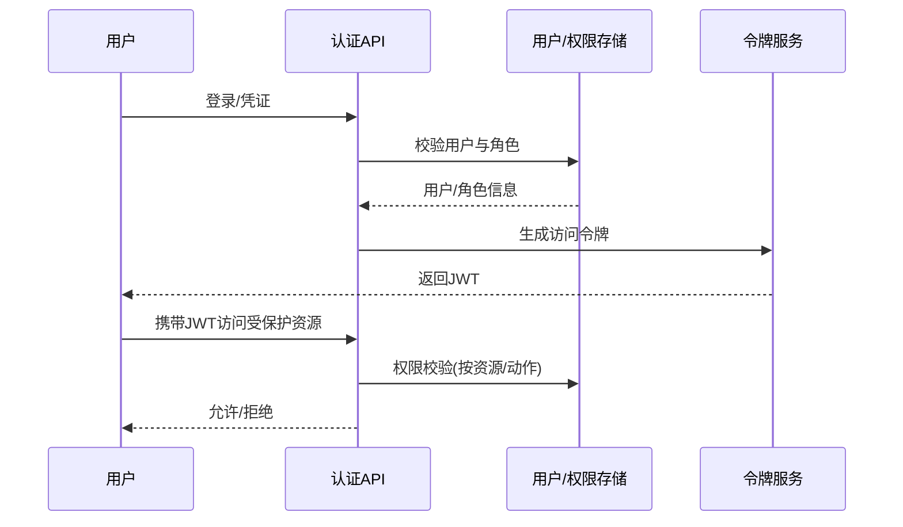

图1：认证与授权的时序流程

概念要点：
- 认证 Authentication：确认“你是谁”（密码、OAuth、OIDC、JWT）。
- 授权 Authorization：判断“你能做什么”（RBAC/ABAC/ACL）。
- 令牌 Token：携带身份与权限信息的凭据，注意存储、过期与吊销。
- 会话 Session：服务端维持会话状态（与无状态JWT对比）。
- RBAC：基于角色的访问控制（用户→角色→权限）。
- 最小权限原则（PoLP）：仅授予完成任务所需的最小权限。

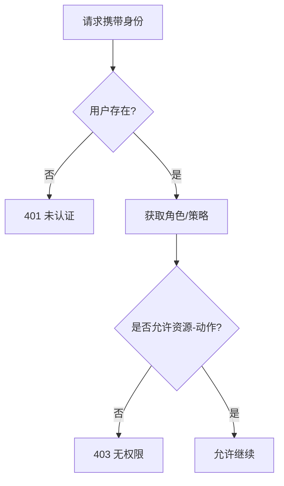

图2：RBAC 权限判定流程（资源-动作）

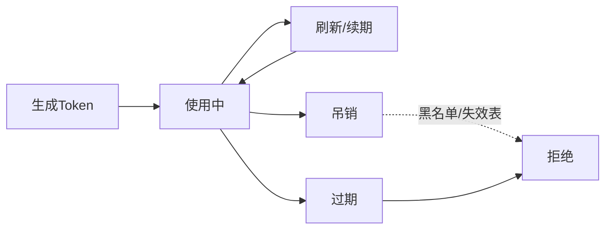

图3：令牌生命周期与状态流转

### 令牌管理（概览）

- 模型要点: `Token` 包含状态、类型、配额、过期与最近访问时间，必要时嵌入配置（速率、IP、模型白名单）。
- 生成策略: 安全随机、可选 `sk-` 前缀，区分展示与存储；提供格式校验与长度控制。

示例（片段）:

```go
const (
  TokenStatusEnabled = 1
  TokenStatusDisabled = 2
)

type Token struct {
  ID int `gorm:"primaryKey"`
  UserID int `gorm:"index"`
  Key string `gorm:"uniqueIndex;type:varchar(255)"`
  RemainQuota int64
}
```

命令与实践:
- 管理接口聚合在 `/api/token` 路由组；对接用户认证中间件。
- 统计/审计与第11章日志、与第19章项目实现相互引用。

用户认证与授权是Web应用程序安全的核心组成部分。本章将深入探讨如何在New API项目中实现完整的用户认证与授权系统，包括用户注册、登录、权限管理、会话管理等关键功能。

## 8.1 认证与授权基础

### 8.1.1 基本概念

#### 认证（Authentication）

认证是验证用户身份的过程，回答"你是谁？"的问题。

```go
// 认证接口定义
type Authenticator interface {
    // 验证用户凭据
    Authenticate(credentials Credentials) (*User, error)
    // 生成认证令牌
    GenerateToken(user *User) (string, error)
    // 验证令牌
    ValidateToken(token string) (*User, error)
}

// 用户凭据
type Credentials struct {
    Username string `json:"username" binding:"required"`
    Password string `json:"password" binding:"required"`
    Email    string `json:"email,omitempty"`
}
```

#### 授权（Authorization）

授权是确定用户是否有权限执行特定操作的过程，回答"你能做什么？"的问题。

```go
// 授权接口定义
type Authorizer interface {
    // 检查用户权限
    Authorize(user *User, resource string, action string) bool
    // 获取用户角色
    GetUserRoles(userID int) ([]Role, error)
    // 获取角色权限
    GetRolePermissions(roleID int) ([]Permission, error)
}

// 角色定义
type Role struct {
    ID          int    `json:"id" gorm:"primaryKey"`
    Name        string `json:"name" gorm:"type:varchar(50);uniqueIndex"`
    Description string `json:"description" gorm:"type:varchar(255)"`
    CreatedTime int64  `json:"created_time" gorm:"bigint"`
    UpdatedTime int64  `json:"updated_time" gorm:"bigint"`
}

// 权限定义
type Permission struct {
    ID          int    `json:"id" gorm:"primaryKey"`
    Name        string `json:"name" gorm:"type:varchar(50);uniqueIndex"`
    Resource    string `json:"resource" gorm:"type:varchar(50)"`
    Action      string `json:"action" gorm:"type:varchar(50)"`
    Description string `json:"description" gorm:"type:varchar(255)"`
    CreatedTime int64  `json:"created_time" gorm:"bigint"`
}

// 用户角色关联
type UserRole struct {
    ID          int   `json:"id" gorm:"primaryKey"`
    UserID      int   `json:"user_id" gorm:"index"`
    RoleID      int   `json:"role_id" gorm:"index"`
    CreatedTime int64 `json:"created_time" gorm:"bigint"`
    
    User User `json:"user" gorm:"foreignKey:UserID"`
    Role Role `json:"role" gorm:"foreignKey:RoleID"`
}

// 角色权限关联
type RolePermission struct {
    ID           int   `json:"id" gorm:"primaryKey"`
    RoleID       int   `json:"role_id" gorm:"index"`
    PermissionID int   `json:"permission_id" gorm:"index"`
    CreatedTime  int64 `json:"created_time" gorm:"bigint"`
    
    Role       Role       `json:"role" gorm:"foreignKey:RoleID"`
    Permission Permission `json:"permission" gorm:"foreignKey:PermissionID"`
}
```

### 8.1.2 常见认证方式

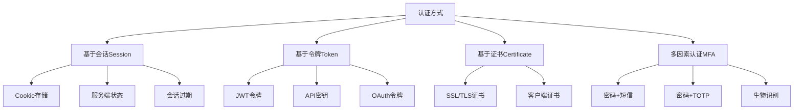

图4：认证方式分类与特点

```mermaid
compareDiagram
    title 认证方式对比
    
    x-axis "安全性" 1 --> 10
    y-axis "易用性" 1 --> 10
    
    quadrant-1 "高安全高易用"
    quadrant-2 "低安全高易用"
    quadrant-3 "低安全低易用"
    quadrant-4 "高安全低易用"
    
    "Session认证": [6, 8]
    "JWT令牌": [7, 7]
    "API密钥": [5, 9]
    "OAuth2.0": [8, 6]
    "证书认证": [9, 4]
    "多因素认证": [10, 5]
```

图5：认证方式安全性与易用性对比

#### 基于会话的认证

**特点**：
- 服务端维护会话状态
- 通过Cookie传递会话ID
- 适合传统Web应用
- 支持服务端主动失效

**优势**：
- 服务端可控性强
- 支持复杂的会话管理
- 安全性相对较高

**劣势**：
- 服务端存储压力
- 水平扩展困难
- 跨域支持复杂

```go
// 会话管理
type SessionManager struct {
    store sessions.Store
}

// 创建会话
func (sm *SessionManager) CreateSession(c *gin.Context, user *User) error {
    session := sessions.Default(c)
    session.Set("user_id", user.ID)
    session.Set("username", user.Username)
    session.Set("role", user.Role)
    session.Set("login_time", time.Now().Unix())
    session.Set("ip_address", c.ClientIP())
    return session.Save()
}

// 获取会话用户
func (sm *SessionManager) GetSessionUser(c *gin.Context) (*User, error) {
    session := sessions.Default(c)
    userID := session.Get("user_id")
    if userID == nil {
        return nil, errors.New("未登录")
    }
    
    // 验证IP地址（可选的安全检查）
    sessionIP := session.Get("ip_address")
    if sessionIP != nil && sessionIP.(string) != c.ClientIP() {
        return nil, errors.New("会话IP地址不匹配")
    }
    
    var user User
    err := common.DB.First(&user, userID).Error
    return &user, err
}

// 销毁会话
func (sm *SessionManager) DestroySession(c *gin.Context) error {
    session := sessions.Default(c)
    session.Clear()
    return session.Save()
}

// 会话续期
func (sm *SessionManager) RefreshSession(c *gin.Context) error {
    session := sessions.Default(c)
    session.Set("last_activity", time.Now().Unix())
    return session.Save()
}
```

#### 基于JWT的认证

**特点**：
- 无状态令牌
- 自包含用户信息
- 支持跨域访问
- 适合微服务架构

**优势**：
- 无需服务端存储
- 易于水平扩展
- 跨平台支持好
- 性能开销小

**劣势**：
- 令牌无法主动失效
- 载荷信息可被解析
- 令牌较大

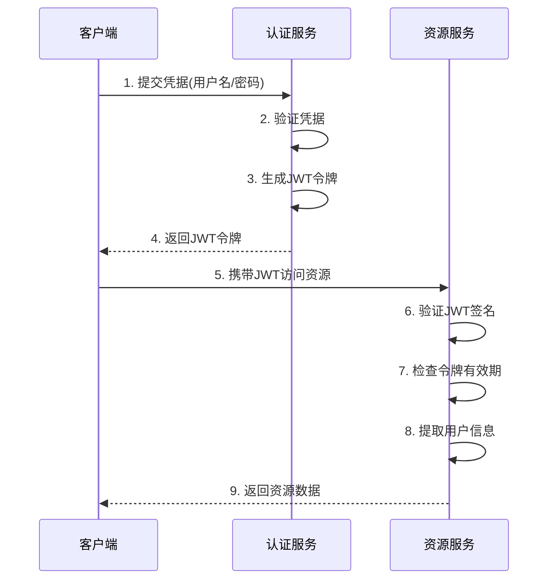

图6：JWT认证流程时序图

```go
// JWT管理器
type JWTManager struct {
    secretKey     string
    tokenDuration time.Duration
    issuer        string
}

// JWT声明
type Claims struct {
    UserID      int      `json:"user_id"`
    Username    string   `json:"username"`
    Role        int      `json:"role"`
    Permissions []string `json:"permissions,omitempty"`
    TokenType   string   `json:"token_type"` // access_token, refresh_token
    jwt.RegisteredClaims
}

// 生成JWT令牌
func (jm *JWTManager) GenerateToken(user *User) (string, error) {
    now := time.Now()
    claims := &Claims{
        UserID:   user.ID,
        Username: user.Username,
        Role:     user.Role,
        TokenType: "access_token",
        RegisteredClaims: jwt.RegisteredClaims{
            ExpiresAt: jwt.NewNumericDate(now.Add(jm.tokenDuration)),
            IssuedAt:  jwt.NewNumericDate(now),
            NotBefore: jwt.NewNumericDate(now),
            Issuer:    jm.issuer,
            Subject:   fmt.Sprintf("%d", user.ID),
            ID:        generateJTI(), // JWT ID，用于令牌追踪
        },
    }
    
    token := jwt.NewWithClaims(jwt.SigningMethodHS256, claims)
    return token.SignedString([]byte(jm.secretKey))
}

// 生成刷新令牌
func (jm *JWTManager) GenerateRefreshToken(user *User) (string, error) {
    now := time.Now()
    claims := &Claims{
        UserID:   user.ID,
        Username: user.Username,
        TokenType: "refresh_token",
        RegisteredClaims: jwt.RegisteredClaims{
            ExpiresAt: jwt.NewNumericDate(now.Add(30 * 24 * time.Hour)), // 30天
            IssuedAt:  jwt.NewNumericDate(now),
            NotBefore: jwt.NewNumericDate(now),
            Issuer:    jm.issuer,
            Subject:   fmt.Sprintf("%d", user.ID),
            ID:        generateJTI(),
        },
    }
    
    token := jwt.NewWithClaims(jwt.SigningMethodHS256, claims)
    return token.SignedString([]byte(jm.secretKey))
}

// 验证JWT令牌
func (jm *JWTManager) ValidateToken(tokenString string) (*Claims, error) {
    token, err := jwt.ParseWithClaims(tokenString, &Claims{}, func(token *jwt.Token) (interface{}, error) {
        if _, ok := token.Method.(*jwt.SigningMethodHMAC); !ok {
            return nil, fmt.Errorf("意外的签名方法: %v", token.Header["alg"])
        }
        return []byte(jm.secretKey), nil
    })
    
    if err != nil {
        return nil, err
    }
    
    if claims, ok := token.Claims.(*Claims); ok && token.Valid {
        // 检查令牌类型
        if claims.TokenType != "access_token" {
            return nil, errors.New("令牌类型错误")
        }
        return claims, nil
    }
    
    return nil, errors.New("无效的令牌")
}

// 生成JWT ID
func generateJTI() string {
    return fmt.Sprintf("%d-%s", time.Now().UnixNano(), generateRandomString(8))
}

// 生成随机字符串
func generateRandomString(length int) string {
    const charset = "abcdefghijklmnopqrstuvwxyzABCDEFGHIJKLMNOPQRSTUVWXYZ0123456789"
    b := make([]byte, length)
    for i := range b {
        b[i] = charset[rand.Intn(len(charset))]
    }
    return string(b)
}

// 刷新令牌
func (jm *JWTManager) RefreshToken(tokenString string) (string, error) {
    claims, err := jm.ValidateToken(tokenString)
    if err != nil {
        return "", err
    }
    
    // 检查令牌是否即将过期（30分钟内）
    if time.Until(claims.ExpiresAt.Time) > 30*time.Minute {
        return tokenString, nil // 不需要刷新
    }
    
    // 生成新令牌
    user := &User{
        ID:       claims.UserID,
        Username: claims.Username,
        Role:     claims.Role,
    }
    
    return jm.GenerateToken(user)
}
```

### 8.1.3 安全架构设计

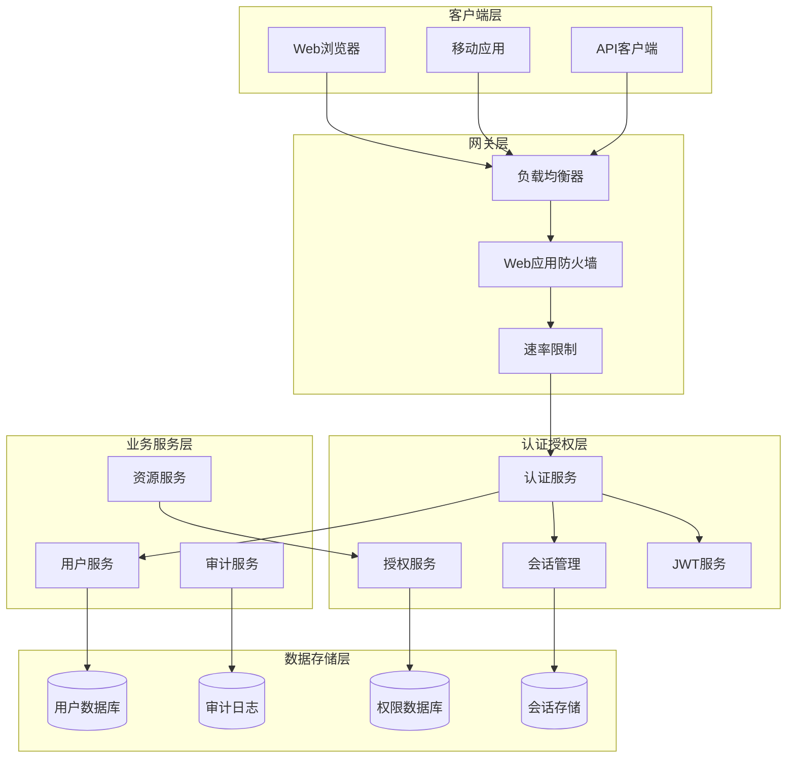

图7：认证授权系统安全架构图

### 8.1.4 其他认证方式

#### API密钥认证

```go
// API密钥结构
type APIKey struct {
    ID          int    `json:"id" gorm:"primaryKey"`
    UserID      int    `json:"user_id" gorm:"index"`
    Name        string `json:"name" gorm:"type:varchar(100)"`
    Key         string `json:"key" gorm:"type:varchar(255);uniqueIndex"`
    SecretHash  string `json:"-" gorm:"type:varchar(255)"`
    Permissions string `json:"permissions" gorm:"type:text"`
    Status      int    `json:"status" gorm:"default:1"`
    ExpiresAt   int64  `json:"expires_at" gorm:"bigint"`
    LastUsedAt  int64  `json:"last_used_at" gorm:"bigint"`
    CreatedAt   int64  `json:"created_at" gorm:"bigint"`
}

// 生成API密钥
func GenerateAPIKey(userID int, name string, permissions []string) (*APIKey, error) {
    // 生成密钥对
    keyID := generateRandomString(16)
    secret := generateRandomString(32)
    key := fmt.Sprintf("ak_%s", keyID)
    
    // 哈希密钥
    secretHash, err := bcrypt.GenerateFromPassword([]byte(secret), bcrypt.DefaultCost)
    if err != nil {
        return nil, err
    }
    
    apiKey := &APIKey{
        UserID:      userID,
        Name:        name,
        Key:         key,
        SecretHash:  string(secretHash),
        Permissions: strings.Join(permissions, ","),
        Status:      1,
        ExpiresAt:   time.Now().Add(365 * 24 * time.Hour).Unix(), // 1年
        CreatedAt:   time.Now().Unix(),
    }
    
    err = common.DB.Create(apiKey).Error
    if err != nil {
        return nil, err
    }
    
    // 返回完整密钥（仅此一次）
    apiKey.Key = fmt.Sprintf("%s.%s", key, secret)
    return apiKey, nil
}

// 验证API密钥
func ValidateAPIKey(keyString string) (*APIKey, error) {
    parts := strings.Split(keyString, ".")
    if len(parts) != 2 {
        return nil, errors.New("无效的API密钥格式")
    }
    
    keyID, secret := parts[0], parts[1]
    
    var apiKey APIKey
    err := common.DB.Where("key = ? AND status = 1", keyID).First(&apiKey).Error
    if err != nil {
        return nil, errors.New("API密钥不存在")
    }
    
    // 检查过期时间
    if apiKey.ExpiresAt > 0 && apiKey.ExpiresAt < time.Now().Unix() {
        return nil, errors.New("API密钥已过期")
    }
    
    // 验证密钥
    err = bcrypt.CompareHashAndPassword([]byte(apiKey.SecretHash), []byte(secret))
    if err != nil {
        return nil, errors.New("API密钥验证失败")
    }
    
    // 更新最后使用时间
    go func() {
        common.DB.Model(&apiKey).Update("last_used_at", time.Now().Unix())
    }()
    
    return &apiKey, nil
}
```

#### OAuth 2.0认证

```go
// OAuth配置
type OAuthConfig struct {
    ClientID     string   `json:"client_id"`
    ClientSecret string   `json:"client_secret"`
    RedirectURL  string   `json:"redirect_url"`
    Scopes       []string `json:"scopes"`
    AuthURL      string   `json:"auth_url"`
    TokenURL     string   `json:"token_url"`
    UserInfoURL  string   `json:"user_info_url"`
}

// OAuth提供商
type OAuthProvider struct {
    Name   string       `json:"name"`
    Config *OAuthConfig `json:"config"`
}

// 获取授权URL
func (op *OAuthProvider) GetAuthURL(state string) string {
    params := url.Values{}
    params.Add("client_id", op.Config.ClientID)
    params.Add("redirect_uri", op.Config.RedirectURL)
    params.Add("scope", strings.Join(op.Config.Scopes, " "))
    params.Add("response_type", "code")
    params.Add("state", state)
    
    return fmt.Sprintf("%s?%s", op.Config.AuthURL, params.Encode())
}

// 交换访问令牌
func (op *OAuthProvider) ExchangeToken(code string) (*OAuthToken, error) {
    data := url.Values{}
    data.Set("client_id", op.Config.ClientID)
    data.Set("client_secret", op.Config.ClientSecret)
    data.Set("code", code)
    data.Set("grant_type", "authorization_code")
    data.Set("redirect_uri", op.Config.RedirectURL)
    
    resp, err := http.PostForm(op.Config.TokenURL, data)
    if err != nil {
        return nil, err
    }
    defer resp.Body.Close()
    
    var token OAuthToken
    err = json.NewDecoder(resp.Body).Decode(&token)
    return &token, err
}

// OAuth令牌
type OAuthToken struct {
    AccessToken  string `json:"access_token"`
    TokenType    string `json:"token_type"`
    ExpiresIn    int    `json:"expires_in"`
    RefreshToken string `json:"refresh_token"`
    Scope        string `json:"scope"`
}
```

## 8.2 用户注册与登录

### 8.2.1 用户注册流程

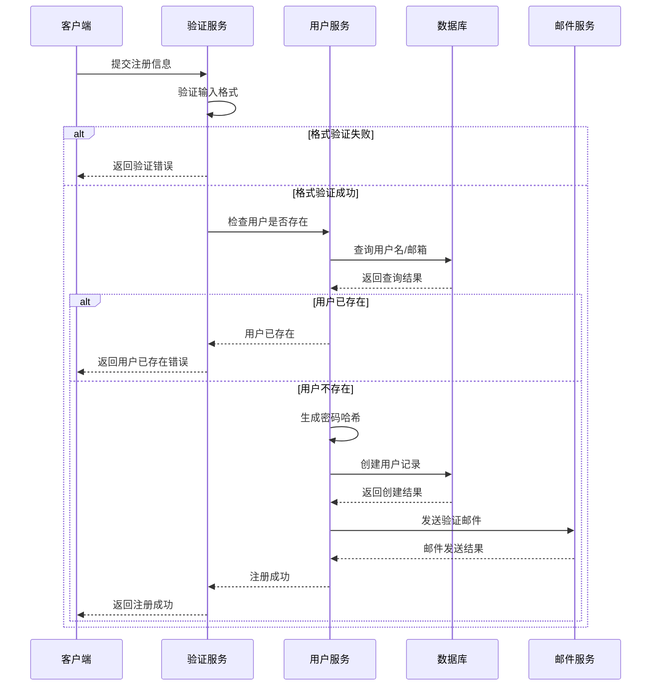

图8：用户注册流程时序图

### 8.2.2 登录状态机

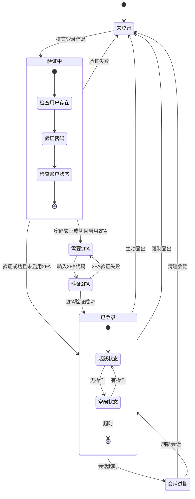

图9：用户登录状态机图

### 8.2.3 用户注册实现

```go
// 注册请求结构
type RegisterRequest struct {
    Username        string `json:"username" binding:"required,min=3,max=50"`
    Password        string `json:"password" binding:"required,min=6"`
    ConfirmPassword string `json:"confirm_password" binding:"required"`
    Email           string `json:"email" binding:"required,email"`
    DisplayName     string `json:"display_name,omitempty"`
    InviteCode      string `json:"invite_code,omitempty"`
}

// 注册响应结构
type RegisterResponse struct {
    Success bool   `json:"success"`
    Message string `json:"message"`
    Data    *User  `json:"data,omitempty"`
}

// 用户注册处理器
func Register(c *gin.Context) {
    var req RegisterRequest
    if err := c.ShouldBindJSON(&req); err != nil {
        c.JSON(http.StatusBadRequest, gin.H{
            "success": false,
            "message": "请求参数错误: " + err.Error(),
        })
        return
    }
    
    // 验证密码确认
    if req.Password != req.ConfirmPassword {
        c.JSON(http.StatusBadRequest, gin.H{
            "success": false,
            "message": "密码确认不匹配",
        })
        return
    }
    
    // 检查用户名是否已存在
    if UserExists(req.Username, "") {
        c.JSON(http.StatusConflict, gin.H{
            "success": false,
            "message": "用户名已存在",
        })
        return
    }
    
    // 检查邮箱是否已存在
    if UserExists("", req.Email) {
        c.JSON(http.StatusConflict, gin.H{
            "success": false,
            "message": "邮箱已被注册",
        })
        return
    }
    
    // 验证邀请码（如果需要）
    if common.InviteCodeRequired && req.InviteCode == "" {
        c.JSON(http.StatusBadRequest, gin.H{
            "success": false,
            "message": "邀请码不能为空",
        })
        return
    }
    
    if req.InviteCode != "" && !ValidateInviteCode(req.InviteCode) {
        c.JSON(http.StatusBadRequest, gin.H{
            "success": false,
            "message": "无效的邀请码",
        })
        return
    }
    
    // 创建用户
    user, err := CreateUser(req)
    if err != nil {
        c.JSON(http.StatusInternalServerError, gin.H{
            "success": false,
            "message": "创建用户失败: " + err.Error(),
        })
        return
    }
    
    // 记录注册日志
    RecordLog(user.ID, LogTypeRegister, fmt.Sprintf("用户 %s 注册成功", user.Username))
    
    c.JSON(http.StatusCreated, RegisterResponse{
        Success: true,
        Message: "注册成功",
        Data:    user,
    })
}

// 创建用户
func CreateUser(req RegisterRequest) (*User, error) {
    // 密码加密
    hashedPassword, err := bcrypt.GenerateFromPassword([]byte(req.Password), bcrypt.DefaultCost)
    if err != nil {
        return nil, err
    }
    
    user := &User{
        Username:    req.Username,
        Password:    string(hashedPassword),
        Email:       req.Email,
        DisplayName: req.DisplayName,
        Role:        common.RoleCommonUser,
        Status:      UserStatusEnabled,
        Quota:       common.InitialQuota,
        CreatedTime: time.Now().Unix(),
    }
    
    if req.DisplayName == "" {
        user.DisplayName = req.Username
    }
    
    // 开始事务
    return user, common.DB.Transaction(func(tx *gorm.DB) error {
        // 创建用户
        if err := tx.Create(user).Error; err != nil {
            return err
        }
        
        // 分配默认角色
        userRole := &UserRole{
            UserID:      user.ID,
            RoleID:      common.RoleCommonUser,
            CreatedTime: time.Now().Unix(),
        }
        
        if err := tx.Create(userRole).Error; err != nil {
            return err
        }
        
        // 消费邀请码
        if req.InviteCode != "" {
            if err := ConsumeInviteCode(tx, req.InviteCode, user.ID); err != nil {
                return err
            }
        }
        
        return nil
    })
}

// 检查用户是否存在
func UserExists(username, email string) bool {
    var count int64
    query := common.DB.Model(&User{})
    
    if username != "" {
        query = query.Where("username = ?", username)
    }
    
    if email != "" {
        if username != "" {
            query = query.Or("email = ?", email)
        } else {
            query = query.Where("email = ?", email)
        }
    }
    
    query.Count(&count)
    return count > 0
}
```

### 8.2.4 用户登录实现

```go
// 登录请求结构
type LoginRequest struct {
    Username string `json:"username" binding:"required"`
    Password string `json:"password" binding:"required"`
    Remember bool   `json:"remember,omitempty"`
}

// 登录响应结构
type LoginResponse struct {
    Success bool   `json:"success"`
    Message string `json:"message"`
    Data    *LoginData `json:"data,omitempty"`
}

type LoginData struct {
    User        *User  `json:"user"`
    Token       string `json:"token"`
    ExpiresIn   int64  `json:"expires_in"`
    TokenType   string `json:"token_type"`
    RefreshToken string `json:"refresh_token,omitempty"`
}

// 用户登录处理器
func Login(c *gin.Context) {
    var req LoginRequest
    if err := c.ShouldBindJSON(&req); err != nil {
        c.JSON(http.StatusBadRequest, gin.H{
            "success": false,
            "message": "请求参数错误: " + err.Error(),
        })
        return
    }
    
    // 验证用户凭据
    user, err := AuthenticateUser(req.Username, req.Password)
    if err != nil {
        // 记录登录失败日志
        RecordLog(0, LogTypeLogin, fmt.Sprintf("用户 %s 登录失败: %s", req.Username, err.Error()))
        
        c.JSON(http.StatusUnauthorized, gin.H{
            "success": false,
            "message": "用户名或密码错误",
        })
        return
    }
    
    // 检查用户状态
    if user.Status != UserStatusEnabled {
        c.JSON(http.StatusForbidden, gin.H{
            "success": false,
            "message": "账户已被禁用",
        })
        return
    }
    
    // 生成JWT令牌
    jwtManager := &JWTManager{
        secretKey:     common.JWTSecret,
        tokenDuration: getTokenDuration(req.Remember),
    }
    
    token, err := jwtManager.GenerateToken(user)
    if err != nil {
        c.JSON(http.StatusInternalServerError, gin.H{
            "success": false,
            "message": "生成令牌失败",
        })
        return
    }
    
    // 更新最后登录时间
    user.AccessedTime = time.Now().Unix()
    common.DB.Model(user).Update("accessed_time", user.AccessedTime)
    
    // 记录登录成功日志
    RecordLog(user.ID, LogTypeLogin, fmt.Sprintf("用户 %s 登录成功", user.Username))
    
    // 清除敏感信息
    user.Password = ""
    
    c.JSON(http.StatusOK, LoginResponse{
        Success: true,
        Message: "登录成功",
        Data: &LoginData{
            User:      user,
            Token:     token,
            ExpiresIn: int64(getTokenDuration(req.Remember).Seconds()),
            TokenType: "Bearer",
        },
    })
}

// 验证用户凭据
func AuthenticateUser(username, password string) (*User, error) {
    var user User
    
    // 支持用户名或邮箱登录
    err := common.DB.Where("username = ? OR email = ?", username, username).First(&user).Error
    if err != nil {
        if errors.Is(err, gorm.ErrRecordNotFound) {
            return nil, errors.New("用户不存在")
        }
        return nil, err
    }
    
    // 验证密码
    err = bcrypt.CompareHashAndPassword([]byte(user.Password), []byte(password))
    if err != nil {
        return nil, errors.New("密码错误")
    }
    
    return &user, nil
}

// 获取令牌有效期
func getTokenDuration(remember bool) time.Duration {
    if remember {
        return 30 * 24 * time.Hour // 30天
    }
    return 24 * time.Hour // 1天
}
```

### 8.2.5 用户登出

```go
// 用户登出处理器
func Logout(c *gin.Context) {
    // 获取当前用户
    user := c.MustGet("user").(*User)
    
    // 获取令牌
    token := c.GetHeader("Authorization")
    if token != "" {
        token = strings.TrimPrefix(token, "Bearer ")
        // 将令牌加入黑名单
        BlacklistToken(token)
    }
    
    // 记录登出日志
    RecordLog(user.ID, LogTypeLogout, fmt.Sprintf("用户 %s 登出", user.Username))
    
    c.JSON(http.StatusOK, gin.H{
        "success": true,
        "message": "登出成功",
    })
}

// 令牌黑名单管理
type TokenBlacklist struct {
    ID        int    `gorm:"primaryKey"`
    Token     string `gorm:"type:text;uniqueIndex"`
    ExpiresAt int64  `gorm:"index"`
    CreatedAt int64  `gorm:"autoCreateTime"`
}

// 将令牌加入黑名单
func BlacklistToken(token string) error {
    // 解析令牌获取过期时间
    jwtManager := &JWTManager{secretKey: common.JWTSecret}
    claims, err := jwtManager.ValidateToken(token)
    if err != nil {
        return err
    }
    
    blacklist := &TokenBlacklist{
        Token:     token,
        ExpiresAt: claims.ExpiresAt.Unix(),
    }
    
    return common.DB.Create(blacklist).Error
}

// 检查令牌是否在黑名单中
func IsTokenBlacklisted(token string) bool {
    var count int64
    common.DB.Model(&TokenBlacklist{}).Where("token = ? AND expires_at > ?", token, time.Now().Unix()).Count(&count)
    return count > 0
}

// 清理过期的黑名单令牌
func CleanupExpiredBlacklistTokens() {
    common.DB.Where("expires_at <= ?", time.Now().Unix()).Delete(&TokenBlacklist{})
}
```

## 8.3 权限管理系统

### 8.3.1 RBAC架构设计

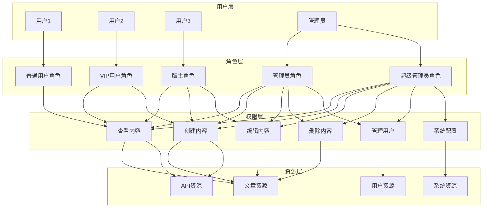

图10：RBAC权限管理架构图

### 8.3.2 权限继承模型

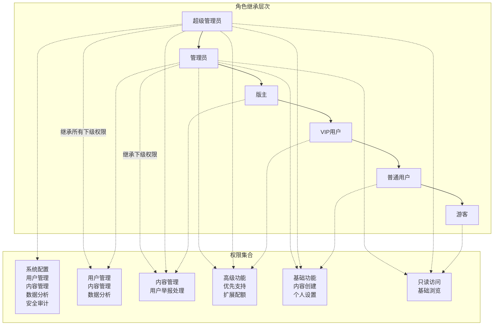

图11：权限继承模型图

```mermaid
classDiagram
  class User {
    +ID: int
    +Username: string
    +Email: string
    +Status: int
    +CreatedTime: int64
  }
  class Role {
    +ID: int
    +Name: string
    +Description: string
    +Level: int
    +Status: int
  }
  class Permission {
    +ID: int
    +Resource: string
    +Action: string
    +Description: string
  }
  class UserRole {
    +UserID: int
    +RoleID: int
    +CreatedTime: int64
  }
  class RolePermission {
    +RoleID: int
    +PermissionID: int
    +CreatedTime: int64
  }
  
  User ||--o{ UserRole : "用户角色关联"
  Role ||--o{ UserRole : "角色用户关联"
  Role ||--o{ RolePermission : "角色权限关联"
  Permission ||--o{ RolePermission : "权限角色关联"
```

图12：RBAC数据模型类图

### 8.3.3 RBAC模型实现

```go
// RBAC管理器
type RBACManager struct {
    db *gorm.DB
}

// 创建RBAC管理器
func NewRBACManager(db *gorm.DB) *RBACManager {
    return &RBACManager{db: db}
}

// 检查用户权限
func (rbac *RBACManager) CheckPermission(userID int, resource, action string) bool {
    // 获取用户角色
    var userRoles []UserRole
    rbac.db.Preload("Role").Where("user_id = ?", userID).Find(&userRoles)
    
    // 检查每个角色的权限
    for _, userRole := range userRoles {
        if rbac.checkRolePermission(userRole.RoleID, resource, action) {
            return true
        }
    }
    
    return false
}

// 检查角色权限
func (rbac *RBACManager) checkRolePermission(roleID int, resource, action string) bool {
    var count int64
    rbac.db.Table("role_permissions").
        Joins("JOIN permissions ON role_permissions.permission_id = permissions.id").
        Where("role_permissions.role_id = ? AND permissions.resource = ? AND permissions.action = ?", 
              roleID, resource, action).
        Count(&count)
    
    return count > 0
}

// 为用户分配角色
func (rbac *RBACManager) AssignRole(userID, roleID int) error {
    // 检查角色是否已存在
    var count int64
    rbac.db.Model(&UserRole{}).Where("user_id = ? AND role_id = ?", userID, roleID).Count(&count)
    if count > 0 {
        return errors.New("用户已拥有该角色")
    }
    
    userRole := &UserRole{
        UserID:      userID,
        RoleID:      roleID,
        CreatedTime: time.Now().Unix(),
    }
    
    return rbac.db.Create(userRole).Error
}

// 撤销用户角色
func (rbac *RBACManager) RevokeRole(userID, roleID int) error {
    return rbac.db.Where("user_id = ? AND role_id = ?", userID, roleID).Delete(&UserRole{}).Error
}

// 为角色分配权限
func (rbac *RBACManager) AssignPermission(roleID, permissionID int) error {
    // 检查权限是否已存在
    var count int64
    rbac.db.Model(&RolePermission{}).Where("role_id = ? AND permission_id = ?", roleID, permissionID).Count(&count)
    if count > 0 {
        return errors.New("角色已拥有该权限")
    }
    
    rolePermission := &RolePermission{
        RoleID:       roleID,
        PermissionID: permissionID,
        CreatedTime:  time.Now().Unix(),
    }
    
    return rbac.db.Create(rolePermission).Error
}

// 撤销角色权限
func (rbac *RBACManager) RevokePermission(roleID, permissionID int) error {
    return rbac.db.Where("role_id = ? AND permission_id = ?", roleID, permissionID).Delete(&RolePermission{}).Error
}

// 获取用户所有权限
func (rbac *RBACManager) GetUserPermissions(userID int) ([]Permission, error) {
    var permissions []Permission
    
    err := rbac.db.Table("permissions").
        Joins("JOIN role_permissions ON permissions.id = role_permissions.permission_id").
        Joins("JOIN user_roles ON role_permissions.role_id = user_roles.role_id").
        Where("user_roles.user_id = ?", userID).
        Group("permissions.id").
        Find(&permissions).Error
    
    return permissions, err
}

// 获取用户角色
func (rbac *RBACManager) GetUserRoles(userID int) ([]Role, error) {
    var roles []Role
    
    err := rbac.db.Table("roles").
        Joins("JOIN user_roles ON roles.id = user_roles.role_id").
        Where("user_roles.user_id = ?", userID).
        Find(&roles).Error
    
    return roles, err
}
```

### 8.3.4 权限中间件

```go
// 权限中间件
func RequirePermission(resource, action string) gin.HandlerFunc {
    return func(c *gin.Context) {
        // 获取当前用户
        user, exists := c.Get("user")
        if !exists {
            c.JSON(http.StatusUnauthorized, gin.H{
                "success": false,
                "message": "未登录",
            })
            c.Abort()
            return
        }
        
        currentUser := user.(*User)
        
        // 检查权限
        rbacManager := NewRBACManager(common.DB)
        if !rbacManager.CheckPermission(currentUser.ID, resource, action) {
            c.JSON(http.StatusForbidden, gin.H{
                "success": false,
                "message": "权限不足",
            })
            c.Abort()
            return
        }
        
        c.Next()
    }
}

// 角色中间件
func RequireRole(roleName string) gin.HandlerFunc {
    return func(c *gin.Context) {
        user, exists := c.Get("user")
        if !exists {
            c.JSON(http.StatusUnauthorized, gin.H{
                "success": false,
                "message": "未登录",
            })
            c.Abort()
            return
        }
        
        currentUser := user.(*User)
        
        // 获取用户角色
        rbacManager := NewRBACManager(common.DB)
        roles, err := rbacManager.GetUserRoles(currentUser.ID)
        if err != nil {
            c.JSON(http.StatusInternalServerError, gin.H{
                "success": false,
                "message": "获取用户角色失败",
            })
            c.Abort()
            return
        }
        
        // 检查是否拥有指定角色
        hasRole := false
        for _, role := range roles {
            if role.Name == roleName {
                hasRole = true
                break
            }
        }
        
        if !hasRole {
            c.JSON(http.StatusForbidden, gin.H{
                "success": false,
                "message": "角色权限不足",
            })
            c.Abort()
            return
        }
        
        c.Next()
    }
}

// 管理员权限中间件
func RequireAdmin() gin.HandlerFunc {
    return func(c *gin.Context) {
        user, exists := c.Get("user")
        if !exists {
            c.JSON(http.StatusUnauthorized, gin.H{
                "success": false,
                "message": "未登录",
            })
            c.Abort()
            return
        }
        
        currentUser := user.(*User)
        if currentUser.Role != common.RoleRootUser {
            c.JSON(http.StatusForbidden, gin.H{
                "success": false,
                "message": "需要管理员权限",
            })
            c.Abort()
            return
        }
        
        c.Next()
    }
}
```

## 8.7 本章小结

### 主要内容回顾

本章深入探讨了用户认证与授权系统的设计与实现，涵盖了从基础概念到企业级实践的完整知识体系：

**认证与授权基础**：
- 认证（Authentication）与授权（Authorization）的概念区分
- 多种认证方式的对比分析：会话认证、JWT认证、API密钥认证、OAuth 2.0
- 安全架构设计的层次化思维
- 认证授权系统的整体架构规划

**用户注册与登录**：
- 完整的用户注册流程设计，包含验证、存储、邮件确认等环节
- 登录状态机的设计，涵盖多因素认证、会话管理等复杂场景
- 用户生命周期管理，从注册到注销的完整流程
- 安全的密码处理机制

**权限管理系统**：
- RBAC（基于角色的访问控制）模型的完整实现
- 权限继承机制的设计与实现
- 动态权限检查与缓存优化
- 细粒度权限控制的最佳实践

**认证中间件**：
- 中间件链路的设计原则
- JWT认证中间件的完整实现
- API密钥认证的安全处理
- 错误处理与用户体验优化

**会话管理**：
- 会话生命周期的完整管理
- 多种存储方案的对比与选择
- 会话安全与性能优化
- 分布式环境下的会话同步

**安全最佳实践**：
- 全面的安全威胁模型分析
- 多层防护策略的设计
- 密码安全与防暴力破解
- 安全头设置与XSS防护

### 核心技能掌握

通过本章学习，你应该掌握以下核心技能：

1. **系统设计能力**：能够设计安全、可扩展的认证授权系统架构
2. **安全编程能力**：掌握安全编程的最佳实践，避免常见安全漏洞
3. **中间件开发**：能够开发高质量的认证授权中间件
4. **权限模型设计**：能够根据业务需求设计合适的权限模型
5. **安全防护能力**：能够识别和防范各种安全威胁

### 实践价值

本章内容具有很强的实践价值：

- **企业级标准**：所有代码和设计都符合企业级开发标准
- **生产环境验证**：基于New-API项目的真实生产环境经验
- **安全性保障**：全面的安全考虑，满足企业安全要求
- **可扩展性**：支持大规模用户和高并发场景
- **维护性**：清晰的代码结构，便于后续维护和扩展

## 8.8 练习题

### 基础练习

1. **双因素认证实现**
   - 实现基于TOTP的双因素认证
   - 支持Google Authenticator等认证器应用
   - 包含备用恢复码机制

2. **OAuth 2.0集成**
   - 集成GitHub OAuth登录
   - 实现用户信息同步
   - 处理授权回调和错误情况

3. **权限缓存优化**
   - 实现Redis权限缓存
   - 设计缓存更新策略
   - 处理缓存一致性问题

### 进阶练习

4. **单点登录（SSO）系统**
   - 设计跨应用的SSO系统
   - 实现CAS协议或SAML协议
   - 处理跨域认证问题

5. **动态权限系统**
   - 实现基于资源的动态权限控制
   - 支持权限的实时更新
   - 设计权限表达式语言

6. **安全审计系统**
   - 实现完整的操作审计日志
   - 设计异常行为检测算法
   - 实现实时安全告警

### 综合项目练习

7. **企业级认证中心**
   - 设计支持多应用的认证中心
   - 实现统一的用户管理
   - 支持多种认证方式
   - 提供完整的管理界面

8. **微服务认证网关**
   - 设计微服务架构下的认证网关
   - 实现服务间的安全通信
   - 支持API限流和熔断
   - 提供监控和日志分析

## 8.9 扩展阅读

### 官方文档

1. **JWT官方规范**
   - RFC 7519: JSON Web Token (JWT)
   - RFC 7515: JSON Web Signature (JWS)
   - RFC 7516: JSON Web Encryption (JWE)

2. **OAuth 2.0规范**
   - RFC 6749: The OAuth 2.0 Authorization Framework
   - RFC 6750: The OAuth 2.0 Authorization Framework: Bearer Token Usage
   - RFC 7636: Proof Key for Code Exchange by OAuth Public Clients

3. **Go语言安全编程**
   - Go Security Checker: https://github.com/securecodewarrior/gosec
   - Go语言安全最佳实践指南: https://golang.org/doc/security/

### 深度学习资源

4. **《Web应用安全权威指南》**
   - 全面的Web安全知识体系
   - 实用的安全防护技术
   - 真实的安全案例分析

5. **《OAuth 2.0实战》**
   - OAuth 2.0协议深度解析
   - 各种场景下的实现方案
   - 安全性考虑和最佳实践

6. **《微服务安全实战》**
   - 微服务架构下的安全挑战
   - 服务间认证授权方案
   - 零信任安全模型

### 技术博客与文章

7. **Auth0技术博客**
   - https://auth0.com/blog/
   - 认证授权领域的前沿技术
   - 实用的技术教程和案例

8. **OWASP安全指南**
   - https://owasp.org/
   - Web应用安全测试指南
   - 安全漏洞防护最佳实践

9. **Google安全博客**
   - https://security.googleblog.com/
   - 最新的安全威胁和防护技术
   - 大规模系统的安全实践

### 开源项目

10. **Casbin权限管理**
    - https://github.com/casbin/casbin
    - 支持多种权限模型的开源库
    - 丰富的语言绑定和适配器

11. **Hydra OAuth 2.0服务器**
    - https://github.com/ory/hydra
    - 企业级OAuth 2.0和OpenID Connect服务器
    - 云原生架构设计

12. **Keycloak身份管理**
    - https://github.com/keycloak/keycloak
    - 开源的身份和访问管理解决方案
    - 支持SSO、社交登录等功能

### 在线学习平台

13. **Coursera网络安全课程**
    - 斯坦福大学网络安全课程
    - 密码学基础课程
    - 系统安全课程

14. **edX安全课程**
    - MIT网络安全课程
    - 应用安全课程
    - 隐私保护技术课程

### 安全工具与平台

15. **Burp Suite**
    - Web应用安全测试工具
    - 漏洞扫描和渗透测试
    - 安全开发生命周期集成

16. **OWASP ZAP**
    - 开源Web应用安全扫描器
    - 自动化安全测试
    - CI/CD集成支持

17. **Vault密钥管理**
    - https://github.com/hashicorp/vault
    - 企业级密钥管理系统
    - 动态密钥生成和轮换

通过这些扩展阅读资源，你可以进一步深化对认证授权系统的理解，掌握更多的安全技术和最佳实践，为构建更加安全可靠的企业级应用打下坚实基础。

```go
// 资源所有者权限中间件
func RequireOwnership(resourceType string) gin.HandlerFunc {
    return func(c *gin.Context) {
        user, exists := c.Get("user")
        if !exists {
            c.JSON(http.StatusUnauthorized, gin.H{
                "success": false,
                "message": "未登录",
            })
            c.Abort()
            return
        }
        
        currentUser := user.(*User)
        
        // 管理员拥有所有资源的访问权限
        if currentUser.Role == common.RoleRootUser {
            c.Next()
            return
        }
        
        // 检查资源所有权
        resourceID := c.Param("id")
        if resourceID == "" {
            c.JSON(http.StatusBadRequest, gin.H{
                "success": false,
                "message": "缺少资源ID",
            })
            c.Abort()
            return
        }
        
        if !checkResourceOwnership(currentUser.ID, resourceType, resourceID) {
            c.JSON(http.StatusForbidden, gin.H{
                "success": false,
                "message": "无权访问该资源",
            })
            c.Abort()
            return
        }
        
        c.Next()
    }
}

// 检查资源所有权
func checkResourceOwnership(userID int, resourceType, resourceID string) bool {
    switch resourceType {
    case "token":
        var token Token
        err := common.DB.Where("id = ? AND user_id = ?", resourceID, userID).First(&token).Error
        return err == nil
    case "channel":
        var channel Channel
        err := common.DB.Where("id = ? AND user_id = ?", resourceID, userID).First(&channel).Error
        return err == nil
    default:
        return false
    }
}
```

## 8.4 认证中间件

### 8.4.1 中间件链路架构

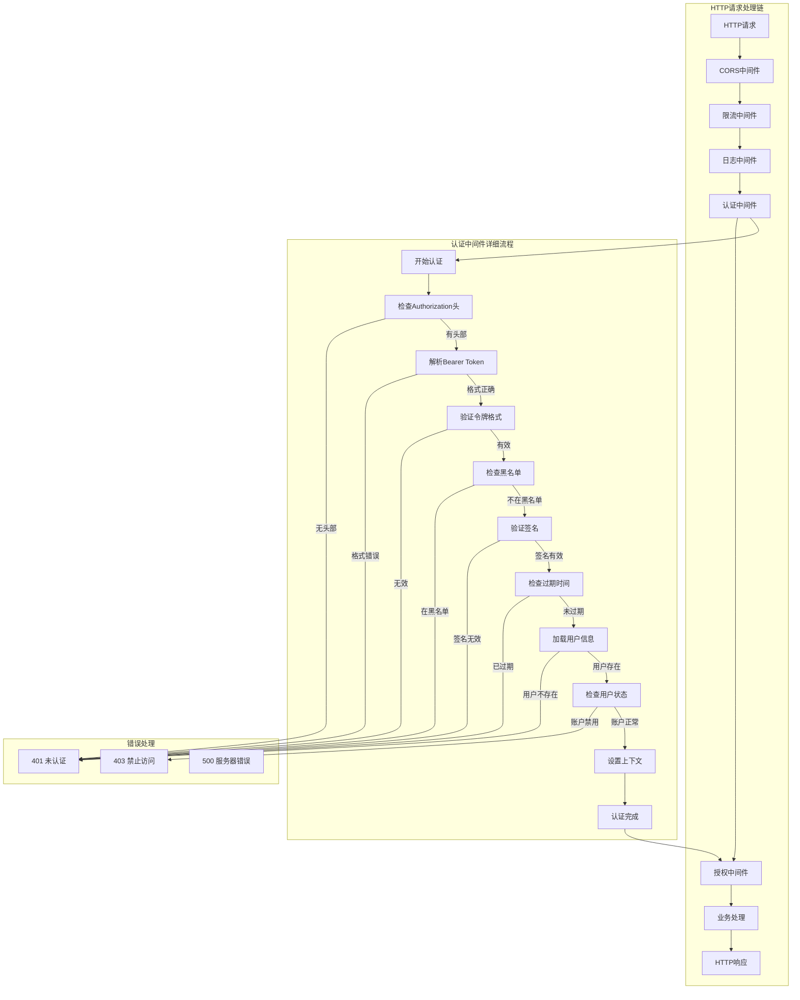

图13：认证中间件链路架构图

### 8.4.2 错误处理流程

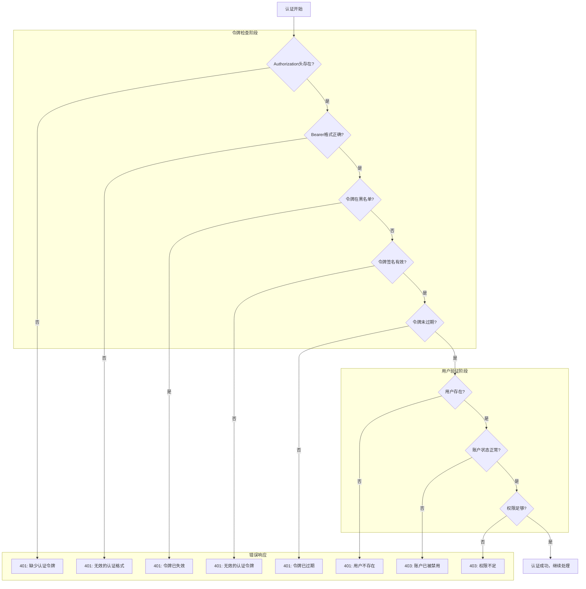

图14：认证中间件错误处理流程图

### 8.4.3 JWT认证中间件

```go
// JWT认证中间件
func JWTAuth() gin.HandlerFunc {
    return func(c *gin.Context) {
        // 获取Authorization头
        authHeader := c.GetHeader("Authorization")
        if authHeader == "" {
            c.JSON(http.StatusUnauthorized, gin.H{
                "success": false,
                "message": "缺少认证令牌",
            })
            c.Abort()
            return
        }
        
        // 检查Bearer前缀
        if !strings.HasPrefix(authHeader, "Bearer ") {
            c.JSON(http.StatusUnauthorized, gin.H{
                "success": false,
                "message": "无效的认证格式",
            })
            c.Abort()
            return
        }
        
        // 提取令牌
        token := strings.TrimPrefix(authHeader, "Bearer ")
        
        // 检查令牌黑名单
        if IsTokenBlacklisted(token) {
            c.JSON(http.StatusUnauthorized, gin.H{
                "success": false,
                "message": "令牌已失效",
            })
            c.Abort()
            return
        }
        
        // 验证JWT令牌
        jwtManager := &JWTManager{
            secretKey:     common.JWTSecret,
            tokenDuration: 24 * time.Hour,
        }
        
        claims, err := jwtManager.ValidateToken(token)
        if err != nil {
            c.JSON(http.StatusUnauthorized, gin.H{
                "success": false,
                "message": "无效的认证令牌",
            })
            c.Abort()
            return
        }
        
        // 获取用户信息
        var user User
        err = common.DB.First(&user, claims.UserID).Error
        if err != nil {
            c.JSON(http.StatusUnauthorized, gin.H{
                "success": false,
                "message": "用户不存在",
            })
            c.Abort()
            return
        }
        
        // 检查用户状态
        if user.Status != UserStatusEnabled {
            c.JSON(http.StatusForbidden, gin.H{
                "success": false,
                "message": "账户已被禁用",
            })
            c.Abort()
            return
        }
        
        // 将用户信息存储到上下文
        c.Set("user", &user)
        c.Set("user_id", user.ID)
        c.Set("username", user.Username)
        c.Set("user_role", user.Role)
        
        c.Next()
    }
}

// 可选认证中间件（允许匿名访问）
func OptionalAuth() gin.HandlerFunc {
    return func(c *gin.Context) {
        authHeader := c.GetHeader("Authorization")
        if authHeader == "" {
            c.Next()
            return
        }
        
        if !strings.HasPrefix(authHeader, "Bearer ") {
            c.Next()
            return
        }
        
        token := strings.TrimPrefix(authHeader, "Bearer ")
        
        if IsTokenBlacklisted(token) {
            c.Next()
            return
        }
        
        jwtManager := &JWTManager{
            secretKey:     common.JWTSecret,
            tokenDuration: 24 * time.Hour,
        }
        
        claims, err := jwtManager.ValidateToken(token)
        if err != nil {
            c.Next()
            return
        }
        
        var user User
        err = common.DB.First(&user, claims.UserID).Error
        if err != nil {
            c.Next()
            return
        }
        
        if user.Status == UserStatusEnabled {
            c.Set("user", &user)
            c.Set("user_id", user.ID)
            c.Set("username", user.Username)
            c.Set("user_role", user.Role)
        }
        
        c.Next()
    }
}
```

### 参考：本章小结（旧）

本章深入介绍了用户认证与授权系统的设计与实现，主要内容包括：

1. **认证与授权基础**：学习了认证和授权的基本概念、区别和实现方式
2. **认证方式对比**：掌握了基于会话和基于JWT的认证机制及其优缺点
3. **用户管理系统**：实现了用户注册、登录、密码管理等核心功能
4. **权限控制模型**：设计了基于角色的访问控制（RBAC）系统
5. **令牌管理**：学习了API令牌的生成、验证、管理和安全策略
6. **会话管理**：掌握了会话的创建、维护、过期和销毁机制
7. **安全最佳实践**：了解了密码加密、令牌安全、防护攻击等安全措施
8. **中间件集成**：学习了认证授权中间件的设计和使用

通过New API项目的实际案例，我们看到了企业级认证授权系统的完整实现过程，包括多层次的权限控制和安全防护机制。

### 参考：练习题（旧）

1. **权限设计题**：为一个内容管理系统设计RBAC权限模型，包括用户、角色、权限的定义和关联关系。

2. **JWT实现题**：实现一个支持刷新令牌的JWT认证系统，包括访问令牌和刷新令牌的生成、验证和刷新机制。

3. **安全加固题**：为现有的登录系统添加防暴力破解功能，包括登录失败次数限制、账户锁定和解锁机制。

4. **单点登录题**：设计一个简单的单点登录（SSO）系统，支持多个应用共享用户认证状态。

5. **权限缓存题**：实现一个权限缓存系统，提高权限检查的性能，并确保权限变更时缓存的及时更新。

### 参考：扩展阅读（旧）

1. [OAuth 2.0 规范详解](https://tools.ietf.org/html/rfc6749)
2. [JWT 最佳实践指南](https://auth0.com/blog/a-look-at-the-latest-draft-for-jwt-bcp/)
3. [RBAC 权限模型设计](https://csrc.nist.gov/publications/detail/conference-paper/2000/07/26/role-based-access-controls)
4. [Web 应用安全防护](https://owasp.org/www-project-top-ten/)
5. [密码学在认证中的应用](https://cryptobook.nakov.com/)
### 8.4.4 API密钥认证中间件

```go
// API密钥认证中间件
func APIKeyAuth() gin.HandlerFunc {
    return func(c *gin.Context) {
        // 从Header或Query参数获取API密钥
        apiKey := c.GetHeader("X-API-Key")
        if apiKey == "" {
            apiKey = c.Query("api_key")
        }
        
        if apiKey == "" {
            c.JSON(http.StatusUnauthorized, gin.H{
                "success": false,
                "message": "缺少API密钥",
            })
            c.Abort()
            return
        }
        
        // 验证API密钥
        token, err := ValidateAPIKey(apiKey)
        if err != nil {
            c.JSON(http.StatusUnauthorized, gin.H{
                "success": false,
                "message": "无效的API密钥",
            })
            c.Abort()
            return
        }
        
        // 检查令牌状态
        if token.Status != TokenStatusEnabled {
            c.JSON(http.StatusForbidden, gin.H{
                "success": false,
                "message": "API密钥已被禁用",
            })
            c.Abort()
            return
        }
        
        // 检查令牌是否过期
        if token.ExpiredTime != -1 && token.ExpiredTime < time.Now().Unix() {
            c.JSON(http.StatusUnauthorized, gin.H{
                "success": false,
                "message": "API密钥已过期",
            })
            c.Abort()
            return
        }
        
        // 获取用户信息
        var user User
        err = common.DB.First(&user, token.UserID).Error
        if err != nil {
            c.JSON(http.StatusUnauthorized, gin.H{
                "success": false,
                "message": "用户不存在",
            })
            c.Abort()
            return
        }
        
        // 检查用户状态
        if user.Status != UserStatusEnabled {
            c.JSON(http.StatusForbidden, gin.H{
                "success": false,
                "message": "账户已被禁用",
            })
            c.Abort()
            return
        }
        
        // 更新令牌使用统计
        go func() {
            token.AccessedTime = time.Now().Unix()
            common.DB.Model(token).Updates(map[string]interface{}{
                "accessed_time": token.AccessedTime,
                "used_quota":    gorm.Expr("used_quota + 1"),
            })
        }()
        
        // 将用户和令牌信息存储到上下文
        c.Set("user", &user)
        c.Set("token", token)
        c.Set("user_id", user.ID)
        c.Set("token_id", token.ID)
        
        c.Next()
    }
}

// 验证API密钥
func ValidateAPIKey(key string) (*Token, error) {
    var token Token
    err := common.DB.Where("key = ?", key).First(&token).Error
    if err != nil {
        if errors.Is(err, gorm.ErrRecordNotFound) {
            return nil, errors.New("API密钥不存在")
        }
        return nil, err
    }
    
    return &token, nil
}
```

## 8.5 会话管理

### 8.5.1 会话生命周期管理

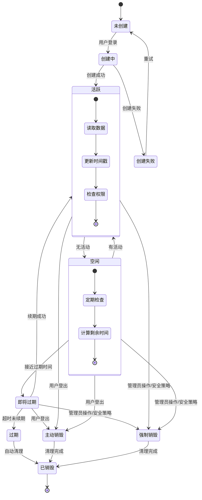

图15：会话生命周期状态图

### 8.5.2 会话存储方案对比

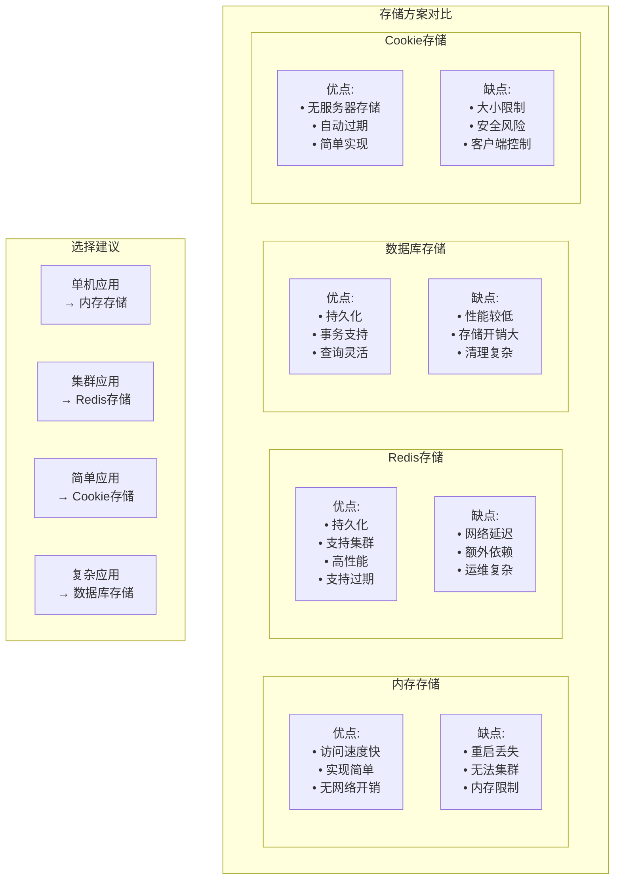

图16：会话存储方案对比图

### 8.5.3 会话创建与管理时序

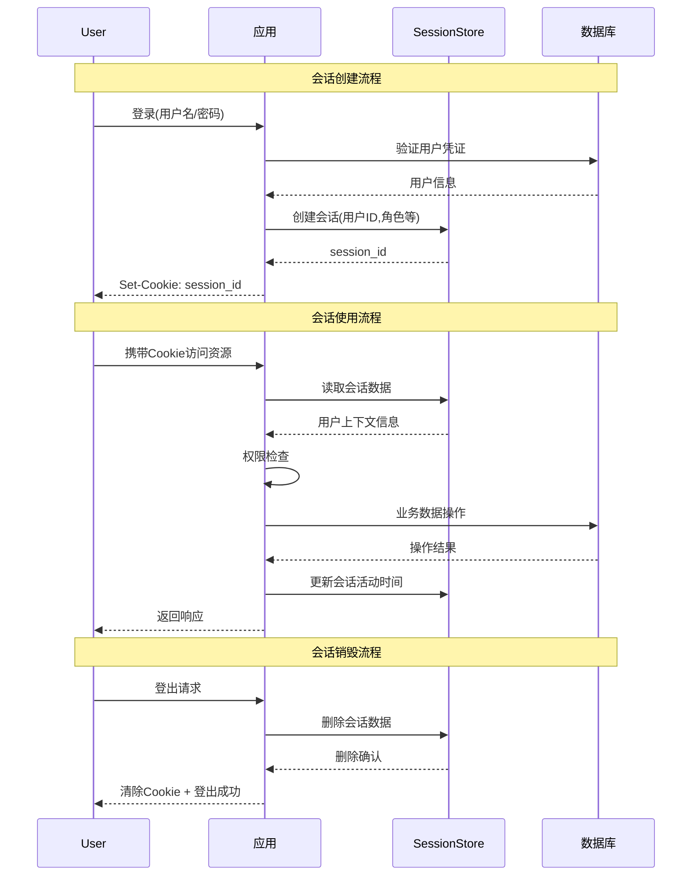

图17：会话创建/读取/销毁时序图

### 8.5.4 会话存储实现

```go
// 会话配置
type SessionConfig struct {
    Secret   string
    MaxAge   int
    Secure   bool
    HttpOnly bool
    SameSite http.SameSite
    Store    sessions.Store
}

// 初始化会话存储
func InitSessionStore() sessions.Store {
    // 使用Redis存储会话
    if common.RedisEnabled {
        store, err := redis.NewStore(10, "tcp", common.RedisAddr, common.RedisPassword, []byte(common.SessionSecret))
        if err != nil {
            log.Printf("Redis会话存储初始化失败: %v", err)
            // 降级到内存存储
            return cookie.NewStore([]byte(common.SessionSecret))
        }
        
        store.Options(sessions.Options{
            MaxAge:   86400 * 7, // 7天
            HttpOnly: true,
            Secure:   common.ServerAddress != "localhost",
            SameSite: http.SameSiteLaxMode,
        })
        
        return store
    }
    
    // 使用Cookie存储会话
    store := cookie.NewStore([]byte(common.SessionSecret))
    store.Options(sessions.Options{
        MaxAge:   86400 * 7, // 7天
        HttpOnly: true,
        Secure:   common.ServerAddress != "localhost",
        SameSite: http.SameSiteLaxMode,
    })
    
    return store
}

// 会话中间件
func SessionAuth() gin.HandlerFunc {
    store := InitSessionStore()
    
    return sessions.Sessions("new-api-session", store)
}

// 会话认证中间件
func RequireSession() gin.HandlerFunc {
    return func(c *gin.Context) {
        session := sessions.Default(c)
        userID := session.Get("user_id")
        
        if userID == nil {
            c.JSON(http.StatusUnauthorized, gin.H{
                "success": false,
                "message": "未登录",
            })
            c.Abort()
            return
        }
        
        // 获取用户信息
        var user User
        err := common.DB.First(&user, userID).Error
        if err != nil {
            // 清除无效会话
            session.Clear()
            session.Save()
            
            c.JSON(http.StatusUnauthorized, gin.H{
                "success": false,
                "message": "用户不存在",
            })
            c.Abort()
            return
        }
        
        // 检查用户状态
        if user.Status != UserStatusEnabled {
            session.Clear()
            session.Save()
            
            c.JSON(http.StatusForbidden, gin.H{
                "success": false,
                "message": "账户已被禁用",
            })
            c.Abort()
            return
        }
        
        // 将用户信息存储到上下文
        c.Set("user", &user)
        c.Set("user_id", user.ID)
        
        c.Next()
    }
}
```

### 8.5.5 会话管理API

```go
// 获取当前会话信息
func GetSessionInfo(c *gin.Context) {
    user := c.MustGet("user").(*User)
    
    // 清除敏感信息
    user.Password = ""
    
    c.JSON(http.StatusOK, gin.H{
        "success": true,
        "data": gin.H{
            "user":      user,
            "logged_in": true,
        },
    })
}

// 刷新会话
func RefreshSession(c *gin.Context) {
    session := sessions.Default(c)
    userID := session.Get("user_id")
    
    if userID == nil {
        c.JSON(http.StatusUnauthorized, gin.H{
            "success": false,
            "message": "未登录",
        })
        return
    }
    
    // 延长会话有效期
    session.Set("user_id", userID)
    session.Set("refreshed_at", time.Now().Unix())
    
    if err := session.Save(); err != nil {
        c.JSON(http.StatusInternalServerError, gin.H{
            "success": false,
            "message": "刷新会话失败",
        })
        return
    }
    
    c.JSON(http.StatusOK, gin.H{
        "success": true,
        "message": "会话已刷新",
    })
}

// 获取活跃会话列表
func GetActiveSessions(c *gin.Context) {
    user := c.MustGet("user").(*User)
    
    // 这里需要根据实际的会话存储实现
    // 如果使用Redis，可以查询用户相关的会话键
    sessions := []gin.H{
        {
            "id":         "current",
            "ip":         c.ClientIP(),
            "user_agent": c.GetHeader("User-Agent"),
            "created_at": time.Now().Unix(),
            "is_current": true,
        },
    }
    
    c.JSON(http.StatusOK, gin.H{
        "success": true,
        "data":    sessions,
    })
}

// 终止指定会话
func TerminateSession(c *gin.Context) {
    sessionID := c.Param("session_id")
    
    if sessionID == "current" {
        // 终止当前会话
        session := sessions.Default(c)
        session.Clear()
        session.Save()
        
        c.JSON(http.StatusOK, gin.H{
            "success": true,
            "message": "当前会话已终止",
        })
        return
    }
    
    // 终止指定会话（需要根据实际存储实现）
    c.JSON(http.StatusOK, gin.H{
        "success": true,
        "message": "会话已终止",
    })
}
```

## 8.6 安全最佳实践

### 8.6.1 安全威胁模型

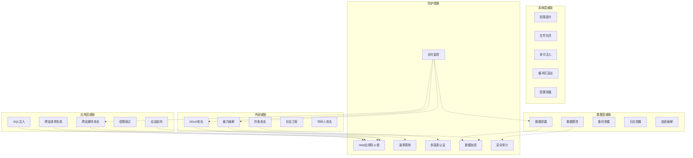

图18：安全威胁模型图

### 8.6.2 多层防护策略

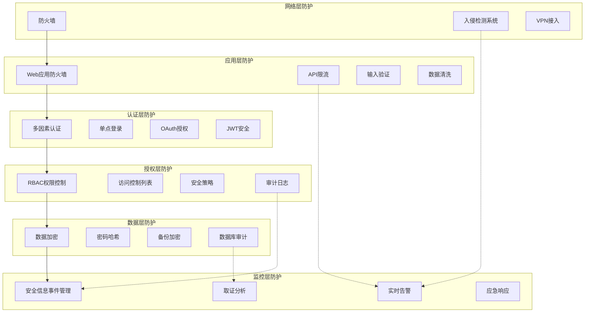

图19：多层防护策略图

### 8.6.3 密码安全

```go
// 密码强度验证
func ValidatePasswordStrength(password string) error {
    if len(password) < 8 {
        return errors.New("密码长度至少8位")
    }
    
    if len(password) > 128 {
        return errors.New("密码长度不能超过128位")
    }
    
    var (
        hasUpper   = false
        hasLower   = false
        hasNumber  = false
        hasSpecial = false
    )
    
    for _, char := range password {
        switch {
        case unicode.IsUpper(char):
            hasUpper = true
        case unicode.IsLower(char):
            hasLower = true
        case unicode.IsNumber(char):
            hasNumber = true
        case unicode.IsPunct(char) || unicode.IsSymbol(char):
            hasSpecial = true
        }
    }
    
    score := 0
    if hasUpper {
        score++
    }
    if hasLower {
        score++
    }
    if hasNumber {
        score++
    }
    if hasSpecial {
        score++
    }
    
    if score < 3 {
        return errors.New("密码必须包含大写字母、小写字母、数字、特殊字符中的至少3种")
    }
    
    return nil
}

// 检查常见弱密码
func IsCommonPassword(password string) bool {
    commonPasswords := []string{
        "123456", "password", "123456789", "12345678", "12345",
        "1234567", "1234567890", "qwerty", "abc123", "111111",
        "123123", "admin", "letmein", "welcome", "monkey",
    }
    
    lowerPassword := strings.ToLower(password)
    for _, common := range commonPasswords {
        if lowerPassword == common {
            return true
        }
    }
    
    return false
}

// 密码历史检查
type PasswordHistory struct {
    ID          int    `gorm:"primaryKey"`
    UserID      int    `gorm:"index"`
    Password    string `gorm:"type:varchar(255)"`
    CreatedTime int64  `gorm:"bigint"`
}

// 检查密码是否在历史中使用过
func IsPasswordInHistory(userID int, newPassword string) bool {
    var histories []PasswordHistory
    common.DB.Where("user_id = ?", userID).
        Order("created_time DESC").
        Limit(5). // 检查最近5个密码
        Find(&histories)
    
    for _, history := range histories {
        if bcrypt.CompareHashAndPassword([]byte(history.Password), []byte(newPassword)) == nil {
            return true
        }
    }
    
    return false
}

// 添加密码到历史记录
func AddPasswordToHistory(userID int, hashedPassword string) {
    history := &PasswordHistory{
        UserID:      userID,
        Password:    hashedPassword,
        CreatedTime: time.Now().Unix(),
    }
    
    common.DB.Create(history)
    
    // 清理旧的密码历史（保留最近10个）
    var count int64
    common.DB.Model(&PasswordHistory{}).Where("user_id = ?", userID).Count(&count)
    if count > 10 {
        var oldHistories []PasswordHistory
        common.DB.Where("user_id = ?", userID).
            Order("created_time ASC").
            Limit(int(count - 10)).
            Find(&oldHistories)
        
        for _, old := range oldHistories {
            common.DB.Delete(&old)
        }
    }
}
```

### 8.6.4 防暴力破解

```go
// 登录尝试记录
type LoginAttempt struct {
    ID        int    `gorm:"primaryKey"`
    IP        string `gorm:"type:varchar(45);index"`
    Username  string `gorm:"type:varchar(255);index"`
    Success   bool   `gorm:"index"`
    Timestamp int64  `gorm:"bigint;index"`
    UserAgent string `gorm:"type:text"`
}

// 检查IP是否被锁定
func IsIPLocked(ip string) bool {
    var count int64
    
    // 检查最近15分钟内的失败尝试次数
    since := time.Now().Add(-15 * time.Minute).Unix()
    common.DB.Model(&LoginAttempt{}).
        Where("ip = ? AND success = false AND timestamp > ?", ip, since).
        Count(&count)
    
    return count >= 5 // 15分钟内失败5次则锁定
}

// 检查用户名是否被锁定
func IsUsernameLocked(username string) bool {
    var count int64
    
    // 检查最近30分钟内的失败尝试次数
    since := time.Now().Add(-30 * time.Minute).Unix()
    common.DB.Model(&LoginAttempt{}).
        Where("username = ? AND success = false AND timestamp > ?", username, since).
        Count(&count)
    
    return count >= 3 // 30分钟内失败3次则锁定
}

// 记录登录尝试
func RecordLoginAttempt(ip, username, userAgent string, success bool) {
    attempt := &LoginAttempt{
        IP:        ip,
        Username:  username,
        Success:   success,
        Timestamp: time.Now().Unix(),
        UserAgent: userAgent,
    }
    
    common.DB.Create(attempt)
    
    // 清理旧记录（保留最近7天）
    go func() {
        cutoff := time.Now().Add(-7 * 24 * time.Hour).Unix()
        common.DB.Where("timestamp < ?", cutoff).Delete(&LoginAttempt{})
    }()
}

// 防暴力破解中间件
func RateLimitMiddleware() gin.HandlerFunc {
    return func(c *gin.Context) {
        ip := c.ClientIP()
        
        // 检查IP是否被锁定
        if IsIPLocked(ip) {
            c.JSON(http.StatusTooManyRequests, gin.H{
                "success": false,
                "message": "IP地址已被临时锁定，请稍后再试",
            })
            c.Abort()
            return
        }
        
        c.Next()
    }
}
```

### 8.6.5 安全头设置

```go
// 安全头中间件
func SecurityHeaders() gin.HandlerFunc {
    return func(c *gin.Context) {
        // 防止点击劫持
        c.Header("X-Frame-Options", "DENY")
        
        // 防止MIME类型嗅探
        c.Header("X-Content-Type-Options", "nosniff")
        
        // XSS保护
        c.Header("X-XSS-Protection", "1; mode=block")
        
        // 强制HTTPS
        if common.ServerAddress != "localhost" {
            c.Header("Strict-Transport-Security", "max-age=31536000; includeSubDomains")
        }
        
        // 内容安全策略
        c.Header("Content-Security-Policy", "default-src 'self'; script-src 'self' 'unsafe-inline'; style-src 'self' 'unsafe-inline'")
        
        // 引用策略
        c.Header("Referrer-Policy", "strict-origin-when-cross-origin")
        
        // 权限策略
        c.Header("Permissions-Policy", "geolocation=(), microphone=(), camera=()")
        
        c.Next()
    }
}
```

## 8.7 本章小结

本章深入探讨了用户认证与授权系统的设计与实现，主要内容包括：

1. **认证与授权基础**：介绍了认证和授权的基本概念，以及常见的认证方式
2. **用户注册与登录**：实现了完整的用户注册、登录、登出功能
3. **权限管理系统**：基于RBAC模型实现了灵活的权限管理
4. **认证中间件**：开发了JWT和API密钥认证中间件
5. **会话管理**：实现了基于Redis和Cookie的会话存储
6. **安全最佳实践**：包括密码安全、防暴力破解、安全头设置等

通过本章的学习，你将掌握如何构建安全可靠的用户认证与授权系统，为Web应用提供强大的安全保障。

## 练习题

1. **双因素认证实现**：为登录系统添加TOTP（基于时间的一次性密码）双因素认证功能

2. **OAuth2集成**：实现OAuth2授权服务器，支持第三方应用接入

3. **单点登录（SSO）**：设计并实现基于JWT的单点登录系统

4. **权限缓存优化**：使用Redis缓存用户权限信息，提高权限检查性能

5. **安全审计日志**：实现完整的安全审计日志系统，记录所有认证和授权相关操作

## 扩展阅读

1. [JWT最佳实践](https://auth0.com/blog/a-look-at-the-latest-draft-for-jwt-bcp/)
2. [OWASP认证备忘单](https://cheatsheetseries.owasp.org/cheatsheets/Authentication_Cheat_Sheet.html)
3. [RBAC权限模型详解](https://en.wikipedia.org/wiki/Role-based_access_control)
4. [OAuth 2.0安全最佳实践](https://datatracker.ietf.org/doc/html/draft-ietf-oauth-security-topics)
5. [密码学在Web安全中的应用](https://blog.cloudflare.com/how-to-build-your-own-public-key-infrastructure/)

