# 第9章 配置管理与环境变量

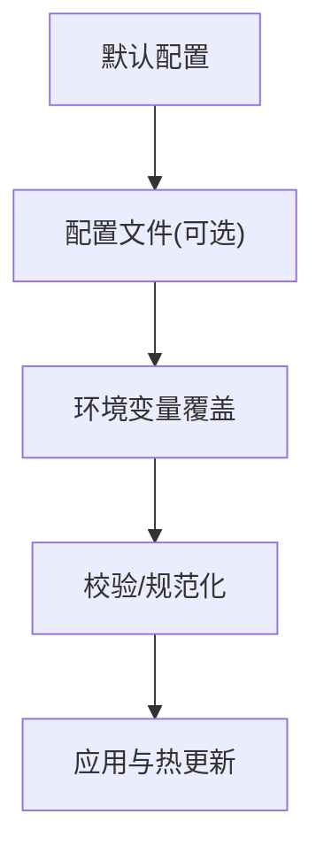

图1：配置加载与覆盖优先级流程

概念要点：
- 分层配置：默认值 → 文件 → 环境变量（逐层覆盖，越后优先级越高）。
- 结构化配置：分模块（server/db/cache/log）与强类型绑定。
- 校验与回退：启动前校验必填项，失败时回退或阻止启动。
- 热更新：监听文件/中心变更，动态刷新（谨慎处理并发与一致性）。
- 安全：密钥/令牌不入库明文，使用环境变量或外部密管。


图2：敏感配置的保护与加载流程

## 9.1 配置管理基础概念

### 9.1.1 配置管理架构概览

配置管理是企业级应用开发中的核心组成部分，它涉及应用程序运行时所需的各种参数、连接信息、功能开关等的统一管理。

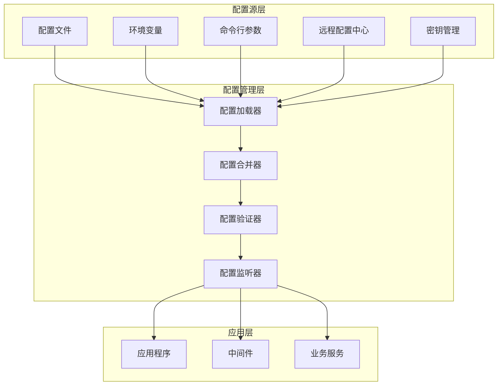

图3：配置管理系统架构图

### 9.1.2 配置分层与优先级

配置管理采用分层架构，不同层级的配置具有不同的优先级，高优先级的配置会覆盖低优先级的配置。

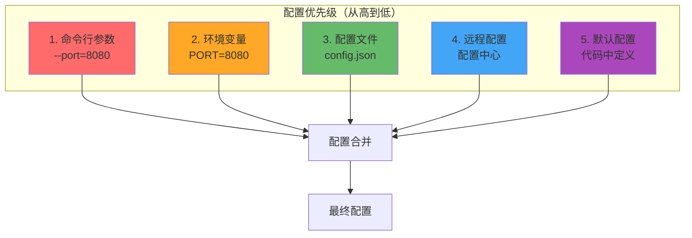

图4：配置分层与优先级覆盖机制

### 9.1.3 配置管理核心概念

**环境分离**：开发/测试/预发/生产多套配置独立演进，严禁相互污染。每个环境都有独立的配置文件和环境变量设置，确保环境间的隔离性。

**分层配置**：采用多层配置覆盖机制，优先级从低到高为：默认配置 < 配置文件 < 环境变量 < 命令行参数。这种设计允许在不同部署场景下灵活调整配置。

**结构化配置**：使用强类型结构绑定，避免字符串拼接与魔法常量。通过结构体标签实现配置字段与环境变量的映射。

**动态刷新**：监听配置来源变更后进行热更新，需要注意一致性与并发安全问题。

**版本化与回滚**：配置也需要版本号与审计记录，支持快速回退到之前的稳定版本。

**校验与启动阻断**：必填项缺失或非法时阻断应用启动，避免运行时故障。

### 9.1.4 配置管理的重要性

在企业级应用开发中，配置管理是确保应用在不同环境（开发、测试、生产）中正确运行的关键因素。良好的配置管理应该满足以下原则：

1. **环境分离**：不同环境使用不同的配置
2. **安全性**：敏感信息加密存储
3. **灵活性**：支持动态配置更新
4. **可维护性**：配置结构清晰，易于理解和修改
5. **版本控制**：配置变更可追踪

### 9.1.5 Go语言中的配置管理方式

Go语言中常见的配置管理方式包括：

- 环境变量
- 配置文件（JSON、YAML、TOML等）
- 命令行参数
- 远程配置中心
- 数据库配置

## 9.2 New-API项目中的配置系统

### 9.2.1 配置加载流程概览

New-API项目采用多源配置加载机制，支持从配置文件、环境变量等多个来源加载配置，并按照优先级进行合并。

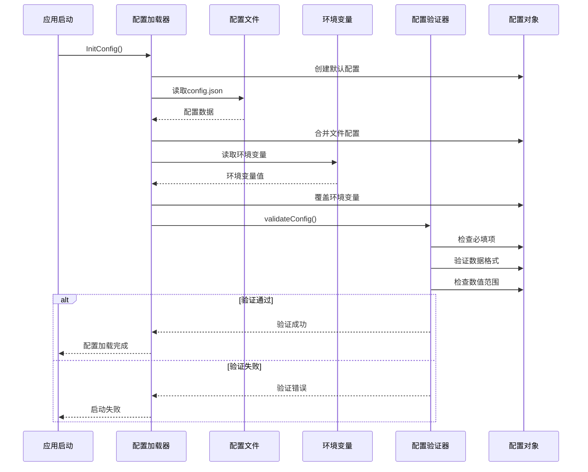

图5：New-API配置加载时序图

### 9.2.2 配置系统术语速览

- **绑定标签**：`env:"KEY"` 指定环境变量覆盖字段；`json:"field"` 统一序列化键名。
- **默认配置**：编译期内置默认值，保证开箱即用；可被外部覆盖。
- **校验**：加载完成后统一校验（端口范围、超时阈值、必填密钥等）。
- **分层模块**：server/db/cache/log/security/oauth 等分组管理。

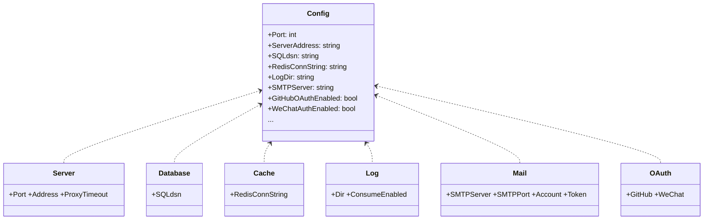

图6：New-API 配置结构分层与字段映射（示意）

### 9.2.3 配置结构设计

New-API项目采用分层配置管理策略，让我们分析其配置系统：

```go
// common/config.go
type Config struct {
    Port                int           `json:"port" env:"PORT"`
    SessionSecret       string        `json:"session_secret" env:"SESSION_SECRET"`
    SQLdsn              string        `json:"sql_dsn" env:"SQL_DSN"`
    RedisConnString     string        `json:"redis_conn_string" env:"REDIS_CONN_STRING"`
    PasswordLoginEnabled bool         `json:"password_login_enabled" env:"PASSWORD_LOGIN_ENABLED"`
    
    // 服务器配置
    ServerAddress       string        `json:"server_address" env:"SERVER_ADDRESS"`
    ProxyTimeOut        int           `json:"proxy_timeout" env:"PROXY_TIMEOUT"`
    
    // 日志配置
    LogConsumeEnabled   bool          `json:"log_consume_enabled" env:"LOG_CONSUME_ENABLED"`
    LogDir              string        `json:"log_dir" env:"LOG_DIR"`
    
    // 安全配置
    TurnstileSecret     string        `json:"turnstile_secret" env:"TURNSTILE_SECRET"`
    TurnstileSiteKey    string        `json:"turnstile_site_key" env:"TURNSTILE_SITE_KEY"`
    
    // 邮件配置
    SMTPServer          string        `json:"smtp_server" env:"SMTP_SERVER"`
    SMTPPort            int           `json:"smtp_port" env:"SMTP_PORT"`
    SMTPAccount         string        `json:"smtp_account" env:"SMTP_ACCOUNT"`
    SMTPFrom            string        `json:"smtp_from" env:"SMTP_FROM"`
    SMTPToken           string        `json:"smtp_token" env:"SMTP_TOKEN"`
    
    // GitHub OAuth配置
    GitHubOAuthEnabled  bool          `json:"github_oauth_enabled" env:"GITHUB_OAUTH_ENABLED"`
    GitHubClientId      string        `json:"github_client_id" env:"GITHUB_CLIENT_ID"`
    GitHubClientSecret  string        `json:"github_client_secret" env:"GITHUB_CLIENT_SECRET"`
    
    // WeChat OAuth配置
    WeChatAuthEnabled   bool          `json:"wechat_auth_enabled" env:"WECHAT_AUTH_ENABLED"`
    WeChatServerAddress string        `json:"wechat_server_address" env:"WECHAT_SERVER_ADDRESS"`
    WeChatAccountQRCode string        `json:"wechat_account_qrcode" env:"WECHAT_ACCOUNT_QRCODE"`
}

// 默认配置
var defaultConfig = Config{
    Port:                3000,
    SessionSecret:       "random_session_secret",
    PasswordLoginEnabled: true,
    ProxyTimeOut:        60,
    LogConsumeEnabled:   true,
    LogDir:              "./logs",
    SMTPPort:            587,
}
```

### 9.2.4 配置加载机制

```go
// common/config_loader.go
import (
    "encoding/json"
    "io/ioutil"
    "os"
    "reflect"
    "strconv"
    "strings"
)

var GlobalConfig Config

// 初始化配置
func InitConfig(configPath string) error {
    // 1. 加载默认配置
    GlobalConfig = defaultConfig
    
    // 2. 从配置文件加载
    if configPath != "" {
        if err := loadConfigFromFile(configPath, &GlobalConfig); err != nil {
            return fmt.Errorf("加载配置文件失败: %w", err)
        }
    }
    
    // 3. 从环境变量加载（优先级最高）
    if err := loadConfigFromEnv(&GlobalConfig); err != nil {
        return fmt.Errorf("加载环境变量配置失败: %w", err)
    }
    
    // 4. 验证配置
    if err := validateConfig(&GlobalConfig); err != nil {
        return fmt.Errorf("配置验证失败: %w", err)
    }
    
    return nil
}

// 从文件加载配置
func loadConfigFromFile(configPath string, config *Config) error {
    if _, err := os.Stat(configPath); os.IsNotExist(err) {
        return fmt.Errorf("配置文件不存在: %s", configPath)
    }
    
    data, err := ioutil.ReadFile(configPath)
    if err != nil {
        return err
    }
    
    // 根据文件扩展名选择解析方式
    switch strings.ToLower(filepath.Ext(configPath)) {
    case ".json":
        return json.Unmarshal(data, config)
    case ".yaml", ".yml":
        return yaml.Unmarshal(data, config)
    case ".toml":
        return toml.Unmarshal(data, config)
    default:
        return fmt.Errorf("不支持的配置文件格式: %s", configPath)
    }
}

// 从环境变量加载配置
func loadConfigFromEnv(config *Config) error {
    v := reflect.ValueOf(config).Elem()
    t := v.Type()
    
    for i := 0; i < v.NumField(); i++ {
        field := v.Field(i)
        fieldType := t.Field(i)
        
        // 获取env标签
        envKey := fieldType.Tag.Get("env")
        if envKey == "" {
            continue
        }
        
        // 获取环境变量值
        envValue := os.Getenv(envKey)
        if envValue == "" {
            continue
        }
        
        // 根据字段类型设置值
        if err := setFieldValue(field, envValue); err != nil {
            return fmt.Errorf("设置字段 %s 失败: %w", fieldType.Name, err)
        }
    }
    
    return nil
}

// 设置字段值
func setFieldValue(field reflect.Value, value string) error {
    if !field.CanSet() {
        return fmt.Errorf("字段不能设置")
    }
    
    switch field.Kind() {
    case reflect.String:
        field.SetString(value)
    case reflect.Int, reflect.Int8, reflect.Int16, reflect.Int32, reflect.Int64:
        intValue, err := strconv.ParseInt(value, 10, 64)
        if err != nil {
            return err
        }
        field.SetInt(intValue)
    case reflect.Bool:
        boolValue, err := strconv.ParseBool(value)
        if err != nil {
            return err
        }
        field.SetBool(boolValue)
    case reflect.Float32, reflect.Float64:
        floatValue, err := strconv.ParseFloat(value, 64)
        if err != nil {
            return err
        }
        field.SetFloat(floatValue)
    default:
        return fmt.Errorf("不支持的字段类型: %s", field.Kind())
    }
    
    return nil
}
```

### 9.2.3 配置验证

```go
// common/config_validator.go
import (
    "net/url"
    "regexp"
)

// 配置验证
func validateConfig(config *Config) error {
    var errors []string
    
    // 端口验证
    if config.Port <= 0 || config.Port > 65535 {
        errors = append(errors, "端口号必须在1-65535范围内")
    }
    
    // 会话密钥验证
    if config.SessionSecret == "" || config.SessionSecret == "random_session_secret" {
        errors = append(errors, "请设置安全的会话密钥")
    }
    
    // 数据库连接验证
    if config.SQLdsn == "" {
        errors = append(errors, "数据库连接字符串不能为空")
    }
    
    // 服务器地址验证
    if config.ServerAddress != "" {
        if _, err := url.Parse(config.ServerAddress); err != nil {
            errors = append(errors, fmt.Sprintf("服务器地址格式不正确: %v", err))
        }
    }
    
    // SMTP配置验证
    if config.SMTPServer != "" {
        if config.SMTPAccount == "" || config.SMTPToken == "" {
            errors = append(errors, "SMTP服务器配置不完整")
        }
        
        if !isValidEmail(config.SMTPFrom) {
            errors = append(errors, "SMTP发件人邮箱格式不正确")
        }
    }
    
    // GitHub OAuth配置验证
    if config.GitHubOAuthEnabled {
        if config.GitHubClientId == "" || config.GitHubClientSecret == "" {
            errors = append(errors, "GitHub OAuth配置不完整")
        }
    }
    
    if len(errors) > 0 {
        return fmt.Errorf("配置验证失败:\n%s", strings.Join(errors, "\n"))
    }
    
    return nil
}

func isValidEmail(email string) bool {
    pattern := `^[a-zA-Z0-9._%+-]+@[a-zA-Z0-9.-]+\.[a-zA-Z]{2,}$`
    matched, _ := regexp.MatchString(pattern, email)
    return matched
}
```

## 9.3 高级配置管理

### 9.3.4 配置热加载实现架构

配置热加载允许应用在运行时动态更新配置，无需重启服务。这对于提高系统可用性和运维效率至关重要。

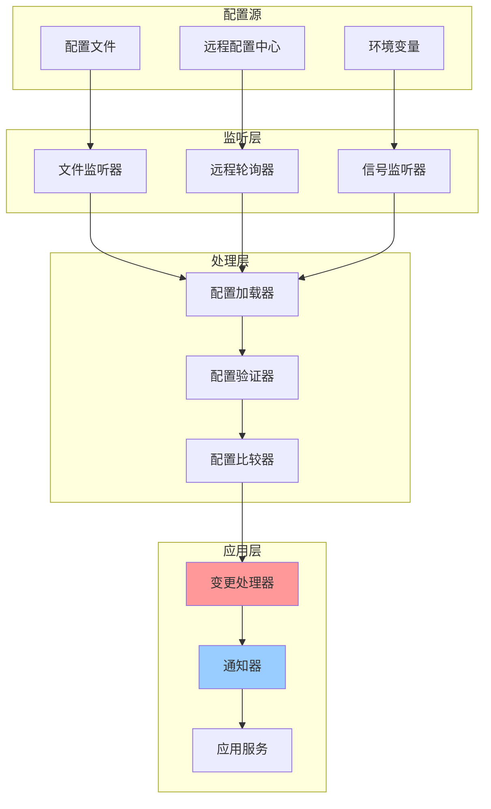

图7：配置热加载架构图

### 9.3.2 远程配置同步机制

远程配置中心提供了集中化的配置管理能力，支持多实例配置同步和版本管理。

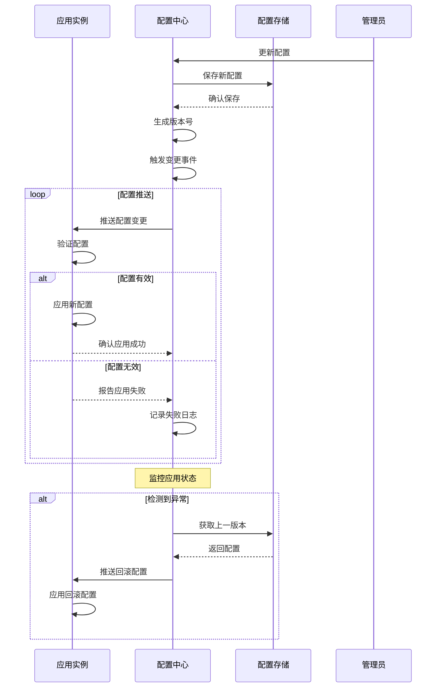

图8：远程配置同步与自动回滚时序图

### 9.3.3 高级配置管理术语

- **配置中心**：集中存储（Etcd/Consul/ConfigMap）统一分发与审计。详细实现请参考第16章微服务架构设计。
- **灰度发布**：按比例/标签逐步放量，遇到异常自动回滚。
- **Feature Flag**：以开关控制功能可见性与参数，支持动态切换。

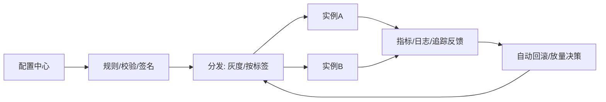

图9：配置中心驱动的灰度发布与自动回滚闭环

### 9.3.1 配置热加载

```go
// common/config_watcher.go
import (
    "sync"
    "time"
    "github.com/fsnotify/fsnotify"
)

type ConfigWatcher struct {
    configPath string
    config     *Config
    callbacks  []func(*Config)
    mutex      sync.RWMutex
    watcher    *fsnotify.Watcher
}

func NewConfigWatcher(configPath string, config *Config) (*ConfigWatcher, error) {
    watcher, err := fsnotify.NewWatcher()
    if err != nil {
        return nil, err
    }
    
    cw := &ConfigWatcher{
        configPath: configPath,
        config:     config,
        callbacks:  make([]func(*Config), 0),
        watcher:    watcher,
    }
    
    // 监控配置文件
    if err := watcher.Add(configPath); err != nil {
        return nil, err
    }
    
    go cw.watch()
    
    return cw, nil
}

func (cw *ConfigWatcher) AddCallback(callback func(*Config)) {
    cw.mutex.Lock()
    defer cw.mutex.Unlock()
    cw.callbacks = append(cw.callbacks, callback)
}

func (cw *ConfigWatcher) watch() {
    for {
        select {
        case event, ok := <-cw.watcher.Events:
            if !ok {
                return
            }
            
            if event.Op&fsnotify.Write == fsnotify.Write {
                // 延迟重载，避免文件写入过程中的读取错误
                time.Sleep(100 * time.Millisecond)
                cw.reloadConfig()
            }
            
        case err, ok := <-cw.watcher.Errors:
            if !ok {
                return
            }
            log.Printf("配置文件监控错误: %v", err)
        }
    }
}

func (cw *ConfigWatcher) reloadConfig() {
    newConfig := *cw.config // 复制当前配置
    
    if err := loadConfigFromFile(cw.configPath, &newConfig); err != nil {
        log.Printf("重新加载配置失败: %v", err)
        return
    }
    
    if err := validateConfig(&newConfig); err != nil {
        log.Printf("配置验证失败: %v", err)
        return
    }
    
    cw.mutex.Lock()
    *cw.config = newConfig
    callbacks := make([]func(*Config), len(cw.callbacks))
    copy(callbacks, cw.callbacks)
    cw.mutex.Unlock()
    
    // 通知所有回调函数
    for _, callback := range callbacks {
        callback(&newConfig)
    }
    
    log.Println("配置已重新加载")
}

func (cw *ConfigWatcher) Close() {
    cw.watcher.Close()
}
```

### 9.3.5 配置加密与解密

```go
// common/config_encryption.go
import (
    "crypto/aes"
    "crypto/cipher"
    "crypto/rand"
    "crypto/sha256"
    "encoding/base64"
    "io"
)

type EncryptedConfig struct {
    config *Config
    cipher cipher.AEAD
}

func NewEncryptedConfig(password string) (*EncryptedConfig, error) {
    key := sha256.Sum256([]byte(password))
    
    block, err := aes.NewCipher(key[:])
    if err != nil {
        return nil, err
    }
    
    gcm, err := cipher.NewGCM(block)
    if err != nil {
        return nil, err
    }
    
    return &EncryptedConfig{
        config: &Config{},
        cipher: gcm,
    }, nil
}

// 加密敏感配置字段
func (ec *EncryptedConfig) EncryptSensitiveFields() error {
    v := reflect.ValueOf(ec.config).Elem()
    t := v.Type()
    
    for i := 0; i < v.NumField(); i++ {
        field := v.Field(i)
        fieldType := t.Field(i)
        
        // 检查是否是敏感字段
        if isSensitiveField(fieldType.Name) && field.Kind() == reflect.String {
            originalValue := field.String()
            if originalValue != "" {
                encryptedValue, err := ec.encrypt(originalValue)
                if err != nil {
                    return err
                }
                field.SetString(encryptedValue)
            }
        }
    }
    
    return nil
}

// 解密敏感配置字段
func (ec *EncryptedConfig) DecryptSensitiveFields() error {
    v := reflect.ValueOf(ec.config).Elem()
    t := v.Type()
    
    for i := 0; i < v.NumField(); i++ {
        field := v.Field(i)
        fieldType := t.Field(i)
        
        if isSensitiveField(fieldType.Name) && field.Kind() == reflect.String {
            encryptedValue := field.String()
            if encryptedValue != "" && isEncrypted(encryptedValue) {
                decryptedValue, err := ec.decrypt(encryptedValue)
                if err != nil {
                    return err
                }
                field.SetString(decryptedValue)
            }
        }
    }
    
    return nil
}

func (ec *EncryptedConfig) encrypt(plaintext string) (string, error) {
    nonce := make([]byte, ec.cipher.NonceSize())
    if _, err := io.ReadFull(rand.Reader, nonce); err != nil {
        return "", err
    }
    
    ciphertext := ec.cipher.Seal(nonce, nonce, []byte(plaintext), nil)
    return base64.StdEncoding.EncodeToString(ciphertext), nil
}

func (ec *EncryptedConfig) decrypt(ciphertext string) (string, error) {
    data, err := base64.StdEncoding.DecodeString(ciphertext)
    if err != nil {
        return "", err
    }
    
    nonceSize := ec.cipher.NonceSize()
    if len(data) < nonceSize {
        return "", fmt.Errorf("密文太短")
    }
    
    nonce, ciphertext := data[:nonceSize], data[nonceSize:]
    plaintext, err := ec.cipher.Open(nil, nonce, ciphertext, nil)
    if err != nil {
        return "", err
    }
    
    return string(plaintext), nil
}

func isSensitiveField(fieldName string) bool {
    sensitiveFields := []string{
        "SessionSecret",
        "SQLdsn",
        "RedisConnString",
        "TurnstileSecret",
        "SMTPToken",
        "GitHubClientSecret",
    }
    
    for _, sensitive := range sensitiveFields {
        if fieldName == sensitive {
            return true
        }
    }
    
    return false
}

func isEncrypted(value string) bool {
    // 简单检查是否是Base64编码的加密数据
    if _, err := base64.StdEncoding.DecodeString(value); err != nil {
        return false
    }
    return len(value) > 20 // 加密数据通常较长
}
```

### 9.3.6 远程配置管理

```go
// common/remote_config.go
import (
    "encoding/json"
    "net/http"
    "time"
)

type RemoteConfigClient struct {
    endpoint    string
    apiKey      string
    client      *http.Client
    updateChan  chan *Config
    stopChan    chan struct{}
}

func NewRemoteConfigClient(endpoint, apiKey string) *RemoteConfigClient {
    return &RemoteConfigClient{
        endpoint:   endpoint,
        apiKey:     apiKey,
        client:     &http.Client{Timeout: 10 * time.Second},
        updateChan: make(chan *Config, 1),
        stopChan:   make(chan struct{}),
    }
}

func (rc *RemoteConfigClient) Start(pollInterval time.Duration) {
    ticker := time.NewTicker(pollInterval)
    defer ticker.Stop()
    
    for {
        select {
        case <-ticker.C:
            if config, err := rc.fetchConfig(); err == nil {
                select {
                case rc.updateChan <- config:
                default:
                    // 如果通道满了，丢弃旧的配置更新
                }
            }
        case <-rc.stopChan:
            return
        }
    }
}

func (rc *RemoteConfigClient) fetchConfig() (*Config, error) {
    req, err := http.NewRequest("GET", rc.endpoint, nil)
    if err != nil {
        return nil, err
    }
    
    req.Header.Set("Authorization", "Bearer "+rc.apiKey)
    req.Header.Set("Content-Type", "application/json")
    
    resp, err := rc.client.Do(req)
    if err != nil {
        return nil, err
    }
    defer resp.Body.Close()
    
    if resp.StatusCode != http.StatusOK {
        return nil, fmt.Errorf("获取配置失败: %s", resp.Status)
    }
    
    var config Config
    if err := json.NewDecoder(resp.Body).Decode(&config); err != nil {
        return nil, err
    }
    
    return &config, nil
}

func (rc *RemoteConfigClient) GetUpdateChan() <-chan *Config {
    return rc.updateChan
}

func (rc *RemoteConfigClient) Stop() {
    close(rc.stopChan)
}

// 集成远程配置到应用中
func integrateRemoteConfig() {
    remoteClient := NewRemoteConfigClient(
        "https://config-server.example.com/api/config",
        os.Getenv("CONFIG_API_KEY"),
    )
    
    go remoteClient.Start(5 * time.Minute)
    
    go func() {
        for newConfig := range remoteClient.GetUpdateChan() {
            if err := validateConfig(newConfig); err != nil {
                log.Printf("远程配置验证失败: %v", err)
                continue
            }
            
            // 更新全局配置
            GlobalConfig = *newConfig
            log.Println("远程配置已更新")
            
            // 触发配置更新回调
            // notifyConfigUpdate(newConfig)
        }
    }()
}
```

## 9.4 环境变量管理

### 9.4.1 环境变量优先级与覆盖机制

环境变量管理需要明确的优先级规则，确保在不同部署环境下配置的正确性和可预测性。

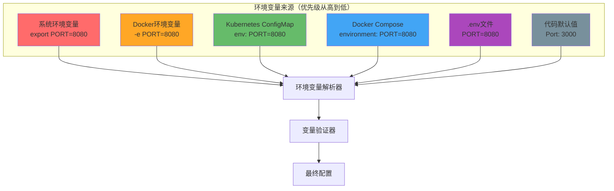

图10：环境变量优先级与覆盖机制

### 9.4.5 环境变量分组管理架构

为了更好地组织和管理大量的环境变量，采用分组管理策略，按功能模块进行分类。

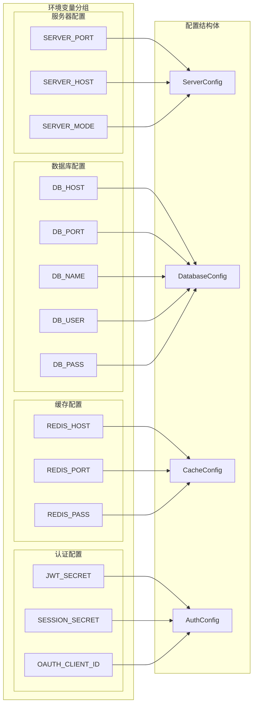

图11：环境变量分组管理架构

### 9.4.3 环境变量管理术语

- **命名规范**：统一前缀（如 `NEWAPI_`），大写+下划线分隔，语义清晰。
- **覆盖策略**：仅允许白名单字段被环境变量覆盖，避免意外覆盖。
- **注入方式**：容器 `env`/`secret`、系统环境、启动脚本导出等。

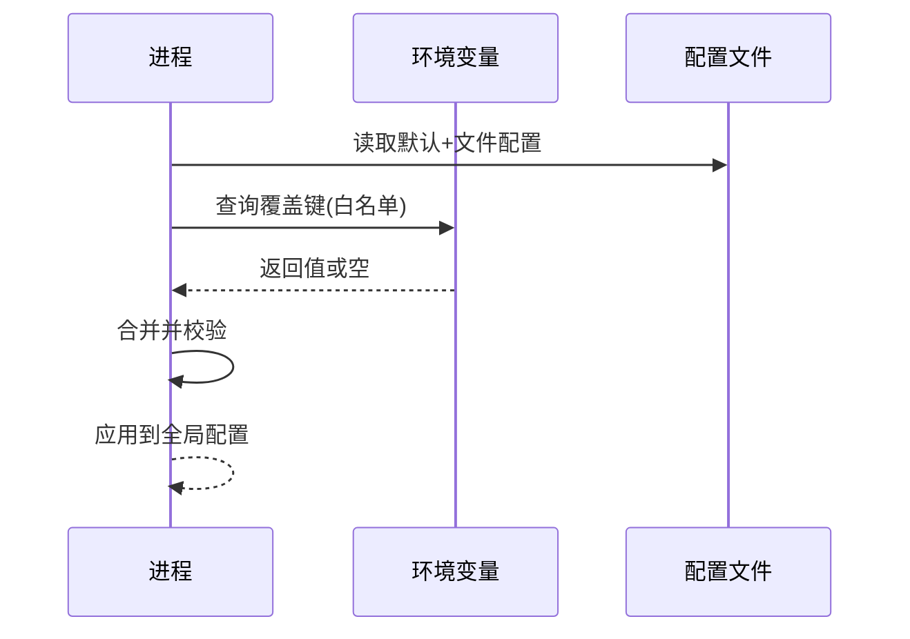

图12：环境变量覆盖配置的读取与合并时序

### 9.4.4 .env文件支持

```go
// common/dotenv.go
import (
    "bufio"
    "os"
    "strings"
)

// 加载.env文件
func LoadDotEnv(filename string) error {
    file, err := os.Open(filename)
    if err != nil {
        if os.IsNotExist(err) {
            return nil // .env文件不存在时不报错
        }
        return err
    }
    defer file.Close()
    
    scanner := bufio.NewScanner(file)
    lineNumber := 0
    
    for scanner.Scan() {
        lineNumber++
        line := strings.TrimSpace(scanner.Text())
        
        // 跳过空行和注释
        if line == "" || strings.HasPrefix(line, "#") {
            continue
        }
        
        // 解析环境变量
        parts := strings.SplitN(line, "=", 2)
        if len(parts) != 2 {
            return fmt.Errorf(".env文件第%d行格式错误: %s", lineNumber, line)
        }
        
        key := strings.TrimSpace(parts[0])
        value := strings.TrimSpace(parts[1])
        
        // 处理引号
        value = strings.Trim(value, `"'`)
        
        // 只有环境变量不存在时才设置
        if os.Getenv(key) == "" {
            os.Setenv(key, value)
        }
    }
    
    return scanner.Err()
}

// 高级.env解析器
type EnvParser struct {
    variables map[string]string
}

func NewEnvParser() *EnvParser {
    return &EnvParser{
        variables: make(map[string]string),
    }
}

func (p *EnvParser) Parse(filename string) error {
    file, err := os.Open(filename)
    if err != nil {
        return err
    }
    defer file.Close()
    
    scanner := bufio.NewScanner(file)
    for scanner.Scan() {
        line := strings.TrimSpace(scanner.Text())
        
        if line == "" || strings.HasPrefix(line, "#") {
            continue
        }
        
        if err := p.parseLine(line); err != nil {
            return err
        }
    }
    
    return scanner.Err()
}

func (p *EnvParser) parseLine(line string) error {
    parts := strings.SplitN(line, "=", 2)
    if len(parts) != 2 {
        return fmt.Errorf("无效的环境变量格式: %s", line)
    }
    
    key := strings.TrimSpace(parts[0])
    value := strings.TrimSpace(parts[1])
    
    // 支持变量引用 ${VAR_NAME}
    value = p.expandVariables(value)
    
    p.variables[key] = value
    os.Setenv(key, value)
    
    return nil
}

func (p *EnvParser) expandVariables(value string) string {
    for strings.Contains(value, "${") {
        start := strings.Index(value, "${")
        if start == -1 {
            break
        }
        
        end := strings.Index(value[start:], "}")
        if end == -1 {
            break
        }
        end += start
        
        varName := value[start+2 : end]
        varValue := p.getVariableValue(varName)
        
        value = value[:start] + varValue + value[end+1:]
    }
    
    return value
}

func (p *EnvParser) getVariableValue(name string) string {
    // 首先检查已解析的变量
    if value, exists := p.variables[name]; exists {
        return value
    }
    
    // 然后检查系统环境变量
    return os.Getenv(name)
}
```

### 9.4.2 环境变量分组管理

```go
// common/env_groups.go
type EnvGroup struct {
    Name      string
    Variables map[string]string
    Required  []string
}

var EnvGroups = map[string]*EnvGroup{
    "database": {
        Name: "数据库配置",
        Variables: map[string]string{
            "SQL_DSN":             "数据库连接字符串",
            "REDIS_CONN_STRING":   "Redis连接字符串",
            "DB_MAX_IDLE_CONNS":   "数据库最大空闲连接数",
            "DB_MAX_OPEN_CONNS":   "数据库最大打开连接数",
        },
        Required: []string{"SQL_DSN"},
    },
    "server": {
        Name: "服务器配置",
        Variables: map[string]string{
            "PORT":               "服务器端口",
            "SERVER_ADDRESS":     "服务器地址",
            "PROXY_TIMEOUT":      "代理超时时间",
            "SESSION_SECRET":     "会话密钥",
        },
        Required: []string{"PORT", "SESSION_SECRET"},
    },
    "oauth": {
        Name: "OAuth配置",
        Variables: map[string]string{
            "GITHUB_CLIENT_ID":     "GitHub客户端ID",
            "GITHUB_CLIENT_SECRET": "GitHub客户端密钥",
            "WECHAT_SERVER_ADDRESS": "微信服务器地址",
        },
        Required: []string{},
    },
    "email": {
        Name: "邮件配置",
        Variables: map[string]string{
            "SMTP_SERVER":  "SMTP服务器",
            "SMTP_PORT":    "SMTP端口",
            "SMTP_ACCOUNT": "SMTP账户",
            "SMTP_TOKEN":   "SMTP密码",
            "SMTP_FROM":    "发件人邮箱",
        },
        Required: []string{},
    },
}

// 验证环境变量分组
func ValidateEnvGroups(groups []string) []string {
    var errors []string
    
    for _, groupName := range groups {
        group, exists := EnvGroups[groupName]
        if !exists {
            errors = append(errors, fmt.Sprintf("未知的环境变量分组: %s", groupName))
            continue
        }
        
        // 检查必需的环境变量
        for _, required := range group.Required {
            if os.Getenv(required) == "" {
                errors = append(errors, 
                    fmt.Sprintf("分组 %s 中缺少必需的环境变量: %s (%s)", 
                        group.Name, required, group.Variables[required]))
            }
        }
    }
    
    return errors
}

// 生成环境变量文档
func GenerateEnvDocumentation() string {
    var doc strings.Builder
    
    doc.WriteString("# 环境变量配置文档\n\n")
    
    for groupKey, group := range EnvGroups {
        doc.WriteString(fmt.Sprintf("## %s (%s)\n\n", group.Name, groupKey))
        
        for varName, description := range group.Variables {
            required := ""
            for _, req := range group.Required {
                if req == varName {
                    required = " **(必需)**"
                    break
                }
            }
            
            doc.WriteString(fmt.Sprintf("- `%s`: %s%s\n", varName, description, required))
        }
        
        doc.WriteString("\n")
    }
    
    return doc.String()
}
```

## 9.5 配置模板与生成器

### 9.5.1 配置模板继承关系

配置模板系统采用分层继承的设计，支持基础模板、环境特定模板和自定义模板的组合使用。

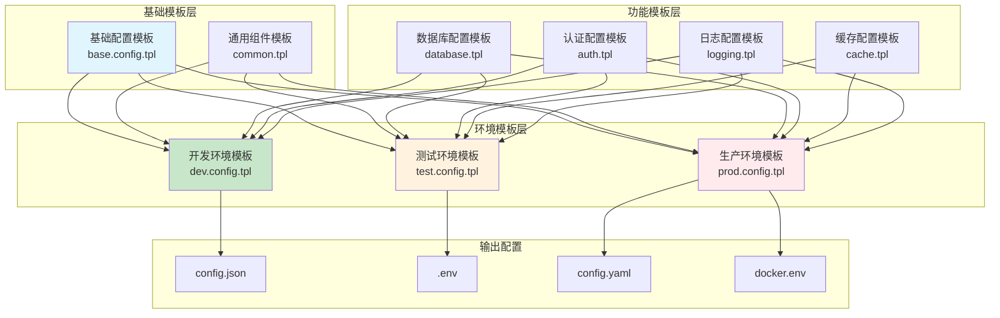

图13：配置模板继承关系图

### 9.5.2 配置模板生成流程

配置生成器通过模板渲染机制，将变量数据与模板结合，生成最终的配置文件。

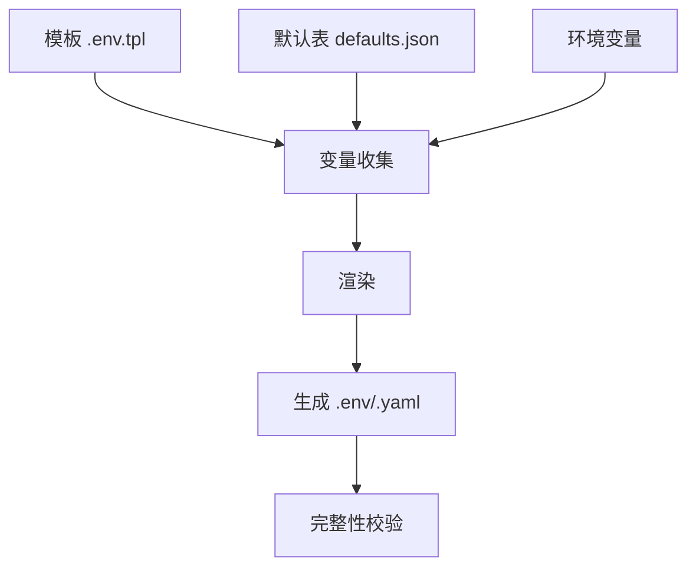

图14：配置模板生成流水线

### 9.5.3 配置模板术语

- **模板变量**：以 `${VAR}`/`{{ VAR }}` 形式占位，来源于环境或默认表。
- **生成器**：渲染模板输出 `.env`/`config.json`/`yaml` 等文件。
- **校验表**：声明必填项与默认值，生成缺省报告。

### 9.5.4 配置模板系统

```go
// common/config_template.go
import (
    "text/template"
    "bytes"
)

type ConfigTemplate struct {
    templates map[string]*template.Template
}

func NewConfigTemplate() *ConfigTemplate {
    return &ConfigTemplate{
        templates: make(map[string]*template.Template),
    }
}

// 注册配置模板
func (ct *ConfigTemplate) RegisterTemplate(name, templateStr string) error {
    tmpl, err := template.New(name).Parse(templateStr)
    if err != nil {
        return err
    }
    
    ct.templates[name] = tmpl
    return nil
}

// 生成配置
func (ct *ConfigTemplate) Generate(templateName string, data interface{}) (string, error) {
    tmpl, exists := ct.templates[templateName]
    if !exists {
        return "", fmt.Errorf("模板 %s 不存在", templateName)
    }
    
    var buf bytes.Buffer
    if err := tmpl.Execute(&buf, data); err != nil {
        return "", err
    }
    
    return buf.String(), nil
}

// 预定义的配置模板
const (
    DevelopmentConfigTemplate = `
{
    "port": {{.Port}},
    "session_secret": "dev_session_secret_{{.RandomString}}",
    "sql_dsn": "sqlite:./data/dev.db",
    "log_dir": "./logs",
    "log_consume_enabled": true,
    "password_login_enabled": true,
    "proxy_timeout": 30
}
`
    
    ProductionConfigTemplate = `
{
    "port": {{.Port}},
    "session_secret": "{{.SessionSecret}}",
    "sql_dsn": "{{.DatabaseURL}}",
    "redis_conn_string": "{{.RedisURL}}",
    "log_dir": "/var/log/new-api",
    "log_consume_enabled": true,
    "password_login_enabled": {{.PasswordLoginEnabled}},
    "proxy_timeout": 60,
    "smtp_server": "{{.SMTPServer}}",
    "smtp_port": {{.SMTPPort}},
    "smtp_account": "{{.SMTPAccount}}",
    "smtp_token": "{{.SMTPToken}}",
    "smtp_from": "{{.SMTPFrom}}"
}
`
)

// 配置生成器
type ConfigGenerator struct {
    template *ConfigTemplate
}

func NewConfigGenerator() *ConfigGenerator {
    ct := NewConfigTemplate()
    
    // 注册预定义模板
    ct.RegisterTemplate("development", DevelopmentConfigTemplate)
    ct.RegisterTemplate("production", ProductionConfigTemplate)
    
    return &ConfigGenerator{template: ct}
}

type ConfigData struct {
    Port                  int
    SessionSecret         string
    DatabaseURL          string
    RedisURL             string
    PasswordLoginEnabled bool
    SMTPServer           string
    SMTPPort             int
    SMTPAccount          string
    SMTPToken            string
    SMTPFrom             string
    RandomString         string
}

func (cg *ConfigGenerator) GenerateConfig(env string, data *ConfigData) (string, error) {
    // 生成随机字符串
    if data.RandomString == "" {
        data.RandomString = generateRandomString(16)
    }
    
    return cg.template.Generate(env, data)
}

func generateRandomString(length int) string {
    const charset = "abcdefghijklmnopqrstuvwxyzABCDEFGHIJKLMNOPQRSTUVWXYZ0123456789"
    b := make([]byte, length)
    for i := range b {
        b[i] = charset[rand.Intn(len(charset))]
    }
    return string(b)
}
```

### 9.5.2 配置迁移工具

```go
// tools/config_migration.go
type ConfigMigration struct {
    Version     string                      `json:"version"`
    Description string                      `json:"description"`
    Up          func(*Config) (*Config, error) `json:"-"`
    Down        func(*Config) (*Config, error) `json:"-"`
}

type ConfigMigrator struct {
    migrations []ConfigMigration
}

func NewConfigMigrator() *ConfigMigrator {
    return &ConfigMigrator{
        migrations: []ConfigMigration{
            {
                Version:     "1.0.0",
                Description: "初始化配置结构",
                Up:          migrate_1_0_0_up,
                Down:        migrate_1_0_0_down,
            },
            {
                Version:     "1.1.0", 
                Description: "添加OAuth配置",
                Up:          migrate_1_1_0_up,
                Down:        migrate_1_1_0_down,
            },
            {
                Version:     "1.2.0",
                Description: "重构邮件配置",
                Up:          migrate_1_2_0_up,
                Down:        migrate_1_2_0_down,
            },
        },
    }
}

func (cm *ConfigMigrator) Migrate(config *Config, targetVersion string) (*Config, error) {
    currentVersion := config.Version
    if currentVersion == "" {
        currentVersion = "0.0.0"
    }
    
    for _, migration := range cm.migrations {
        if versionLessThan(currentVersion, migration.Version) && 
           versionLessOrEqual(migration.Version, targetVersion) {
            
            newConfig, err := migration.Up(config)
            if err != nil {
                return nil, fmt.Errorf("迁移到版本 %s 失败: %w", migration.Version, err)
            }
            
            newConfig.Version = migration.Version
            config = newConfig
            
            log.Printf("配置已迁移到版本 %s: %s", migration.Version, migration.Description)
        }
    }
    
    return config, nil
}

// 示例迁移函数
func migrate_1_0_0_up(config *Config) (*Config, error) {
    // 初始化基本配置
    if config.Port == 0 {
        config.Port = 3000
    }
    
    if config.ProxyTimeOut == 0 {
        config.ProxyTimeOut = 60
    }
    
    return config, nil
}

func migrate_1_0_0_down(config *Config) (*Config, error) {
    // 回滚操作通常不需要做什么
    return config, nil
}

func migrate_1_1_0_up(config *Config) (*Config, error) {
    // 添加OAuth相关的默认配置
    // 这个版本引入了OAuth功能
    return config, nil
}

func migrate_1_1_0_down(config *Config) (*Config, error) {
    // 移除OAuth配置
    config.GitHubOAuthEnabled = false
    config.GitHubClientId = ""
    config.GitHubClientSecret = ""
    return config, nil
}

func migrate_1_2_0_up(config *Config) (*Config, error) {
    // 重构邮件配置字段名
    // 假设旧版本使用不同的字段名
    return config, nil
}

func migrate_1_2_0_down(config *Config) (*Config, error) {
    // 恢复旧的邮件配置字段名
    return config, nil
}

// 版本比较函数
func versionLessThan(v1, v2 string) bool {
    // 简单的版本比较实现
    return strings.Compare(v1, v2) < 0
}

func versionLessOrEqual(v1, v2 string) bool {
    return strings.Compare(v1, v2) <= 0
}
```

## 9.6 配置安全与最佳实践

### 9.6.1 配置安全威胁模型

配置安全是企业级应用的重要组成部分，需要识别和防范各种安全威胁。

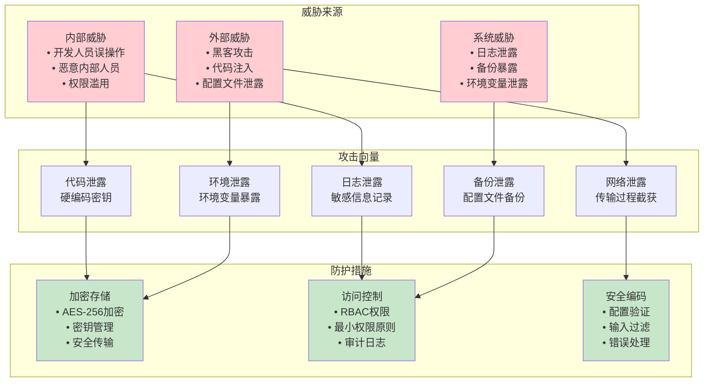

图15：配置安全威胁模型

### 9.6.2 配置加密与解密流程

敏感配置信息需要通过加密机制进行保护，确保在存储和传输过程中的安全性。

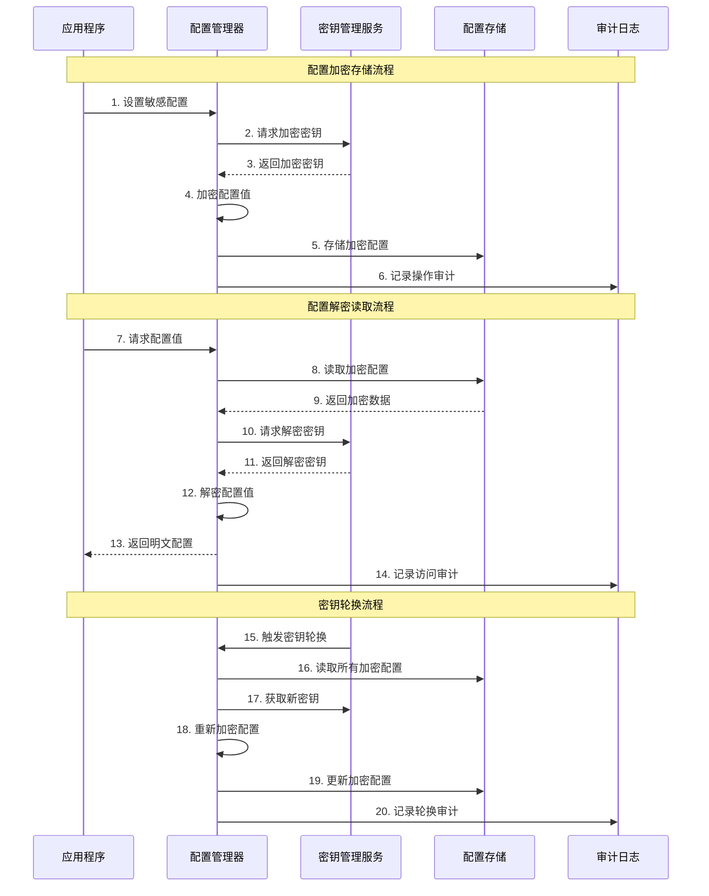

图16：配置加密与解密流程

### 9.6.3 敏感信息保护实现

```go
// common/config_security.go
import (
    "crypto/rand"
    "encoding/hex"
)

// 敏感配置字段标记
type SecureString struct {
    Value     string `json:"-"`          // 不会被JSON序列化
    encrypted string `json:"encrypted"`   // 存储加密后的值
}

func NewSecureString(value string) *SecureString {
    return &SecureString{Value: value}
}

func (ss *SecureString) MarshalJSON() ([]byte, error) {
    return json.Marshal(map[string]string{
        "encrypted": "[HIDDEN]",
    })
}

func (ss *SecureString) UnmarshalJSON(data []byte) error {
    var temp map[string]string
    if err := json.Unmarshal(data, &temp); err != nil {
        return err
    }
    
    ss.encrypted = temp["encrypted"]
    return nil
}

func (ss *SecureString) String() string {
    return "[HIDDEN]"
}

func (ss *SecureString) Get() string {
    return ss.Value
}

// 安全配置结构
type SecureConfig struct {
    Config
    
    // 使用SecureString保护敏感字段
    SessionSecret    *SecureString `json:"session_secret"`
    SQLdsn           *SecureString `json:"sql_dsn"`
    RedisConnString  *SecureString `json:"redis_conn_string"`
    SMTPToken        *SecureString `json:"smtp_token"`
    GitHubClientSecret *SecureString `json:"github_client_secret"`
}

// 生成安全的密钥
func GenerateSecureKey(length int) (string, error) {
    bytes := make([]byte, length)
    if _, err := rand.Read(bytes); err != nil {
        return "", err
    }
    return hex.EncodeToString(bytes), nil
}

// 检查配置安全性
func ValidateConfigSecurity(config *Config) []string {
    var warnings []string
    
    // 检查会话密钥强度
    if len(config.SessionSecret) < 32 {
        warnings = append(warnings, "会话密钥长度不足，建议至少32字符")
    }
    
    if config.SessionSecret == "random_session_secret" {
        warnings = append(warnings, "使用默认会话密钥，存在安全风险")
    }
    
    // 检查数据库连接是否使用SSL
    if strings.Contains(config.SQLdsn, "mysql://") && !strings.Contains(config.SQLdsn, "tls=") {
        warnings = append(warnings, "数据库连接未启用TLS加密")
    }
    
    // 检查Redis连接是否加密
    if config.RedisConnString != "" && !strings.Contains(config.RedisConnString, "tls=") {
        warnings = append(warnings, "Redis连接未启用TLS加密")
    }
    
    // 检查生产环境配置
    if os.Getenv("GIN_MODE") == "release" {
        if config.Port == 3000 {
            warnings = append(warnings, "生产环境建议使用非默认端口")
        }
    }
    
    return warnings
}
```

### 9.6.2 配置审计日志

```go
// common/config_audit.go
type ConfigAuditLog struct {
    Timestamp   time.Time              `json:"timestamp"`
    Operation   string                 `json:"operation"`
    Source      string                 `json:"source"`
    Changes     map[string]interface{} `json:"changes"`
    User        string                 `json:"user,omitempty"`
}

type ConfigAuditor struct {
    logs   []ConfigAuditLog
    logger *zap.Logger
    mutex  sync.RWMutex
}

func NewConfigAuditor(logger *zap.Logger) *ConfigAuditor {
    return &ConfigAuditor{
        logs:   make([]ConfigAuditLog, 0),
        logger: logger,
    }
}

func (ca *ConfigAuditor) LogConfigChange(operation, source string, changes map[string]interface{}) {
    ca.mutex.Lock()
    defer ca.mutex.Unlock()
    
    auditLog := ConfigAuditLog{
        Timestamp: time.Now(),
        Operation: operation,
        Source:    source,
        Changes:   changes,
    }
    
    // 如果有用户信息，添加到日志中
    if user := getCurrentUser(); user != "" {
        auditLog.User = user
    }
    
    ca.logs = append(ca.logs, auditLog)
    
    // 记录到日志系统
    ca.logger.Info("配置变更审计",
        zap.String("operation", operation),
        zap.String("source", source),
        zap.Any("changes", changes),
        zap.String("user", auditLog.User),
    )
    
    // 保持最近1000条审计日志
    if len(ca.logs) > 1000 {
        ca.logs = ca.logs[len(ca.logs)-1000:]
    }
}

func (ca *ConfigAuditor) GetAuditLogs(limit int) []ConfigAuditLog {
    ca.mutex.RLock()
    defer ca.mutex.RUnlock()
    
    if limit <= 0 || limit > len(ca.logs) {
        limit = len(ca.logs)
    }
    
    start := len(ca.logs) - limit
    if start < 0 {
        start = 0
    }
    
    return ca.logs[start:]
}

func getCurrentUser() string {
    // 从上下文或环境变量获取当前用户
    return os.Getenv("USER")
}

// 配置变更检测
func DetectConfigChanges(oldConfig, newConfig *Config) map[string]interface{} {
    changes := make(map[string]interface{})
    
    oldVal := reflect.ValueOf(oldConfig).Elem()
    newVal := reflect.ValueOf(newConfig).Elem()
    oldType := oldVal.Type()
    
    for i := 0; i < oldVal.NumField(); i++ {
        fieldName := oldType.Field(i).Name
        oldFieldVal := oldVal.Field(i)
        newFieldVal := newVal.Field(i)
        
        if !reflect.DeepEqual(oldFieldVal.Interface(), newFieldVal.Interface()) {
            // 对敏感字段进行脱敏
            if isSensitiveField(fieldName) {
                changes[fieldName] = map[string]string{
                    "old": "[HIDDEN]",
                    "new": "[HIDDEN]",
                }
            } else {
                changes[fieldName] = map[string]interface{}{
                    "old": oldFieldVal.Interface(),
                    "new": newFieldVal.Interface(),
                }
            }
        }
    }
    
    return changes
}
```

## 9.7 配置管理CLI工具

### 9.7.1 CLI工具架构设计

配置管理CLI工具提供了完整的配置生命周期管理功能，支持多种运行环境和使用场景。

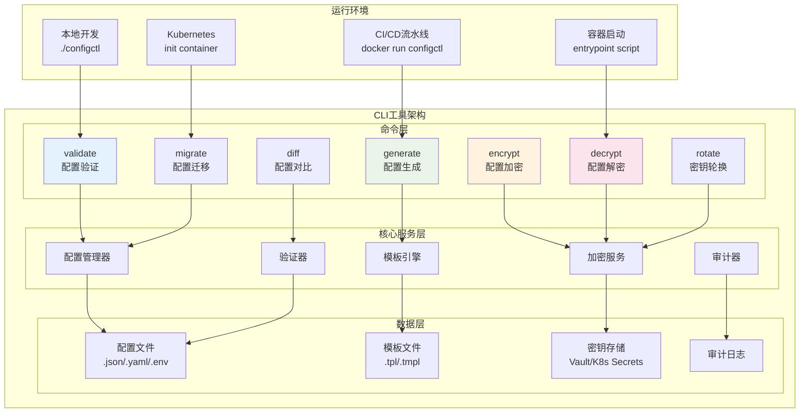

图17：CLI工具架构设计

### 9.7.2 命令执行流程

不同的CLI命令有着不同的执行流程，但都遵循统一的处理模式：参数解析、权限验证、业务处理、结果输出。

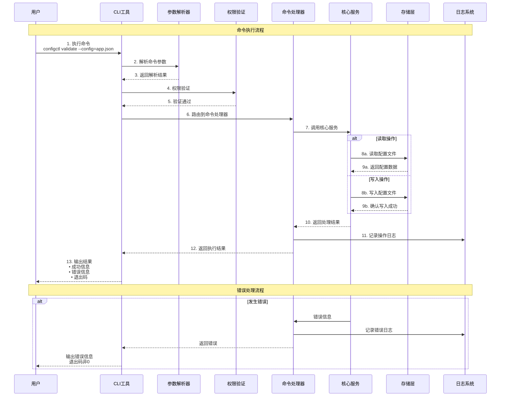

图18：命令执行流程图

### 9.7.3 CLI工具术语

- **子命令**：`validate`/`render`/`diff`/`rotate`（轮换密钥）。
- **运行模式**：本地/CI/CD/容器入口脚本。
- **安全**：CLI 不打印敏感值，必要时输出哈希或掩码。

### 9.7.4 命令行配置工具

```go
// cmd/config/main.go
import (
    "flag"
    "fmt"
    "os"
)

type ConfigCLI struct {
    configPath string
}

func main() {
    cli := &ConfigCLI{}
    
    flag.StringVar(&cli.configPath, "config", "config.json", "配置文件路径")
    flag.Parse()
    
    if len(os.Args) < 2 {
        printUsage()
        return
    }
    
    command := os.Args[1]
    
    switch command {
    case "validate":
        cli.validateConfig()
    case "generate":
        cli.generateConfig()
    case "encrypt":
        cli.encryptConfig()
    case "decrypt":
        cli.decryptConfig()
    case "migrate":
        cli.migrateConfig()
    case "doc":
        cli.generateDocumentation()
    default:
        fmt.Printf("未知命令: %s\n", command)
        printUsage()
    }
}

func printUsage() {
    fmt.Println("配置管理工具")
    fmt.Println("用法:")
    fmt.Println("  config validate  - 验证配置文件")
    fmt.Println("  config generate  - 生成配置文件")
    fmt.Println("  config encrypt   - 加密敏感配置")
    fmt.Println("  config decrypt   - 解密敏感配置")
    fmt.Println("  config migrate   - 迁移配置版本")
    fmt.Println("  config doc       - 生成配置文档")
}

func (cli *ConfigCLI) validateConfig() {
    config := &Config{}
    
    if err := loadConfigFromFile(cli.configPath, config); err != nil {
        fmt.Printf("加载配置文件失败: %v\n", err)
        return
    }
    
    if err := validateConfig(config); err != nil {
        fmt.Printf("配置验证失败:\n%v\n", err)
        return
    }
    
    // 检查安全性
    warnings := ValidateConfigSecurity(config)
    if len(warnings) > 0 {
        fmt.Println("安全警告:")
        for _, warning := range warnings {
            fmt.Printf("  - %s\n", warning)
        }
    }
    
    fmt.Println("配置验证通过")
}

func (cli *ConfigCLI) generateConfig() {
    var env string
    var port int
    
    fmt.Print("环境 (development/production): ")
    fmt.Scanf("%s", &env)
    
    fmt.Print("端口: ")
    fmt.Scanf("%d", &port)
    
    data := &ConfigData{
        Port: port,
    }
    
    if env == "production" {
        fmt.Print("数据库URL: ")
        fmt.Scanf("%s", &data.DatabaseURL)
        
        fmt.Print("Redis URL: ")
        fmt.Scanf("%s", &data.RedisURL)
        
        // 生成安全的会话密钥
        sessionSecret, _ := GenerateSecureKey(32)
        data.SessionSecret = sessionSecret
        
        fmt.Printf("生成的会话密钥: %s\n", sessionSecret)
    }
    
    generator := NewConfigGenerator()
    configContent, err := generator.GenerateConfig(env, data)
    if err != nil {
        fmt.Printf("生成配置失败: %v\n", err)
        return
    }
    
    outputFile := fmt.Sprintf("config_%s.json", env)
    if err := ioutil.WriteFile(outputFile, []byte(configContent), 0644); err != nil {
        fmt.Printf("保存配置文件失败: %v\n", err)
        return
    }
    
    fmt.Printf("配置文件已生成: %s\n", outputFile)
}

func (cli *ConfigCLI) generateDocumentation() {
    doc := GenerateEnvDocumentation()
    
    outputFile := "CONFIG_GUIDE.md"
    if err := ioutil.WriteFile(outputFile, []byte(doc), 0644); err != nil {
        fmt.Printf("生成文档失败: %v\n", err)
        return
    }
    
    fmt.Printf("配置文档已生成: %s\n", outputFile)
}
```

## 9.8 配置管理总结与最佳实践

### 9.8.1 配置管理最佳实践架构

企业级配置管理需要建立完整的管理体系，涵盖配置的全生命周期管理。

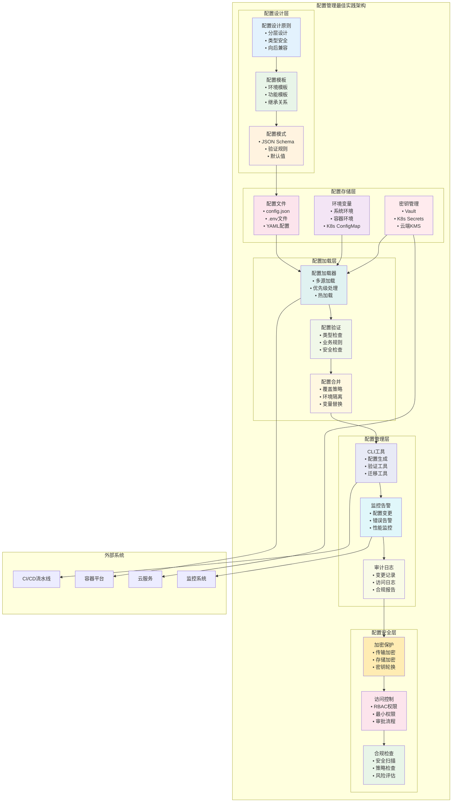

图19：配置管理最佳实践架构

### 9.8.2 配置管理实践指南

1. **分层配置策略**
   - 默认配置 < 配置文件 < 环境变量 < 命令行参数
   - 敏感信息优先从环境变量获取

2. **环境隔离**
   - 为不同环境维护独立的配置
   - 使用配置模板减少重复

3. **安全考虑**
   - 敏感信息加密存储
   - 配置变更审计日志
   - 定期安全检查

4. **版本控制**
   - 配置模板纳入版本控制
   - 配置变更可追溯
   - 支持配置回滚

5. **监控告警**
   - 监控配置变更
   - 配置错误告警
   - 性能影响监控

### 9.8.3 New-API项目配置架构总结

New-API项目的配置管理系统具有以下特点：

1. **灵活的加载机制**：支持多种配置源
2. **强类型验证**：确保配置的正确性
3. **安全性考虑**：敏感信息保护
4. **开发友好**：完整的工具链支持

通过合理的配置管理，可以显著提高应用的部署效率、运维便利性和系统安全性，这是企业级Go应用的重要组成部分。

## 本章小结

本章全面介绍了企业级Go应用中的配置管理体系，从基础概念到实践应用，构建了完整的配置管理知识框架：

**核心概念与架构**：
- 配置管理的基本概念、分层架构和设计原则
- 配置加载的优先级机制和覆盖策略
- 环境隔离与配置模板的继承关系

**技术实现**：
- New-API项目中的配置系统设计与实现
- 高级配置管理功能：热加载、远程配置、动态更新
- 环境变量管理：优先级处理、分组管理、验证机制

**工程实践**：
- 配置模板与生成器的设计模式
- 配置安全：威胁模型、加密保护、审计日志
- CLI工具开发：架构设计、命令执行流程

**最佳实践**：
- 企业级配置管理架构的完整体系
- 安全合规与监控告警机制
- 配置管理的全生命周期管理

通过本章学习，读者应掌握配置管理的核心技术、安全实践和工程方法，能够设计和实现企业级的配置管理系统。

## 练习题

### 基础练习

1. **配置分层设计**：为一个微服务应用设计三层配置架构（基础配置、环境配置、运行时配置），并实现配置加载器。

2. **环境变量管理**：实现一个环境变量分组管理系统，支持变量验证、文档生成和环境切换。

3. **配置验证器**：编写配置验证工具，检查配置完整性、类型正确性和业务规则合规性。

### 进阶练习

4. **配置热加载**：实现配置文件的热加载机制，支持配置变更通知和回滚功能。

5. **配置模板系统**：设计配置模板继承体系，支持模板组合、变量替换和条件渲染。

6. **安全配置管理**：实现敏感配置的加密存储、传输和访问控制机制。

### 综合项目

7. **配置管理CLI**：开发完整的配置管理命令行工具，包含生成、验证、迁移、加密等功能。

8. **配置中心**：设计并实现一个简化版的配置中心，支持多环境、版本管理和实时推送。

## 扩展阅读

### 理论基础
- [The Twelve-Factor App - Config](https://12factor.net/config)：十二要素应用的配置管理原则
- [Configuration Management Patterns](https://martinfowler.com/articles/configurationManagement.html)：配置管理的设计模式
- [Microservices Configuration Management](https://microservices.io/patterns/externalized-configuration.html)：微服务配置管理模式

### 技术实现
- [Viper Documentation](https://github.com/spf13/viper)：Go语言配置管理库
- [envconfig Usage Guide](https://github.com/kelseyhightower/envconfig)：环境变量配置库
- [Go Configuration Best Practices](https://dave.cheney.net/2014/10/17/functional-options-for-friendly-apis)：Go配置API设计

### 安全与合规
- [HashiCorp Vault](https://www.vaultproject.io/)：企业级密钥管理系统
- [SOPS - Secrets OPerationS](https://github.com/mozilla/sops)：加密配置文件管理
- [AWS Systems Manager Parameter Store](https://docs.aws.amazon.com/systems-manager/latest/userguide/systems-manager-parameter-store.html)：云端配置管理
- [Kubernetes ConfigMaps and Secrets](https://kubernetes.io/docs/concepts/configuration/)：容器化配置管理

### 工程实践
- [Configuration as Code](https://www.thoughtworks.com/radar/techniques/configuration-as-code)：配置即代码实践
- [GitOps Configuration Management](https://www.weave.works/technologies/gitops/)：GitOps配置管理模式
- [Monitoring Configuration Changes](https://prometheus.io/docs/practices/alerting/)：配置变更监控与告警

### 开源项目参考
- [Consul](https://www.consul.io/)：服务发现与配置管理
- [etcd](https://etcd.io/)：分布式键值存储与配置中心
- [Apollo](https://github.com/apolloconfig/apollo)：携程开源配置中心
- [Nacos](https://nacos.io/)：阿里巴巴开源配置中心
