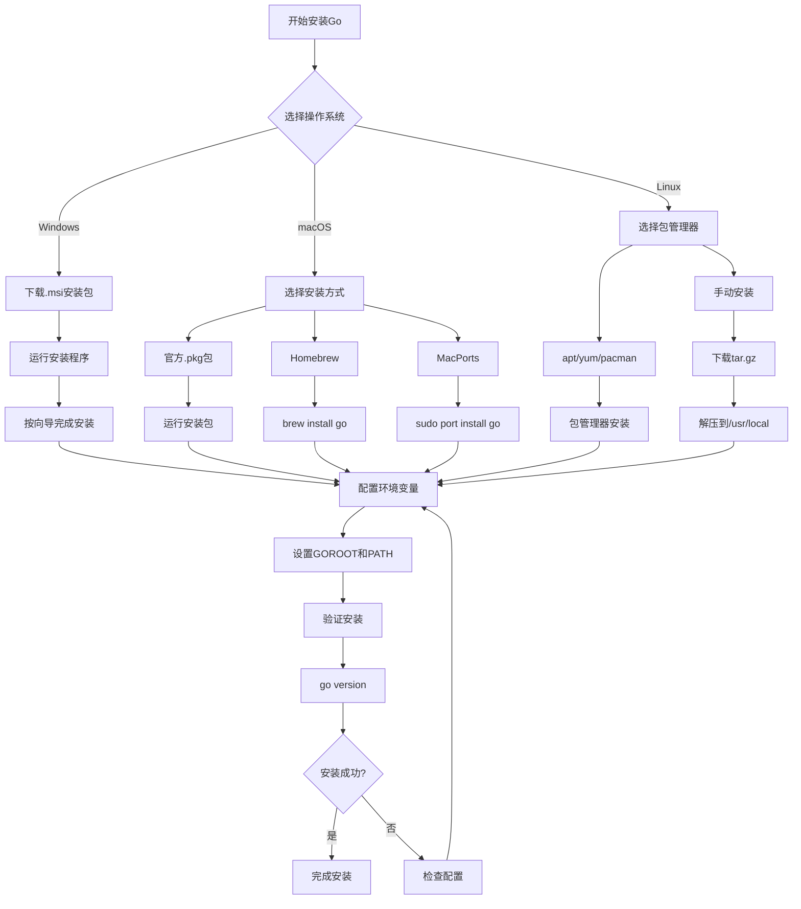
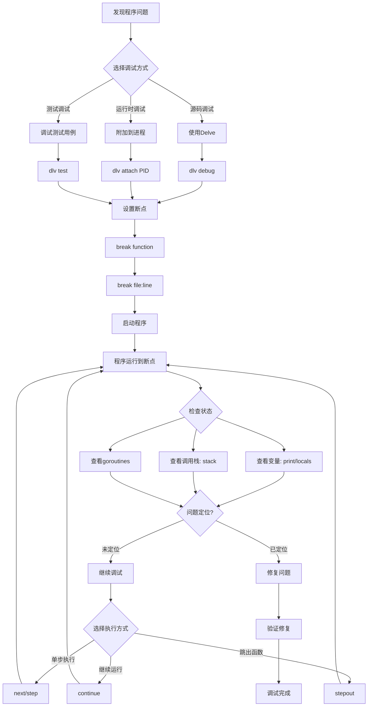
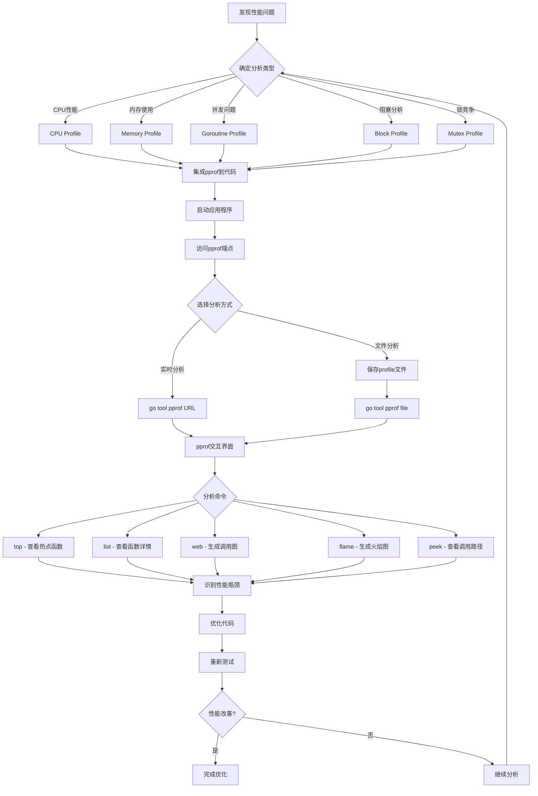

# 附录B：开发工具与环境配置

## B.1 概述

本附录详细介绍Go语言开发环境的搭建和配置，包括Go环境安装、IDE选择与配置、调试工具、性能分析工具、代码质量工具等，帮助开发者建立高效的Go开发环境。

## B.2 Go环境安装与配置

### B.2.1 Go安装

#### 官方安装方式

**Windows**：
1. 访问 https://golang.org/dl/
2. 下载Windows安装包（.msi文件）
3. 运行安装程序，按照向导完成安装
4. 默认安装路径：`C:\Program Files\Go`

**macOS**：
```bash
# 使用官方安装包
# 下载 .pkg 文件并安装

# 使用Homebrew
brew install go

# 使用MacPorts
sudo port install go
```

**Linux**：
```bash
# Ubuntu/Debian
sudo apt update
sudo apt install golang-go

# CentOS/RHEL/Fedora
sudo yum install golang
# 或者 (Fedora)
sudo dnf install golang

# Arch Linux
sudo pacman -S go

# 手动安装
wget https://golang.org/dl/go1.21.0.linux-amd64.tar.gz
sudo tar -C /usr/local -xzf go1.21.0.linux-amd64.tar.gz
```

#### 版本管理工具

**g (Go版本管理器)**：
```bash
# 安装g
curl -sSL https://git.io/g-install | sh -s

# 安装特定版本的Go
g install 1.21.0

# 切换Go版本
g use 1.21.0

# 列出已安装的版本
g list

# 列出可用版本
g list-all
```

**gvm (Go Version Manager)**：
```bash
# 安装gvm
bash < <(curl -s -S -L https://raw.githubusercontent.com/moovweb/gvm/master/binscripts/gvm-installer)

# 安装Go版本
gvm install go1.21.0

# 使用特定版本
gvm use go1.21.0 --default

# 列出版本
gvm list
```

#### Go安装流程图



图1 Go语言安装流程图

### B.2.2 环境变量配置

#### 必要的环境变量

**核心环境变量详解**：

1. **GOROOT**：Go语言安装根目录
   - 指向Go语言的安装位置
   - 包含Go编译器、标准库等核心文件
   - 通常无需手动设置，Go会自动检测

2. **GOPATH**：Go工作空间路径
   - Go 1.11之前的工作空间模式使用
   - 包含src、bin、pkg三个子目录
   - Go 1.11+引入模块后变为可选

3. **GOPROXY**：Go模块代理服务器
   - 用于下载Go模块的代理地址
   - 提高模块下载速度和可靠性
   - 支持多个代理地址，用逗号分隔

4. **GOSUMDB**：Go校验和数据库
   - 用于验证模块完整性和安全性
   - 防止模块被篡改
   - 默认使用sum.golang.org

5. **GO111MODULE**：模块支持开关
   - on：强制使用模块模式
   - off：强制使用GOPATH模式
   - auto：自动检测（默认）

```bash
# GOROOT: Go安装目录
export GOROOT=/usr/local/go

# GOPATH: 工作空间目录（Go 1.11+可选）
export GOPATH=$HOME/go

# PATH: 添加Go二进制文件路径
export PATH=$GOROOT/bin:$GOPATH/bin:$PATH

# GOPROXY: Go模块代理
export GOPROXY=https://goproxy.cn,direct

# GOSUMDB: 校验和数据库
export GOSUMDB=sum.golang.org

# GO111MODULE: 模块支持
export GO111MODULE=on

# GOOS: 目标操作系统
export GOOS=linux

# GOARCH: 目标架构
export GOARCH=amd64

# CGO_ENABLED: CGO支持开关
export CGO_ENABLED=1
```

#### 配置文件设置

**bash (.bashrc 或 .bash_profile)**：
```bash
# Go环境配置
export GOROOT=/usr/local/go
export GOPATH=$HOME/go
export PATH=$GOROOT/bin:$GOPATH/bin:$PATH
export GOPROXY=https://goproxy.cn,direct
export GO111MODULE=on

# 重新加载配置
source ~/.bashrc
```

**zsh (.zshrc)**：
```bash
# Go环境配置
export GOROOT=/usr/local/go
export GOPATH=$HOME/go
export PATH=$GOROOT/bin:$GOPATH/bin:$PATH
export GOPROXY=https://goproxy.cn,direct
export GO111MODULE=on

# 重新加载配置
source ~/.zshrc
```

**fish (config.fish)**：
```fish
# Go环境配置
set -gx GOROOT /usr/local/go
set -gx GOPATH $HOME/go
set -gx PATH $GOROOT/bin $GOPATH/bin $PATH
set -gx GOPROXY https://goproxy.cn,direct
set -gx GO111MODULE on
```

### B.2.3 验证安装

```bash
# 检查Go版本
go version

# 查看Go环境信息
go env

# 创建测试程序
mkdir hello
cd hello
go mod init hello

# 创建main.go
cat > main.go << EOF
package main

import "fmt"

func main() {
    fmt.Println("Hello, World!")
}
EOF

# 运行程序
go run main.go

# 构建程序
go build
./hello
```

## B.3 IDE与编辑器配置

### B.3.1 Visual Studio Code

#### 安装与基本配置

1. **安装VS Code**：
   - 访问 https://code.visualstudio.com/
   - 下载并安装适合你操作系统的版本

2. **安装Go扩展**：
   ```bash
   # 通过命令行安装
   code --install-extension golang.go
   ```

3. **配置settings.json**：
   ```json
   {
       "go.gopath": "/Users/username/go",
       "go.goroot": "/usr/local/go",
       "go.toolsGopath": "/Users/username/go",
       "go.useLanguageServer": true,
       "go.languageServerExperimentalFeatures": {
           "diagnostics": true,
           "documentLink": true
       },
       "go.lintOnSave": "package",
       "go.vetOnSave": "package",
       "go.formatTool": "goimports",
       "go.useCodeSnippetsOnFunctionSuggest": true,
       "go.inferGopath": true,
       "go.gocodeAutoBuild": true,
       "go.testFlags": ["-v"],
       "go.buildFlags": [],
       "go.lintFlags": [],
       "go.vetFlags": [],
       "go.coverOnSave": false,
       "go.coverOnSaveTimeout": "30s",
       "go.coverShowCounts": true,
       "go.generateTestsFlags": [
           "-exported"
       ]
   }
   ```

4. **安装Go工具**：
   ```bash
   # 在VS Code中按Ctrl+Shift+P，输入"Go: Install/Update Tools"
   # 或者手动安装
   go install -a golang.org/x/tools/gopls@latest
   go install -a github.com/cweill/gotests/gotests@latest
   go install -a github.com/fatih/gomodifytags@latest
   go install -a github.com/josharian/impl@latest
   go install -a github.com/haya14busa/goplay/cmd/goplay@latest
   go install -a github.com/go-delve/delve/cmd/dlv@latest
   go install -a honnef.co/go/tools/cmd/staticcheck@latest
   go install -a golang.org/x/lint/golint@latest
   ```

#### 推荐扩展

```json
{
    "recommendations": [
        "golang.go",
        "ms-vscode.vscode-json",
        "redhat.vscode-yaml",
        "ms-vscode.vscode-typescript-next",
        "bradlc.vscode-tailwindcss",
        "esbenp.prettier-vscode",
        "ms-vscode.vscode-eslint",
        "formulahendry.code-runner",
        "ms-vscode-remote.remote-containers",
        "ms-vscode-remote.remote-ssh",
        "gitpod.gitpod-desktop",
        "github.copilot",
        "github.copilot-chat"
    ]
}
```

### B.3.2 GoLand

#### 安装与配置

1. **安装GoLand**：
   - 访问 https://www.jetbrains.com/go/
   - 下载并安装GoLand

2. **配置Go SDK**：
   - File → Settings → Go → GOROOT
   - 设置Go安装路径

3. **配置GOPATH**：
   - File → Settings → Go → GOPATH
   - 添加工作空间路径

4. **配置代码格式化**：
   ```go
   // File → Settings → Editor → Code Style → Go
   // 启用以下选项：
   // - Use tab character
   // - Smart tabs
   // - Imports: Group stdlib imports
   // - Imports: Move all stdlib imports in a group
   // - Imports: Move all third-party imports in a group
   ```

5. **配置Live Templates**：
   ```go
   // File → Settings → Editor → Live Templates
   // 添加常用代码模板
   
   // err - 错误处理
   if err != nil {
       return err
   }
   
   // errlog - 错误日志
   if err != nil {
       log.Printf("Error: %v", err)
       return err
   }
   
   // test - 测试函数
   func Test$NAME$(t *testing.T) {
       $END$
   }
   ```

### B.3.3 Vim/Neovim

#### vim-go插件配置

```vim
" .vimrc 配置
" 使用vim-plug管理插件
call plug#begin('~/.vim/plugged')

" Go插件
Plug 'fatih/vim-go', { 'do': ':GoUpdateBinaries' }

" 自动补全
Plug 'neoclide/coc.nvim', {'branch': 'release'}

" 文件树
Plug 'preservim/nerdtree'

" 状态栏
Plug 'vim-airline/vim-airline'
Plug 'vim-airline/vim-airline-themes'

" 主题
Plug 'morhetz/gruvbox'

call plug#end()

" Go配置
let g:go_fmt_command = "goimports"
let g:go_autodetect_gopath = 1
let g:go_list_type = "quickfix"

let g:go_highlight_types = 1
let g:go_highlight_fields = 1
let g:go_highlight_functions = 1
let g:go_highlight_function_calls = 1
let g:go_highlight_extra_types = 1
let g:go_highlight_generate_tags = 1

" 快捷键映射
au FileType go nmap <leader>r <Plug>(go-run)
au FileType go nmap <leader>b <Plug>(go-build)
au FileType go nmap <leader>t <Plug>(go-test)
au FileType go nmap <leader>c <Plug>(go-coverage)
au FileType go nmap <Leader>ds <Plug>(go-def-split)
au FileType go nmap <Leader>dv <Plug>(go-def-vertical)
au FileType go nmap <Leader>dt <Plug>(go-def-tab)
au FileType go nmap <Leader>gd <Plug>(go-doc)
au FileType go nmap <Leader>gv <Plug>(go-doc-vertical)

" 主题设置
colorscheme gruvbox
set background=dark
```

#### Neovim配置 (Lua)

```lua
-- init.lua
-- 插件管理
local packer = require('packer')
packer.startup(function()
  use 'wbthomason/packer.nvim'
  use 'fatih/vim-go'
  use 'neovim/nvim-lspconfig'
  use 'hrsh7th/nvim-cmp'
  use 'hrsh7th/cmp-nvim-lsp'
  use 'L3MON4D3/LuaSnip'
  use 'nvim-treesitter/nvim-treesitter'
end)

-- LSP配置
local lspconfig = require('lspconfig')
lspconfig.gopls.setup{
  cmd = {'gopls'},
  settings = {
    gopls = {
      analyses = {
        unusedparams = true,
      },
      staticcheck = true,
    },
  },
}

-- 自动补全配置
local cmp = require('cmp')
cmp.setup({
  snippet = {
    expand = function(args)
      require('luasnip').lsp_expand(args.body)
    end,
  },
  mapping = {
    ['<C-d>'] = cmp.mapping.scroll_docs(-4),
    ['<C-f>'] = cmp.mapping.scroll_docs(4),
    ['<C-Space>'] = cmp.mapping.complete(),
    ['<C-e>'] = cmp.mapping.close(),
    ['<CR>'] = cmp.mapping.confirm({ select = true }),
  },
  sources = {
    { name = 'nvim_lsp' },
    { name = 'luasnip' },
  }
})
```

### B.3.4 Emacs

#### go-mode配置

```elisp
;; .emacs 或 init.el 配置
(require 'package)
(add-to-list 'package-archives
             '("melpa" . "https://melpa.org/packages/") t)
(package-initialize)

;; 安装必要的包
(unless (package-installed-p 'go-mode)
  (package-refresh-contents)
  (package-install 'go-mode))

(unless (package-installed-p 'company)
  (package-install 'company))

(unless (package-installed-p 'flycheck)
  (package-install 'flycheck))

;; Go配置
(require 'go-mode)
(add-hook 'go-mode-hook
          (lambda ()
            (setq tab-width 4)
            (setq indent-tabs-mode t)
            (setq gofmt-command "goimports")
            (add-hook 'before-save-hook 'gofmt-before-save)
            (local-set-key (kbd "C-c C-r") 'go-remove-unused-imports)
            (local-set-key (kbd "C-c C-g") 'go-goto-imports)
            (local-set-key (kbd "C-c C-f") 'gofmt)
            (local-set-key (kbd "C-c C-k") 'godoc)))

;; 自动补全
(add-hook 'after-init-hook 'global-company-mode)

;; 语法检查
(add-hook 'after-init-hook #'global-flycheck-mode)
```

## B.4 调试工具

#### Go程序调试流程图



图2 Go程序调试流程图

### B.4.1 Delve调试器

#### 安装Delve

```bash
# 安装delve
go install github.com/go-delve/delve/cmd/dlv@latest

# 验证安装
dlv version
```

#### 基本调试命令

```bash
# 调试当前包
dlv debug

# 调试指定文件
dlv debug main.go

# 调试测试
dlv test

# 附加到运行中的进程
dlv attach <pid>

# 远程调试
dlv debug --headless --listen=:2345 --api-version=2
```

#### 调试会话命令

```bash
# 设置断点
(dlv) break main.main
(dlv) break main.go:10
(dlv) break /path/to/file.go:20

# 查看断点
(dlv) breakpoints

# 删除断点
(dlv) clear 1
(dlv) clearall

# 运行控制
(dlv) continue
(dlv) next
(dlv) step
(dlv) stepout

# 查看变量
(dlv) print variable_name
(dlv) locals
(dlv) args

# 查看调用栈
(dlv) stack
(dlv) goroutines
(dlv) goroutine 1

# 退出调试
(dlv) quit
```

#### VS Code中使用Delve

**launch.json配置**：
```json
{
    "version": "0.2.0",
    "configurations": [
        {
            "name": "Launch Package",
            "type": "go",
            "request": "launch",
            "mode": "debug",
            "program": "${workspaceFolder}",
            "env": {},
            "args": []
        },
        {
            "name": "Launch File",
            "type": "go",
            "request": "launch",
            "mode": "debug",
            "program": "${file}"
        },
        {
            "name": "Launch Test Package",
            "type": "go",
            "request": "launch",
            "mode": "test",
            "program": "${workspaceFolder}"
        },
        {
            "name": "Launch Test File",
            "type": "go",
            "request": "launch",
            "mode": "test",
            "program": "${file}"
        },
        {
            "name": "Attach to Process",
            "type": "go",
            "request": "attach",
            "mode": "local",
            "processId": 0
        },
        {
            "name": "Connect to server",
            "type": "go",
            "request": "attach",
            "mode": "remote",
            "remotePath": "${workspaceFolder}",
            "port": 2345,
            "host": "127.0.0.1"
        }
    ]
}
```

### B.4.2 GDB调试

#### 编译调试版本

```bash
# 编译时保留调试信息
go build -gcflags="-N -l" -o myapp main.go

# 使用GDB调试
gdb myapp
```

#### GDB基本命令

```bash
# 设置断点
(gdb) break main.main
(gdb) break main.go:10

# 运行程序
(gdb) run

# 单步执行
(gdb) next
(gdb) step

# 查看变量
(gdb) print variable_name
(gdb) info locals

# 查看调用栈
(gdb) backtrace
(gdb) info goroutines

# 切换goroutine
(gdb) goroutine 1 bt
```

## B.5 性能分析工具

#### Go性能分析流程图



图3 Go性能分析流程图

### B.5.1 pprof性能分析

#### 在代码中集成pprof

```go
package main

import (
    "log"
    "net/http"
    _ "net/http/pprof"
    "time"
)

func main() {
    // 启动pprof HTTP服务器
    go func() {
        log.Println(http.ListenAndServe("localhost:6060", nil))
    }()
    
    // 你的应用程序代码
    for {
        // 模拟一些工作
        time.Sleep(time.Second)
    }
}
```

#### 使用pprof分析

```bash
# CPU性能分析
go tool pprof http://localhost:6060/debug/pprof/profile?seconds=30

# 内存分析
go tool pprof http://localhost:6060/debug/pprof/heap

# Goroutine分析
go tool pprof http://localhost:6060/debug/pprof/goroutine

# 阻塞分析
go tool pprof http://localhost:6060/debug/pprof/block

# 互斥锁分析
go tool pprof http://localhost:6060/debug/pprof/mutex
```

#### pprof交互命令

```bash
# 查看top函数
(pprof) top
(pprof) top10

# 查看函数详情
(pprof) list function_name

# 生成调用图
(pprof) web

# 生成火焰图
(pprof) web --flame

# 查看汇编代码
(pprof) disasm function_name

# 比较两个profile
go tool pprof -base profile1.pb.gz profile2.pb.gz
```

### B.5.2 trace工具

#### 生成trace文件

```go
package main

import (
    "os"
    "runtime/trace"
    "time"
)

func main() {
    // 创建trace文件
    f, err := os.Create("trace.out")
    if err != nil {
        panic(err)
    }
    defer f.Close()
    
    // 开始trace
    err = trace.Start(f)
    if err != nil {
        panic(err)
    }
    defer trace.Stop()
    
    // 你的应用程序代码
    for i := 0; i < 10; i++ {
        go func(id int) {
            time.Sleep(time.Millisecond * 100)
        }(i)
    }
    
    time.Sleep(time.Second)
}
```

#### 分析trace文件

```bash
# 运行程序生成trace文件
go run main.go

# 分析trace文件
go tool trace trace.out

# 在浏览器中查看
# 访问 http://localhost:port 查看trace分析结果
```

### B.5.3 benchstat工具

#### 安装benchstat

```bash
go install golang.org/x/perf/cmd/benchstat@latest
```

#### 使用benchstat比较性能

```bash
# 运行基准测试并保存结果
go test -bench=. -count=5 > old.txt

# 修改代码后再次运行
go test -bench=. -count=5 > new.txt

# 比较性能差异
benchstat old.txt new.txt
```

## B.6 代码质量工具

### B.6.1 静态分析工具

#### golangci-lint

```bash
# 安装golangci-lint
curl -sSfL https://raw.githubusercontent.com/golangci/golangci-lint/master/install.sh | sh -s -- -b $(go env GOPATH)/bin v1.54.2

# 运行检查
golangci-lint run

# 运行特定linter
golangci-lint run --enable-all
golangci-lint run --disable-all --enable=govet,errcheck,staticcheck

# 配置文件 .golangci.yml
linters-settings:
  govet:
    check-shadowing: true
  golint:
    min-confidence: 0
  gocyclo:
    min-complexity: 15
  maligned:
    suggest-new: true
  dupl:
    threshold: 100
  goconst:
    min-len: 2
    min-occurrences: 2
  depguard:
    list-type: blacklist
    packages:
      - github.com/sirupsen/logrus
    packages-with-error-message:
      - github.com/sirupsen/logrus: "logging is allowed only by logutils.Log"
  misspell:
    locale: US
  lll:
    line-length: 140
  goimports:
    local-prefixes: github.com/golangci/golangci-lint
  gocritic:
    enabled-tags:
      - diagnostic
      - experimental
      - opinionated
      - performance
      - style
    disabled-checks:
      - dupImport # https://github.com/go-critic/go-critic/issues/845
      - ifElseChain
      - octalLiteral
      - whyNoLint
      - wrapperFunc

linters:
  disable-all: true
  enable:
    - bodyclose
    - deadcode
    - depguard
    - dogsled
    - dupl
    - errcheck
    - funlen
    - gochecknoinits
    - goconst
    - gocritic
    - gocyclo
    - gofmt
    - goimports
    - golint
    - gomnd
    - goprintffuncname
    - gosec
    - gosimple
    - govet
    - ineffassign
    - interfacer
    - lll
    - misspell
    - nakedret
    - noctx
    - nolintlint
    - rowserrcheck
    - scopelint
    - staticcheck
    - structcheck
    - stylecheck
    - typecheck
    - unconvert
    - unparam
    - unused
    - varcheck
    - whitespace

run:
  skip-dirs:
    - test/testdata_etc
    - internal/cache
    - internal/renameio
    - internal/robustio

issues:
  exclude-rules:
    - path: _test\.go
      linters:
        - gomnd

  exclude-use-default: false
  exclude:
    - 'declaration of "err" shadows declaration at'
    - 'declaration of "ok" shadows declaration at'
```

#### staticcheck

```bash
# 安装staticcheck
go install honnef.co/go/tools/cmd/staticcheck@latest

# 运行检查
staticcheck ./...

# 检查特定包
staticcheck github.com/example/project/...
```

#### gosec安全检查

```bash
# 安装gosec
go install github.com/securecodewarrior/gosec/v2/cmd/gosec@latest

# 运行安全检查
gosec ./...

# 生成报告
gosec -fmt json -out results.json ./...
```

### B.6.2 代码格式化工具

#### gofmt和goimports

```bash
# 格式化代码
gofmt -w .

# 格式化并整理导入
goimports -w .

# 检查格式是否正确
gofmt -d .

# 简化代码
gofmt -s -w .
```

#### gofumpt

```bash
# 安装gofumpt
go install mvdan.cc/gofumpt@latest

# 格式化代码（更严格的格式化）
gofumpt -w .

# 检查格式
gofumpt -d .
```

### B.6.3 测试覆盖率工具

#### 生成覆盖率报告

```bash
# 运行测试并生成覆盖率文件
go test -coverprofile=coverage.out ./...

# 查看覆盖率
go tool cover -func=coverage.out

# 生成HTML报告
go tool cover -html=coverage.out -o coverage.html

# 在浏览器中打开
open coverage.html
```

#### 覆盖率脚本

```bash
#!/bin/bash
# coverage.sh

set -e

echo "Running tests with coverage..."
go test -coverprofile=coverage.out ./...

echo "Coverage report:"
go tool cover -func=coverage.out

echo "Generating HTML report..."
go tool cover -html=coverage.out -o coverage.html

echo "Coverage report generated: coverage.html"

# 检查覆盖率阈值
COVERAGE=$(go tool cover -func=coverage.out | grep total | awk '{print $3}' | sed 's/%//')
THRESHOLD=80

if (( $(echo "$COVERAGE < $THRESHOLD" | bc -l) )); then
    echo "Coverage $COVERAGE% is below threshold $THRESHOLD%"
    exit 1
else
    echo "Coverage $COVERAGE% meets threshold $THRESHOLD%"
fi
```

## B.7 构建与部署工具

### B.7.1 Make工具

#### Makefile示例

```makefile
# Makefile
.PHONY: build test clean run docker-build docker-run

# 变量定义
APP_NAME := myapp
VERSION := $(shell git describe --tags --always --dirty)
BUILD_TIME := $(shell date +%Y-%m-%dT%H:%M:%S)
GIT_COMMIT := $(shell git rev-parse HEAD)
GO_VERSION := $(shell go version | awk '{print $$3}')

# 构建标志
LDFLAGS := -ldflags "-X main.Version=$(VERSION) -X main.BuildTime=$(BUILD_TIME) -X main.GitCommit=$(GIT_COMMIT)"

# 默认目标
all: test build

# 构建
build:
	@echo "Building $(APP_NAME)..."
	go build $(LDFLAGS) -o bin/$(APP_NAME) ./cmd/$(APP_NAME)

# 交叉编译
build-linux:
	CGO_ENABLED=0 GOOS=linux GOARCH=amd64 go build $(LDFLAGS) -o bin/$(APP_NAME)-linux ./cmd/$(APP_NAME)

build-windows:
	CGO_ENABLED=0 GOOS=windows GOARCH=amd64 go build $(LDFLAGS) -o bin/$(APP_NAME).exe ./cmd/$(APP_NAME)

build-darwin:
	CGO_ENABLED=0 GOOS=darwin GOARCH=amd64 go build $(LDFLAGS) -o bin/$(APP_NAME)-darwin ./cmd/$(APP_NAME)

# 测试
test:
	@echo "Running tests..."
	go test -v ./...

# 测试覆盖率
test-coverage:
	@echo "Running tests with coverage..."
	go test -coverprofile=coverage.out ./...
	go tool cover -html=coverage.out -o coverage.html

# 基准测试
bench:
	@echo "Running benchmarks..."
	go test -bench=. -benchmem ./...

# 代码检查
lint:
	@echo "Running linters..."
	golangci-lint run

# 格式化代码
fmt:
	@echo "Formatting code..."
	gofmt -s -w .
	goimports -w .

# 运行
run:
	@echo "Running $(APP_NAME)..."
	go run ./cmd/$(APP_NAME)

# 清理
clean:
	@echo "Cleaning..."
	rm -rf bin/
	rm -f coverage.out coverage.html

# Docker构建
docker-build:
	@echo "Building Docker image..."
	docker build -t $(APP_NAME):$(VERSION) .
	docker tag $(APP_NAME):$(VERSION) $(APP_NAME):latest

# Docker运行
docker-run:
	@echo "Running Docker container..."
	docker run --rm -p 8080:8080 $(APP_NAME):latest

# 安装依赖
deps:
	@echo "Installing dependencies..."
	go mod download
	go mod tidy

# 更新依赖
update-deps:
	@echo "Updating dependencies..."
	go get -u ./...
	go mod tidy

# 生成代码
generate:
	@echo "Generating code..."
	go generate ./...

# 安装工具
install-tools:
	@echo "Installing development tools..."
	go install github.com/golangci/golangci-lint/cmd/golangci-lint@latest
	go install golang.org/x/tools/cmd/goimports@latest
	go install github.com/go-delve/delve/cmd/dlv@latest

# 帮助
help:
	@echo "Available targets:"
	@echo "  build         - Build the application"
	@echo "  test          - Run tests"
	@echo "  test-coverage - Run tests with coverage"
	@echo "  bench         - Run benchmarks"
	@echo "  lint          - Run linters"
	@echo "  fmt           - Format code"
	@echo "  run           - Run the application"
	@echo "  clean         - Clean build artifacts"
	@echo "  docker-build  - Build Docker image"
	@echo "  docker-run    - Run Docker container"
	@echo "  deps          - Install dependencies"
	@echo "  update-deps   - Update dependencies"
	@echo "  generate      - Generate code"
	@echo "  install-tools - Install development tools"
```

### B.7.2 Docker配置

#### Dockerfile

```dockerfile
# 多阶段构建Dockerfile
# 构建阶段
FROM golang:1.21-alpine AS builder

# 设置工作目录
WORKDIR /app

# 安装必要的包
RUN apk add --no-cache git ca-certificates tzdata

# 复制go mod文件
COPY go.mod go.sum ./

# 下载依赖
RUN go mod download

# 复制源代码
COPY . .

# 构建应用
RUN CGO_ENABLED=0 GOOS=linux go build -a -installsuffix cgo -o main ./cmd/myapp

# 运行阶段
FROM alpine:latest

# 安装ca证书
RUN apk --no-cache add ca-certificates tzdata

# 创建非root用户
RUN addgroup -g 1001 -S appgroup && \
    adduser -u 1001 -S appuser -G appgroup

WORKDIR /root/

# 从构建阶段复制二进制文件
COPY --from=builder /app/main .

# 复制配置文件（如果有）
COPY --from=builder /app/configs ./configs

# 切换到非root用户
USER appuser

# 暴露端口
EXPOSE 8080

# 运行应用
CMD ["./main"]
```

#### docker-compose.yml

```yaml
version: '3.8'

services:
  app:
    build:
      context: .
      dockerfile: Dockerfile
    ports:
      - "8080:8080"
    environment:
      - GO_ENV=production
      - DB_HOST=postgres
      - DB_PORT=5432
      - DB_NAME=myapp
      - DB_USER=postgres
      - DB_PASSWORD=password
      - REDIS_HOST=redis
      - REDIS_PORT=6379
    depends_on:
      - postgres
      - redis
    networks:
      - app-network
    restart: unless-stopped
    healthcheck:
      test: ["CMD", "curl", "-f", "http://localhost:8080/health"]
      interval: 30s
      timeout: 10s
      retries: 3

  postgres:
    image: postgres:15-alpine
    environment:
      - POSTGRES_DB=myapp
      - POSTGRES_USER=postgres
      - POSTGRES_PASSWORD=password
    ports:
      - "5432:5432"
    volumes:
      - postgres_data:/var/lib/postgresql/data
      - ./scripts/init.sql:/docker-entrypoint-initdb.d/init.sql
    networks:
      - app-network
    restart: unless-stopped

  redis:
    image: redis:7-alpine
    ports:
      - "6379:6379"
    volumes:
      - redis_data:/data
    networks:
      - app-network
    restart: unless-stopped
    command: redis-server --appendonly yes

  nginx:
    image: nginx:alpine
    ports:
      - "80:80"
      - "443:443"
    volumes:
      - ./nginx/nginx.conf:/etc/nginx/nginx.conf
      - ./nginx/ssl:/etc/nginx/ssl
    depends_on:
      - app
    networks:
      - app-network
    restart: unless-stopped

volumes:
  postgres_data:
  redis_data:

networks:
  app-network:
    driver: bridge
```

### B.7.3 CI/CD配置

#### GitHub Actions

```yaml
# .github/workflows/ci.yml
name: CI/CD Pipeline

on:
  push:
    branches: [ main, develop ]
  pull_request:
    branches: [ main ]

jobs:
  test:
    runs-on: ubuntu-latest
    
    services:
      postgres:
        image: postgres:15
        env:
          POSTGRES_PASSWORD: postgres
          POSTGRES_DB: test
        options: >-
          --health-cmd pg_isready
          --health-interval 10s
          --health-timeout 5s
          --health-retries 5
        ports:
          - 5432:5432
      
      redis:
        image: redis:7
        options: >-
          --health-cmd "redis-cli ping"
          --health-interval 10s
          --health-timeout 5s
          --health-retries 5
        ports:
          - 6379:6379
    
    steps:
    - uses: actions/checkout@v3
    
    - name: Set up Go
      uses: actions/setup-go@v4
      with:
        go-version: '1.21'
    
    - name: Cache Go modules
      uses: actions/cache@v3
      with:
        path: ~/go/pkg/mod
        key: ${{ runner.os }}-go-${{ hashFiles('**/go.sum') }}
        restore-keys: |
          ${{ runner.os }}-go-
    
    - name: Install dependencies
      run: go mod download
    
    - name: Run tests
      run: go test -v -coverprofile=coverage.out ./...
      env:
        DB_HOST: localhost
        DB_PORT: 5432
        DB_NAME: test
        DB_USER: postgres
        DB_PASSWORD: postgres
        REDIS_HOST: localhost
        REDIS_PORT: 6379
    
    - name: Upload coverage to Codecov
      uses: codecov/codecov-action@v3
      with:
        file: ./coverage.out
    
    - name: Run linter
      uses: golangci/golangci-lint-action@v3
      with:
        version: latest
    
    - name: Build
      run: go build -v ./...
  
  build-and-push:
    needs: test
    runs-on: ubuntu-latest
    if: github.ref == 'refs/heads/main'
    
    steps:
    - uses: actions/checkout@v3
    
    - name: Set up Docker Buildx
      uses: docker/setup-buildx-action@v2
    
    - name: Login to DockerHub
      uses: docker/login-action@v2
      with:
        username: ${{ secrets.DOCKERHUB_USERNAME }}
        password: ${{ secrets.DOCKERHUB_TOKEN }}
    
    - name: Build and push
      uses: docker/build-push-action@v4
      with:
        context: .
        push: true
        tags: |
          myapp:latest
          myapp:${{ github.sha }}
        cache-from: type=gha
        cache-to: type=gha,mode=max
  
  deploy:
    needs: build-and-push
    runs-on: ubuntu-latest
    if: github.ref == 'refs/heads/main'
    
    steps:
    - name: Deploy to production
      run: |
        echo "Deploying to production..."
        # 这里添加你的部署脚本
```

#### GitLab CI

```yaml
# .gitlab-ci.yml
stages:
  - test
  - build
  - deploy

variables:
  GO_VERSION: "1.21"
  DOCKER_DRIVER: overlay2
  DOCKER_TLS_CERTDIR: "/certs"

before_script:
  - apt-get update -qq && apt-get install -y -qq git ca-certificates
  - wget -O- -nv https://raw.githubusercontent.com/golangci/golangci-lint/master/install.sh | sh -s v1.54.2
  - cp ./bin/golangci-lint $GOPATH/bin/

test:
  stage: test
  image: golang:${GO_VERSION}
  services:
    - postgres:15
    - redis:7
  variables:
    POSTGRES_DB: test
    POSTGRES_USER: postgres
    POSTGRES_PASSWORD: postgres
    DB_HOST: postgres
    DB_PORT: 5432
    DB_NAME: test
    DB_USER: postgres
    DB_PASSWORD: postgres
    REDIS_HOST: redis
    REDIS_PORT: 6379
  script:
    - go mod download
    - go test -v -coverprofile=coverage.out ./...
    - go tool cover -func=coverage.out
    - golangci-lint run
  artifacts:
    reports:
      coverage_report:
        coverage_format: cobertura
        path: coverage.xml
    paths:
      - coverage.out
    expire_in: 1 week
  coverage: '/total:.*?(\d+\.\d+)%/'

build:
  stage: build
  image: docker:latest
  services:
    - docker:dind
  before_script:
    - docker login -u $CI_REGISTRY_USER -p $CI_REGISTRY_PASSWORD $CI_REGISTRY
  script:
    - docker build -t $CI_REGISTRY_IMAGE:$CI_COMMIT_SHA .
    - docker push $CI_REGISTRY_IMAGE:$CI_COMMIT_SHA
    - docker tag $CI_REGISTRY_IMAGE:$CI_COMMIT_SHA $CI_REGISTRY_IMAGE:latest
    - docker push $CI_REGISTRY_IMAGE:latest
  only:
    - main

deploy_staging:
  stage: deploy
  image: alpine:latest
  before_script:
    - apk add --no-cache curl
  script:
    - echo "Deploying to staging..."
    # 添加部署到staging环境的脚本
  environment:
    name: staging
    url: https://staging.example.com
  only:
    - develop

deploy_production:
  stage: deploy
  image: alpine:latest
  before_script:
    - apk add --no-cache curl
  script:
    - echo "Deploying to production..."
    # 添加部署到生产环境的脚本
  environment:
    name: production
    url: https://example.com
  when: manual
  only:
    - main
```

## B.8 本章小结

本附录详细介绍了Go语言开发环境的搭建和配置，涵盖了从基础环境安装到高级工具配置的各个方面：

### 主要内容回顾

1. **Go环境安装与配置**
   - 多平台安装方法
   - 版本管理工具使用
   - 环境变量配置
   - 安装验证

2. **IDE与编辑器配置**
   - VS Code完整配置
   - GoLand专业配置
   - Vim/Neovim配置
   - Emacs配置

3. **调试工具**
   - Delve调试器使用
   - GDB调试配置
   - IDE集成调试

4. **性能分析工具**
   - pprof性能分析
   - trace工具使用
   - benchstat性能比较

5. **代码质量工具**
   - 静态分析工具
   - 代码格式化
   - 测试覆盖率

6. **构建与部署工具**
   - Makefile配置
   - Docker容器化
   - CI/CD流水线

### 最佳实践建议

1. **环境标准化**：团队应该统一开发环境配置，使用相同的Go版本和工具链

2. **自动化工具链**：集成代码格式化、静态分析、测试等工具到开发流程中

3. **性能监控**：在开发过程中定期进行性能分析，及早发现性能问题

4. **代码质量**：建立代码质量门禁，确保代码符合团队标准

5. **容器化部署**：使用Docker进行应用打包和部署，确保环境一致性

6. **CI/CD流水线**：建立自动化的持续集成和部署流水线，提高开发效率

通过合理配置和使用这些工具，可以大大提高Go语言开发的效率和代码质量，为企业级项目开发提供坚实的工具基础。

## B.9 扩展阅读

### 官方资源

1. **Go官方文档**
   - Go安装指南：https://golang.org/doc/install
   - Go环境配置：https://golang.org/doc/code.html
   - Go模块参考：https://golang.org/ref/mod
   - Go命令参考：https://golang.org/cmd/go/

2. **Go工具链文档**
   - go tool pprof：https://golang.org/cmd/pprof/
   - go tool trace：https://golang.org/cmd/trace/
   - go tool cover：https://golang.org/cmd/cover/

### 开发工具

1. **IDE和编辑器**
   - VS Code Go扩展：https://marketplace.visualstudio.com/items?itemName=golang.Go
   - GoLand官网：https://www.jetbrains.com/go/
   - vim-go插件：https://github.com/fatih/vim-go
   - Emacs go-mode：https://github.com/dominikh/go-mode.el

2. **调试工具**
   - Delve调试器：https://github.com/go-delve/delve
   - Delve文档：https://github.com/go-delve/delve/tree/master/Documentation
   - GDB Go支持：https://golang.org/doc/gdb

3. **代码质量工具**
   - golangci-lint：https://golangci-lint.run/
   - staticcheck：https://staticcheck.io/
   - gosec安全检查：https://github.com/securecodewarrior/gosec
   - gofumpt格式化：https://github.com/mvdan/gofumpt

### 性能分析资源

1. **性能分析指南**
   - Go性能分析实战：https://blog.golang.org/pprof
   - 火焰图分析：https://www.brendangregg.com/flamegraphs.html
   - Go内存分析：https://golang.org/doc/diagnostics.html

2. **基准测试**
   - 基准测试最佳实践：https://dave.cheney.net/2013/06/30/how-to-write-benchmarks-in-go
   - benchstat工具：https://godoc.org/golang.org/x/perf/cmd/benchstat

### 构建和部署

1. **容器化**
   - Docker官方Go镜像：https://hub.docker.com/_/golang
   - 多阶段构建：https://docs.docker.com/develop/dev-best-practices/
   - Go应用容器化最佳实践：https://chemidy.medium.com/create-the-smallest-and-secured-golang-docker-image-based-on-scratch-4752223b7324

2. **CI/CD**
   - GitHub Actions Go工作流：https://docs.github.com/en/actions/guides/building-and-testing-go
   - GitLab CI Go配置：https://docs.gitlab.com/ee/ci/examples/test-and-deploy-golang-application-to-heroku.html
   - Jenkins Go插件：https://plugins.jenkins.io/golang/

### 社区资源

1. **学习资源**
   - Go by Example：https://gobyexample.com/
   - Effective Go：https://golang.org/doc/effective_go.html
   - Go Code Review Comments：https://github.com/golang/go/wiki/CodeReviewComments

2. **社区工具**
   - Awesome Go：https://github.com/avelino/awesome-go
   - Go工具集合：https://github.com/golang/tools
   - Go开发者调查：https://blog.golang.org/survey2021-results

3. **博客和教程**
   - Go官方博客：https://blog.golang.org/
   - Dave Cheney博客：https://dave.cheney.net/
   - Go语言中文网：https://studygolang.com/

### 版本管理工具

1. **Go版本管理**
   - g版本管理器：https://github.com/stefanmaric/g
   - gvm版本管理器：https://github.com/moovweb/gvm
   - 官方版本下载：https://golang.org/dl/

通过这些扩展阅读资源，开发者可以深入了解Go语言开发工具生态系统，掌握更多高级技巧和最佳实践。