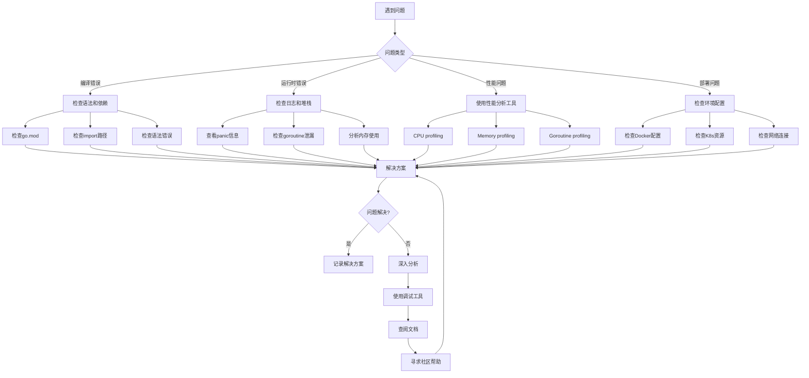
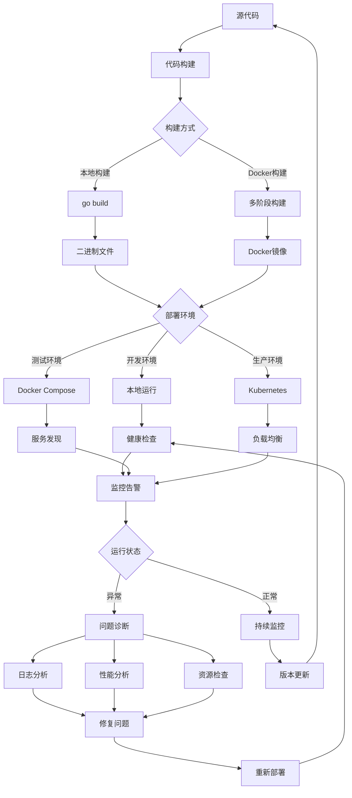
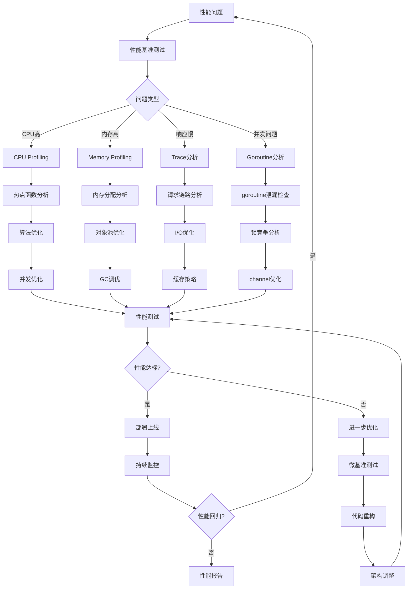

# 附录C：常见问题与解决方案

## C.1 概述

本附录收集了Go语言开发过程中经常遇到的问题及其解决方案，包括编译问题、运行时问题、性能问题、部署问题等。这些问题和解决方案来自于实际项目开发经验，可以帮助开发者快速定位和解决类似问题。

### 问题诊断流程



*图1 Go语言问题诊断流程图*

## C.2 环境与安装问题

### C.2.1 Go安装和环境配置问题

#### 问题1：go: command not found

**现象**：
```bash
$ go version
bash: go: command not found
```

**原因**：Go没有正确安装或PATH环境变量没有配置。

**解决方案**：
```bash
# 1. 检查Go是否已安装
ls /usr/local/go/bin/go

# 2. 如果已安装，配置PATH环境变量
echo 'export PATH=/usr/local/go/bin:$PATH' >> ~/.bashrc
source ~/.bashrc

# 3. 如果未安装，重新安装Go
wget https://golang.org/dl/go1.21.0.linux-amd64.tar.gz
sudo tar -C /usr/local -xzf go1.21.0.linux-amd64.tar.gz
```

#### 问题2：GOPATH和GOROOT配置混乱

**现象**：
```bash
$ go env GOPATH
/usr/local/go
$ go env GOROOT
/home/user/go
```

**原因**：GOPATH和GOROOT配置错误。

**解决方案**：
```bash
# 正确配置环境变量
export GOROOT=/usr/local/go        # Go安装目录
export GOPATH=$HOME/go             # 工作空间目录
export PATH=$GOROOT/bin:$GOPATH/bin:$PATH

# 验证配置
go env GOROOT  # 应该显示 /usr/local/go
go env GOPATH  # 应该显示 /home/user/go
```

#### 问题3：代理配置问题

**现象**：
```bash
$ go get github.com/gin-gonic/gin
go: github.com/gin-gonic/gin@v1.9.1: Get "https://proxy.golang.org/github.com/gin-gonic/gin/@v/v1.9.1.mod": dial tcp 172.217.160.81:443: i/o timeout
```

**原因**：网络问题或代理配置不当。

**解决方案**：
```bash
# 配置国内代理
go env -w GOPROXY=https://goproxy.cn,direct
go env -w GOSUMDB=sum.golang.org

# 或者配置多个代理
go env -w GOPROXY=https://goproxy.cn,https://goproxy.io,direct

# 对于私有仓库，配置GOPRIVATE
go env -w GOPRIVATE=*.corp.example.com,rsc.io/private
```

### C.2.2 模块管理问题

#### 问题4：go.mod文件问题

**现象**：
```bash
$ go run main.go
go: cannot find main module, but found .git/config in /path/to/project
```

**原因**：项目目录中没有go.mod文件。

**解决方案**：
```bash
# 初始化模块
go mod init project-name

# 如果是现有项目
go mod init github.com/username/project-name

# 整理依赖
go mod tidy
```

#### 问题5：依赖版本冲突

**现象**：
```bash
go: github.com/example/package@v1.0.0: parsing go.mod:
        module declares its path as: github.com/example/other
                but was required as: github.com/example/package
```

**原因**：依赖包的模块路径与引用路径不一致。

**解决方案**：
```bash
# 1. 检查go.mod文件中的依赖声明
cat go.mod

# 2. 使用正确的模块路径
go mod edit -replace github.com/example/package=github.com/example/other@v1.0.0

# 3. 或者直接修改import语句使用正确的路径
# import "github.com/example/other"

# 4. 清理并重新下载依赖
go clean -modcache
go mod download
```

## C.3 编译和构建问题

### C.3.1 编译错误

#### 问题6：undefined reference错误

**现象**：
```bash
$ go build
# github.com/example/project
./main.go:10:2: undefined: someFunction
```

**原因**：函数未定义或包未正确导入。

**解决方案**：
```go
// 1. 检查函数是否存在
// 2. 检查包是否正确导入
package main

import (
    "fmt"
    "github.com/example/package" // 确保包路径正确
)

func main() {
    // 确保函数名正确，注意大小写
    result := package.SomeFunction()
    fmt.Println(result)
}
```

#### 问题7：循环导入错误

**现象**：
```bash
$ go build
package github.com/example/project/a
        imports github.com/example/project/b
        imports github.com/example/project/a: import cycle not allowed
```

**原因**：包之间存在循环依赖。

**解决方案**：
```go
// 方案1：提取公共接口到独立包
// common/interfaces.go
package common

type Service interface {
    Process() error
}

// a/service.go
package a

import "github.com/example/project/common"

type ServiceA struct{}

func (s *ServiceA) Process() error {
    return nil
}

// b/service.go
package b

import "github.com/example/project/common"

type ServiceB struct {
    service common.Service
}

func NewServiceB(service common.Service) *ServiceB {
    return &ServiceB{service: service}
}
```

#### 问题8：CGO编译问题

**CGO概念解析**：
CGO是Go语言提供的一种机制，允许Go程序调用C语言代码。CGO通过特殊的注释语法和import "C"语句来实现Go与C的互操作。主要特点：
- **互操作性**：Go可以调用C函数，C也可以调用Go函数
- **性能考虑**：CGO调用有一定开销，不适合频繁调用
- **交叉编译限制**：启用CGO时交叉编译变得复杂
- **依赖管理**：需要管理C库的依赖和链接

**现象**：
```bash
$ go build
# github.com/example/project
cgo: C compiler "gcc" not found: exec: "gcc": executable file not found in $PATH
```

**原因**：系统缺少C编译器或CGO配置问题。

**解决方案**：
```bash
# Ubuntu/Debian
sudo apt-get install build-essential

# CentOS/RHEL
sudo yum groupinstall "Development Tools"

# macOS
xcode-select --install

# 如果不需要CGO，可以禁用
CGO_ENABLED=0 go build

# 交叉编译时通常需要禁用CGO
CGO_ENABLED=0 GOOS=linux GOARCH=amd64 go build
```

### C.3.2 构建优化问题

#### 问题9：构建产物过大

**现象**：
```bash
$ go build -o myapp
$ ls -lh myapp
-rwxr-xr-x 1 user user 50M Oct 15 10:30 myapp
```

**原因**：包含了调试信息和符号表。

**解决方案**：
```bash
# 去除调试信息和符号表
go build -ldflags "-s -w" -o myapp

# 使用UPX压缩（需要先安装UPX）
upx --best myapp

# 构建时优化
go build -ldflags "-s -w -X main.version=1.0.0" -o myapp

# 检查二进制文件大小
ls -lh myapp
```

#### 问题10：构建时间过长

**现象**：
```bash
$ time go build
real    5m30.123s
user    8m45.678s
sys     0m12.345s
```

**原因**：依赖过多或构建缓存未启用。

**解决方案**：
```bash
# 启用构建缓存
go env -w GOCACHE=/path/to/cache

# 并行构建
go build -p 4  # 使用4个并行进程

# 使用模块代理缓存
go env -w GOPROXY=https://goproxy.cn,direct

# 预下载依赖
go mod download

# 使用go install代替go build（如果适用）
go install ./cmd/myapp
```

## C.4 运行时问题

### C.4.1 内存问题

#### 问题11：内存泄漏

**现象**：
```bash
$ top -p $(pgrep myapp)
  PID USER      PR  NI    VIRT    RES    SHR S  %CPU %MEM     TIME+ COMMAND
12345 user      20   0  2.5g   2.1g   8.0m S   5.0 26.7   0:45.67 myapp
```

**原因**：goroutine泄漏、未关闭的资源、循环引用等。

**解决方案**：
```go
// 1. 检查goroutine泄漏
package main

import (
    "fmt"
    "net/http"
    _ "net/http/pprof"
    "runtime"
    "time"
)

func main() {
    // 启动pprof服务
    go func() {
        http.ListenAndServe("localhost:6060", nil)
    }()
    
    // 定期打印goroutine数量
    go func() {
        for {
            fmt.Printf("Goroutines: %d\n", runtime.NumGoroutine())
            time.Sleep(10 * time.Second)
        }
    }()
    
    // 你的应用代码
    select {}
}

// 2. 正确关闭资源
func processFile(filename string) error {
    file, err := os.Open(filename)
    if err != nil {
        return err
    }
    defer file.Close() // 确保文件被关闭
    
    // 处理文件
    return nil
}

// 3. 使用context控制goroutine生命周期
func worker(ctx context.Context) {
    for {
        select {
        case <-ctx.Done():
            return // 正确退出
        default:
            // 执行工作
            time.Sleep(time.Second)
        }
    }
}
```

#### 问题12：频繁GC导致性能问题

**现象**：
```bash
$ GODEBUG=gctrace=1 ./myapp
gc 1 @0.001s 2%: 0.018+0.46+0.071 ms clock, 0.14+0.12/0.28/0.41+0.57 ms cpu, 4->4->2 MB, 5 MB goal, 8 P
gc 2 @0.002s 3%: 0.019+0.45+0.069 ms clock, 0.15+0.13/0.29/0.42+0.55 ms cpu, 4->4->2 MB, 5 MB goal, 8 P
```

**原因**：内存分配过于频繁，GC压力大。

**解决方案**：
```go
// 1. 对象池复用
package main

import "sync"

var bufferPool = sync.Pool{
    New: func() interface{} {
        return make([]byte, 1024)
    },
}

func processData(data []byte) {
    // 从池中获取buffer
    buffer := bufferPool.Get().([]byte)
    defer bufferPool.Put(buffer) // 使用完后放回池中
    
    // 使用buffer处理数据
    copy(buffer, data)
    // ...
}

// 2. 预分配切片容量
func buildSlice(size int) []string {
    // 预分配容量，避免多次扩容
    result := make([]string, 0, size)
    for i := 0; i < size; i++ {
        result = append(result, fmt.Sprintf("item-%d", i))
    }
    return result
}

// 3. 使用strings.Builder代替字符串拼接
func buildString(items []string) string {
    var builder strings.Builder
    builder.Grow(len(items) * 10) // 预分配容量
    
    for _, item := range items {
        builder.WriteString(item)
        builder.WriteString(", ")
    }
    
    return builder.String()
}
```

### C.4.2 并发问题

#### 问题13：数据竞争

**Race Detector概念解析**：
Race Detector是Go语言内置的数据竞争检测工具，通过`-race`标志启用。它能在运行时检测并发程序中的数据竞争问题。主要特点：
- **运行时检测**：在程序执行过程中动态检测数据竞争
- **精确定位**：提供详细的竞争位置和调用栈信息
- **性能影响**：启用后程序运行速度会降低，内存使用增加
- **覆盖范围**：只能检测到实际执行路径中的竞争
- **使用场景**：开发和测试阶段使用，不应在生产环境启用

**现象**：
```bash
$ go run -race main.go
==================
WARNING: DATA RACE
Write at 0x00c000014088 by goroutine 7:
  main.increment()
      /path/to/main.go:15 +0x44

Previous read at 0x00c000014088 by main goroutine:
  main.main()
      /path/to/main.go:25 +0x88
```

**原因**：多个goroutine同时访问共享变量。

**解决方案**：
```go
// 问题代码
package main

import (
    "fmt"
    "time"
)

var counter int

func increment() {
    counter++ // 数据竞争
}

func main() {
    for i := 0; i < 10; i++ {
        go increment()
    }
    time.Sleep(time.Second)
    fmt.Println(counter)
}

// 解决方案1：使用互斥锁
package main

import (
    "fmt"
    "sync"
    "time"
)

var (
    counter int
    mutex   sync.Mutex
)

func increment() {
    mutex.Lock()
    defer mutex.Unlock()
    counter++
}

// 解决方案2：使用原子操作
package main

import (
    "fmt"
    "sync/atomic"
    "time"
)

var counter int64

func increment() {
    atomic.AddInt64(&counter, 1)
}

// 解决方案3：使用channel
package main

import "fmt"

func main() {
    counter := make(chan int, 1)
    counter <- 0
    
    done := make(chan bool)
    
    for i := 0; i < 10; i++ {
        go func() {
            count := <-counter
            count++
            counter <- count
            done <- true
        }()
    }
    
    for i := 0; i < 10; i++ {
        <-done
    }
    
    fmt.Println(<-counter)
}
```

#### 问题14：死锁

**现象**：
```bash
$ go run main.go
fatal error: all goroutines are asleep - deadlock!

goroutine 1 [chan receive]:
main.main()
        /path/to/main.go:10 +0x6f
exit status 2
```

**原因**：goroutine之间相互等待，形成死锁。

**解决方案**：
```go
// 问题代码：无缓冲channel死锁
package main

func main() {
    ch := make(chan int)
    ch <- 1 // 死锁：没有接收者
    <-ch
}

// 解决方案1：使用缓冲channel
package main

func main() {
    ch := make(chan int, 1) // 缓冲大小为1
    ch <- 1
    <-ch
}

// 解决方案2：使用goroutine
package main

func main() {
    ch := make(chan int)
    
    go func() {
        ch <- 1 // 在goroutine中发送
    }()
    
    <-ch // 在主goroutine中接收
}

// 问题代码：互斥锁死锁
package main

import "sync"

var (
    mu1 sync.Mutex
    mu2 sync.Mutex
)

func func1() {
    mu1.Lock()
    defer mu1.Unlock()
    
    mu2.Lock() // 可能死锁
    defer mu2.Unlock()
}

func func2() {
    mu2.Lock()
    defer mu2.Unlock()
    
    mu1.Lock() // 可能死锁
    defer mu1.Unlock()
}

// 解决方案：统一锁的获取顺序
func func1() {
    mu1.Lock()
    defer mu1.Unlock()
    
    mu2.Lock()
    defer mu2.Unlock()
}

func func2() {
    mu1.Lock() // 与func1相同的顺序
    defer mu1.Unlock()
    
    mu2.Lock()
    defer mu2.Unlock()
}
```

### C.4.3 性能问题

#### 问题15：CPU使用率过高

**现象**：
```bash
$ top -p $(pgrep myapp)
  PID USER      PR  NI    VIRT    RES    SHR S  %CPU %MEM     TIME+ COMMAND
12345 user      20   0  100.0m  50.0m  8.0m R  95.0  0.6   5:45.67 myapp
```

**原因**：死循环、频繁的系统调用、算法效率低等。

**解决方案**：

**pprof概念解析**：
pprof是Go语言内置的性能分析工具，用于分析程序的CPU使用、内存分配、goroutine状态等性能指标。主要功能：
- **CPU分析**：识别CPU热点函数和调用链
- **内存分析**：检测内存泄漏和分配模式
- **goroutine分析**：查看goroutine数量和状态
- **阻塞分析**：发现同步原语的阻塞情况
- **互斥锁分析**：检测锁竞争问题

```go
// 1. 使用pprof分析CPU热点
package main

import (
    "net/http"
    _ "net/http/pprof"
)

func main() {
    go func() {
        http.ListenAndServe("localhost:6060", nil)
    }()
    
    // 你的应用代码
}

// 然后使用命令分析
// go tool pprof http://localhost:6060/debug/pprof/profile?seconds=30

// 2. 避免死循环，添加适当的延迟
func worker() {
    for {
        // 检查是否有工作要做
        if !hasWork() {
            time.Sleep(100 * time.Millisecond) // 避免空转
            continue
        }
        
        // 执行工作
        doWork()
    }
}

// 3. 优化算法复杂度
// 问题代码：O(n²)复杂度
func findDuplicates(nums []int) []int {
    var result []int
    for i := 0; i < len(nums); i++ {
        for j := i + 1; j < len(nums); j++ {
            if nums[i] == nums[j] {
                result = append(result, nums[i])
                break
            }
        }
    }
    return result
}

// 优化后：O(n)复杂度
func findDuplicatesOptimized(nums []int) []int {
    seen := make(map[int]bool)
    duplicates := make(map[int]bool)
    var result []int
    
    for _, num := range nums {
        if seen[num] {
            if !duplicates[num] {
                result = append(result, num)
                duplicates[num] = true
            }
        } else {
            seen[num] = true
        }
    }
    
    return result
}
```

#### 问题16：网络I/O性能问题

**现象**：
```bash
$ curl -w "@curl-format.txt" http://localhost:8080/api/data
     time_namelookup:  0.001
        time_connect:  0.002
     time_appconnect:  0.000
    time_pretransfer:  0.002
       time_redirect:  0.000
  time_starttransfer:  5.234  # 响应时间过长
                     ----------
          time_total:  5.236
```

**原因**：数据库查询慢、未使用连接池、阻塞I/O等。

**解决方案**：
```go
// 1. 使用连接池
package main

import (
    "database/sql"
    "net/http"
    "time"
    
    _ "github.com/go-sql-driver/mysql"
)

func setupDB() *sql.DB {
    db, err := sql.Open("mysql", "user:password@tcp(localhost:3306)/dbname")
    if err != nil {
        panic(err)
    }
    
    // 配置连接池
    db.SetMaxOpenConns(25)                 // 最大打开连接数
    db.SetMaxIdleConns(25)                 // 最大空闲连接数
    db.SetConnMaxLifetime(5 * time.Minute) // 连接最大生存时间
    
    return db
}

// 2. 使用context控制超时
func queryWithTimeout(db *sql.DB, query string) ([]map[string]interface{}, error) {
    ctx, cancel := context.WithTimeout(context.Background(), 5*time.Second)
    defer cancel()
    
    rows, err := db.QueryContext(ctx, query)
    if err != nil {
        return nil, err
    }
    defer rows.Close()
    
    // 处理结果
    var results []map[string]interface{}
    // ...
    
    return results, nil
}

// 3. 使用HTTP客户端连接池
var httpClient = &http.Client{
    Timeout: 30 * time.Second,
    Transport: &http.Transport{
        MaxIdleConns:        100,
        MaxIdleConnsPerHost: 10,
        IdleConnTimeout:     90 * time.Second,
    },
}

func makeRequest(url string) (*http.Response, error) {
    return httpClient.Get(url)
}

// 4. 异步处理
func handleRequest(w http.ResponseWriter, r *http.Request) {
    // 立即返回响应
    w.WriteHeader(http.StatusAccepted)
    w.Write([]byte("Request accepted"))
    
    // 异步处理耗时操作
    go func() {
        processLongRunningTask(r)
    }()
}
```

## C.5 部署和运维问题

### Go应用部署流程



*图2 Go应用部署流程图*

### C.5.1 Docker部署问题

#### 问题17：Docker镜像过大

**现象**：
```bash
$ docker images
REPOSITORY   TAG       IMAGE ID       CREATED       SIZE
myapp        latest    abc123def456   2 hours ago   1.2GB
```

**原因**：使用了完整的操作系统镜像，包含了不必要的文件。

**解决方案**：
```dockerfile
# 问题Dockerfile
FROM ubuntu:20.04
RUN apt-get update && apt-get install -y golang-go
COPY . /app
WORKDIR /app
RUN go build -o myapp
CMD ["./myapp"]

# 优化后的多阶段构建Dockerfile
# 构建阶段
FROM golang:1.21-alpine AS builder
WORKDIR /app
COPY go.mod go.sum ./
RUN go mod download
COPY . .
RUN CGO_ENABLED=0 GOOS=linux go build -a -installsuffix cgo -ldflags '-s -w' -o myapp

# 运行阶段
FROM scratch
# 或者使用 FROM alpine:latest 如果需要shell
COPY --from=builder /app/myapp /myapp
COPY --from=builder /etc/ssl/certs/ca-certificates.crt /etc/ssl/certs/
EXPOSE 8080
CMD ["/myapp"]

# 进一步优化：使用distroless
FROM gcr.io/distroless/static:nonroot
COPY --from=builder /app/myapp /myapp
USER nonroot:nonroot
EXPOSE 8080
CMD ["/myapp"]
```

#### 问题18：容器启动失败

**现象**：
```bash
$ docker run myapp
standard_init_linux.go:228: exec user process caused: no such file or directory
```

**原因**：二进制文件不兼容或缺少依赖。

**解决方案**：
```dockerfile
# 确保静态编译
FROM golang:1.21-alpine AS builder
WORKDIR /app
COPY . .
# 静态编译，禁用CGO
RUN CGO_ENABLED=0 GOOS=linux GOARCH=amd64 go build -a -installsuffix cgo -ldflags '-extldflags "-static"' -o myapp

# 使用兼容的基础镜像
FROM alpine:latest
RUN apk --no-cache add ca-certificates tzdata
WORKDIR /root/
COPY --from=builder /app/myapp .
# 确保二进制文件有执行权限
RUN chmod +x ./myapp
CMD ["./myapp"]

# 调试容器问题
# docker run -it --entrypoint /bin/sh myapp
# ls -la
# file myapp
# ldd myapp
```

### C.5.2 Kubernetes部署问题

#### 问题19：Pod启动失败

**现象**：
```bash
$ kubectl get pods
NAME                     READY   STATUS             RESTARTS   AGE
myapp-7d4b8c8f9d-xyz12   0/1     CrashLoopBackOff   5          5m
```

**原因**：应用启动失败、健康检查失败、资源不足等。

**解决方案**：
```yaml
# deployment.yaml
apiVersion: apps/v1
kind: Deployment
metadata:
  name: myapp
spec:
  replicas: 3
  selector:
    matchLabels:
      app: myapp
  template:
    metadata:
      labels:
        app: myapp
    spec:
      containers:
      - name: myapp
        image: myapp:latest
        ports:
        - containerPort: 8080
        # 配置资源限制
        resources:
          requests:
            memory: "64Mi"
            cpu: "250m"
          limits:
            memory: "128Mi"
            cpu: "500m"
        # 配置健康检查
        livenessProbe:
          httpGet:
            path: /health
            port: 8080
          initialDelaySeconds: 30
          periodSeconds: 10
        readinessProbe:
          httpGet:
            path: /ready
            port: 8080
          initialDelaySeconds: 5
          periodSeconds: 5
        # 配置环境变量
        env:
        - name: PORT
          value: "8080"
        - name: DB_HOST
          valueFrom:
            secretKeyRef:
              name: db-secret
              key: host

# 调试命令
# kubectl describe pod <pod-name>
# kubectl logs <pod-name>
# kubectl exec -it <pod-name> -- /bin/sh
```

#### 问题20：服务无法访问

**现象**：
```bash
$ curl http://myapp.example.com
curl: (7) Failed to connect to myapp.example.com port 80: Connection refused
```

**原因**：Service配置错误、Ingress配置问题、网络策略限制等。

**解决方案**：
```yaml
# service.yaml
apiVersion: v1
kind: Service
metadata:
  name: myapp-service
spec:
  selector:
    app: myapp  # 确保与Pod标签匹配
  ports:
  - protocol: TCP
    port: 80
    targetPort: 8080  # 确保与容器端口匹配
  type: ClusterIP

---
# ingress.yaml
apiVersion: networking.k8s.io/v1
kind: Ingress
metadata:
  name: myapp-ingress
  annotations:
    nginx.ingress.kubernetes.io/rewrite-target: /
spec:
  rules:
  - host: myapp.example.com
    http:
      paths:
      - path: /
        pathType: Prefix
        backend:
          service:
            name: myapp-service  # 确保服务名正确
            port:
              number: 80

# 调试命令
# kubectl get svc
# kubectl get ingress
# kubectl describe svc myapp-service
# kubectl describe ingress myapp-ingress
# kubectl port-forward svc/myapp-service 8080:80
```

### C.5.3 监控和日志问题

#### 问题21：日志丢失或格式混乱

**现象**：
```bash
$ kubectl logs myapp-pod
2023/10/15 10:30:15 Starting server...
INFO[0001] Server started on port 8080
ERROR: Database connection failed
[GIN] 2023/10/15 - 10:30:16 | 500 | 1.234567ms | 192.168.1.1 | GET "/api/users"
```

**原因**：日志格式不统一、日志级别配置错误、日志输出到错误的流等。

**解决方案**：
```go
// 统一日志格式
package main

import (
    "os"
    "github.com/sirupsen/logrus"
)

func setupLogger() *logrus.Logger {
    logger := logrus.New()
    
    // 设置输出到标准输出
    logger.SetOutput(os.Stdout)
    
    // 设置JSON格式（便于日志收集）
    logger.SetFormatter(&logrus.JSONFormatter{
        TimestampFormat: "2006-01-02T15:04:05.000Z",
        FieldMap: logrus.FieldMap{
            logrus.FieldKeyTime:  "timestamp",
            logrus.FieldKeyLevel: "level",
            logrus.FieldKeyMsg:   "message",
        },
    })
    
    // 设置日志级别
    level, err := logrus.ParseLevel(os.Getenv("LOG_LEVEL"))
    if err != nil {
        level = logrus.InfoLevel
    }
    logger.SetLevel(level)
    
    return logger
}

// 结构化日志
func handleRequest(logger *logrus.Logger, userID string) {
    logger.WithFields(logrus.Fields{
        "user_id":    userID,
        "request_id": generateRequestID(),
        "component":  "user_handler",
    }).Info("Processing user request")
    
    // 处理请求
    if err := processUser(userID); err != nil {
        logger.WithFields(logrus.Fields{
            "user_id": userID,
            "error":   err.Error(),
        }).Error("Failed to process user")
        return
    }
    
    logger.WithField("user_id", userID).Info("User processed successfully")
}
```

#### 问题22：监控指标缺失

**现象**：
```bash
# Prometheus查询返回空结果
$ curl 'http://prometheus:9090/api/v1/query?query=myapp_requests_total'
{"status":"success","data":{"resultType":"vector","result":[]}}
```

**原因**：应用未暴露指标、指标格式错误、网络不通等。

**解决方案**：
```go
// 添加Prometheus指标
package main

import (
    "net/http"
    "time"
    
    "github.com/gin-gonic/gin"
    "github.com/prometheus/client_golang/prometheus"
    "github.com/prometheus/client_golang/prometheus/promhttp"
)

// 定义指标
var (
    requestsTotal = prometheus.NewCounterVec(
        prometheus.CounterOpts{
            Name: "myapp_requests_total",
            Help: "Total number of requests",
        },
        []string{"method", "endpoint", "status"},
    )
    
    requestDuration = prometheus.NewHistogramVec(
        prometheus.HistogramOpts{
            Name:    "myapp_request_duration_seconds",
            Help:    "Request duration in seconds",
            Buckets: prometheus.DefBuckets,
        },
        []string{"method", "endpoint"},
    )
    
    activeConnections = prometheus.NewGauge(
        prometheus.GaugeOpts{
            Name: "myapp_active_connections",
            Help: "Number of active connections",
        },
    )
)

func init() {
    // 注册指标
    prometheus.MustRegister(requestsTotal)
    prometheus.MustRegister(requestDuration)
    prometheus.MustRegister(activeConnections)
}

// 中间件收集指标
func prometheusMiddleware() gin.HandlerFunc {
    return func(c *gin.Context) {
        start := time.Now()
        
        // 处理请求
        c.Next()
        
        // 记录指标
        duration := time.Since(start).Seconds()
        status := c.Writer.Status()
        
        requestsTotal.WithLabelValues(
            c.Request.Method,
            c.FullPath(),
            fmt.Sprintf("%d", status),
        ).Inc()
        
        requestDuration.WithLabelValues(
            c.Request.Method,
            c.FullPath(),
        ).Observe(duration)
    }
}

func main() {
    r := gin.Default()
    
    // 添加Prometheus中间件
    r.Use(prometheusMiddleware())
    
    // 暴露指标端点
    r.GET("/metrics", gin.WrapH(promhttp.Handler()))
    
    // 业务路由
    r.GET("/api/users", getUsers)
    
    r.Run(":8080")
}

// Kubernetes ServiceMonitor配置
# servicemonitor.yaml
apiVersion: monitoring.coreos.com/v1
kind: ServiceMonitor
metadata:
  name: myapp-monitor
spec:
  selector:
    matchLabels:
      app: myapp
  endpoints:
  - port: http
    path: /metrics
    interval: 30s
```

## C.6 测试问题

### C.6.1 单元测试问题

#### 问题23：测试覆盖率低

**现象**：
```bash
$ go test -cover ./...
ok      github.com/example/project/service      0.123s  coverage: 45.2% of statements
ok      github.com/example/project/handler      0.089s  coverage: 32.1% of statements
```

**原因**：测试用例不完整、难以测试的代码结构等。

**解决方案**：
```go
// 1. 使用依赖注入便于测试
package service

import "database/sql"

// 定义接口
type UserRepository interface {
    GetUser(id string) (*User, error)
    CreateUser(user *User) error
}

// 服务结构体
type UserService struct {
    repo UserRepository
}

func NewUserService(repo UserRepository) *UserService {
    return &UserService{repo: repo}
}

func (s *UserService) ProcessUser(id string) error {
    user, err := s.repo.GetUser(id)
    if err != nil {
        return err
    }
    
    // 业务逻辑
    user.Status = "processed"
    
    return s.repo.CreateUser(user)
}

// 测试文件
package service

import (
    "errors"
    "testing"
    "github.com/stretchr/testify/assert"
    "github.com/stretchr/testify/mock"
)

// Mock实现
type MockUserRepository struct {
    mock.Mock
}

func (m *MockUserRepository) GetUser(id string) (*User, error) {
    args := m.Called(id)
    return args.Get(0).(*User), args.Error(1)
}

func (m *MockUserRepository) CreateUser(user *User) error {
    args := m.Called(user)
    return args.Error(0)
}

// 测试用例
func TestUserService_ProcessUser_Success(t *testing.T) {
    // Arrange
    mockRepo := new(MockUserRepository)
    service := NewUserService(mockRepo)
    
    user := &User{ID: "123", Name: "John", Status: "pending"}
    expectedUser := &User{ID: "123", Name: "John", Status: "processed"}
    
    mockRepo.On("GetUser", "123").Return(user, nil)
    mockRepo.On("CreateUser", expectedUser).Return(nil)
    
    // Act
    err := service.ProcessUser("123")
    
    // Assert
    assert.NoError(t, err)
    mockRepo.AssertExpectations(t)
}

func TestUserService_ProcessUser_GetUserError(t *testing.T) {
    // Arrange
    mockRepo := new(MockUserRepository)
    service := NewUserService(mockRepo)
    
    mockRepo.On("GetUser", "123").Return((*User)(nil), errors.New("user not found"))
    
    // Act
    err := service.ProcessUser("123")
    
    // Assert
    assert.Error(t, err)
    assert.Equal(t, "user not found", err.Error())
    mockRepo.AssertExpectations(t)
}
```

#### 问题24：测试运行缓慢

**现象**：
```bash
$ time go test ./...
ok      github.com/example/project/service      45.123s
ok      github.com/example/project/handler      32.456s

real    1m30.123s
user    0m15.678s
sys     0m2.345s
```

**原因**：测试中包含耗时操作、数据库操作、网络请求等。

**解决方案**：
```go
// 1. 使用测试分类
package service

import (
    "testing"
    "time"
)

// 快速单元测试
func TestUserService_ValidateUser(t *testing.T) {
    // 纯逻辑测试，无外部依赖
    service := &UserService{}
    
    valid := service.ValidateUser(&User{Name: "John", Email: "john@example.com"})
    assert.True(t, valid)
}

// 集成测试（使用build tag）
// +build integration

func TestUserService_DatabaseIntegration(t *testing.T) {
    // 需要数据库的测试
    db := setupTestDB()
    defer cleanupTestDB(db)
    
    repo := NewUserRepository(db)
    service := NewUserService(repo)
    
    // 测试逻辑
}

// 2. 使用并行测试
func TestUserService_Parallel(t *testing.T) {
    tests := []struct {
        name     string
        input    string
        expected string
    }{
        {"test1", "input1", "output1"},
        {"test2", "input2", "output2"},
        {"test3", "input3", "output3"},
    }
    
    for _, tt := range tests {
        tt := tt // 捕获循环变量
        t.Run(tt.name, func(t *testing.T) {
            t.Parallel() // 并行运行
            
            result := processInput(tt.input)
            assert.Equal(t, tt.expected, result)
        })
    }
}

// 3. 使用测试缓存和短路
func TestUserService_WithTimeout(t *testing.T) {
    if testing.Short() {
        t.Skip("Skipping test in short mode")
    }
    
    // 耗时测试逻辑
    ctx, cancel := context.WithTimeout(context.Background(), 5*time.Second)
    defer cancel()
    
    // 使用context控制测试时间
}

// 运行命令
// go test -short ./...                    # 跳过耗时测试
// go test -tags=integration ./...         # 运行集成测试
// go test -parallel 4 ./...               # 并行运行测试
```

### C.6.2 集成测试问题

#### 问题25：测试环境不一致

**现象**：
```bash
$ go test ./...
--- FAIL: TestUserAPI (0.12s)
    user_test.go:25: Expected status 200, got 500
    user_test.go:26: Database connection failed: dial tcp 127.0.0.1:3306: connect: connection refused
```

**原因**：测试依赖的外部服务未启动或配置不正确。

**解决方案**：
```go
// 1. 使用testcontainers
package integration

import (
    "context"
    "database/sql"
    "testing"
    
    "github.com/testcontainers/testcontainers-go"
    "github.com/testcontainers/testcontainers-go/wait"
    _ "github.com/go-sql-driver/mysql"
)

func setupTestDB(t *testing.T) *sql.DB {
    ctx := context.Background()
    
    // 启动MySQL容器
    req := testcontainers.ContainerRequest{
        Image:        "mysql:8.0",
        ExposedPorts: []string{"3306/tcp"},
        Env: map[string]string{
            "MYSQL_ROOT_PASSWORD": "password",
            "MYSQL_DATABASE":      "testdb",
        },
        WaitingFor: wait.ForLog("ready for connections"),
    }
    
    container, err := testcontainers.GenericContainer(ctx, testcontainers.GenericContainerRequest{
        ContainerRequest: req,
        Started:          true,
    })
    if err != nil {
        t.Fatalf("Failed to start container: %v", err)
    }
    
    // 清理函数
    t.Cleanup(func() {
        container.Terminate(ctx)
    })
    
    // 获取连接信息
    host, err := container.Host(ctx)
    if err != nil {
        t.Fatalf("Failed to get container host: %v", err)
    }
    
    port, err := container.MappedPort(ctx, "3306")
    if err != nil {
        t.Fatalf("Failed to get container port: %v", err)
    }
    
    // 连接数据库
    dsn := fmt.Sprintf("root:password@tcp(%s:%s)/testdb", host, port.Port())
    db, err := sql.Open("mysql", dsn)
    if err != nil {
        t.Fatalf("Failed to connect to database: %v", err)
    }
    
    return db
}

// 2. 使用docker-compose进行测试
// docker-compose.test.yml
version: '3.8'
services:
  mysql:
    image: mysql:8.0
    environment:
      MYSQL_ROOT_PASSWORD: password
      MYSQL_DATABASE: testdb
    ports:
      - "3306:3306"
    healthcheck:
      test: ["CMD", "mysqladmin", "ping", "-h", "localhost"]
      timeout: 20s
      retries: 10
  
  redis:
    image: redis:7-alpine
    ports:
      - "6379:6379"

// Makefile
test-integration:
	docker-compose -f docker-compose.test.yml up -d
	docker-compose -f docker-compose.test.yml exec -T mysql sh -c 'until mysqladmin ping -h localhost --silent; do sleep 1; done'
	go test -tags=integration ./...
	docker-compose -f docker-compose.test.yml down

// 3. 使用环境变量配置
func getTestConfig() *Config {
    return &Config{
        DBHost:     getEnv("TEST_DB_HOST", "localhost"),
        DBPort:     getEnv("TEST_DB_PORT", "3306"),
        DBName:     getEnv("TEST_DB_NAME", "testdb"),
        DBUser:     getEnv("TEST_DB_USER", "root"),
        DBPassword: getEnv("TEST_DB_PASSWORD", "password"),
        RedisHost:  getEnv("TEST_REDIS_HOST", "localhost"),
        RedisPort:  getEnv("TEST_REDIS_PORT", "6379"),
    }
}

func getEnv(key, defaultValue string) string {
    if value := os.Getenv(key); value != "" {
        return value
    }
    return defaultValue
}
```

## C.7 性能优化问题

### Go应用性能优化流程



*图3 Go应用性能优化流程图*

### C.7.1 内存优化

#### 问题26：内存使用过高

**现象**：
```bash
$ go tool pprof http://localhost:6060/debug/pprof/heap
(pprof) top
Showing nodes accounting for 512.19MB, 98.45% of 520.25MB total
      flat  flat%   sum%        cum   cum%
  256.09MB 49.23% 49.23%   256.09MB 49.23%  main.processLargeData
  128.05MB 24.62% 73.85%   128.05MB 24.62%  main.cacheData
   64.02MB 12.31% 86.16%    64.02MB 12.31%  main.buildResponse
```

**原因**：大对象分配、内存泄漏、缓存过大等。

**解决方案**：
```go
// 1. 使用对象池
package main

import (
    "bytes"
    "sync"
)

var bufferPool = sync.Pool{
    New: func() interface{} {
        return &bytes.Buffer{}
    },
}

func processData(data []byte) []byte {
    // 从池中获取buffer
    buf := bufferPool.Get().(*bytes.Buffer)
    defer func() {
        buf.Reset() // 重置buffer
        bufferPool.Put(buf) // 放回池中
    }()
    
    // 使用buffer处理数据
    buf.Write(data)
    // 处理逻辑...
    
    // 复制结果（避免返回池中的对象）
    result := make([]byte, buf.Len())
    copy(result, buf.Bytes())
    
    return result
}

// 2. 流式处理大数据
func processLargeFile(filename string) error {
    file, err := os.Open(filename)
    if err != nil {
        return err
    }
    defer file.Close()
    
    // 使用bufio进行流式读取
    scanner := bufio.NewScanner(file)
    scanner.Buffer(make([]byte, 64*1024), 1024*1024) // 设置缓冲区大小
    
    for scanner.Scan() {
        line := scanner.Text()
        // 逐行处理，避免一次性加载整个文件
        if err := processLine(line); err != nil {
            return err
        }
    }
    
    return scanner.Err()
}

// 3. 限制缓存大小
type LRUCache struct {
    capacity int
    cache    map[string]*Node
    head     *Node
    tail     *Node
}

type Node struct {
    key   string
    value interface{}
    prev  *Node
    next  *Node
}

func NewLRUCache(capacity int) *LRUCache {
    cache := &LRUCache{
        capacity: capacity,
        cache:    make(map[string]*Node),
        head:     &Node{},
        tail:     &Node{},
    }
    cache.head.next = cache.tail
    cache.tail.prev = cache.head
    return cache
}

func (c *LRUCache) Get(key string) (interface{}, bool) {
    if node, exists := c.cache[key]; exists {
        c.moveToHead(node)
        return node.value, true
    }
    return nil, false
}

func (c *LRUCache) Put(key string, value interface{}) {
    if node, exists := c.cache[key]; exists {
        node.value = value
        c.moveToHead(node)
    } else {
        newNode := &Node{key: key, value: value}
        
        if len(c.cache) >= c.capacity {
            // 删除最少使用的节点
            tail := c.removeTail()
            delete(c.cache, tail.key)
        }
        
        c.cache[key] = newNode
        c.addToHead(newNode)
    }
}
```

### C.7.2 CPU优化

#### 问题27：CPU使用率过高

**现象**：
```bash
$ go tool pprof http://localhost:6060/debug/pprof/profile?seconds=30
(pprof) top
Showing nodes accounting for 25.67s, 95.44% of 26.89s total
      flat  flat%   sum%        cum   cum%
    12.34s 45.89% 45.89%     12.34s 45.89%  main.heavyComputation
     6.78s 25.22% 71.11%      6.78s 25.22%  main.inefficientLoop
     3.45s 12.83% 83.94%      3.45s 12.83%  runtime.mallocgc
```

**原因**：算法效率低、频繁的内存分配、不必要的计算等。

**解决方案**：
```go
// 1. 算法优化
// 问题代码：O(n²)复杂度
func findIntersection(arr1, arr2 []int) []int {
    var result []int
    for _, v1 := range arr1 {
        for _, v2 := range arr2 {
            if v1 == v2 {
                result = append(result, v1)
                break
            }
        }
    }
    return result
}

// 优化后：O(n)复杂度
func findIntersectionOptimized(arr1, arr2 []int) []int {
    set := make(map[int]bool)
    for _, v := range arr1 {
        set[v] = true
    }
    
    var result []int
    seen := make(map[int]bool)
    for _, v := range arr2 {
        if set[v] && !seen[v] {
            result = append(result, v)
            seen[v] = true
        }
    }
    
    return result
}

// 2. 减少内存分配
// 问题代码：频繁分配
func processItems(items []string) []string {
    var results []string
    for _, item := range items {
        processed := strings.ToUpper(item) + "_PROCESSED"
        results = append(results, processed)
    }
    return results
}

// 优化后：预分配容量
func processItemsOptimized(items []string) []string {
    results := make([]string, 0, len(items)) // 预分配容量
    var builder strings.Builder
    
    for _, item := range items {
        builder.Reset()
        builder.Grow(len(item) + 10) // 预分配字符串容量
        builder.WriteString(strings.ToUpper(item))
        builder.WriteString("_PROCESSED")
        results = append(results, builder.String())
    }
    
    return results
}

// 3. 并发处理
func processLargeDataset(data [][]byte) []Result {
    numWorkers := runtime.NumCPU()
    jobs := make(chan []byte, len(data))
    results := make(chan Result, len(data))
    
    // 启动工作goroutine
    for i := 0; i < numWorkers; i++ {
        go func() {
            for job := range jobs {
                result := processChunk(job)
                results <- result
            }
        }()
    }
    
    // 发送任务
    go func() {
        defer close(jobs)
        for _, chunk := range data {
            jobs <- chunk
        }
    }()
    
    // 收集结果
    var finalResults []Result
    for i := 0; i < len(data); i++ {
        finalResults = append(finalResults, <-results)
    }
    
    return finalResults
}

// 4. 缓存计算结果
var computeCache = make(map[string]int)
var cacheMutex sync.RWMutex

func expensiveComputation(input string) int {
    // 先检查缓存
    cacheMutex.RLock()
    if result, exists := computeCache[input]; exists {
        cacheMutex.RUnlock()
        return result
    }
    cacheMutex.RUnlock()
    
    // 执行计算
    result := doHeavyComputation(input)
    
    // 存储到缓存
    cacheMutex.Lock()
    computeCache[input] = result
    cacheMutex.Unlock()
    
    return result
}
```

### C.7.3 I/O优化

#### 问题28：磁盘I/O性能问题

**现象**：
```bash
$ iostat -x 1
Device            r/s     w/s     rkB/s     wkB/s   rrqm/s   wrqm/s  %util
sda              1234    567    12345     5678      12       34    95.6
```

**原因**：频繁的小文件读写、同步I/O操作、缺少缓冲等。

**解决方案**：
```go
// 1. 批量写入
package main

import (
    "bufio"
    "os"
    "time"
)

type BatchWriter struct {
    file       *os.File
    writer     *bufio.Writer
    buffer     []string
    batchSize  int
    flushTimer *time.Timer
}

func NewBatchWriter(filename string, batchSize int) (*BatchWriter, error) {
    file, err := os.OpenFile(filename, os.O_CREATE|os.O_WRONLY|os.O_APPEND, 0644)
    if err != nil {
        return nil, err
    }
    
    bw := &BatchWriter{
        file:      file,
        writer:    bufio.NewWriter(file),
        buffer:    make([]string, 0, batchSize),
        batchSize: batchSize,
    }
    
    // 定时刷新
    bw.flushTimer = time.AfterFunc(5*time.Second, bw.Flush)
    
    return bw, nil
}

func (bw *BatchWriter) Write(data string) error {
    bw.buffer = append(bw.buffer, data)
    
    if len(bw.buffer) >= bw.batchSize {
        return bw.Flush()
    }
    
    return nil
}

func (bw *BatchWriter) Flush() error {
    if len(bw.buffer) == 0 {
        return nil
    }
    
    for _, data := range bw.buffer {
        if _, err := bw.writer.WriteString(data + "\n"); err != nil {
            return err
        }
    }
    
    if err := bw.writer.Flush(); err != nil {
        return err
    }
    
    if err := bw.file.Sync(); err != nil {
        return err
    }
    
    bw.buffer = bw.buffer[:0] // 清空缓冲区
    bw.flushTimer.Reset(5 * time.Second)
    
    return nil
}

// 2. 异步I/O
type AsyncWriter struct {
    ch   chan string
    done chan struct{}
}

func NewAsyncWriter(filename string) (*AsyncWriter, error) {
    file, err := os.OpenFile(filename, os.O_CREATE|os.O_WRONLY|os.O_APPEND, 0644)
    if err != nil {
        return nil, err
    }
    
    aw := &AsyncWriter{
        ch:   make(chan string, 1000), // 缓冲通道
        done: make(chan struct{}),
    }
    
    // 后台写入goroutine
    go func() {
        defer file.Close()
        writer := bufio.NewWriter(file)
        
        for data := range aw.ch {
            writer.WriteString(data + "\n")
            writer.Flush()
        }
        
        close(aw.done)
    }()
    
    return aw, nil
}

func (aw *AsyncWriter) Write(data string) {
    select {
    case aw.ch <- data:
    default:
        // 通道满了，可以选择丢弃或阻塞
        log.Println("Write buffer full, dropping message")
    }
}

func (aw *AsyncWriter) Close() {
    close(aw.ch)
    <-aw.done
}
```

## C.8 安全问题

### C.8.1 常见安全漏洞

#### 问题29：SQL注入

**现象**：
```go
// 危险代码
func getUser(db *sql.DB, userID string) (*User, error) {
    query := fmt.Sprintf("SELECT * FROM users WHERE id = '%s'", userID)
    // 如果userID为 "1' OR '1'='1"，将返回所有用户
    rows, err := db.Query(query)
    // ...
}
```

**原因**：直接拼接SQL语句，未使用参数化查询。

**解决方案**：
```go
// 安全的参数化查询
func getUser(db *sql.DB, userID string) (*User, error) {
    query := "SELECT id, name, email FROM users WHERE id = ?"
    row := db.QueryRow(query, userID)
    
    var user User
    err := row.Scan(&user.ID, &user.Name, &user.Email)
    if err != nil {
        return nil, err
    }
    
    return &user, nil
}

// 使用ORM（如GORM）
func getUserWithGORM(db *gorm.DB, userID string) (*User, error) {
    var user User
    err := db.Where("id = ?", userID).First(&user).Error
    return &user, err
}

// 输入验证
func validateUserID(userID string) error {
    // 验证格式
    if matched, _ := regexp.MatchString(`^[a-zA-Z0-9-]+$`, userID); !matched {
        return errors.New("invalid user ID format")
    }
    
    // 验证长度
    if len(userID) > 50 {
        return errors.New("user ID too long")
    }
    
    return nil
}
```

#### 问题30：XSS攻击

**现象**：
```go
// 危险代码
func renderUserProfile(w http.ResponseWriter, user *User) {
    html := fmt.Sprintf(`<h1>Welcome %s</h1>`, user.Name)
    // 如果user.Name包含<script>alert('XSS')</script>，将执行恶意脚本
    w.Write([]byte(html))
}
```

**原因**：未对用户输入进行HTML转义。

**解决方案**：
```go
// 使用html/template包
package main

import (
    "html/template"
    "net/http"
)

var tmpl = template.Must(template.New("profile").Parse(`
<h1>Welcome {{.Name}}</h1>
<p>Email: {{.Email}}</p>
`))

func renderUserProfile(w http.ResponseWriter, user *User) {
    // template会自动进行HTML转义
    tmpl.Execute(w, user)
}

// 手动转义
import "html"

func renderUserProfileManual(w http.ResponseWriter, user *User) {
    safeName := html.EscapeString(user.Name)
    safeEmail := html.EscapeString(user.Email)
    
    html := fmt.Sprintf(`<h1>Welcome %s</h1><p>Email: %s</p>`, safeName, safeEmail)
    w.Write([]byte(html))
}

// 输入验证和清理
func sanitizeInput(input string) string {
    // 移除危险字符
    input = strings.ReplaceAll(input, "<", "")
    input = strings.ReplaceAll(input, ">", "")
    input = strings.ReplaceAll(input, "'", "")
    input = strings.ReplaceAll(input, "\"", "")
    
    return strings.TrimSpace(input)
}
```

### C.8.2 认证和授权问题

#### 问题31：JWT令牌安全问题

**现象**：
```go
// 不安全的JWT实现
func generateToken(userID string) (string, error) {
    token := jwt.NewWithClaims(jwt.SigningMethodHS256, jwt.MapClaims{
        "user_id": userID,
        "exp":     time.Now().Add(time.Hour * 24 * 365).Unix(), // 过期时间太长
    })
    
    // 使用弱密钥
    return token.SignedString([]byte("secret"))
}
```

**原因**：使用弱密钥、过期时间过长、缺少必要的声明等。

**解决方案**：
```go
// 安全的JWT实现
package auth

import (
    "crypto/rand"
    "errors"
    "time"
    
    "github.com/golang-jwt/jwt/v5"
)

type JWTManager struct {
    secretKey     []byte
    tokenDuration time.Duration
    issuer        string
}

func NewJWTManager(secretKey []byte, tokenDuration time.Duration, issuer string) *JWTManager {
    return &JWTManager{
        secretKey:     secretKey,
        tokenDuration: tokenDuration,
        issuer:        issuer,
    }
}

// 生成强随机密钥
func GenerateSecretKey() ([]byte, error) {
    key := make([]byte, 32) // 256位密钥
    _, err := rand.Read(key)
    return key, err
}

type Claims struct {
    UserID string `json:"user_id"`
    Role   string `json:"role"`
    jwt.RegisteredClaims
}

func (j *JWTManager) GenerateToken(userID, role string) (string, error) {
    claims := &Claims{
        UserID: userID,
        Role:   role,
        RegisteredClaims: jwt.RegisteredClaims{
            ExpiresAt: jwt.NewNumericDate(time.Now().Add(j.tokenDuration)),
            IssuedAt:  jwt.NewNumericDate(time.Now()),
            NotBefore: jwt.NewNumericDate(time.Now()),
            Issuer:    j.issuer,
            Subject:   userID,
            ID:        generateJTI(), // 唯一标识符
        },
    }
    
    token := jwt.NewWithClaims(jwt.SigningMethodHS256, claims)
    return token.SignedString(j.secretKey)
}

func (j *JWTManager) ValidateToken(tokenString string) (*Claims, error) {
    token, err := jwt.ParseWithClaims(tokenString, &Claims{}, func(token *jwt.Token) (interface{}, error) {
        // 验证签名方法
        if _, ok := token.Method.(*jwt.SigningMethodHMAC); !ok {
            return nil, errors.New("unexpected signing method")
        }
        return j.secretKey, nil
    })
    
    if err != nil {
        return nil, err
    }
    
    if claims, ok := token.Claims.(*Claims); ok && token.Valid {
        // 额外验证
        if claims.Issuer != j.issuer {
            return nil, errors.New("invalid issuer")
        }
        
        return claims, nil
    }
    
    return nil, errors.New("invalid token")
}

func generateJTI() string {
    b := make([]byte, 16)
    rand.Read(b)
    return fmt.Sprintf("%x", b)
}

// 令牌黑名单
type TokenBlacklist struct {
    blacklist map[string]time.Time
    mutex     sync.RWMutex
}

func NewTokenBlacklist() *TokenBlacklist {
    tb := &TokenBlacklist{
        blacklist: make(map[string]time.Time),
    }
    
    // 定期清理过期的黑名单项
    go tb.cleanup()
    
    return tb
}

func (tb *TokenBlacklist) Add(jti string, expiry time.Time) {
    tb.mutex.Lock()
    defer tb.mutex.Unlock()
    tb.blacklist[jti] = expiry
}

func (tb *TokenBlacklist) IsBlacklisted(jti string) bool {
    tb.mutex.RLock()
    defer tb.mutex.RUnlock()
    
    expiry, exists := tb.blacklist[jti]
    if !exists {
        return false
    }
    
    // 检查是否过期
    if time.Now().After(expiry) {
        delete(tb.blacklist, jti)
        return false
    }
    
    return true
}

func (tb *TokenBlacklist) cleanup() {
    ticker := time.NewTicker(time.Hour)
    defer ticker.Stop()
    
    for range ticker.C {
        tb.mutex.Lock()
        now := time.Now()
        for jti, expiry := range tb.blacklist {
            if now.After(expiry) {
                delete(tb.blacklist, jti)
            }
        }
        tb.mutex.Unlock()
    }
}
```

## C.9 本章小结

本附录收集了Go语言开发过程中最常见的问题及其解决方案，涵盖了从环境配置到生产部署的各个环节。这些问题和解决方案来自于实际项目经验，可以帮助开发者：

1. **快速定位问题**：通过现象描述快速识别问题类型
2. **理解问题原因**：深入了解问题的根本原因
3. **应用解决方案**：提供可直接使用的代码示例
4. **预防类似问题**：通过最佳实践避免重复犯错

### 问题分类总结

- **环境问题**：Go安装、模块管理、代理配置
- **编译问题**：依赖冲突、循环导入、CGO问题
- **运行时问题**：内存泄漏、并发安全、性能瓶颈
- **部署问题**：Docker镜像、Kubernetes配置、监控告警
- **测试问题**：覆盖率、环境一致性、性能测试
- **安全问题**：注入攻击、XSS防护、认证授权

### 最佳实践建议

1. **预防胜于治疗**：在开发阶段就采用最佳实践
2. **工具辅助**：使用静态分析、性能分析等工具
3. **持续监控**：建立完善的监控和告警机制
4. **文档记录**：记录问题和解决方案，建立知识库
5. **团队分享**：定期分享经验，避免重复踩坑

通过系统性地学习和应用这些解决方案，可以显著提高Go语言项目的开发效率和代码质量。

## 扩展阅读

### 官方文档与工具

1. **Go语言官方资源**
   - [Go官方文档](https://golang.org/doc/) - Go语言官方文档
   - [Effective Go](https://golang.org/doc/effective_go.html) - Go语言最佳实践指南
   - [Go FAQ](https://golang.org/doc/faq) - Go语言常见问题解答
   - [Go Code Review Comments](https://github.com/golang/go/wiki/CodeReviewComments) - 代码审查指南

2. **性能分析与调试**
   - [pprof文档](https://golang.org/pkg/runtime/pprof/) - Go性能分析工具
   - [Go Blog - Profiling Go Programs](https://blog.golang.org/pprof) - 性能分析实战
   - [Delve调试器](https://github.com/go-delve/delve) - Go语言调试工具
   - [Race Detector](https://golang.org/doc/articles/race_detector.html) - 数据竞争检测

3. **测试与质量保证**
   - [Go Testing](https://golang.org/pkg/testing/) - Go测试框架文档
   - [Testify](https://github.com/stretchr/testify) - Go测试断言库
   - [GoConvey](https://github.com/smartystreets/goconvey) - BDD风格测试框架

### 框架与库

1. **Web开发**
   - [Gin Web框架](https://github.com/gin-gonic/gin) - 高性能HTTP Web框架
   - [Echo框架](https://github.com/labstack/echo) - 轻量级Web框架
   - [Fiber框架](https://github.com/gofiber/fiber) - Express风格的Web框架

2. **数据库操作**
   - [GORM](https://gorm.io/) - Go语言ORM框架
   - [sqlx](https://github.com/jmoiron/sqlx) - SQL扩展库
   - [go-redis](https://github.com/go-redis/redis) - Redis客户端

3. **配置管理**
   - [Viper](https://github.com/spf13/viper) - 配置管理库
   - [godotenv](https://github.com/joho/godotenv) - 环境变量加载

### 部署与运维

1. **容器化**
   - [Docker官方Go镜像](https://hub.docker.com/_/golang) - 官方Docker镜像
   - [多阶段构建最佳实践](https://docs.docker.com/develop/dev-best-practices/) - Docker构建优化
   - [Distroless镜像](https://github.com/GoogleContainerTools/distroless) - 最小化容器镜像

2. **Kubernetes**
   - [Kubernetes官方文档](https://kubernetes.io/docs/) - K8s官方文档
   - [client-go](https://github.com/kubernetes/client-go) - Kubernetes Go客户端
   - [Operator SDK](https://sdk.operatorframework.io/) - Kubernetes Operator开发

3. **监控与日志**
   - [Prometheus](https://prometheus.io/) - 监控系统
   - [Grafana](https://grafana.com/) - 可视化面板
   - [Logrus](https://github.com/sirupsen/logrus) - 结构化日志库
   - [Zap](https://github.com/uber-go/zap) - 高性能日志库

### 安全相关

1. **认证与授权**
   - [JWT-Go](https://github.com/golang-jwt/jwt) - JWT令牌处理
   - [Casbin](https://github.com/casbin/casbin) - 访问控制库
   - [OAuth2](https://github.com/golang/oauth2) - OAuth2客户端

2. **加密与安全**
   - [bcrypt](https://golang.org/x/crypto/bcrypt) - 密码哈希
   - [OWASP Go SCP](https://github.com/OWASP/Go-SCP) - Go安全编码实践

### 社区资源

1. **学习资源**
   - [Go by Example](https://gobyexample.com/) - Go语言示例教程
   - [A Tour of Go](https://tour.golang.org/) - Go语言交互式教程
   - [Go语言中文网](https://studygolang.com/) - 中文社区

2. **开源项目**
   - [Awesome Go](https://github.com/avelino/awesome-go) - Go语言资源集合
   - [Go项目布局标准](https://github.com/golang-standards/project-layout) - 项目结构规范

3. **博客与文章**
   - [Go官方博客](https://blog.golang.org/) - 官方技术博客
   - [Dave Cheney博客](https://dave.cheney.net/) - Go语言专家博客
   - [Go语言设计与实现](https://draveness.me/golang/) - 深入理解Go语言